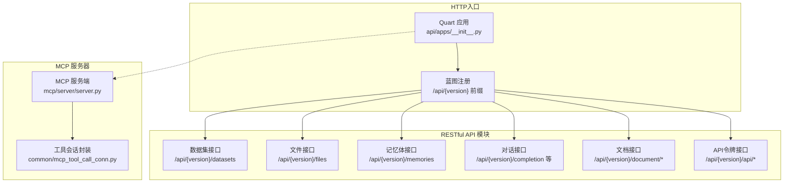
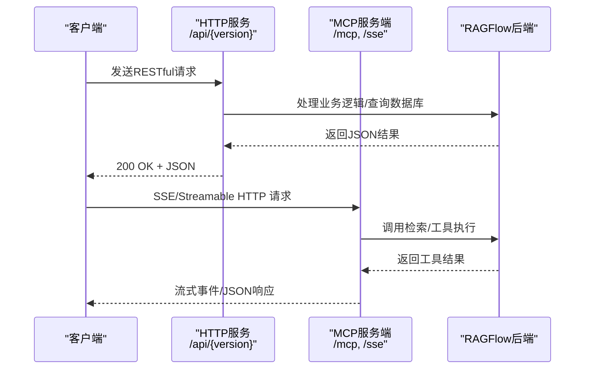
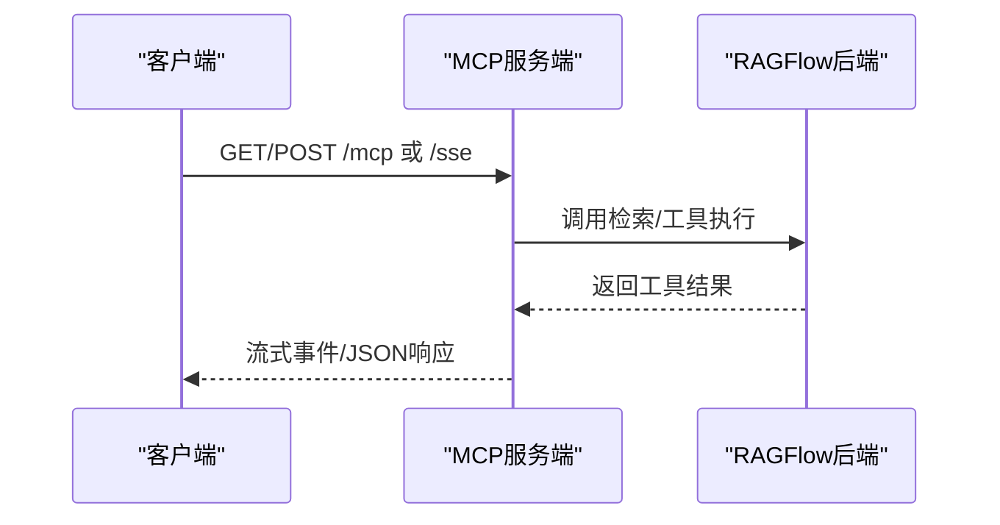
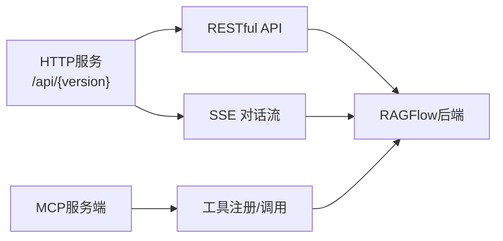

# API接口参考

<cite>
**本文引用的文件**
- [api/apps/__init__.py](file://api/apps/__init__.py)
- [api/apps/mcp_server_app.py](file://api/apps/mcp_server_app.py)
- [mcp/server/server.py](file://mcp/server/server.py)
- [common/mcp_tool_call_conn.py](file://common/mcp_tool_call_conn.py)
- [api/apps/restful_apis/dataset_api.py](file://api/apps/restful_apis/dataset_api.py)
- [api/apps/restful_apis/file_api.py](file://api/apps/restful_apis/file_api.py)
- [api/apps/restful_apis/memory_api.py](file://api/apps/restful_apis/memory_api.py)
- [api/apps/conversation_app.py](file://api/apps/conversation_app.py)
- [api/apps/document_app.py](file://api/apps/document_app.py)
- [api/apps/api_app.py](file://api/apps/api_app.py)
- [api/ragflow_server.py](file://api/ragflow_server.py)
</cite>

## 目录
1. [简介](#简介)
2. [项目结构](#项目结构)
3. [核心组件](#核心组件)
4. [架构总览](#架构总览)
5. [详细组件分析](#详细组件分析)
6. [依赖分析](#依赖分析)
7. [性能考量](#性能考量)
8. [故障排查指南](#故障排查指南)
9. [结论](#结论)
10. [附录](#附录)

## 简介
本参考文档面向RAGFlow后端服务的API接口，覆盖以下三类接口形态：
- RESTful API：基于HTTP的资源型接口，统一通过“/api/{version}”前缀暴露，支持数据管理、对话、检索、知识库与文件操作等。
- WebSocket（SSE）接口：用于流式对话与事件推送，典型场景为对话流式输出。
- MCP（Model Context Protocol）服务器接口：用于工具注册与调用，支持SSE与Streamable HTTP两种传输方式。

文档提供每类接口的端点清单、请求/响应模式、认证方式、参数说明、返回值定义、错误码说明、使用示例、最佳实践与安全建议，并给出常见用例与客户端实现要点。

## 项目结构
RAGFlow后端采用Quart应用作为HTTP入口，通过蓝图（Blueprint）组织各业务模块的路由，统一在“/api/{version}”前缀下发布RESTful API。MCP服务器独立运行于另一套Starlette应用中，提供工具列表与工具调用能力。

图示来源
- [api/apps/__init__.py:270-276](file://api/apps/__init__.py#L270-L276)
- [api/apps/restful_apis/dataset_api.py:34-330](file://api/apps/restful_apis/dataset_api.py#L34-L330)
- [api/apps/restful_apis/file_api.py:43-363](file://api/apps/restful_apis/file_api.py#L43-L363)
- [api/apps/restful_apis/memory_api.py:29-301](file://api/apps/restful_apis/memory_api.py#L29-L301)
- [api/apps/conversation_app.py:169-254](file://api/apps/conversation_app.py#L169-L254)
- [api/apps/document_app.py:67-745](file://api/apps/document_app.py#L67-L745)
- [api/apps/api_app.py:26-118](file://api/apps/api_app.py#L26-L118)
- [mcp/server/server.py:558-646](file://mcp/server/server.py#L558-L646)
- [common/mcp_tool_call_conn.py:42-272](file://common/mcp_tool_call_conn.py#L42-L272)

章节来源
- [api/apps/__init__.py:270-276](file://api/apps/__init__.py#L270-L276)

## 核心组件
- 认证与授权中间件
  - 登录装饰器：对路由进行登录校验，未登录统一返回401。
  - 用户加载：从请求头Authorization解析访问令牌或API Token，注入g.user。
  - 统一错误处理：404/401异常规范化返回。
- RESTful API 蓝图注册：自动扫描并注册各业务模块路由，统一前缀“/api/{version}”。

章节来源
- [api/apps/__init__.py:95-180](file://api/apps/__init__.py#L95-L180)
- [api/apps/__init__.py:279-326](file://api/apps/__init__.py#L279-L326)

## 架构总览
RAGFlow后端由HTTP服务与MCP服务两部分组成：
- HTTP服务：负责RESTful API、SSE流式对话、文件下载等。
- MCP服务：负责工具注册与调用，支持SSE与Streamable HTTP两种传输。

图示来源
- [api/apps/conversation_app.py:224-243](file://api/apps/conversation_app.py#L224-L243)
- [mcp/server/server.py:558-646](file://mcp/server/server.py#L558-L646)

## 详细组件分析

### RESTful API 总览与认证
- 版本前缀：/api/{version}
- 认证方式：
  - Bearer Token：Authorization: Bearer <access_token>（访问令牌）
  - API Token：Authorization: Bearer <api_token>（API密钥令牌）
- 全局错误码：统一返回结构包含code/message/data/error字段，401/404有专门处理器。

章节来源
- [api/apps/__init__.py:95-180](file://api/apps/__init__.py#L95-L180)
- [api/apps/__init__.py:291-320](file://api/apps/__init__.py#L291-L320)

### 数据集接口（/datasets）
- 创建数据集
  - 方法与路径：POST /api/{version}/datasets
  - 认证：Bearer Token
  - 请求体字段：name（必填）、avatar、description、embedding_model、permission、chunk_method、parser_config
  - 成功返回：新建数据集对象
- 删除数据集
  - 方法与路径：DELETE /api/{version}/datasets
  - 参数：ids 或 delete_all
  - 成功返回：删除结果
- 更新数据集
  - 方法与路径：PUT /api/{version}/datasets/{dataset_id}
  - 路径参数：dataset_id
  - 请求体字段：name、avatar、description、embedding_model、permission、chunk_method、pagerank、parser_config
  - 成功返回：更新后的数据集对象
- 列表与过滤
  - 方法与路径：GET /api/{version}/datasets
  - 查询参数：id、name、page、page_size、orderby、desc
  - 成功返回：分页数据与总数
- 知识图谱
  - GET /api/{version}/datasets/{dataset_id}/knowledge_graph
  - DELETE /api/{version}/datasets/{dataset_id}/knowledge_graph
- GraphRAG/RAPTOR
  - POST /api/{version}/datasets/{dataset_id}/run_graphrag
  - GET /api/{version}/datasets/{dataset_id}/trace_graphrag
  - POST /api/{version}/datasets/{dataset_id}/run_raptor
  - GET /api/{version}/datasets/{dataset_id}/trace_raptor
- 自动元数据
  - GET /api/{version}/datasets/{dataset_id}/auto_metadata
  - PUT /api/{version}/datasets/{dataset_id}/auto_metadata

章节来源
- [api/apps/restful_apis/dataset_api.py:34-518](file://api/apps/restful_apis/dataset_api.py#L34-L518)

### 文件接口（/files）
- 上传/创建
  - POST /api/{version}/files
  - 表单上传：multipart/form-data，包含parent_id与file数组
  - JSON创建：创建文件夹（name、parent_id、type）
  - 成功返回：文件/文件夹对象
- 列表
  - GET /api/{version}/files
  - 查询参数：parent_id、keywords、page、page_size、orderby、desc
  - 成功返回：分页列表
- 删除
  - DELETE /api/{version}/files
  - 请求体：ids（数组）
  - 成功返回：删除结果
- 移动/重命名
  - POST /api/{version}/files/move
  - 请求体：src_file_ids（必填）、dest_file_id（可选）、new_name（可选）
  - 成功返回：移动/重命名结果
- 下载
  - GET /api/{version}/files/{file_id}
  - 成功返回：二进制文件流
- 父目录与祖先目录
  - GET /api/{version}/files/{file_id}/parent
  - GET /api/{version}/files/{file_id}/ancestors

章节来源
- [api/apps/restful_apis/file_api.py:43-365](file://api/apps/restful_apis/file_api.py#L43-L365)

### 记忆体接口（/memories）
- 创建记忆体
  - POST /api/{version}/memories
  - 请求体：name、memory_type、embd_id、llm_id、tenant_embd_id、tenant_llm_id
  - 成功返回：创建结果
- 更新/删除
  - PUT /api/{version}/memories/{memory_id}
  - DELETE /api/{version}/memories/{memory_id}
- 列表/配置/消息
  - GET /api/{version}/memories
  - GET /api/{version}/memories/{memory_id}/config
  - GET /api/{version}/memories/{memory_id}
  - POST /api/{version}/messages
  - DELETE /api/{version}/messages/{memory_id}:{message_id}
  - PUT /api/{version}/messages/{memory_id}:{message_id}
  - GET /api/{version}/messages/search
  - GET /api/{version}/messages
  - GET /api/{version}/messages/{memory_id}:{message_id}/content

章节来源
- [api/apps/restful_apis/memory_api.py:29-301](file://api/apps/restful_apis/memory_api.py#L29-L301)

### 对话接口（SSE/流式）
- 设置/获取/删除会话
  - POST /api/{version}/conversation/set
  - GET /api/{version}/conversation/get
  - POST /api/{version}/conversation/rm
  - GET /api/{version}/conversation/list
- 流式补全（SSE）
  - POST /api/{version}/conversation/completion
  - 请求体：conversation_id、messages、llm_id、temperature、top_p、max_tokens等
  - 响应：text/event-stream，逐条返回增量答案，最后一条携带完成标记
- 文本转语音（TTS）
  - POST /api/{version}/conversation/tts
  - 响应：audio/mpeg流
- 音频转文本（ASR）
  - POST /api/{version}/conversation/sequence2txt
  - 支持multipart/form-data与流式事件
- 问答检索
  - POST /api/{version}/conversation/ask
  - 响应：SSE流
- 思维导图
  - POST /api/{version}/conversation/mindmap
- 相关问题
  - POST /api/{version}/conversation/related_questions

章节来源
- [api/apps/conversation_app.py:38-480](file://api/apps/conversation_app.py#L38-L480)

### 文档接口（/document）
- 上传
  - POST /api/{version}/document/upload
  - 表单：kb_id、file（多文件）
  - 成功返回：文件对象列表
- 网页采集
  - POST /api/{version}/document/web_crawl
  - 请求体：kb_id、name、url
  - 成功返回：布尔
- 创建虚拟文档
  - POST /api/{version}/document/create
  - 请求体：name、kb_id
- 列表/过滤
  - POST /api/{version}/document/list
  - 查询参数：kb_id、keywords、page/page_size、orderby、desc、create_time_from/to
  - 请求体：run_status、types、suffix、metadata_condition、metadata、return_empty_metadata
- 文档信息
  - POST /api/{version}/document/infos
  - 请求体：doc_ids
- 元数据汇总/更新
  - POST /api/{version}/document/metadata/summary
  - POST /api/{version}/document/metadata/update
- 元数据设置
  - POST /api/{version}/document/metadata/update_setting
- 状态变更
  - POST /api/{version}/document/change_status
- 删除
  - POST /api/{version}/document/rm
- 运行/重跑/取消
  - POST /api/{version}/document/run
- 重命名
  - POST /api/{version}/document/rename
- 获取/下载
  - GET /api/{version}/document/get/{doc_id}
  - GET /api/{version}/document/download/{attachment_id}
- 缩略图
  - GET /api/{version}/document/thumbnails
- 解析器切换
  - POST /api/{version}/document/change_parser

章节来源
- [api/apps/document_app.py:67-800](file://api/apps/document_app.py#L67-L800)

### API令牌接口（/api）
- 新建令牌
  - POST /api/{version}/api/new_token
  - 请求体：canvas_id 或 dialog_id
  - 成功返回：包含token的对象
- 令牌列表
  - GET /api/{version}/api/token_list
  - 查询参数：dialog_id 或 canvas_id
- 删除令牌
  - POST /api/{version}/api/rm
  - 请求体：tokens、tenant_id
- 统计
  - GET /api/{version}/api/stats
  - 查询参数：from_date、to_date、canvas_id 或 dialog_id

章节来源
- [api/apps/api_app.py:26-118](file://api/apps/api_app.py#L26-L118)

### WebSocket（SSE）与流式对话
- SSE端点
  - GET /api/{version}/conversation/getsse/{dialog_id}
  - 通过Authorization头校验API Token，返回对话配置
- 流式补全
  - POST /api/{version}/conversation/completion
  - 响应头：Cache-control/no-cache、Connection/keep-alive、X-Accel-Buffering/no、Content-Type:text/event-stream; charset=utf-8
  - 事件：data: {...}，最后一条携带完成标记

章节来源
- [api/apps/conversation_app.py:111-129](file://api/apps/conversation_app.py#L111-L129)
- [api/apps/conversation_app.py:224-243](file://api/apps/conversation_app.py#L224-L243)

### MCP 服务器接口
- 传输方式
  - SSE：/messages/ 与 /sse
  - Streamable HTTP：/mcp（GET/POST/DELETE）
- 工具注册
  - list_tools：返回工具列表（当前为ragflow_retrieval）
  - call_tool：根据工具名与参数执行
- 认证
  - self-host模式：启动时指定--api-key，或环境变量RAGFLOW_MCP_HOST_API_KEY
  - host模式：客户端必须在请求头提供Authorization或API Key
- 连接与会话
  - 通过MCPToolCallSession封装SSE/Streamable HTTP客户端，支持超时与并发任务队列
  - 提供批量关闭与全局优雅退出

图示来源
- [mcp/server/server.py:558-646](file://mcp/server/server.py#L558-L646)

章节来源
- [mcp/server/server.py:432-556](file://mcp/server/server.py#L432-L556)
- [common/mcp_tool_call_conn.py:42-272](file://common/mcp_tool_call_conn.py#L42-L272)

## 依赖分析
- HTTP服务与MCP服务解耦：HTTP服务负责REST与SSE，MCP服务独立运行，二者通过RAGFlow后端API进行数据交互。
- 认证链路：HTTP服务通过访问令牌或API Token鉴权；MCP服务在host模式下要求客户端提供Authorization头，在self-host模式下使用启动参数或环境变量。
- 会话与线程：MCP会话在独立事件循环线程中运行，避免阻塞主线程；提供批量关闭与全局优雅退出。

图示来源
- [api/apps/conversation_app.py:224-243](file://api/apps/conversation_app.py#L224-L243)
- [mcp/server/server.py:558-646](file://mcp/server/server.py#L558-L646)

章节来源
- [api/ragflow_server.py:67-72](file://api/ragflow_server.py#L67-L72)
- [common/mcp_tool_call_conn.py:302-312](file://common/mcp_tool_call_conn.py#L302-L312)

## 性能考量
- SSE与长连接：默认启用SSE与Streamable HTTP，适合流式输出与低延迟交互；注意Nginx代理需正确配置缓冲与转发。
- 超时与并发：HTTP服务默认响应超时与请求体超时可按环境变量调整；MCP会话支持超时与队列，避免阻塞。
- 线程池与异步：大量I/O操作通过线程池与异步协程处理，降低阻塞风险。
- 缓存：MCP侧对数据集与文档元数据做缓存，减少重复查询。

章节来源
- [api/apps/__init__.py:69-72](file://api/apps/__init__.py#L69-L72)
- [mcp/server/server.py:58-101](file://mcp/server/server.py#L58-L101)

## 故障排查指南
- 401 未授权
  - 检查Authorization头是否为Bearer Token或API Token
  - 确认令牌有效且未过期
- 404 资源不存在
  - 检查路径参数与查询参数是否正确
- SSE连接失败
  - 确认Nginx代理已正确转发SSE与长连接
  - 检查后端日志中的初始化与超时信息
- MCP工具调用失败
  - 检查MCP服务端启动参数与认证头
  - 查看MCP会话初始化与超时日志

章节来源
- [api/apps/__init__.py:291-320](file://api/apps/__init__.py#L291-L320)
- [api/apps/conversation_app.py:224-243](file://api/apps/conversation_app.py#L224-L243)
- [common/mcp_tool_call_conn.py:80-121](file://common/mcp_tool_call_conn.py#L80-L121)

## 结论
本文档系统梳理了RAGFlow的RESTful API、SSE流式接口与MCP服务器接口，明确了认证方式、端点清单、参数与返回结构，并提供了性能与安全方面的最佳实践。开发者可据此快速集成与扩展RAGFlow能力。

## 附录
- 版本控制：所有RESTful API均通过“/api/{version}”前缀暴露，版本号在应用初始化时确定。
- 速率限制：仓库未内置统一限流策略，建议在网关层或反向代理层实施。
- 安全建议：
  - 使用HTTPS与强密码策略
  - 严格最小权限原则与租户隔离
  - 定期轮换API密钥与访问令牌
  - 对外暴露的MCP服务仅在受控网络内开放