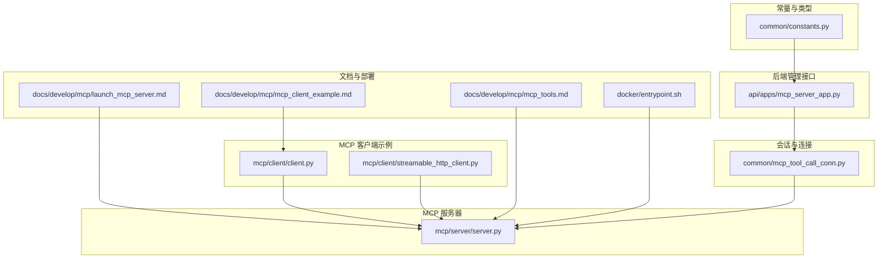
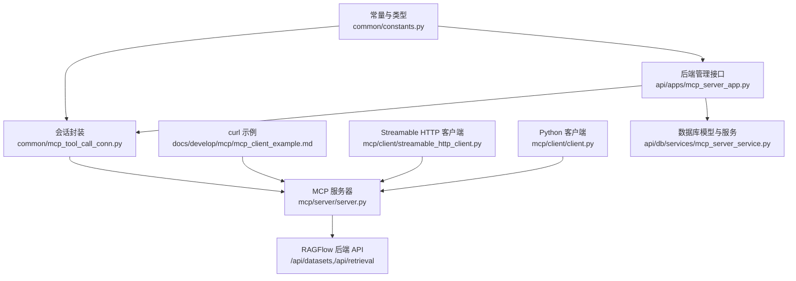
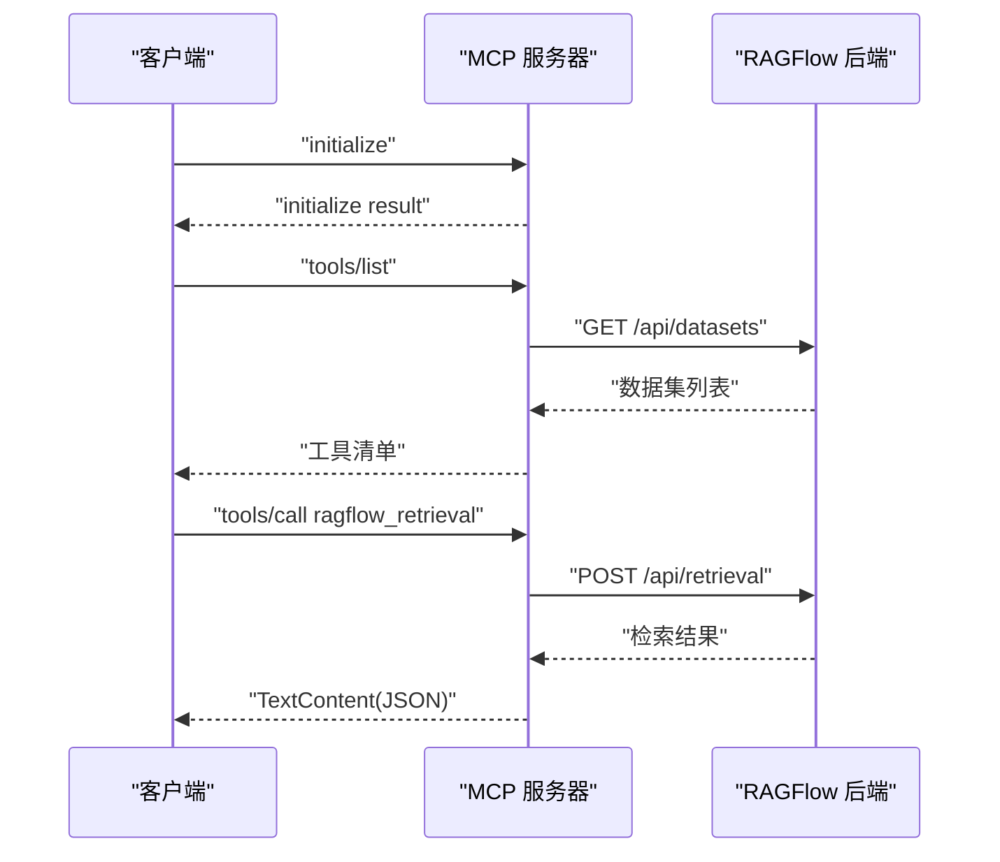
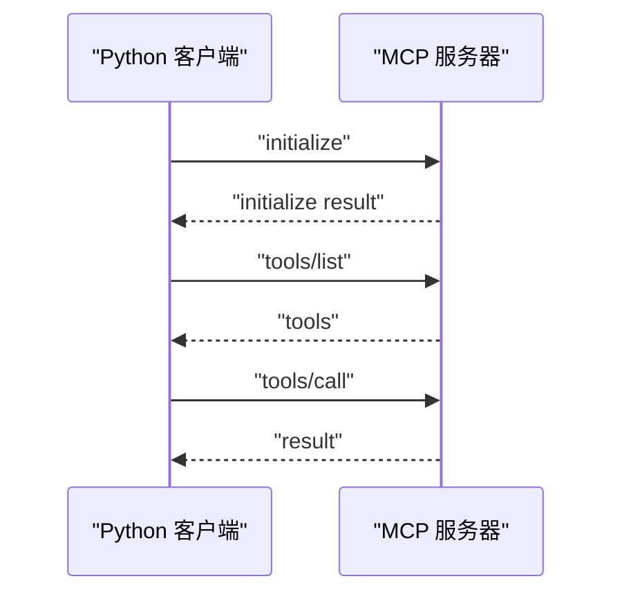
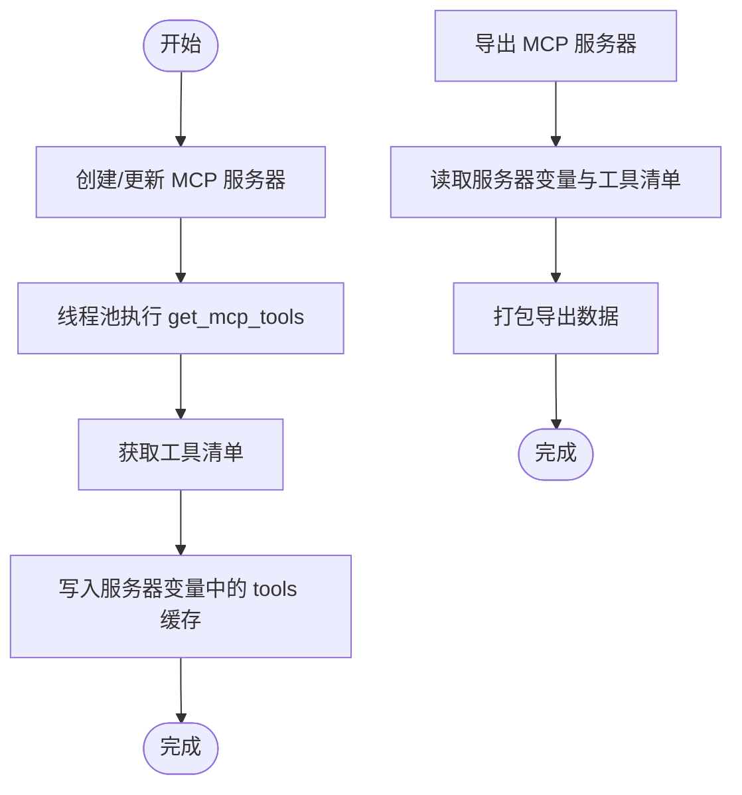
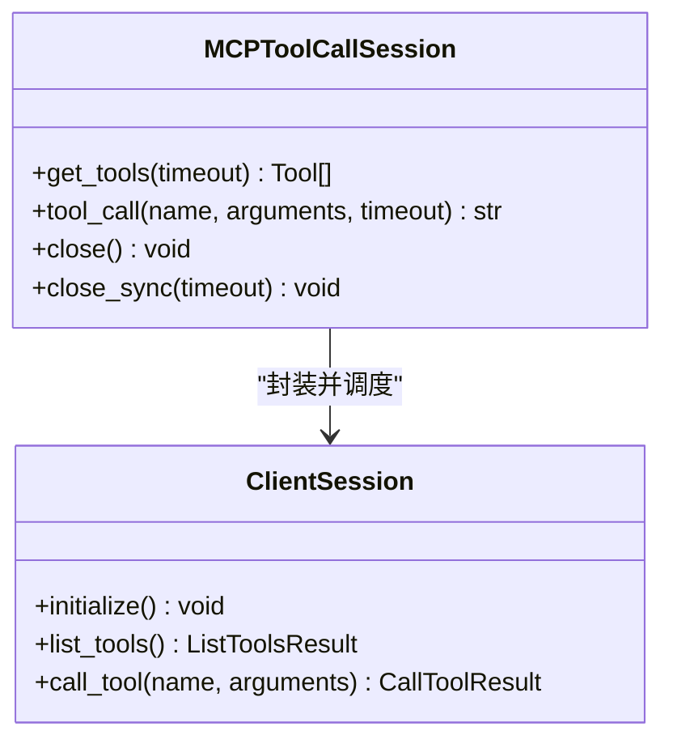
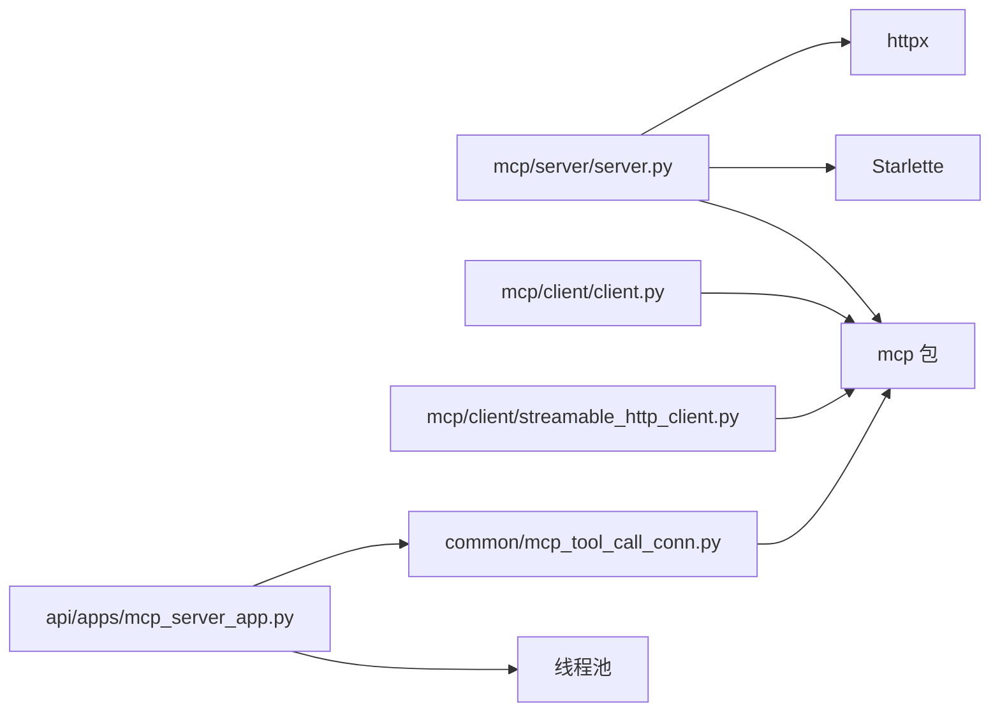

# MCP服务器接口

<cite>
**本文引用的文件**
- [mcp/server/server.py](file://mcp/server/server.py)
- [mcp/client/client.py](file://mcp/client/client.py)
- [mcp/client/streamable_http_client.py](file://mcp/client/streamable_http_client.py)
- [api/apps/mcp_server_app.py](file://api/apps/mcp_server_app.py)
- [common/mcp_tool_call_conn.py](file://common/mcp_tool_call_conn.py)
- [common/constants.py](file://common/constants.py)
- [docs/develop/mcp/launch_mcp_server.md](file://docs/develop/mcp/launch_mcp_server.md)
- [docs/develop/mcp/mcp_client_example.md](file://docs/develop/mcp/mcp_client_example.md)
- [docs/develop/mcp/mcp_tools.md](file://docs/develop/mcp/mcp_tools.md)
- [docker/entrypoint.sh](file://docker/entrypoint.sh)
</cite>

## 目录
1. [简介](#简介)
2. [项目结构](#项目结构)
3. [核心组件](#核心组件)
4. [架构总览](#架构总览)
5. [详细组件分析](#详细组件分析)
6. [依赖关系分析](#依赖关系分析)
7. [性能与可扩展性](#性能与可扩展性)
8. [故障排除指南](#故障排除指南)
9. [结论](#结论)
10. [附录](#附录)

## 简介
本文件为 RAGFlow 的 MCP（Model Context Protocol）服务器接口提供权威参考，覆盖协议规范、工具注册机制、消息格式、生命周期管理、启动配置、工具发现与调用、错误处理、安全与权限控制、客户端实现示例、工具开发指南、调试技巧、版本兼容性与性能监控等内容。读者可据此在 RAGFlow 中集成第三方 MCP 工具，实现检索增强与工具调用。

## 项目结构
围绕 MCP 的相关代码主要分布在以下模块：
- MCP 服务器：提供工具清单与工具调用能力，支持 SSE 与 Streamable HTTP 两种传输方式。
- MCP 客户端示例：提供 Python 与 curl 的使用示例。
- 后端管理接口：用于在 RAGFlow 平台侧注册、导入、导出、测试 MCP 服务器，缓存工具元数据。
- 会话与连接：封装 MCP 客户端会话，统一处理 SSE 与 Streamable HTTP 两类传输。
- 常量与类型：定义 MCP 服务器类型、校验与返回码等。

**图表来源**
- [mcp/server/server.py:1-778](file://mcp/server/server.py#L1-L778)
- [mcp/client/client.py:1-48](file://mcp/client/client.py#L1-L48)
- [mcp/client/streamable_http_client.py:1-41](file://mcp/client/streamable_http_client.py#L1-L41)
- [api/apps/mcp_server_app.py:1-440](file://api/apps/mcp_server_app.py#L1-L440)
- [common/mcp_tool_call_conn.py:1-333](file://common/mcp_tool_call_conn.py#L1-L333)
- [common/constants.py:159-164](file://common/constants.py#L159-L164)
- [docs/develop/mcp/launch_mcp_server.md:1-215](file://docs/develop/mcp/launch_mcp_server.md#L1-L215)
- [docs/develop/mcp/mcp_client_example.md:1-244](file://docs/develop/mcp/mcp_client_example.md#L1-L244)
- [docs/develop/mcp/mcp_tools.md:1-14](file://docs/develop/mcp/mcp_tools.md#L1-L14)
- [docker/entrypoint.sh:66-149](file://docker/entrypoint.sh#L66-L149)

**章节来源**
- [mcp/server/server.py:1-778](file://mcp/server/server.py#L1-L778)
- [mcp/client/client.py:1-48](file://mcp/client/client.py#L1-L48)
- [mcp/client/streamable_http_client.py:1-41](file://mcp/client/streamable_http_client.py#L1-L41)
- [api/apps/mcp_server_app.py:1-440](file://api/apps/mcp_server_app.py#L1-L440)
- [common/mcp_tool_call_conn.py:1-333](file://common/mcp_tool_call_conn.py#L1-L333)
- [common/constants.py:159-164](file://common/constants.py#L159-L164)
- [docs/develop/mcp/launch_mcp_server.md:1-215](file://docs/develop/mcp/launch_mcp_server.md#L1-L215)
- [docs/develop/mcp/mcp_client_example.md:1-244](file://docs/develop/mcp/mcp_client_example.md#L1-L244)
- [docs/develop/mcp/mcp_tools.md:1-14](file://docs/develop/mcp/mcp_tools.md#L1-L14)
- [docker/entrypoint.sh:66-149](file://docker/entrypoint.sh#L66-L149)

## 核心组件
- MCP 服务器（RAGFlow）
  - 提供工具清单与工具调用能力，当前仅提供检索工具。
  - 支持两种传输：SSE（遗留，默认启用）与 Streamable HTTP（默认启用）。
  - 自托管模式与多租户模式（host 模式），通过 API Key 或 Authorization 头进行鉴权。
- MCP 客户端
  - 提供 Python 示例（SSE 与 Streamable HTTP）与 curl 使用示例。
- 后端管理接口
  - 在平台侧注册/更新/删除 MCP 服务器；导入/导出；测试工具与服务器连通性；缓存工具元数据。
- 会话与连接
  - 统一封装 MCP 客户端会话，支持 SSE 与 Streamable HTTP，内置超时与错误处理。
- 常量与类型
  - 定义 MCP 服务器类型、校验与返回码等。

**章节来源**
- [mcp/server/server.py:432-556](file://mcp/server/server.py#L432-L556)
- [mcp/client/client.py:22-42](file://mcp/client/client.py#L22-L42)
- [mcp/client/streamable_http_client.py:20-35](file://mcp/client/streamable_http_client.py#L20-L35)
- [api/apps/mcp_server_app.py:29-123](file://api/apps/mcp_server_app.py#L29-L123)
- [common/mcp_tool_call_conn.py:42-121](file://common/mcp_tool_call_conn.py#L42-L121)
- [common/constants.py:159-164](file://common/constants.py#L159-L164)

## 架构总览
下图展示 MCP 服务器与客户端、后端管理接口以及 RAGFlow 后端的关系与交互路径。

**图表来源**
- [mcp/server/server.py:355-744](file://mcp/server/server.py#L355-L744)
- [mcp/client/client.py:22-42](file://mcp/client/client.py#L22-L42)
- [mcp/client/streamable_http_client.py:20-35](file://mcp/client/streamable_http_client.py#L20-L35)
- [api/apps/mcp_server_app.py:1-440](file://api/apps/mcp_server_app.py#L1-L440)
- [common/mcp_tool_call_conn.py:42-121](file://common/mcp_tool_call_conn.py#L42-L121)
- [common/constants.py:159-164](file://common/constants.py#L159-L164)
- [docs/develop/mcp/mcp_client_example.md:35-244](file://docs/develop/mcp/mcp_client_example.md#L35-L244)

## 详细组件分析

### MCP 服务器（RAGFlow）
- 启动与运行
  - 支持命令行参数与环境变量配置，包括监听地址、端口、后端基础 URL、启动模式（self-host/host）、传输开关与 JSON 响应模式。
  - 默认同时启用 SSE 与 Streamable HTTP，若两者均禁用则自动启用 Streamable HTTP。
- 生命周期与上下文
  - 使用 lifespan 管理连接器资源，确保关闭时释放异步 HTTP 客户端。
- 认证与授权
  - 自托管模式：启动时需提供 API Key；host 模式：每个请求必须携带有效的 API Key 或 Bearer Token。
  - 支持从请求头提取 api_key、Authorization 等多种键名。
- 工具注册与输入模式
  - 当前仅注册一个检索工具，描述中包含可用数据集列表（id 与 description）。
  - 输入 Schema 包含分页、相似度阈值、向量权重、关键词搜索、重排模型、强制刷新等参数。
- 请求处理与响应
  - 工具调用时，若未指定数据集 ID，则自动拉取全部可用数据集 ID 进行检索。
  - 返回内容为文本型结构化结果，包含分块、分页信息与查询信息。
- 缓存策略
  - 对数据集元数据与文档元数据进行 LRU 缓存，带 TTL，避免重复拉取。
- 传输层
  - SSE：/sse 与 /messages/ 路由。
  - Streamable HTTP：/mcp GET/POST/DELETE 与 /mcp 挂载路由。
  - 可按需启用或禁用，支持 JSON 响应或 SSE 风格事件。

**图表来源**
- [mcp/server/server.py:432-556](file://mcp/server/server.py#L432-L556)
- [mcp/server/server.py:130-245](file://mcp/server/server.py#L130-L245)
- [docs/develop/mcp/mcp_client_example.md:35-174](file://docs/develop/mcp/mcp_client_example.md#L35-L174)

**章节来源**
- [mcp/server/server.py:38-778](file://mcp/server/server.py#L38-L778)
- [docs/develop/mcp/mcp_client_example.md:35-174](file://docs/develop/mcp/mcp_client_example.md#L35-L174)

### MCP 客户端（Python 与 curl）
- Python 客户端
  - 提供 SSE 与 Streamable HTTP 两种示例，展示初始化、列出工具与调用工具的完整流程。
  - host 模式下可在请求头中携带 api_key 或 Authorization。
- curl 示例
  - 展示初始化、initialized 通知、tools/list、tools/call 的完整交互序列。
  - 强调每个请求需要携带会话 ID 与 API Key。

**图表来源**
- [mcp/client/client.py:22-42](file://mcp/client/client.py#L22-L42)
- [mcp/client/streamable_http_client.py:20-35](file://mcp/client/streamable_http_client.py#L20-L35)
- [docs/develop/mcp/mcp_client_example.md:35-244](file://docs/develop/mcp/mcp_client_example.md#L35-L244)

**章节来源**
- [mcp/client/client.py:22-42](file://mcp/client/client.py#L22-L42)
- [mcp/client/streamable_http_client.py:20-35](file://mcp/client/streamable_http_client.py#L20-L35)
- [docs/develop/mcp/mcp_client_example.md:15-244](file://docs/develop/mcp/mcp_client_example.md#L15-L244)

### 后端管理接口（平台侧）
- 功能概览
  - 列表、详情、创建、更新、删除 MCP 服务器。
  - 导入/导出：支持批量导入，自动去重与重命名。
  - 测试：测试服务器连通性与工具清单。
  - 工具缓存：将工具元数据缓存到服务器变量中，便于前端启用/禁用。
- 关键流程
  - 创建/更新时，调用线程池执行工具发现，解析工具清单并写回服务器变量。
  - 测试工具时，临时建立会话进行调用并返回结果。
  - 导出时保留工具清单与认证令牌等关键字段。

**图表来源**
- [api/apps/mcp_server_app.py:70-123](file://api/apps/mcp_server_app.py#L70-L123)
- [api/apps/mcp_server_app.py:199-263](file://api/apps/mcp_server_app.py#L199-L263)
- [api/apps/mcp_server_app.py:298-342](file://api/apps/mcp_server_app.py#L298-L342)

**章节来源**
- [api/apps/mcp_server_app.py:29-440](file://api/apps/mcp_server_app.py#L29-L440)

### 会话与连接（统一客户端会话）
- 传输类型
  - SSE 与 Streamable HTTP 两种传输类型，分别对应不同的客户端封装。
- 任务队列与事件循环
  - 使用 asyncio 队列与线程池事件循环，串行处理 list_tools 与 tool_call 任务。
- 错误处理与超时
  - 初始化超时、任务超时、连接失败与认证错误均有明确提示。
- 关闭与清理
  - 提供同步/异步关闭方法，清理队列与事件循环，全局实例弱引用跟踪。

**图表来源**
- [common/mcp_tool_call_conn.py:42-272](file://common/mcp_tool_call_conn.py#L42-L272)

**章节来源**
- [common/mcp_tool_call_conn.py:1-333](file://common/mcp_tool_call_conn.py#L1-L333)

### 常量与类型
- MCP 服务器类型
  - SSE 与 Streamable HTTP 两种类型，作为后端管理接口与前端 UI 的枚举依据。
- 校验与返回码
  - 定义通用返回码与状态枚举，便于统一错误处理。

**章节来源**
- [common/constants.py:159-164](file://common/constants.py#L159-L164)

## 依赖关系分析
- 服务器端依赖
  - mcp 包：提供 ClientSession、SSE 与 Streamable HTTP 客户端封装。
  - Starlette：构建路由与中间件，支持 SSE 与 Streamable HTTP。
  - httpx：异步 HTTP 客户端，访问 RAGFlow 后端 API。
- 客户端依赖
  - mcp 包：统一的客户端会话与传输封装。
- 后端管理接口依赖
  - 线程池：并发执行工具发现与测试。
  - 会话封装：统一调用 MCP 服务器。

**图表来源**
- [mcp/server/server.py:27-35](file://mcp/server/server.py#L27-L35)
- [mcp/client/client.py:18-19](file://mcp/client/client.py#L18-L19)
- [mcp/client/streamable_http_client.py:16-17](file://mcp/client/streamable_http_client.py#L16-L17)
- [api/apps/mcp_server_app.py:24-27](file://api/apps/mcp_server_app.py#L24-L27)
- [common/mcp_tool_call_conn.py:28-32](file://common/mcp_tool_call_conn.py#L28-L32)

**章节来源**
- [mcp/server/server.py:17-35](file://mcp/server/server.py#L17-L35)
- [mcp/client/client.py:18-19](file://mcp/client/client.py#L18-L19)
- [mcp/client/streamable_http_client.py:16-17](file://mcp/client/streamable_http_client.py#L16-L17)
- [api/apps/mcp_server_app.py:24-27](file://api/apps/mcp_server_app.py#L24-L27)
- [common/mcp_tool_call_conn.py:28-32](file://common/mcp_tool_call_conn.py#L28-L32)

## 性能与可扩展性
- 缓存策略
  - 数据集与文档元数据采用 LRU 缓存与 TTL，减少重复拉取，提升工具发现与检索效率。
- 传输选择
  - Streamable HTTP 默认启用，具备更好的吞吐与稳定性；SSE 为遗留传输，建议在新环境中优先使用 Streamable HTTP。
- 超时与并发
  - 客户端会话与后端管理接口均设置超时，避免阻塞；线程池用于并发执行工具发现与测试。
- 扩展点
  - 服务器端可通过注册新的工具函数扩展能力；客户端会话支持统一的任务队列与事件循环，便于接入更多工具。

**章节来源**
- [mcp/server/server.py:58-130](file://mcp/server/server.py#L58-L130)
- [common/mcp_tool_call_conn.py:160-196](file://common/mcp_tool_call_conn.py#L160-L196)
- [api/apps/mcp_server_app.py:108-123](file://api/apps/mcp_server_app.py#L108-L123)

## 故障排除指南
- 启动与部署
  - 若未启用 MCP 服务器，请在 Docker 启动参数中添加相应标志；确认后端 RAGFlow 服务正常运行。
- 认证问题
  - 自托管模式需提供 API Key；host 模式需在请求头中携带 api_key 或 Authorization。
  - SSE 与 Streamable HTTP 均支持上述两种认证方式。
- 连接与超时
  - 客户端初始化与工具调用均设置超时，若超时请检查网络与后端负载。
  - 会话封装提供详细的异常日志与错误提示，便于定位问题。
- 工具不可用
  - 确认已正确创建/更新 MCP 服务器并缓存工具清单；如需重新发现，可触发更新操作。
- 传输问题
  - 若 SSE 不工作，优先启用 Streamable HTTP；若禁用两者，服务器将自动启用 Streamable HTTP。

**章节来源**
- [docs/develop/mcp/launch_mcp_server.md:197-215](file://docs/develop/mcp/launch_mcp_server.md#L197-L215)
- [docs/develop/mcp/mcp_client_example.md:19-33](file://docs/develop/mcp/mcp_client_example.md#L19-L33)
- [common/mcp_tool_call_conn.py:80-116](file://common/mcp_tool_call_conn.py#L80-L116)
- [api/apps/mcp_server_app.py:108-123](file://api/apps/mcp_server_app.py#L108-L123)

## 结论
RAGFlow 的 MCP 服务器以简洁稳定的架构实现了检索工具的注册与调用，支持 SSE 与 Streamable HTTP 两种传输方式，并提供了完善的认证、缓存、超时与错误处理机制。后端管理接口进一步增强了平台侧的可运维性与可观测性。基于本文档，用户可快速完成 MCP 服务器的部署与集成，安全地在 RAGFlow 中使用第三方工具。

## 附录

### MCP 协议与消息格式
- 初始化与通知
  - initialize：客户端发送协议版本与能力，服务器返回支持的协议版本与能力。
  - initialized：客户端确认就绪。
- 工具发现与调用
  - tools/list：获取工具清单。
  - tools/call：调用指定工具，返回结构化结果。
- 传输
  - SSE：/sse 与 /messages/。
  - Streamable HTTP：/mcp。

**章节来源**
- [docs/develop/mcp/mcp_client_example.md:35-174](file://docs/develop/mcp/mcp_client_example.md#L35-L174)
- [mcp/server/server.py:558-646](file://mcp/server/server.py#L558-L646)

### 工具注册机制与输入模式
- 工具名称与描述
  - 当前仅注册检索工具，描述中包含可用数据集列表。
- 输入 Schema
  - 支持数据集 ID、文档 ID、问题、分页、相似度阈值、向量权重、关键词搜索、top_k、重排模型、强制刷新等参数。

**章节来源**
- [mcp/server/server.py:432-501](file://mcp/server/server.py#L432-L501)

### 生命周期管理
- 服务器生命周期
  - 使用 lifespan 管理连接器资源，确保关闭时释放异步 HTTP 客户端。
- 客户端会话生命周期
  - 通过队列与事件循环串行处理任务；提供同步/异步关闭方法，清理资源。

**章节来源**
- [mcp/server/server.py:343-353](file://mcp/server/server.py#L343-L353)
- [common/mcp_tool_call_conn.py:227-272](file://common/mcp_tool_call_conn.py#L227-L272)

### 启动配置与环境变量
- 命令行参数
  - --host、--port、--base-url、--mode、--api-key、--transport-sse-enabled、--transport-streamable-http-enabled、--json-response。
- 环境变量
  - RAGFLOW_MCP_HOST、RAGFLOW_MCP_PORT、RAGFLOW_MCP_BASE_URL、RAGFLOW_MCP_LAUNCH_MODE、RAGFLOW_MCP_HOST_API_KEY、RAGFLOW_MCP_TRANSPORT_SSE_ENABLED、RAGFLOW_MCP_TRANSPORT_STREAMABLE_ENABLED、RAGFLOW_MCP_JSON_RESPONSE。
- Docker 启动参数
  - --enable-mcpserver、--mcp-host、--mcp-port、--mcp-base-url、--mcp-mode、--mcp-host-api-key、--mcp-script-path、--no-transport-sse-enabled、--no-transport-streamable-http-enabled、--no-json-response。

**章节来源**
- [mcp/server/server.py:649-744](file://mcp/server/server.py#L649-L744)
- [docker/entrypoint.sh:93-128](file://docker/entrypoint.sh#L93-L128)
- [docs/develop/mcp/launch_mcp_server.md:44-112](file://docs/develop/mcp/launch_mcp_server.md#L44-L112)

### 工具发现与缓存
- 工具发现
  - 后端管理接口通过线程池执行工具发现，解析工具清单并写回服务器变量。
- 工具缓存
  - 将工具清单缓存在服务器变量中，便于前端启用/禁用与快速展示。

**章节来源**
- [api/apps/mcp_server_app.py:108-123](file://api/apps/mcp_server_app.py#L108-L123)
- [api/apps/mcp_server_app.py:377-399](file://api/apps/mcp_server_app.py#L377-L399)

### 请求响应模式
- SSE
  - /sse 与 /messages/ 路由，支持初始化、工具列表与工具调用。
- Streamable HTTP
  - /mcp GET/POST/DELETE 与 /mcp 挂载路由，支持 JSON 响应或 SSE 风格事件。

**章节来源**
- [mcp/server/server.py:588-646](file://mcp/server/server.py#L588-L646)

### 错误处理机制
- 认证错误
  - 缺少或无效的 Authorization 头时返回 401。
- 初始化与工具调用超时
  - 客户端会话与后端管理接口均设置超时，超时抛出异常或返回错误信息。
- 连接失败
  - SSE 与 Streamable HTTP 均有连接失败的异常处理与错误提示。

**章节来源**
- [mcp/server/server.py:564-586](file://mcp/server/server.py#L564-L586)
- [common/mcp_tool_call_conn.py:80-116](file://common/mcp_tool_call_conn.py#L80-L116)

### 安全与权限控制
- 认证方式
  - 支持 api_key 与 Authorization（Bearer）两种方式。
- 模式差异
  - 自托管模式：启动时提供 API Key；host 模式：每个请求必须携带 API Key。
- 建议
  - 在公共环境建议绑定到本地回环地址，避免暴露至公网。

**章节来源**
- [mcp/server/server.py:365-406](file://mcp/server/server.py#L365-L406)
- [docs/develop/mcp/launch_mcp_server.md:197-215](file://docs/develop/mcp/launch_mcp_server.md#L197-L215)

### 客户端实现示例
- Python（SSE 与 Streamable HTTP）
  - 展示初始化、列出工具与调用工具的完整流程。
- curl
  - 展示初始化、initialized 通知、tools/list、tools/call 的完整交互序列。

**章节来源**
- [mcp/client/client.py:22-42](file://mcp/client/client.py#L22-L42)
- [mcp/client/streamable_http_client.py:20-35](file://mcp/client/streamable_http_client.py#L20-L35)
- [docs/develop/mcp/mcp_client_example.md:15-244](file://docs/develop/mcp/mcp_client_example.md#L15-L244)

### 工具开发指南
- 新增工具
  - 在服务器端注册新的工具函数，定义输入 Schema 与描述。
  - 在工具调用分支中实现具体逻辑，必要时调用 RAGFlow 后端 API。
- 元数据缓存
  - 对于频繁使用的外部数据（如数据集/文档元数据），建议实现缓存与 TTL。
- 安全与权限
  - 明确工具的访问范围与权限边界，遵循最小权限原则。

**章节来源**
- [mcp/server/server.py:432-556](file://mcp/server/server.py#L432-L556)
- [mcp/server/server.py:58-130](file://mcp/server/server.py#L58-L130)

### 调试技巧
- 日志
  - 服务器端打印启动信息与关闭信息；会话封装记录初始化与任务处理日志。
- 超时与错误
  - 使用线程池与超时参数，结合异常捕获定位问题。
- 传输验证
  - 优先使用 Streamable HTTP；若 SSE 不可用，检查路由与中间件配置。

**章节来源**
- [mcp/server/server.py:347-352](file://mcp/server/server.py#L347-L352)
- [common/mcp_tool_call_conn.py:80-116](file://common/mcp_tool_call_conn.py#L80-L116)

### 版本兼容性
- 协议版本
  - 初始化响应中包含协议版本号，客户端需与服务器兼容。
- 传输演进
  - SSE 为遗留传输，建议优先使用 Streamable HTTP。

**章节来源**
- [docs/develop/mcp/mcp_client_example.md:100-105](file://docs/develop/mcp/mcp_client_example.md#L100-L105)
- [mcp/server/server.py:588-646](file://mcp/server/server.py#L588-L646)