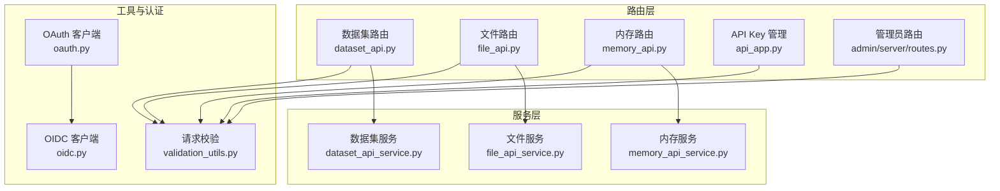
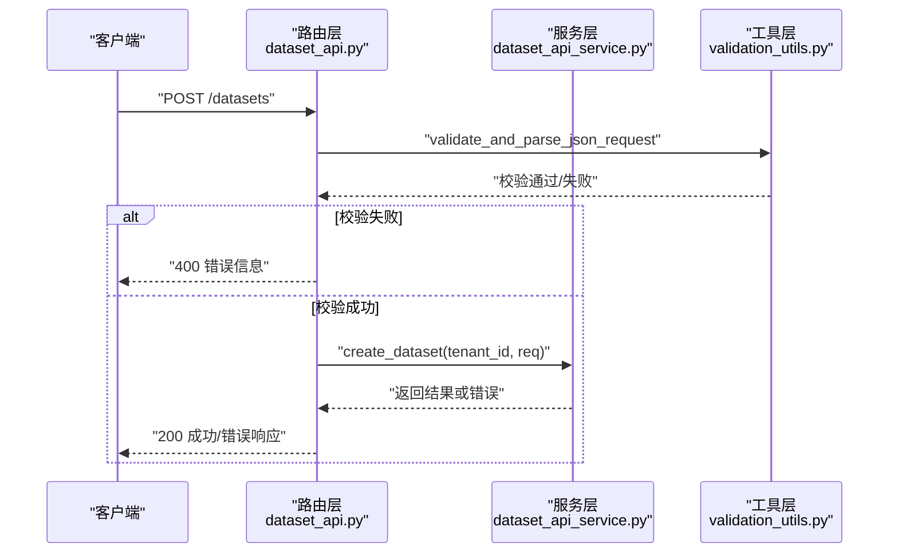
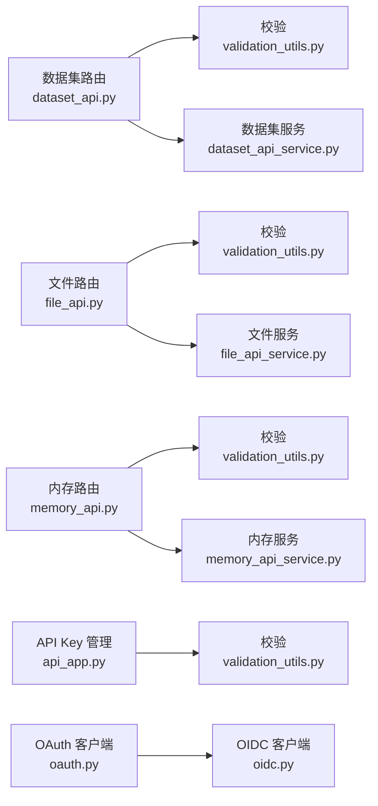

# RESTful API

<cite>
**本文引用的文件**
- [dataset_api.py](file://api/apps/restful_apis/dataset_api.py)
- [file_api.py](file://api/apps/restful_apis/file_api.py)
- [memory_api.py](file://api/apps/restful_apis/memory_api.py)
- [oauth.py](file://api/apps/auth/oauth.py)
- [oidc.py](file://api/apps/auth/oidc.py)
- [dataset_api_service.py](file://api/apps/services/dataset_api_service.py)
- [file_api_service.py](file://api/apps/services/file_api_service.py)
- [memory_api_service.py](file://api/apps/services/memory_api_service.py)
- [validation_utils.py](file://api/utils/validation_utils.py)
- [api_app.py](file://api/apps/api_app.py)
- [routes.py](file://admin/server/routes.py)
</cite>

## 目录
1. [简介](#简介)
2. [项目结构](#项目结构)
3. [核心组件](#核心组件)
4. [架构总览](#架构总览)
5. [详细组件分析](#详细组件分析)
6. [依赖分析](#依赖分析)
7. [性能考虑](#性能考虑)
8. [故障排查指南](#故障排查指南)
9. [结论](#结论)
10. [附录](#附录)

## 简介
本文件为 RAGFlow 的 RESTful API 参考文档，覆盖数据集管理、文件管理、内存管理与认证相关的核心接口。内容包括：
- 所有 HTTP 端点的 URL 模式、HTTP 方法、请求参数、响应格式与状态码
- 请求体结构、查询参数、响应数据格式与错误码定义
- 认证机制（API Key、OAuth、OIDC）与请求头要求
- 数据验证规则、错误处理策略与最佳实践
- 使用示例（curl 与多语言客户端调用）

## 项目结构
RAGFlow 的 RESTful API 主要由以下模块构成：
- 路由层：各业务模块的 Quart 蓝图路由（数据集、文件、内存）
- 服务层：封装具体业务逻辑（数据集、文件、内存服务）
- 工具层：统一的请求解析、校验与响应封装
- 认证层：API Key 生成与管理、OAuth/OIDC 客户端

图表来源
- [dataset_api.py:34-518](file://api/apps/restful_apis/dataset_api.py#L34-L518)
- [file_api.py:43-365](file://api/apps/restful_apis/file_api.py#L43-L365)
- [memory_api.py:29-301](file://api/apps/restful_apis/memory_api.py#L29-L301)
- [dataset_api_service.py:33-614](file://api/apps/services/dataset_api_service.py#L33-L614)
- [file_api_service.py:32-398](file://api/apps/services/file_api_service.py#L32-L398)
- [memory_api_service.py:32-344](file://api/apps/services/memory_api_service.py#L32-L344)
- [validation_utils.py:38-189](file://api/utils/validation_utils.py#L38-L189)
- [oauth.py:32-152](file://api/apps/auth/oauth.py#L32-L152)
- [oidc.py:22-108](file://api/apps/auth/oidc.py#L22-L108)
- [api_app.py:26-118](file://api/apps/api_app.py#L26-L118)
- [routes.py:34-655](file://admin/server/routes.py#L34-L655)

章节来源
- [dataset_api.py:34-518](file://api/apps/restful_apis/dataset_api.py#L34-L518)
- [file_api.py:43-365](file://api/apps/restful_apis/file_api.py#L43-L365)
- [memory_api.py:29-301](file://api/apps/restful_apis/memory_api.py#L29-L301)
- [dataset_api_service.py:33-614](file://api/apps/services/dataset_api_service.py#L33-L614)
- [file_api_service.py:32-398](file://api/apps/services/file_api_service.py#L32-L398)
- [memory_api_service.py:32-344](file://api/apps/services/memory_api_service.py#L32-L344)
- [validation_utils.py:38-189](file://api/utils/validation_utils.py#L38-L189)
- [oauth.py:32-152](file://api/apps/auth/oauth.py#L32-L152)
- [oidc.py:22-108](file://api/apps/auth/oidc.py#L22-L108)
- [api_app.py:26-118](file://api/apps/api_app.py#L26-L118)
- [routes.py:34-655](file://admin/server/routes.py#L34-L655)

## 核心组件
- 数据集管理：创建、删除、更新、列表、知识图谱、GraphRAG/RAPTOR 运行与追踪、自动元数据配置
- 文件管理：上传/创建文件夹、列出、删除、移动/重命名、下载、父目录与祖先目录查询
- 内存管理：创建、更新、删除、列表、配置读取、消息增删改查、检索
- 认证与授权：API Key 生成与管理、OAuth/OIDC 登录流程

章节来源
- [dataset_api.py:34-518](file://api/apps/restful_apis/dataset_api.py#L34-L518)
- [file_api.py:43-365](file://api/apps/restful_apis/file_api.py#L43-L365)
- [memory_api.py:29-301](file://api/apps/restful_apis/memory_api.py#L29-L301)
- [api_app.py:26-118](file://api/apps/api_app.py#L26-L118)
- [routes.py:34-655](file://admin/server/routes.py#L34-L655)

## 架构总览
RAGFlow 的 API 采用“路由层-服务层-工具层”的分层设计。路由层负责接收请求并进行鉴权与参数解析；服务层执行业务逻辑；工具层提供统一的校验与响应封装。

图表来源
- [dataset_api.py:93-107](file://api/apps/restful_apis/dataset_api.py#L93-L107)
- [dataset_api_service.py:33-91](file://api/apps/services/dataset_api_service.py#L33-L91)
- [validation_utils.py:38-114](file://api/utils/validation_utils.py#L38-L114)

## 详细组件分析

### 数据集管理 API
- 认证方式：需要在请求头中携带 Authorization: Bearer <API Key>
- 鉴权装饰器：login_required；租户上下文注入：add_tenant_id_to_kwargs
- 请求体与查询参数均通过 Pydantic 校验，错误统一格式化

端点一览
- POST /datasets
  - 功能：创建数据集
  - 请求体字段（节选）：name、avatar(base64)、description、embedding_model、permission(me/team)、chunk_method、parser_config、auto_metadata_config、ext
  - 响应：data 字段包含新建数据集详情
  - 状态码：200 成功；400 参数错误；500 内部错误
  - 参考路径：[dataset_api.py:34-108](file://api/apps/restful_apis/dataset_api.py#L34-L108)、[validation_utils.py:394-670](file://api/utils/validation_utils.py#L394-L670)

- DELETE /datasets
  - 功能：批量删除或清空删除数据集
  - 请求体字段：ids（可为 null/数组/空数组），delete_all（布尔）
  - 响应：包含成功计数与可能的错误摘要
  - 状态码：200 成功；400 参数错误；500 内部错误
  - 参考路径：[dataset_api.py:110-166](file://api/apps/restful_apis/dataset_api.py#L110-L166)、[validation_utils.py:684-762](file://api/utils/validation_utils.py#L684-L762)

- PUT /datasets/{dataset_id}
  - 功能：更新数据集
  - 路径参数：dataset_id（UUID1）
  - 请求体字段（节选）：name、avatar、description、embedding_model、permission、chunk_method、pagerank、parser_config、auto_metadata_config、connectors、ext
  - 响应：data 字段包含更新后的数据集详情
  - 状态码：200 成功；400 参数错误；500 内部错误
  - 参考路径：[dataset_api.py:169-253](file://api/apps/restful_apis/dataset_api.py#L169-L253)、[validation_utils.py:671-682](file://api/utils/validation_utils.py#L671-L682)

- GET /datasets
  - 功能：分页列出数据集
  - 查询参数：id、name、page、page_size、orderby、desc、ext（JSON 字符串）
  - 响应：data 列表与 total 总数
  - 状态码：200 成功；400 参数错误；500 内部错误
  - 参考路径：[dataset_api.py:256-330](file://api/apps/restful_apis/dataset_api.py#L256-L330)、[validation_utils.py:781-784](file://api/utils/validation_utils.py#L781-L784)

- GET /datasets/{dataset_id}/knowledge_graph
  - 功能：获取数据集的知识图谱
  - 响应：graph 与 mind_map 结构
  - 状态码：200 成功；401 未授权；500 内部错误
  - 参考路径：[dataset_api.py:333-368](file://api/apps/restful_apis/dataset_api.py#L333-L368)

- DELETE /datasets/{dataset_id}/knowledge_graph
  - 功能：删除数据集的知识图谱
  - 响应：布尔值
  - 状态码：200 成功；401 未授权；500 内部错误
  - 参考路径：[dataset_api.py:352-368](file://api/apps/restful_apis/dataset_api.py#L352-L368)

- POST /datasets/{dataset_id}/run_graphrag
  - 功能：触发 GraphRAG 任务
  - 响应：graphrag_task_id
  - 状态码：200 成功；400 缺少参数/无效；401 未授权；500 内部错误
  - 参考路径：[dataset_api.py:371-383](file://api/apps/restful_apis/dataset_api.py#L371-L383)

- GET /datasets/{dataset_id}/trace_graphrag
  - 功能：追踪 GraphRAG 任务进度
  - 响应：任务详情
  - 状态码：200 成功；400 缺少参数/无效；401 未授权；500 内部错误
  - 参考路径：[dataset_api.py:386-398](file://api/apps/restful_apis/dataset_api.py#L386-L398)

- POST /datasets/{dataset_id}/run_raptor
  - 功能：触发 RAPTOR 任务
  - 响应：raptor_task_id
  - 状态码：200 成功；400 缺少参数/无效；401 未授权；500 内部错误
  - 参考路径：[dataset_api.py:401-413](file://api/apps/restful_apis/dataset_api.py#L401-L413)

- GET /datasets/{dataset_id}/trace_raptor
  - 功能：追踪 RAPTOR 任务进度
  - 响应：任务详情
  - 状态码：200 成功；400 缺少参数/无效；401 未授权；500 内部错误
  - 参考路径：[dataset_api.py:416-428](file://api/apps/restful_apis/dataset_api.py#L416-L428)

- GET /datasets/{dataset_id}/auto_metadata
  - 功能：获取自动元数据配置
  - 响应：enabled 与 fields 列表
  - 状态码：200 成功；400 参数错误；500 内部错误
  - 参考路径：[dataset_api.py:431-467](file://api/apps/restful_apis/dataset_api.py#L431-L467)、[validation_utils.py:370-375](file://api/utils/validation_utils.py#L370-L375)

- PUT /datasets/{dataset_id}/auto_metadata
  - 功能：更新自动元数据配置
  - 请求体字段：enabled、fields（name/type/description/examples/restrict_values）
  - 响应：更新后的 enabled 与 fields
  - 状态码：200 成功；400 参数错误；500 内部错误
  - 参考路径：[dataset_api.py:470-517](file://api/apps/restful_apis/dataset_api.py#L470-L517)、[validation_utils.py:360-375](file://api/utils/validation_utils.py#L360-L375)

请求体与查询参数校验
- JSON 校验：validate_and_parse_json_request
- 查询参数校验：validate_and_parse_request_args
- 错误格式化：format_validation_error_message
- 参考路径：[validation_utils.py:38-189](file://api/utils/validation_utils.py#L38-L189)

章节来源
- [dataset_api.py:34-518](file://api/apps/restful_apis/dataset_api.py#L34-L518)
- [dataset_api_service.py:33-614](file://api/apps/services/dataset_api_service.py#L33-L614)
- [validation_utils.py:38-189](file://api/utils/validation_utils.py#L38-L189)

### 文件管理 API
- 认证方式：Authorization: Bearer <API Key>
- 支持 multipart/form-data 上传与 JSON 创建文件夹两种模式

端点一览
- POST /files
  - 功能：上传文件或多文件夹创建
  - Content-Type：multipart/form-data 或 application/json
  - 上传时表单字段：parent_id（可选）、file（必填，多文件）
  - JSON 创建时字段：name、parent_id、type
  - 响应：上传/创建结果列表
  - 状态码：200 成功；400 参数错误；500 内部错误
  - 参考路径：[file_api.py:43-96](file://api/apps/restful_apis/file_api.py#L43-L96)、[validation_utils.py:788-791](file://api/utils/validation_utils.py#L788-L791)

- GET /files
  - 功能：列出指定目录下的文件
  - 查询参数：parent_id、keywords、page、page_size、orderby、desc
  - 响应：files 列表、total 总数、parent_folder
  - 状态码：200 成功；400 参数错误；500 内部错误
  - 参考路径：[file_api.py:99-151](file://api/apps/restful_apis/file_api.py#L99-L151)、[validation_utils.py:765-784](file://api/utils/validation_utils.py#L765-L784)

- DELETE /files
  - 功能：删除文件/文件夹（支持多选）
  - 请求体字段：ids（至少一个）
  - 响应：布尔或成功标记
  - 状态码：200 成功；400 参数错误；500 内部错误
  - 参考路径：[file_api.py:154-195](file://api/apps/restful_apis/file_api.py#L154-L195)、[validation_utils.py:794-795](file://api/utils/validation_utils.py#L794-L795)

- POST /files/move
  - 功能：移动/重命名文件（Linux mv 语义）
  - 请求体字段：src_file_ids（至少一个）、dest_file_id（可选）、new_name（可选，单文件）
  - 响应：布尔
  - 状态码：200 成功；400 参数错误；500 内部错误
  - 参考路径：[file_api.py:199-252](file://api/apps/restful_apis/file_api.py#L199-L252)、[validation_utils.py:798-800](file://api/utils/validation_utils.py#L798-L800)

- GET /files/{file_id}
  - 功能：下载文件（二进制流）
  - 响应：application/octet-stream
  - 状态码：200 成功；404 未找到；500 内部错误
  - 参考路径：[file_api.py:255-300](file://api/apps/restful_apis/file_api.py#L255-L300)

- GET /files/{file_id}/parent
  - 功能：获取文件的父目录
  - 响应：parent_folder
  - 状态码：200 成功；404 未找到；500 内部错误
  - 参考路径：[file_api.py:303-331](file://api/apps/restful_apis/file_api.py#L303-L331)

- GET /files/{file_id}/ancestors
  - 功能：获取文件的所有祖先目录
  - 响应：parent_folders 列表
  - 状态码：200 成功；404 未找到；500 内部错误
  - 参考路径：[file_api.py:334-362](file://api/apps/restful_apis/file_api.py#L334-L362)

服务实现要点
- 上传：写入存储、插入文件记录、去重命名、递归创建目录
- 删除：递归删除文件夹、清理对象存储、同步删除关联文档
- 移动/重命名：跨目录移动与同目录重命名，保持扩展名不变
- 参考路径：[file_api_service.py:32-398](file://api/apps/services/file_api_service.py#L32-L398)

章节来源
- [file_api.py:43-365](file://api/apps/restful_apis/file_api.py#L43-L365)
- [file_api_service.py:32-398](file://api/apps/services/file_api_service.py#L32-L398)
- [validation_utils.py:765-800](file://api/utils/validation_utils.py#L765-L800)

### 内存管理 API
- 认证方式：Authorization: Bearer <API Key>
- 请求体字段通过 validate_request 校验（部分端点）

端点一览
- POST /memories
  - 功能：创建内存
  - 请求体字段：name、memory_type（列表）、embd_id、llm_id、tenant_embd_id、tenant_llm_id
  - 响应：内存详情
  - 状态码：200 成功；400 参数错误；500 内部错误
  - 参考路径：[memory_api.py:29-83](file://api/apps/restful_apis/memory_api.py#L29-L83)

- PUT /memories/{memory_id}
  - 功能：更新内存设置
  - 请求体字段：name、permissions、llm_id、embd_id、memory_type、memory_size、forgetting_policy、temperature、avatar、description、system_prompt、user_prompt、tenant_llm_id、tenant_embd_id
  - 响应：更新后的内存详情
  - 状态码：200 成功；400 参数错误；404 未找到；500 内部错误
  - 参考路径：[memory_api.py:86-108](file://api/apps/restful_apis/memory_api.py#L86-L108)

- DELETE /memories/{memory_id}
  - 功能：删除内存
  - 响应：布尔
  - 状态码：200 成功；404 未找到；500 内部错误
  - 参考路径：[memory_api.py:111-122](file://api/apps/restful_apis/memory_api.py#L111-L122)

- GET /memories
  - 功能：分页列出内存
  - 查询参数：memory_type、tenant_id、storage_type、keywords、page、page_size
  - 响应：memory_list、total_count
  - 状态码：200 成功；500 内部错误
  - 参考路径：[memory_api.py:125-139](file://api/apps/restful_apis/memory_api.py#L125-L139)

- GET /memories/{memory_id}/config
  - 功能：读取内存配置
  - 响应：内存配置详情
  - 状态码：200 成功；404 未找到；500 内部错误
  - 参考路径：[memory_api.py:142-153](file://api/apps/restful_apis/memory_api.py#L142-L153)

- GET /memories/{memory_id}
  - 功能：按过滤条件查询内存消息
  - 查询参数：agent_id（可多值）、keywords、page、page_size
  - 响应：messages 与 storage_type
  - 状态码：200 成功；404 未找到；500 内部错误
  - 参考路径：[memory_api.py:156-177](file://api/apps/restful_apis/memory_api.py#L156-L177)

- POST /messages
  - 功能：批量新增消息
  - 请求体字段：memory_id（列表）、agent_id、session_id、user_input、agent_response、user_id（可选）
  - 响应：消息添加结果（可能包含部分失败详情）
  - 状态码：200 成功；400 参数错误；500 内部错误
  - 参考路径：[memory_api.py:180-199](file://api/apps/restful_apis/memory_api.py#L180-L199)

- DELETE /messages/{memory_id}:{message_id}
  - 功能：标记消息遗忘
  - 响应：布尔
  - 状态码：200 成功；404 未找到；500 内部错误
  - 参考路径：[memory_api.py:202-213](file://api/apps/restful_apis/memory_api.py#L202-L213)

- PUT /messages/{memory_id}:{message_id}
  - 功能：更新消息状态
  - 请求体字段：status（布尔）
  - 响应：布尔
  - 状态码：200 成功；400 参数错误；404 未找到；500 内部错误
  - 参考路径：[memory_api.py:216-236](file://api/apps/restful_apis/memory_api.py#L216-L236)

- GET /messages/search
  - 功能：基于相似度与关键词检索消息
  - 查询参数：memory_id（可多值）、query、similarity_threshold、keywords_similarity_weight、top_n、agent_id、session_id、user_id
  - 响应：检索结果
  - 状态码：200 成功；500 内部错误
  - 参考路径：[memory_api.py:239-267](file://api/apps/restful_apis/memory_api.py#L239-L267)

- GET /messages
  - 功能：获取最近消息
  - 查询参数：memory_id（必填，可多值）、agent_id、session_id、limit
  - 响应：消息列表
  - 状态码：200 成功；400 参数错误；500 内部错误
  - 参考路径：[memory_api.py:269-286](file://api/apps/restful_apis/memory_api.py#L269-L286)

- GET /messages/{memory_id}:{message_id}/content
  - 功能：获取消息内容
  - 响应：消息内容
  - 状态码：200 成功；404 未找到；500 内部错误
  - 参考路径：[memory_api.py:289-300](file://api/apps/restful_apis/memory_api.py#L289-L300)

服务实现要点
- 内存创建/更新/删除：调用 MemoryService 并进行权限与大小限制校验
- 消息操作：队列异步保存消息、更新状态、检索消息
- 参考路径：[memory_api_service.py:32-344](file://api/apps/services/memory_api_service.py#L32-L344)

章节来源
- [memory_api.py:29-301](file://api/apps/restful_apis/memory_api.py#L29-L301)
- [memory_api_service.py:32-344](file://api/apps/services/memory_api_service.py#L32-L344)

### 认证与 API Key 管理
- API Key 生成与管理
  - POST /new_token：生成新 API Key，支持绑定对话或画布
  - GET /token_list：查询当前用户的 API Key 列表
  - POST /rm：删除指定 API Key
  - GET /stats：统计指标（pv/uv/speed/tokens/round/thumb_up）
  - 参考路径：[api_app.py:26-118](file://api/apps/api_app.py#L26-L118)

- OAuth/OIDC 登录
  - OAuthClient：通用 OAuth 客户端，支持授权码交换、用户信息获取、标准化用户信息
  - OIDCClient：基于 OIDC 的客户端，支持 ID Token 解析与签名验证、用户信息合并
  - 参考路径：[oauth.py:32-152](file://api/apps/auth/oauth.py#L32-L152)、[oidc.py:22-108](file://api/apps/auth/oidc.py#L22-L108)

- 管理员后台
  - 管理员登录/登出/鉴权
  - 用户管理、角色与权限、变量与配置、环境信息、沙箱配置与测试
  - 参考路径：[routes.py:34-655](file://admin/server/routes.py#L34-L655)

章节来源
- [api_app.py:26-118](file://api/apps/api_app.py#L26-L118)
- [oauth.py:32-152](file://api/apps/auth/oauth.py#L32-L152)
- [oidc.py:22-108](file://api/apps/auth/oidc.py#L22-L108)
- [routes.py:34-655](file://admin/server/routes.py#L34-L655)

## 依赖分析
- 路由到服务：各路由通过服务层执行业务逻辑，避免在路由层直接访问数据库
- 校验到路由：统一使用 validate_and_parse_json_request 与 validate_and_parse_request_args 进行参数校验
- 认证到服务：API Key 生成与管理由 api_app.py 提供，OAuth/OIDC 由 oauth.py 与 oidc.py 提供
- 错误处理：统一通过 get_error_argument_result/get_error_data_result 返回标准错误格式

图表来源
- [dataset_api.py:34-518](file://api/apps/restful_apis/dataset_api.py#L34-L518)
- [file_api.py:43-365](file://api/apps/restful_apis/file_api.py#L43-L365)
- [memory_api.py:29-301](file://api/apps/restful_apis/memory_api.py#L29-L301)
- [api_app.py:26-118](file://api/apps/api_app.py#L26-L118)
- [oauth.py:32-152](file://api/apps/auth/oauth.py#L32-L152)
- [oidc.py:22-108](file://api/apps/auth/oidc.py#L22-L108)
- [validation_utils.py:38-189](file://api/utils/validation_utils.py#L38-L189)
- [dataset_api_service.py:33-614](file://api/apps/services/dataset_api_service.py#L33-L614)
- [file_api_service.py:32-398](file://api/apps/services/file_api_service.py#L32-L398)
- [memory_api_service.py:32-344](file://api/apps/services/memory_api_service.py#L32-L344)

章节来源
- [dataset_api.py:34-518](file://api/apps/restful_apis/dataset_api.py#L34-L518)
- [file_api.py:43-365](file://api/apps/restful_apis/file_api.py#L43-L365)
- [memory_api.py:29-301](file://api/apps/restful_apis/memory_api.py#L29-L301)
- [api_app.py:26-118](file://api/apps/api_app.py#L26-L118)
- [oauth.py:32-152](file://api/apps/auth/oauth.py#L32-L152)
- [oidc.py:22-108](file://api/apps/auth/oidc.py#L22-L108)
- [validation_utils.py:38-189](file://api/utils/validation_utils.py#L38-L189)
- [dataset_api_service.py:33-614](file://api/apps/services/dataset_api_service.py#L33-L614)
- [file_api_service.py:32-398](file://api/apps/services/file_api_service.py#L32-L398)
- [memory_api_service.py:32-344](file://api/apps/services/memory_api_service.py#L32-L344)

## 性能考虑
- 异步与线程池：文件上传与下载、对象存储操作通过 thread_pool_exec 异步执行，避免阻塞
- 分页与排序：数据集与文件列表默认 page_size 合理，避免一次性返回大量数据
- 索引与检索：知识图谱与 GraphRAG/RAPTOR 任务通过队列异步执行，减少请求等待
- 日志与计时：内存创建端点支持 RAGFLOW_API_TIMING 环境变量输出耗时日志

章节来源
- [file_api_service.py:84-101](file://api/apps/services/file_api_service.py#L84-L101)
- [file_api.py:278-297](file://api/apps/restful_apis/file_api.py#L278-L297)
- [memory_api.py:33-55](file://api/apps/restful_apis/memory_api.py#L33-L55)

## 故障排查指南
- 常见错误码
  - 400：请求参数校验失败（字段缺失、类型错误、枚举不合法、长度超限等）
  - 401：未授权（API Key 无效或过期）
  - 404：资源不存在（文件/内存/数据集）
  - 500：内部服务器错误（数据库异常、存储异常、解析异常）
- 校验错误格式
  - 统一格式：Field:<字段> - Message:<错误描述> - Value:<输入值截断>
  - 参考路径：[validation_utils.py:191-229](file://api/utils/validation_utils.py#L191-L229)
- 建议排查步骤
  - 检查 Authorization 头是否正确携带 Bearer API Key
  - 检查 Content-Type 是否符合端点要求（application/json 或 multipart/form-data）
  - 使用最小化请求体复现问题，逐步增加字段定位问题
  - 查看服务端日志中的异常堆栈与耗时信息（如开启 RAGFLOW_API_TIMING）

章节来源
- [validation_utils.py:38-189](file://api/utils/validation_utils.py#L38-L189)
- [dataset_api.py:93-107](file://api/apps/restful_apis/dataset_api.py#L93-L107)
- [file_api.py:64-96](file://api/apps/restful_apis/file_api.py#L64-L96)
- [memory_api.py:33-83](file://api/apps/restful_apis/memory_api.py#L33-L83)

## 结论
本文档系统性梳理了 RAGFlow 的 RESTful API，涵盖数据集、文件、内存三大核心模块与认证体系。通过统一的参数校验与错误格式化，配合异步与线程池优化，确保接口的稳定性与可维护性。建议在生产环境中严格遵循请求头与参数规范，并结合日志与监控进行持续优化。

## 附录

### 使用示例（curl）
- 获取数据集列表
  - curl -X GET "$BASE_URL/datasets?orderby=create_time&desc=true&page=1&page_size=30" -H "Authorization: Bearer $API_KEY"
- 创建数据集
  - curl -X POST "$BASE_URL/datasets" -H "Content-Type: application/json" -H "Authorization: Bearer $API_KEY" -d '{"name":"test","permission":"me"}'
- 上传文件
  - curl -F "parent_id=xxx" -F "file=@./test.pdf" "$BASE_URL/files" -H "Authorization: Bearer $API_KEY"
- 创建内存
  - curl -X POST "$BASE_URL/memories" -H "Content-Type: application/json" -H "Authorization: Bearer $API_KEY" -d '{"name":"mem1","memory_type":["chat"],"embd_id":"model@provider","llm_id":"model@provider"}'

### 多语言客户端调用要点
- Python（requests）
  - 设置 headers["Authorization"] = "Bearer " + api_key
  - JSON 请求使用 json=body，上传使用 files={"file": open(path, "rb")}
- JavaScript（fetch）
  - headers: {"Authorization": "Bearer " + apiKey, "Content-Type": "application/json"}
  - 上传使用 FormData，append("file", fileBlob)
- Java（OkHttp）
  - OkHttpClient 发送带 Bearer Token 的请求
  - 上传使用 MultipartBody.Builder 添加 FilePart

### 认证机制说明
- API Key
  - 通过 /new_token 生成，/token_list 查询，/rm 删除
  - 所有受保护端点需在 Authorization 头中携带 Bearer Token
  - 参考路径：[api_app.py:26-118](file://api/apps/api_app.py#L26-L118)
- OAuth/OIDC
  - OAuthClient：授权码交换、用户信息获取、标准化用户信息
  - OIDCClient：ID Token 解析与签名验证、用户信息合并
  - 参考路径：[oauth.py:32-152](file://api/apps/auth/oauth.py#L32-L152)、[oidc.py:22-108](file://api/apps/auth/oidc.py#L22-L108)