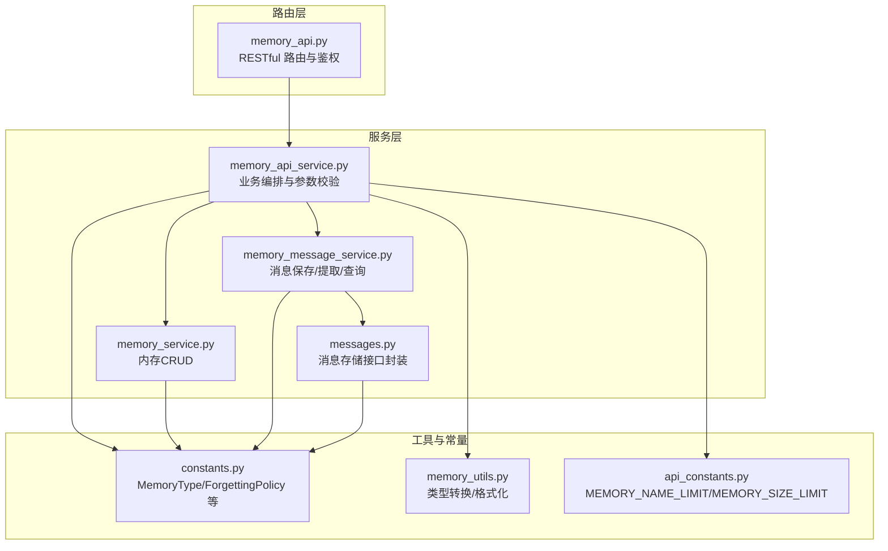
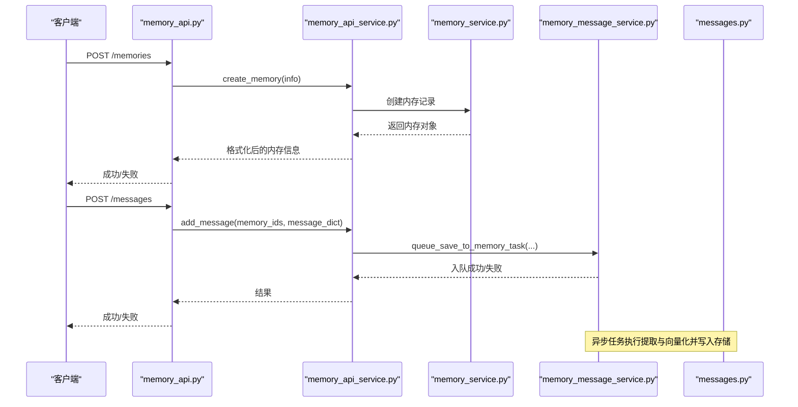
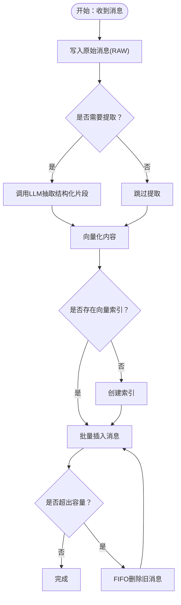
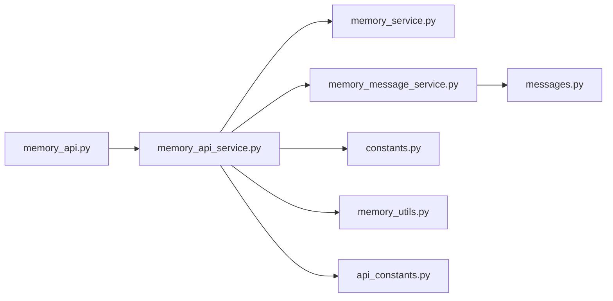

# 内存管理API

<cite>
**本文引用的文件**
- [memory_api.py](file://api/apps/restful_apis/memory_api.py)
- [memory_api_service.py](file://api/apps/services/memory_api_service.py)
- [memory_service.py](file://api/db/services/memory_service.py)
- [memory_message_service.py](file://api/db/joint_services/memory_message_service.py)
- [messages.py](file://memory/services/messages.py)
- [constants.py](file://common/constants.py)
- [memory_utils.py](file://api/utils/memory_utils.py)
- [api_constants.py](file://api/constants.py)
- [http_api_reference.md](file://docs/references/http_api_reference.md)
- [test_create_memory.py](file://test/testcases/test_web_api/test_memory_app/test_create_memory.py)
- [test_list_memory.py](file://test/testcases/test_web_api/test_memory_app/test_list_memory.py)
- [memory_sdk.py](file://sdk/python/ragflow_sdk/modules/memory.py)
</cite>

## 目录
1. [简介](#简介)
2. [项目结构](#项目结构)
3. [核心组件](#核心组件)
4. [架构总览](#架构总览)
5. [详细组件分析](#详细组件分析)
6. [依赖分析](#依赖分析)
7. [性能考量](#性能考量)
8. [故障排查指南](#故障排查指南)
9. [结论](#结论)
10. [附录](#附录)

## 简介
本文件为 RAGFlow 的“内存管理API”参考文档，覆盖内存对话、消息管理、历史记录查询等核心能力的完整接口规范。内容包括：
- 内存生命周期：创建、更新、删除、配置查询
- 消息管理：新增消息、按条件查询、搜索、更新消息状态、按ID获取内容
- 历史记录：分页列表、关键词过滤、多维度筛选
- 配置项：内存类型、存储类型、容量限制、遗忘策略、温度系数、系统/用户提示词
- 安全与权限：鉴权头、权限字段、租户隔离
- 实际使用场景：实时对话、历史检索、内存分享（基于权限）
- 性能与优化：嵌入向量化、索引与缓存、FIFO 清理策略

## 项目结构
围绕内存管理API的关键模块分布如下：
- 路由层：RESTful 接口定义与参数校验
- 服务层：业务逻辑编排、参数校验、调用数据库与消息服务
- 数据访问层：内存表、消息表、任务队列
- 工具与常量：内存类型枚举、大小限制、格式化工具

图表来源
- [memory_api.py:29-301](file://api/apps/restful_apis/memory_api.py#L29-L301)
- [memory_api_service.py:32-344](file://api/apps/services/memory_api_service.py#L32-L344)
- [memory_service.py:28-195](file://api/db/services/memory_service.py#L28-L195)
- [memory_message_service.py:38-451](file://api/db/joint_services/memory_message_service.py#L38-L451)
- [messages.py:27-295](file://memory/services/messages.py#L27-L295)
- [constants.py:177-191](file://common/constants.py#L177-L191)
- [memory_utils.py:19-55](file://api/utils/memory_utils.py#L19-L55)
- [api_constants.py:27-29](file://api/constants.py#L27-L29)

章节来源
- [memory_api.py:29-301](file://api/apps/restful_apis/memory_api.py#L29-L301)
- [memory_api_service.py:32-344](file://api/apps/services/memory_api_service.py#L32-L344)
- [memory_service.py:28-195](file://api/db/services/memory_service.py#L28-L195)
- [memory_message_service.py:38-451](file://api/db/joint_services/memory_message_service.py#L38-L451)
- [messages.py:27-295](file://memory/services/messages.py#L27-L295)
- [constants.py:177-191](file://common/constants.py#L177-L191)
- [memory_utils.py:19-55](file://api/utils/memory_utils.py#L19-L55)
- [api_constants.py:27-29](file://api/constants.py#L27-L29)

## 核心组件
- 内存管理接口：创建、更新、删除、列表、配置查询
- 消息管理接口：新增消息、按条件查询、全文/向量混合检索、更新消息状态、按ID获取内容
- 存储与索引：消息向量化、索引创建与查询、容量控制与自动遗忘
- 权限与租户：基于当前用户上下文的租户隔离与权限字段

章节来源
- [memory_api.py:29-301](file://api/apps/restful_apis/memory_api.py#L29-L301)
- [memory_api_service.py:32-344](file://api/apps/services/memory_api_service.py#L32-L344)
- [memory_message_service.py:38-451](file://api/db/joint_services/memory_message_service.py#L38-L451)
- [messages.py:27-295](file://memory/services/messages.py#L27-L295)

## 架构总览
内存管理API采用“路由层-服务层-数据层”的分层设计，消息写入流程包含“原始消息入库→异步提取→向量化→索引→容量控制”的完整链路。

图表来源
- [memory_api.py:29-83](file://api/apps/restful_apis/memory_api.py#L29-L83)
- [memory_api_service.py:245-256](file://api/apps/services/memory_api_service.py#L245-L256)
- [memory_message_service.py:344-414](file://api/db/joint_services/memory_message_service.py#L344-L414)
- [messages.py:45-58](file://memory/services/messages.py#L45-L58)

## 详细组件分析

### 内存管理接口
- URL 模式与方法
  - POST /api/v1/memories
  - PUT /api/v1/memories/{memory_id}
  - DELETE /api/v1/memories/{memory_id}
  - GET /api/v1/memories
  - GET /api/v1/memories/{memory_id}/config
- 请求参数
  - 创建：name, memory_type[], embd_id, llm_id；可选 tenant_embd_id, tenant_llm_id
  - 更新：name, permissions, llm_id, embd_id, memory_type[], memory_size, forgetting_policy, temperature, avatar, description, system_prompt, user_prompt, tenant_llm_id, tenant_embd_id
  - 删除：路径参数 memory_id
  - 列表：memory_type, tenant_id, storage_type, keywords, page, page_size
  - 配置：路径参数 memory_id
- 响应格式
  - 统一返回结构：code(整数), message(布尔或字符串), data(对象或列表)
  - 成功时 data 包含内存详情或列表
- 状态码
  - 成功：0
  - 参数错误：101
  - 未找到：404
  - 服务器错误：500
- 关键约束
  - name 长度限制与去空白
  - memory_type 必须为支持集合的子集
  - memory_size 限制在 (0, MEMORY_SIZE_LIMIT] 字节
  - 更新 memory_type/embd_id/tenant_embd_id 时内存不可为空
  - 忘记策略仅支持 FIFO

章节来源
- [memory_api.py:29-153](file://api/apps/restful_apis/memory_api.py#L29-L153)
- [memory_api_service.py:32-167](file://api/apps/services/memory_api_service.py#L32-L167)
- [memory_service.py:110-167](file://api/db/services/memory_service.py#L110-L167)
- [api_constants.py:27-29](file://api/constants.py#L27-L29)
- [constants.py:177-191](file://common/constants.py#L177-L191)
- [http_api_reference.md:5392-5436](file://docs/references/http_api_reference.md#L5392-L5436)

### 消息管理接口
- URL 模式与方法
  - POST /api/v1/messages
  - GET /api/v1/messages
  - GET /api/v1/messages/search
  - GET /api/v1/messages/{memory_id}:{message_id}
  - PUT /api/v1/messages/{memory_id}:{message_id}
  - DELETE /api/v1/messages/{memory_id}:{message_id}
  - GET /api/v1/messages/{memory_id}:{message_id}/content
- 请求参数
  - 新增：memory_id[], agent_id, session_id, user_input, agent_response；可选 user_id
  - 查询最近：memory_id[]（必填），agent_id, session_id, limit
  - 搜索：memory_id[]（必填），query, similarity_threshold, keywords_similarity_weight, top_n, agent_id, session_id, user_id
  - 更新状态：status(布尔)
  - 忘记：通过 DELETE 触发标记 forget_at
  - 获取内容：按 message_id 取回完整消息体
- 响应格式
  - 统一返回结构：code, message, data
  - 列表/搜索返回消息数组与总数
- 状态码
  - 成功：0
  - 参数错误：101
  - 未找到：404
  - 服务器错误：500

章节来源
- [memory_api.py:180-301](file://api/apps/restful_apis/memory_api.py#L180-L301)
- [memory_api_service.py:245-344](file://api/apps/services/memory_api_service.py#L245-L344)
- [memory_message_service.py:224-451](file://api/db/joint_services/memory_message_service.py#L224-L451)
- [messages.py:66-178](file://memory/services/messages.py#L66-L178)

### 消息写入与容量控制流程
消息写入包含以下步骤：
- 原始消息入库：生成原始消息ID，写入 RAW 类型消息
- 异步提取：根据 memory_type 调用LLM抽取结构化片段
- 向量化：使用嵌入模型对内容编码
- 索引创建与写入：首次写入时创建向量索引，批量插入消息
- 容量控制：当新消息+现有容量超过 memory_size 且策略为 FIFO 时，按时间顺序删除直至满足上限

图表来源
- [memory_message_service.py:38-221](file://api/db/joint_services/memory_message_service.py#L38-L221)
- [messages.py:35-58](file://memory/services/messages.py#L35-L58)

章节来源
- [memory_message_service.py:38-221](file://api/db/joint_services/memory_message_service.py#L38-L221)
- [messages.py:180-248](file://memory/services/messages.py#L180-L248)

### 内存配置与类型
- 支持的内存类型：RAW、SEMANTIC、EPISODIC、PROCEDURAL（位掩码组合）
- 存储类型：table/graph
- 忘记策略：FIFO
- 温度系数：范围[0,1]
- 名称长度限制：MEMORY_NAME_LIMIT
- 容量限制：MEMORY_SIZE_LIMIT（字节）

章节来源
- [constants.py:177-191](file://common/constants.py#L177-L191)
- [memory_utils.py:44-55](file://api/utils/memory_utils.py#L44-L55)
- [api_constants.py:27-29](file://api/constants.py#L27-L29)

### SDK 使用示例（Python）
- 初始化内存对象并更新配置
- 列出内存消息、按ID忘记消息、更新消息状态、获取消息内容
- 注意：SDK 中 temperature 为元组形式，需传入数值

章节来源
- [memory_sdk.py:44-96](file://sdk/python/ragflow_sdk/modules/memory.py#L44-L96)

## 依赖分析
- 路由层依赖服务层进行鉴权与参数校验
- 服务层依赖内存服务与消息服务完成数据库与存储操作
- 消息服务依赖底层文档存储连接器进行索引与查询
- 常量与工具提供类型转换、格式化与限制值

图表来源
- [memory_api.py:29-301](file://api/apps/restful_apis/memory_api.py#L29-L301)
- [memory_api_service.py:32-344](file://api/apps/services/memory_api_service.py#L32-L344)
- [memory_service.py:28-195](file://api/db/services/memory_service.py#L28-L195)
- [memory_message_service.py:38-451](file://api/db/joint_services/memory_message_service.py#L38-L451)
- [messages.py:27-295](file://memory/services/messages.py#L27-L295)
- [constants.py:177-191](file://common/constants.py#L177-L191)
- [memory_utils.py:19-55](file://api/utils/memory_utils.py#L19-L55)
- [api_constants.py:27-29](file://api/constants.py#L27-L29)

## 性能考量
- 向量化与索引
  - 首次写入时创建向量索引，避免重复开销
  - 批量插入消息，减少多次往返
- 缓存与容量控制
  - 使用Redis缓存内存大小，降低频繁统计成本
  - FIFO策略优先删除最旧消息，保证吞吐
- 查询优化
  - 搜索采用向量与文本的加权融合表达式
  - 默认只返回有效消息（status=1），可按需隐藏已遗忘消息
- 并发与异步
  - 消息写入通过任务队列异步处理，提升接口响应速度

章节来源
- [memory_message_service.py:282-318](file://api/db/joint_services/memory_message_service.py#L282-L318)
- [messages.py:150-178](file://memory/services/messages.py#L150-L178)

## 故障排查指南
- 常见错误与定位
  - 参数错误：检查 name/size/type/temperature 等参数合法性
  - 未找到：确认 memory_id 是否存在
  - 服务器错误：查看后端日志与异常栈
- 场景化排查
  - 创建失败：确认名称长度、类型集合、模型ID可用性
  - 更新失败：若内存非空，禁止修改 embedding/类型相关字段
  - 写入失败：检查嵌入模型可用性、索引创建结果、Redis队列可达性
  - 搜索无结果：调整相似度阈值与权重，确保 memory_id 与过滤条件正确

章节来源
- [memory_api.py:61-108](file://api/apps/restful_apis/memory_api.py#L61-L108)
- [memory_api_service.py:155-167](file://api/apps/services/memory_api_service.py#L155-L167)
- [memory_message_service.py:175-221](file://api/db/joint_services/memory_message_service.py#L175-L221)

## 结论
RAGFlow 的内存管理API提供了从内存到消息的全链路能力，具备完善的参数校验、权限控制、容量与遗忘策略以及高性能的向量化检索。通过合理的配置与使用，可在复杂对话场景中实现稳定、可控的记忆管理。

## 附录

### 接口一览与示例（摘要）
- 内存创建
  - 方法：POST
  - URL：/api/v1/memories
  - 示例：携带 name, memory_type[], embd_id, llm_id
- 内存更新
  - 方法：PUT
  - URL：/api/v1/memories/{memory_id}
  - 示例：可更新 name/permissions/llm_id/embd_id/memory_type/memory_size/forgetting_policy/temperature/avatar/description/system_prompt/user_prompt/tenant_llm_id/tenant_embd_id
- 内存删除
  - 方法：DELETE
  - URL：/api/v1/memories/{memory_id}
- 内存列表
  - 方法：GET
  - URL：/api/v1/memories?memory_type={...}&tenant_id={...}&storage_type={...}&keywords={...}&page={...}&page_size={...}
- 内存配置
  - 方法：GET
  - URL：/api/v1/memories/{memory_id}/config
- 新增消息
  - 方法：POST
  - URL：/api/v1/messages
  - 示例：memory_id[], agent_id, session_id, user_input, agent_response
- 查询最近消息
  - 方法：GET
  - URL：/api/v1/messages?memory_id={...}&agent_id={...}&session_id={...}&limit={...}
- 消息搜索
  - 方法：GET
  - URL：/api/v1/messages/search?memory_id={...}&query={...}&similarity_threshold={...}&keywords_similarity_weight={...}&top_n={...}&agent_id={...}&session_id={...}&user_id={...}
- 更新消息状态
  - 方法：PUT
  - URL：/api/v1/messages/{memory_id}:{message_id}
  - 示例：status=true/false
- 忘记消息
  - 方法：DELETE
  - URL：/api/v1/messages/{memory_id}:{message_id}
- 获取消息内容
  - 方法：GET
  - URL：/api/v1/messages/{memory_id}:{message_id}/content

章节来源
- [memory_api.py:29-301](file://api/apps/restful_apis/memory_api.py#L29-L301)
- [http_api_reference.md:5417-5436](file://docs/references/http_api_reference.md#L5417-L5436)

### 配置项与限制
- 名称长度限制：MEMORY_NAME_LIMIT
- 内存容量限制：MEMORY_SIZE_LIMIT（字节）
- 内存类型：RAW/SEMANTIC/EPISODIC/PROCEDURAL（位掩码）
- 存储类型：table/graph
- 忘记策略：FIFO
- 温度系数：[0,1]

章节来源
- [api_constants.py:27-29](file://api/constants.py#L27-L29)
- [constants.py:177-191](file://common/constants.py#L177-L191)

### 使用场景示例（思路）
- 实时对话
  - 步骤：创建内存 → 新增消息 → 搜索/查询最近消息 → 忽略无效消息
  - 参考：POST /messages, GET /messages/search, PUT /messages/{id}:status
- 历史消息检索
  - 步骤：GET /memories 列表 → GET /memories/{id} 分页查询 → GET /messages/search 混合检索
  - 参考：GET /memories, GET /memories/{id}, GET /messages/search
- 内存分享
  - 步骤：设置 permissions 字段为共享范围（如 me/tenant/all），结合租户隔离与鉴权头使用
  - 参考：PUT /memories/{id} 更新 permissions

章节来源
- [memory_api.py:86-153](file://api/apps/restful_apis/memory_api.py#L86-L153)
- [memory_api_service.py:73-167](file://api/apps/services/memory_api_service.py#L73-L167)
- [test_create_memory.py:42-103](file://test/testcases/test_web_api/test_memory_app/test_create_memory.py#L42-L103)
- [test_list_memory.py:48-119](file://test/testcases/test_web_api/test_memory_app/test_list_memory.py#L48-L119)