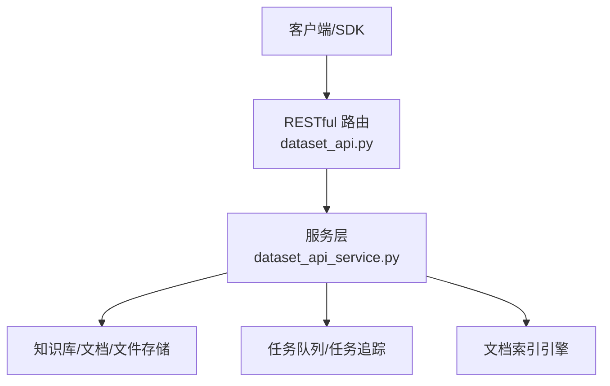
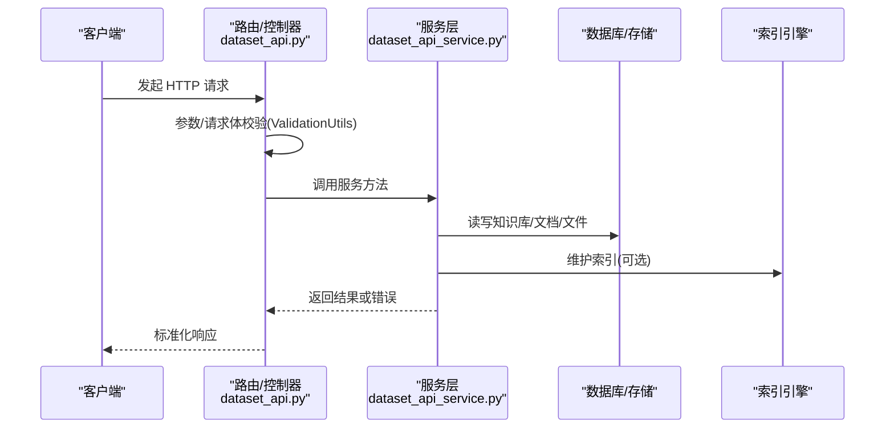
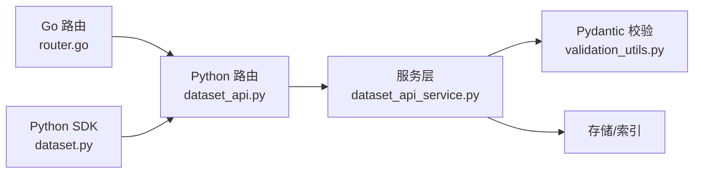

# 数据集管理API

<cite>
**本文引用的文件**
- [dataset_api.py](file://api/apps/restful_apis/dataset_api.py)
- [dataset_api_service.py](file://api/apps/services/dataset_api_service.py)
- [validation_utils.py](file://api/utils/validation_utils.py)
- [dataset.py](file://sdk/python/ragflow_sdk/modules/dataset.py)
- [dataset_example.py](file://example/sdk/dataset_example.py)
- [test_create_dataset.py](file://test/testcases/test_http_api/test_dataset_management/test_create_dataset.py)
- [test_list_datasets.py](file://test/testcases/test_http_api/test_dataset_management/test_list_datasets.py)
- [test_update_dataset.py](file://test/testcases/test_http_api/test_dataset_management/test_update_dataset.py)
- [test_delete_datasets.py](file://test/testcases/test_http_api/test_dataset_management/test_delete_datasets.py)
- [common.py](file://test/testcases/test_http_api/common.py)
- [http_api_reference.md](file://docs/references/http_api_reference.md)
- [router.go](file://internal/router/router.go)
</cite>

## 目录
1. [简介](#简介)
2. [项目结构](#项目结构)
3. [核心组件](#核心组件)
4. [架构总览](#架构总览)
5. [详细组件分析](#详细组件分析)
6. [依赖关系分析](#依赖关系分析)
7. [性能考虑](#性能考虑)
8. [故障排查指南](#故障排查指南)
9. [结论](#结论)
10. [附录](#附录)

## 简介
本文件为 RAGFlow 数据集管理 API 的权威参考文档，覆盖数据集的创建、删除、更新、列表查询等核心能力，并扩展到知识图谱管理、GraphRAG/RAPTOR 任务执行、自动元数据配置等高级功能。文档提供端点定义、请求/响应格式、参数校验规则、错误处理策略与性能优化建议，并给出 curl 与多语言客户端调用示例。

## 项目结构
- 后端路由层：RESTful 路由在 Python 层注册，对应处理函数位于 dataset_api.py。
- 服务层：业务逻辑集中在 dataset_api_service.py，封装数据库访问、索引清理、任务调度等。
- 校验层：通过 Pydantic 模型对请求体与查询参数进行强类型校验，统一错误格式化。
- SDK 层：提供 Python SDK 封装常用操作，便于集成。
- 测试与参考：测试用例覆盖了大量边界与异常场景；官方 HTTP 参考文档补充了端点细节。

图表来源
- [dataset_api.py:34-518](file://api/apps/restful_apis/dataset_api.py#L34-L518)
- [dataset_api_service.py:33-614](file://api/apps/services/dataset_api_service.py#L33-L614)

章节来源
- [dataset_api.py:34-518](file://api/apps/restful_apis/dataset_api.py#L34-L518)
- [dataset_api_service.py:33-614](file://api/apps/services/dataset_api_service.py#L33-L614)
- [validation_utils.py:38-188](file://api/utils/validation_utils.py#L38-L188)

## 核心组件
- 数据集路由与控制器：负责接收 HTTP 请求，解析参数，调用服务层并返回标准响应。
- 数据集服务：实现数据集生命周期管理、权限校验、索引维护、任务调度与追踪。
- 参数校验：基于 Pydantic 的强类型校验，支持复杂嵌套对象、枚举、范围约束与自定义错误格式。
- SDK 封装：提供 Python SDK 的数据集对象与常用操作方法，简化客户端集成。

章节来源
- [dataset_api.py:34-518](file://api/apps/restful_apis/dataset_api.py#L34-L518)
- [dataset_api_service.py:33-614](file://api/apps/services/dataset_api_service.py#L33-L614)
- [validation_utils.py:394-784](file://api/utils/validation_utils.py#L394-L784)
- [dataset.py:21-174](file://sdk/python/ragflow_sdk/modules/dataset.py#L21-L174)

## 架构总览
数据集 API 的调用链路如下：

图表来源
- [dataset_api.py:34-518](file://api/apps/restful_apis/dataset_api.py#L34-L518)
- [dataset_api_service.py:33-614](file://api/apps/services/dataset_api_service.py#L33-L614)
- [validation_utils.py:38-188](file://api/utils/validation_utils.py#L38-L188)

## 详细组件分析

### 数据集创建
- 端点
  - 方法：POST
  - 路径：/api/v1/datasets
  - 认证：Bearer Token
- 请求体字段
  - name: 必填，字符串，长度限制见常量
  - avatar: 可选，base64 图像，需满足 MIME 前缀与类型限制
  - description: 可选，字符串
  - embedding_model: 可选，格式为 "<模型>@<厂商>"
  - permission: 可选，默认 me，取值 "me" 或 "team"
  - chunk_method: 可选，默认 "naive"，枚举值包括 naive/book/email/laws/manual/one/paper/picture/presentation/qa/table/tag
  - parse_type: 可选，整数
  - pipeline_id: 可选，32 位十六进制小写字符串
  - parser_config: 可选，嵌套对象，含多种分块与解析配置项
  - auto_metadata_config: 可选，自动元数据配置
  - ext: 可选，扩展字段
- 响应
  - 成功：返回新建数据集详情
  - 失败：返回错误码与消息
- 关键行为
  - 若未指定 embedding_model，使用租户默认模型
  - 自动元数据配置会映射到 parser_config.metadata
  - 支持并发创建与批量压力测试
- 错误与校验
  - 内容类型必须为 application/json
  - 字段长度、格式、枚举值均受严格校验
  - 重复名称会自动去重后保存
- 使用示例
  - curl
    - POST /api/v1/datasets
    - 头部：Authorization: Bearer <API_KEY>
    - 示例请求体：包含 name、permission、chunk_method 等
  - Python SDK
    - 参考 [dataset_example.py:27-46](file://example/sdk/dataset_example.py#L27-L46)

章节来源
- [dataset_api.py:34-108](file://api/apps/restful_apis/dataset_api.py#L34-L108)
- [validation_utils.py:394-669](file://api/utils/validation_utils.py#L394-L669)
- [test_create_dataset.py:94-143](file://test/testcases/test_http_api/test_dataset_management/test_create_dataset.py#L94-L143)
- [dataset_example.py:27-46](file://example/sdk/dataset_example.py#L27-L46)

### 数据集删除
- 端点
  - 方法：DELETE
  - 路径：/api/v1/datasets
  - 认证：Bearer Token
- 请求体字段
  - ids: 可选数组，UUID1 字符串；若为 null 则删除该租户全部数据集
  - delete_all: 可选布尔值，当 ids 为 null 时生效
- 响应
  - 成功：返回成功计数与可能的失败明细
  - 失败：返回错误码与消息
- 关键行为
  - 删除前会校验权限与存在性
  - 清理文档、文件、文件-文档关联以及索引
- 错误与校验
  - ids 中若包含无效 UUID 或重复 ID，将触发相应错误
  - 权限不足时返回授权错误
- 使用示例
  - curl
    - DELETE /api/v1/datasets
    - 请求体：{"ids": ["<dataset_id>"]} 或 {"ids": null, "delete_all": true}

章节来源
- [dataset_api.py:110-167](file://api/apps/restful_apis/dataset_api.py#L110-L167)
- [dataset_api_service.py:94-158](file://api/apps/services/dataset_api_service.py#L94-L158)
- [test_delete_datasets.py:100-137](file://test/testcases/test_http_api/test_dataset_management/test_delete_datasets.py#L100-L137)

### 数据集更新
- 端点
  - 方法：PUT
  - 路径：/api/v1/datasets/{dataset_id}
  - 认证：Bearer Token
- 路径参数
  - dataset_id: 必填，UUID1
- 请求体字段
  - name/description/avatar/embedding_model/permission/chunk_method/pagerank/parser_config 等
  - connectors: 可选，连接器列表
- 响应
  - 成功：返回更新后的数据集详情
  - 失败：返回错误码与消息
- 关键行为
  - 当存在已分块内容且 embedding_model 已设置时，禁止修改 embedding_model
  - pagerank 设置受文档引擎类型限制（如仅在 elasticsearch 下允许）
  - 支持部分字段更新（exclude_unset）
- 错误与校验
  - 非法 UUID、重复 ID、越界数值、不合法格式等均被拒绝
  - 名称重复会报错
- 使用示例
  - curl
    - PUT /api/v1/datasets/{dataset_id}
    - 请求体：包含要更新的字段

章节来源
- [dataset_api.py:169-254](file://api/apps/restful_apis/dataset_api.py#L169-L254)
- [validation_utils.py:671-682](file://api/utils/validation_utils.py#L671-L682)
- [dataset_api_service.py:161-263](file://api/apps/services/dataset_api_service.py#L161-L263)
- [test_update_dataset.py:124-174](file://test/testcases/test_http_api/test_dataset_management/test_update_dataset.py#L124-L174)

### 数据集列表查询
- 端点
  - 方法：GET
  - 路径：/api/v1/datasets
  - 认证：Bearer Token
- 查询参数
  - id: 可选，按 ID 过滤
  - name: 可选，按名称过滤
  - page/page_size: 分页
  - orderby: 排序字段，可选 "create_time" 或 "update_time"
  - desc: 是否降序
  - ext: 可选扩展对象，支持 owner_ids、parser_id、keywords 等
- 响应
  - 成功：返回数据列表与总数
  - 失败：返回错误码与消息
- 关键行为
  - 支持多字段组合过滤与排序
  - 支持并发高负载下的稳定查询
- 使用示例
  - curl
    - GET /api/v1/datasets?page=1&page_size=30&orderby=create_time&desc=true

章节来源
- [dataset_api.py:256-331](file://api/apps/restful_apis/dataset_api.py#L256-L331)
- [validation_utils.py:781-784](file://api/utils/validation_utils.py#L781-L784)
- [test_list_datasets.py:58-123](file://test/testcases/test_http_api/test_dataset_management/test_list_datasets.py#L58-L123)

### 知识图谱管理
- 获取知识图谱
  - 端点：GET /api/v1/datasets/{dataset_id}/knowledge_graph
  - 返回 graph/mind_map 结构，若索引不存在则返回空对象
- 删除知识图谱
  - 端点：DELETE /api/v1/datasets/{dataset_id}/knowledge_graph
  - 删除与知识图谱相关的索引条目
- 行为说明
  - 仅授权用户可访问
  - 空索引时返回空结构，避免错误

章节来源
- [dataset_api.py:333-369](file://api/apps/restful_apis/dataset_api.py#L333-L369)
- [dataset_api_service.py:329-388](file://api/apps/services/dataset_api_service.py#L329-L388)

### GraphRAG 任务执行
- 启动任务
  - 端点：POST /api/v1/datasets/{dataset_id}/run_graphrag
  - 返回任务 ID，若已有进行中的任务则拒绝
- 追踪任务
  - 端点：GET /api/v1/datasets/{dataset_id}/trace_graphrag
  - 返回任务状态与进度信息
- 行为说明
  - 任务基于数据集内文档集合触发
  - 任务状态持久化，可通过追踪接口查询

章节来源
- [dataset_api.py:371-398](file://api/apps/restful_apis/dataset_api.py#L371-L398)
- [dataset_api_service.py:391-467](file://api/apps/services/dataset_api_service.py#L391-L467)
- [http_api_reference.md:1192-1246](file://docs/references/http_api_reference.md#L1192-L1246)

### RAPTOR 任务执行
- 启动任务
  - 端点：POST /api/v1/datasets/{dataset_id}/run_raptor
  - 返回任务 ID，若已有进行中的任务则拒绝
- 追踪任务
  - 端点：GET /api/v1/datasets/{dataset_id}/trace_raptor
  - 返回任务状态与进度信息
- 行为说明
  - 任务基于数据集内文档集合触发
  - 任务状态持久化，可通过追踪接口查询

章节来源
- [dataset_api.py:401-428](file://api/apps/restful_apis/dataset_api.py#L401-L428)
- [dataset_api_service.py:470-547](file://api/apps/services/dataset_api_service.py#L470-L547)
- [http_api_reference.md:1244-1280](file://docs/references/http_api_reference.md#L1244-L1280)

### 自动元数据配置
- 获取配置
  - 端点：GET /api/v1/datasets/{dataset_id}/auto_metadata
  - 返回 enabled 与 fields 数组
- 更新配置
  - 端点：PUT /api/v1/datasets/{dataset_id}/auto_metadata
  - 请求体：enabled 与 fields
- 行为说明
  - fields 映射到 parser_config.metadata
  - 支持启用/禁用与字段定义变更

章节来源
- [dataset_api.py:431-517](file://api/apps/restful_apis/dataset_api.py#L431-L517)
- [dataset_api_service.py:550-613](file://api/apps/services/dataset_api_service.py#L550-L613)
- [validation_utils.py:360-374](file://api/utils/validation_utils.py#L360-L374)

### SDK 封装与使用示例
- SDK 数据集对象
  - 提供 update/upload_documents/list_documents/delete_documents/parse_documents 等方法
  - 支持异步解析与取消
- 使用示例
  - 参考 [dataset_example.py:27-46](file://example/sdk/dataset_example.py#L27-L46)
  - SDK 对接参考 [dataset.py:21-174](file://sdk/python/ragflow_sdk/modules/dataset.py#L21-L174)

章节来源
- [dataset.py:21-174](file://sdk/python/ragflow_sdk/modules/dataset.py#L21-L174)
- [dataset_example.py:27-46](file://example/sdk/dataset_example.py#L27-L46)

## 依赖关系分析
- 路由与控制器
  - RESTful 路由在 Python 层注册，路径与方法与 Go 路由保持一致
- 服务层依赖
  - 知识库服务、文档服务、文件服务、任务服务、索引连接器等
- 校验层依赖
  - Pydantic 模型与统一错误格式化工具
- SDK 依赖
  - 基于标准 HTTP 客户端封装，便于多语言集成

图表来源
- [router.go:153-159](file://internal/router/router.go#L153-L159)
- [dataset_api.py:34-518](file://api/apps/restful_apis/dataset_api.py#L34-L518)
- [dataset_api_service.py:33-614](file://api/apps/services/dataset_api_service.py#L33-L614)
- [validation_utils.py:38-188](file://api/utils/validation_utils.py#L38-L188)
- [dataset.py:21-174](file://sdk/python/ragflow_sdk/modules/dataset.py#L21-L174)

章节来源
- [router.go:153-159](file://internal/router/router.go#L153-L159)
- [dataset_api.py:34-518](file://api/apps/restful_apis/dataset_api.py#L34-L518)
- [dataset_api_service.py:33-614](file://api/apps/services/dataset_api_service.py#L33-L614)
- [validation_utils.py:38-188](file://api/utils/validation_utils.py#L38-L188)
- [dataset.py:21-174](file://sdk/python/ragflow_sdk/modules/dataset.py#L21-L174)

## 性能考虑
- 并发与吞吐
  - 创建/更新/删除/列表查询均通过测试验证高并发稳定性
- 分页与排序
  - 列表查询支持分页与排序，建议合理设置 page_size 以平衡延迟与带宽
- 索引维护
  - 删除数据集时会清理索引，避免碎片累积
- 任务执行
  - GraphRAG/RAPTOR 任务通过队列异步执行，避免阻塞请求线程

章节来源
- [test_create_dataset.py:76-90](file://test/testcases/test_http_api/test_dataset_management/test_create_dataset.py#L76-L90)
- [test_list_datasets.py:47-53](file://test/testcases/test_http_api/test_dataset_management/test_list_datasets.py#L47-L53)
- [test_update_dataset.py:92-100](file://test/testcases/test_http_api/test_dataset_management/test_update_dataset.py#L92-L100)
- [test_delete_datasets.py:79-96](file://test/testcases/test_http_api/test_dataset_management/test_delete_datasets.py#L79-L96)

## 故障排查指南
- 认证失败
  - 现象：返回 401
  - 排查：确认 Authorization 头是否正确，API Key 是否有效
- 内容类型错误
  - 现象：返回 101，提示非 application/json
  - 排查：确保 Content-Type 为 application/json
- 参数校验失败
  - 现象：返回 101，包含字段级错误信息
  - 排查：对照请求体模型，修正字段类型、范围、枚举值
- 权限不足
  - 现象：返回 102，提示无权限或数据集不存在
  - 排查：确认 dataset_id 所属租户与当前用户权限
- 任务冲突
  - 现象：已有进行中任务，拒绝启动新任务
  - 排查：先查询任务状态，待完成后再次尝试

章节来源
- [test_create_dataset.py:31-47](file://test/testcases/test_http_api/test_dataset_management/test_create_dataset.py#L31-L47)
- [test_list_datasets.py:26-42](file://test/testcases/test_http_api/test_dataset_management/test_list_datasets.py#L26-L42)
- [test_update_dataset.py:31-48](file://test/testcases/test_http_api/test_dataset_management/test_update_dataset.py#L31-L48)
- [test_delete_datasets.py:29-45](file://test/testcases/test_http_api/test_dataset_management/test_delete_datasets.py#L29-L45)
- [dataset_api_service.py:414-416](file://api/apps/services/dataset_api_service.py#L414-L416)

## 结论
本文档系统梳理了 RAGFlow 数据集管理 API 的核心能力与扩展功能，提供了从路由、服务、校验到 SDK 的全栈参考。通过严格的参数校验、完善的错误处理与性能优化建议，开发者可以安全、高效地集成数据集管理能力，并利用 GraphRAG/RAPTOR 与自动元数据配置提升检索与知识图谱构建效率。

## 附录

### 端点一览与参数说明
- 创建数据集
  - 方法：POST /api/v1/datasets
  - 认证：Bearer Token
  - 请求体字段：见“数据集创建”章节
- 删除数据集
  - 方法：DELETE /api/v1/datasets
  - 认证：Bearer Token
  - 请求体字段：ids/delete_all
- 更新数据集
  - 方法：PUT /api/v1/datasets/{dataset_id}
  - 认证：Bearer Token
  - 路径参数：dataset_id
  - 请求体字段：见“数据集更新”章节
- 列表查询
  - 方法：GET /api/v1/datasets
  - 认证：Bearer Token
  - 查询参数：id/name/page/page_size/orderby/desc/ext
- 知识图谱
  - 获取：GET /api/v1/datasets/{dataset_id}/knowledge_graph
  - 删除：DELETE /api/v1/datasets/{dataset_id}/knowledge_graph
- GraphRAG
  - 启动：POST /api/v1/datasets/{dataset_id}/run_graphrag
  - 追踪：GET /api/v1/datasets/{dataset_id}/trace_graphrag
- RAPTOR
  - 启动：POST /api/v1/datasets/{dataset_id}/run_raptor
  - 追踪：GET /api/v1/datasets/{dataset_id}/trace_raptor
- 自动元数据
  - 获取：GET /api/v1/datasets/{dataset_id}/auto_metadata
  - 更新：PUT /api/v1/datasets/{dataset_id}/auto_metadata

章节来源
- [dataset_api.py:34-518](file://api/apps/restful_apis/dataset_api.py#L34-L518)
- [http_api_reference.md:1192-1280](file://docs/references/http_api_reference.md#L1192-L1280)

### curl 使用示例
- 创建数据集
  - curl --request POST --url http://{address}/api/v1/datasets --header 'Authorization: Bearer <YOUR_API_KEY>' --header 'Content-Type: application/json' --data '{"name":"test","permission":"me","chunk_method":"naive"}'
- 列表查询
  - curl --request GET --url "http://{address}/api/v1/datasets?page=1&page_size=30&orderby=create_time&desc=true" --header 'Authorization: Bearer <YOUR_API_KEY>'
- 删除数据集
  - curl --request DELETE --url http://{address}/api/v1/datasets --header 'Authorization: Bearer <YOUR_API_KEY>' --header 'Content-Type: application/json' --data '{"ids":["<dataset_id>"],"delete_all":false}'
- GraphRAG 启动与追踪
  - curl --request POST --url http://{address}/api/v1/datasets/{dataset_id}/run_graphrag --header 'Authorization: Bearer <YOUR_API_KEY>'
  - curl --request GET --url http://{address}/api/v1/datasets/{dataset_id}/trace_graphrag --header 'Authorization: Bearer <YOUR_API_KEY>'
- RAPTOR 启动与追踪
  - curl --request POST --url http://{address}/api/v1/datasets/{dataset_id}/run_raptor --header 'Authorization: Bearer <YOUR_API_KEY>'
  - curl --request GET --url http://{address}/api/v1/datasets/{dataset_id}/trace_raptor --header 'Authorization: Bearer <YOUR_API_KEY>'
- 自动元数据
  - curl --request GET --url http://{address}/api/v1/datasets/{dataset_id}/auto_metadata --header 'Authorization: Bearer <YOUR_API_KEY>'
  - curl --request PUT --url http://{address}/api/v1/datasets/{dataset_id}/auto_metadata --header 'Authorization: Bearer <YOUR_API_KEY>' --header 'Content-Type: application/json' --data '{"enabled":true,"fields":[{"name":"field1","type":"string","description":"desc","examples":["ex"],"restrict_values":false}]}'

章节来源
- [common.py:35-58](file://test/testcases/test_http_api/common.py#L35-L58)
- [http_api_reference.md:1192-1280](file://docs/references/http_api_reference.md#L1192-L1280)