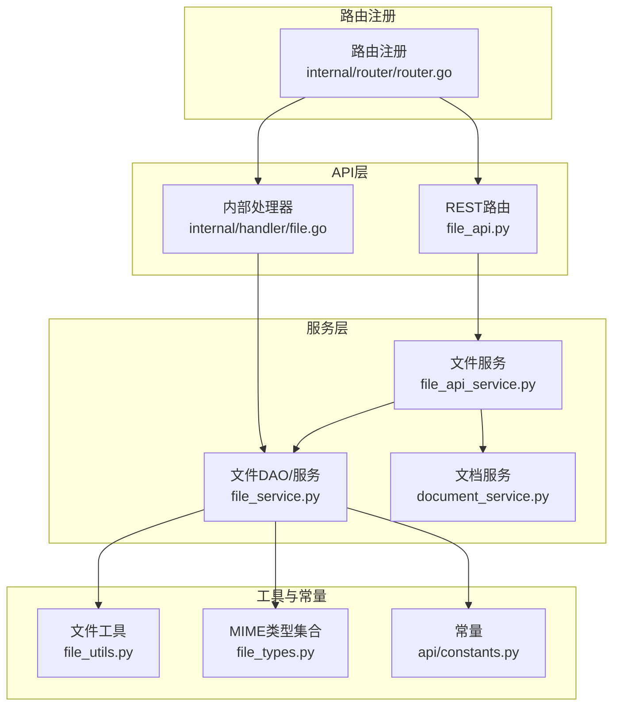
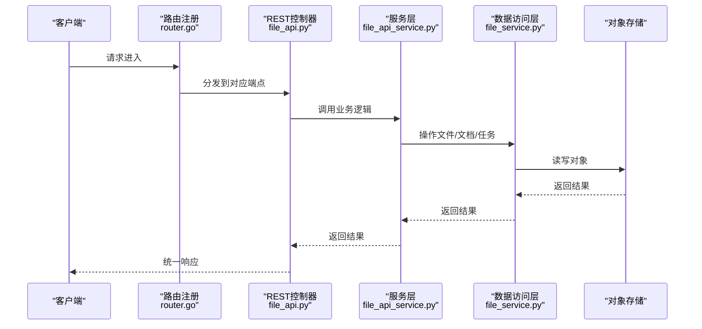
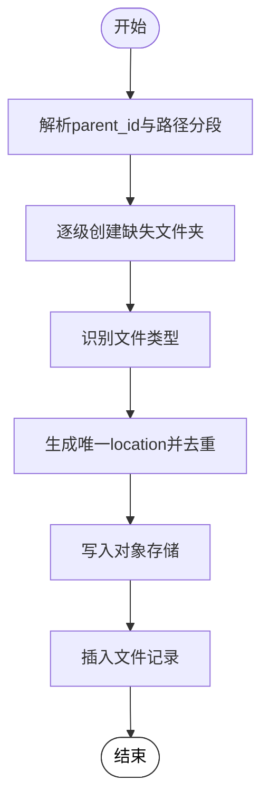
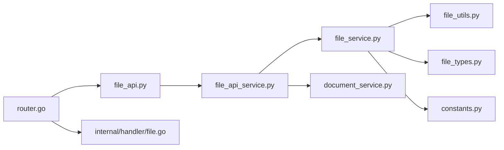

# 文件管理API

<cite>
**本文引用的文件列表**
- [api/apps/restful_apis/file_api.py](file://api/apps/restful_apis/file_api.py)
- [api/apps/services/file_api_service.py](file://api/apps/services/file_api_service.py)
- [api/db/services/file_service.py](file://api/db/services/file_service.py)
- [api/db/services/document_service.py](file://api/db/services/document_service.py)
- [api/utils/file_utils.py](file://api/utils/file_utils.py)
- [internal/router/router.go](file://internal/router/router.go)
- [internal/handler/file.go](file://internal/handler/file.go)
- [common/data_source/file_types.py](file://common/data_source/file_types.py)
- [api/constants.py](file://api/constants.py)
- [test/testcases/test_http_api/test_file_app/test_file_routes.py](file://test/testcases/test_http_api/test_file_app/test_file_routes.py)
- [test/testcases/test_web_api/test_file_app/test_file_routes_unit.py](file://test/testcases/test_web_api/test_file_app/test_file_routes_unit.py)
- [test/testcases/test_http_api/test_file_management_within_dataset/test_metadata_retrieval.py](file://test/testcases/test_http_api/test_file_management_within_dataset/test_metadata_retrieval.py)
- [test/testcases/test_web_api/test_document_app/test_document_metadata.py](file://test/testcases/test_web_api/test_document_app/test_document_metadata.py)
- [web/src/hooks/use-file-request.ts](file://web/src/hooks/use-file-request.ts)
- [web/src/components/file-upload.tsx](file://web/src/components/file-upload.tsx)
</cite>

## 目录
1. [简介](#简介)
2. [项目结构](#项目结构)
3. [核心组件](#核心组件)
4. [架构总览](#架构总览)
5. [详细组件分析](#详细组件分析)
6. [依赖关系分析](#依赖关系分析)
7. [性能考量](#性能考量)
8. [故障排查指南](#故障排查指南)
9. [结论](#结论)
10. [附录](#附录)

## 简介
本文件管理API参考文档面向RAGFlow后端的文件上传、下载、删除、移动/重命名、文件夹浏览、父级路径查询等能力，覆盖REST接口与服务层实现细节，并补充文件解析状态查询、文档转换、元数据管理、安全与权限校验、错误处理策略以及常见使用场景（如批量上传、文件状态监控、解析进度跟踪）。

## 项目结构
围绕文件管理的核心代码分布在以下模块：
- REST路由与控制器：负责HTTP请求解析、参数校验、调用服务层并返回统一结果
- 服务层：封装业务逻辑（上传、删除、移动/重命名、列表、父级路径等）
- 数据访问层：封装数据库与对象存储交互
- 常量与工具：文件类型识别、名称长度限制、MIME类型集合等
- 测试与前端集成：覆盖HTTP测试、Web端调用与上传组件

图表来源
- [api/apps/restful_apis/file_api.py:43-365](file://api/apps/restful_apis/file_api.py#L43-L365)
- [api/apps/services/file_api_service.py:32-398](file://api/apps/services/file_api_service.py#L32-L398)
- [api/db/services/file_service.py:44-710](file://api/db/services/file_service.py#L44-L710)
- [api/db/services/document_service.py:45-800](file://api/db/services/document_service.py#L45-L800)
- [api/utils/file_utils.py:58-81](file://api/utils/file_utils.py#L58-L81)
- [common/data_source/file_types.py:14-41](file://common/data_source/file_types.py#L14-L41)
- [api/constants.py:16-29](file://api/constants.py#L16-L29)
- [internal/router/router.go:246-253](file://internal/router/router.go#L246-L253)
- [internal/handler/file.go:43-228](file://internal/handler/file.go#L43-L228)

章节来源
- [api/apps/restful_apis/file_api.py:43-365](file://api/apps/restful_apis/file_api.py#L43-L365)
- [internal/router/router.go:246-253](file://internal/router/router.go#L246-L253)

## 核心组件
- REST路由与控制器：提供文件上传、列表、删除、移动/重命名、下载、父级路径查询等端点
- 服务层：封装上传、删除、移动/重命名、列表、父级路径等业务逻辑
- 数据访问层：封装文件、文档、任务、知识库等实体的增删改查与关联关系
- 工具与常量：文件类型识别、名称长度限制、MIME类型集合、内容类型映射等

章节来源
- [api/apps/restful_apis/file_api.py:43-365](file://api/apps/restful_apis/file_api.py#L43-L365)
- [api/apps/services/file_api_service.py:32-398](file://api/apps/services/file_api_service.py#L32-L398)
- [api/db/services/file_service.py:44-710](file://api/db/services/file_service.py#L44-L710)
- [api/utils/file_utils.py:58-81](file://api/utils/file_utils.py#L58-L81)
- [common/data_source/file_types.py:14-41](file://common/data_source/file_types.py#L14-L41)
- [api/constants.py:16-29](file://api/constants.py#L16-L29)

## 架构总览
文件管理API采用“路由-服务-数据访问-存储”的分层设计。REST路由负责参数校验与鉴权，服务层协调数据库与对象存储，数据访问层抽象实体与关系，工具与常量提供类型识别与限制。

图表来源
- [internal/router/router.go:246-253](file://internal/router/router.go#L246-L253)
- [api/apps/restful_apis/file_api.py:43-365](file://api/apps/restful_apis/file_api.py#L43-L365)
- [api/apps/services/file_api_service.py:32-398](file://api/apps/services/file_api_service.py#L32-L398)
- [api/db/services/file_service.py:44-710](file://api/db/services/file_service.py#L44-L710)

## 详细组件分析

### REST接口规范与端点清单
- 上传/创建文件或文件夹
  - 方法与路径：POST /files
  - 认证：需要API密钥
  - 内容类型：
    - multipart/form-data：多文件上传（表单字段包含 parent_id 和 file 列表）
    - application/json：创建文件夹（name、parent_id、type）
  - 成功响应：返回上传/创建结果列表
  - 失败响应：返回错误信息
  - 关键行为：支持路径分段自动创建目录、同名文件自动去重、对象存储写入、数据库记录插入
- 列出文件
  - 方法与路径：GET /files
  - 查询参数：parent_id（可选，默认根目录）、keywords（可选）、page、page_size、orderby、desc
  - 成功响应：返回总数、文件列表、父级文件夹信息
- 删除文件
  - 方法与路径：DELETE /files
  - 请求体：ids（文件ID数组）
  - 成功响应：返回成功标记
  - 递归删除：文件夹会递归删除子项
- 移动/重命名文件
  - 方法与路径：POST /files/move
  - 请求体：src_file_ids（源文件ID数组）、dest_file_id（目标文件夹ID，可选）、new_name（新名称，可选）
  - 行为：仅目标文件夹ID时为移动；仅新名称时为原地重命名；两者同时提供则先移动再重命名
- 下载文件
  - 方法与路径：GET /files/{file_id}
  - 成功响应：二进制流（根据扩展名设置Content-Type）
  - 备用地址：若直接地址不存在，回退到文档关联的存储地址
- 获取父级文件夹
  - 方法与路径：GET /files/{file_id}/parent
  - 成功响应：父级文件夹信息
- 获取所有祖先文件夹
  - 方法与路径：GET /files/{file_id}/ancestors
  - 成功响应：祖先文件夹列表

章节来源
- [api/apps/restful_apis/file_api.py:43-365](file://api/apps/restful_apis/file_api.py#L43-L365)
- [internal/router/router.go:246-253](file://internal/router/router.go#L246-L253)

### 服务层流程与关键逻辑
- 上传流程
  - 解析parent_id，若为空则定位根目录
  - 解析路径分段，逐级创建缺失的文件夹
  - 识别文件类型，生成唯一location，避免同名冲突
  - 读取文件内容写入对象存储，插入文件记录
  - 返回上传结果列表
- 删除流程
  - 权限校验（团队权限检查）
  - 对于文件：删除对象存储中的文件，清理文档关联与记录
  - 对于文件夹：递归遍历并执行上述步骤
- 移动/重命名流程
  - 校验源文件存在性与权限
  - 若提供目标文件夹：校验其存在性
  - 若提供新名称：校验扩展名不变且同级不重复
  - 存储层移动（仅当跨目录时），更新数据库记录
  - 文档名称同步（若存在关联文档）
- 列表/父级路径
  - 列表：支持关键词过滤、分页、排序
  - 父级路径：返回直接父级或全链路祖先

图表来源
- [api/apps/services/file_api_service.py:32-102](file://api/apps/services/file_api_service.py#L32-L102)
- [api/utils/file_utils.py:58-81](file://api/utils/file_utils.py#L58-L81)

章节来源
- [api/apps/services/file_api_service.py:32-398](file://api/apps/services/file_api_service.py#L32-L398)
- [api/db/services/file_service.py:44-710](file://api/db/services/file_service.py#L44-L710)

### 文件类型支持、大小限制与存储策略
- 文件类型识别
  - 基于扩展名判断：PDF、文档类（doc/docx/ppt/pptx等）、音频、图片、其他
  - 支持的MIME类型集合：图像、文本、JSON/XML/YAML、PDF、Word、PPT、Excel、邮件等
- 名称长度限制
  - 文件名最大长度限制常量
- 存储策略
  - 使用对象存储实现文件持久化，支持put/get/rm/move等操作
  - 支持MinIO/AWS S3/OSS等后端（通过工厂与配置注入）

章节来源
- [api/utils/file_utils.py:58-81](file://api/utils/file_utils.py#L58-L81)
- [common/data_source/file_types.py:14-41](file://common/data_source/file_types.py#L14-L41)
- [api/constants.py:26-29](file://api/constants.py#L26-L29)
- [internal/server/config.go:172-194](file://internal/server/config.go#L172-L194)
- [internal/storage/storage_factory.go:143-200](file://internal/storage/storage_factory.go#L143-L200)

### 安全与权限校验
- 鉴权机制
  - 所有端点均需通过API密钥认证
- 权限控制
  - 团队权限检查：删除、移动/重命名前校验文件归属与用户权限
  - 文档访问性：下载与解析前校验文档对用户的可见性
- 错误处理
  - 参数校验失败返回明确错误信息
  - 服务器异常统一包装为内部错误响应

章节来源
- [api/apps/restful_apis/file_api.py:43-96](file://api/apps/restful_apis/file_api.py#L43-L96)
- [api/apps/services/file_api_service.py:206-263](file://api/apps/services/file_api_service.py#L206-L263)
- [api/db/services/document_service.py:660-686](file://api/db/services/document_service.py#L660-L686)

### 文件解析状态查询与文档转换
- 解析状态聚合
  - 可按知识库ID聚合统计各运行状态（未开始、运行中、取消、完成、失败）
- 元数据管理
  - 支持为文档设置元数据字段，更新解析配置
  - 支持获取元数据摘要（用于筛选与统计）
- 文档转换
  - 基于不同文件类型选择解析器（演示、图片、音频、邮件等）
  - 支持生成缩略图、计算内容哈希、更新文档尺寸与计数

章节来源
- [api/db/services/document_service.py:280-325](file://api/db/services/document_service.py#L280-L325)
- [api/db/services/document_service.py:116-126](file://api/db/services/document_service.py#L116-L126)
- [api/db/services/file_service.py:531-570](file://api/db/services/file_service.py#L531-L570)
- [test/testcases/test_http_api/test_file_management_within_dataset/test_metadata_retrieval.py:135-154](file://test/testcases/test_http_api/test_file_management_within_dataset/test_metadata_retrieval.py#L135-L154)
- [test/testcases/test_web_api/test_document_app/test_document_metadata.py:454-477](file://test/testcases/test_web_api/test_document_app/test_document_metadata.py#L454-L477)

### 使用示例与最佳实践
- 单文件上传
  - 使用multipart/form-data，表单字段包含 parent_id 与 file 列表
- 批量上传
  - 同一请求中提交多个文件，服务层逐个处理并返回结果列表
- 文件状态监控与解析进度跟踪
  - 通过文档解析状态接口获取运行状态分布，结合元数据字段进行筛选
- 断点续传与大文件处理
  - 建议前端拆分上传并在服务端合并（当前REST层未内置断点续传接口，建议基于对象存储分块上传策略实现）
- 文件预览
  - 图片与部分文本/HTML文件可直接下载预览；PDF与PPT等可能需要额外处理

章节来源
- [api/apps/restful_apis/file_api.py:43-96](file://api/apps/restful_apis/file_api.py#L43-L96)
- [api/apps/services/file_api_service.py:32-102](file://api/apps/services/file_api_service.py#L32-L102)
- [api/db/services/document_service.py:280-325](file://api/db/services/document_service.py#L280-L325)
- [web/src/hooks/use-file-request.ts:244-258](file://web/src/hooks/use-file-request.ts#L244-L258)
- [web/src/components/file-upload.tsx:55-160](file://web/src/components/file-upload.tsx#L55-L160)

## 依赖关系分析
- 控制器依赖服务层，服务层依赖数据访问层与对象存储
- 文件类型识别依赖工具函数与MIME类型集合
- 路由注册集中管理REST端点

图表来源
- [api/apps/restful_apis/file_api.py:43-365](file://api/apps/restful_apis/file_api.py#L43-L365)
- [api/apps/services/file_api_service.py:32-398](file://api/apps/services/file_api_service.py#L32-L398)
- [api/db/services/file_service.py:44-710](file://api/db/services/file_service.py#L44-L710)
- [api/db/services/document_service.py:45-800](file://api/db/services/document_service.py#L45-L800)
- [api/utils/file_utils.py:58-81](file://api/utils/file_utils.py#L58-L81)
- [common/data_source/file_types.py:14-41](file://common/data_source/file_types.py#L14-L41)
- [api/constants.py:16-29](file://api/constants.py#L16-L29)
- [internal/router/router.go:246-253](file://internal/router/router.go#L246-L253)
- [internal/handler/file.go:43-228](file://internal/handler/file.go#L43-L228)

章节来源
- [internal/router/router.go:246-253](file://internal/router/router.go#L246-L253)
- [internal/handler/file.go:43-228](file://internal/handler/file.go#L43-L228)

## 性能考量
- 并发与线程池
  - 上传、删除、移动等操作通过线程池执行，避免阻塞事件循环
- 存储层优化
  - 对象存储支持move/put/get/rm，减少冗余拷贝
- 列表查询
  - 支持分页与排序，降低单次响应体积
- 类型识别与修复
  - PDF读取与修复采用超时与大小限制，防止资源耗尽

章节来源
- [api/apps/services/file_api_service.py:29-29](file://api/apps/services/file_api_service.py#L29-L29)
- [api/utils/file_utils.py:37-39](file://api/utils/file_utils.py#L37-L39)
- [api/db/services/file_service.py:531-570](file://api/db/services/file_service.py#L531-L570)

## 故障排查指南
- 上传失败
  - 确认parent_id存在且有效
  - 检查是否超过用户文件数量上限（环境变量 MAX_FILE_NUM_PER_USER）
  - 确认文件名长度未超过限制
- 下载失败
  - 检查文件ID是否存在
  - 若对象存储地址不存在，确认文档关联的存储地址是否可用
- 删除失败
  - 确认用户具备团队权限
  - 检查是否为知识库来源文件（受保护）
- 移动/重命名失败
  - 确认目标文件夹存在
  - 确认新名称扩展名不变且同级不重复

章节来源
- [test/testcases/test_http_api/test_file_app/test_file_routes.py:191-217](file://test/testcases/test_http_api/test_file_app/test_file_routes.py#L191-L217)
- [test/testcases/test_web_api/test_file_app/test_file_routes_unit.py:316-339](file://test/testcases/test_web_api/test_file_app/test_file_routes_unit.py#L316-L339)
- [api/apps/services/file_api_service.py:206-263](file://api/apps/services/file_api_service.py#L206-L263)
- [api/apps/restful_apis/file_api.py:255-301](file://api/apps/restful_apis/file_api.py#L255-L301)

## 结论
RAGFlow文件管理API提供了完善的文件上传、下载、删除、移动/重命名与目录浏览能力，并通过服务层与数据访问层实现了清晰的职责分离。配合对象存储与文档解析体系，可满足从文件入库到解析、检索与元数据管理的完整需求。建议在生产环境中结合断点续传、并发控制与缓存策略进一步提升性能与稳定性。

## 附录
- 端点一览
  - POST /files：上传/创建
  - GET /files：列出
  - DELETE /files：删除
  - POST /files/move：移动/重命名
  - GET /files/{file_id}：下载
  - GET /files/{file_id}/parent：父级文件夹
  - GET /files/{file_id}/ancestors：祖先文件夹
- 内部端点（Go）
  - GET /v1/file/list：文件列表
  - GET /v1/file/root_folder：根文件夹
  - GET /v1/file/parent_folder：父级文件夹
  - GET /v1/file/all_parent_folder：祖先文件夹

章节来源
- [internal/router/router.go:246-253](file://internal/router/router.go#L246-L253)
- [internal/handler/file.go:43-228](file://internal/handler/file.go#L43-L228)