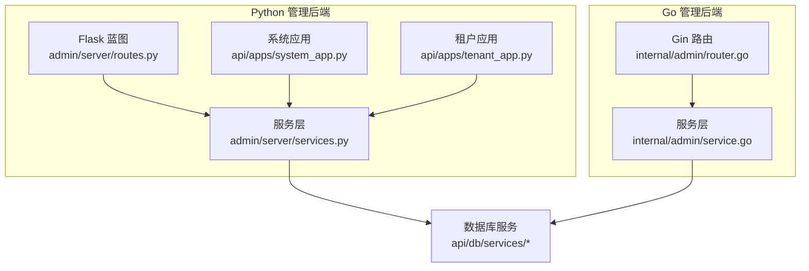
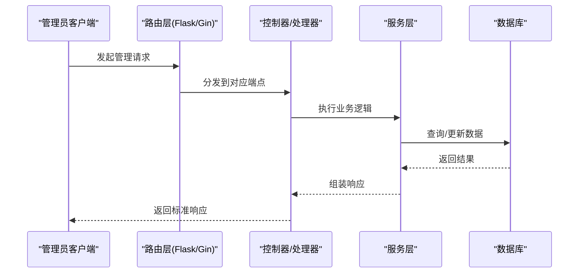
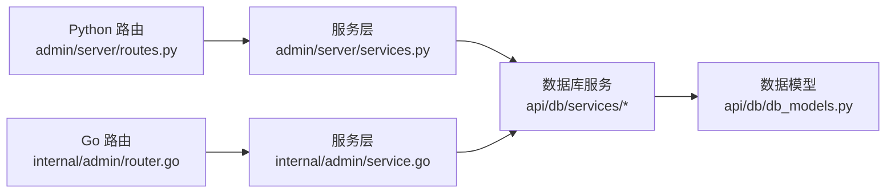

# 系统管理API

<cite>
**本文引用的文件**
- [routes.py](file://admin/server/routes.py)
- [router.go](file://internal/admin/router.go)
- [system_app.py](file://api/apps/system_app.py)
- [tenant_app.py](file://api/apps/tenant_app.py)
- [services.py](file://admin/server/services.py)
- [service.go](file://internal/admin/service.go)
- [user_service.py](file://api/db/services/user_service.py)
- [system_settings_service.py](file://api/db/services/system_settings_service.py)
- [api_utils.py](file://api/utils/api_utils.py)
- [versions.py](file://common/versions.py)
- [db_models.py](file://api/db/db_models.py)
</cite>

## 目录
1. [简介](#简介)
2. [项目结构](#项目结构)
3. [核心组件](#核心组件)
4. [架构总览](#架构总览)
5. [详细组件分析](#详细组件分析)
6. [依赖分析](#依赖分析)
7. [性能考量](#性能考量)
8. [故障排查指南](#故障排查指南)
9. [结论](#结论)
10. [附录](#附录)

## 简介
本文件为 RAGFlow 的系统管理 API 参考文档，覆盖系统配置、用户管理、租户管理、权限控制、沙箱配置与测试、版本与健康检查等核心能力。文档面向系统管理员与平台运维人员，提供端点清单、请求参数、响应格式、状态码、安全与审计要点、错误处理策略以及典型使用场景（如系统初始化、配置迁移、用户批量管理）的实现思路。

## 项目结构
RAGFlow 的系统管理能力由两套后端实现共同支撑：
- Python Flask 后端（admin/server）：提供管理员端口的用户、角色、变量、配置、环境、服务、沙箱等管理接口。
- Go Gin 后端（internal/admin）：提供健康检查、管理员登录鉴权、路由注册等基础能力，并与 Python 管理接口互补。

图表来源
- [routes.py:34-655](file://admin/server/routes.py#L34-L655)
- [services.py:40-724](file://admin/server/services.py#L40-L724)
- [system_app.py:42-378](file://api/apps/system_app.py#L42-L378)
- [tenant_app.py:31-145](file://api/apps/tenant_app.py#L31-L145)
- [router.go:36-130](file://internal/admin/router.go#L36-L130)
- [service.go:51-92](file://internal/admin/service.go#L51-L92)

章节来源
- [routes.py:34-655](file://admin/server/routes.py#L34-L655)
- [router.go:36-130](file://internal/admin/router.go#L36-L130)

## 核心组件
- 管理员认证与鉴权：支持登录、登出、鉴权校验；Python 端通过装饰器与响应封装，Go 端提供中间件与令牌校验。
- 用户管理：用户列表、创建、删除、密码修改、激活状态变更、管理员权限授予/撤销、用户详情、用户数据集/代理查询。
- 角色与权限：角色创建/更新/删除/查询、角色权限授予/撤销、用户角色更新、用户权限查询。
- 系统变量与配置：变量读取/写入、配置列表、环境变量展示。
- 服务与沙箱：服务列表与健康检查、沙箱提供商列表与配置、沙箱连接测试。
- 租户管理：租户内成员列表、邀请成员、移除成员、加入租户同意、租户列表。
- 健康检查与版本：系统状态、健康检查、版本号查询。

章节来源
- [routes.py:42-655](file://admin/server/routes.py#L42-L655)
- [services.py:40-724](file://admin/server/services.py#L40-L724)
- [system_app.py:42-378](file://api/apps/system_app.py#L42-L378)
- [tenant_app.py:31-145](file://api/apps/tenant_app.py#L31-L145)
- [router.go:36-130](file://internal/admin/router.go#L36-L130)
- [service.go:105-120](file://internal/admin/service.go#L105-L120)

## 架构总览
系统管理 API 采用分层设计：
- 接口层：Flask/Gin 路由负责暴露 REST 端点。
- 控制器层：蓝图/处理器解析请求、执行业务逻辑。
- 服务层：封装用户、角色、系统设置、沙箱等管理操作。
- 数据访问层：Peewee ORM 访问数据库，Go DAO 提供底层数据访问。
- 模型层：统一的数据模型与序列化。

图表来源
- [routes.py:42-655](file://admin/server/routes.py#L42-L655)
- [router.go:36-130](file://internal/admin/router.go#L36-L130)
- [services.py:40-724](file://admin/server/services.py#L40-L724)
- [service.go:51-92](file://internal/admin/service.go#L51-L92)

## 详细组件分析

### 管理员认证与会话
- 登录
  - 方法与路径：POST /api/v1/admin/login
  - 请求体：{"email": "string", "password": "string"}
  - 成功返回：{"code": 0, "message": "登录成功", "data": {"access_token": "string"}}
  - 失败返回：{"code": 非0, "message": "错误描述"}
  - 状态码：200 成功，400 参数错误，500 服务器错误
- 登出
  - 方法与路径：GET /api/v1/admin/logout
  - 鉴权：需要管理员令牌
  - 成功返回：{"code": 0, "message": "true"}
- 鉴权校验
  - 方法与路径：GET /api/v1/admin/auth
  - 鉴权：需要管理员令牌
  - 成功返回：{"code": 0, "message": "Admin is authorized"}

章节来源
- [routes.py:42-73](file://admin/server/routes.py#L42-L73)
- [router.go:44-56](file://internal/admin/router.go#L44-L56)

### 用户管理
- 获取所有用户
  - 方法与路径：GET /api/v1/admin/users
  - 鉴权：管理员
  - 成功返回：用户列表数组
- 创建用户
  - 方法与路径：POST /api/v1/admin/users
  - 请求体：{"username": "邮箱", "password": "字符串(加密密文)", "role": "user|admin(可选)"}
  - 成功返回：用户信息（不含密码）
- 删除用户
  - 方法与路径：DELETE /api/v1/admin/users/{username}
  - 成功返回：{"code": 0, "message": "删除成功"}
- 修改用户密码
  - 方法与路径：PUT /api/v1/admin/users/{username}/password
  - 请求体：{"new_password": "字符串(加密密文)"}
- 切换用户激活状态
  - 方法与路径：PUT /api/v1/admin/users/{username}/activate
  - 请求体：{"activate_status": "on|off"}
- 授予/撤销管理员权限
  - 方法与路径：PUT/DELETE /api/v1/admin/users/{username}/admin
  - 注意：不可对自己进行授权/撤销
- 获取用户详情
  - 方法与路径：GET /api/v1/admin/users/{username}
- 获取用户数据集/代理
  - 方法与路径：GET /api/v1/admin/users/{username}/datasets
  - 方法与路径：GET /api/v1/admin/users/{username}/agents

章节来源
- [routes.py:75-238](file://admin/server/routes.py#L75-L238)
- [services.py:40-225](file://admin/server/services.py#L40-L225)
- [user_service.py:166-168](file://api/db/services/user_service.py#L166-L168)

### 角色与权限管理
- 创建角色
  - 方法与路径：POST /api/v1/admin/roles
  - 请求体：{"role_name": "string", "description": "string"}
- 更新角色描述
  - 方法与路径：PUT /api/v1/admin/roles/{role_name}
  - 请求体：{"description": "string"}
- 删除角色
  - 方法与路径：DELETE /api/v1/admin/roles/{role_name}
- 列表角色
  - 方法与路径：GET /api/v1/admin/roles
- 获取角色权限
  - 方法与路径：GET /api/v1/admin/roles/{role_name}/permission
- 授予权限
  - 方法与路径：POST /api/v1/admin/roles/{role_name}/permission
  - 请求体：{"actions": ["string"], "resource": "string"}
- 撤销权限
  - 方法与路径：DELETE /api/v1/admin/roles/{role_name}/permission
- 更新用户角色
  - 方法与路径：PUT /api/v1/admin/users/{user_name}/role
  - 请求体：{"role_name": "string"}
- 查询用户权限
  - 方法与路径：GET /api/v1/admin/users/{user_name}/permission

章节来源
- [routes.py:295-415](file://admin/server/routes.py#L295-L415)
- [services.py:40-225](file://admin/server/services.py#L40-L225)

### 系统变量与配置
- 设置变量
  - 方法与路径：PUT /api/v1/admin/variables
  - 请求体：{"var_name": "string", "var_value": "string"}
- 获取变量
  - 方法与路径：GET /api/v1/admin/variables
  - 不带请求体：返回全部变量列表
  - 带请求体：{"var_name": "string"} 返回指定变量
- 获取配置
  - 方法与路径：GET /api/v1/admin/configs
- 获取环境
  - 方法与路径：GET /api/v1/admin/environments

章节来源
- [routes.py:417-486](file://admin/server/routes.py#L417-L486)
- [services.py:332-427](file://admin/server/services.py#L332-L427)
- [system_settings_service.py:26-44](file://api/db/services/system_settings_service.py#L26-L44)

### 服务与沙箱
- 获取服务列表
  - 方法与路径：GET /api/v1/admin/services
- 获取服务详情
  - 方法与路径：GET /api/v1/admin/services/{service_id}
- 关闭/重启服务
  - 方法与路径：DELETE/PUT /api/v1/admin/services/{service_id}
- 沙箱提供商列表
  - 方法与路径：GET /api/v1/admin/sandbox/providers
- 获取沙箱配置
  - 方法与路径：GET /api/v1/admin/sandbox/config
- 设置沙箱配置
  - 方法与路径：POST /api/v1/admin/sandbox/config
  - 请求体：{"provider_type": "string", "config": "object", "set_active": "boolean(可选)"}
- 测试沙箱连接
  - 方法与路径：POST /api/v1/admin/sandbox/test
  - 请求体：{"provider_type": "string", "config": "object"}

章节来源
- [routes.py:240-655](file://admin/server/routes.py#L240-L655)
- [services.py:270-724](file://admin/server/services.py#L270-L724)

### 租户管理
- 获取租户内成员列表
  - 方法与路径：GET /api/v1/admin/{tenant_id}/user/list
  - 鉴权：仅租户拥有者或当前用户
- 邀请成员
  - 方法与路径：POST /api/v1/admin/{tenant_id}/user
  - 请求体：{"email": "string"}
- 移除成员
  - 方法与路径：DELETE /api/v1/admin/{tenant_id}/user/{user_id}
- 加入租户同意
  - 方法与路径：PUT /api/v1/admin/agree/{tenant_id}
- 租户列表
  - 方法与路径：GET /api/v1/admin/tenant/list

章节来源
- [tenant_app.py:31-145](file://api/apps/tenant_app.py#L31-L145)

### 健康检查与版本
- 健康检查
  - 方法与路径：GET /health（Go 路由）
  - 方法与路径：GET /api/v1/admin/ping（Python 路由）
- 系统状态
  - 方法与路径：GET /api/v1/system/status
  - 返回：文档引擎、存储、数据库、Redis 等健康状态
- 健康检查（轻量）
  - 方法与路径：GET /api/v1/system/healthz
- 版本查询
  - 方法与路径：GET /api/v1/admin/version 或 /api/v1/system/version
  - 返回：{"version": "string"}

章节来源
- [router.go:38-44](file://internal/admin/router.go#L38-L44)
- [routes.py:37-39](file://admin/server/routes.py#L37-L39)
- [system_app.py:65-219](file://api/apps/system_app.py#L65-L219)
- [versions.py:23-51](file://common/versions.py#L23-L51)

### API 密钥管理（用户级）
- 生成用户 API Key
  - 方法与路径：POST /api/v1/admin/users/{username}/keys
  - 返回：包含 tenant_id、token、beta、时间戳等
- 获取用户 API Keys
  - 方法与路径：GET /api/v1/admin/users/{username}/keys
- 删除用户 API Key
  - 方法与路径：DELETE /api/v1/admin/users/{username}/keys/{key}

章节来源
- [routes.py:488-547](file://admin/server/routes.py#L488-L547)
- [services.py:151-192](file://admin/server/services.py#L151-L192)

## 依赖分析
- Python 管理后端依赖于数据库服务层（UserService、UserTenantService、SystemSettingsService 等），并通过统一的响应工具类进行标准化输出。
- Go 管理后端提供基础路由与鉴权，与 Python 管理接口并行存在，互不冲突。
- 沙箱配置通过系统设置表持久化，支持多种提供商（自管、阿里云、E2B）。

图表来源
- [routes.py:34-655](file://admin/server/routes.py#L34-L655)
- [router.go:36-130](file://internal/admin/router.go#L36-L130)
- [services.py:40-724](file://admin/server/services.py#L40-L724)
- [service.go:51-92](file://internal/admin/service.go#L51-L92)
- [db_models.py:707-770](file://api/db/db_models.py#L707-L770)

章节来源
- [api_utils.py:247-341](file://api/utils/api_utils.py#L247-L341)
- [db_models.py:707-770](file://api/db/db_models.py#L707-L770)

## 性能考量
- 连接池与重试：数据库连接具备重试与断线恢复机制，降低瞬时异常对管理操作的影响。
- 健康检查：系统状态接口聚合多个子系统健康检查，建议在高可用部署中结合外部监控告警。
- 沙箱测试：连接测试包含超时控制与清理流程，避免测试实例泄漏。

章节来源
- [db_models.py:260-482](file://api/db/db_models.py#L260-L482)
- [services.py:592-724](file://admin/server/services.py#L592-L724)

## 故障排查指南
- 认证失败
  - 现象：返回 401/未授权
  - 排查：确认管理员令牌有效、未被登出失效、请求头格式正确
- 参数错误
  - 现象：返回参数缺失或非法
  - 排查：核对必填字段、数据类型与枚举值
- 权限不足
  - 现象：返回权限错误
  - 排查：确认当前用户是否为管理员、目标用户状态是否激活
- 数据库异常
  - 现象：操作失败或超时
  - 排查：查看数据库连接池状态、重试日志、事务回滚情况
- 沙箱配置错误
  - 现象：设置失败或连接测试失败
  - 排查：核对提供商类型、必填字段、类型范围，查看详细错误信息

章节来源
- [api_utils.py:135-151](file://api/utils/api_utils.py#L135-L151)
- [routes.py:42-73](file://admin/server/routes.py#L42-L73)

## 结论
RAGFlow 的系统管理 API 提供了完善的管理员能力，涵盖用户与权限、租户协作、系统配置与健康监控、沙箱集成等关键领域。通过标准化的响应格式、严格的鉴权与错误处理，能够满足生产环境下的运维与治理需求。建议在生产环境中配合外部监控、审计与备份策略，确保系统稳定与数据安全。

## 附录

### 使用示例与最佳实践
- 系统初始化
  - 步骤：创建管理员账户 → 设置默认租户与模型 → 配置系统变量 → 开启必要的沙箱提供商
  - 参考端点：POST /api/v1/admin/users、POST /api/v1/admin/variables、POST /api/v1/admin/sandbox/config
- 配置迁移
  - 步骤：导出变量列表 → 在新环境导入 → 校验环境变量一致性
  - 参考端点：GET /api/v1/admin/variables、PUT /api/v1/admin/variables
- 用户批量管理
  - 步骤：批量创建用户 → 批量分配角色 → 定期清理非活跃用户
  - 参考端点：POST /api/v1/admin/users、PUT /api/v1/admin/users/{username}/activate、DELETE /api/v1/admin/users/{username}
- 租户协作
  - 步骤：邀请成员 → 设置角色 → 同意加入 → 定期审计权限
  - 参考端点：POST /api/v1/admin/{tenant_id}/user、PUT /api/v1/admin/agree/{tenant_id}

### 安全与审计
- 安全
  - 强密码策略：建议对密码强度进行约束（可通过系统变量或前端校验）
  - 最小权限原则：仅授予必要角色与权限
  - 令牌管理：定期轮换管理员令牌，登出后立即失效
- 审计
  - 建议记录管理员操作日志（创建/删除用户、授予权限、修改配置等）
  - 对敏感操作增加二次确认与审批流程

### 错误码与响应格式
- 标准响应格式
  - {"code": 整数, "message": "字符串", "data": 任意}
- 常见错误码
  - 400 参数错误
  - 401 未授权
  - 403 权限不足
  - 404 资源不存在
  - 500 服务器内部错误

章节来源
- [api_utils.py:247-341](file://api/utils/api_utils.py#L247-L341)