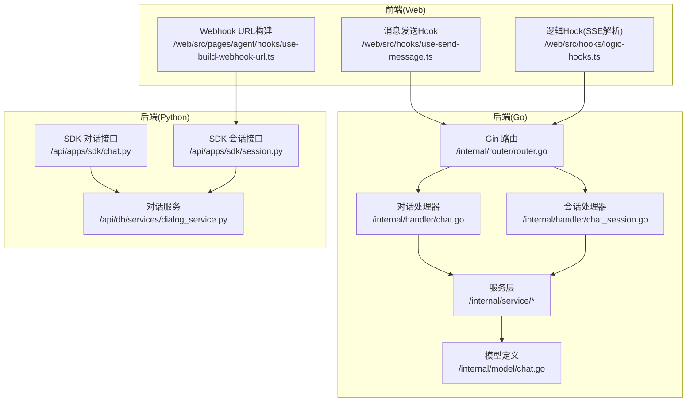
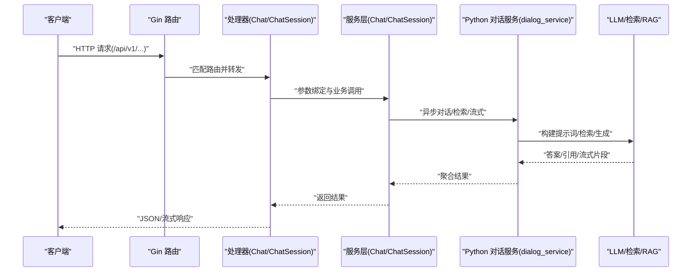
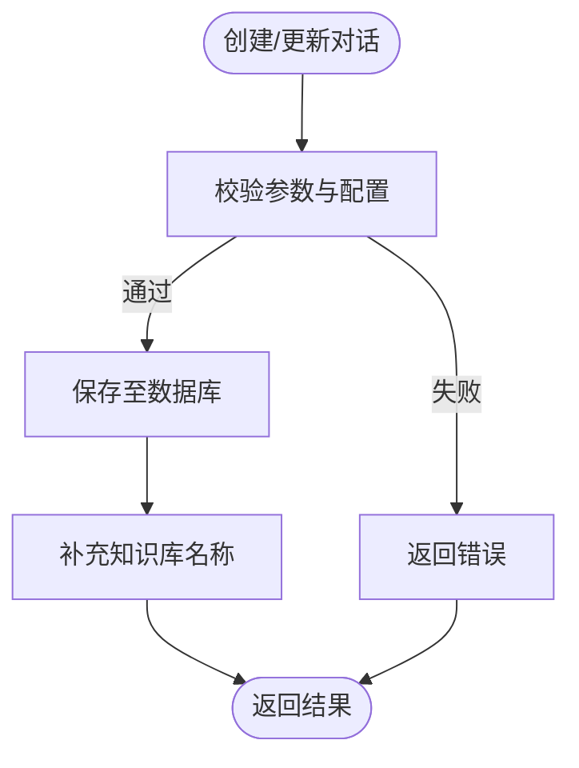
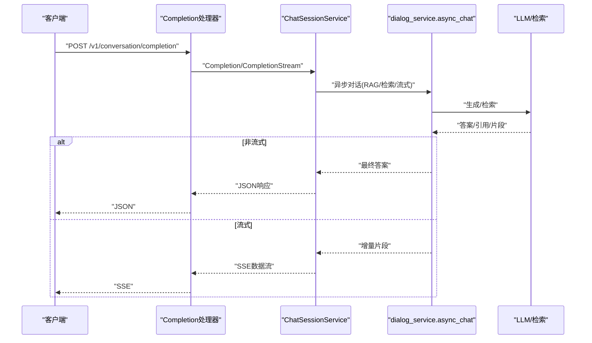
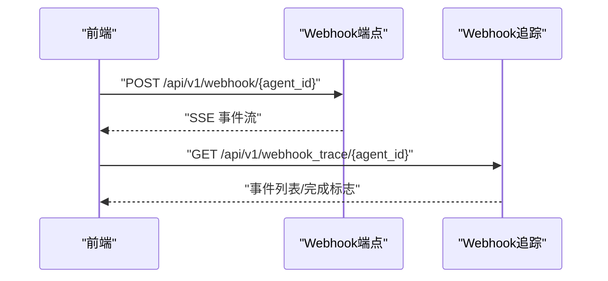
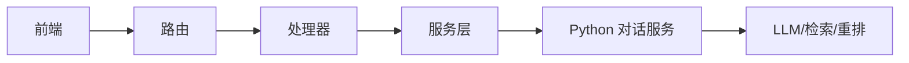

# 聊天助手API

<cite>
**本文引用的文件**
- [internal/router/router.go](file://internal/router/router.go)
- [internal/handler/chat.go](file://internal/handler/chat.go)
- [internal/handler/chat_session.go](file://internal/handler/chat_session.go)
- [internal/service/chat.go](file://internal/service/chat.go)
- [internal/service/chat_session.go](file://internal/service/chat_session.go)
- [internal/model/chat.go](file://internal/model/chat.go)
- [api/apps/sdk/chat.py](file://api/apps/sdk/chat.py)
- [api/apps/sdk/session.py](file://api/apps/sdk/session.py)
- [api/db/services/dialog_service.py](file://api/db/services/dialog_service.py)
- [web/src/hooks/use-send-message.ts](file://web/src/hooks/use-send-message.ts)
- [web/src/hooks/logic-hooks.ts](file://web/src/hooks/logic-hooks.ts)
- [web/src/pages/agent/hooks/use-build-webhook-url.ts](file://web/src/pages/agent/hooks/use-build-webhook-url.ts)
- [api/apps/sdk/agents.py](file://api/apps/sdk/agents.py)
- [mcp/server/server.py](file://mcp/server/server.py)
- [web/src/interfaces/database/mcp-server.ts](file://web/src/interfaces/database/mcp-server.ts)
</cite>

## 目录
1. [简介](#简介)
2. [项目结构](#项目结构)
3. [核心组件](#核心组件)
4. [架构总览](#架构总览)
5. [详细组件分析](#详细组件分析)
6. [依赖分析](#依赖分析)
7. [性能考虑](#性能考虑)
8. [故障排查指南](#故障排查指南)
9. [结论](#结论)
10. [附录](#附录)

## 简介
本文件为 RAGFlow 聊天助手 API 的权威参考文档，覆盖聊天助手的创建、配置、会话管理、消息发送、相关问题生成等核心能力，并提供接口规范、参数说明、响应格式、状态码、权限控制、会话隔离、数据安全、性能优化、并发处理、错误恢复策略以及 Webhook 集成、实时消息推送、聊天助手嵌入等实践示例。

## 项目结构
RAGFlow 的聊天助手能力由后端 Go/Gin 路由与服务层、Python SDK/服务层、前端 Web 客户端共同组成：
- 后端路由：统一在 Gin 引擎上注册，按模块分组（对话、会话、LLM、文件、检索等）
- 服务层：Go 层负责路由到具体 Handler；Python 层负责对话、检索、RAG、流式输出等业务逻辑
- 前端：通过 SSE/HTTP 接口与后端交互，支持实时消息推送与 Webhook 追踪

图表来源
- [internal/router/router.go:78-259](file://internal/router/router.go#L78-L259)
- [internal/handler/chat.go:43-260](file://internal/handler/chat.go#L43-L260)
- [internal/handler/chat_session.go:44-323](file://internal/handler/chat_session.go#L44-L323)
- [internal/service/chat.go:32-624](file://internal/service/chat.go#L32-L624)
- [internal/service/chat_session.go:32-800](file://internal/service/chat_session.go#L32-L800)
- [internal/model/chat.go:21-67](file://internal/model/chat.go#L21-L67)
- [api/apps/sdk/chat.py:27-330](file://api/apps/sdk/chat.py#L27-L330)
- [api/apps/sdk/session.py:57-800](file://api/apps/sdk/session.py#L57-L800)
- [api/db/services/dialog_service.py:454-781](file://api/db/services/dialog_service.py#L454-L781)
- [web/src/hooks/use-send-message.ts:95-145](file://web/src/hooks/use-send-message.ts#L95-L145)
- [web/src/hooks/logic-hooks.ts:239-279](file://web/src/hooks/logic-hooks.ts#L239-L279)
- [web/src/pages/agent/hooks/use-build-webhook-url.ts:1-8](file://web/src/pages/agent/hooks/use-build-webhook-url.ts#L1-L8)

章节来源
- [internal/router/router.go:78-259](file://internal/router/router.go#L78-L259)

## 核心组件
- 路由与鉴权
  - 所有受保护路由均通过认证中间件，路径前缀为 /api/v1
  - 对话与会话相关接口位于 /v1/dialog 与 /v1/conversation 下
- 处理器
  - ChatHandler：对话 CRUD、列表、移除
  - ChatSessionHandler：会话 CRUD、列表、消息补全（含流式）
- 服务层
  - ChatService：对话模型的创建/更新/删除、列表查询、参数校验
  - ChatSessionService：会话创建/更新/删除、列表查询、消息补全（非流式/流式）、引用构建
- 模型
  - Chat（对话/助手）与 ChatSession（会话）持久化模型
- SDK/服务
  - Python SDK 提供聊天助手创建、更新、删除、列表、会话创建/列表/删除、OpenAI 兼容补全等
  - dialog_service 实现 RAG、检索、引用、流式输出、工具调用、Langfuse 追踪等

章节来源
- [internal/handler/chat.go:43-260](file://internal/handler/chat.go#L43-L260)
- [internal/handler/chat_session.go:44-323](file://internal/handler/chat_session.go#L44-L323)
- [internal/service/chat.go:32-624](file://internal/service/chat.go#L32-L624)
- [internal/service/chat_session.go:32-800](file://internal/service/chat_session.go#L32-L800)
- [internal/model/chat.go:21-67](file://internal/model/chat.go#L21-L67)
- [api/apps/sdk/chat.py:27-330](file://api/apps/sdk/chat.py#L27-L330)
- [api/apps/sdk/session.py:57-800](file://api/apps/sdk/session.py#L57-L800)
- [api/db/services/dialog_service.py:454-781](file://api/db/services/dialog_service.py#L454-L781)

## 架构总览
下图展示从客户端到后端服务的整体调用链路，包括 Go 路由、处理器、服务层、Python 对话服务与流式输出。

图表来源
- [internal/router/router.go:78-259](file://internal/router/router.go#L78-L259)
- [internal/handler/chat.go:43-260](file://internal/handler/chat.go#L43-L260)
- [internal/handler/chat_session.go:220-323](file://internal/handler/chat_session.go#L220-L323)
- [internal/service/chat_session.go:261-396](file://internal/service/chat_session.go#L261-L396)
- [api/db/services/dialog_service.py:454-781](file://api/db/services/dialog_service.py#L454-L781)

## 详细组件分析

### 路由与权限控制
- 受保护路由组：/api/v1 下所有接口需通过认证中间件
- 对话接口
  - GET /v1/dialog/list：列出当前用户有效对话
  - POST /v1/dialog/next：高级过滤/分页/排序列表
  - POST /v1/dialog/set：创建或更新对话（需提供 prompt_config）
  - POST /v1/dialog/rm：软删除对话（仅对话拥有者可操作）
- 会话接口
  - POST /v1/conversation/set：创建/更新会话（is_new=true 创建新会话）
  - POST /v1/conversation/rm：删除会话（仅会话所属对话拥有者可操作）
  - GET /v1/conversation/list：列出指定对话下的会话
  - POST /v1/conversation/completion：消息补全（支持流式/非流式）

章节来源
- [internal/router/router.go:124-232](file://internal/router/router.go#L124-L232)
- [internal/handler/chat.go:43-260](file://internal/handler/chat.go#L43-L260)
- [internal/handler/chat_session.go:44-196](file://internal/handler/chat_session.go#L44-L196)

### 对话（聊天助手）创建与配置
- 创建/更新对话
  - 请求体关键字段：name、description、icon、top_n、top_k、rerank_id、similarity_threshold、vector_similarity_weight、llm_setting、meta_data_filter、prompt_config（必填）、kb_ids、llm_id
  - 参数校验：名称长度、重复性、系统提示中参数占位符一致性、知识库嵌入模型一致性、rerank 模型存在性
  - 返回：对话对象及关联知识库名称列表
- 列表与过滤
  - 支持关键词、分页、排序、拥有者过滤
- 删除
  - 仅对话拥有者可执行软删除（状态置为无效）

图表来源
- [internal/service/chat.go:232-519](file://internal/service/chat.go#L232-L519)
- [api/apps/sdk/chat.py:27-144](file://api/apps/sdk/chat.py#L27-L144)

章节来源
- [internal/service/chat.go:232-519](file://internal/service/chat.go#L232-L519)
- [api/apps/sdk/chat.py:27-144](file://api/apps/sdk/chat.py#L27-L144)

### 会话管理与消息补全
- 会话创建/更新
  - is_new=true：根据对话配置初始化 prologue，创建会话并返回
  - is_new=false：更新会话名称与时间戳
- 会话列表
  - 仅对话拥有者可查询
- 消息补全
  - 非流式：直接返回答案与引用
  - 流式：SSE 分片输出，最后输出完成标记
  - 行为：过滤 system 消息与首个 assistant 消息；支持自定义 llm_id 与生成参数覆盖；维护会话消息与引用数组

图表来源
- [internal/handler/chat_session.go:220-323](file://internal/handler/chat_session.go#L220-L323)
- [internal/service/chat_session.go:261-396](file://internal/service/chat_session.go#L261-L396)
- [api/db/services/dialog_service.py:454-781](file://api/db/services/dialog_service.py#L454-L781)

章节来源
- [internal/handler/chat_session.go:220-323](file://internal/handler/chat_session.go#L220-L323)
- [internal/service/chat_session.go:261-396](file://internal/service/chat_session.go#L261-L396)
- [api/db/services/dialog_service.py:454-781](file://api/db/services/dialog_service.py#L454-L781)

### 数据模型与存储
- 对话（Chat/Dialog）：包含 llm_id、llm_setting、prompt_config、kb_ids、top_n/top_k、rerank_id、相似度阈值与权重、状态等
- 会话（ChatSession）：包含对话ID、消息数组（JSON）、引用数组（JSON）、用户ID等

章节来源
- [internal/model/chat.go:21-67](file://internal/model/chat.go#L21-L67)

### Python SDK 与 OpenAI 兼容接口
- 聊天助手（SDK）
  - POST /api/v1/chats：创建聊天助手（校验数据集、嵌入模型一致性、默认参数填充）
  - PUT /api/v1/chats/<chat_id>：更新聊天助手
  - DELETE /api/v1/chats：批量删除
  - GET /api/v1/chats：列表查询（映射 prompt_config、llm_setting、kb_ids）
- 会话（SDK）
  - POST /api/v1/chats/<chat_id>/sessions：创建会话
  - PUT /api/v1/chats/<chat_id>/sessions/<session_id>：更新会话（限制字段）
  - GET /api/v1/chats/<chat_id>/sessions：会话列表（引用映射）
  - DELETE /api/v1/chats/<chat_id>/sessions：批量删除会话
- OpenAI 兼容补全
  - POST /api/v1/chats_openai/<chat_id>/chat/completions：兼容 OpenAI 风格的消息输入、流式/非流式、引用元数据、条件检索
  - POST /api/v1/agents_openai/<agent_id>/chat/completions：代理兼容补全
  - POST /api/v1/agents/<agent_id>/completions：代理非流式/流式

章节来源
- [api/apps/sdk/chat.py:27-330](file://api/apps/sdk/chat.py#L27-L330)
- [api/apps/sdk/session.py:57-800](file://api/apps/sdk/session.py#L57-L800)

### 权限控制、会话隔离与数据安全
- 访问控制
  - 所有受保护路由需通过认证中间件
  - 删除/列表等操作对“拥有者”进行校验（对话/会话所属租户/用户）
- 会话隔离
  - 会话与对话强关联，列表与删除均基于对话拥有者校验
- 数据安全
  - 对话与会话状态字段用于软删除与可见性控制
  - Python SDK 在创建/更新时校验数据集与嵌入模型一致性，避免跨模型检索

章节来源
- [internal/handler/chat.go:209-260](file://internal/handler/chat.go#L209-L260)
- [internal/handler/chat_session.go:93-196](file://internal/handler/chat_session.go#L93-L196)
- [api/apps/sdk/chat.py:27-144](file://api/apps/sdk/chat.py#L27-L144)

### 性能优化与并发处理
- 流式输出
  - SSE 分片传输，前端逐段渲染，降低首屏延迟
- 并发与池化
  - Python 层使用线程池执行多任务（如检索、工具调用），具备扩展/收缩机制
- Token 估算与追踪
  - Python 对话服务统计各阶段耗时与 Token 使用，便于性能分析
- 会话消息与引用缓存
  - 服务层维护会话消息与引用数组，减少重复计算

章节来源
- [web/src/hooks/use-send-message.ts:95-145](file://web/src/hooks/use-send-message.ts#L95-L145)
- [web/src/hooks/logic-hooks.ts:239-279](file://web/src/hooks/logic-hooks.ts#L239-L279)
- [api/db/services/dialog_service.py:707-741](file://api/db/services/dialog_service.py#L707-L741)
- [common/data_source/utils.py:1100-1126](file://common/data_source/utils.py#L1100-L1126)

### 错误恢复策略
- 参数校验失败：返回 400，包含错误信息
- 未授权操作：返回 403，提示仅拥有者可操作
- 内部错误：返回 500，包含错误描述
- 流式场景：错误以 SSE 片段形式返回，最后输出完成标记

章节来源
- [internal/handler/chat.go:209-260](file://internal/handler/chat.go#L209-L260)
- [internal/handler/chat_session.go:220-323](file://internal/handler/chat_session.go#L220-L323)
- [internal/service/chat_session.go:317-396](file://internal/service/chat_session.go#L317-L396)

### 使用示例

#### Webhook 集成与事件追踪
- 构建 Webhook URL：/api/v1/webhook/{agent_id}
- 事件流：/api/v1/webhook_trace/{agent_id} 获取事件与完成状态
- 前端集成：通过 SSE 解析事件流，渲染消息与追踪信息

图表来源
- [web/src/pages/agent/hooks/use-build-webhook-url.ts:1-8](file://web/src/pages/agent/hooks/use-build-webhook-url.ts#L1-L8)
- [api/apps/sdk/agents.py:835-938](file://api/apps/sdk/agents.py#L835-L938)
- [web/src/hooks/logic-hooks.ts:239-279](file://web/src/hooks/logic-hooks.ts#L239-L279)

#### 实时消息推送与聊天助手嵌入
- 前端通过 SSE 接收流式回答，解析 data 字段，逐步更新 UI
- 支持取消请求（AbortController），避免长时间连接占用
- 可在消息中携带引用（chunks/doc_aggs），用于溯源与增强可信度

章节来源
- [web/src/hooks/use-send-message.ts:95-145](file://web/src/hooks/use-send-message.ts#L95-L145)
- [web/src/hooks/logic-hooks.ts:239-279](file://web/src/hooks/logic-hooks.ts#L239-L279)
- [api/db/services/dialog_service.py:454-781](file://api/db/services/dialog_service.py#L454-L781)

## 依赖分析
- 组件耦合
  - 路由 -> 处理器 -> 服务层 -> Python 对话服务
  - 前端通过 HTTP/SSE 与后端交互，解耦于具体实现
- 外部依赖
  - LLM/检索/重排/语音合成等通过模型包与检索器实现
  - Langfuse 可选追踪，不影响核心流程

图表来源
- [internal/router/router.go:78-259](file://internal/router/router.go#L78-L259)
- [internal/handler/chat_session.go:220-323](file://internal/handler/chat_session.go#L220-L323)
- [api/db/services/dialog_service.py:454-781](file://api/db/services/dialog_service.py#L454-L781)

## 性能考虑
- 流式输出优先：SSE 分片传输，前端逐步渲染，显著降低感知延迟
- Token 估算与阶段耗时统计：便于定位瓶颈（检索、生成、引用插入）
- 线程池并发：在检索与工具调用场景提升吞吐
- 会话消息与引用缓存：减少重复计算，提高多轮对话效率

## 故障排查指南
- 常见错误码
  - 400：请求参数不合法（如缺少 prompt_config、参数校验失败）
  - 403：未授权（非对话/会话拥有者）
  - 500：内部错误（模型不可用、检索异常、引用生成失败）
- 排查步骤
  - 检查认证头与租户权限
  - 校验对话参数（prompt_config、kb_ids、llm_setting、rerank_id）
  - 查看流式响应中的错误片段与完成标记
  - 开启 Langfuse 追踪定位耗时热点

章节来源
- [internal/handler/chat.go:209-260](file://internal/handler/chat.go#L209-L260)
- [internal/handler/chat_session.go:220-323](file://internal/handler/chat_session.go#L220-L323)
- [api/db/services/dialog_service.py:707-741](file://api/db/services/dialog_service.py#L707-L741)

## 结论
RAGFlow 聊天助手 API 提供了从对话创建、配置到会话管理与消息补全的完整能力，支持流式与非流式两种模式，具备完善的权限控制、会话隔离与数据安全保障。通过 Python SDK 与 OpenAI 兼容接口，开发者可快速集成 RAG 能力并实现 Webhook 事件追踪与实时消息推送。建议在生产环境中启用 SSE 流式输出、Langfuse 追踪与线程池并发，以获得更优的用户体验与可观测性。

## 附录

### 接口规范总览
- 对话（/api/v1）
  - GET /v1/dialog/list：列出当前用户有效对话
  - POST /v1/dialog/next：高级过滤/分页/排序列表
  - POST /v1/dialog/set：创建/更新对话（需 prompt_config）
  - POST /v1/dialog/rm：软删除对话（仅拥有者）
- 会话（/api/v1）
  - POST /v1/conversation/set：创建/更新会话（is_new）
  - POST /v1/conversation/rm：删除会话（仅拥有者）
  - GET /v1/conversation/list：列出会话（需对话拥有者）
  - POST /v1/conversation/completion：消息补全（流式/非流式）

章节来源
- [internal/router/router.go:124-232](file://internal/router/router.go#L124-L232)