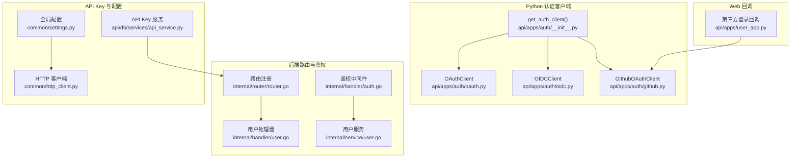
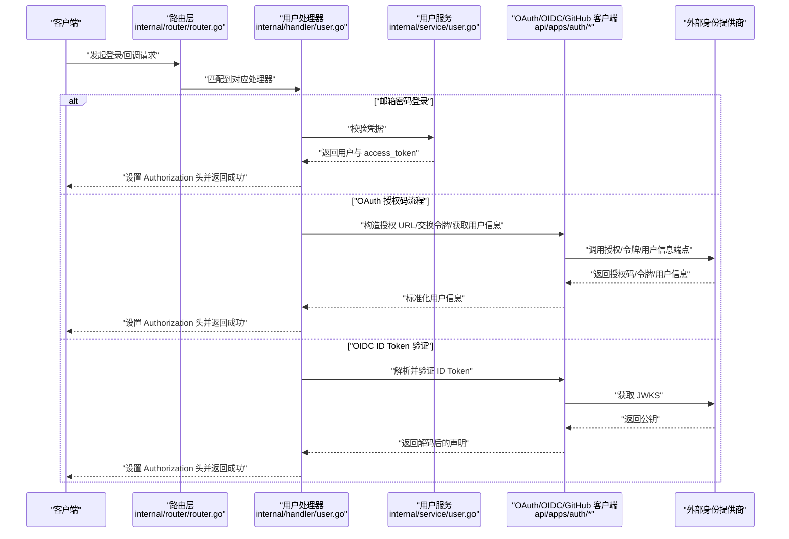
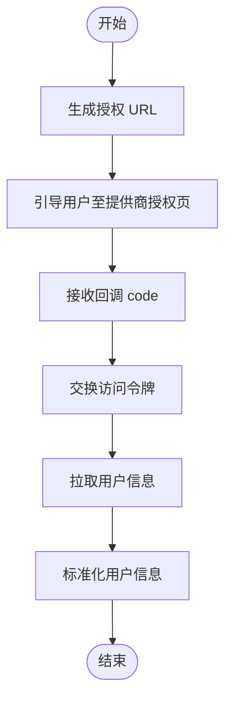
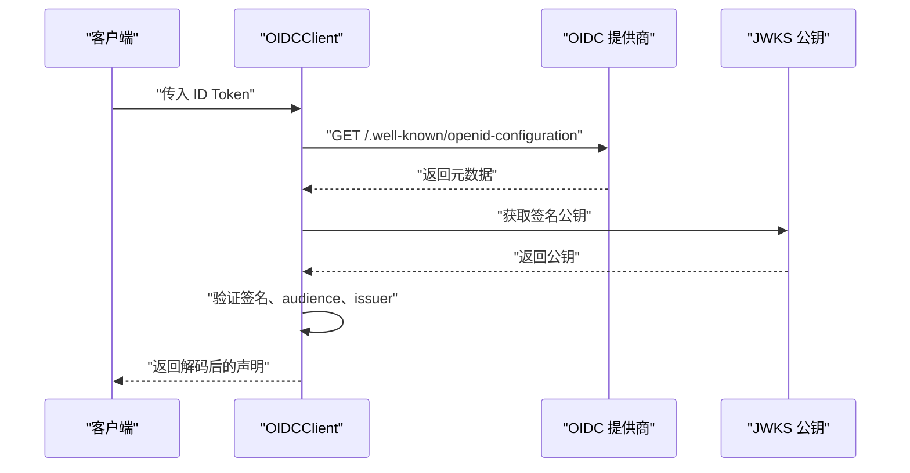
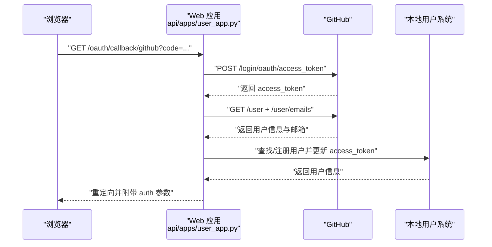
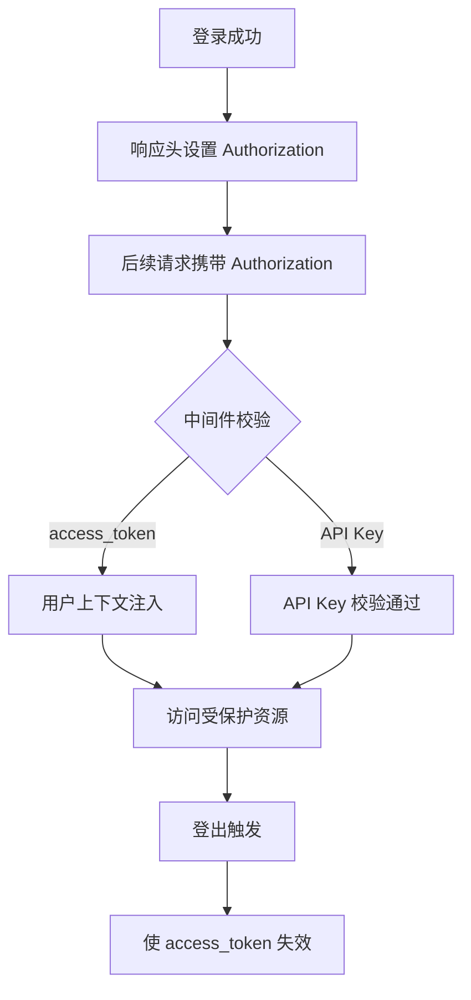
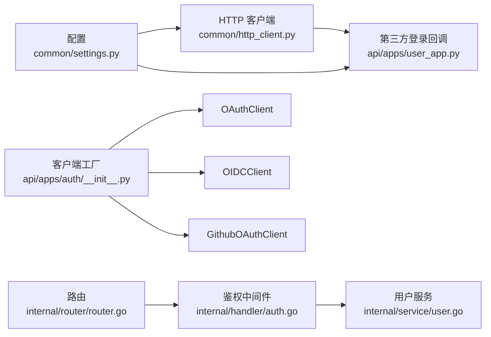

# 认证API

<cite>
**本文引用的文件**
- [oauth.py](file://api/apps/auth/oauth.py)
- [oidc.py](file://api/apps/auth/oidc.py)
- [github.py](file://api/apps/auth/github.py)
- [__init__.py](file://api/apps/auth/__init__.py)
- [user_app.py](file://api/apps/user_app.py)
- [router.go](file://internal/router/router.go)
- [auth.go](file://internal/handler/auth.go)
- [user.go](file://internal/handler/user.go)
- [user.go](file://internal/service/user.go)
- [api_service.py](file://api/db/services/api_service.py)
- [settings.py](file://common/settings.py)
- [http_client.py](file://common/http_client.py)
</cite>

## 目录
1. [简介](#简介)
2. [项目结构](#项目结构)
3. [核心组件](#核心组件)
4. [架构总览](#架构总览)
5. [详细组件分析](#详细组件分析)
6. [依赖分析](#依赖分析)
7. [性能考虑](#性能考虑)
8. [故障排查指南](#故障排查指南)
9. [结论](#结论)
10. [附录](#附录)

## 简介
本文件为 RAGFlow 的认证与第三方登录 API 参考文档，覆盖以下能力：
- OAuth 授权码流程（通用 OAuth2）
- OIDC 身份令牌验证（ID Token 解析与签名校验）
- GitHub 第三方登录回调
- API Key 认证与会话管理
- JWT 令牌处理与安全最佳实践
- 常见认证问题排查与失败处理

文档面向开发者与运维人员，提供端点定义、请求参数、响应格式、状态码、重定向配置与调用示例路径。

## 项目结构
认证相关代码主要分布在以下模块：
- Python 后端认证客户端库：api/apps/auth（OAuth/OIDC/GitHub 客户端）
- Web 应用第三方登录回调：api/apps/user_app.py
- 内部路由与鉴权中间件：internal/router/router.go、internal/handler/auth.go、internal/handler/user.go
- 用户服务与令牌校验：internal/service/user.go
- API Key 管理：api/db/services/api_service.py
- 配置与 HTTP 客户端：common/settings.py、common/http_client.py

**图表来源**
- [oauth.py:32-152](file://api/apps/auth/oauth.py#L32-L152)
- [oidc.py:22-108](file://api/apps/auth/oidc.py#L22-L108)
- [github.py:21-89](file://api/apps/auth/github.py#L21-L89)
- [__init__.py:22-41](file://api/apps/auth/__init__.py#L22-L41)
- [user_app.py:272-358](file://api/apps/user_app.py#L272-L358)
- [router.go:87-117](file://internal/router/router.go#L87-L117)
- [auth.go:42-96](file://internal/handler/auth.go#L42-L96)
- [user.go:45-224](file://internal/handler/user.go#L45-L224)
- [user.go:647-683](file://internal/service/user.go#L647-L683)
- [api_service.py:25-42](file://api/db/services/api_service.py#L25-L42)
- [settings.py:251-256](file://common/settings.py#L251-L256)
- [http_client.py:95-96](file://common/http_client.py#L95-L96)

**章节来源**
- [oauth.py:1-152](file://api/apps/auth/oauth.py#L1-L152)
- [oidc.py:1-108](file://api/apps/auth/oidc.py#L1-L108)
- [github.py:1-89](file://api/apps/auth/github.py#L1-L89)
- [__init__.py:1-41](file://api/apps/auth/__init__.py#L1-L41)
- [user_app.py:272-469](file://api/apps/user_app.py#L272-L469)
- [router.go:87-117](file://internal/router/router.go#L87-L117)
- [auth.go:1-96](file://internal/handler/auth.go#L1-L96)
- [user.go:1-200](file://internal/handler/user.go#L1-L200)
- [user.go:647-683](file://internal/service/user.go#L647-L683)
- [api_service.py:1-126](file://api/db/services/api_service.py#L1-L126)
- [settings.py:251-256](file://common/settings.py#L251-L256)
- [http_client.py:95-96](file://common/http_client.py#L95-L96)

## 核心组件
- OAuthClient：封装通用 OAuth2 流程（生成授权 URL、交换访问令牌、拉取用户信息）。
- OIDCClient：在 OAuth2 基础上扩展 OIDC 元数据发现、ID Token 解析与签名校验。
- GithubOAuthClient：针对 GitHub 的适配（用户信息与邮箱合并）。
- get_auth_client：根据配置自动选择 OAuth2/OIDC/GitHub 客户端类型。
- 第三方登录回调：统一处理 GitHub/飞书等回调，换取 access_token 并完成本地登录或注册。
- 鉴权中间件：从 Authorization 头提取并校验 access_token 或 API Key。
- API Key 服务：管理对话级 API Key 的生成、查询与统计。

**章节来源**
- [oauth.py:32-152](file://api/apps/auth/oauth.py#L32-L152)
- [oidc.py:22-108](file://api/apps/auth/oidc.py#L22-L108)
- [github.py:21-89](file://api/apps/auth/github.py#L21-L89)
- [__init__.py:22-41](file://api/apps/auth/__init__.py#L22-L41)
- [user_app.py:272-358](file://api/apps/user_app.py#L272-L358)
- [auth.go:42-96](file://internal/handler/auth.go#L42-L96)
- [api_service.py:25-42](file://api/db/services/api_service.py#L25-L42)

## 架构总览
下图展示认证与第三方登录的整体交互：

**图表来源**
- [router.go:87-117](file://internal/router/router.go#L87-L117)
- [user.go:160-224](file://internal/handler/user.go#L160-L224)
- [user.go:647-683](file://internal/service/user.go#L647-L683)
- [oauth.py:48-152](file://api/apps/auth/oauth.py#L48-L152)
- [oidc.py:60-108](file://api/apps/auth/oidc.py#L60-L108)
- [github.py:35-89](file://api/apps/auth/github.py#L35-L89)

## 详细组件分析

### OAuth 授权码流程（通用 OAuth2）
- 组件职责
  - 生成授权 URL（含 client_id、redirect_uri、response_type、可选 scope、state）
  - 使用授权码交换访问令牌
  - 拉取用户信息并标准化输出
- 关键方法
  - get_authorization_url(state=None)
  - exchange_code_for_token(code)/async_exchange_code_for_token(code)
  - fetch_user_info(access_token)/async_fetch_user_info(access_token)
  - normalize_user_info(user_info)
- 请求与响应
  - 授权 URL 参数：client_id、redirect_uri、response_type、scope、state
  - 交换令牌请求体：client_id、client_secret、code、redirect_uri、grant_type
  - 用户信息字段：email、username、nickname、avatar_url
- 示例路径
  - [OAuthClient 类定义:32-152](file://api/apps/auth/oauth.py#L32-L152)

**图表来源**
- [oauth.py:48-152](file://api/apps/auth/oauth.py#L48-L152)

**章节来源**
- [oauth.py:32-152](file://api/apps/auth/oauth.py#L32-L152)

### OIDC 身份令牌验证（ID Token）
- 组件职责
  - 通过 issuer 发现 OIDC 元数据（授权端点、令牌端点、用户信息端点、JWKS）
  - 解析并验证 ID Token（签名、audience、issuer）
  - 合并 ID Token 声明与访问令牌用户信息
- 关键方法
  - _load_oidc_metadata(issuer)
  - parse_id_token(id_token)
  - fetch_user_info(access_token, id_token=None)/async_fetch_user_info(access_token, id_token=None)
  - normalize_user_info(user_info)
- 示例路径
  - [OIDCClient 类定义:22-108](file://api/apps/auth/oidc.py#L22-L108)

**图表来源**
- [oidc.py:46-108](file://api/apps/auth/oidc.py#L46-L108)

**章节来源**
- [oidc.py:22-108](file://api/apps/auth/oidc.py#L22-L108)

### GitHub 第三方登录回调
- 组件职责
  - 处理 /oauth/callback/github 回调（兼容旧版 /github_callback）
  - 通过提供商交换 access_token
  - 获取用户邮箱与基本信息，完成本地登录或注册
  - 设置会话与重定向参数
- 关键流程
  - 交换 access_token（携带 client_id、client_secret、code）
  - 校验 scope 是否包含 user:email
  - 拉取用户信息与邮箱列表，选择 primary 邮箱
  - 注册或登录本地用户，写入 access_token
- 示例路径
  - [GitHub 回调实现:272-358](file://api/apps/user_app.py#L272-L358)

**图表来源**
- [user_app.py:272-358](file://api/apps/user_app.py#L272-L358)
- [http_client.py:95-96](file://common/http_client.py#L95-L96)
- [settings.py:251-256](file://common/settings.py#L251-L256)

**章节来源**
- [user_app.py:272-358](file://api/apps/user_app.py#L272-L358)
- [http_client.py:95-96](file://common/http_client.py#L95-L96)
- [settings.py:251-256](file://common/settings.py#L251-L256)

### API Key 认证与会话管理
- API Key 生成与管理
  - 新建 API Key：/api/v1/token/new（需要登录态）
  - 查询 API Key 列表：/api/v1/token/list
  - 删除 API Key：/api/v1/token/rm
  - 统计用量：/api/v1/token/stats
- 会话与令牌
  - 登录成功后在响应头设置 Authorization（包含 access_token）
  - 鉴权中间件优先尝试 access_token，再回退到 API Key
  - 用户登出时使 access_token 失效（写入无效值）
- 示例路径
  - [路由注册:87-117](file://internal/router/router.go#L87-L117)
  - [鉴权中间件:42-96](file://internal/handler/auth.go#L42-L96)
  - [用户登出:307-355](file://internal/handler/user.go#L307-L355)
  - [用户服务令牌校验与失效:647-683](file://internal/service/user.go#L647-L683)
  - [API Key 服务:25-42](file://api/db/services/api_service.py#L25-L42)

**图表来源**
- [router.go:87-117](file://internal/router/router.go#L87-L117)
- [auth.go:42-96](file://internal/handler/auth.go#L42-L96)
- [user.go:307-355](file://internal/handler/user.go#L307-L355)
- [user.go:647-683](file://internal/service/user.go#L647-L683)
- [api_service.py:25-42](file://api/db/services/api_service.py#L25-L42)

**章节来源**
- [router.go:87-117](file://internal/router/router.go#L87-L117)
- [auth.go:42-96](file://internal/handler/auth.go#L42-L96)
- [user.go:307-355](file://internal/handler/user.go#L307-L355)
- [user.go:647-683](file://internal/service/user.go#L647-L683)
- [api_service.py:25-42](file://api/db/services/api_service.py#L25-L42)

## 依赖分析
- 客户端工厂
  - get_auth_client(config) 根据 type 自动选择 OAuthClient、OIDCClient 或 GithubOAuthClient
  - 若未指定 type 且存在 issuer，则默认 OIDC；否则默认 OAuth2
- 配置来源
  - GitHub OAuth 配置通过 settings.GITHUB_OAUTH 注入
  - HTTP 客户端在请求 GitHub 时读取该配置
- 路由与中间件
  - /v1/user/login、/v1/user/register、/v1/user/logout 等路由由内部路由注册
  - 鉴权中间件对受保护路由生效，并支持 API Key 校验

**图表来源**
- [__init__.py:22-41](file://api/apps/auth/__init__.py#L22-L41)
- [settings.py:251-256](file://common/settings.py#L251-L256)
- [http_client.py:95-96](file://common/http_client.py#L95-L96)
- [user_app.py:272-358](file://api/apps/user_app.py#L272-L358)
- [router.go:87-117](file://internal/router/router.go#L87-L117)
- [auth.go:42-96](file://internal/handler/auth.go#L42-L96)
- [user.go:647-683](file://internal/service/user.go#L647-L683)

**章节来源**
- [__init__.py:22-41](file://api/apps/auth/__init__.py#L22-L41)
- [settings.py:251-256](file://common/settings.py#L251-L256)
- [http_client.py:95-96](file://common/http_client.py#L95-L96)
- [user_app.py:272-358](file://api/apps/user_app.py#L272-L358)
- [router.go:87-117](file://internal/router/router.go#L87-L117)
- [auth.go:42-96](file://internal/handler/auth.go#L42-L96)
- [user.go:647-683](file://internal/service/user.go#L647-L683)

## 性能考虑
- 异步请求：OAuth/OIDC/GitHub 客户端提供异步版本（async_*），建议在高并发场景使用以降低阻塞。
- 超时控制：各 HTTP 请求设置固定超时时间，避免长时间等待。
- 缓存与元数据：OIDC 元数据发现结果可按需缓存，减少重复请求。
- 令牌校验：鉴权中间件优先 access_token，API Key 作为回退，减少不必要的数据库查询。

[本节为通用指导，不直接分析具体文件]

## 故障排查指南
- OAuth 授权码流程
  - 无法交换令牌：检查 client_id、client_secret、redirect_uri 与授权码是否正确传递
  - 用户信息缺失：确认提供商 scope 包含必要权限（如 GitHub 的 user:email）
- OIDC ID Token
  - 解析失败：确认 issuer 正确且可访问；检查 JWKS 可达性；核对算法与 aud/iss
- GitHub 回调
  - 重定向错误：检查回调地址与提供商配置一致；确认 scope 中包含 user:email
  - 注册失败：检查邮箱唯一性与网络异常
- 会话与令牌
  - 登录后无权限：确认响应头 Authorization 是否正确设置
  - 登出无效：确认服务端已将 access_token 更新为无效值
- API Key
  - 401 未授权：确认请求头携带正确的 API Key 或 access_token
  - 列表为空：确认当前租户与对话/画布 ID 对应关系

**章节来源**
- [user_app.py:272-358](file://api/apps/user_app.py#L272-L358)
- [auth.go:42-96](file://internal/handler/auth.go#L42-L96)
- [user.go:307-355](file://internal/handler/user.go#L307-L355)
- [user.go:647-683](file://internal/service/user.go#L647-L683)

## 结论
RAGFlow 提供了完善的认证与第三方登录能力，覆盖 OAuth2、OIDC 与 GitHub 登录，并通过统一的客户端库与回调处理简化集成。配合 API Key 与会话管理，满足多场景下的安全与可用性需求。建议在生产环境启用 HTTPS、严格校验回调地址与 scope、定期轮换密钥并监控令牌有效性。

[本节为总结性内容，不直接分析具体文件]

## 附录

### 端点与参数速查
- OAuth 授权 URL
  - 方法：GET
  - 参数：client_id、redirect_uri、response_type、scope、state
  - 示例路径：[OAuthClient.get_authorization_url:48-62](file://api/apps/auth/oauth.py#L48-L62)
- 交换令牌
  - 方法：POST
  - 地址：token_url
  - 请求体：client_id、client_secret、code、redirect_uri、grant_type
  - 示例路径：[OAuthClient.exchange_code_for_token:65-87](file://api/apps/auth/oauth.py#L65-L87)
- 拉取用户信息
  - 方法：GET
  - 地址：userinfo_url
  - 请求头：Authorization: Bearer {access_token}
  - 示例路径：[OAuthClient.fetch_user_info:114-126](file://api/apps/auth/oauth.py#L114-L126)
- OIDC 元数据发现
  - 方法：GET
  - 地址：{issuer}/.well-known/openid-configuration
  - 示例路径：[OIDCClient._load_oidc_metadata:46-57](file://api/apps/auth/oidc.py#L46-L57)
- OIDC ID Token 验证
  - 方法：POST（获取 JWKS）、GET（获取用户信息）
  - 参数：id_token、access_token
  - 示例路径：[OIDCClient.parse_id_token:60-85](file://api/apps/auth/oidc.py#L60-L85)
- GitHub 回调
  - 方法：GET
  - 地址：/oauth/callback/github
  - 查询参数：code
  - 示例路径：[GitHub 回调:272-358](file://api/apps/user_app.py#L272-L358)
- 登录/注册/登出（内部路由）
  - POST /v1/user/login
  - POST /v1/user/register
  - GET /v1/user/logout
  - 示例路径：[路由注册:87-117](file://internal/router/router.go#L87-L117)

**章节来源**
- [oauth.py:48-126](file://api/apps/auth/oauth.py#L48-L126)
- [oidc.py:46-85](file://api/apps/auth/oidc.py#L46-L85)
- [user_app.py:272-358](file://api/apps/user_app.py#L272-L358)
- [router.go:87-117](file://internal/router/router.go#L87-L117)