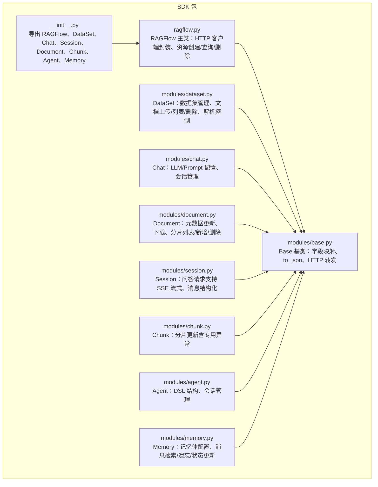
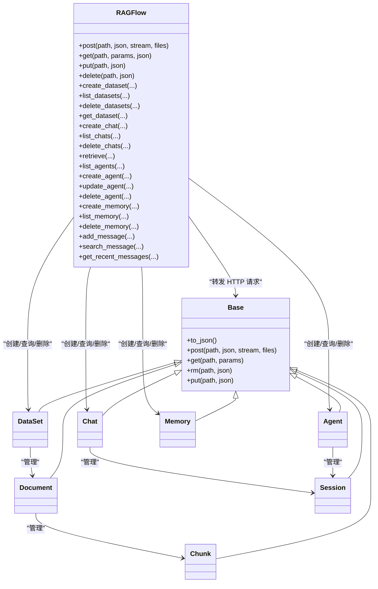
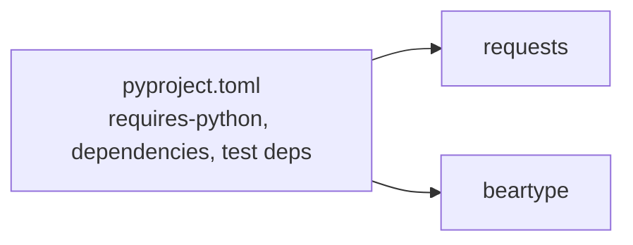
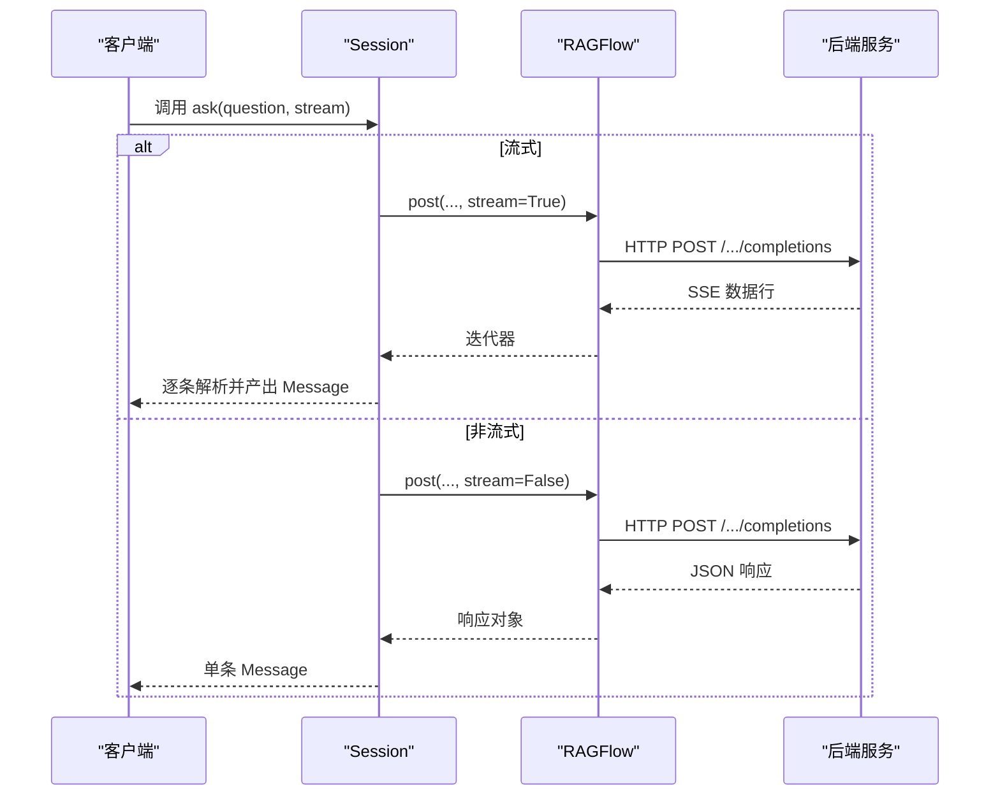
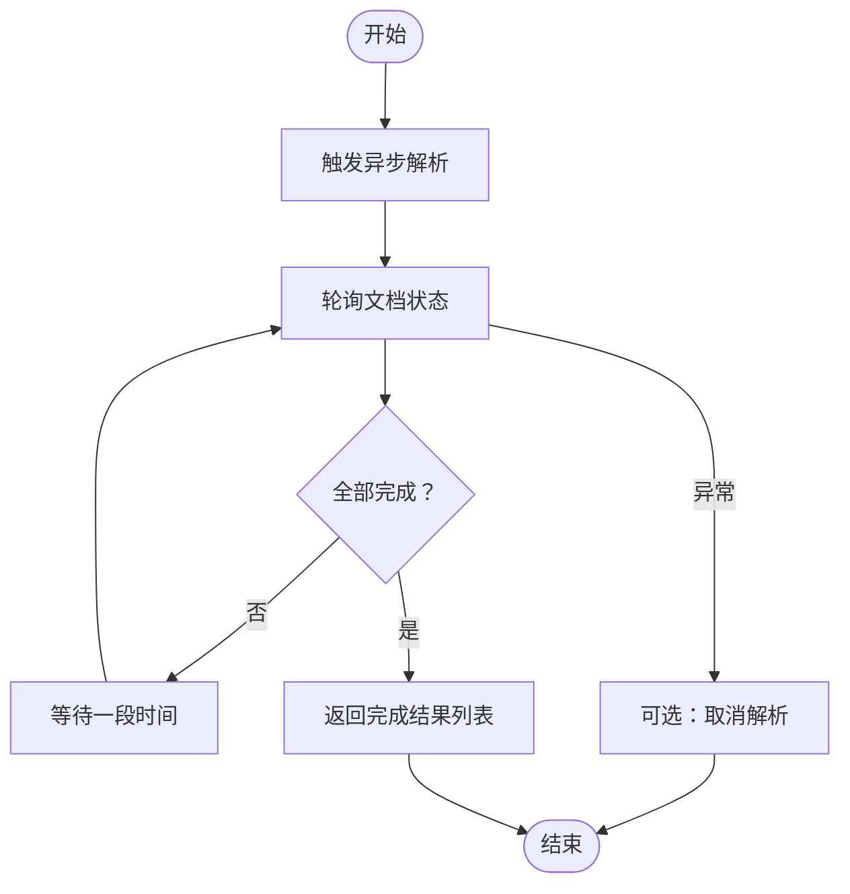

# SDK API

<cite>
**本文引用的文件**
- [sdk/python/ragflow_sdk/__init__.py](file://sdk/python/ragflow_sdk/__init__.py)
- [sdk/python/ragflow_sdk/ragflow.py](file://sdk/python/ragflow_sdk/ragflow.py)
- [sdk/python/ragflow_sdk/modules/base.py](file://sdk/python/ragflow_sdk/modules/base.py)
- [sdk/python/ragflow_sdk/modules/dataset.py](file://sdk/python/ragflow_sdk/modules/dataset.py)
- [sdk/python/ragflow_sdk/modules/chat.py](file://sdk/python/ragflow_sdk/modules/chat.py)
- [sdk/python/ragflow_sdk/modules/document.py](file://sdk/python/ragflow_sdk/modules/document.py)
- [sdk/python/ragflow_sdk/modules/session.py](file://sdk/python/ragflow_sdk/modules/session.py)
- [sdk/python/ragflow_sdk/modules/chunk.py](file://sdk/python/ragflow_sdk/modules/chunk.py)
- [sdk/python/ragflow_sdk/modules/agent.py](file://sdk/python/ragflow_sdk/modules/agent.py)
- [sdk/python/ragflow_sdk/modules/memory.py](file://sdk/python/ragflow_sdk/modules/memory.py)
- [sdk/python/pyproject.toml](file://sdk/python/pyproject.toml)
- [example/sdk/dataset_example.py](file://example/sdk/dataset_example.py)
- [README.md](file://README.md)
</cite>

## 目录
1. [简介](#简介)
2. [项目结构](#项目结构)
3. [核心组件](#核心组件)
4. [架构总览](#架构总览)
5. [详细组件分析](#详细组件分析)
6. [依赖分析](#依赖分析)
7. [性能考虑](#性能考虑)
8. [故障排查指南](#故障排查指南)
9. [结论](#结论)
10. [附录](#附录)

## 简介
本文件为 RAGFlow Python SDK 的权威参考文档，覆盖 SDK 类结构、方法定义、参数与返回值规范、使用示例、初始化配置、异常处理、异步与流式交互等。SDK 提供对数据集（DataSet）、聊天（Chat）、会话（Session）、文档（Document）、分片（Chunk）、智能体（Agent）、记忆（Memory）等资源的统一访问能力，并通过底层 HTTP 客户端与后端服务交互。

## 项目结构
- SDK 核心入口位于 ragflow_sdk 包，对外暴露 RAGFlow 主类与若干模块类。
- 每个模块类均继承自通用基类 Base，统一处理字段映射、序列化与 HTTP 请求转发。
- 示例脚本展示了数据集的基本 CRUD 流程。

图表来源
- [sdk/python/ragflow_sdk/__init__.py:1-43](file://sdk/python/ragflow_sdk/__init__.py#L1-L43)
- [sdk/python/ragflow_sdk/ragflow.py:27-379](file://sdk/python/ragflow_sdk/ragflow.py#L27-L379)
- [sdk/python/ragflow_sdk/modules/base.py:18-59](file://sdk/python/ragflow_sdk/modules/base.py#L18-L59)
- [sdk/python/ragflow_sdk/modules/dataset.py:21-174](file://sdk/python/ragflow_sdk/modules/dataset.py#L21-L174)
- [sdk/python/ragflow_sdk/modules/chat.py:22-96](file://sdk/python/ragflow_sdk/modules/chat.py#L22-L96)
- [sdk/python/ragflow_sdk/modules/document.py:23-105](file://sdk/python/ragflow_sdk/modules/document.py#L23-L105)
- [sdk/python/ragflow_sdk/modules/session.py:21-133](file://sdk/python/ragflow_sdk/modules/session.py#L21-L133)
- [sdk/python/ragflow_sdk/modules/chunk.py:26-63](file://sdk/python/ragflow_sdk/modules/chunk.py#L26-L63)
- [sdk/python/ragflow_sdk/modules/agent.py:21-98](file://sdk/python/ragflow_sdk/modules/agent.py#L21-L98)
- [sdk/python/ragflow_sdk/modules/memory.py:20-96](file://sdk/python/ragflow_sdk/modules/memory.py#L20-L96)

章节来源
- [sdk/python/ragflow_sdk/__init__.py:17-43](file://sdk/python/ragflow_sdk/__init__.py#L17-L43)
- [sdk/python/ragflow_sdk/ragflow.py:27-379](file://sdk/python/ragflow_sdk/ragflow.py#L27-L379)

## 核心组件
- RAGFlow：SDK 入口，负责构造 API 基础 URL、设置认证头、封装 HTTP 方法（GET/POST/PUT/DELETE），并提供高层资源操作（如创建/查询/删除数据集、聊天、智能体、记忆体等）。
- Base：所有资源模型的基类，负责从响应字典映射属性、递归包装嵌套对象、序列化为 JSON、转发 HTTP 请求到 RAGFlow。
- DataSet：数据集资源，支持更新、上传文档、列出文档、删除文档、异步/同步解析文档、取消解析、自动元数据配置读写。
- Chat：聊天资源，包含 LLM 参数与 Prompt 配置，支持更新、创建/列出/删除会话。
- Document：文档资源，支持元数据更新、下载、列出/新增/删除分片。
- Session：会话资源，支持问答请求（可选流式输出），内部区分 Chat/Agent 两种会话类型。
- Chunk：分片资源，支持更新（带专用异常）。
- Agent：智能体资源，包含 DSL 结构，支持创建/列出/删除会话。
- Memory：记忆体资源，支持配置读取、消息检索/遗忘、消息状态更新、内容获取。

章节来源
- [sdk/python/ragflow_sdk/ragflow.py:27-379](file://sdk/python/ragflow_sdk/ragflow.py#L27-L379)
- [sdk/python/ragflow_sdk/modules/base.py:18-59](file://sdk/python/ragflow_sdk/modules/base.py#L18-L59)
- [sdk/python/ragflow_sdk/modules/dataset.py:21-174](file://sdk/python/ragflow_sdk/modules/dataset.py#L21-L174)
- [sdk/python/ragflow_sdk/modules/chat.py:22-96](file://sdk/python/ragflow_sdk/modules/chat.py#L22-L96)
- [sdk/python/ragflow_sdk/modules/document.py:23-105](file://sdk/python/ragflow_sdk/modules/document.py#L23-L105)
- [sdk/python/ragflow_sdk/modules/session.py:21-133](file://sdk/python/ragflow_sdk/modules/session.py#L21-L133)
- [sdk/python/ragflow_sdk/modules/chunk.py:26-63](file://sdk/python/ragflow_sdk/modules/chunk.py#L26-L63)
- [sdk/python/ragflow_sdk/modules/agent.py:21-98](file://sdk/python/ragflow_sdk/modules/agent.py#L21-L98)
- [sdk/python/ragflow_sdk/modules/memory.py:20-96](file://sdk/python/ragflow_sdk/modules/memory.py#L20-L96)

## 架构总览
SDK 以“主客户端 + 资源模型”的分层设计组织，RAGFlow 统一处理网络层，各资源模型仅关注自身业务字段与调用路径。

图表来源
- [sdk/python/ragflow_sdk/ragflow.py:27-379](file://sdk/python/ragflow_sdk/ragflow.py#L27-L379)
- [sdk/python/ragflow_sdk/modules/base.py:18-59](file://sdk/python/ragflow_sdk/modules/base.py#L18-L59)
- [sdk/python/ragflow_sdk/modules/dataset.py:21-174](file://sdk/python/ragflow_sdk/modules/dataset.py#L21-L174)
- [sdk/python/ragflow_sdk/modules/chat.py:22-96](file://sdk/python/ragflow_sdk/modules/chat.py#L22-L96)
- [sdk/python/ragflow_sdk/modules/document.py:23-105](file://sdk/python/ragflow_sdk/modules/document.py#L23-L105)
- [sdk/python/ragflow_sdk/modules/session.py:21-133](file://sdk/python/ragflow_sdk/modules/session.py#L21-L133)
- [sdk/python/ragflow_sdk/modules/chunk.py:26-63](file://sdk/python/ragflow_sdk/modules/chunk.py#L26-L63)
- [sdk/python/ragflow_sdk/modules/agent.py:21-98](file://sdk/python/ragflow_sdk/modules/agent.py#L21-L98)
- [sdk/python/ragflow_sdk/modules/memory.py:20-96](file://sdk/python/ragflow_sdk/modules/memory.py#L20-L96)

## 详细组件分析

### RAGFlow 主类
- 初始化
  - 参数
    - api_key: 字符串，用于 Authorization 头（Bearer）
    - base_url: 字符串，后端服务基础地址
    - version: 字符串，默认 "v1"，拼接为 /api/{version}
  - 行为
    - 构造 api_url = base_url + /api/{version}
    - 设置 Authorization: Bearer {api_key} 头
- HTTP 方法
  - post(path, json=None, stream=False, files=None)
  - get(path, params=None, json=None)
  - put(path, json)
  - delete(path, json)
- 数据集
  - create_dataset(name, avatar=None, description=None, embedding_model=None, permission="me", chunk_method="naive", parser_config=None, auto_metadata_config=None) -> DataSet
  - list_datasets(page=1, page_size=30, orderby="create_time", desc=True, id=None, name=None) -> list[DataSet]
  - get_dataset(name: str) -> DataSet
  - delete_datasets(ids=None, delete_all=False)
- 聊天
  - create_chat(name, avatar="", dataset_ids=None, llm=None, prompt=None) -> Chat
  - list_chats(...) -> list[Chat]
  - delete_chats(ids=None, delete_all=False)
- 检索
  - retrieve(dataset_ids, document_ids=None, question="", page=1, page_size=30, similarity_threshold=0.2, vector_similarity_weight=0.3, top_k=1024, rerank_id=None, keyword=False, cross_languages=None, metadata_condition=None, use_kg=False, toc_enhance=False) -> list[Chunk]
- 智能体
  - list_agents(...) -> list[Agent]
  - create_agent(title, dsl, description=None)
  - update_agent(agent_id, title=None, description=None, dsl=None)
  - delete_agent(agent_id)
- 记忆体
  - create_memory(name, memory_type, embd_id, llm_id) -> Memory
  - list_memory(page=1, page_size=50, tenant_id=None, memory_type=None, storage_type=None, keywords=None) -> dict
  - delete_memory(memory_id)
  - add_message(memory_id, agent_id, session_id, user_input, agent_response, user_id="")
  - search_message(query, memory_id, agent_id=None, session_id=None, similarity_threshold=0.2, keywords_similarity_weight=0.7, top_n=10) -> list[dict]
  - get_recent_messages(memory_id, agent_id=None, session_id=None, limit=10) -> list[dict]

章节来源
- [sdk/python/ragflow_sdk/ragflow.py:27-379](file://sdk/python/ragflow_sdk/ragflow.py#L27-L379)

### DataSet 数据集
- 关键字段（部分）
  - id, name, avatar, tenant_id, description, embedding_model, permission, document_count, chunk_count, chunk_method, parser_config, pagerank
- 方法
  - update(update_message: dict) -> DataSet
  - upload_documents(document_list: list[dict]) -> list[Document]
  - list_documents(id=None, name=None, keywords=None, page=1, page_size=30, orderby="create_time", desc=True, create_time_from=0, create_time_to=0) -> list[Document]
  - delete_documents(ids=None, delete_all=False)
  - parse_documents(document_ids) -> list[tuple]
  - async_parse_documents(document_ids)
  - async_cancel_parse_documents(document_ids)
  - get_auto_metadata() -> dict
  - update_auto_metadata(**config) -> dict

章节来源
- [sdk/python/ragflow_sdk/modules/dataset.py:21-174](file://sdk/python/ragflow_sdk/modules/dataset.py#L21-L174)

### Chat 聊天
- 关键字段
  - id, name, avatar, llm(LLM), prompt(Prompt)
- 内部类
  - LLM：model_name, temperature, top_p, presence_penalty, frequency_penalty, max_tokens
  - Prompt：similarity_threshold, keywords_similarity_weight, top_n, top_k, variables, rerank_model, empty_response, opener, show_quote, prompt
- 方法
  - update(update_message: dict)
  - create_session(name="New session") -> Session
  - list_sessions(...) -> list[Session]
  - delete_sessions(ids=None, delete_all=False)

章节来源
- [sdk/python/ragflow_sdk/modules/chat.py:22-96](file://sdk/python/ragflow_sdk/modules/chat.py#L22-L96)

### Document 文档
- 关键字段（部分）
  - id, name, thumbnail, dataset_id, chunk_method, parser_config, source_type, type, created_by, size, token_count, chunk_count, progress, progress_msg, process_begin_at, process_duration, run, status, meta_fields
- 方法
  - update(update_message: dict) -> Document
  - download() -> bytes 或 JSON 错误响应
  - list_chunks(page=1, page_size=30, keywords="", id="") -> list[Chunk]
  - add_chunk(content: str, important_keywords: list[str]=[], questions: list[str]=[], image_base64: str|None=None) -> Chunk
  - delete_chunks(ids=None, delete_all=False)

章节来源
- [sdk/python/ragflow_sdk/modules/document.py:23-105](file://sdk/python/ragflow_sdk/modules/document.py#L23-L105)

### Session 会话
- 关键字段
  - id, name, messages, chat_id 或 agent_id（由资源决定类型）
- 方法
  - ask(question="", stream=False, ...)：支持流式（SSE）与非流式；根据会话类型路由至 /chats/{chat_id}/completions 或 /agents/{agent_id}/completions
  - update(update_message)

章节来源
- [sdk/python/ragflow_sdk/modules/session.py:21-133](file://sdk/python/ragflow_sdk/modules/session.py#L21-L133)

### Chunk 分片
- 关键字段（部分）
  - id, content, important_keywords, questions, create_time, create_timestamp, dataset_id, document_name/document_keyword, available, similarity, vector_similarity, term_similarity, positions, doc_type
- 异常
  - ChunkUpdateError：当更新失败时抛出，包含 code/message/details
- 方法
  - update(update_message: dict)

章节来源
- [sdk/python/ragflow_sdk/modules/chunk.py:19-63](file://sdk/python/ragflow_sdk/modules/chunk.py#L19-L63)

### Agent 智能体
- 关键字段
  - id, avatar, canvas_type, description, dsl
- 内部类
  - Dsl：包含 answer、components、graph、history、messages、path、reference 等
- 方法
  - create_session(**kwargs) -> Session
  - list_sessions(...) -> list[Session]
  - delete_sessions(ids=None, delete_all=False)

章节来源
- [sdk/python/ragflow_sdk/modules/agent.py:21-98](file://sdk/python/ragflow_sdk/modules/agent.py#L21-L98)

### Memory 记忆体
- 关键字段
  - id, name, avatar, tenant_id, owner_name, memory_type, storage_type, embd_id, llm_id, permissions, description, memory_size, forgetting_policy, temperature, system_prompt, user_prompt
- 方法
  - update(update_dict: dict) -> Memory
  - get_config() -> Memory
  - list_memory_messages(agent_id=None, keywords=None, page=1, page_size=50) -> dict
  - forget_message(message_id: int) -> bool
  - update_message_status(message_id: int, status: bool) -> bool
  - get_message_content(message_id: int) -> dict

章节来源
- [sdk/python/ragflow_sdk/modules/memory.py:20-96](file://sdk/python/ragflow_sdk/modules/memory.py#L20-L96)

### Base 基类
- 功能
  - 将响应字典递归映射为对象属性（嵌套 dict 自动包装为 Base 子类）
  - to_json 序列化（排除私有与可调用字段，递归序列化子对象）
  - 统一转发 HTTP 请求：post/get/put/delete
- 用途
  - 所有资源模型共享的通用能力

章节来源
- [sdk/python/ragflow_sdk/modules/base.py:18-59](file://sdk/python/ragflow_sdk/modules/base.py#L18-L59)

## 依赖分析
- 版本与运行时
  - Python 版本：>=3.12,<3.15
  - 依赖：requests>=2.30.0,<3.0.0；beartype>=0.20.0,<1.0.0
  - 可选测试依赖：pytest、openpyxl、pillow、python-docx、python-pptx、reportlab、requests-toolbelt 等
- 依赖关系图

图表来源
- [sdk/python/pyproject.toml:8-23](file://sdk/python/pyproject.toml#L8-L23)

章节来源
- [sdk/python/pyproject.toml:1-32](file://sdk/python/pyproject.toml#L1-L32)

## 性能考虑
- 流式问答
  - Session.ask 支持 stream=True，按行解析 SSE 数据，适合长回答或实时反馈场景。
- 批量与分页
  - 列表接口普遍支持 page/page_size/orderby/desc 等参数，建议在大数据量下合理设置分页参数以降低单次负载。
- 解析流程
  - DataSet.parse_documents 会先触发异步解析，再轮询状态直至完成；若中断可调用 async_cancel_parse_documents 取消。
- 检索参数
  - retrieve 支持相似度阈值、向量权重、关键词开关、跨语言查询、元数据过滤、知识图谱增强等，建议结合业务选择合适组合以平衡召回与质量。

[本节为通用建议，不直接分析具体文件]

## 故障排查指南
- 常见异常
  - 所有资源操作在后端返回 code!=0 时抛出 Exception，包含 message 字段。
  - Chunk.update 失败时抛出 ChunkUpdateError，包含 code/message/details，便于定位具体错误。
- 网络与认证
  - 确认 base_url 正确且可访问；确认 api_key 有效；检查后端服务是否已完全启动。
- 数据集解析
  - 若 parse_documents 长时间未完成，可调用 async_cancel_parse_documents 取消任务。
- 会话流式
  - 流式模式下需正确处理 SSE 行，忽略空行与非 JSON 内容；遇到 [DONE] 标记结束。

章节来源
- [sdk/python/ragflow_sdk/modules/chunk.py:19-25](file://sdk/python/ragflow_sdk/modules/chunk.py#L19-L25)
- [sdk/python/ragflow_sdk/modules/dataset.py:139-154](file://sdk/python/ragflow_sdk/modules/dataset.py#L139-L154)
- [sdk/python/ragflow_sdk/modules/session.py:48-84](file://sdk/python/ragflow_sdk/modules/session.py#L48-L84)

## 结论
RAGFlow Python SDK 以清晰的分层设计提供了对数据集、聊天、智能体、记忆体等资源的统一访问。通过 Base 基类与 RAGFlow 主类的配合，开发者可以快速完成从数据准备到问答推理的全流程集成。建议在生产环境中结合分页、流式与合理的检索参数进行性能优化，并妥善处理异常与中断场景。

[本节为总结性内容，不直接分析具体文件]

## 附录

### 安装与环境
- Python 版本要求：>=3.12,<3.15
- 依赖安装：requests、beartype
- 可选测试依赖：pytest 及相关库
- 仓库根 README 提供了服务部署与环境准备信息，可用于验证后端可用性与 API Key 配置

章节来源
- [sdk/python/pyproject.toml:8-23](file://sdk/python/pyproject.toml#L8-L23)
- [README.md:148-254](file://README.md#L148-L254)

### 使用示例
- 数据集 CRUD 示例
  - 创建、更新、查询、删除数据集的完整流程可参考示例脚本

章节来源
- [example/sdk/dataset_example.py:21-54](file://example/sdk/dataset_example.py#L21-L54)

### API 调用时序（会话问答）

图表来源
- [sdk/python/ragflow_sdk/modules/session.py:36-115](file://sdk/python/ragflow_sdk/modules/session.py#L36-L115)
- [sdk/python/ragflow_sdk/ragflow.py:36-50](file://sdk/python/ragflow_sdk/ragflow.py#L36-L50)

### 数据集解析流程（同步）

图表来源
- [sdk/python/ragflow_sdk/modules/dataset.py:132-146](file://sdk/python/ragflow_sdk/modules/dataset.py#L132-L146)
- [sdk/python/ragflow_sdk/modules/dataset.py:149-153](file://sdk/python/ragflow_sdk/modules/dataset.py#L149-L153)

### 最佳实践
- 在高并发场景中，合理设置分页参数与检索阈值，避免一次性拉取过多数据。
- 对长回答采用流式输出，提升用户体验并减少前端阻塞。
- 对于大规模文档入库，优先使用异步解析并结合取消机制应对中断。
- 使用 beartype 进行运行时类型校验，减少参数错误导致的异常。

[本节为通用建议，不直接分析具体文件]