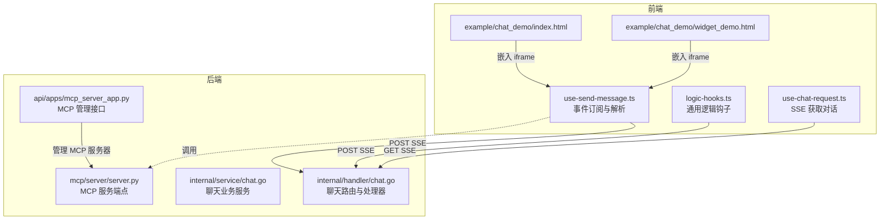
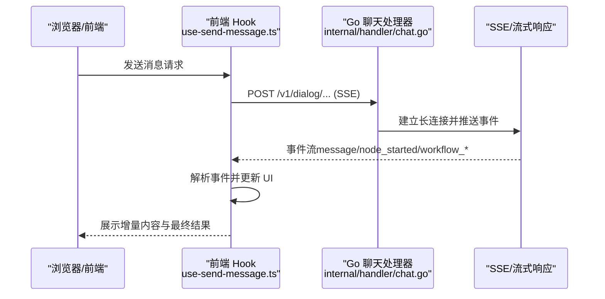
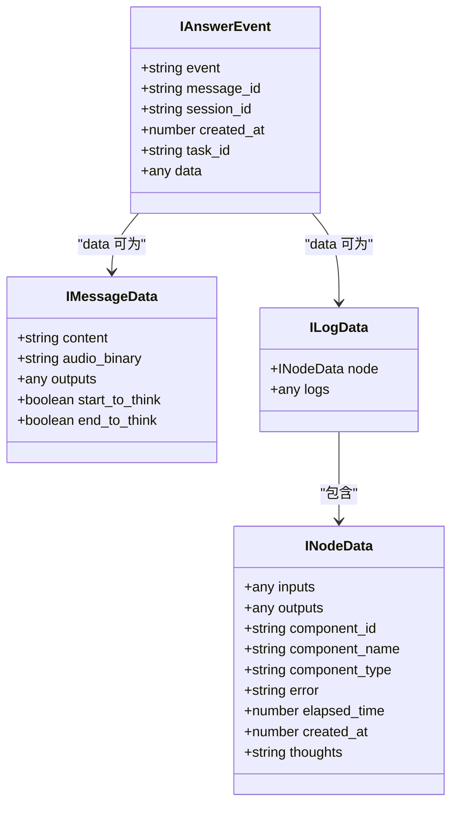
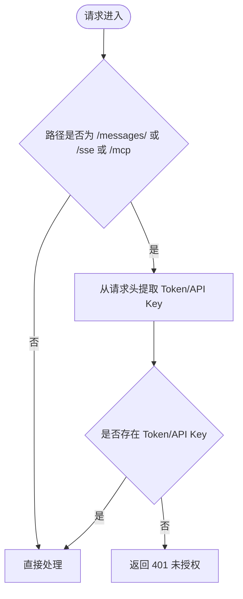
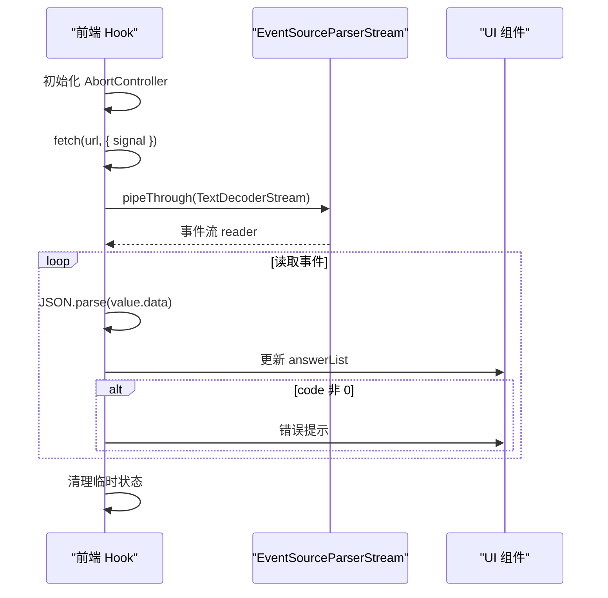
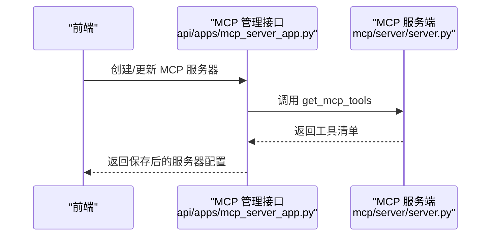
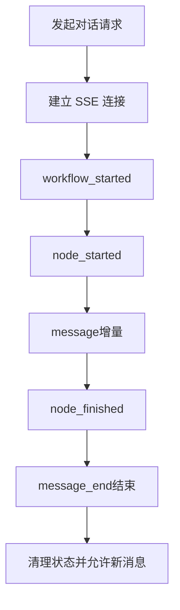
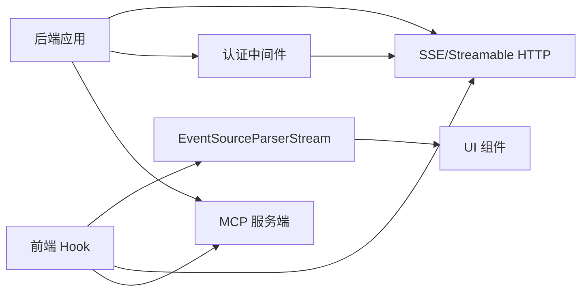

# WebSocket API

<cite>
**本文引用的文件**
- [mcp/server/server.py](file://mcp/server/server.py)
- [api/apps/mcp_server_app.py](file://api/apps/mcp_server_app.py)
- [web/src/hooks/use-send-message.ts](file://web/src/hooks/use-send-message.ts)
- [web/src/hooks/logic-hooks.ts](file://web/src/hooks/logic-hooks.ts)
- [web/src/hooks/use-chat-request.ts](file://web/src/hooks/use-chat-request.ts)
- [web/src/interfaces/database/mcp-server.ts](file://web/src/interfaces/database/mcp-server.ts)
- [internal/handler/chat.go](file://internal/handler/chat.go)
- [internal/service/chat.go](file://internal/service/chat.go)
- [example/chat_demo/index.html](file://example/chat_demo/index.html)
- [example/chat_demo/widget_demo.html](file://example/chat_demo/widget_demo.html)
- [docs/references/http_api_reference.md](file://docs/references/http_api_reference.md)
</cite>

## 目录
1. [简介](#简介)
2. [项目结构](#项目结构)
3. [核心组件](#核心组件)
4. [架构总览](#架构总览)
5. [详细组件分析](#详细组件分析)
6. [依赖分析](#依赖分析)
7. [性能考虑](#性能考虑)
8. [故障排查指南](#故障排查指南)
9. [结论](#结论)
10. [附录](#附录)

## 简介
本文件为 RAGFlow 的 WebSocket（以及更准确地说是基于 HTTP 的流式传输）API 参考文档，聚焦于以下方面：
- 实时通信协议：SSE（Server-Sent Events）与 Streamable HTTP 两种传输模式
- 连接建立过程：认证头传递、路由挂载与初始化流程
- 消息格式规范：事件类型、字段结构、结束标记
- 事件类型定义：工作流开始、节点执行、消息增量、消息结束、用户输入、节点日志等
- 代理执行与对话状态更新：通过事件流推送中间态与最终态
- MCP 服务器通信：RAGFlow 内置 MCP 服务端点与客户端集成
- 认证机制：Bearer Token 与 API Key 的提取与校验
- 心跳与断线重连：基于 SSE 的自动重连与中断恢复
- 序列化格式：JSON 文本事件与事件解析器
- 客户端示例与错误处理：前端如何订阅事件、中止请求、展示错误
- 高级主题：并发连接管理、消息队列处理、性能优化建议

## 项目结构
RAGFlow 的 WebSocket/流式通信能力由多层协作实现：
- 后端服务层（Go/Python）：提供 HTTP 路由与 SSE/流式响应
- 前端 Hook 层：封装 fetch + EventSource 解析器，统一消费事件流
- MCP 服务层（Python）：提供工具检索与调用的流式接口
- 示例页面：演示嵌入式聊天小部件与事件交互

**图表来源**
- [mcp/server/server.py](file://mcp/server/server.py)
- [api/apps/mcp_server_app.py](file://api/apps/mcp_server_app.py)
- [web/src/hooks/use-send-message.ts](file://web/src/hooks/use-send-message.ts)
- [web/src/hooks/logic-hooks.ts](file://web/src/hooks/logic-hooks.ts)
- [web/src/hooks/use-chat-request.ts](file://web/src/hooks/use-chat-request.ts)
- [internal/handler/chat.go](file://internal/handler/chat.go)
- [internal/service/chat.go](file://internal/service/chat.go)
- [example/chat_demo/index.html](file://example/chat_demo/index.html)
- [example/chat_demo/widget_demo.html](file://example/chat_demo/widget_demo.html)

**章节来源**
- [mcp/server/server.py](file://mcp/server/server.py)
- [api/apps/mcp_server_app.py](file://api/apps/mcp_server_app.py)
- [web/src/hooks/use-send-message.ts](file://web/src/hooks/use-send-message.ts)
- [web/src/hooks/logic-hooks.ts](file://web/src/hooks/logic-hooks.ts)
- [web/src/hooks/use-chat-request.ts](file://web/src/hooks/use-chat-request.ts)
- [internal/handler/chat.go](file://internal/handler/chat.go)
- [internal/service/chat.go](file://internal/service/chat.go)
- [example/chat_demo/index.html](file://example/chat_demo/index.html)
- [example/chat_demo/widget_demo.html](file://example/chat_demo/widget_demo.html)

## 核心组件
- SSE/流式传输端点
  - /sse：SSE 入口，用于长连接事件推送
  - /messages/*：SSE 消息写入端点
  - /mcp：Streamable HTTP 端点，支持 JSON 或 SSE 风格事件
- 认证与中间件
  - 仅对 /messages/、/sse、/mcp 路径启用鉴权，从请求头提取 Bearer Token 或 API Key
- 事件模型与前端解析
  - 前端使用 fetch + TextDecoderStream + EventSourceParserStream 统一解析事件
  - 支持中止请求（AbortController），在用户取消或逻辑中断时优雅退出
- MCP 服务器
  - 提供 list_tools 与 call_tool 工具调用，支持自托管与多租户模式
  - 前端通过管理接口注册 MCP 服务器并缓存工具清单

**章节来源**
- [mcp/server/server.py](file://mcp/server/server.py)
- [web/src/hooks/use-send-message.ts](file://web/src/hooks/use-send-message.ts)
- [web/src/hooks/logic-hooks.ts](file://web/src/hooks/logic-hooks.ts)
- [api/apps/mcp_server_app.py](file://api/apps/mcp_server_app.py)

## 架构总览
RAGFlow 的实时通信采用“HTTP 流式传输 + 事件模型”的设计，既兼容传统浏览器的 SSE，也支持高性能的 Streamable HTTP。

**图表来源**
- [internal/handler/chat.go](file://internal/handler/chat.go)
- [web/src/hooks/use-send-message.ts](file://web/src/hooks/use-send-message.ts)

**章节来源**
- [internal/handler/chat.go](file://internal/handler/chat.go)
- [web/src/hooks/use-send-message.ts](file://web/src/hooks/use-send-message.ts)

## 详细组件分析

### 事件类型与消息格式规范
- 事件类型枚举（前端侧）
  - workflow_started：工作流启动
  - node_started：节点开始执行
  - node_finished：节点完成
  - message：消息增量（content/audio_binary 等）
  - message_end：消息结束（携带引用信息）
  - user_inputs：等待用户输入
  - node_logs：节点日志
- 事件数据结构
  - event：事件类型字符串
  - message_id：消息唯一标识
  - session_id：会话标识
  - created_at：事件时间戳
  - task_id：任务标识
  - data：事件负载对象（如 content、inputs、outputs、logs 等）
- 结束标记
  - 当事件为 message_end 且 data 中包含引用信息时，表示该轮对话结束
  - 前端在收到结束事件后清理临时状态并允许新消息发送

**图表来源**
- [web/src/hooks/use-send-message.ts](file://web/src/hooks/use-send-message.ts)

**章节来源**
- [web/src/hooks/use-send-message.ts](file://web/src/hooks/use-send-message.ts)

### 连接建立与认证机制
- 路由与中间件
  - 仅对 /messages/、/sse、/mcp 路径启用鉴权中间件
  - 中间件从请求头提取 Authorization（Bearer Token）或 API Key，并注入到请求上下文
- 传输模式
  - SSE：/sse GET 建立长连接；/messages/* POST 写入消息
  - Streamable HTTP：/mcp GET/POST/DELETE，支持 JSON 响应或 SSE 风格事件
- 认证要求
  - 自托管模式（self-host）：必须提供 API Key
  - 多租户模式（host）：客户端需提供 Authorization 头

**图表来源**
- [mcp/server/server.py](file://mcp/server/server.py)

**章节来源**
- [mcp/server/server.py](file://mcp/server/server.py)

### 前端事件订阅与错误处理
- 订阅流程
  - 使用 fetch 发起 POST 请求，设置 Authorization 与 Content-Type
  - 通过 TextDecoderStream + EventSourceParserStream 将响应体转换为事件流
  - 循环读取事件，解析 data 字段并更新 UI
- 中止与重试
  - 使用 AbortController 在用户取消或逻辑中断时中止请求
  - 前端可基于 SSE 的 done 标记与错误码进行重试策略
- 错误处理
  - 当事件 data 中包含 code 非 0 时，弹出错误提示
  - 捕获 DOMException 并区分 AbortError

**图表来源**
- [web/src/hooks/use-send-message.ts](file://web/src/hooks/use-send-message.ts)
- [web/src/hooks/logic-hooks.ts](file://web/src/hooks/logic-hooks.ts)

**章节来源**
- [web/src/hooks/use-send-message.ts](file://web/src/hooks/use-send-message.ts)
- [web/src/hooks/logic-hooks.ts](file://web/src/hooks/logic-hooks.ts)

### MCP 服务器通信
- 服务端点
  - /sse：SSE 入口，用于 MCP 与后端的双向流式通信
  - /messages/*：消息写入端点
  - /mcp：Streamable HTTP 端点，支持 JSON 或 SSE 风格事件
- 认证与工具
  - 自托管模式：通过 --api-key 注入主机 API Key
  - 多租户模式：从请求头提取 Authorization
  - 工具清单：list_tools 返回可用工具；call_tool 执行具体工具
- 前端集成
  - 通过管理接口注册 MCP 服务器（名称、URL、类型、头部、变量）
  - 缓存工具清单，便于后续测试与调用

**图表来源**
- [api/apps/mcp_server_app.py](file://api/apps/mcp_server_app.py)
- [mcp/server/server.py](file://mcp/server/server.py)

**章节来源**
- [api/apps/mcp_server_app.py](file://api/apps/mcp_server_app.py)
- [mcp/server/server.py](file://mcp/server/server.py)
- [web/src/interfaces/database/mcp-server.ts](file://web/src/interfaces/database/mcp-server.ts)

### 对话状态更新与代理执行
- 后端处理器
  - 列表、查询、删除等聊天相关操作由 Go 处理器与服务层实现
  - SSE 路由负责将代理执行过程中的事件推送到前端
- 事件推送
  - 包括工作流生命周期事件（开始/结束）、节点执行事件（开始/完成）、消息增量与结束事件
  - 前端根据事件类型更新 UI，展示思考过程、中间输出与最终答案

**图表来源**
- [internal/handler/chat.go](file://internal/handler/chat.go)
- [web/src/hooks/use-send-message.ts](file://web/src/hooks/use-send-message.ts)

**章节来源**
- [internal/handler/chat.go](file://internal/handler/chat.go)
- [internal/service/chat.go](file://internal/service/chat.go)
- [web/src/hooks/use-send-message.ts](file://web/src/hooks/use-send-message.ts)

### 客户端连接示例与消息收发
- 嵌入式聊天小部件
  - 通过 iframe 嵌入到页面，监听消息事件以控制窗口显示与滚动
  - 支持创建聊天窗口、切换显示状态、透传滚动事件
- 前端 Hook
  - use-send-message.ts：封装 SSE 订阅、事件解析、中止控制
  - use-chat-request.ts：封装获取对话的 SSE 查询
  - logic-hooks.ts：通用逻辑钩子，复用事件解析与错误处理

**章节来源**
- [example/chat_demo/index.html](file://example/chat_demo/index.html)
- [example/chat_demo/widget_demo.html](file://example/chat_demo/widget_demo.html)
- [web/src/hooks/use-send-message.ts](file://web/src/hooks/use-send-message.ts)
- [web/src/hooks/use-chat-request.ts](file://web/src/hooks/use-chat-request.ts)
- [web/src/hooks/logic-hooks.ts](file://web/src/hooks/logic-hooks.ts)

## 依赖分析
- 前端依赖
  - eventsource-parser/stream：将文本事件解析为结构化事件
  - AbortController：中止请求，支持用户取消与逻辑中断
- 后端依赖
  - Starlette：ASGI 应用与路由挂载
  - mcp.types：MCP 协议类型定义
  - httpx：异步 HTTP 客户端，用于 MCP 与后端 API 通信
- 关键耦合点
  - SSE 与 Streamable HTTP 两条传输路径并行存在，前端统一通过 EventSourceParserStream 解析
  - 认证中间件仅作用于特定路径，避免对静态资源与非受控路由产生影响

**图表来源**
- [web/src/hooks/use-send-message.ts](file://web/src/hooks/use-send-message.ts)
- [mcp/server/server.py](file://mcp/server/server.py)

**章节来源**
- [mcp/server/server.py](file://mcp/server/server.py)
- [web/src/hooks/use-send-message.ts](file://web/src/hooks/use-send-message.ts)

## 性能考虑
- 传输选择
  - Streamable HTTP：在高并发场景下具备更低的连接开销与更高的吞吐
  - SSE：兼容性好，适合浏览器原生支持场景
- 事件粒度
  - 将消息拆分为多个增量事件，前端可逐步渲染，提升感知速度
- 缓存与复用
  - 前端可缓存工具清单与会话状态，减少重复请求
  - 后端可缓存数据集元信息，降低检索成本
- 资源释放
  - 使用 AbortController 及时中止无效请求，避免内存泄漏
  - SSE 连接异常时及时关闭，防止资源占用

[本节为通用指导，无需列出具体文件来源]

## 故障排查指南
- 401 未授权
  - 检查 Authorization 头或 API Key 是否正确传递
  - 自托管模式需提供 --api-key，多租户模式需提供 Authorization
- 事件解析失败
  - 确认后端返回的事件 data 为合法 JSON
  - 检查 EventSourceParserStream 的使用是否正确
- 请求被中止
  - 用户取消或逻辑中断会触发 AbortError，前端已做捕获与清理
- 对话不更新
  - 确认 SSE 连接已建立且未被中断
  - 检查后端处理器是否正常推送事件

**章节来源**
- [mcp/server/server.py](file://mcp/server/server.py)
- [web/src/hooks/use-send-message.ts](file://web/src/hooks/use-send-message.ts)

## 结论
RAGFlow 的 WebSocket/流式通信以 SSE 与 Streamable HTTP 为核心，结合前端统一的事件解析与中止控制，实现了高效、可扩展的实时对话体验。通过明确的事件类型与数据结构、严格的认证机制与错误处理，系统在复杂代理执行与 MCP 工具调用场景下仍能保持稳定与可观的性能。建议在生产环境中优先采用 Streamable HTTP，并配合前端 AbortController 与合理的重试策略，以获得最佳的用户体验与资源利用率。

[本节为总结性内容，无需列出具体文件来源]

## 附录

### 事件类型与字段速查
- 事件类型
  - workflow_started：工作流开始
  - node_started：节点开始
  - node_finished：节点完成
  - message：消息增量（含 content、audio_binary、outputs 等）
  - message_end：消息结束（含引用信息）
  - user_inputs：等待用户输入
  - node_logs：节点日志（含组件信息与执行结果）
- 关键字段
  - event、message_id、session_id、created_at、task_id、data

**章节来源**
- [web/src/hooks/use-send-message.ts](file://web/src/hooks/use-send-message.ts)

### 前端使用要点
- 订阅 SSE
  - 设置 Authorization 与 Content-Type
  - 使用 EventSourceParserStream 解析事件
  - 使用 AbortController 控制中断
- 错误处理
  - 检测 data.code 非 0 时提示错误
  - 捕获 AbortError 并清理状态

**章节来源**
- [web/src/hooks/use-send-message.ts](file://web/src/hooks/use-send-message.ts)
- [web/src/hooks/logic-hooks.ts](file://web/src/hooks/logic-hooks.ts)

### 后端配置要点
- 传输模式
  - 启用 SSE 或 Streamable HTTP，或两者并行
  - 通过环境变量控制开关与 JSON 响应模式
- 认证
  - 自托管模式：--api-key
  - 多租户模式：Authorization 头

**章节来源**
- [mcp/server/server.py](file://mcp/server/server.py)