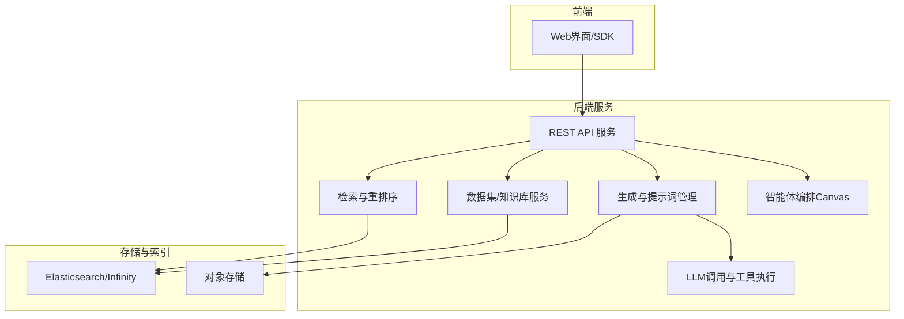
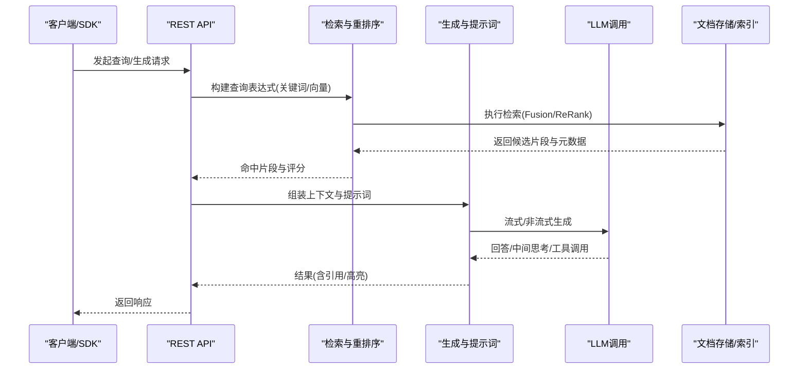
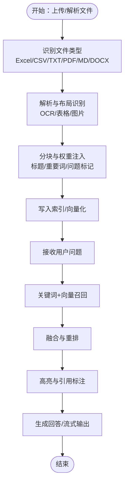
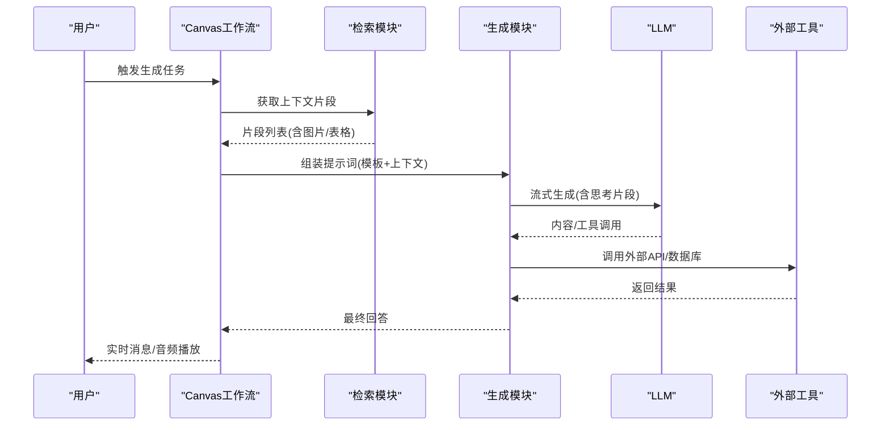
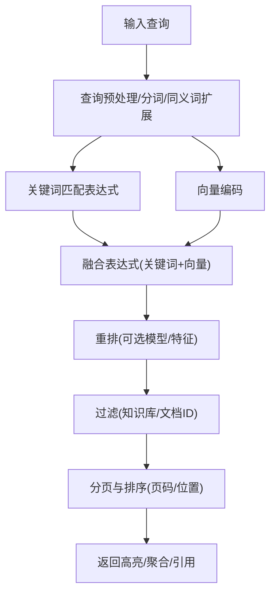
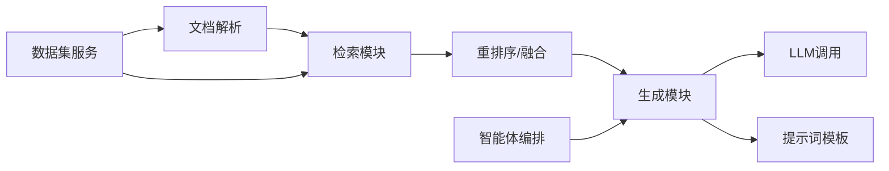

# RAG应用模式

<cite>
**本文引用的文件**
- [README.md](file://README.md)
- [rag/app/qa.py](file://rag/app/qa.py)
- [rag/app/naive.py](file://rag/app/naive.py)
- [rag/llm/chat_model.py](file://rag/llm/chat_model.py)
- [rag/nlp/query.py](file://rag/nlp/query.py)
- [rag/nlp/search.py](file://rag/nlp/search.py)
- [rag/prompts/template.py](file://rag/prompts/template.py)
- [agent/canvas.py](file://agent/canvas.py)
- [api/apps/services/dataset_api_service.py](file://api/apps/services/dataset_api_service.py)
</cite>

## 目录
1. [引言](#引言)
2. [项目结构](#项目结构)
3. [核心组件](#核心组件)
4. [架构总览](#架构总览)
5. [详细组件分析](#详细组件分析)
6. [依赖关系分析](#依赖关系分析)
7. [性能考虑](#性能考虑)
8. [故障排查指南](#故障排查指南)
9. [结论](#结论)
10. [附录](#附录)

## 引言
本技术文档面向RAG应用开发者与工程团队，系统化阐述RAG在企业级知识库中的典型应用模式与工程化实现，包括问答系统、文档摘要、内容生成、智能搜索等。文档从数据流设计、组件组合、性能优化、错误处理与可扩展性等维度，给出可落地的架构建议与最佳实践，并提供可直接参考的配置与集成路径。

## 项目结构
RAGFlow是一个融合检索增强生成与智能体编排的开源引擎，具备统一的上下文层与模板化的Agent工作流能力。其后端以Python为主，结合多种文档解析器、向量检索与重排序、多模态支持、以及可插拔的LLM适配层，形成“解析-嵌入-检索-生成”的完整链路。

图示来源
- [README.md:140-144](file://README.md#L140-L144)
- [rag/nlp/search.py:36-171](file://rag/nlp/search.py#L36-L171)
- [rag/llm/chat_model.py:115-595](file://rag/llm/chat_model.py#L115-L595)
- [agent/canvas.py:283-668](file://agent/canvas.py#L283-L668)

章节来源
- [README.md:140-144](file://README.md#L140-L144)
- [README.md:146-254](file://README.md#L146-L254)

## 核心组件
- 文档解析与分块
  - 支持Excel、CSV、TXT、PDF、Markdown、DOCX等多种格式，内置布局识别、表格/图片提取、标题层级识别等能力，输出带权重的文本块与位置信息，便于高亮与溯源。
- 检索与重排序
  - 提供全文匹配、向量相似度、融合打分与二次重排，支持按知识库/文档过滤、高亮返回、聚合统计等。
- 生成与提示词
  - 统一的提示词模板加载机制，支持结构化输出、引用标注、跨语言与多粒度分词。
- LLM调用与工具执行
  - 多厂商/本地LLM适配，统一错误分类与重试策略，支持函数调用/工具执行与流式输出。
- 智能体编排
  - 基于DSL的工作流编排，组件间变量传递、分支/循环/迭代控制、异常处理与事件流输出。

章节来源
- [rag/app/naive.py:729-800](file://rag/app/naive.py#L729-L800)
- [rag/nlp/search.py:74-171](file://rag/nlp/search.py#L74-L171)
- [rag/prompts/template.py:8-20](file://rag/prompts/template.py#L8-L20)
- [rag/llm/chat_model.py:115-595](file://rag/llm/chat_model.py#L115-L595)
- [agent/canvas.py:42-150](file://agent/canvas.py#L42-L150)

## 架构总览
RAGFlow采用“解析-嵌入-检索-生成-编排”的分层架构。前端通过REST API或SDK发起请求，后端根据请求类型路由到对应服务：数据集管理、检索、生成或智能体执行。检索模块同时支持关键词与向量两种召回方式，并通过融合与重排提升命中质量。生成模块基于提示词模板与检索结果进行上下文拼接，最终由LLM完成回答或内容生成。

图示来源
- [rag/nlp/search.py:74-171](file://rag/nlp/search.py#L74-L171)
- [rag/llm/chat_model.py:192-547](file://rag/llm/chat_model.py#L192-L547)
- [rag/prompts/template.py:8-20](file://rag/prompts/template.py#L8-L20)

## 详细组件分析

### 应用模式一：问答系统（QA）
- 设计要点
  - 输入：支持Excel/CSV/TXT/PDF/Markdown/DOCX等格式，自动识别问题-答案对或段落结构。
  - 数据流：解析→布局/表格识别→文本合并→分块→权重注入→入库。
  - 查询：关键词匹配+向量融合+重排→高亮返回→引用标注。
- 差异化实现
  - 简单问答：纯关键词匹配，适合事实类、结构化问答。
  - 复杂推理：引入向量相似度与重排模型，提升语义相关性。
  - 多模态：PDF/DOCX中的表格、图片参与检索与高亮。
- 配置与集成
  - 使用数据集服务创建/更新知识库，设置解析器与分块参数。
  - 在查询时启用向量召回与融合权重，开启高亮与引用。
- 性能优化
  - 合理设置topk与相似度阈值，避免过多候选导致重排开销。
  - 对长文档分页检索，分页拉取与增量重排。

图示来源
- [rag/app/qa.py:307-460](file://rag/app/qa.py#L307-L460)
- [rag/app/naive.py:729-800](file://rag/app/naive.py#L729-L800)
- [rag/nlp/search.py:74-171](file://rag/nlp/search.py#L74-L171)

章节来源
- [rag/app/qa.py:307-460](file://rag/app/qa.py#L307-L460)
- [rag/app/naive.py:729-800](file://rag/app/naive.py#L729-L800)
- [api/apps/services/dataset_api_service.py:33-91](file://api/apps/services/dataset_api_service.py#L33-L91)

### 应用模式二：文档摘要
- 设计要点
  - 输入：整篇文档（PDF/DOCX/HTML/Markdown等）。
  - 数据流：解析→布局/表格识别→分段→向量化→检索→摘要生成。
- 工程策略
  - 使用“段落级”分块策略，保留上下文连续性。
  - 可选：对表格/图片进行结构化抽取，提升摘要质量。
- 集成建议
  - 通过数据集服务配置解析器与分块参数，启用摘要提示词模板。
  - 在生成阶段传入“请生成摘要”的系统提示与用户问题。

章节来源
- [rag/app/naive.py:729-800](file://rag/app/naive.py#L729-L800)
- [rag/prompts/template.py:8-20](file://rag/prompts/template.py#L8-L20)

### 应用模式三：内容生成（含多模态）
- 设计要点
  - 输入：用户指令+检索上下文+多模态素材（图片/表格）。
  - 数据流：检索→上下文拼接→提示词模板→LLM生成→工具调用（可选）。
- 工程策略
  - 多模态：将图片转为base64或矢量表示，随文本一同进入生成。
  - 结构化输出：使用提示词模板约束输出格式，便于后续处理。
- 集成建议
  - 通过智能体编排Canvas定义“检索→生成→工具调用→消息输出”的流程。
  - 使用流式输出提升交互体验，支持“思考/推理”片段的可视化。

图示来源
- [agent/canvas.py:375-668](file://agent/canvas.py#L375-L668)
- [rag/llm/chat_model.py:192-547](file://rag/llm/chat_model.py#L192-L547)

章节来源
- [agent/canvas.py:283-668](file://agent/canvas.py#L283-L668)
- [rag/llm/chat_model.py:115-595](file://rag/llm/chat_model.py#L115-L595)

### 应用模式四：智能搜索（检索增强）
- 设计要点
  - 输入：自然语言查询。
  - 数据流：查询解析→关键词+向量召回→融合与重排→高亮与聚合→返回。
- 工程策略
  - 关键词权重：标题、重要词、问题词等字段加权，提升召回质量。
  - 向量融合：Term Similarity与Vector Similarity按权重融合，再进行二次重排。
  - 过滤与排序：支持按知识库/文档ID过滤，按页码与位置排序。
- 集成建议
  - 在查询接口中设置topk、相似度阈值与向量权重，开启高亮与聚合统计。

图示来源
- [rag/nlp/query.py:41-172](file://rag/nlp/query.py#L41-L172)
- [rag/nlp/search.py:74-171](file://rag/nlp/search.py#L74-L171)

章节来源
- [rag/nlp/query.py:41-172](file://rag/nlp/query.py#L41-L172)
- [rag/nlp/search.py:74-171](file://rag/nlp/search.py#L74-L171)

### 应用模式五：复杂推理与多步任务（GraphRAG/RAPTOR）
- 设计要点
  - 输入：大规模文档集合。
  - 数据流：文档入库存储→构建层次化/图谱化表示→多轮检索与推理→生成高层结论。
- 工程策略
  - 通过数据集服务触发GraphRAG/RAPTOR任务队列，后台异步执行。
  - 支持追踪任务进度与状态，便于监控与回滚。
- 集成建议
  - 在数据集管理中配置任务ID与进度跟踪，前端轮询任务状态。

章节来源
- [api/apps/services/dataset_api_service.py:391-440](file://api/apps/services/dataset_api_service.py#L391-L440)
- [api/apps/services/dataset_api_service.py:470-518](file://api/apps/services/dataset_api_service.py#L470-L518)

## 依赖关系分析
- 模块耦合
  - 检索模块与存储解耦，支持Elasticsearch与Infinity双引擎切换。
  - 生成模块与LLM适配层解耦，统一错误分类与重试策略。
  - 智能体编排通过DSL抽象组件，组件间通过变量传递解耦。
- 外部依赖
  - LLM提供商（OpenAI、Azure、本地/第三方）、向量模型、对象存储、搜索引擎。
- 循环依赖
  - 当前代码未发现明显循环导入；提示词模板按需加载，避免循环引用。

图示来源
- [rag/app/naive.py:729-800](file://rag/app/naive.py#L729-L800)
- [rag/nlp/search.py:74-171](file://rag/nlp/search.py#L74-L171)
- [rag/llm/chat_model.py:115-595](file://rag/llm/chat_model.py#L115-L595)
- [agent/canvas.py:283-668](file://agent/canvas.py#L283-L668)

## 性能考虑
- 检索性能
  - 合理设置topk与相似度阈值，避免过大的候选集导致重排耗时。
  - 分页拉取与增量重排，减少一次性处理的数据量。
  - 向量维度与索引类型的选择影响召回速度与精度，需结合业务权衡。
- 生成性能
  - 流式输出降低首字节延迟，提升交互体验。
  - 工具调用与外部API应设置超时与并发限制，避免阻塞主流程。
- 存储与索引
  - Elasticsearch与Infinity在融合打分与归一化上存在差异，需在配置中体现。
  - 对高频查询建立热点缓存，减少重复计算。

## 故障排查指南
- LLM调用错误分类
  - 错误类型：配额/速率限制/鉴权/请求格式/服务器/连接/内容安全/模型不可用/最大轮次/超时/最大重试等。
  - 处理策略：按错误类型分级重试、指数退避、降级策略（如仅关键词召回）。
- 检索无结果
  - 降低最小匹配阈值或提高相似度阈值，检查过滤条件是否过于严格。
  - 确认索引是否存在、字段映射是否正确。
- 生成内容不稳
  - 调整温度、top_p、停用词等参数；确保提示词模板清晰且可复现。
  - 对工具调用失败进行兜底处理，记录日志并返回默认值。

章节来源
- [rag/llm/chat_model.py:38-112](file://rag/llm/chat_model.py#L38-L112)
- [rag/llm/chat_model.py:267-298](file://rag/llm/chat_model.py#L267-L298)
- [rag/nlp/search.py:135-147](file://rag/nlp/search.py#L135-L147)

## 结论
RAGFlow提供了从文档解析、检索重排到生成与智能体编排的一体化能力。通过合理的数据流设计、组件组合与性能优化策略，可在问答、摘要、内容生成、智能搜索等场景中快速落地。建议在生产环境中结合业务需求选择合适的召回与重排策略，并通过智能体编排实现复杂推理与多步任务的自动化。

## 附录
- 快速开始与部署
  - 参考官方文档与Docker Compose配置，完成服务启动与环境准备。
- API与SDK
  - 通过REST API或Python SDK访问数据集、检索与生成能力。
- 提示词模板
  - 通过提示词模板加载机制，按需读取与缓存模板文件，支持动态替换变量。

章节来源
- [README.md:146-254](file://README.md#L146-L254)
- [rag/prompts/template.py:8-20](file://rag/prompts/template.py#L8-L20)