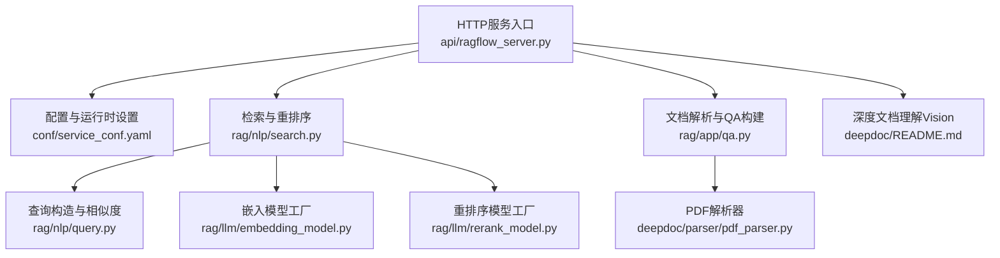
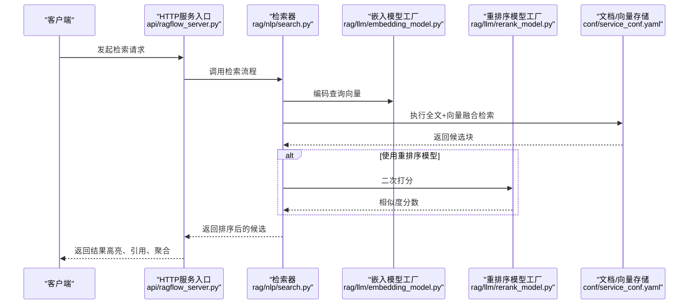
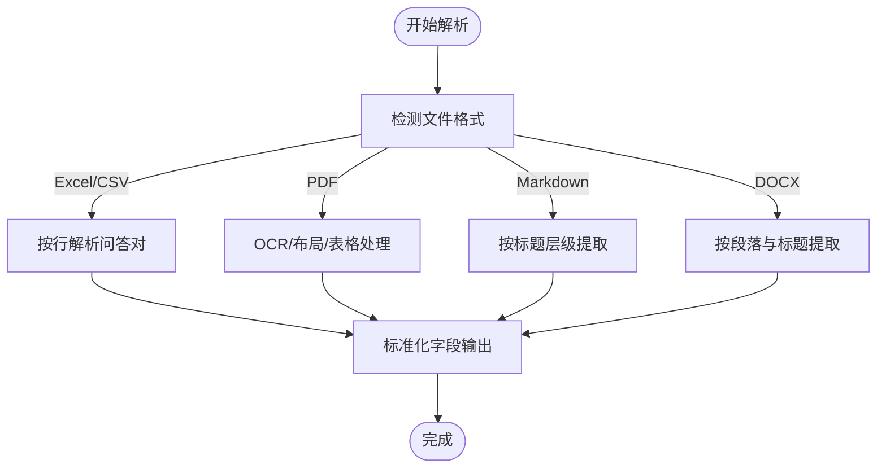
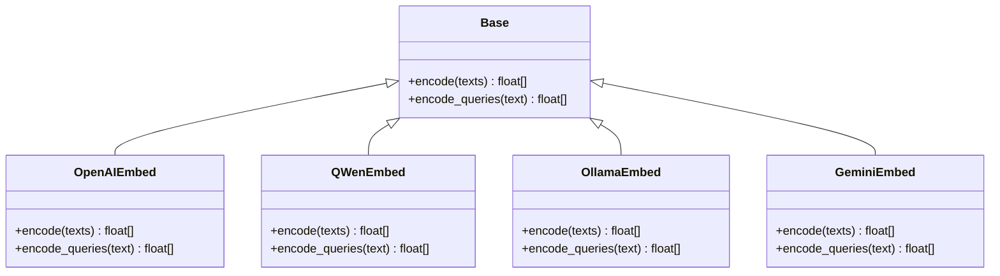
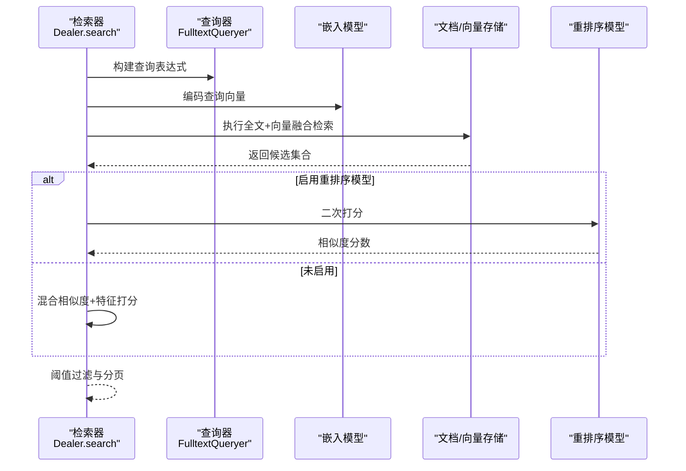
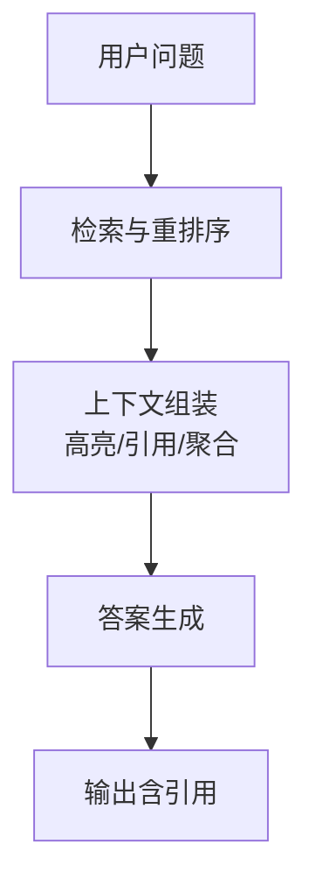
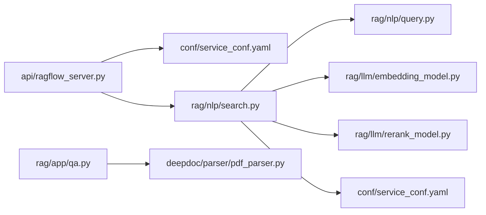

# RAG引擎

<cite>
**本文引用的文件**
- [README.md](file://README.md)
- [api/ragflow_server.py](file://api/ragflow_server.py)
- [conf/service_conf.yaml](file://conf/service_conf.yaml)
- [rag/settings.py](file://rag/settings.py)
- [deepdoc/README.md](file://deepdoc/README.md)
- [rag/llm/embedding_model.py](file://rag/llm/embedding_model.py)
- [rag/llm/rerank_model.py](file://rag/llm/rerank_model.py)
- [rag/nlp/query.py](file://rag/nlp/query.py)
- [rag/nlp/search.py](file://rag/nlp/search.py)
- [rag/app/qa.py](file://rag/app/qa.py)
- [deepdoc/parser/pdf_parser.py](file://deepdoc/parser/pdf_parser.py)
</cite>

## 目录
1. [简介](#简介)
2. [项目结构](#项目结构)
3. [核心组件](#核心组件)
4. [架构总览](#架构总览)
5. [详细组件分析](#详细组件分析)
6. [依赖关系分析](#依赖关系分析)
7. [性能考量](#性能考量)
8. [故障排查指南](#故障排查指南)
9. [结论](#结论)
10. [附录](#附录)

## 简介
本技术文档面向RAG引擎的使用者与开发者，系统性阐述检索增强生成（RAG）的关键实现，覆盖文档解析、向量化与存储、检索与重排序、答案生成与上下文管理、以及性能调优与常见问题。文档以仓库中的实际代码为依据，结合配置文件与运行入口，帮助读者在真实项目中高效落地RAG能力。

## 项目结构
RAG引擎由多层模块协同组成：
- 后端服务入口与配置：通过HTTP服务启动，加载运行时配置与插件，初始化数据库与任务调度。
- 文档解析与预处理：支持多种格式（PDF、DOCX、Excel、Markdown、CSV等），并集成OCR、布局识别、表格结构识别等视觉能力。
- 检索与重排序：全文检索与向量检索融合，支持多种嵌入与重排序模型工厂。
- 生成与上下文：基于检索结果进行答案生成与引用标注，支持高亮与分页聚合。
- 存储与索引：默认使用Elasticsearch，可切换至Infinity等向量/文档存储后端。

图示来源
- [api/ragflow_server.py:1-155](file://api/ragflow_server.py#L1-L155)
- [conf/service_conf.yaml:1-160](file://conf/service_conf.yaml#L1-L160)
- [rag/nlp/search.py:1-716](file://rag/nlp/search.py#L1-L716)
- [rag/nlp/query.py:1-238](file://rag/nlp/query.py#L1-L238)
- [rag/llm/embedding_model.py:1-800](file://rag/llm/embedding_model.py#L1-L800)
- [rag/llm/rerank_model.py:1-552](file://rag/llm/rerank_model.py#L1-L552)
- [rag/app/qa.py:1-471](file://rag/app/qa.py#L1-L471)
- [deepdoc/parser/pdf_parser.py:1-800](file://deepdoc/parser/pdf_parser.py#L1-L800)
- [deepdoc/README.md:1-147](file://deepdoc/README.md#L1-L147)

章节来源
- [README.md:140-144](file://README.md#L140-L144)
- [api/ragflow_server.py:74-155](file://api/ragflow_server.py#L74-L155)
- [conf/service_conf.yaml:1-160](file://conf/service_conf.yaml#L1-L160)

## 核心组件
- 文档解析与QA构建
  - 支持Excel/CSV、PDF、Markdown、DOCX等多种格式，自动抽取问答对或结构化内容，并进行文本切分与位置信息标注。
  - PDF解析器集成OCR、布局识别、表格结构识别与旋转校正，提升复杂文档的解析质量。
- 向量化与存储
  - 嵌入模型工厂统一抽象，支持OpenAI、Qwen、Zhipu、Ollama、Bedrock、Gemini、NVIDIA、Mistral、CoHere等多家供应商与本地部署。
  - 检索阶段同时支持全文与向量融合，支持ES与Infinity两种文档/向量存储后端。
- 检索与重排序
  - 全文查询器构建复杂查询表达式，支持同义词扩展、细粒度分词与权重组合。
  - 向量检索采用余弦相似度，融合阶段支持加权求和与重排序模型二次打分。
- 答案生成与上下文
  - 基于检索结果进行引用标注与高亮，支持按目录层级与父子块合并优化最终候选集。
  - 提供插入引用、关键词提取、聚合统计等辅助能力。

章节来源
- [rag/app/qa.py:307-471](file://rag/app/qa.py#L307-L471)
- [deepdoc/parser/pdf_parser.py:56-800](file://deepdoc/parser/pdf_parser.py#L56-L800)
- [rag/llm/embedding_model.py:36-800](file://rag/llm/embedding_model.py#L36-L800)
- [rag/nlp/search.py:36-716](file://rag/nlp/search.py#L36-L716)
- [rag/nlp/query.py:27-238](file://rag/nlp/query.py#L27-L238)
- [rag/llm/rerank_model.py:28-552](file://rag/llm/rerank_model.py#L28-L552)

## 架构总览
下图展示了从HTTP请求到检索、重排序与生成的整体流程，以及关键组件之间的交互关系。

图示来源
- [api/ragflow_server.py:74-155](file://api/ragflow_server.py#L74-L155)
- [rag/nlp/search.py:364-520](file://rag/nlp/search.py#L364-L520)
- [rag/llm/embedding_model.py:90-122](file://rag/llm/embedding_model.py#L90-L122)
- [rag/llm/rerank_model.py:56-107](file://rag/llm/rerank_model.py#L56-L107)
- [conf/service_conf.yaml:22-46](file://conf/service_conf.yaml#L22-L46)

## 详细组件分析

### 文档解析系统
- 支持格式与解析策略
  - Excel/CSV：按行解析为问答对，自动识别分隔符，容错拼接多行答案。
  - PDF：OCR检测与识别、布局识别、表格结构识别、自动旋转校正，最终合并文本与表格/图像信息。
  - Markdown：按标题层级提取问题与答案，支持表格渲染。
  - DOCX：按段落与标题层级提取，合并跨段落的答案内容。
- 自定义解析器开发要点
  - 继承基础解析器接口，实现二进制与文件路径两种输入适配。
  - 输出标准化字段：content_with_weight、content_ltks、content_sm_ltks、positions、doc_type_kwd等。
  - 对复杂结构（如表格、图片）进行位置标注与裁剪，便于后续高亮与引用。

图示来源
- [rag/app/qa.py:35-471](file://rag/app/qa.py#L35-L471)
- [deepdoc/parser/pdf_parser.py:56-800](file://deepdoc/parser/pdf_parser.py#L56-L800)

章节来源
- [rag/app/qa.py:307-471](file://rag/app/qa.py#L307-L471)
- [deepdoc/parser/pdf_parser.py:56-800](file://deepdoc/parser/pdf_parser.py#L56-L800)

### 向量化与存储机制
- 嵌入模型集成
  - 工厂模式统一抽象，覆盖云端与本地部署场景，支持批量编码与令牌计数。
  - 关键工厂类：OpenAI、Qwen、Zhipu、Ollama、Bedrock、Gemini、NVIDIA、Mistral、CoHere等。
- 向量数据库与存储策略
  - 默认使用Elasticsearch存储全文与向量；可通过配置切换至Infinity。
  - 向量列命名规则：q_{维度}_vec，用于余弦相似度检索与融合。

图示来源
- [rag/llm/embedding_model.py:36-800](file://rag/llm/embedding_model.py#L36-L800)

章节来源
- [rag/llm/embedding_model.py:90-122](file://rag/llm/embedding_model.py#L90-L122)
- [conf/service_conf.yaml:22-46](file://conf/service_conf.yaml#L22-L46)

### 检索与重排序算法
- 全文检索与向量融合
  - 查询器构建复杂查询表达式，支持同义词扩展、细粒度分词与权重组合。
  - 向量检索采用MatchDenseExpr，融合阶段使用加权求和（如0.05/0.95）。
- 重排序策略
  - 可选重排序模型（如Jina、Qwen、CoHere等），对候选块进行二次打分。
  - 若未启用重排序模型，则采用混合相似度（词法+向量）与特征打分（如PageRank、标签特征）。
- 性能优化
  - 分页与阈值过滤：先按向量/全文召回较多候选，再阈值过滤与分页。
  - 重排窗口：根据页面大小动态调整重排上限，避免全量重排。

图示来源
- [rag/nlp/search.py:74-171](file://rag/nlp/search.py#L74-L171)
- [rag/nlp/search.py:364-520](file://rag/nlp/search.py#L364-L520)
- [rag/nlp/query.py:27-238](file://rag/nlp/query.py#L27-L238)
- [rag/llm/rerank_model.py:56-107](file://rag/llm/rerank_model.py#L56-L107)

章节来源
- [rag/nlp/search.py:36-171](file://rag/nlp/search.py#L36-L171)
- [rag/nlp/query.py:27-238](file://rag/nlp/query.py#L27-L238)
- [rag/llm/rerank_model.py:28-552](file://rag/llm/rerank_model.py#L28-L552)

### 答案生成机制
- 上下文管理
  - 将检索到的块按文档聚合，支持高亮显示与引用标注。
  - 支持按目录层级与父子块合并，提升相关性与可读性。
- 输出格式控制
  - 标准化字段：content_with_weight、content_ltks、positions、doc_type_kwd、vector等。
  - 引用插入：基于答案与块的混合相似度，自动插入引用ID，支持多语言句子边界分割。
- 与LLM集成
  - 通过检索器返回的上下文与高亮信息，作为提示词的一部分传入LLM，生成最终答案。

图示来源
- [rag/nlp/search.py:177-267](file://rag/nlp/search.py#L177-L267)
- [rag/nlp/search.py:526-716](file://rag/nlp/search.py#L526-L716)

章节来源
- [rag/nlp/search.py:177-267](file://rag/nlp/search.py#L177-L267)
- [rag/nlp/search.py:526-716](file://rag/nlp/search.py#L526-L716)

## 依赖关系分析
- 运行时依赖
  - HTTP服务入口负责初始化数据库、运行时配置、插件加载与后台任务线程。
  - 配置文件集中管理服务端口、数据库、对象存储、搜索引擎与Redis等外部依赖。
- 检索子系统依赖
  - 检索器依赖查询器、嵌入模型工厂与重排序模型工厂，最终访问文档/向量存储。
- 解析子系统依赖
  - QA模块依赖DeepDoc解析器，PDF解析器进一步依赖OCR与视觉识别组件。

图示来源
- [api/ragflow_server.py:74-155](file://api/ragflow_server.py#L74-L155)
- [conf/service_conf.yaml:1-160](file://conf/service_conf.yaml#L1-160)
- [rag/nlp/search.py:36-716](file://rag/nlp/search.py#L36-L716)
- [rag/nlp/query.py:27-238](file://rag/nlp/query.py#L27-L238)
- [rag/llm/embedding_model.py:36-800](file://rag/llm/embedding_model.py#L36-L800)
- [rag/llm/rerank_model.py:28-552](file://rag/llm/rerank_model.py#L28-L552)
- [rag/app/qa.py:307-471](file://rag/app/qa.py#L307-L471)
- [deepdoc/parser/pdf_parser.py:56-800](file://deepdoc/parser/pdf_parser.py#L56-L800)

章节来源
- [api/ragflow_server.py:74-155](file://api/ragflow_server.py#L74-L155)
- [conf/service_conf.yaml:1-160](file://conf/service_conf.yaml#L1-L160)

## 性能考量
- 向量编码批处理与令牌计数
  - 嵌入模型工厂对批量请求进行分片处理，减少单次超长输入风险，同时统计令牌消耗。
- 检索与重排窗口控制
  - 通过RERANK_LIMIT与分页参数控制重排候选规模，避免全量重排带来的延迟。
- 存储后端选择
  - ES适合全文强匹配与聚合；Infinity在某些场景下具备更好的归一化与融合表现。
- OCR与视觉识别
  - PDF解析器支持并行限制与设备选择，合理配置可提升吞吐；表格自动旋转可显著提升识别准确率。

章节来源
- [rag/llm/embedding_model.py:90-122](file://rag/llm/embedding_model.py#L90-L122)
- [rag/nlp/search.py:385-430](file://rag/nlp/search.py#L385-L430)
- [deepdoc/parser/pdf_parser.py:56-800](file://deepdoc/parser/pdf_parser.py#L56-L800)

## 故障排查指南
- 服务启动与初始化
  - 确认环境变量与配置文件正确加载，检查日志输出与端口占用情况。
- 数据库与存储连接
  - 核对MySQL、Redis、Elasticsearch/Infinity等连接参数是否与部署一致。
- 嵌入与重排序模型调用失败
  - 检查API密钥、Base URL与网络连通性；关注批量大小与输入长度限制。
- PDF解析异常
  - 关注OCR与布局识别的日志，确认HuggingFace镜像源与CUDA可用性；必要时降低并发或禁用自动旋转。

章节来源
- [api/ragflow_server.py:74-155](file://api/ragflow_server.py#L74-L155)
- [conf/service_conf.yaml:1-160](file://conf/service_conf.yaml#L1-L160)
- [rag/llm/embedding_model.py:173-220](file://rag/llm/embedding_model.py#L173-L220)
- [rag/llm/rerank_model.py:56-107](file://rag/llm/rerank_model.py#L56-L107)
- [deepdoc/parser/pdf_parser.py:56-800](file://deepdoc/parser/pdf_parser.py#L56-L800)

## 结论
本RAG引擎以模块化设计为核心，围绕文档解析、向量化与存储、检索与重排序、以及答案生成与上下文管理形成完整闭环。通过灵活的模型工厂与存储后端选择，可在不同业务场景下取得良好的召回与生成效果。配合合理的性能调优策略与完善的故障排查流程，能够满足生产级部署与运维需求。

## 附录
- 快速上手与配置参考
  - 服务端口与数据库、对象存储、搜索引擎等配置集中在配置文件中，按需修改即可。
- 开发与调试
  - 可通过HTTP服务入口与调试参数快速定位问题；注意日志级别与线程池配置。

章节来源
- [conf/service_conf.yaml:1-160](file://conf/service_conf.yaml#L1-L160)
- [api/ragflow_server.py:74-155](file://api/ragflow_server.py#L74-L155)