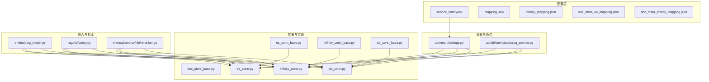
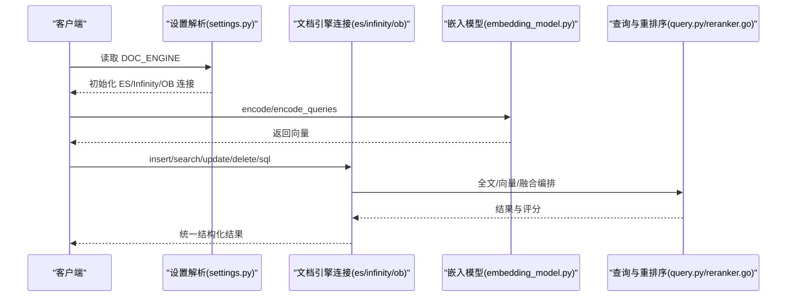
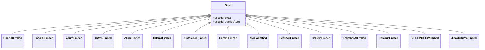
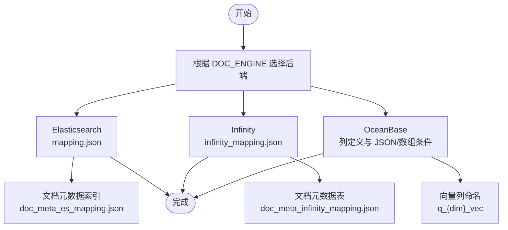
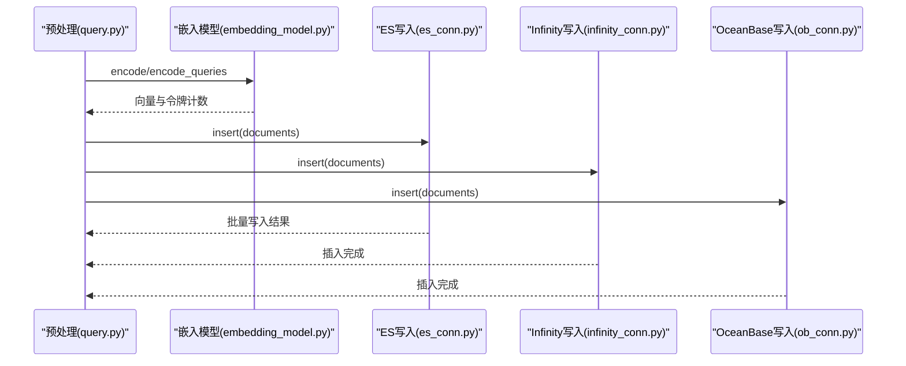
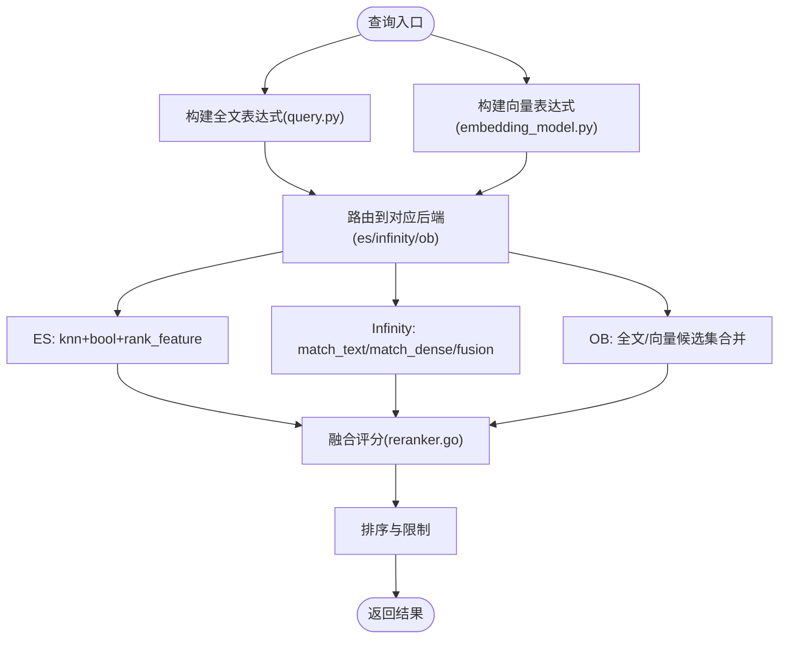
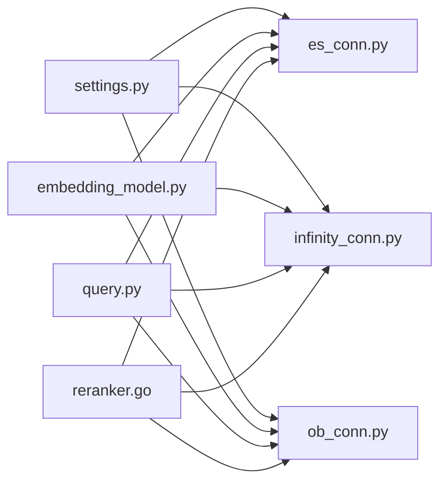

# 向量化与存储

<cite>
**本文引用的文件**   
- [service_conf.yaml](file://conf/service_conf.yaml)
- [settings.py](file://common/settings.py)
- [doc_store_base.py](file://common/doc_store/doc_store_base.py)
- [es_conn_base.py](file://common/doc_store/es_conn_base.py)
- [infinity_conn_base.py](file://common/doc_store/infinity_conn_base.py)
- [es_conn.py](file://rag/utils/es_conn.py)
- [infinity_conn.py](file://rag/utils/infinity_conn.py)
- [ob_conn_base.py](file://common/doc_store/ob_conn_base.py)
- [ob_conn.py](file://rag/utils/ob_conn.py)
- [embedding_model.py](file://rag/llm/embedding_model.py)
- [query.py](file://rag/nlp/query.py)
- [mapping.json](file://conf/mapping.json)
- [infinity_mapping.json](file://conf/infinity_mapping.json)
- [doc_meta_es_mapping.json](file://conf/doc_meta_es_mapping.json)
- [doc_meta_infinity_mapping.json](file://conf/doc_meta_infinity_mapping.json)
- [dialog_service.py](file://api/db/services/dialog_service.py)
- [reranker.go](file://internal/service/nlp/reranker.go)
</cite>

## 目录
1. [简介](#简介)
2. [项目结构](#项目结构)
3. [核心组件](#核心组件)
4. [架构总览](#架构总览)
5. [详细组件分析](#详细组件分析)
6. [依赖分析](#依赖分析)
7. [性能考虑](#性能考虑)
8. [故障排查指南](#故障排查指南)
9. [结论](#结论)
10. [附录](#附录)

## 简介
本技术文档面向“向量化与存储”子系统，系统性阐述以下内容：
- 嵌入模型集成：OpenAI Embeddings、本地嵌入模型、第三方厂商模型、多模态嵌入等实现方式与适配策略
- 向量数据库配置：Elasticsearch、Infinity、OceanBase 等存储后端的选择、映射与优化
- 向量化流程：文本预处理、分词与权重、向量生成、批量处理与索引建立
- 存储策略：向量索引、相似度计算、融合检索、查询优化与聚合
- 配置示例与性能调优：基于不同业务场景的选型建议与最佳实践
- 检索性能优化与存储成本控制：从索引参数到查询路径的全链路优化

## 项目结构
围绕向量化与存储的关键目录与文件：
- 配置层：服务配置与索引映射
  - conf/service_conf.yaml：服务端口、ES/OB/Infinity 连接参数
  - conf/mapping.json、conf/infinity_mapping.json、conf/doc_meta_es_mapping.json、conf/doc_meta_infinity_mapping.json：各后端字段与向量维度映射
- 设置与路由：运行时选择文档引擎
  - common/settings.py：DOC_ENGINE 环境变量解析，按需初始化 ES/Infinity/OB 连接
- 文档引擎抽象与实现：统一接口与多后端实现
  - common/doc_store/doc_store_base.py：DocStoreConnection 抽象与匹配表达式定义
  - common/doc_store/es_conn_base.py、common/doc_store/infinity_conn_base.py、common/doc_store/ob_conn_base.py：各后端连接基类
  - rag/utils/es_conn.py、rag/utils/infinity_conn.py、rag/utils/ob_conn.py：具体实现与查询编排
- 嵌入模型：多源模型工厂与编码器
  - rag/llm/embedding_model.py：OpenAI、LocalAI、Azure、Qwen、Zhipu、Ollama、Xinference、Gemini、NVIDIA、Bedrock、CoHere、TogetherAI、Upstage、SILICONFLOW、Jina 等
- NLP 查询与重排序：全文与向量融合
  - rag/nlp/query.py：全文查询构建与混合相似度
  - internal/service/nlp/reranker.go：向量与词法相似度融合与排序
- API 层：SQL 与检索路由
  - api/db/services/dialog_service.py：根据 DOC_ENGINE 选择表名与 SQL 路径

**图表来源**
- [service_conf.yaml:1-160](file://conf/service_conf.yaml#L1-L160)
- [settings.py:260-285](file://common/settings.py#L260-L285)
- [doc_store_base.py:143-271](file://common/doc_store/doc_store_base.py#L143-L271)
- [es_conn_base.py:37-333](file://common/doc_store/es_conn_base.py#L37-L333)
- [infinity_conn_base.py:35-763](file://common/doc_store/infinity_conn_base.py#L35-L763)
- [ob_conn_base.py:1-39](file://common/doc_store/ob_conn_base.py#L1-L39)
- [es_conn.py:35-476](file://rag/utils/es_conn.py#L35-L476)
- [infinity_conn.py:29-661](file://rag/utils/infinity_conn.py#L29-L661)
- [ob_conn.py:298-800](file://rag/utils/ob_conn.py#L298-L800)
- [embedding_model.py:90-1026](file://rag/llm/embedding_model.py#L90-L1026)
- [query.py:27-238](file://rag/nlp/query.py#L27-L238)
- [reranker.go:255-380](file://internal/service/nlp/reranker.go#L255-L380)
- [dialog_service.py:780-814](file://api/db/services/dialog_service.py#L780-L814)

**章节来源**
- [service_conf.yaml:1-160](file://conf/service_conf.yaml#L1-L160)
- [settings.py:260-285](file://common/settings.py#L260-L285)

## 核心组件
- 文档引擎抽象与表达式
  - DocStoreConnection：统一的 CRUD、搜索、SQL 执行接口
  - MatchExpr 家族：文本匹配、稠密向量匹配、稀疏向量匹配、张量匹配、融合表达式
- 多后端实现
  - ESConnection：基于 Elasticsearch DSL 的 KNN、全文与聚合
  - InfinityConnection：基于 Infinity 的 match_text/match_dense/fusion 与列别名转换
  - OBConnection：基于 OceanBase 的全文与向量融合、MySQL JSON/数组条件、UNION_MERGE 提示
- 嵌入模型工厂
  - OpenAIEmbed、LocalAIEmbed、AzureEmbed、QWenEmbed、ZhipuEmbed、OllamaEmbed、XinferenceEmbed、GeminiEmbed、NvidiaEmbed、BedrockEmbed、CoHereEmbed、TogetherAIEmbed、UpstageEmbed、SILICONFLOWEmbed、JinaMultiVecEmbed 等
- 查询与重排序
  - FulltextQueryer：构建全文查询、权重与同义词扩展
  - reranker.go：向量相似度与词法相似度融合

**章节来源**
- [doc_store_base.py:24-271](file://common/doc_store/doc_store_base.py#L24-L271)
- [es_conn_base.py:37-333](file://common/doc_store/es_conn_base.py#L37-L333)
- [infinity_conn_base.py:35-763](file://common/doc_store/infinity_conn_base.py#L35-L763)
- [ob_conn_base.py:1-39](file://common/doc_store/ob_conn_base.py#L1-L39)
- [es_conn.py:35-476](file://rag/utils/es_conn.py#L35-L476)
- [infinity_conn.py:29-661](file://rag/utils/infinity_conn.py#L29-L661)
- [ob_conn.py:298-800](file://rag/utils/ob_conn.py#L298-L800)
- [embedding_model.py:90-1026](file://rag/llm/embedding_model.py#L90-L1026)
- [query.py:27-238](file://rag/nlp/query.py#L27-L238)
- [reranker.go:255-380](file://internal/service/nlp/reranker.go#L255-L380)

## 架构总览
系统通过环境变量 DOC_ENGINE 选择文档引擎，并在运行时注入对应的连接实现。嵌入模型负责将文本/多模态输入编码为向量，随后写入所选后端。检索阶段支持纯向量、纯全文与向量+全文融合三种模式，最终由统一的 DocStoreConnection 接口返回结果。

**图表来源**
- [settings.py:260-285](file://common/settings.py#L260-L285)
- [es_conn.py:116-258](file://rag/utils/es_conn.py#L116-L258)
- [infinity_conn.py:92-280](file://rag/utils/infinity_conn.py#L92-L280)
- [ob_conn.py:516-800](file://rag/utils/ob_conn.py#L516-L800)
- [embedding_model.py:90-1026](file://rag/llm/embedding_model.py#L90-L1026)
- [query.py:27-238](file://rag/nlp/query.py#L27-L238)
- [reranker.go:255-380](file://internal/service/nlp/reranker.go#L255-L380)

## 详细组件分析

### 嵌入模型集成
- 支持多源与多模态
  - OpenAI、Azure OpenAI、LocalAI、Qwen、Zhipu、Ollama、Xinference、Gemini、NVIDIA、Bedrock、CoHere、TogetherAI、Upstage、SILICONFLOW、Jina（多向量聚合）
- 编码策略
  - 文本截断与批处理、令牌计数、向量规范化格式
  - 多模态：Jina 支持图片 base64 输入，自动聚合 token 级向量得到段落向量
- 本地与云端可插拔
  - 通过工厂类与配置切换，无需修改上层调用逻辑

**图表来源**
- [embedding_model.py:36-1026](file://rag/llm/embedding_model.py#L36-L1026)

**章节来源**
- [embedding_model.py:90-1026](file://rag/llm/embedding_model.py#L90-L1026)

### 向量数据库配置与映射
- Elasticsearch
  - 映射模板：动态模板定义 *_vec 密集向量字段、*_tks/_kwd 等字段类型与分析器
  - 文档元数据索引：独立的 doc_meta 索引用于存储文档级元信息
- Infinity
  - 表结构：以列别名映射到 docnm/content/important/questions/authors 等字段
  - 向量列命名规则：q_{dim}_vec，HNSW 索引参数可配置
  - 全文索引：按字段配置 ANALYZER，支持二次索引
- OceanBase
  - 列定义覆盖：id/kb_id/doc_id/docnm_kwd/doc_type_kwd/title_tks/title_sm_tks/content_*、pagerank_fea、important_kwd/important_tks、question_kwd/question_tks、tag_kwd/tag_feas、available_int、position_int/page_num_int/top_int、knowledge_graph_kwd/entity_*、weight_*、rank_flt、removed_kwd、chunk_data/metadata/extra、order_id/group_id/mom_id 等
  - 全文与向量融合：支持全文与向量候选集合并，UNION_MERGE 提示优化

**图表来源**
- [settings.py:260-285](file://common/settings.py#L260-L285)
- [mapping.json:1-212](file://conf/mapping.json#L1-L212)
- [infinity_mapping.json:1-41](file://conf/infinity_mapping.json#L1-L41)
- [doc_meta_es_mapping.json:1-30](file://conf/doc_meta_es_mapping.json#L1-L30)
- [doc_meta_infinity_mapping.json:1-5](file://conf/doc_meta_infinity_mapping.json#L1-L5)
- [ob_conn_base.py:34-39](file://common/doc_store/ob_conn_base.py#L34-L39)

**章节来源**
- [mapping.json:1-212](file://conf/mapping.json#L1-L212)
- [infinity_mapping.json:1-41](file://conf/infinity_mapping.json#L1-L41)
- [doc_meta_es_mapping.json:1-30](file://conf/doc_meta_es_mapping.json#L1-L30)
- [doc_meta_infinity_mapping.json:1-5](file://conf/doc_meta_infinity_mapping.json#L1-L5)
- [ob_conn_base.py:34-39](file://common/doc_store/ob_conn_base.py#L34-L39)

### 向量化流程与批量处理
- 文本预处理与分词
  - 中英文混合处理、繁简转换、空白清理、同义词扩展、细粒度分词
  - 权重计算与短语组合，提升检索质量
- 向量生成
  - 嵌入模型输出固定维度向量，按批次请求与令牌统计
- 批量写入
  - ES：bulk 操作，错误收集
  - Infinity：推断向量维度、列别名转换、JSON 字段序列化、删除去重后插入
  - OB：数组/JSON 字段处理、metadata 过滤表达式、UNION_MERGE 提示

**图表来源**
- [query.py:27-238](file://rag/nlp/query.py#L27-L238)
- [embedding_model.py:90-1026](file://rag/llm/embedding_model.py#L90-L1026)
- [es_conn.py:259-296](file://rag/utils/es_conn.py#L259-L296)
- [infinity_conn.py:317-456](file://rag/utils/infinity_conn.py#L317-L456)
- [ob_conn.py:762-800](file://rag/utils/ob_conn.py#L762-L800)

**章节来源**
- [query.py:27-238](file://rag/nlp/query.py#L27-L238)
- [embedding_model.py:90-1026](file://rag/llm/embedding_model.py#L90-L1026)
- [es_conn.py:259-296](file://rag/utils/es_conn.py#L259-L296)
- [infinity_conn.py:317-456](file://rag/utils/infinity_conn.py#L317-L456)
- [ob_conn.py:762-800](file://rag/utils/ob_conn.py#L762-L800)

### 存储策略与查询优化
- 索引建立
  - ES：动态模板自动识别 *_vec 并创建密集向量字段
  - Infinity：按 dim 创建 q_{dim}_vec，HNSW 索引，字段 ANALYZER 与二次索引
  - OB：列定义明确，向量列命名规则，全文索引列名模板
- 相似度与融合
  - ES：knn 查询结合 bool 过滤与 rank_feature
  - Infinity：match_text/match_dense/fusion，列别名转换与排序
  - OB：全文与向量候选集合并，UNION_MERGE 提示，向量阈值过滤
- 查询优化
  - ES：search_after 分页避免深分页，最小化聚合
  - Infinity：列别名映射减少字段冗余，排序与总命中统计
  - OB：metadata JSON 过滤、数组 contains、UNION_MERGE 提示

**图表来源**
- [query.py:27-238](file://rag/nlp/query.py#L27-L238)
- [embedding_model.py:90-1026](file://rag/llm/embedding_model.py#L90-L1026)
- [es_conn.py:116-258](file://rag/utils/es_conn.py#L116-L258)
- [infinity_conn.py:92-280](file://rag/utils/infinity_conn.py#L92-L280)
- [ob_conn.py:516-800](file://rag/utils/ob_conn.py#L516-L800)
- [reranker.go:255-380](file://internal/service/nlp/reranker.go#L255-L380)

**章节来源**
- [es_conn.py:116-258](file://rag/utils/es_conn.py#L116-L258)
- [infinity_conn.py:92-280](file://rag/utils/infinity_conn.py#L92-L280)
- [ob_conn.py:516-800](file://rag/utils/ob_conn.py#L516-L800)
- [reranker.go:255-380](file://internal/service/nlp/reranker.go#L255-L380)

### API 与 SQL 路由
- 根据 DOC_ENGINE 选择表名与 SQL 路径
  - Infinity：表名附加 kb_id
  - ES/OpenSearch：使用基础索引名
- 支持 SQL 与 Text-to-SQL
  - ES：SQL 查询执行与超时处理
  - Infinity：psql 命令执行与字段别名映射

**章节来源**
- [dialog_service.py:780-814](file://api/db/services/dialog_service.py#L780-L814)
- [es_conn_base.py:298-333](file://common/doc_store/es_conn_base.py#L298-L333)
- [infinity_conn_base.py:591-763](file://common/doc_store/infinity_conn_base.py#L591-L763)

## 依赖分析
- 组件耦合
  - DocStoreConnection 抽象隔离了 ES/Infinity/OB 的差异
  - 嵌入模型与检索后端解耦，通过 MatchDenseExpr 传递向量
- 关键依赖链
  - settings.py → es_conn.py / infinity_conn.py / ob_conn.py
  - embedding_model.py → es_conn.py / infinity_conn.py / ob_conn.py
  - query.py → es_conn.py / infinity_conn.py / ob_conn.py
  - reranker.go → 向量相似度与词法相似度融合

**图表来源**
- [settings.py:260-285](file://common/settings.py#L260-L285)
- [es_conn.py:35-476](file://rag/utils/es_conn.py#L35-L476)
- [infinity_conn.py:29-661](file://rag/utils/infinity_conn.py#L29-L661)
- [ob_conn.py:298-800](file://rag/utils/ob_conn.py#L298-L800)
- [embedding_model.py:90-1026](file://rag/llm/embedding_model.py#L90-L1026)
- [query.py:27-238](file://rag/nlp/query.py#L27-L238)
- [reranker.go:255-380](file://internal/service/nlp/reranker.go#L255-L380)

**章节来源**
- [settings.py:260-285](file://common/settings.py#L260-L285)
- [es_conn.py:35-476](file://rag/utils/es_conn.py#L35-L476)
- [infinity_conn.py:29-661](file://rag/utils/infinity_conn.py#L29-L661)
- [ob_conn.py:298-800](file://rag/utils/ob_conn.py#L298-L800)
- [embedding_model.py:90-1026](file://rag/llm/embedding_model.py#L90-L1026)
- [query.py:27-238](file://rag/nlp/query.py#L27-L238)
- [reranker.go:255-380](file://internal/service/nlp/reranker.go#L255-L380)

## 性能考虑
- 向量维度与索引
  - ES：通过动态模板自动识别 *_vec 并设置 similarity 与 dims
  - Infinity：HNSW 参数（M、ef_construction、metric、encode）影响召回与吞吐
  - OB：向量列命名规则与阈值过滤，UNION_MERGE 提示减少扫描
- 全文与向量融合
  - ES：knn 与 bool 组合，rank_feature 加权
  - Infinity：fusion 方法与归一化策略
  - OB：候选集合并与提示符优化
- 分页与聚合
  - ES：search_after 避免深分页，聚合字段限制
  - Infinity：手动聚合与排序
  - OB：JSON 过滤与数组 contains
- 存储成本
  - ES：合理设置刷新间隔与副本数
  - Infinity：列别名映射减少冗余字段
  - OB：JSON/数组字段序列化与索引列精简

[本节为通用指导，不直接分析具体文件]

## 故障排查指南
- 连接健康检查
  - ES：集群健康状态与节点信息
  - Infinity：节点状态与数据库可用性
  - OB：连接池统计、慢查询计数、存储空间
- 常见问题定位
  - 向量维度不一致：检查 embedding 输出维度与后端向量列命名
  - 全文索引缺失：确认 *_kwd 字段与 ANALYZER 配置
  - 融合权重异常：核对 FusionExpr 权重与阈值
  - SQL 超时：调整 fetch_size/format 或改用 search_after/分页策略

**章节来源**
- [es_conn_base.py:70-123](file://common/doc_store/es_conn_base.py#L70-L123)
- [infinity_conn_base.py:239-254](file://common/doc_store/infinity_conn_base.py#L239-L254)
- [ob_conn.py:338-511](file://rag/utils/ob_conn.py#L338-L511)

## 结论
本系统通过统一的 DocStoreConnection 抽象与多后端实现，实现了嵌入模型与多种向量存储的无缝对接。结合全文与向量的融合检索、灵活的索引与查询优化策略，能够在不同业务场景下平衡检索质量与性能。通过合理的配置与调优，可在保证召回的同时有效控制存储成本。

[本节为总结性内容，不直接分析具体文件]

## 附录

### 配置示例与最佳实践
- 选择文档引擎
  - DOC_ENGINE=elasticsearch：适用于全文优先、复杂聚合与 SQL 场景
  - DOC_ENGINE=infinity：适用于高维向量与高性能融合检索
  - DOC_ENGINE=oceanbase：适用于需要强一致与 SQL 能力的企业场景
- 向量维度与索引
  - ES：确保 mapping.json 中存在对应 *_vec 动态模板
  - Infinity：确认 q_{dim}_vec 列与 HNSW 索引参数
  - OB：确认列定义与向量列命名规则
- 融合检索权重
  - ES：通过 FusionExpr 的 weights 控制向量与全文权重
  - Infinity：通过 fusion normalize 与权重归一化
  - OB：通过阈值与候选集合并策略控制召回

**章节来源**
- [service_conf.yaml:1-160](file://conf/service_conf.yaml#L1-L160)
- [settings.py:260-285](file://common/settings.py#L260-L285)
- [mapping.json:159-201](file://conf/mapping.json#L159-L201)
- [infinity_mapping.json:1-41](file://conf/infinity_mapping.json#L1-L41)
- [es_conn.py:158-167](file://rag/utils/es_conn.py#L158-L167)
- [infinity_conn.py:214-218](file://rag/utils/infinity_conn.py#L214-L218)
- [ob_conn.py:721-723](file://rag/utils/ob_conn.py#L721-L723)