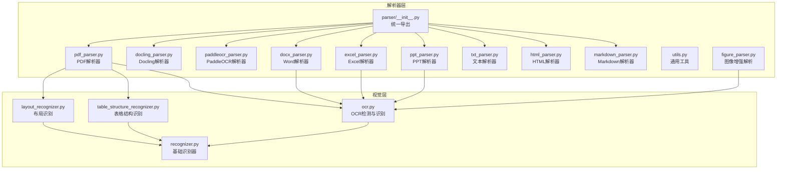
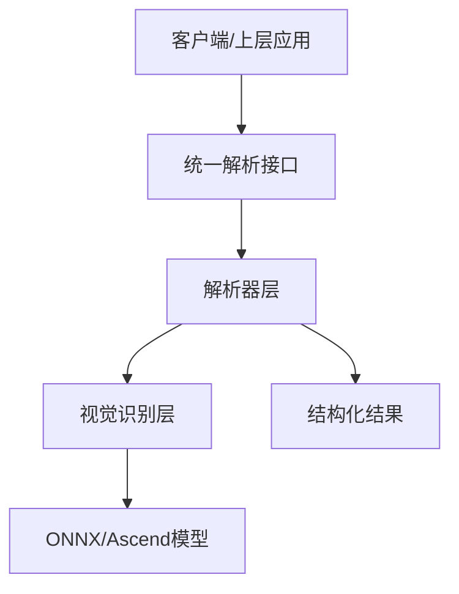
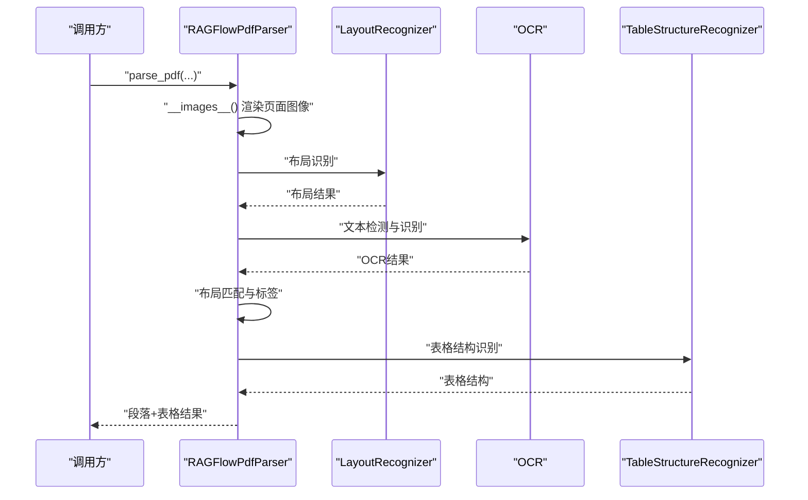
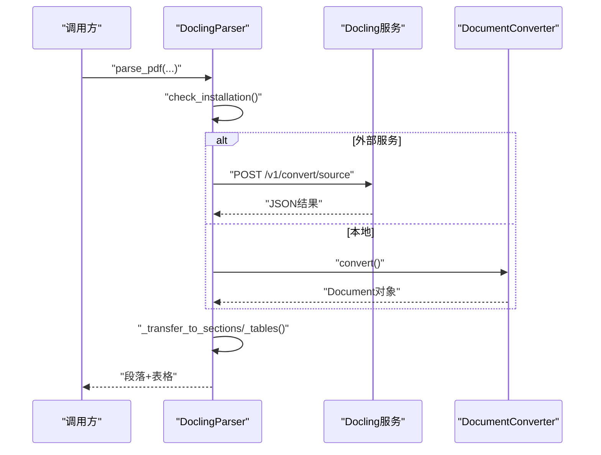
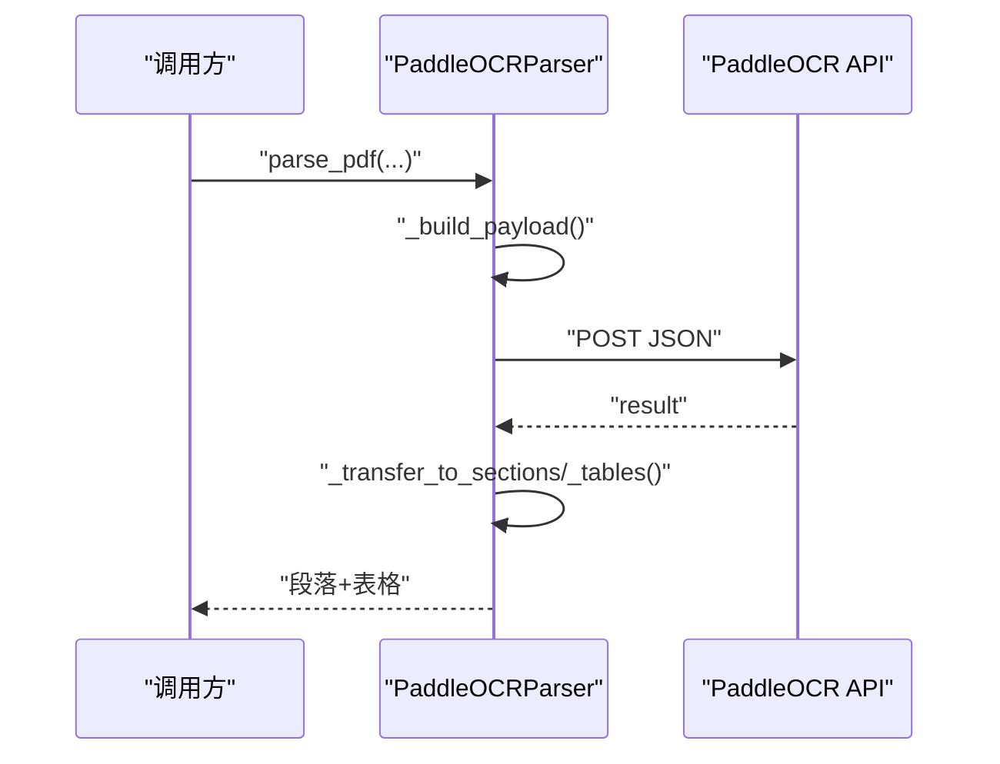
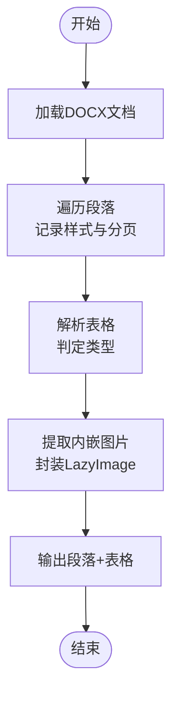
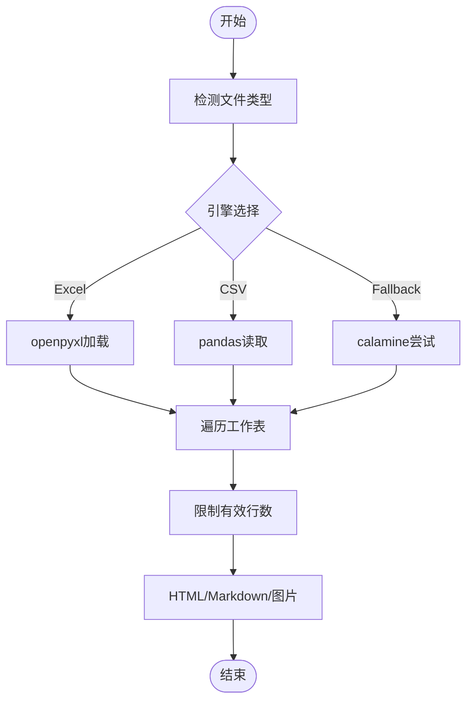
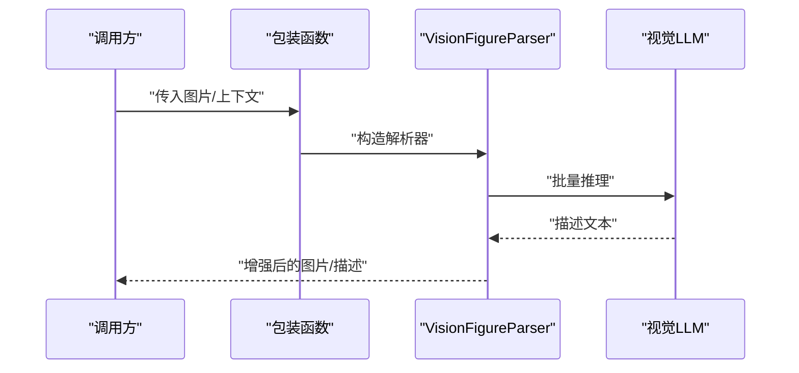
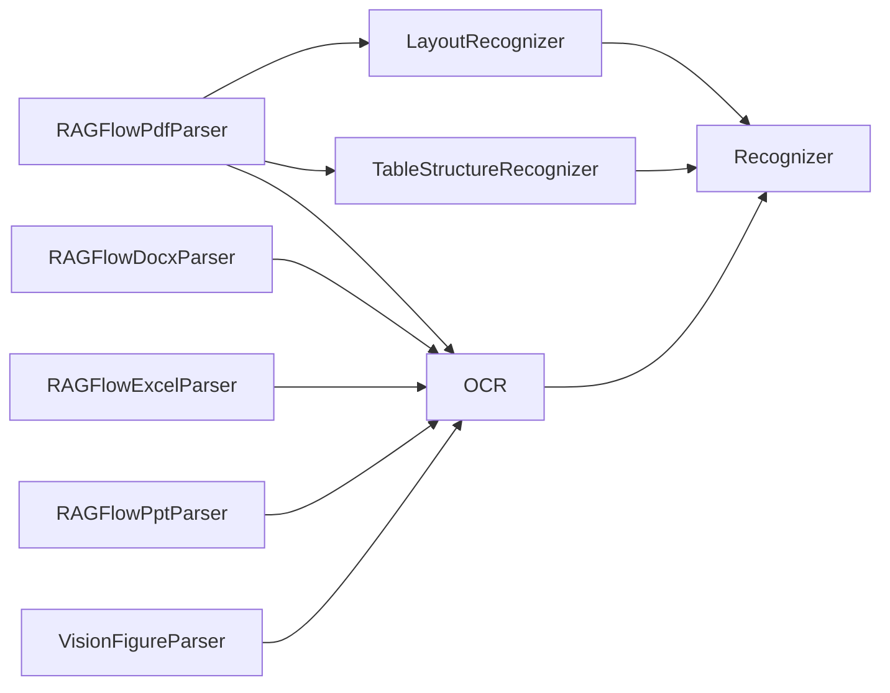

# 文档解析系统

<cite>
**本文档引用的文件**
- [deepdoc/parser/__init__.py](file://deepdoc/parser/__init__.py)
- [deepdoc/parser/pdf_parser.py](file://deepdoc/parser/pdf_parser.py)
- [deepdoc/parser/docling_parser.py](file://deepdoc/parser/docling_parser.py)
- [deepdoc/parser/paddleocr_parser.py](file://deepdoc/parser/paddleocr_parser.py)
- [deepdoc/parser/docx_parser.py](file://deepdoc/parser/docx_parser.py)
- [deepdoc/parser/excel_parser.py](file://deepdoc/parser/excel_parser.py)
- [deepdoc/parser/ppt_parser.py](file://deepdoc/parser/ppt_parser.py)
- [deepdoc/parser/txt_parser.py](file://deepdoc/parser/txt_parser.py)
- [deepdoc/parser/html_parser.py](file://deepdoc/parser/html_parser.py)
- [deepdoc/parser/markdown_parser.py](file://deepdoc/parser/markdown_parser.py)
- [deepdoc/parser/utils.py](file://deepdoc/parser/utils.py)
- [deepdoc/parser/figure_parser.py](file://deepdoc/parser/figure_parser.py)
- [deepdoc/vision/layout_recognizer.py](file://deepdoc/vision/layout_recognizer.py)
- [deepdoc/vision/table_structure_recognizer.py](file://deepdoc/vision/table_structure_recognizer.py)
- [deepdoc/vision/ocr.py](file://deepdoc/vision/ocr.py)
- [deepdoc/vision/recognizer.py](file://deepdoc/vision/recognizer.py)
</cite>

## 目录
1. [引言](#引言)
2. [项目结构](#项目结构)
3. [核心组件](#核心组件)
4. [架构总览](#架构总览)
5. [详细组件分析](#详细组件分析)
6. [依赖关系分析](#依赖关系分析)
7. [性能考虑](#性能考虑)
8. [故障排查指南](#故障排查指南)
9. [结论](#结论)
10. [附录](#附录)

## 引言
本技术文档面向文档解析系统，系统支持多种文档格式（PDF、Word、Excel、PPT、TXT、HTML、Markdown 等），并提供解析器架构设计、文档结构识别（标题层级、表格结构、图像内容分析）、解析质量优化策略（布局分析、内容重建、格式保持）、配置示例与自定义解析器开发指南，以及性能优化与常见问题解决方案。

## 项目结构
解析能力主要集中在 deepdoc/parser 与 deepdoc/vision 两个子模块：
- deepdoc/parser：各格式解析器入口与实现，统一导出接口
- deepdoc/vision：视觉模型与算法（布局识别、表格结构识别、OCR）

**图示来源**
- [deepdoc/parser/__init__.py:17-41](file://deepdoc/parser/__init__.py#L17-L41)
- [deepdoc/parser/pdf_parser.py:56-110](file://deepdoc/parser/pdf_parser.py#L56-L110)
- [deepdoc/parser/docling_parser.py:79-124](file://deepdoc/parser/docling_parser.py#L79-L124)
- [deepdoc/parser/paddleocr_parser.py:161-227](file://deepdoc/parser/paddleocr_parser.py#L161-L227)
- [deepdoc/parser/docx_parser.py:31-70](file://deepdoc/parser/docx_parser.py#L31-L70)
- [deepdoc/parser/excel_parser.py:29-67](file://deepdoc/parser/excel_parser.py#L29-L67)
- [deepdoc/parser/ppt_parser.py:22-35](file://deepdoc/parser/ppt_parser.py#L22-L35)
- [deepdoc/parser/txt_parser.py:23-33](file://deepdoc/parser/txt_parser.py#L23-L33)
- [deepdoc/parser/html_parser.py:39-76](file://deepdoc/parser/html_parser.py#L39-L76)
- [deepdoc/parser/markdown_parser.py:23-32](file://deepdoc/parser/markdown_parser.py#L23-L32)
- [deepdoc/parser/figure_parser.py:31-64](file://deepdoc/parser/figure_parser.py#L31-L64)
- [deepdoc/vision/layout_recognizer.py:33-57](file://deepdoc/vision/layout_recognizer.py#L33-L57)
- [deepdoc/vision/table_structure_recognizer.py:30-53](file://deepdoc/vision/table_structure_recognizer.py#L30-L53)
- [deepdoc/vision/ocr.py:542-586](file://deepdoc/vision/ocr.py#L542-L586)
- [deepdoc/vision/recognizer.py:31-53](file://deepdoc/vision/recognizer.py#L31-L53)

**章节来源**
- [deepdoc/parser/__init__.py:17-41](file://deepdoc/parser/__init__.py#L17-L41)

## 核心组件
- 解析器统一入口：通过 __all__ 导出各类解析器类名，便于上层按需调用
- PDF 解析器：集成布局识别、表格结构识别、OCR、方向校正、旋转优化等能力
- Docling 解析器：支持本地 Docling 或外部 Docling 服务，输出结构化段落与表格
- PaddleOCR 解析器：基于 PaddleOCR API 的远程解析，支持位置标记与裁剪
- Word/Excel/PPT 解析器：分别处理富文本、表格与形状元素抽取
- 文本/HTML/Markdown 解析器：文本分块、HTML 结构化抽取、Markdown 元素提取
- 视觉识别组件：布局识别、表格结构识别、OCR 检测与识别、通用识别器基类

**章节来源**
- [deepdoc/parser/__init__.py:17-41](file://deepdoc/parser/__init__.py#L17-L41)
- [deepdoc/parser/pdf_parser.py:56-110](file://deepdoc/parser/pdf_parser.py#L56-L110)
- [deepdoc/parser/docling_parser.py:79-124](file://deepdoc/parser/docling_parser.py#L79-L124)
- [deepdoc/parser/paddleocr_parser.py:161-227](file://deepdoc/parser/paddleocr_parser.py#L161-L227)
- [deepdoc/parser/docx_parser.py:31-70](file://deepdoc/parser/docx_parser.py#L31-L70)
- [deepdoc/parser/excel_parser.py:29-67](file://deepdoc/parser/excel_parser.py#L29-L67)
- [deepdoc/parser/ppt_parser.py:22-35](file://deepdoc/parser/ppt_parser.py#L22-L35)
- [deepdoc/parser/txt_parser.py:23-33](file://deepdoc/parser/txt_parser.py#L23-L33)
- [deepdoc/parser/html_parser.py:39-76](file://deepdoc/parser/html_parser.py#L39-L76)
- [deepdoc/parser/markdown_parser.py:23-32](file://deepdoc/parser/markdown_parser.py#L23-L32)
- [deepdoc/parser/figure_parser.py:31-64](file://deepdoc/parser/figure_parser.py#L31-L64)
- [deepdoc/vision/layout_recognizer.py:33-57](file://deepdoc/vision/layout_recognizer.py#L33-L57)
- [deepdoc/vision/table_structure_recognizer.py:30-53](file://deepdoc/vision/table_structure_recognizer.py#L30-L53)
- [deepdoc/vision/ocr.py:542-586](file://deepdoc/vision/ocr.py#L542-L586)
- [deepdoc/vision/recognizer.py:31-53](file://deepdoc/vision/recognizer.py#L31-L53)

## 架构总览
系统采用“解析器层 + 视觉层”的双层架构：
- 解析器层负责具体格式解析与结构化输出
- 视觉层提供布局识别、表格结构识别与 OCR 能力，PDF 解析器深度集成这些能力

**图示来源**
- [deepdoc/parser/pdf_parser.py:56-110](file://deepdoc/parser/pdf_parser.py#L56-L110)
- [deepdoc/vision/layout_recognizer.py:33-57](file://deepdoc/vision/layout_recognizer.py#L33-L57)
- [deepdoc/vision/table_structure_recognizer.py:30-53](file://deepdoc/vision/table_structure_recognizer.py#L30-L53)
- [deepdoc/vision/ocr.py:542-586](file://deepdoc/vision/ocr.py#L542-L586)

## 详细组件分析

### PDF 解析器（RAGFlowPdfParser）
- 能力概览
  - 布局识别：使用 LayoutRecognizer（ONNX/Ascend）识别页面元素类型（文本、标题、表格、图等）
  - 表格结构识别：TableStructureRecognizer 提取表格行列、表头、跨行跨列信息，并生成 HTML 或行式描述
  - OCR 集成：TextDetector + TextRecognizer 进行文字检测与识别，支持旋转矫正
  - 方向评估与旋转优化：对表格区域进行多角度评估，选择最佳识别方向
  - 字符集与字体编码异常检测：识别并回退到 OCR 的策略
- 关键流程
  - 页面渲染与图像缓存
  - 布局识别与 OCR 匹配
  - 表格结构识别与坐标转换
  - 文本块合并与分块输出

**图示来源**
- [deepdoc/parser/pdf_parser.py:56-110](file://deepdoc/parser/pdf_parser.py#L56-L110)
- [deepdoc/vision/layout_recognizer.py:63-157](file://deepdoc/vision/layout_recognizer.py#L63-L157)
- [deepdoc/vision/table_structure_recognizer.py:54-111](file://deepdoc/vision/table_structure_recognizer.py#L54-L111)
- [deepdoc/vision/ocr.py:669-757](file://deepdoc/vision/ocr.py#L669-L757)

**章节来源**
- [deepdoc/parser/pdf_parser.py:56-110](file://deepdoc/parser/pdf_parser.py#L56-L110)
- [deepdoc/parser/pdf_parser.py:322-321](file://deepdoc/parser/pdf_parser.py#L322-L321)
- [deepdoc/parser/pdf_parser.py:413-495](file://deepdoc/parser/pdf_parser.py#L413-L495)
- [deepdoc/parser/pdf_parser.py:560-706](file://deepdoc/parser/pdf_parser.py#L560-L706)
- [deepdoc/parser/pdf_parser.py:707-797](file://deepdoc/parser/pdf_parser.py#L707-L797)
- [deepdoc/parser/pdf_parser.py:798-800](file://deepdoc/parser/pdf_parser.py#L798-L800)

### Docling 解析器（DoclingParser）
- 能力概览
  - 支持本地 Docling（需要安装 docling）或外部 Docling 服务
  - 从 Docling 输出中提取 Markdown/文本段落，表格以图片+HTML 形式返回
  - 支持位置标记（页码、坐标）与裁剪
- 关键流程
  - 安装检查与服务可用性验证
  - 本地转换或远程请求
  - 结果解析与结构化输出

**图示来源**
- [deepdoc/parser/docling_parser.py:79-124](file://deepdoc/parser/docling_parser.py#L79-L124)
- [deepdoc/parser/docling_parser.py:341-442](file://deepdoc/parser/docling_parser.py#L341-L442)
- [deepdoc/parser/docling_parser.py:444-517](file://deepdoc/parser/docling_parser.py#L444-L517)

**章节来源**
- [deepdoc/parser/docling_parser.py:79-124](file://deepdoc/parser/docling_parser.py#L79-L124)
- [deepdoc/parser/docling_parser.py:341-442](file://deepdoc/parser/docling_parser.py#L341-L442)
- [deepdoc/parser/docling_parser.py:444-517](file://deepdoc/parser/docling_parser.py#L444-L517)

### PaddleOCR 解析器（PaddleOCRParser）
- 能力概览
  - 通过 PaddleOCR API 远程解析 PDF，支持参数映射与配置
  - 位置标记与裁剪：根据 @@页码\tx0\tx1\t...## 标记裁剪对应区域
  - Markdown 图片移除与内容格式化
- 关键流程
  - 配置构建与参数映射
  - 请求发送与响应解析
  - 结果转换与裁剪

**图示来源**
- [deepdoc/parser/paddleocr_parser.py:237-301](file://deepdoc/parser/paddleocr_parser.py#L237-L301)
- [deepdoc/parser/paddleocr_parser.py:317-385](file://deepdoc/parser/paddleocr_parser.py#L317-L385)
- [deepdoc/parser/paddleocr_parser.py:387-424](file://deepdoc/parser/paddleocr_parser.py#L387-L424)
- [deepdoc/parser/paddleocr_parser.py:425-591](file://deepdoc/parser/paddleocr_parser.py#L425-L591)

**章节来源**
- [deepdoc/parser/paddleocr_parser.py:161-227](file://deepdoc/parser/paddleocr_parser.py#L161-L227)
- [deepdoc/parser/paddleocr_parser.py:237-301](file://deepdoc/parser/paddleocr_parser.py#L237-L301)
- [deepdoc/parser/paddleocr_parser.py:317-385](file://deepdoc/parser/paddleocr_parser.py#L317-L385)
- [deepdoc/parser/paddleocr_parser.py:387-424](file://deepdoc/parser/paddleocr_parser.py#L387-L424)
- [deepdoc/parser/paddleocr_parser.py:425-591](file://deepdoc/parser/paddleocr_parser.py#L425-L591)

### Word 解析器（RAGFlowDocxParser）
- 能力概览
  - 抽取段落文本与样式信息
  - 表格内容解析与类型判定，生成行式描述或 HTML
  - 内嵌图片转为 LazyImage，便于后续视觉增强
- 关键流程
  - 段落遍历与分页标记
  - 表格解析与内容组合
  - 图片提取与封装

**图示来源**
- [deepdoc/parser/docx_parser.py:161-184](file://deepdoc/parser/docx_parser.py#L161-L184)
- [deepdoc/parser/docx_parser.py:72-160](file://deepdoc/parser/docx_parser.py#L72-L160)

**章节来源**
- [deepdoc/parser/docx_parser.py:31-70](file://deepdoc/parser/docx_parser.py#L31-L70)
- [deepdoc/parser/docx_parser.py:72-160](file://deepdoc/parser/docx_parser.py#L72-L160)
- [deepdoc/parser/docx_parser.py:161-184](file://deepdoc/parser/docx_parser.py#L161-L184)

### Excel 解析器（RAGFlowExcelParser）
- 能力概览
  - Excel/CSV 自动识别与加载，多引擎回退（openpyxl/pandas/calamine）
  - 表格 HTML 分块输出，Markdown 输出
  - 图片提取与锚点信息（行列跨度）
  - 行数统计与安全上限
- 关键流程
  - 文件类型判断与引擎选择
  - 工作表遍历与行数限制
  - HTML/Markdown 输出与图片提取

**图示来源**
- [deepdoc/parser/excel_parser.py:31-67](file://deepdoc/parser/excel_parser.py#L31-L67)
- [deepdoc/parser/excel_parser.py:204-247](file://deepdoc/parser/excel_parser.py#L204-L247)
- [deepdoc/parser/excel_parser.py:294-313](file://deepdoc/parser/excel_parser.py#L294-L313)

**章节来源**
- [deepdoc/parser/excel_parser.py:29-67](file://deepdoc/parser/excel_parser.py#L29-L67)
- [deepdoc/parser/excel_parser.py:110-154](file://deepdoc/parser/excel_parser.py#L110-L154)
- [deepdoc/parser/excel_parser.py:204-247](file://deepdoc/parser/excel_parser.py#L204-L247)
- [deepdoc/parser/excel_parser.py:294-313](file://deepdoc/parser/excel_parser.py#L294-L313)

### PPT 解析器（RAGFlowPptParser）
- 能力概览
  - 按幻灯片遍历，形状排序与文本抽取
  - 列表/编号处理与表格单元格拼接
  - 组形状递归处理
- 关键流程
  - 幻灯片遍历与形状排序
  - 文本抽取与列表/表格处理
  - 结果聚合

**章节来源**
- [deepdoc/parser/ppt_parser.py:22-35](file://deepdoc/parser/ppt_parser.py#L22-L35)
- [deepdoc/parser/ppt_parser.py:43-86](file://deepdoc/parser/ppt_parser.py#L43-L86)
- [deepdoc/parser/ppt_parser.py:87-106](file://deepdoc/parser/ppt_parser.py#L87-L106)

### 文本/HTML/Markdown 解析器
- 文本解析器：按分隔符切分，按 token 数量控制分块
- HTML 解析器：清理脚本/style/注释，递归提取文本块与表格，按 token 数量分块
- Markdown 解析器：表格抽取与 HTML 渲染，元素级提取（标题、代码块、列表、引用、段落）

**章节来源**
- [deepdoc/parser/txt_parser.py:23-68](file://deepdoc/parser/txt_parser.py#L23-L68)
- [deepdoc/parser/html_parser.py:39-76](file://deepdoc/parser/html_parser.py#L39-L76)
- [deepdoc/parser/html_parser.py:78-147](file://deepdoc/parser/html_parser.py#L78-L147)
- [deepdoc/parser/html_parser.py:149-213](file://deepdoc/parser/html_parser.py#L149-L213)
- [deepdoc/parser/markdown_parser.py:23-32](file://deepdoc/parser/markdown_parser.py#L23-L32)
- [deepdoc/parser/markdown_parser.py:125-322](file://deepdoc/parser/markdown_parser.py#L125-L322)

### 图像增强解析（VisionFigureParser）
- 能力概览
  - 基于视觉大模型对图片进行描述增强
  - 支持 Docx/Excel/PDF 不同场景的包装与上下文拼接
  - 多线程异步处理提升吞吐
- 关键流程
  - 图片数据包装
  - 上下文拼接（可选）
  - 视觉模型推理与结果组装

**图示来源**
- [deepdoc/parser/figure_parser.py:47-64](file://deepdoc/parser/figure_parser.py#L47-L64)
- [deepdoc/parser/figure_parser.py:66-91](file://deepdoc/parser/figure_parser.py#L66-L91)
- [deepdoc/parser/figure_parser.py:93-132](file://deepdoc/parser/figure_parser.py#L93-L132)
- [deepdoc/parser/figure_parser.py:192-281](file://deepdoc/parser/figure_parser.py#L192-L281)

**章节来源**
- [deepdoc/parser/figure_parser.py:31-64](file://deepdoc/parser/figure_parser.py#L31-L64)
- [deepdoc/parser/figure_parser.py:66-91](file://deepdoc/parser/figure_parser.py#L66-L91)
- [deepdoc/parser/figure_parser.py:93-132](file://deepdoc/parser/figure_parser.py#L93-L132)
- [deepdoc/parser/figure_parser.py:192-281](file://deepdoc/parser/figure_parser.py#L192-L281)

## 依赖关系分析
- 解析器层依赖视觉层提供的布局识别、表格结构识别与 OCR 能力
- 视觉层依赖 ONNXRuntime 或 Ascend 推理后端，模型下载与缓存由 Recognizer 基类管理
- OCR 模型支持多 GPU 并行实例化，提升并发处理能力

**图示来源**
- [deepdoc/parser/pdf_parser.py:56-110](file://deepdoc/parser/pdf_parser.py#L56-L110)
- [deepdoc/vision/layout_recognizer.py:33-57](file://deepdoc/vision/layout_recognizer.py#L33-L57)
- [deepdoc/vision/table_structure_recognizer.py:30-53](file://deepdoc/vision/table_structure_recognizer.py#L30-L53)
- [deepdoc/vision/ocr.py:542-586](file://deepdoc/vision/ocr.py#L542-L586)
- [deepdoc/vision/recognizer.py:31-53](file://deepdoc/vision/recognizer.py#L31-L53)

**章节来源**
- [deepdoc/vision/ocr.py:542-586](file://deepdoc/vision/ocr.py#L542-L586)
- [deepdoc/vision/recognizer.py:31-53](file://deepdoc/vision/recognizer.py#L31-L53)

## 性能考虑
- 并行与批处理
  - OCR 支持多 GPU 实例并行（PARALLEL_DEVICES > 1）
  - 视觉识别支持批处理（batch_size 参数）
- 模型缓存与内存管理
  - ONNXRuntime 会话缓存与运行选项配置，支持 GPU 内存限制与 Arena 收缩
- 线程与资源
  - OCR 线程数可通过环境变量控制（OCR_INTRA_OP_NUM_THREADS、OCR_INTER_OP_NUM_THREADS）
  - GPU 内存 Arena 收缩可减少显存占用
- 解析策略
  - PDF 中对表格区域进行方向评估与旋转优化，提高识别准确率
  - 布局识别与 OCR 匹配时过滤垃圾布局，减少误检

**章节来源**
- [deepdoc/vision/ocr.py:71-136](file://deepdoc/vision/ocr.py#L71-L136)
- [deepdoc/vision/ocr.py:100-133](file://deepdoc/vision/ocr.py#L100-L133)
- [deepdoc/parser/pdf_parser.py:322-411](file://deepdoc/parser/pdf_parser.py#L322-L411)

## 故障排查指南
- Docling 安装与服务
  - 检查 Docling 可用性与服务可达性，必要时安装 docling 或配置 DOCLING_SERVER_URL
- PaddleOCR API
  - 确认 API 地址与访问令牌配置，检查请求超时与响应格式
- OCR 模型下载
  - 若 HuggingFace 下载受限，参考注释中的镜像设置提示
- 字体编码与乱码
  - PDF 中出现 CID 占位符或 subset 字体导致的乱码，系统会自动回退到 OCR
- 布局识别误检
  - 垃圾布局（页眉、页脚、参考文献）会被过滤，若仍存在可调整阈值

**章节来源**
- [deepdoc/parser/docling_parser.py:106-124](file://deepdoc/parser/docling_parser.py#L106-L124)
- [deepdoc/parser/paddleocr_parser.py:228-236](file://deepdoc/parser/paddleocr_parser.py#L228-L236)
- [deepdoc/vision/ocr.py:544-554](file://deepdoc/vision/ocr.py#L544-L554)
- [deepdoc/parser/pdf_parser.py:205-255](file://deepdoc/parser/pdf_parser.py#L205-L255)
- [deepdoc/parser/pdf_parser.py:68-100](file://deepdoc/parser/pdf_parser.py#L68-L100)

## 结论
该文档解析系统通过统一的解析器接口与强大的视觉识别能力，实现了对多格式文档的高质量解析。PDF 解析器在布局识别、表格结构识别与 OCR 方面具备完整链路；Docling 与 PaddleOCR 提供了灵活的远程解析方案；Word/Excel/PPT 等格式解析器覆盖主流办公文档；图像增强解析进一步提升了复杂文档的可理解性。结合性能优化与故障排查建议，可在生产环境中稳定高效地运行。

## 附录
- 自定义解析器开发步骤
  - 在 deepdoc/parser 下新增解析器类，遵循现有命名规范（如 RAGFlowXxxParser）
  - 实现 __call__ 方法接收文件路径或二进制流，返回结构化结果
  - 在 deepdoc/parser/__init__.py 中导出新解析器类
  - 如需视觉能力，可复用 OCR、LayoutRecognizer、TableStructureRecognizer 等组件
- 配置示例（概念性说明）
  - PDF 解析：可配置布局识别器类型（ONNX/Ascend）、表格结构识别器类型、OCR 线程数、GPU 内存限制等
  - Docling/PaddleOCR：配置服务地址、访问令牌、请求超时、算法参数映射等
  - 图像增强：配置视觉模型、上下文大小、并行度等