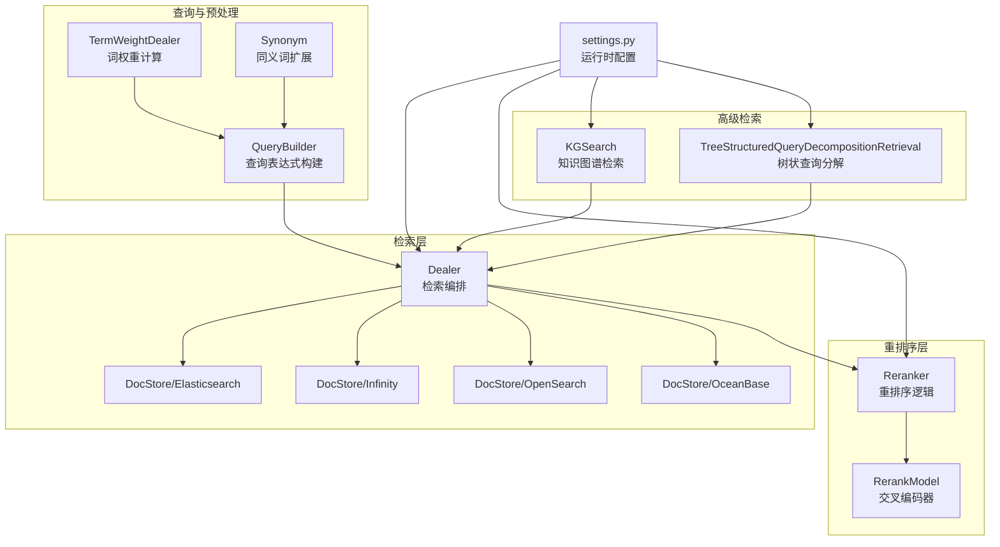
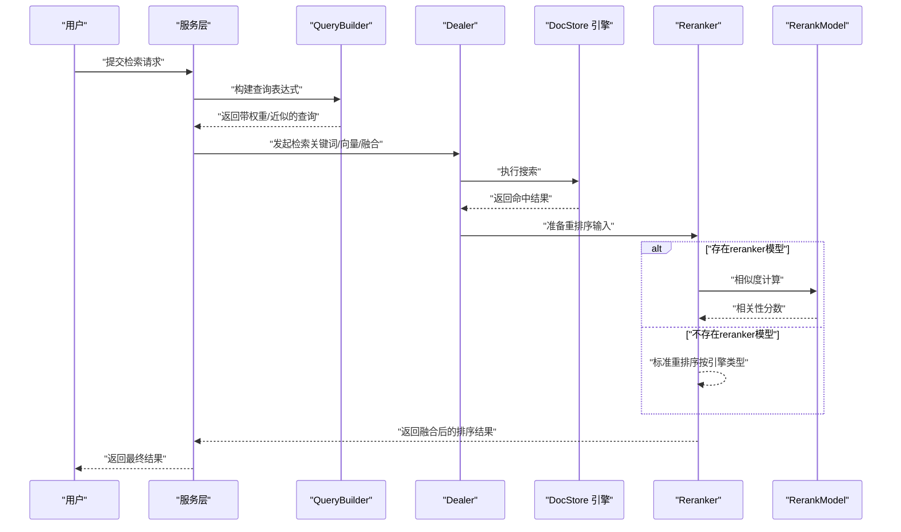
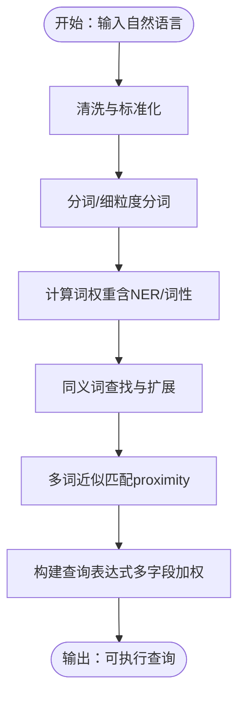
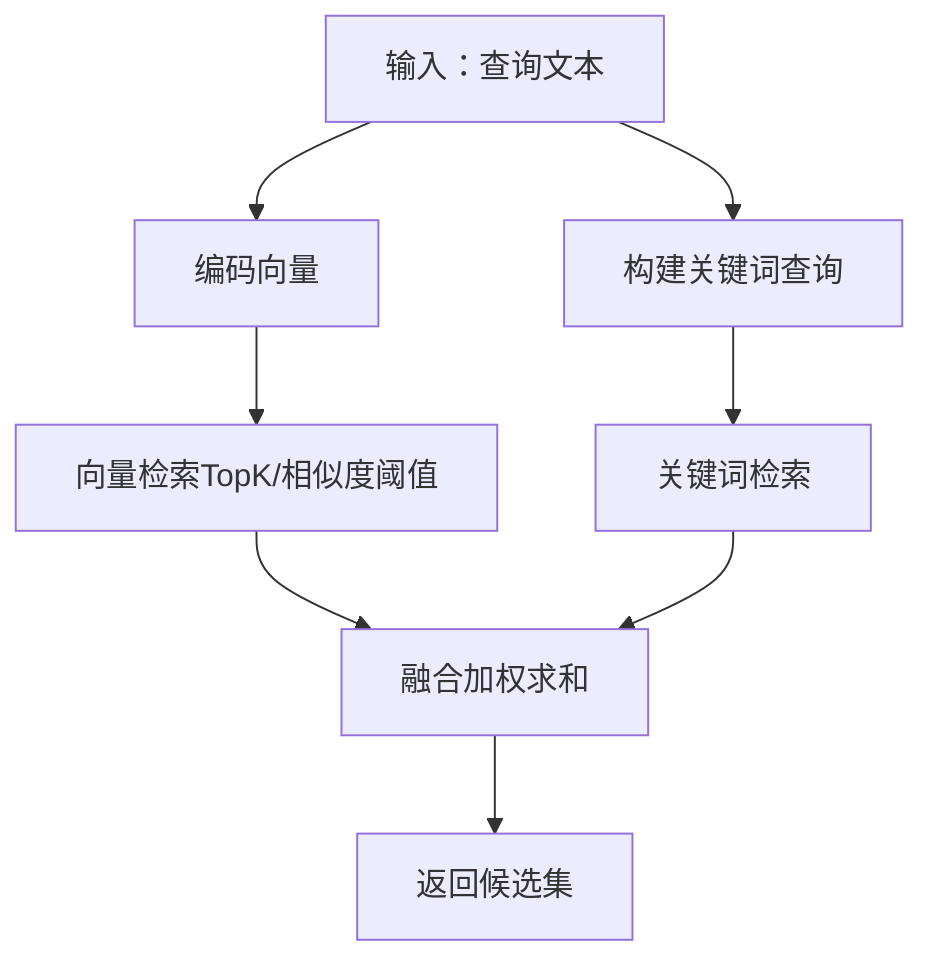
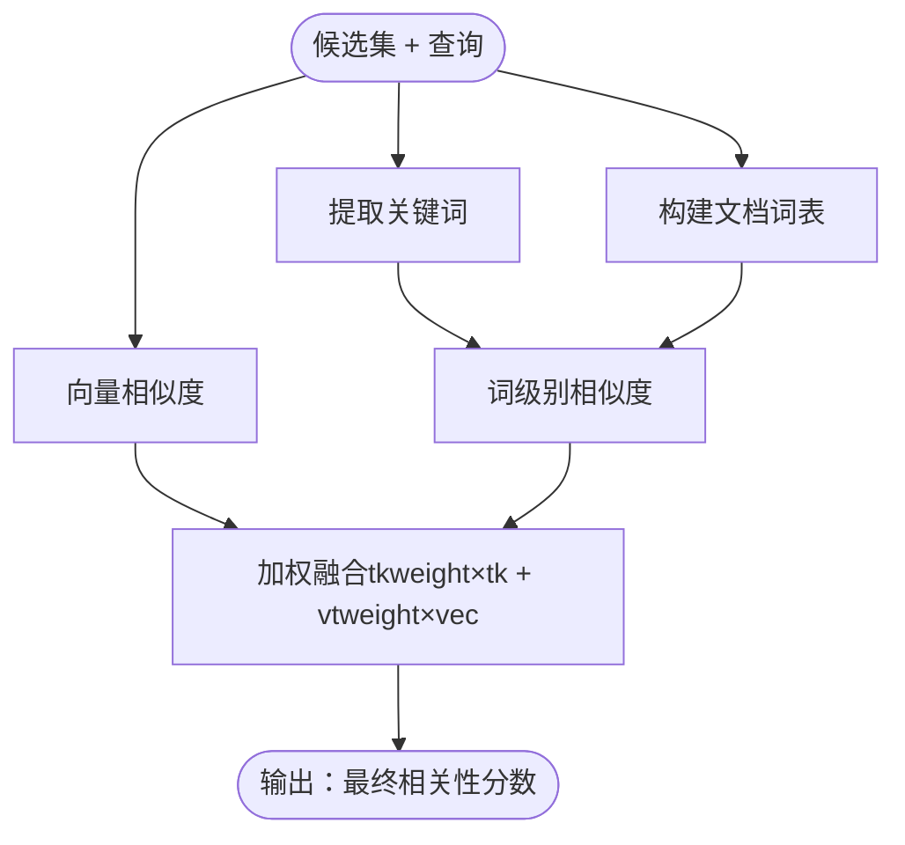
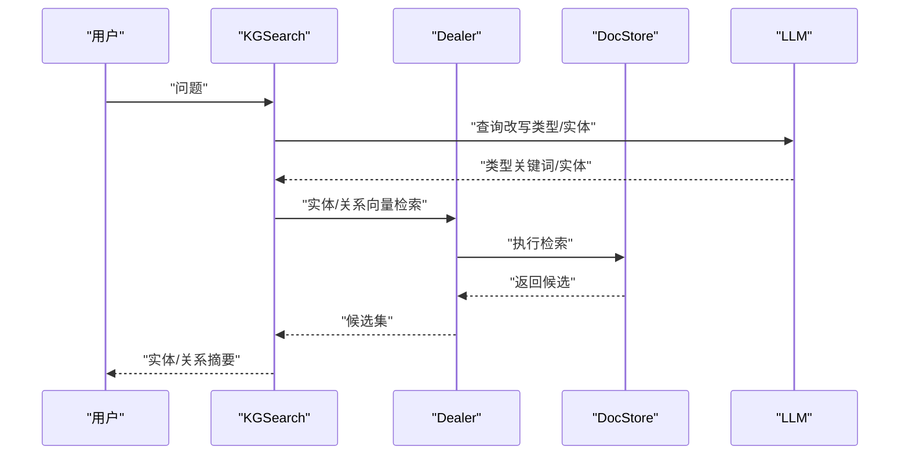
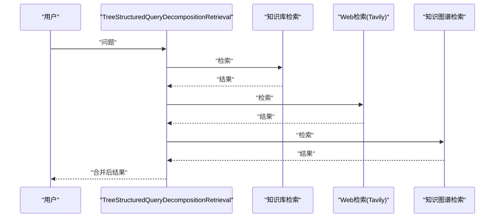
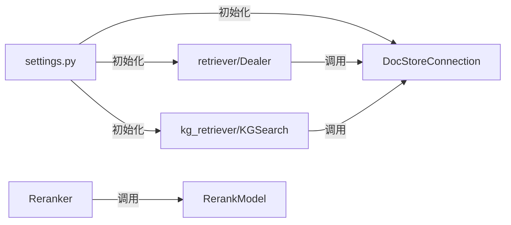

# 检索与重排序

<cite>
**本文引用的文件**
- [rag/nlp/search.py](file://rag/nlp/search.py)
- [rag/nlp/query.py](file://rag/nlp/query.py)
- [internal/service/nlp/query_builder.go](file://internal/service/nlp/query_builder.go)
- [internal/service/nlp/reranker.go](file://internal/service/nlp/reranker.go)
- [internal/service/nlp/term_weight.go](file://internal/service/nlp/term_weight.go)
- [rag/llm/rerank_model.py](file://rag/llm/rerank_model.py)
- [rag/graphrag/search.py](file://rag/graphrag/search.py)
- [rag/advanced_rag/tree_structured_query_decomposition_retrieval.py](file://rag/advanced_rag/tree_structured_query_decomposition_retrieval.py)
- [common/settings.py](file://common/settings.py)
- [conf/service_conf.yaml](file://conf/service_conf.yaml)
- [internal/engine/README.md](file://internal/engine/README.md)
- [api/apps/kb_app.py](file://api/apps/kb_app.py)
</cite>

## 目录
1. [简介](#简介)
2. [项目结构](#项目结构)
3. [核心组件](#核心组件)
4. [架构总览](#架构总览)
5. [详细组件分析](#详细组件分析)
6. [依赖分析](#依赖分析)
7. [性能考量](#性能考量)
8. [故障排查指南](#故障排查指南)
9. [结论](#结论)
10. [附录](#附录)

## 简介
本技术文档聚焦于检索与重排序系统，覆盖以下关键主题：
- 检索算法：向量检索、关键词检索、混合检索策略
- 查询处理：查询扩展、同义词处理、语义理解、查询优化
- 重排序模型：交叉编码器、重排序算法、相关性评分
- 高级检索：图谱检索、树状查询分解、层次化检索
- 检索配置与性能调优：不同场景下的参数建议与最佳实践

## 项目结构
检索与重排序系统由“查询解析与构建”、“向量与关键词检索”、“重排序与融合”、“高级检索（图谱/树结构）”四层组成，并通过统一的设置模块选择底层文档引擎（Elasticsearch/Infinity/OpenSearch/OceanBase）。

图表来源
- [common/settings.py:174-342](file://common/settings.py#L174-L342)
- [rag/nlp/search.py:36-171](file://rag/nlp/search.py#L36-L171)
- [internal/service/nlp/query_builder.go:40-81](file://internal/service/nlp/query_builder.go#L40-L81)
- [internal/service/nlp/reranker.go:40-87](file://internal/service/nlp/reranker.go#L40-L87)
- [rag/llm/rerank_model.py:28-552](file://rag/llm/rerank_model.py#L28-L552)
- [rag/graphrag/search.py:35-291](file://rag/graphrag/search.py#L35-L291)
- [rag/advanced_rag/tree_structured_query_decomposition_retrieval.py:26-127](file://rag/advanced_rag/tree_structured_query_decomposition_retrieval.py#L26-L127)

章节来源
- [common/settings.py:174-342](file://common/settings.py#L174-L342)
- [internal/engine/README.md:1-201](file://internal/engine/README.md#L1-L201)

## 核心组件
- 查询构建与权重：QueryBuilder 负责将自然语言转换为可执行的多字段查询表达式，结合 TermWeightDealer 的词权重与 Synonym 的同义词扩展，生成带权重与近似匹配的查询字符串。
- 检索编排：Dealer 统一协调关键词检索与向量检索，支持融合策略与阈值过滤，并在不同文档引擎间切换。
- 重排序：Reranker 在有/无 reranker 模型两种路径下分别进行，优先使用交叉编码器模型，否则回退到基于引擎类型的标准重排序。
- 重排序模型：RerankModel 提供多种厂商/本地交叉编码器适配，统一相似度接口并返回归一化的相关性分数。
- 高级检索：KGSearch 基于知识图谱实体/关系与 PageRank 进行检索；TreeStructuredQueryDecompositionRetrieval 支持多源信息检索与自适应深度的树状查询分解。

章节来源
- [internal/service/nlp/query_builder.go:40-81](file://internal/service/nlp/query_builder.go#L40-L81)
- [internal/service/nlp/term_weight.go:282-331](file://internal/service/nlp/term_weight.go#L282-L331)
- [rag/nlp/query.py:27-172](file://rag/nlp/query.py#L27-L172)
- [rag/nlp/search.py:36-171](file://rag/nlp/search.py#L36-L171)
- [internal/service/nlp/reranker.go:40-87](file://internal/service/nlp/reranker.go#L40-L87)
- [rag/llm/rerank_model.py:28-552](file://rag/llm/rerank_model.py#L28-L552)
- [rag/graphrag/search.py:35-291](file://rag/graphrag/search.py#L35-L291)
- [rag/advanced_rag/tree_structured_query_decomposition_retrieval.py:26-127](file://rag/advanced_rag/tree_structured_query_decomposition_retrieval.py#L26-L127)

## 架构总览
检索与重排序的整体流程如下：

图表来源
- [rag/nlp/search.py:364-520](file://rag/nlp/search.py#L364-L520)
- [internal/service/nlp/reranker.go:40-87](file://internal/service/nlp/reranker.go#L40-L87)
- [rag/llm/rerank_model.py:28-552](file://rag/llm/rerank_model.py#L28-L552)

## 详细组件分析

### 查询构建与扩展（QueryBuilder）
- 字段加权：标题、重要词、问题词等字段按权重拼装，提升关键字段的召回与排序权重。
- 同义词扩展：对每个词查找细粒度分词后的同义词集合，构造“或”组合，增强召回。
- 近似匹配：对多词片段添加短语近似（proximity）权重，提升语义连贯性。
- 词权重：TermWeightDealer 结合 NER 类型与词性标签，为不同词赋予不同权重，提高关键词检索质量。

图表来源
- [internal/service/nlp/query_builder.go:40-81](file://internal/service/nlp/query_builder.go#L40-L81)
- [internal/service/nlp/term_weight.go:282-331](file://internal/service/nlp/term_weight.go#L282-L331)
- [rag/nlp/query.py:41-172](file://rag/nlp/query.py#L41-L172)

章节来源
- [internal/service/nlp/query_builder.go:40-81](file://internal/service/nlp/query_builder.go#L40-L81)
- [internal/service/nlp/term_weight.go:282-331](file://internal/service/nlp/term_weight.go#L282-L331)
- [rag/nlp/query.py:27-172](file://rag/nlp/query.py#L27-L172)

### 检索策略（关键词/向量/混合）
- 关键词检索：使用 QueryBuilder 生成的表达式在多字段上进行匹配，支持最小匹配比例控制。
- 向量检索：对查询文本编码得到向量，按余弦相似度在向量列上检索，支持相似度阈值与 topk 控制。
- 混合检索：当同时具备关键词与向量时，使用加权求和的融合表达式，平衡关键词与向量得分。

图表来源
- [rag/nlp/search.py:52-133](file://rag/nlp/search.py#L52-L133)
- [rag/nlp/search.py:364-430](file://rag/nlp/search.py#L364-L430)

章节来源
- [rag/nlp/search.py:52-133](file://rag/nlp/search.py#L52-L133)
- [rag/nlp/search.py:364-430](file://rag/nlp/search.py#L364-L430)

### 重排序与相关性评分
- 模型重排序：当提供 reranker 模型时，先提取关键词与文档词表，再调用交叉编码器计算相关性分数，最后与词级别相似度线性融合。
- 标准重排序：在不使用 reranker 模型时，针对不同引擎采用不同的回退策略（如 Infinity 已在融合前归一化分数，Elasticsearch 需要额外归一化）。
- 词级别相似度：基于词权重字典计算相似度，作为向量相似度不足时的补充。

图表来源
- [internal/service/nlp/reranker.go:40-87](file://internal/service/nlp/reranker.go#L40-L87)
- [internal/service/nlp/reranker.go:255-294](file://internal/service/nlp/reranker.go#L255-L294)
- [rag/nlp/search.py:296-333](file://rag/nlp/search.py#L296-L333)
- [rag/nlp/search.py:335-356](file://rag/nlp/search.py#L335-L356)

章节来源
- [internal/service/nlp/reranker.go:40-87](file://internal/service/nlp/reranker.go#L40-L87)
- [internal/service/nlp/reranker.go:255-294](file://internal/service/nlp/reranker.go#L255-L294)
- [rag/nlp/search.py:296-356](file://rag/nlp/search.py#L296-L356)

### 高级检索：图谱检索与树状查询分解
- 图谱检索（KGSearch）：通过 LLM 对查询改写抽取实体与类型关键词，结合向量检索实体/关系，融合 PageRank 与相似度打分，返回实体与关系摘要。
- 树状查询分解（TreeStructuredQueryDecompositionRetrieval）：在知识库检索基础上，结合 Web（Tavily）与知识图谱检索，动态规划多步子查询，逐步完善信息充分性。

图表来源
- [rag/graphrag/search.py:142-291](file://rag/graphrag/search.py#L142-L291)

图表来源
- [rag/advanced_rag/tree_structured_query_decomposition_retrieval.py:39-127](file://rag/advanced_rag/tree_structured_query_decomposition_retrieval.py#L39-L127)

章节来源
- [rag/graphrag/search.py:142-291](file://rag/graphrag/search.py#L142-L291)
- [rag/advanced_rag/tree_structured_query_decomposition_retrieval.py:26-127](file://rag/advanced_rag/tree_structured_query_decomposition_retrieval.py#L26-L127)

## 依赖分析
- 文档引擎选择：通过环境变量与配置文件决定底层存储引擎（Elasticsearch/Infinity/OpenSearch/OceanBase），并在运行时初始化连接。
- 检索编排依赖：Dealer 依赖 DocStoreConnection 接口，具体实现由 settings 初始化。
- 重排序依赖：Reranker 可直接调用 RerankModel 的 similarity 接口，或在无模型时走标准回退路径。
- 高级检索依赖：KGSearch 与 TreeStructuredQueryDecompositionRetrieval 分别依赖 LLMBundle 与外部工具（Tavily）。

图表来源
- [common/settings.py:260-342](file://common/settings.py#L260-L342)
- [rag/nlp/search.py:36-171](file://rag/nlp/search.py#L36-L171)
- [rag/graphrag/search.py:35-141](file://rag/graphrag/search.py#L35-L141)

章节来源
- [common/settings.py:260-342](file://common/settings.py#L260-L342)
- [internal/engine/README.md:24-49](file://internal/engine/README.md#L24-L49)

## 性能考量
- 检索阶段
  - TopK 与相似度阈值：合理设置 topk 与 similarity_threshold，避免过多候选导致重排序开销过大。
  - 融合权重：vector_similarity_weight 控制向量与关键词的融合比例，建议在高语义场景提高向量权重。
  - 字段裁剪：仅返回必要字段，减少网络与序列化开销。
- 重排序阶段
  - 交叉编码器：在准确率优先场景启用 reranker 模型；注意 token 使用量与延迟，必要时批量处理。
  - 回退策略：在无 reranker 模型时，确保引擎类型分支正确（Infinity 已归一化，Elasticsearch 需额外处理）。
- 引擎选择
  - Elasticsearch：默认方案，功能完备；注意索引映射与查询 DSL 的优化。
  - Infinity/OpenSearch/OceanBase：通过配置切换，需关注各引擎的兼容性与性能特性。

章节来源
- [rag/nlp/search.py:364-520](file://rag/nlp/search.py#L364-L520)
- [internal/service/nlp/reranker.go:40-87](file://internal/service/nlp/reranker.go#L40-L87)
- [conf/service_conf.yaml:22-47](file://conf/service_conf.yaml#L22-L47)
- [internal/engine/README.md:24-49](file://internal/engine/README.md#L24-L49)

## 故障排查指南
- 向量维度不一致
  - 现象：新旧嵌入模型切换时报维度不匹配。
  - 处理：确保新旧模型输出维度一致，或重新注入向量。
  - 参考路径：[api/apps/kb_app.py:971-1012](file://api/apps/kb_app.py#L971-L1012)
- 重排序模型异常
  - 现象：reranker 模型调用失败或返回空分数。
  - 处理：检查模型工厂/密钥/URL 配置，确认返回值解析与归一化逻辑。
  - 参考路径：[rag/llm/rerank_model.py:28-552](file://rag/llm/rerank_model.py#L28-L552)
- 引擎切换问题
  - 现象：切换 DOC_ENGINE 后检索异常。
  - 处理：核对 conf/service_conf.yaml 中对应引擎配置，确认 settings 初始化是否成功。
  - 参考路径：[conf/service_conf.yaml:22-47](file://conf/service_conf.yaml#L22-L47)，[common/settings.py:260-286](file://common/settings.py#L260-L286)

章节来源
- [api/apps/kb_app.py:971-1012](file://api/apps/kb_app.py#L971-L1012)
- [rag/llm/rerank_model.py:28-552](file://rag/llm/rerank_model.py#L28-L552)
- [conf/service_conf.yaml:22-47](file://conf/service_conf.yaml#L22-L47)
- [common/settings.py:260-286](file://common/settings.py#L260-L286)

## 结论
本系统以 QueryBuilder 为核心入口，结合 Dealer 的多引擎检索与 Reranker 的交叉编码器重排序，形成从“关键词/向量”到“语义相关性”的完整链路。通过 KGSearch 与树状查询分解，进一步拓展到图谱与深度检索场景。在不同部署环境下，可通过 settings 与配置文件灵活切换底层引擎，并依据业务目标调整检索与重排序参数，以获得更佳的准确性与响应速度。

## 附录

### 检索配置示例与调优要点
- 文档引擎切换
  - 将环境变量 DOC_ENGINE 设置为 desired 引擎（如 infinity、opensearch、oceanbase），并在 conf/service_conf.yaml 中配置相应连接参数。
  - 参考路径：[conf/service_conf.yaml:22-47](file://conf/service_conf.yaml#L22-L47)，[internal/engine/README.md:24-49](file://internal/engine/README.md#L24-L49)
- 重排序参数
  - vector_similarity_weight：向量权重，越高越偏向语义相似。
  - similarity_threshold：相似度阈值，过滤低质量候选。
  - 参考路径：[rag/nlp/search.py:364-520](file://rag/nlp/search.py#L364-L520)
- 交叉编码器
  - 选择合适的 rerank_model 工厂与模型名，确保 API Key/URL 正确。
  - 参考路径：[rag/llm/rerank_model.py:28-552](file://rag/llm/rerank_model.py#L28-L552)