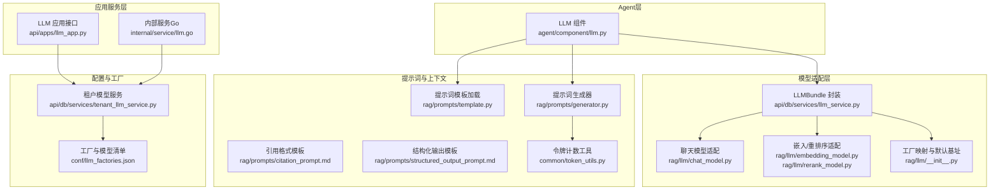
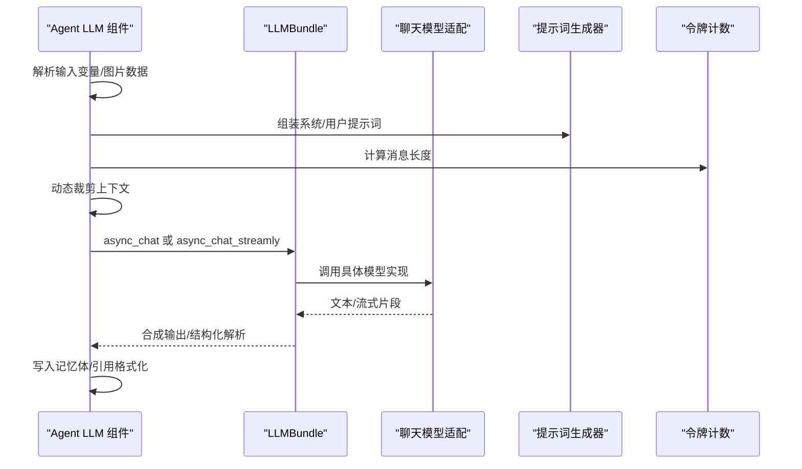
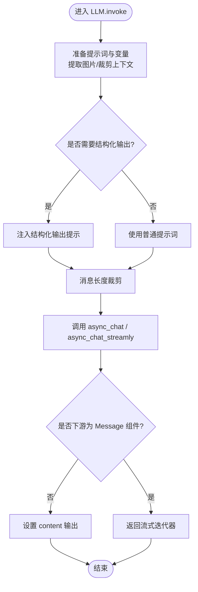
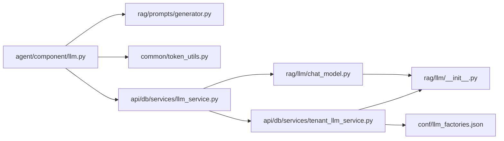

# 答案生成机制

<cite>
**本文引用的文件列表**
- [agent/component/llm.py](file://agent/component/llm.py)
- [api/apps/llm_app.py](file://api/apps/llm_app.py)
- [internal/service/llm.go](file://internal/service/llm.go)
- [rag/llm/chat_model.py](file://rag/llm/chat_model.py)
- [conf/llm_factories.json](file://conf/llm_factories.json)
- [rag/prompts/generator.py](file://rag/prompts/generator.py)
- [rag/prompts/template.py](file://rag/prompts/template.py)
- [common/token_utils.py](file://common/token_utils.py)
- [api/db/services/tenant_llm_service.py](file://api/db/services/tenant_llm_service.py)
- [rag/llm/__init__.py](file://rag/llm/__init__.py)
- [rag/prompts/citation_prompt.md](file://rag/prompts/citation_prompt.md)
- [rag/prompts/structured_output_prompt.md](file://rag/prompts/structured_output_prompt.md)
- [api/db/services/llm_service.py](file://api/db/services/llm_service.py)
- [rag/llm/embedding_model.py](file://rag/llm/embedding_model.py)
- [rag/llm/rerank_model.py](file://rag/llm/rerank_model.py)
</cite>

## 目录
1. [引言](#引言)
2. [项目结构](#项目结构)
3. [核心组件](#核心组件)
4. [架构总览](#架构总览)
5. [组件详解](#组件详解)
6. [依赖关系分析](#依赖关系分析)
7. [性能考量](#性能考量)
8. [故障排查指南](#故障排查指南)
9. [结论](#结论)
10. [附录：生成配置与最佳实践](#附录生成配置与最佳实践)

## 引言
本文件系统性阐述“答案生成机制”的技术实现，覆盖以下关键主题：
- 大模型集成：OpenAI API、本地大模型、多提供商切换与统一抽象
- 上下文管理：上下文窗口限制、动态上下文选择、上下文压缩与截断
- 提示词工程：模板设计、系统提示词优化、用户提示词处理
- 输出格式控制：结构化输出、引用格式、多模态输出
- 生成配置示例与性能优化：不同场景下的定制策略
- 质量提升与推理效率优化：最佳实践与排障建议

## 项目结构
从答案生成的角度，相关模块主要分布在如下层次：
- 业务组件层：Agent侧的LLM组件负责参数解析、变量注入、图像数据处理、流式输出与错误处理
- 应用服务层：REST API负责LLM工厂与密钥管理、可用模型列举、模型启用/删除
- 模型适配层：统一的LLMBundle封装不同厂商与本地模型，屏蔽差异
- 提示词与上下文工具：提示词模板加载、消息长度裁剪、知识库/记忆体拼接
- 基础设施：令牌计数、编码器缓存、工厂映射与默认基地址

图表来源
- [agent/component/llm.py:83-455](file://agent/component/llm.py#L83-L455)
- [api/apps/llm_app.py:1-472](file://api/apps/llm_app.py#L1-L472)
- [internal/service/llm.go:1-406](file://internal/service/llm.go#L1-L406)
- [api/db/services/llm_service.py:85-493](file://api/db/services/llm_service.py#L85-L493)
- [rag/llm/chat_model.py:1-800](file://rag/llm/chat_model.py#L1-L800)
- [rag/llm/embedding_model.py:1-800](file://rag/llm/embedding_model.py#L1-L800)
- [rag/llm/rerank_model.py:1-552](file://rag/llm/rerank_model.py#L1-L552)
- [rag/llm/__init__.py:1-192](file://rag/llm/__init__.py#L1-L192)
- [rag/prompts/template.py:1-20](file://rag/prompts/template.py#L1-L20)
- [rag/prompts/generator.py:1-800](file://rag/prompts/generator.py#L1-L800)
- [rag/prompts/citation_prompt.md:1-123](file://rag/prompts/citation_prompt.md#L1-L123)
- [rag/prompts/structured_output_prompt.md:1-16](file://rag/prompts/structured_output_prompt.md#L1-L16)
- [common/token_utils.py:1-88](file://common/token_utils.py#L1-L88)
- [conf/llm_factories.json:1-800](file://conf/llm_factories.json#L1-L800)
- [api/db/services/tenant_llm_service.py:1-418](file://api/db/services/tenant_llm_service.py#L1-L418)

章节来源
- [agent/component/llm.py:83-455](file://agent/component/llm.py#L83-L455)
- [api/apps/llm_app.py:1-472](file://api/apps/llm_app.py#L1-L472)
- [internal/service/llm.go:1-406](file://internal/service/llm.go#L1-L406)
- [api/db/services/llm_service.py:85-493](file://api/db/services/llm_service.py#L85-L493)
- [rag/llm/chat_model.py:1-800](file://rag/llm/chat_model.py#L1-L800)
- [rag/llm/embedding_model.py:1-800](file://rag/llm/embedding_model.py#L1-L800)
- [rag/llm/rerank_model.py:1-552](file://rag/llm/rerank_model.py#L1-L552)
- [rag/llm/__init__.py:1-192](file://rag/llm/__init__.py#L1-L192)
- [rag/prompts/template.py:1-20](file://rag/prompts/template.py#L1-L20)
- [rag/prompts/generator.py:1-800](file://rag/prompts/generator.py#L1-L800)
- [rag/prompts/citation_prompt.md:1-123](file://rag/prompts/citation_prompt.md#L1-L123)
- [rag/prompts/structured_output_prompt.md:1-16](file://rag/prompts/structured_output_prompt.md#L1-L16)
- [common/token_utils.py:1-88](file://common/token_utils.py#L1-L88)
- [conf/llm_factories.json:1-800](file://conf/llm_factories.json#L1-L800)
- [api/db/services/tenant_llm_service.py:1-418](file://api/db/services/tenant_llm_service.py#L1-L418)

## 核心组件
- Agent LLM 组件：负责参数校验、输入变量提取与注入、系统提示词与用户提示词组装、图片数据提取与去重、上下文裁剪、结构化输出提示注入、流式输出与错误处理、工具调用总结写入记忆体
- LLMBundle：面向租户的统一模型封装，支持聊天、嵌入、重排序、图像转文本、语音转文字、TTS、OCR等；内置Langfuse追踪、令牌用量统计、异步/流式接口桥接
- 聊天模型适配：统一OpenAI风格客户端，支持工具调用、流式增量返回、错误分类与指数退避重试、不同厂商参数清洗与兼容
- 提示词与上下文：模板加载、消息长度裁剪、知识库/记忆体拼接、引用格式化、结构化输出约束注入
- 工厂与模型清单：集中定义各厂商模型能力、最大上下文、是否支持工具调用、默认基地址映射

章节来源
- [agent/component/llm.py:34-455](file://agent/component/llm.py#L34-L455)
- [api/db/services/llm_service.py:85-493](file://api/db/services/llm_service.py#L85-L493)
- [rag/llm/chat_model.py:115-800](file://rag/llm/chat_model.py#L115-L800)
- [rag/prompts/generator.py:66-180](file://rag/prompts/generator.py#L66-L180)
- [rag/llm/__init__.py:25-192](file://rag/llm/__init__.py#L25-L192)

## 架构总览
答案生成从Agent组件开始，经由LLMBundle路由到具体模型实现，结合提示词模板与上下文裁剪，最终产出文本或结构化结果，并可选进行流式输出与工具调用。

图表来源
- [agent/component/llm.py:227-455](file://agent/component/llm.py#L227-L455)
- [api/db/services/llm_service.py:369-492](file://api/db/services/llm_service.py#L369-L492)
- [rag/llm/chat_model.py:192-594](file://rag/llm/chat_model.py#L192-L594)
- [rag/prompts/generator.py:66-180](file://rag/prompts/generator.py#L66-L180)
- [common/token_utils.py:29-88](file://common/token_utils.py#L29-L88)

## 组件详解

### LLM 组件（Agent 层）
- 参数与配置
  - 支持温度、top_p、最大生成长度、惩罚项等参数按模型能力动态下发
  - 支持结构化输出Schema注入，自动追加结构化输出提示
  - 支持引用格式注入，结合检索结果自动生成引用
- 输入处理
  - 自动提取并去重data:image开头的图片数据，必要时切换到图像识别模型类型
  - 从画布历史中按窗口大小裁剪消息，保留系统提示词与最后一条用户消息
- 生成流程
  - 非流式：一次性生成完整回答
  - 流式：增量返回，过滤<think>标记，支持取消与异常兜底
  - 结构化输出：多次尝试，失败后提示修复
- 工具调用与记忆体
  - 通过工具调用摘要写入记忆体，便于后续反思与排序

图表来源
- [agent/component/llm.py:227-455](file://agent/component/llm.py#L227-L455)
- [rag/prompts/generator.py:453-456](file://rag/prompts/generator.py#L453-L456)

章节来源
- [agent/component/llm.py:34-455](file://agent/component/llm.py#L34-L455)
- [rag/prompts/generator.py:453-456](file://rag/prompts/generator.py#L453-L456)

### LLMBundle（统一模型封装）
- 角色定位：面向租户的统一入口，屏蔽不同模型实现差异
- 能力范围：聊天、嵌入、重排序、图像转文本、语音转文字、TTS、OCR
- 关键特性
  - Langfuse追踪：生成trace与usage统计
  - 令牌用量：根据响应统计更新租户模型使用量
  - 异步桥接：同步/异步互转，保证在不同运行环境可用
  - 工具绑定：当模型支持时，绑定工具调用会话

章节来源
- [api/db/services/llm_service.py:85-493](file://api/db/services/llm_service.py#L85-L493)

### 聊天模型适配（多提供商/本地）
- 统一基类：清理生成参数、错误分类与重试、流式增量返回、长度截断提示
- 多提供商适配：OpenAI、Azure-OpenAI、Tongyi-Qianwen、ZHIPU-AI、Ollama、Gemini、Bedrock、NVIDIA、TogetherAI、SILICONFLOW等
- 本地模型：LocalAI、HuggingFace、Xinference、GPUStack、LM-Studio等
- 工具调用：支持函数调用与流式工具调用，自动拼接历史消息

章节来源
- [rag/llm/chat_model.py:115-800](file://rag/llm/chat_model.py#L115-L800)
- [rag/llm/__init__.py:25-192](file://rag/llm/__init__.py#L25-L192)

### 提示词工程与上下文管理
- 模板加载：统一从prompts目录加载模板，避免硬编码
- 上下文裁剪：message_fit_in按最大长度裁剪，优先保留系统提示词与最后一条用户消息
- 知识库/记忆体拼接：按最大令牌预算拼接，不足时告警
- 引用格式：严格遵循引用规范，仅对事实性内容标注引用
- 结构化输出：注入JSON Schema约束，增强解析稳定性

章节来源
- [rag/prompts/template.py:1-20](file://rag/prompts/template.py#L1-L20)
- [rag/prompts/generator.py:66-180](file://rag/prompts/generator.py#L66-L180)
- [rag/prompts/citation_prompt.md:1-123](file://rag/prompts/citation_prompt.md#L1-L123)
- [rag/prompts/structured_output_prompt.md:1-16](file://rag/prompts/structured_output_prompt.md#L1-L16)
- [common/token_utils.py:29-88](file://common/token_utils.py#L29-L88)

### LLM 工厂与模型清单
- 工厂映射：定义各厂商默认基地址、前缀、支持能力
- 模型清单：集中维护模型名称、最大上下文、是否支持工具调用、标签等
- 租户模型服务：按租户维度查询/保存/启用模型，支持从环境变量注入OCR等模型

章节来源
- [rag/llm/__init__.py:64-130](file://rag/llm/__init__.py#L64-L130)
- [conf/llm_factories.json:1-800](file://conf/llm_factories.json#L1-L800)
- [api/db/services/tenant_llm_service.py:34-188](file://api/db/services/tenant_llm_service.py#L34-L188)

### 应用接口与模型管理
- 工厂与密钥：列出可用工厂、设置/验证API Key、添加/删除/启用模型
- 可用模型：按租户聚合展示，区分本地部署与外部服务
- Go内部服务：提供更细粒度的模型列表与状态管理

章节来源
- [api/apps/llm_app.py:32-472](file://api/apps/llm_app.py#L32-L472)
- [internal/service/llm.go:164-274](file://internal/service/llm.go#L164-L274)

## 依赖关系分析
- 组件耦合
  - Agent LLM 组件依赖提示词生成器与令牌计数工具，间接依赖工厂与模型清单
  - LLMBundle 依赖租户模型服务与具体模型适配实现
  - 聊天模型适配依赖工厂映射与默认基地址
- 外部依赖
  - OpenAI、Azure-OpenAI、DashScope、Gemini、Bedrock、NVIDIA、TogetherAI、SILICONFLOW等
  - 本地推理：Ollama、LocalAI、Xinference、GPUStack、LM-Studio
- 循环依赖
  - 未发现直接循环依赖；提示词模板与生成器相互配合但无循环导入

图表来源
- [agent/component/llm.py:31-32](file://agent/component/llm.py#L31-L32)
- [rag/prompts/generator.py:1-30](file://rag/prompts/generator.py#L1-L30)
- [common/token_utils.py:18-27](file://common/token_utils.py#L18-L27)
- [api/db/services/llm_service.py:85-120](file://api/db/services/llm_service.py#L85-L120)
- [rag/llm/chat_model.py:1-40](file://rag/llm/chat_model.py#L1-L40)
- [rag/llm/__init__.py:141-192](file://rag/llm/__init__.py#L141-L192)
- [api/db/services/tenant_llm_service.py:94-138](file://api/db/services/tenant_llm_service.py#L94-L138)
- [conf/llm_factories.json:1-800](file://conf/llm_factories.json#L1-L800)

章节来源
- [agent/component/llm.py:31-32](file://agent/component/llm.py#L31-L32)
- [rag/prompts/generator.py:1-30](file://rag/prompts/generator.py#L1-L30)
- [common/token_utils.py:18-27](file://common/token_utils.py#L18-L27)
- [api/db/services/llm_service.py:85-120](file://api/db/services/llm_service.py#L85-L120)
- [rag/llm/chat_model.py:1-40](file://rag/llm/chat_model.py#L1-L40)
- [rag/llm/__init__.py:141-192](file://rag/llm/__init__.py#L141-L192)
- [api/db/services/tenant_llm_service.py:94-138](file://api/db/services/tenant_llm_service.py#L94-L138)
- [conf/llm_factories.json:1-800](file://conf/llm_factories.json#L1-L800)

## 性能考量
- 上下文长度控制
  - 使用message_fit_in按最大长度裁剪，优先保留系统提示词与最后一条用户消息
  - 对于长上下文，建议分段生成或采用分层检索策略
- 令牌计数与预算
  - 统一使用tiktoken编码器计算令牌数，避免超限
  - 在嵌入/重排序等场景，尽量批量请求以降低往返开销
- 流式输出
  - 优先使用流式接口，尽早感知错误并减少等待时间
  - 过滤<think>标记，避免前端渲染干扰
- 错误与重试
  - 对速率限制、服务器错误等可重试错误进行指数退避重试
  - 结构化输出失败时，提示修复并回退到普通JSON输出
- 工具调用
  - 工具调用会增加上下文与令牌消耗，建议在必要时开启并合理控制轮次上限

章节来源
- [rag/prompts/generator.py:66-101](file://rag/prompts/generator.py#L66-L101)
- [common/token_utils.py:29-88](file://common/token_utils.py#L29-L88)
- [rag/llm/chat_model.py:192-298](file://rag/llm/chat_model.py#L192-L298)
- [api/db/services/llm_service.py:369-492](file://api/db/services/llm_service.py#L369-L492)

## 故障排查指南
- 常见错误分类
  - 认证失败、配额不足、速率限制、连接超时、模型不可用、内容安全拦截
- 排查步骤
  - 检查API Key与工厂基地址配置
  - 核对模型最大上下文与当前消息长度
  - 查看流式输出中的错误片段与令牌统计
  - 对结构化输出问题，检查Schema与LLM返回的JSON修复日志
- 日志与追踪
  - 启用Langfuse追踪，查看trace与usage详情
  - 关注组件级取消信号与异常默认值设置

章节来源
- [rag/llm/chat_model.py:132-298](file://rag/llm/chat_model.py#L132-L298)
- [api/db/services/llm_service.py:377-401](file://api/db/services/llm_service.py#L377-L401)

## 结论
该答案生成机制通过Agent组件、LLMBundle与多提供商适配层形成清晰的分层架构，结合统一的提示词模板与上下文裁剪策略，实现了跨模型、跨场景的稳定生成。通过流式输出、结构化约束与工具调用，进一步提升了交互体验与任务完成度。建议在生产环境中结合令牌预算、错误重试与Langfuse追踪，持续优化生成质量与推理效率。

## 附录：生成配置与最佳实践

### 生成配置示例
- 温度与采样
  - 低温度适合确定性任务；高温度适合创意类任务
- 最大生成长度
  - 根据模型最大上下文动态设置，预留系统提示词与引用空间
- 结构化输出
  - 明确JSON Schema，必要时允许LLM进行自我修正
- 引用格式
  - 严格遵循引用规范，仅对事实性内容标注引用

章节来源
- [agent/component/llm.py:62-81](file://agent/component/llm.py#L62-L81)
- [rag/prompts/structured_output_prompt.md:1-16](file://rag/prompts/structured_output_prompt.md#L1-L16)
- [rag/prompts/citation_prompt.md:1-123](file://rag/prompts/citation_prompt.md#L1-L123)

### 不同场景的定制策略
- RAG问答
  - 启用引用格式注入，结合知识库拼接与上下文裁剪
  - 适当提高温度以增强检索多样性
- 结构化抽取
  - 明确Schema，开启结构化输出并进行失败回退
- 多模态回答
  - 自动提取data:image数据，必要时切换图像识别模型类型
- 工具驱动任务
  - 绑定工具调用会话，限制最大轮次，定期写入记忆体摘要

章节来源
- [agent/component/llm.py:227-254](file://agent/component/llm.py#L227-L254)
- [api/db/services/llm_service.py:89-94](file://api/db/services/llm_service.py#L89-L94)

### 质量提升与推理效率优化最佳实践
- 质量提升
  - 使用明确的系统提示词与示例
  - 对关键事实进行引用标注，增强可信度
  - 对结构化输出进行二次校验与修复
- 推理效率
  - 批量嵌入与重排序，减少网络往返
  - 使用流式接口尽早感知错误
  - 控制工具调用轮次与上下文长度

章节来源
- [rag/prompts/generator.py:188-196](file://rag/prompts/generator.py#L188-L196)
- [rag/llm/embedding_model.py:99-122](file://rag/llm/embedding_model.py#L99-L122)
- [rag/llm/rerank_model.py:64-75](file://rag/llm/rerank_model.py#L64-L75)
- [rag/llm/chat_model.py:230-251](file://rag/llm/chat_model.py#L230-L251)