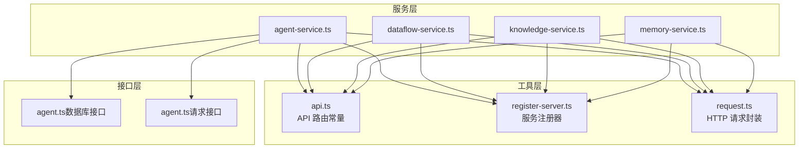
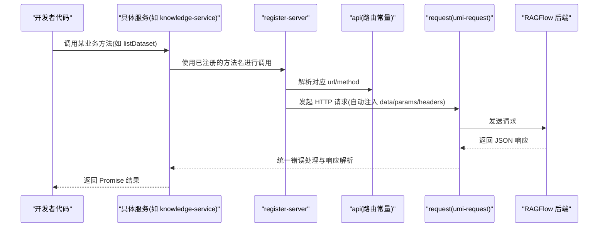
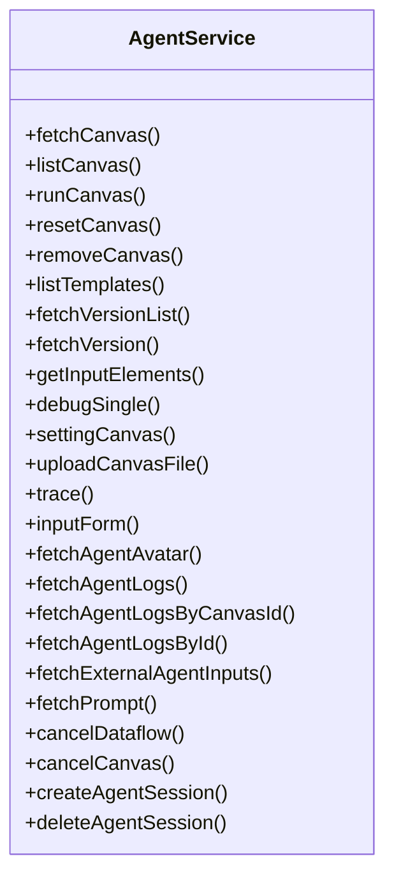
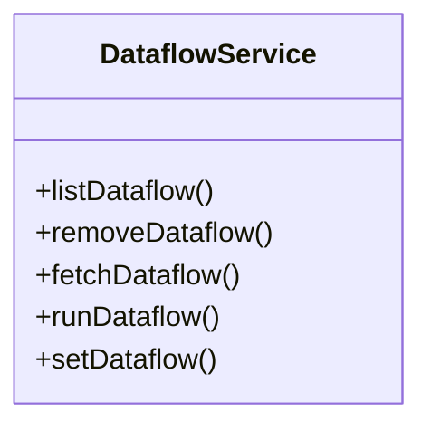
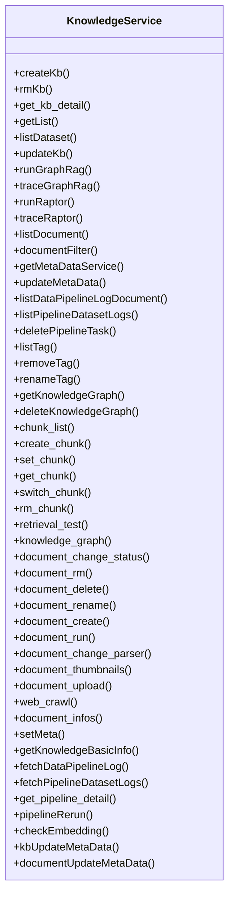
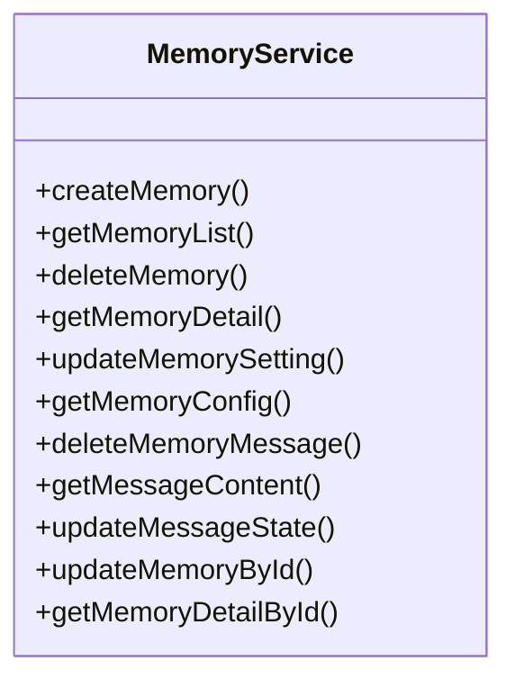
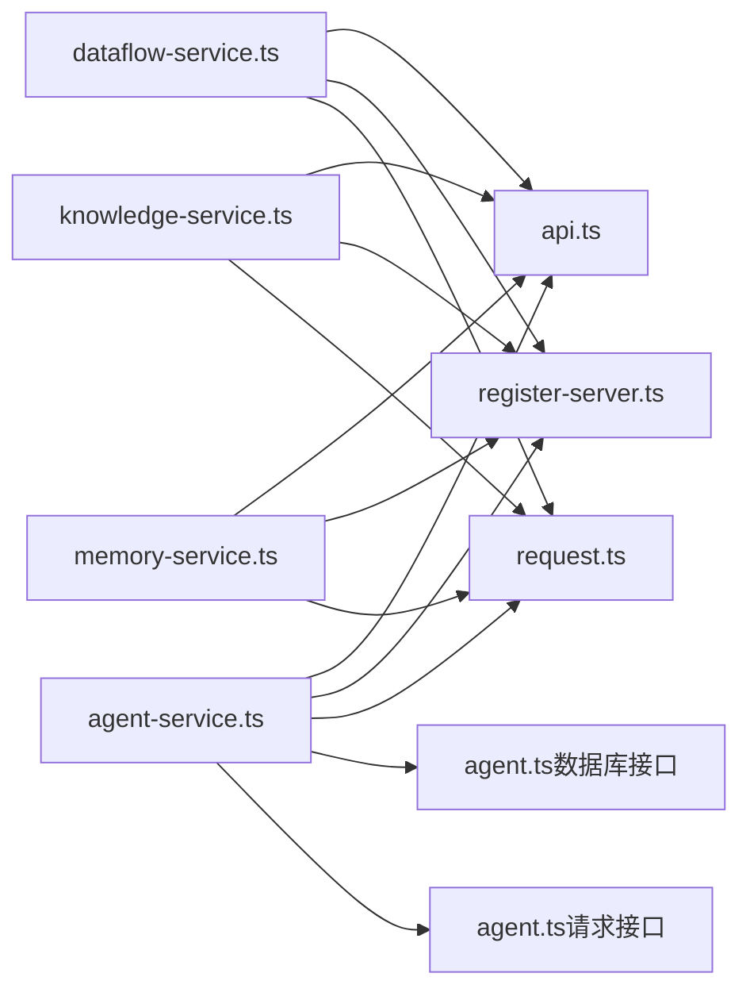

# JavaScript SDK使用指南

<cite>
**本文引用的文件**
- [agent-service.ts](file://web/src/services/agent-service.ts)
- [dataflow-service.ts](file://web/src/services/dataflow-service.ts)
- [knowledge-service.ts](file://web/src/services/knowledge-service.ts)
- [memory-service.ts](file://web/src/services/memory-service.ts)
- [api.ts](file://web/src/utils/api.ts)
- [register-server.ts](file://web/src/utils/register-server.ts)
- [request.ts](file://web/src/utils/request.ts)
- [agent.ts（数据库接口）](file://web/src/interfaces/database/agent.ts)
- [agent.ts（请求接口）](file://web/src/interfaces/request/agent.ts)
- [package.json](file://web/package.json)
</cite>

## 目录
1. [简介](#简介)
2. [项目结构](#项目结构)
3. [核心组件](#核心组件)
4. [架构总览](#架构总览)
5. [详细组件分析](#详细组件分析)
6. [依赖关系分析](#依赖关系分析)
7. [性能与并发特性](#性能与并发特性)
8. [故障排查指南](#故障排查指南)
9. [结论](#结论)
10. [附录：安装与集成示例](#附录安装与集成示例)

## 简介
本指南面向希望在前端（React/Vite）项目中集成 RAGFlow JavaScript SDK 的开发者，覆盖以下主题：
- SDK 安装与配置（npm 包、CDN 引入、模块导入）
- 前端服务层设计与职责划分（agent-service、dataflow-service、knowledge-service、memory-service）
- 代理系统、数据集管理、知识库检索、记忆体管理等核心能力的使用方法
- 异步处理、Promise 链式调用、错误处理策略、状态管理最佳实践
- WebSocket 实时通信、文件上传下载、组件状态同步等高级功能
- TypeScript 类型定义与 IDE 智能提示配置

## 项目结构
RAGFlow 前端采用 Vite + React + TypeScript 技术栈，SDK 核心位于 web/src 下，按“服务层 + 工具层 + 接口层”组织：
- 服务层：各业务域的 Service 封装（如 agent-service、knowledge-service、memory-service、dataflow-service）
- 工具层：统一的 API 路由常量、请求封装、服务注册器
- 接口层：数据库模型与请求参数的 TypeScript 定义

图表来源
- [agent-service.ts:1-171](file://web/src/services/agent-service.ts#L1-L171)
- [dataflow-service.ts:1-38](file://web/src/services/dataflow-service.ts#L1-L38)
- [knowledge-service.ts:1-291](file://web/src/services/knowledge-service.ts#L1-L291)
- [memory-service.ts:1-43](file://web/src/services/memory-service.ts#L1-L43)
- [api.ts:1-337](file://web/src/utils/api.ts#L1-L337)
- [register-server.ts:1-82](file://web/src/utils/register-server.ts#L1-L82)
- [request.ts:1-190](file://web/src/utils/request.ts#L1-L190)
- [agent.ts（数据库接口）:1-314](file://web/src/interfaces/database/agent.ts#L1-L314)
- [agent.ts（请求接口）:1-10](file://web/src/interfaces/request/agent.ts#L1-L10)

章节来源
- [agent-service.ts:1-171](file://web/src/services/agent-service.ts#L1-L171)
- [dataflow-service.ts:1-38](file://web/src/services/dataflow-service.ts#L1-L38)
- [knowledge-service.ts:1-291](file://web/src/services/knowledge-service.ts#L1-L291)
- [memory-service.ts:1-43](file://web/src/services/memory-service.ts#L1-L43)
- [api.ts:1-337](file://web/src/utils/api.ts#L1-L337)
- [register-server.ts:1-82](file://web/src/utils/register-server.ts#L1-L82)
- [request.ts:1-190](file://web/src/utils/request.ts#L1-L190)
- [agent.ts（数据库接口）:1-314](file://web/src/interfaces/database/agent.ts#L1-L314)
- [agent.ts（请求接口）:1-10](file://web/src/interfaces/request/agent.ts#L1-L10)

## 核心组件
- 代理服务（agent-service）：负责画布（Canvas）、模板、日志、追踪、Webhook、外部输入等代理相关能力。
- 数据流服务（dataflow-service）：负责数据流的列表、运行、保存、删除等。
- 知识服务（knowledge-service）：负责知识库（数据集）的增删改查、文档管理、分块管理、检索测试、图谱、元数据、流水线日志等。
- 记忆服务（memory-service）：负责记忆体的创建、列表、详情、配置、消息内容与状态更新等。

章节来源
- [agent-service.ts:1-171](file://web/src/services/agent-service.ts#L1-L171)
- [dataflow-service.ts:1-38](file://web/src/services/dataflow-service.ts#L1-L38)
- [knowledge-service.ts:1-291](file://web/src/services/knowledge-service.ts#L1-L291)
- [memory-service.ts:1-43](file://web/src/services/memory-service.ts#L1-L43)

## 架构总览
SDK 通过“路由常量 + 服务注册器 + 请求封装”的三层架构实现：
- 路由常量层：集中维护所有后端 API 的路径与占位符
- 服务注册器层：将“方法名 -> {url, method}”映射转换为可调用的函数
- 请求封装层：统一拦截器、鉴权头、错误处理、租户参数注入、响应解析

图表来源
- [knowledge-service.ts:228-232](file://web/src/services/knowledge-service.ts#L228-L232)
- [register-server.ts:15-43](file://web/src/utils/register-server.ts#L15-L43)
- [api.ts:60-64](file://web/src/utils/api.ts#L60-L64)
- [request.ts:77-175](file://web/src/utils/request.ts#L77-L175)

章节来源
- [api.ts:1-337](file://web/src/utils/api.ts#L1-L337)
- [register-server.ts:1-82](file://web/src/utils/register-server.ts#L1-L82)
- [request.ts:1-190](file://web/src/utils/request.ts#L1-L190)

## 详细组件分析

### 代理服务（agent-service）
职责与能力
- 画布生命周期：获取、列表、重置、删除、运行、设置
- 模板与版本：列出模板、获取版本列表/指定版本
- 输入与调试：获取输入元素、单步调试、设置画布
- 日志与追踪：获取代理日志、按会话查询、Webhook 追踪
- 外部集成：外部代理输入、取消数据流/画布任务

图表来源
- [agent-service.ts:36-133](file://web/src/services/agent-service.ts#L36-L133)
- [agent-service.ts:137-168](file://web/src/services/agent-service.ts#L137-L168)

章节来源
- [agent-service.ts:1-171](file://web/src/services/agent-service.ts#L1-L171)
- [agent.ts（数据库接口）:249-290](file://web/src/interfaces/database/agent.ts#L249-L290)
- [agent.ts（请求接口）:1-10](file://web/src/interfaces/request/agent.ts#L1-L10)

### 数据流服务（dataflow-service）
职责与能力
- 列表、删除、获取详情、运行、保存数据流

图表来源
- [dataflow-service.ts:12-33](file://web/src/services/dataflow-service.ts#L12-L33)

章节来源
- [dataflow-service.ts:1-38](file://web/src/services/dataflow-service.ts#L1-L38)

### 知识服务（knowledge-service）
职责与能力
- 知识库（数据集）：创建、删除、详情、列表、更新元数据
- 文档管理：列表、状态变更、删除、重命名、创建、运行、解析、缩略图、上传、爬虫、信息、元数据设置/获取、过滤
- 分块管理：列表、创建、设置、获取、切换、删除、检索测试、知识图谱
- 图谱与检索：知识图谱、检索测试分享、基础信息、流水线日志、重新运行、嵌入检查
- 元数据：批量获取、更新、设置知识库与文档元数据
- 流水线：获取详情、重新运行、解绑任务

图表来源
- [knowledge-service.ts:48-205](file://web/src/services/knowledge-service.ts#L48-L205)
- [knowledge-service.ts:209-290](file://web/src/services/knowledge-service.ts#L209-L290)

章节来源
- [knowledge-service.ts:1-291](file://web/src/services/knowledge-service.ts#L1-L291)

### 记忆服务（memory-service）
职责与能力
- 创建、列表、删除、详情、配置、删除消息、获取消息内容、更新消息状态
- 提供便捷方法：按 ID 更新记忆体设置、按 ID 获取记忆体详情

图表来源
- [memory-service.ts:17-35](file://web/src/services/memory-service.ts#L17-L35)
- [memory-service.ts:36-41](file://web/src/services/memory-service.ts#L36-L41)

章节来源
- [memory-service.ts:1-43](file://web/src/services/memory-service.ts#L1-L43)

### WebSocket 实时通信
- 代理画布 SSE：通过 API 路由常量中的画布 SSE 地址建立连接，用于接收实时事件流
- 对话 SSE：聊天对话也支持 SSE 流式输出
- 使用建议：在组件挂载时建立连接，在卸载时断开；对事件进行去抖与合并渲染

章节来源
- [api.ts:137-138](file://web/src/utils/api.ts#L137-L138)
- [api.ts:187-188](file://web/src/utils/api.ts#L187-L188)

### 文件上传与下载
- 上传：文档上传、画布文件上传、文件管理上传
- 下载：文档文件下载、画布文件下载
- 建议：结合进度条、断点续传、多文件队列、错误重试与取消

章节来源
- [api.ts:120-122](file://web/src/utils/api.ts#L120-L122)
- [api.ts:198-200](file://web/src/utils/api.ts#L198-L200)
- [api.ts:164-171](file://web/src/utils/api.ts#L164-L171)

### 异步处理与错误处理
- Promise 链式调用：服务方法返回 Promise，可在调用处使用 .then/.catch 或 async/await
- 错误处理：统一拦截器中处理网络异常、HTTP 状态码、业务 code，必要时触发登录跳转
- 401 特殊处理：重复 401 不重复跳转，清理本地授权信息并引导登录
- 响应解析：非 Blob 类型统一解析 JSON 并根据 code 决定 UI 提示或抛错

章节来源
- [request.ts:53-75](file://web/src/utils/request.ts#L53-L75)
- [request.ts:110-175](file://web/src/utils/request.ts#L110-L175)

### 状态管理与组件同步
- 建议：结合 React Query 或 Zustand 管理远端状态，避免重复请求与竞态
- 组件同步：通过 SSE 事件驱动局部刷新，或在 mutation 成功后主动 invalidates 查询缓存

## 依赖关系分析
- 服务层依赖工具层：所有服务均依赖 api 路由常量与 register-server 注册器
- 工具层依赖：register-server 依赖 request；request 依赖 umi-request、拦截器与鉴权工具
- 类型依赖：代理服务接口依赖数据库与请求接口定义

图表来源
- [agent-service.ts:1-10](file://web/src/services/agent-service.ts#L1-L10)
- [dataflow-service.ts:1-2](file://web/src/services/dataflow-service.ts#L1-L2)
- [knowledge-service.ts:1-9](file://web/src/services/knowledge-service.ts#L1-L9)
- [memory-service.ts:1-3](file://web/src/services/memory-service.ts#L1-L3)
- [api.ts:1-337](file://web/src/utils/api.ts#L1-L337)
- [register-server.ts:1-82](file://web/src/utils/register-server.ts#L1-L82)
- [request.ts:1-190](file://web/src/utils/request.ts#L1-L190)
- [agent.ts（数据库接口）:1-314](file://web/src/interfaces/database/agent.ts#L1-L314)
- [agent.ts（请求接口）:1-10](file://web/src/interfaces/request/agent.ts#L1-L10)

章节来源
- [agent-service.ts:1-171](file://web/src/services/agent-service.ts#L1-L171)
- [dataflow-service.ts:1-38](file://web/src/services/dataflow-service.ts#L1-L38)
- [knowledge-service.ts:1-291](file://web/src/services/knowledge-service.ts#L1-L291)
- [memory-service.ts:1-43](file://web/src/services/memory-service.ts#L1-L43)
- [api.ts:1-337](file://web/src/utils/api.ts#L1-L337)
- [register-server.ts:1-82](file://web/src/utils/register-server.ts#L1-L82)
- [request.ts:1-190](file://web/src/utils/request.ts#L1-L190)
- [agent.ts（数据库接口）:1-314](file://web/src/interfaces/database/agent.ts#L1-L314)
- [agent.ts（请求接口）:1-10](file://web/src/interfaces/request/agent.ts#L1-L10)

## 性能与并发特性
- 超时与重试：默认超时较长，适合大文件与长流程；可结合业务场景增加重试策略
- 并发控制：对高并发请求建议加节流/去抖，避免 UI 频繁重绘
- 缓存与鉴权：统一注入租户参数与鉴权头，减少重复鉴权与无效请求
- SSE：仅在需要实时更新的页面启用，避免不必要的连接占用

## 故障排查指南
常见问题与定位步骤
- 网络异常：检查拦截器中的网络异常提示与通知
- 401 未授权：确认鉴权头是否正确注入，避免重复跳转
- 业务错误码：根据响应 code 展示对应提示，必要时记录日志
- 参数格式：确保 data/params 已按 snake_case 规范转换

章节来源
- [request.ts:53-75](file://web/src/utils/request.ts#L53-L75)
- [request.ts:110-175](file://web/src/utils/request.ts#L110-L175)

## 结论
RAGFlow JavaScript SDK 以清晰的三层架构实现了对代理、数据流、知识库与记忆体的统一访问。通过服务注册器与请求封装，开发者可以专注于业务逻辑，快速构建 React 应用中的 RAG 能力。建议配合状态管理库与 SSE 实时流，实现高性能、可维护的前端集成方案。

## 附录：安装与集成示例

### 安装方式
- npm 包安装：在前端工程中安装依赖（参考 package.json 中的依赖项），然后在项目中直接 import 服务模块
- CDN 引入：若需快速原型，可先通过 CDN 引入必要的 polyfill 与第三方库，再按模块化方式加载 SDK
- 模块导入：推荐使用 ES Module 方式按需导入所需服务

章节来源
- [package.json:28-134](file://web/package.json#L28-L134)

### 在 React 应用中集成示例（思路）
- 代理系统：使用代理服务的 runCanvas、getCanvasSSE、fetchAgentLogs 等方法，结合 React Hooks 管理状态与 SSE 事件
- 数据集管理：使用知识服务的 listDataset、documentFilter、listDocument、document_upload 等方法，实现数据集 CRUD 与文档上传
- 知识库检索：使用 retrieval_test、knowledge_graph、runGraphRag/traceGraphRag 等方法，实现检索与图谱可视化
- 记忆体管理：使用记忆服务的 createMemory、getMemoryList、updateMessageState 等方法，实现消息与记忆体的增删改查

### 异步与错误处理最佳实践
- 使用 async/await 或 Promise 链式调用，统一 catch 错误
- 对 401 做特殊处理：清理本地状态并跳转登录页
- 对业务错误码做 UI 提示与埋点上报
- 对大文件上传与长流程增加 loading 与取消机制

### WebSocket 实时通信
- 通过 API 路由常量中的 SSE 地址建立连接
- 在组件卸载时断开连接，避免内存泄漏
- 对事件进行去抖与合并渲染，提升交互体验

### 文件上传与下载
- 上传：使用文档上传、画布文件上传等接口，结合进度条与错误重试
- 下载：使用文档下载接口，注意 Blob 类型响应的处理

### TypeScript 类型定义与 IDE 智能提示
- 导入服务模块后，IDE 将自动获得类型提示
- 代理服务相关类型定义位于数据库与请求接口文件中，可直接使用

章节来源
- [agent.ts（数据库接口）:1-314](file://web/src/interfaces/database/agent.ts#L1-L314)
- [agent.ts（请求接口）:1-10](file://web/src/interfaces/request/agent.ts#L1-L10)