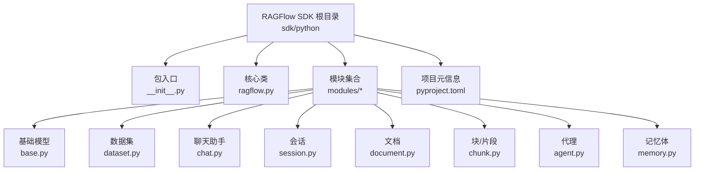
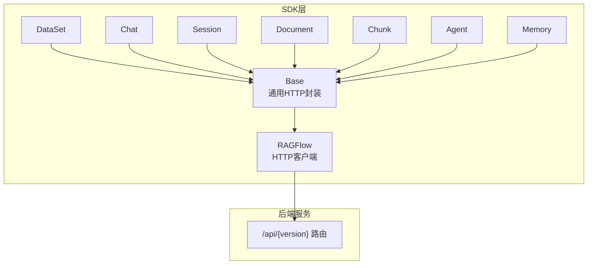
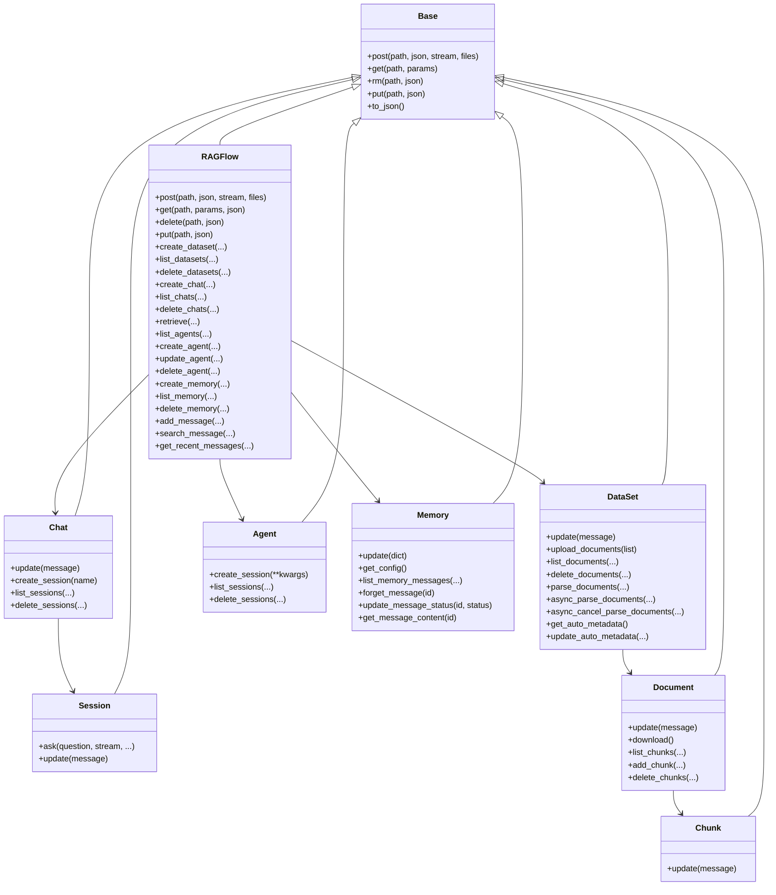
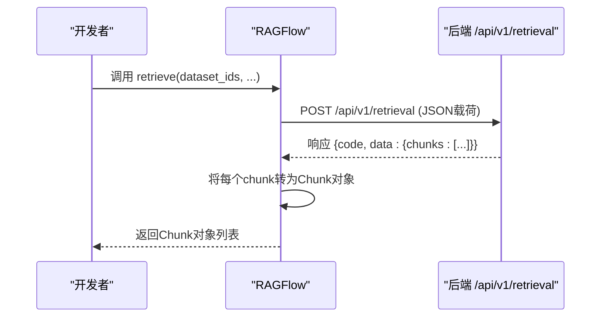
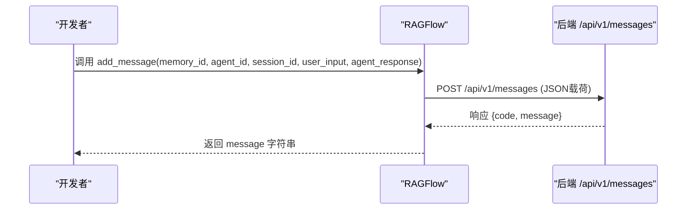
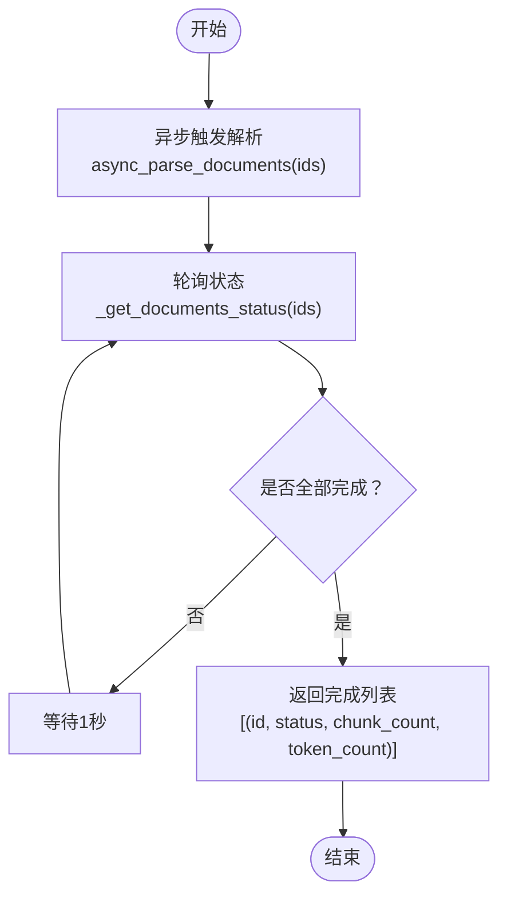

# Python SDK使用指南

<cite>
**本文引用的文件**
- [sdk/python/ragflow_sdk/__init__.py](file://sdk/python/ragflow_sdk/__init__.py)
- [sdk/python/ragflow_sdk/ragflow.py](file://sdk/python/ragflow_sdk/ragflow.py)
- [sdk/python/ragflow_sdk/modules/base.py](file://sdk/python/ragflow_sdk/modules/base.py)
- [sdk/python/ragflow_sdk/modules/dataset.py](file://sdk/python/ragflow_sdk/modules/dataset.py)
- [sdk/python/ragflow_sdk/modules/chat.py](file://sdk/python/ragflow_sdk/modules/chat.py)
- [sdk/python/ragflow_sdk/modules/session.py](file://sdk/python/ragflow_sdk/modules/session.py)
- [sdk/python/ragflow_sdk/modules/document.py](file://sdk/python/ragflow_sdk/modules/document.py)
- [sdk/python/ragflow_sdk/modules/chunk.py](file://sdk/python/ragflow_sdk/modules/chunk.py)
- [sdk/python/ragflow_sdk/modules/agent.py](file://sdk/python/ragflow_sdk/modules/agent.py)
- [sdk/python/ragflow_sdk/modules/memory.py](file://sdk/python/ragflow_sdk/modules/memory.py)
- [sdk/python/pyproject.toml](file://sdk/python/pyproject.toml)
- [example/sdk/dataset_example.py](file://example/sdk/dataset_example.py)
- [docs/references/python_api_reference.md](file://docs/references/python_api_reference.md)
</cite>

## 目录
1. [简介](#简介)
2. [项目结构](#项目结构)
3. [核心组件](#核心组件)
4. [架构总览](#架构总览)
5. [详细组件分析](#详细组件分析)
6. [依赖分析](#依赖分析)
7. [性能考虑](#性能考虑)
8. [故障排查指南](#故障排查指南)
9. [结论](#结论)
10. [附录](#附录)

## 简介
本指南面向希望在Python中集成并使用RAGFlow的开发者，系统讲解RAGFlow Python SDK的安装与配置、认证与初始化、核心模块与API用法，并提供可直接参考的示例路径与最佳实践。通过本指南，您将能够：
- 正确安装与配置SDK（pip安装、依赖管理、环境变量）
- 使用RAGFlow类进行数据集、聊天助手、代理、检索、记忆体与消息管理
- 理解各API的参数、返回值与错误处理机制
- 快速完成从入门到实战的开发流程

## 项目结构
RAGFlow Python SDK位于仓库的sdk/python目录下，采用模块化设计，核心入口为RAGFlow类，围绕其提供DataSet、Chat、Session、Document、Chunk、Agent、Memory等子模块，统一通过HTTP请求与后端服务交互。

图表来源
- [sdk/python/ragflow_sdk/__init__.py:31-42](file://sdk/python/ragflow_sdk/__init__.py#L31-L42)
- [sdk/python/ragflow_sdk/ragflow.py:27-51](file://sdk/python/ragflow_sdk/ragflow.py#L27-L51)
- [sdk/python/ragflow_sdk/modules/base.py:18-59](file://sdk/python/ragflow_sdk/modules/base.py#L18-L59)
- [sdk/python/ragflow_sdk/modules/dataset.py:21-43](file://sdk/python/ragflow_sdk/modules/dataset.py#L21-L43)
- [sdk/python/ragflow_sdk/modules/chat.py:22-30](file://sdk/python/ragflow_sdk/modules/chat.py#L22-L30)
- [sdk/python/ragflow_sdk/modules/session.py:21-34](file://sdk/python/ragflow_sdk/modules/session.py#L21-L34)
- [sdk/python/ragflow_sdk/modules/document.py:23-52](file://sdk/python/ragflow_sdk/modules/document.py#L23-L52)
- [sdk/python/ragflow_sdk/modules/chunk.py:26-49](file://sdk/python/ragflow_sdk/modules/chunk.py#L26-L49)
- [sdk/python/ragflow_sdk/modules/agent.py:21-29](file://sdk/python/ragflow_sdk/modules/agent.py#L21-L29)
- [sdk/python/ragflow_sdk/modules/memory.py:20-43](file://sdk/python/ragflow_sdk/modules/memory.py#L20-L43)
- [sdk/python/pyproject.toml:1-32](file://sdk/python/pyproject.toml#L1-L32)

章节来源
- [sdk/python/ragflow_sdk/__init__.py:31-42](file://sdk/python/ragflow_sdk/__init__.py#L31-L42)
- [sdk/python/pyproject.toml:1-32](file://sdk/python/pyproject.toml#L1-L32)

## 核心组件
- RAGFlow：SDK入口类，负责HTTP请求封装（GET/POST/PUT/DELETE）、鉴权头设置、以及对各业务模块API的调用。
- DataSet：数据集管理，支持创建、查询、更新、上传文档、解析文档、删除文档等。
- Chat：聊天助手管理，支持创建、查询、更新、会话管理等。
- Session：会话与问答流式/非流式交互。
- Document/Chunk：文档与块级管理，支持列表、下载、增删改查与分块操作。
- Agent：代理管理，支持列表、创建、更新、删除及会话管理。
- Memory：记忆体管理，支持创建、查询、消息列表、遗忘与状态更新等。
- Base：所有模块的基类，提供通用的HTTP封装与对象属性映射。

章节来源
- [sdk/python/ragflow_sdk/ragflow.py:27-51](file://sdk/python/ragflow_sdk/ragflow.py#L27-L51)
- [sdk/python/ragflow_sdk/modules/base.py:18-59](file://sdk/python/ragflow_sdk/modules/base.py#L18-L59)
- [sdk/python/ragflow_sdk/modules/dataset.py:21-52](file://sdk/python/ragflow_sdk/modules/dataset.py#L21-L52)
- [sdk/python/ragflow_sdk/modules/chat.py:22-30](file://sdk/python/ragflow_sdk/modules/chat.py#L22-L30)
- [sdk/python/ragflow_sdk/modules/session.py:21-34](file://sdk/python/ragflow_sdk/modules/session.py#L21-L34)
- [sdk/python/ragflow_sdk/modules/document.py:23-52](file://sdk/python/ragflow_sdk/modules/document.py#L23-L52)
- [sdk/python/ragflow_sdk/modules/chunk.py:26-49](file://sdk/python/ragflow_sdk/modules/chunk.py#L26-L49)
- [sdk/python/ragflow_sdk/modules/agent.py:21-29](file://sdk/python/ragflow_sdk/modules/agent.py#L21-L29)
- [sdk/python/ragflow_sdk/modules/memory.py:20-43](file://sdk/python/ragflow_sdk/modules/memory.py#L20-L43)

## 架构总览
RAGFlow Python SDK以RAGFlow为核心，通过统一的HTTP客户端向后端服务发起REST请求；各业务模块（DataSet、Chat、Agent、Memory等）继承Base类，复用HTTP方法与属性映射逻辑。

图表来源
- [sdk/python/ragflow_sdk/ragflow.py:36-50](file://sdk/python/ragflow_sdk/ragflow.py#L36-L50)
- [sdk/python/ragflow_sdk/modules/base.py:41-55](file://sdk/python/ragflow_sdk/modules/base.py#L41-L55)

## 详细组件分析

### 安装与配置
- 安装
  - 使用pip安装官方包名：[安装命令参考:13-17](file://docs/references/python_api_reference.md#L13-L17)
- 版本与依赖
  - Python版本要求与依赖范围见：[pyproject.toml:8-9](file://sdk/python/pyproject.toml#L8-L9)
  - 测试依赖与标记见：[pyproject.toml:12-31](file://sdk/python/pyproject.toml#L12-L31)
- 环境准备
  - 获取API Key与后端地址，确保网络可达
  - 可选：使用uv进行同步安装（开发场景）

章节来源
- [docs/references/python_api_reference.md:13-17](file://docs/references/python_api_reference.md#L13-L17)
- [sdk/python/pyproject.toml:8-9](file://sdk/python/pyproject.toml#L8-L9)
- [sdk/python/pyproject.toml:12-31](file://sdk/python/pyproject.toml#L12-L31)

### 初始化与认证
- 初始化参数
  - api_key：用于Bearer认证
  - base_url：后端服务基础地址
  - version：API版本，默认“v1”
- 认证头
  - 自动拼接Authorization: Bearer {api_key}

章节来源
- [sdk/python/ragflow_sdk/ragflow.py:28-35](file://sdk/python/ragflow_sdk/ragflow.py#L28-L35)

### 数据集管理
- 创建数据集
  - 方法：create_dataset(...)
  - 关键参数：name、avatar、description、embedding_model、permission、chunk_method、parser_config、auto_metadata_config
  - 返回：DataSet实例
  - 错误：当响应code不为0时抛出异常
  - 示例路径：[dataset_example.py:29-36](file://example/sdk/dataset_example.py#L29-L36)
- 列表数据集
  - 方法：list_datasets(page, page_size, orderby, desc, id, name)
  - 返回：DataSet对象列表
- 删除数据集
  - 方法：delete_datasets(ids或delete_all)
- 更新数据集
  - 方法：DataSet.update({...})
- 文档管理（在DataSet内）
  - 上传文档：DataSet.upload_documents([...])
  - 列表文档：DataSet.list_documents(...)
  - 删除文档：DataSet.delete_documents(...)
  - 异步/同步解析：DataSet.async_parse_documents(...) / parse_documents(...)
  - 自动元数据：get_auto_metadata()/update_auto_metadata()

章节来源
- [sdk/python/ragflow_sdk/ragflow.py:52-81](file://sdk/python/ragflow_sdk/ragflow.py#L52-L81)
- [sdk/python/ragflow_sdk/ragflow.py:94-112](file://sdk/python/ragflow_sdk/ragflow.py#L94-L112)
- [sdk/python/ragflow_sdk/ragflow.py:82-87](file://sdk/python/ragflow_sdk/ragflow.py#L82-L87)
- [sdk/python/ragflow_sdk/modules/dataset.py:44-51](file://sdk/python/ragflow_sdk/modules/dataset.py#L44-L51)
- [sdk/python/ragflow_sdk/modules/dataset.py:53-64](file://sdk/python/ragflow_sdk/modules/dataset.py#L53-L64)
- [sdk/python/ragflow_sdk/modules/dataset.py:66-96](file://sdk/python/ragflow_sdk/modules/dataset.py#L66-L96)
- [sdk/python/ragflow_sdk/modules/dataset.py:98-102](file://sdk/python/ragflow_sdk/modules/dataset.py#L98-L102)
- [sdk/python/ragflow_sdk/modules/dataset.py:132-146](file://sdk/python/ragflow_sdk/modules/dataset.py#L132-L146)
- [sdk/python/ragflow_sdk/modules/dataset.py:155-173](file://sdk/python/ragflow_sdk/modules/dataset.py#L155-L173)
- [example/sdk/dataset_example.py:29-44](file://example/sdk/dataset_example.py#L29-L44)

### 聊天助手管理
- 创建聊天助手
  - 方法：create_chat(name, avatar, dataset_ids, llm, prompt)
  - 默认LLM与Prompt参数已内置
  - 返回：Chat实例
- 列表聊天助手
  - 方法：list_chats(...)
- 删除聊天助手
  - 方法：delete_chats(ids或delete_all)
- 更新与会话
  - Chat.update({...})
  - Chat.create_session(name)
  - Chat.list_sessions(...)

章节来源
- [sdk/python/ragflow_sdk/ragflow.py:114-167](file://sdk/python/ragflow_sdk/ragflow.py#L114-L167)
- [sdk/python/ragflow_sdk/ragflow.py:174-192](file://sdk/python/ragflow_sdk/ragflow.py#L174-L192)
- [sdk/python/ragflow_sdk/ragflow.py:168-173](file://sdk/python/ragflow_sdk/ragflow.py#L168-L173)
- [sdk/python/ragflow_sdk/modules/chat.py:62-73](file://sdk/python/ragflow_sdk/modules/chat.py#L62-L73)
- [sdk/python/ragflow_sdk/modules/chat.py:74-89](file://sdk/python/ragflow_sdk/modules/chat.py#L74-L89)

### 代理管理
- 列表代理
  - 方法：list_agents(page, page_size, orderby, desc, id, title)
- 创建代理
  - 方法：create_agent(title, dsl, description)
- 更新代理
  - 方法：update_agent(agent_id, title/description/dsl)
- 删除代理
  - 方法：delete_agent(agent_id)

章节来源
- [sdk/python/ragflow_sdk/ragflow.py:240-258](file://sdk/python/ragflow_sdk/ragflow.py#L240-L258)
- [sdk/python/ragflow_sdk/ragflow.py:260-271](file://sdk/python/ragflow_sdk/ragflow.py#L260-L271)
- [sdk/python/ragflow_sdk/ragflow.py:272-289](file://sdk/python/ragflow_sdk/ragflow.py#L272-L289)
- [sdk/python/ragflow_sdk/ragflow.py:290-295](file://sdk/python/ragflow_sdk/ragflow.py#L290-L295)

### 检索功能
- 方法：retrieve(dataset_ids, document_ids, question, page, page_size, similarity_threshold, vector_similarity_weight, top_k, rerank_id, keyword, cross_languages, metadata_condition, use_kg, toc_enhance)
- 返回：Chunk对象列表
- 错误：响应code不为0时抛出异常

章节来源
- [sdk/python/ragflow_sdk/ragflow.py:194-238](file://sdk/python/ragflow_sdk/ragflow.py#L194-L238)
- [sdk/python/ragflow_sdk/modules/chunk.py:26-49](file://sdk/python/ragflow_sdk/modules/chunk.py#L26-L49)

### 内存管理
- 创建记忆体
  - 方法：create_memory(name, memory_type, embd_id, llm_id)
  - 返回：Memory实例
- 列表记忆体
  - 方法：list_memory(page, page_size, tenant_id, memory_type, storage_type, keywords)
  - 返回：包含memory_list与total_count的字典
- 删除记忆体
  - 方法：delete_memory(memory_id)

章节来源
- [sdk/python/ragflow_sdk/ragflow.py:297-303](file://sdk/python/ragflow_sdk/ragflow.py#L297-L303)
- [sdk/python/ragflow_sdk/ragflow.py:305-328](file://sdk/python/ragflow_sdk/ragflow.py#L305-L328)
- [sdk/python/ragflow_sdk/ragflow.py:330-334](file://sdk/python/ragflow_sdk/ragflow.py#L330-L334)

### 消息管理
- 添加消息
  - 方法：add_message(memory_id, agent_id, session_id, user_input, agent_response, user_id="")
  - 返回：消息提示信息
- 搜索消息
  - 方法：search_message(query, memory_id, agent_id, session_id, similarity_threshold, keywords_similarity_weight, top_n)
  - 返回：消息结果列表
- 获取最近消息
  - 方法：get_recent_messages(memory_id, agent_id, session_id, limit)
  - 返回：消息列表

章节来源
- [sdk/python/ragflow_sdk/ragflow.py:336-349](file://sdk/python/ragflow_sdk/ragflow.py#L336-L349)
- [sdk/python/ragflow_sdk/ragflow.py:351-365](file://sdk/python/ragflow_sdk/ragflow.py#L351-L365)
- [sdk/python/ragflow_sdk/ragflow.py:367-378](file://sdk/python/ragflow_sdk/ragflow.py#L367-L378)

### 会话与问答
- Session.ask(question, stream=False, ...)
  - 支持流式与非流式两种模式
  - 代理与聊天两类会话类型自动识别
  - 非流式：返回最终Message对象
  - 流式：迭代输出Message对象，直至结束事件
- Message结构
  - 包含content、role、reference（如存在）等字段

章节来源
- [sdk/python/ragflow_sdk/modules/session.py:36-84](file://sdk/python/ragflow_sdk/modules/session.py#L36-L84)
- [sdk/python/ragflow_sdk/modules/session.py:103-115](file://sdk/python/ragflow_sdk/modules/session.py#L103-L115)
- [sdk/python/ragflow_sdk/modules/session.py:125-133](file://sdk/python/ragflow_sdk/modules/session.py#L125-L133)

### 类关系图

图表来源
- [sdk/python/ragflow_sdk/ragflow.py:27-51](file://sdk/python/ragflow_sdk/ragflow.py#L27-L51)
- [sdk/python/ragflow_sdk/modules/base.py:18-59](file://sdk/python/ragflow_sdk/modules/base.py#L18-L59)
- [sdk/python/ragflow_sdk/modules/dataset.py:21-52](file://sdk/python/ragflow_sdk/modules/dataset.py#L21-L52)
- [sdk/python/ragflow_sdk/modules/chat.py:22-30](file://sdk/python/ragflow_sdk/modules/chat.py#L22-L30)
- [sdk/python/ragflow_sdk/modules/session.py:21-34](file://sdk/python/ragflow_sdk/modules/session.py#L21-L34)
- [sdk/python/ragflow_sdk/modules/document.py:23-52](file://sdk/python/ragflow_sdk/modules/document.py#L23-L52)
- [sdk/python/ragflow_sdk/modules/chunk.py:26-49](file://sdk/python/ragflow_sdk/modules/chunk.py#L26-L49)
- [sdk/python/ragflow_sdk/modules/agent.py:21-29](file://sdk/python/ragflow_sdk/modules/agent.py#L21-L29)
- [sdk/python/ragflow_sdk/modules/memory.py:20-43](file://sdk/python/ragflow_sdk/modules/memory.py#L20-L43)

### API调用序列图（检索）

图表来源
- [sdk/python/ragflow_sdk/ragflow.py:194-238](file://sdk/python/ragflow_sdk/ragflow.py#L194-L238)
- [sdk/python/ragflow_sdk/modules/chunk.py:26-49](file://sdk/python/ragflow_sdk/modules/chunk.py#L26-L49)

### API调用序列图（添加消息）

图表来源
- [sdk/python/ragflow_sdk/ragflow.py:336-349](file://sdk/python/ragflow_sdk/ragflow.py#L336-L349)

### 处理流程图（文档解析）

图表来源
- [sdk/python/ragflow_sdk/modules/dataset.py:132-146](file://sdk/python/ragflow_sdk/modules/dataset.py#L132-L146)
- [sdk/python/ragflow_sdk/modules/dataset.py:105-130](file://sdk/python/ragflow_sdk/modules/dataset.py#L105-L130)

## 依赖分析
- 运行时依赖
  - requests：HTTP请求库
  - beartype：类型注解增强（包级装饰器）
- 开发与测试依赖
  - pytest、openpyxl、pillow、python-docx、python-pptx、reportlab、requests-toolbelt等
- Python版本约束
  - >=3.12,<3.15

章节来源
- [sdk/python/pyproject.toml:8-9](file://sdk/python/pyproject.toml#L8-L9)
- [sdk/python/pyproject.toml:12-31](file://sdk/python/pyproject.toml#L12-L31)

## 性能考虑
- 流式响应
  - Session.ask支持流式模式，适合长回答与实时展示，注意资源释放与异常处理
- 批量操作
  - DataSet.parse_documents提供批量解析与状态轮询，建议在大批量任务中使用
- 分页与排序
  - list_*系列接口支持分页与排序，合理设置page/page_size以降低单次负载
- 重试与超时
  - 建议在应用层对网络异常进行重试与超时控制（requests层面）

## 故障排查指南
- 常见错误码
  - 400：请求参数无效
  - 401：未授权（检查API Key）
  - 403：访问被拒绝
  - 404：资源不存在
  - 500：服务器内部错误
  - 1001/1002：块ID无效/块更新失败
- 典型问题定位
  - 初始化失败：确认base_url与version正确，API Key有效
  - 数据集/文档操作失败：检查权限与资源ID，关注返回message
  - 检索无结果：调整similarity_threshold、vector_similarity_weight、top_k等参数
- 异常处理
  - SDK在响应code!=0时抛出异常，建议捕获并记录message与details（如可用）

章节来源
- [docs/references/python_api_reference.md:27-36](file://docs/references/python_api_reference.md#L27-L36)
- [sdk/python/ragflow_sdk/ragflow.py:78-80](file://sdk/python/ragflow_sdk/ragflow.py#L78-L80)
- [sdk/python/ragflow_sdk/modules/chunk.py:19-25](file://sdk/python/ragflow_sdk/modules/chunk.py#L19-L25)

## 结论
RAGFlow Python SDK提供了清晰的模块化接口与完善的HTTP封装，覆盖数据集、聊天、代理、检索、记忆体与消息管理等关键能力。遵循本文的安装配置、参数说明、错误处理与最佳实践，您可以高效地在生产环境中集成RAGFlow能力。

## 附录
- 快速开始示例（数据集CRUD）
  - 示例路径：[dataset_example.py:27-46](file://example/sdk/dataset_example.py#L27-L46)
- 更多API参考
  - Python API参考文档：[python_api_reference.md:124-800](file://docs/references/python_api_reference.md#L124-L800)