# SDK开发指南

<cite>
**本文引用的文件**
- [sdk/python/ragflow_sdk/__init__.py](file://sdk/python/ragflow_sdk/__init__.py)
- [sdk/python/ragflow_sdk/ragflow.py](file://sdk/python/ragflow_sdk/ragflow.py)
- [sdk/python/ragflow_sdk/modules/base.py](file://sdk/python/ragflow_sdk/modules/base.py)
- [sdk/python/ragflow_sdk/modules/dataset.py](file://sdk/python/ragflow_sdk/modules/dataset.py)
- [sdk/python/ragflow_sdk/modules/chat.py](file://sdk/python/ragflow_sdk/modules/chat.py)
- [sdk/python/ragflow_sdk/modules/session.py](file://sdk/python/ragflow_sdk/modules/session.py)
- [sdk/python/ragflow_sdk/modules/document.py](file://sdk/python/ragflow_sdk/modules/document.py)
- [sdk/python/ragflow_sdk/modules/chunk.py](file://sdk/python/ragflow_sdk/modules/chunk.py)
- [sdk/python/ragflow_sdk/modules/agent.py](file://sdk/python/ragflow_sdk/modules/agent.py)
- [sdk/python/ragflow_sdk/modules/memory.py](file://sdk/python/ragflow_sdk/modules/memory.py)
- [sdk/python/pyproject.toml](file://sdk/python/pyproject.toml)
- [example/sdk/dataset_example.py](file://example/sdk/dataset_example.py)
- [sdk/python/hello_ragflow.py](file://sdk/python/hello_ragflow.py)
- [admin/client/ragflow_client.py](file://admin/client/ragflow_client.py)
- [admin/client/http_client.py](file://admin/client/http_client.py)
</cite>

## 目录
1. [简介](#简介)
2. [项目结构](#项目结构)
3. [核心组件](#核心组件)
4. [架构总览](#架构总览)
5. [详细组件分析](#详细组件分析)
6. [依赖分析](#依赖分析)
7. [性能考虑](#性能考虑)
8. [故障排查指南](#故障排查指南)
9. [结论](#结论)
10. [附录](#附录)

## 简介
本指南面向希望在自身应用中集成 RAGFlow 的开发者，系统讲解 Python SDK 的使用与扩展方法，并提供自定义 SDK 开发的规范与最佳实践。内容涵盖安装配置、基础与高级操作示例、会话与流式响应处理、错误处理策略、版本管理与迁移建议等，帮助你快速、稳定地将 RAGFlow 的检索增强生成能力嵌入到现有系统。

## 项目结构
RAGFlow SDK 主要由 Python 包组成，采用模块化设计，核心入口导出统一的 RAGFlow 客户端类，以及围绕数据集、文档、分块、聊天、会话、智能体、记忆等资源的子模块。同时，仓库还提供了 CLI 客户端与示例脚本，便于演示与测试。

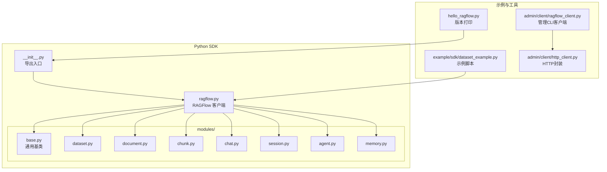

**图表来源**
- [sdk/python/ragflow_sdk/__init__.py:31-42](file://sdk/python/ragflow_sdk/__init__.py#L31-L42)
- [sdk/python/ragflow_sdk/ragflow.py:27-51](file://sdk/python/ragflow_sdk/ragflow.py#L27-L51)
- [sdk/python/ragflow_sdk/modules/base.py:18-59](file://sdk/python/ragflow_sdk/modules/base.py#L18-L59)
- [example/sdk/dataset_example.py:21-51](file://example/sdk/dataset_example.py#L21-L51)
- [sdk/python/hello_ragflow.py:17-20](file://sdk/python/hello_ragflow.py#L17-L20)
- [admin/client/ragflow_client.py:48-89](file://admin/client/ragflow_client.py#L48-L89)
- [admin/client/http_client.py:26-72](file://admin/client/http_client.py#L26-L72)

**章节来源**
- [sdk/python/ragflow_sdk/__init__.py:20-42](file://sdk/python/ragflow_sdk/__init__.py#L20-L42)
- [sdk/python/ragflow_sdk/ragflow.py:27-51](file://sdk/python/ragflow_sdk/ragflow.py#L27-L51)
- [sdk/python/ragflow_sdk/modules/base.py:18-59](file://sdk/python/ragflow_sdk/modules/base.py#L18-L59)
- [example/sdk/dataset_example.py:21-51](file://example/sdk/dataset_example.py#L21-L51)
- [sdk/python/hello_ragflow.py:17-20](file://sdk/python/hello_ragflow.py#L17-L20)
- [admin/client/ragflow_client.py:48-89](file://admin/client/ragflow_client.py#L48-L89)
- [admin/client/http_client.py:26-72](file://admin/client/http_client.py#L26-L72)

## 核心组件
- RAGFlow 客户端：负责构建请求 URL、设置认证头、封装 HTTP 方法（GET/POST/PUT/DELETE），并提供高层 API（如创建/查询数据集、聊天、检索、智能体、记忆等）。
- 资源模块：DataSet、Document、Chunk、Chat、Session、Agent、Memory 均继承自 Base，统一处理字段映射、序列化与 HTTP 请求转发。
- 示例与工具：提供最小可运行示例与管理端 CLI 客户端，便于快速验证与调试。

关键要点
- 认证：通过初始化时传入的 API Key 设置 Authorization 头。
- 版本路径：自动拼接 /api/{version}，默认 version="v1"。
- 错误处理：统一读取响应中的 code/message 并抛出异常；部分模块提供专用异常类型（如 ChunkUpdateError）。

**章节来源**
- [sdk/python/ragflow_sdk/ragflow.py:27-51](file://sdk/python/ragflow_sdk/ragflow.py#L27-L51)
- [sdk/python/ragflow_sdk/modules/base.py:18-59](file://sdk/python/ragflow_sdk/modules/base.py#L18-L59)
- [sdk/python/ragflow_sdk/modules/chunk.py:19-25](file://sdk/python/ragflow_sdk/modules/chunk.py#L19-L25)
- [example/sdk/dataset_example.py:27-51](file://example/sdk/dataset_example.py#L27-L51)

## 架构总览
下图展示了 Python SDK 的调用链路：应用层通过 RAGFlow 客户端发起请求，客户端根据资源模块的封装进行 HTTP 调用，服务端返回 JSON 数据，SDK 将其映射为对应的对象模型。

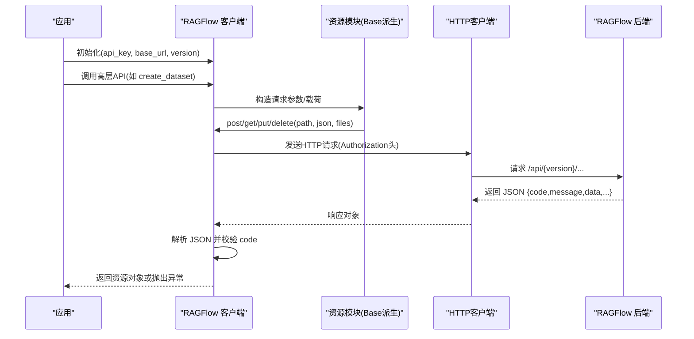

**图表来源**
- [sdk/python/ragflow_sdk/ragflow.py:36-50](file://sdk/python/ragflow_sdk/ragflow.py#L36-L50)
- [sdk/python/ragflow_sdk/modules/base.py:41-55](file://sdk/python/ragflow_sdk/modules/base.py#L41-L55)

**章节来源**
- [sdk/python/ragflow_sdk/ragflow.py:36-50](file://sdk/python/ragflow_sdk/ragflow.py#L36-L50)
- [sdk/python/ragflow_sdk/modules/base.py:41-55](file://sdk/python/ragflow_sdk/modules/base.py#L41-L55)

## 详细组件分析

### RAGFlow 客户端类
职责
- 统一构造 API 基础 URL 与认证头。
- 提供通用 HTTP 方法封装。
- 提供高层业务 API：数据集 CRUD、聊天、检索、智能体、记忆、消息等。

关键点
- 认证头格式：Authorization: Bearer <api_key>。
- 高层 API 返回值：成功时返回对应资源对象（如 DataSet、Chat、Chunk 列表等），失败时抛出异常。
- 检索接口支持多参数组合，便于灵活检索。

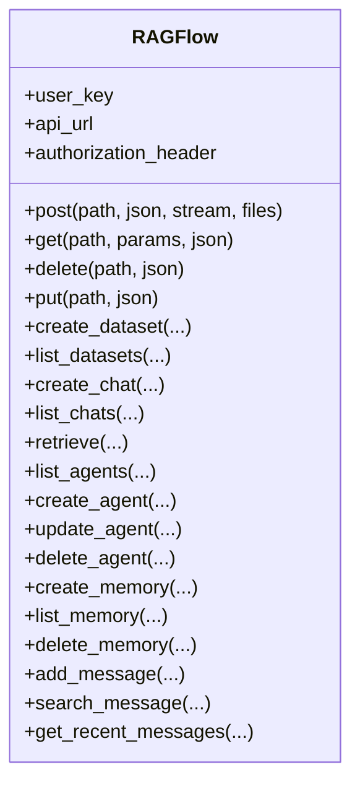

**图表来源**
- [sdk/python/ragflow_sdk/ragflow.py:27-379](file://sdk/python/ragflow_sdk/ragflow.py#L27-L379)

**章节来源**
- [sdk/python/ragflow_sdk/ragflow.py:27-379](file://sdk/python/ragflow_sdk/ragflow.py#L27-L379)

### 资源基类 Base
职责
- 将字典数据映射到对象属性，支持嵌套字典递归包装。
- 提供 to_json 序列化方法。
- 统一封装 HTTP 请求转发（post/get/put/delete/rm）。

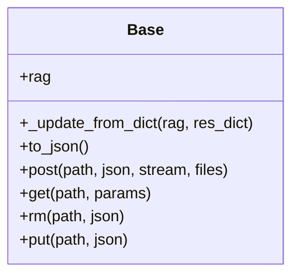

**图表来源**
- [sdk/python/ragflow_sdk/modules/base.py:18-59](file://sdk/python/ragflow_sdk/modules/base.py#L18-L59)

**章节来源**
- [sdk/python/ragflow_sdk/modules/base.py:18-59](file://sdk/python/ragflow_sdk/modules/base.py#L18-L59)

### 数据集 DataSet
职责
- 管理数据集元信息与生命周期。
- 支持上传文档、批量解析、状态轮询、删除文档等。
- 支持自动元数据配置的查询与更新。

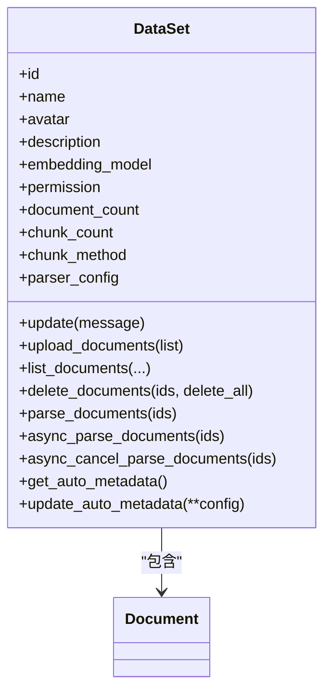

**图表来源**
- [sdk/python/ragflow_sdk/modules/dataset.py:21-174](file://sdk/python/ragflow_sdk/modules/dataset.py#L21-L174)

**章节来源**
- [sdk/python/ragflow_sdk/modules/dataset.py:21-174](file://sdk/python/ragflow_sdk/modules/dataset.py#L21-L174)

### 文档 Document
职责
- 表示单个文档，支持更新元信息、下载、列出/新增/删除分块等。

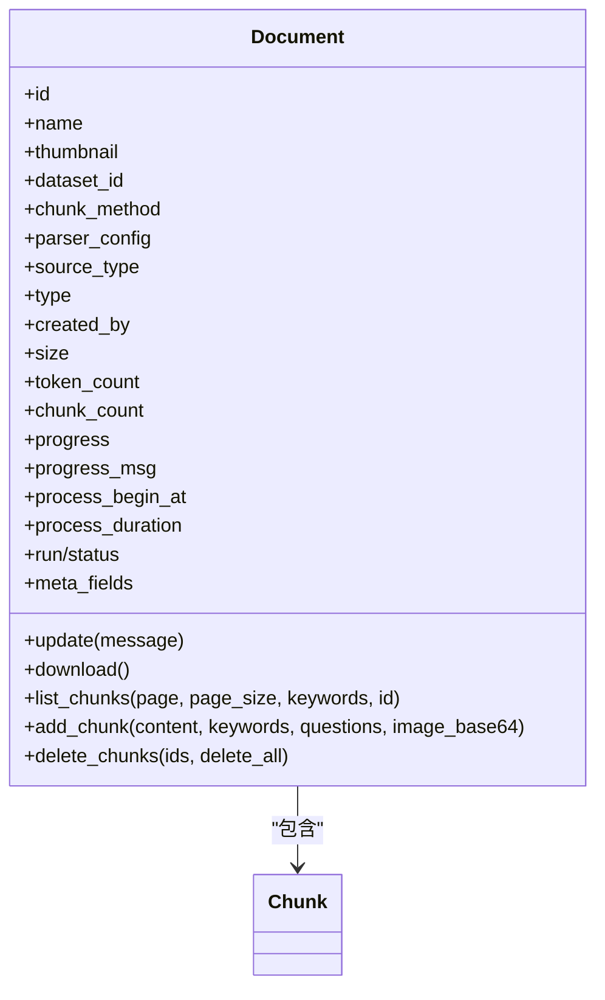

**图表来源**
- [sdk/python/ragflow_sdk/modules/document.py:23-105](file://sdk/python/ragflow_sdk/modules/document.py#L23-L105)

**章节来源**
- [sdk/python/ragflow_sdk/modules/document.py:23-105](file://sdk/python/ragflow_sdk/modules/document.py#L23-L105)

### 分块 Chunk
职责
- 表示文档分块，支持更新操作并提供专用异常类型。

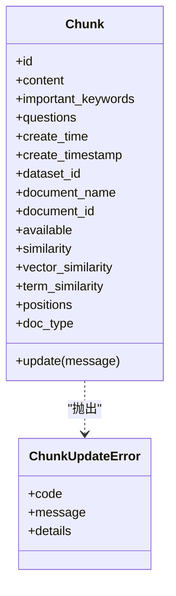

**图表来源**
- [sdk/python/ragflow_sdk/modules/chunk.py:26-63](file://sdk/python/ragflow_sdk/modules/chunk.py#L26-L63)

**章节来源**
- [sdk/python/ragflow_sdk/modules/chunk.py:19-63](file://sdk/python/ragflow_sdk/modules/chunk.py#L19-L63)

### 聊天 Chat 与会话 Session
职责
- Chat：管理聊天配置（LLM 参数、提示词模板等），创建/列出会话。
- Session：支持问答请求，支持流式（SSE）与非流式两种模式，自动解析响应并封装为 Message 对象。

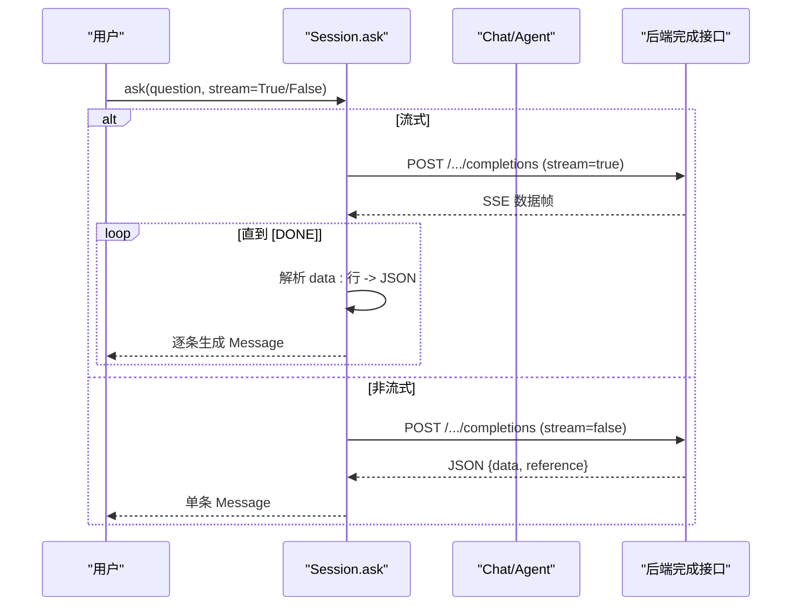

**图表来源**
- [sdk/python/ragflow_sdk/modules/session.py:36-115](file://sdk/python/ragflow_sdk/modules/session.py#L36-L115)
- [sdk/python/ragflow_sdk/modules/chat.py:74-89](file://sdk/python/ragflow_sdk/modules/chat.py#L74-L89)

**章节来源**
- [sdk/python/ragflow_sdk/modules/session.py:36-115](file://sdk/python/ragflow_sdk/modules/session.py#L36-L115)
- [sdk/python/ragflow_sdk/modules/chat.py:22-96](file://sdk/python/ragflow_sdk/modules/chat.py#L22-L96)

### 智能体 Agent 与会话
职责
- 管理智能体 DSL 结构与会话列表，支持创建/删除会话。

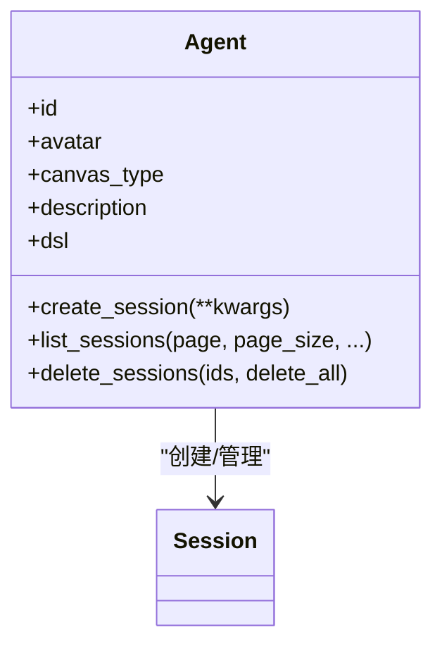

**图表来源**
- [sdk/python/ragflow_sdk/modules/agent.py:21-98](file://sdk/python/ragflow_sdk/modules/agent.py#L21-L98)

**章节来源**
- [sdk/python/ragflow_sdk/modules/agent.py:21-98](file://sdk/python/ragflow_sdk/modules/agent.py#L21-L98)

### 记忆 Memory
职责
- 管理记忆配置、消息列表、消息内容获取与状态更新、遗忘消息等。

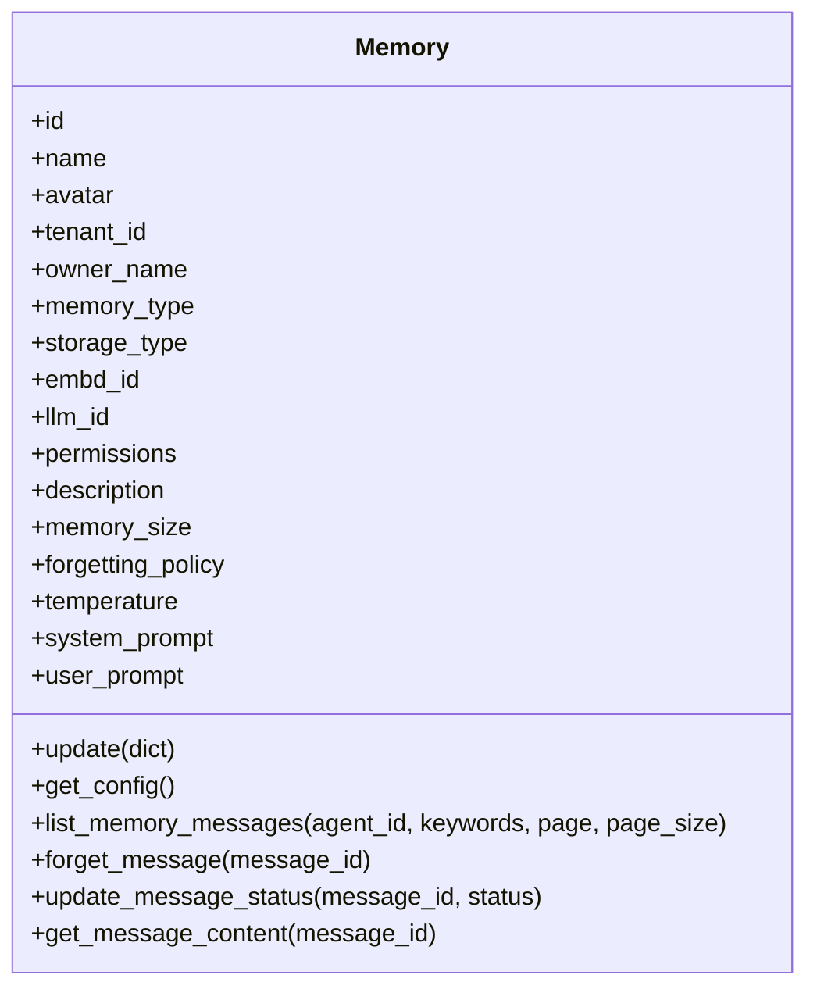

**图表来源**
- [sdk/python/ragflow_sdk/modules/memory.py:20-96](file://sdk/python/ragflow_sdk/modules/memory.py#L20-L96)

**章节来源**
- [sdk/python/ragflow_sdk/modules/memory.py:20-96](file://sdk/python/ragflow_sdk/modules/memory.py#L20-L96)

### 检索流程（retrieve）
职责
- 封装检索请求，支持相似度阈值、关键词权重、重排模型、跨语言检索、元数据过滤、知识图谱增强等参数。

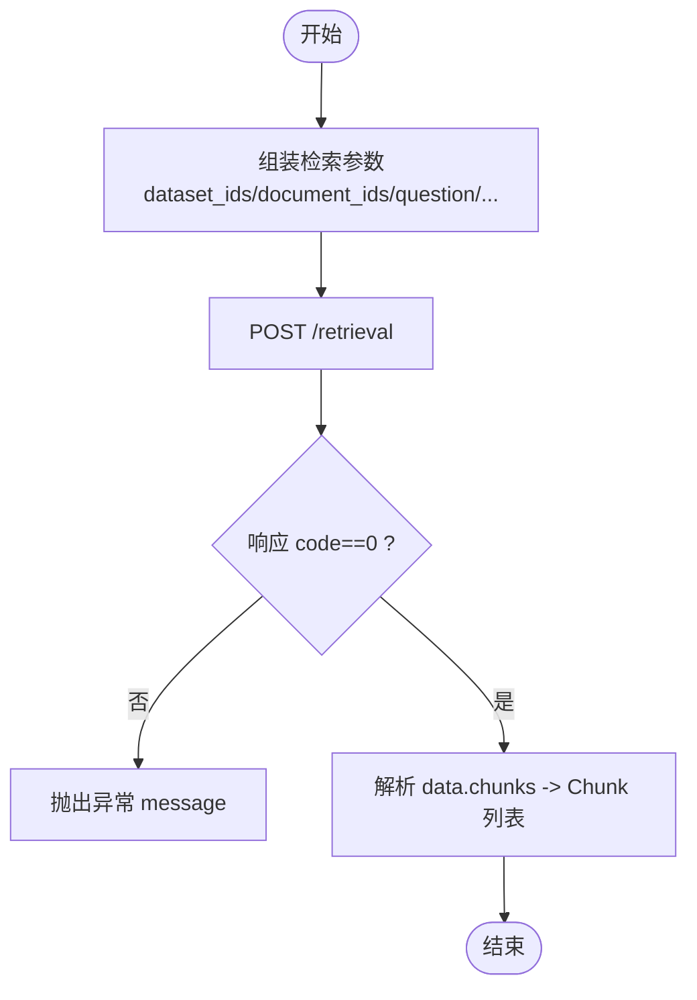

**图表来源**
- [sdk/python/ragflow_sdk/ragflow.py:194-238](file://sdk/python/ragflow_sdk/ragflow.py#L194-L238)

**章节来源**
- [sdk/python/ragflow_sdk/ragflow.py:194-238](file://sdk/python/ragflow_sdk/ragflow.py#L194-L238)

## 依赖分析
- Python SDK 依赖
  - requests：用于 HTTP 请求。
  - beartype：对包进行类型检查（通过 beartype_this_package 钩子启用）。
- 版本范围
  - Python：>=3.12,<3.15
  - requests：>=2.30.0,<3.0.0
  - beartype：>=0.20.0,<1.0.0

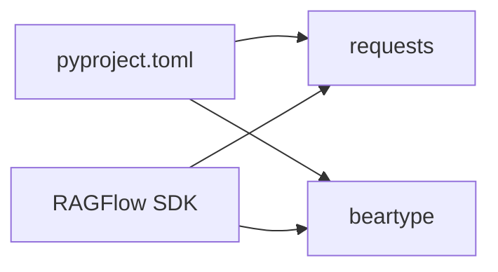

**图表来源**
- [sdk/python/pyproject.toml:1-32](file://sdk/python/pyproject.toml#L1-L32)

**章节来源**
- [sdk/python/pyproject.toml:1-32](file://sdk/python/pyproject.toml#L1-L32)

## 性能考虑
- 连接与读写超时：可通过 HttpClient 的 connect_timeout/read_timeout 控制（管理端 CLI 客户端已内置）。
- 流式响应：Session.ask 支持流式输出，适合长文本生成与实时反馈。
- 批量操作：数据集解析支持异步触发与轮询，避免阻塞主线程。
- 超时与重试：建议在上层应用中结合指数退避策略处理网络抖动。

[本节为通用建议，不直接分析具体文件]

## 故障排查指南
常见问题与定位思路
- 认证失败：确认 API Key 是否正确，Authorization 头是否按 Bearer 方式设置。
- 响应 code 非 0：捕获异常并读取 message 字段，结合后端日志定位。
- 流式解析异常：确保只解析以 "data:" 开头的有效行，并跳过空行与非 JSON 行。
- 分块更新失败：使用 ChunkUpdateError 获取更详细的错误码与详情。

**章节来源**
- [sdk/python/ragflow_sdk/ragflow.py:78-80](file://sdk/python/ragflow_sdk/ragflow.py#L78-L80)
- [sdk/python/ragflow_sdk/modules/chunk.py:55-63](file://sdk/python/ragflow_sdk/modules/chunk.py#L55-L63)
- [sdk/python/ragflow_sdk/modules/session.py:48-84](file://sdk/python/ragflow_sdk/modules/session.py#L48-L84)

## 结论
RAGFlow Python SDK 以清晰的模块化设计与统一的错误处理机制，为开发者提供了从数据准备到对话交互的完整能力。通过本文档的指引，你可以快速完成 SDK 的安装、配置与集成，并在此基础上进行扩展与定制。

[本节为总结，不直接分析具体文件]

## 附录

### 快速开始与示例
- 最小示例：创建数据集、更新、删除，参考示例脚本。
- 版本查看：通过 hello_ragflow.py 输出当前 SDK 版本。

**章节来源**
- [example/sdk/dataset_example.py:27-51](file://example/sdk/dataset_example.py#L27-L51)
- [sdk/python/hello_ragflow.py:17-20](file://sdk/python/hello_ragflow.py#L17-L20)

### 安装与环境
- 使用 pip 安装 SDK 包（版本号来自 pyproject.toml）。
- 确保 Python 版本满足要求（>=3.12,<3.15）。

**章节来源**
- [sdk/python/pyproject.toml:1-32](file://sdk/python/pyproject.toml#L1-L32)

### 自定义 SDK 开发指南
- 接口规范
  - 统一使用 Base 类进行字段映射与序列化。
  - 所有 HTTP 请求通过 RAGFlow 客户端或资源模块的 post/get/put/delete/rm 方法转发。
- 认证机制
  - 在初始化时注入 API Key，自动附加 Authorization: Bearer 头。
- 错误处理
  - 统一读取响应中的 code/message 并抛出异常；必要时定义专用异常类型。
- 异步与流式
  - 对于耗时任务（如解析文档），提供异步触发与轮询方法。
  - 对于长文本生成，优先使用流式响应提升用户体验。
- 性能优化
  - 合理设置连接与读取超时。
  - 对重复请求进行幂等处理与缓存策略。
- 版本管理与迁移
  - 关注 pyproject.toml 中的版本号与依赖范围。
  - 当后端 API 变更时，先在资源模块中适配新字段与行为，保持对外接口稳定。

**章节来源**
- [sdk/python/ragflow_sdk/modules/base.py:18-59](file://sdk/python/ragflow_sdk/modules/base.py#L18-L59)
- [sdk/python/ragflow_sdk/ragflow.py:27-51](file://sdk/python/ragflow_sdk/ragflow.py#L27-L51)
- [sdk/python/pyproject.toml:1-32](file://sdk/python/pyproject.toml#L1-L32)

### 管理端 CLI 客户端（参考）
- 用途：用于服务器健康检查、用户/角色/权限管理、变量与配置查看、密钥生成与删除等。
- 认证：支持 web/admin/api 三种认证方式，分别对应不同场景。

**章节来源**
- [admin/client/ragflow_client.py:48-89](file://admin/client/ragflow_client.py#L48-L89)
- [admin/client/http_client.py:26-72](file://admin/client/http_client.py#L26-L72)