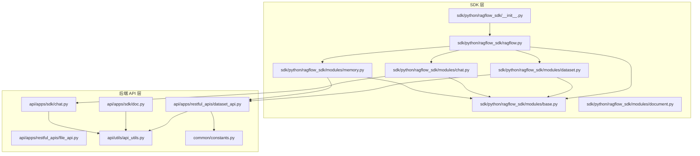
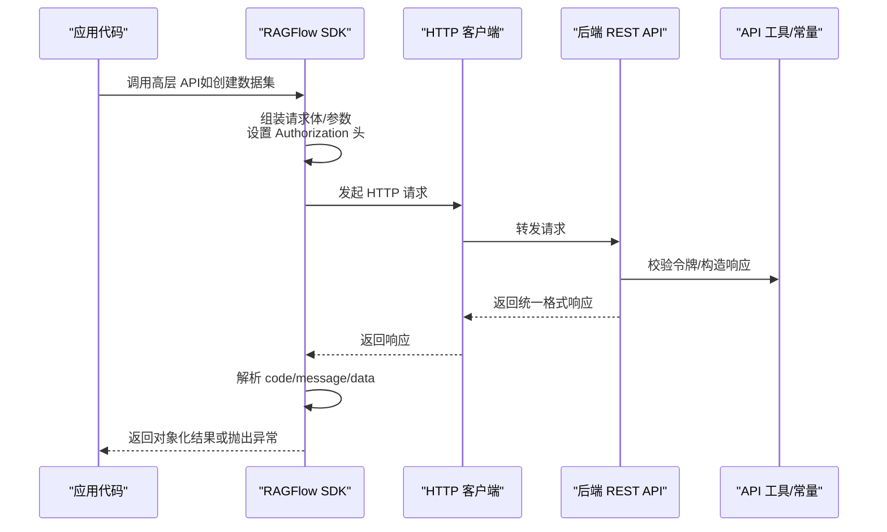
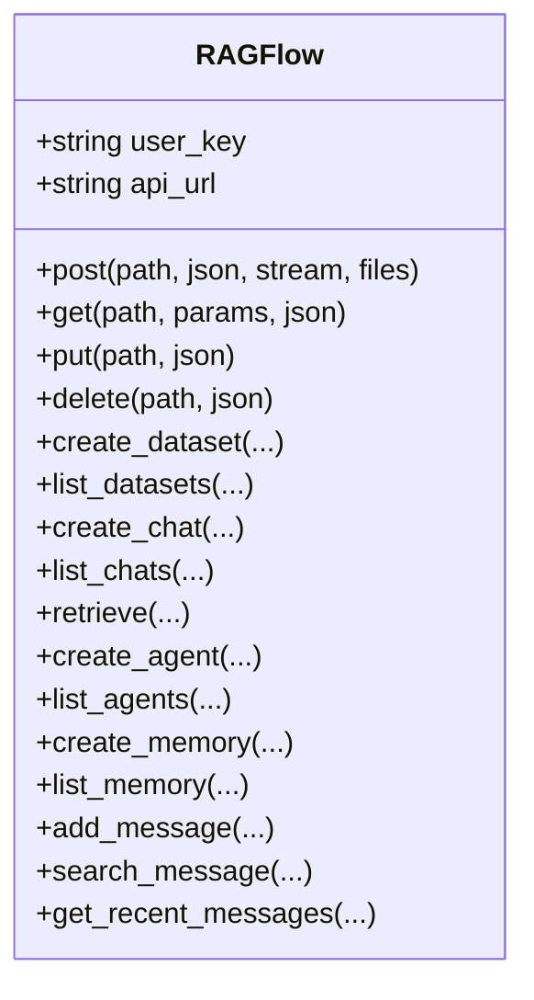
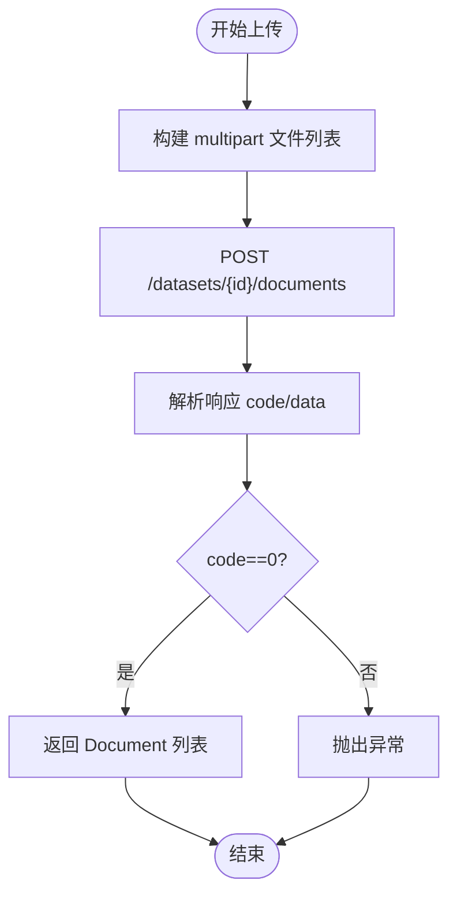
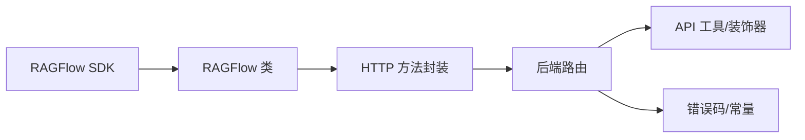

# 自定义SDK开发指南

<cite>
**本文档引用的文件**
- [sdk/python/ragflow_sdk/__init__.py](file://sdk/python/ragflow_sdk/__init__.py)
- [sdk/python/ragflow_sdk/ragflow.py](file://sdk/python/ragflow_sdk/ragflow.py)
- [sdk/python/ragflow_sdk/modules/base.py](file://sdk/python/ragflow_sdk/modules/base.py)
- [sdk/python/ragflow_sdk/modules/dataset.py](file://sdk/python/ragflow_sdk/modules/dataset.py)
- [sdk/python/ragflow_sdk/modules/chat.py](file://sdk/python/ragflow_sdk/modules/chat.py)
- [sdk/python/ragflow_sdk/modules/memory.py](file://sdk/python/ragflow_sdk/modules/memory.py)
- [sdk/python/ragflow_sdk/modules/document.py](file://sdk/python/ragflow_sdk/modules/document.py)
- [api/apps/restful_apis/dataset_api.py](file://api/apps/restful_apis/dataset_api.py)
- [api/apps/restful_apis/file_api.py](file://api/apps/restful_apis/file_api.py)
- [api/apps/sdk/doc.py](file://api/apps/sdk/doc.py)
- [api/apps/sdk/chat.py](file://api/apps/sdk/chat.py)
- [api/utils/api_utils.py](file://api/utils/api_utils.py)
- [common/constants.py](file://common/constants.py)
- [api/common/exceptions.py](file://api/common/exceptions.py)
</cite>

## 目录
1. [简介](#简介)
2. [项目结构](#项目结构)
3. [核心组件](#核心组件)
4. [架构总览](#架构总览)
5. [详细组件分析](#详细组件分析)
6. [依赖分析](#依赖分析)
7. [性能考虑](#性能考虑)
8. [故障排查指南](#故障排查指南)
9. [结论](#结论)
10. [附录](#附录)

## 简介
本指南面向为 RAGFlow 开发自定义 SDK 的工程师，系统阐述 SDK 设计原则与架构模式，涵盖 RESTful API 封装、HTTP 客户端实现、认证机制集成、接口规范遵循、版本控制策略、完整开发流程（需求分析、接口设计、代码实现、测试与部署）、性能优化（请求缓存、批量操作、并发控制、超时处理）、版本管理与向后兼容、迁移指南以及全面的测试策略与质量保障方法。文档以仓库中现有 Python SDK 与后端 API 实现为依据，确保内容可追溯、可落地。

## 项目结构
RAGFlow 采用多语言混合架构：后端服务主要由 Go/Python 组成，前端使用 Web 技术栈；SDK 位于 Python 目录下，提供对后端 REST API 的高层封装。关键目录与职责如下：
- sdk/python/ragflow_sdk：Python SDK 核心实现，包含模块化封装与统一入口类
- api/apps/restful_apis：后端 REST API 路由与业务逻辑
- api/apps/sdk：SDK 文档与示例路由（如文档上传、聊天等）
- api/utils：通用工具与 API 响应格式、认证装饰器等
- common/constants：统一返回码、枚举常量等
- api/common/exceptions：异常类型定义

图表来源
- [sdk/python/ragflow_sdk/ragflow.py:27-379](file://sdk/python/ragflow_sdk/ragflow.py#L27-L379)
- [sdk/python/ragflow_sdk/modules/dataset.py:21-174](file://sdk/python/ragflow_sdk/modules/dataset.py#L21-L174)
- [sdk/python/ragflow_sdk/modules/chat.py:22-96](file://sdk/python/ragflow_sdk/modules/chat.py#L22-L96)
- [sdk/python/ragflow_sdk/modules/memory.py:20-96](file://sdk/python/ragflow_sdk/modules/memory.py#L20-L96)
- [api/apps/restful_apis/dataset_api.py:34-518](file://api/apps/restful_apis/dataset_api.py#L34-L518)
- [api/apps/sdk/doc.py:75-184](file://api/apps/sdk/doc.py#L75-L184)
- [api/apps/sdk/chat.py:27-330](file://api/apps/sdk/chat.py#L27-L330)
- [api/utils/api_utils.py:247-341](file://api/utils/api_utils.py#L247-L341)
- [common/constants.py:45-62](file://common/constants.py#L45-L62)

章节来源
- [sdk/python/ragflow_sdk/__init__.py:20-42](file://sdk/python/ragflow_sdk/__init__.py#L20-L42)
- [sdk/python/ragflow_sdk/ragflow.py:27-379](file://sdk/python/ragflow_sdk/ragflow.py#L27-L379)
- [api/apps/restful_apis/dataset_api.py:34-518](file://api/apps/restful_apis/dataset_api.py#L34-L518)

## 核心组件
- SDK 入口与统一客户端
  - RAGFlow 类负责构建 API 基础 URL、设置 Authorization 头、封装 HTTP 方法（GET/POST/PUT/DELETE），并提供高层 API（如创建数据集、聊天、检索、记忆体等）。
  - 版本控制通过构造 /api/{version} 路径实现，默认版本为 v1。
- 模块化封装
  - DataSet、Chat、Memory、Document、Chunk 等模块均继承自 Base，统一处理字段映射、序列化与 HTTP 请求转发。
- 统一响应格式
  - 后端统一返回 {"code": 整数, "message": 字符串, "data": 对象或数组}，SDK 在调用后解析 code 并在非 0 时抛出异常，便于上层捕获与处理。
- 认证机制
  - SDK 使用 Bearer Token（Authorization: Bearer <api_key>) 进行认证，后端通过 token_required 装饰器校验 API Key 有效性，并注入 tenant_id。

章节来源
- [sdk/python/ragflow_sdk/ragflow.py:27-379](file://sdk/python/ragflow_sdk/ragflow.py#L27-L379)
- [sdk/python/ragflow_sdk/modules/base.py:18-59](file://sdk/python/ragflow_sdk/modules/base.py#L18-L59)
- [api/utils/api_utils.py:282-318](file://api/utils/api_utils.py#L282-L318)
- [common/constants.py:45-62](file://common/constants.py#L45-L62)

## 架构总览
SDK 通过 RAGFlow 统一客户端发起 HTTP 请求，后端 REST API 验证令牌并执行业务逻辑，最终以统一响应格式返回。SDK 模块对返回数据进行对象化封装，提供更友好的编程体验。

图表来源
- [sdk/python/ragflow_sdk/ragflow.py:36-50](file://sdk/python/ragflow_sdk/ragflow.py#L36-L50)
- [api/utils/api_utils.py:282-318](file://api/utils/api_utils.py#L282-L318)
- [common/constants.py:45-62](file://common/constants.py#L45-L62)

## 详细组件分析

### RAGFlow 统一客户端
- 职责
  - 构造 API 基础 URL（含版本）
  - 设置 Authorization 头（Bearer Token）
  - 提供高层 API：数据集 CRUD、聊天会话管理、检索、记忆体管理等
- 关键点
  - 所有高层 API 最终都会调用 SDKBase 的 HTTP 方法，再由 RAGFlow 发送请求
  - 对后端返回的统一响应进行解析，非成功状态抛出异常

图表来源
- [sdk/python/ragflow_sdk/ragflow.py:27-379](file://sdk/python/ragflow_sdk/ragflow.py#L27-L379)

章节来源
- [sdk/python/ragflow_sdk/ragflow.py:27-379](file://sdk/python/ragflow_sdk/ragflow.py#L27-L379)

### 数据集模块（DataSet）
- 职责
  - 数据集的创建、更新、查询、删除
  - 文档上传、列表、删除、分片解析与状态轮询
  - 自动元数据配置的获取与更新
- 关键点
  - 上传文档时支持 multipart/form-data，将本地文件流转换为 HTTP 表单上传
  - 解析状态轮询通过文档 run/progress 字段判断终端状态，避免阻塞

图表来源
- [sdk/python/ragflow_sdk/modules/dataset.py:53-103](file://sdk/python/ragflow_sdk/modules/dataset.py#L53-L103)

章节来源
- [sdk/python/ragflow_sdk/modules/dataset.py:21-174](file://sdk/python/ragflow_sdk/modules/dataset.py#L21-L174)

### 聊天模块（Chat）
- 职责
  - 聊天助手的创建、更新、查询、删除
  - 会话的创建、查询、删除
  - 内置默认 LLM 与 Prompt 参数的映射与兼容
- 关键点
  - LLM/Prompt 参数在 SDK 侧提供默认值，后端会做字段重映射与校验

章节来源
- [sdk/python/ragflow_sdk/modules/chat.py:22-96](file://sdk/python/ragflow_sdk/modules/chat.py#L22-L96)

### 记忆体模块（Memory）
- 职责
  - 记忆体的创建、更新、查询
  - 记忆消息的列表、删除、状态更新、内容获取
- 关键点
  - 支持按 agent_id、关键词、分页查询记忆消息

章节来源
- [sdk/python/ragflow_sdk/modules/memory.py:20-96](file://sdk/python/ragflow_sdk/modules/memory.py#L20-L96)

### 文档与分片模块（Document/Chunk）
- 职责
  - 文档的元信息更新、下载、分片列表、新增、删除
- 关键点
  - 下载时区分 JSON 错误响应与二进制文件流，SDK 做兼容处理

章节来源
- [sdk/python/ragflow_sdk/modules/document.py:23-105](file://sdk/python/ragflow_sdk/modules/document.py#L23-L105)

### 基类（Base）
- 职责
  - 统一字段更新、序列化、HTTP 请求转发
  - 递归处理嵌套对象属性
- 关键点
  - to_json 序列化时排除私有字段与不可调用成员，保留 rag 引用

章节来源
- [sdk/python/ragflow_sdk/modules/base.py:18-59](file://sdk/python/ragflow_sdk/modules/base.py#L18-L59)

### 后端 API 规范与认证
- 统一响应格式
  - 成功：{"code": 0, "data": ...}
  - 失败：{"code": 非0, "message": "..."}
- 认证机制
  - SDK 使用 Bearer Token（Authorization: Bearer <api_key>)
  - 后端通过 token_required 装饰器校验，无效时返回 401/403
- 错误码
  - RetCode 定义了标准错误码集合，用于前后端一致的错误语义

章节来源
- [api/utils/api_utils.py:247-341](file://api/utils/api_utils.py#L247-L341)
- [api/utils/api_utils.py:282-318](file://api/utils/api_utils.py#L282-L318)
- [common/constants.py:45-62](file://common/constants.py#L45-L62)

## 依赖分析
- SDK 与后端 API 的耦合
  - SDK 通过固定路径前缀（/api/{version}）与后端路由对接，版本号在 SDK 初始化时指定
  - SDK 模块仅依赖 RAGFlow 的 HTTP 方法，降低直接耦合
- 认证与权限
  - 后端通过 token_required 注入 tenant_id，SDK 不感知租户细节，但需正确传递 API Key
- 响应一致性
  - 统一响应格式与错误码定义确保 SDK 可靠地解析后端返回

图表来源
- [sdk/python/ragflow_sdk/ragflow.py:27-379](file://sdk/python/ragflow_sdk/ragflow.py#L27-L379)
- [api/utils/api_utils.py:282-318](file://api/utils/api_utils.py#L282-L318)
- [common/constants.py:45-62](file://common/constants.py#L45-L62)

章节来源
- [sdk/python/ragflow_sdk/ragflow.py:27-379](file://sdk/python/ragflow_sdk/ragflow.py#L27-L379)
- [api/utils/api_utils.py:282-318](file://api/utils/api_utils.py#L282-L318)
- [common/constants.py:45-62](file://common/constants.py#L45-L62)

## 性能考虑
- 请求缓存
  - 对于只读查询（如 list_datasets、list_chats、list_documents），可在应用层引入轻量缓存，减少重复请求
- 批量操作
  - 后端支持批量删除（ids 或 delete_all），SDK 已提供对应方法，建议在大规模删除场景使用
- 并发控制
  - SDK 未内置连接池与并发限制，建议在应用层使用线程池/异步并发控制请求速率
- 网络超时处理
  - SDK 使用 requests，默认超时未显式设置；建议在生产环境为 HTTP 请求配置合理超时与重试策略
- 分片解析与状态轮询
  - 文档解析状态轮询采用固定间隔与异常中断（Ctrl-C），建议在应用层增加指数退避与最大重试次数

章节来源
- [sdk/python/ragflow_sdk/modules/dataset.py:105-130](file://sdk/python/ragflow_sdk/modules/dataset.py#L105-L130)
- [sdk/python/ragflow_sdk/ragflow.py:36-50](file://sdk/python/ragflow_sdk/ragflow.py#L36-L50)

## 故障排查指南
- 认证失败
  - 现象：返回 401/403 或 "API key is invalid"
  - 排查：确认 Authorization 头格式为 "Bearer <api_key>"，API Key 是否有效且未过期
- 参数错误
  - 现象：返回 400/参数错误
  - 排查：核对必填字段、参数类型与取值范围；后端装饰器会返回具体缺失或非法参数提示
- 权限不足
  - 现象：返回 403/权限错误
  - 排查：确认用户对目标资源（数据集/聊天/记忆体）拥有访问权限
- 数据不存在
  - 现象：返回 404/数据不存在
  - 排查：确认资源 ID 是否正确，是否已被删除或跨租户访问
- 服务器内部错误
  - 现象：返回 500/异常错误
  - 排查：查看后端日志，定位具体异常类型与堆栈

章节来源
- [api/utils/api_utils.py:135-151](file://api/utils/api_utils.py#L135-L151)
- [api/utils/api_utils.py:282-318](file://api/utils/api_utils.py#L282-L318)
- [common/constants.py:45-62](file://common/constants.py#L45-L62)

## 结论
RAGFlow SDK 以简洁的统一客户端为核心，结合模块化封装与严格的统一响应格式，提供了清晰、可维护的 Python 开发体验。通过遵循本文档的接口规范、认证机制、性能优化与测试策略，开发者可以高效、稳定地扩展与集成 SDK，满足复杂业务场景下的 RAG 应用需求。

## 附录

### SDK 开发流程（从需求到部署）
- 需求分析
  - 明确业务场景（数据集管理、聊天、检索、记忆体等）
  - 确定需要覆盖的后端 API 与参数范围
- 接口设计
  - 参考现有模块（DataSet/Chat/Memory/Document）的字段与方法命名风格
  - 统一错误处理与返回对象化封装
- 代码实现
  - 在 RAGFlow 中新增高层 API 或在现有模块中扩展功能
  - 使用 SDKBase 的 HTTP 方法转发请求，保持与 SDK 入口的一致性
- 测试与验证
  - 单元测试：针对每个模块的方法编写断言，覆盖正常与异常分支
  - 集成测试：模拟后端响应，验证统一响应格式解析与异常抛出
- 部署与发布
  - 更新版本号与发布说明
  - 提供最小可运行示例与文档链接

### 认证机制实现要点
- Bearer Token
  - SDK 在初始化时设置 Authorization 头，后端通过 token_required 校验
- API Key 管理
  - 建议在应用层集中管理 API Key，避免硬编码
- OAuth（扩展建议）
  - 若需 OAuth，可在应用层获取访问令牌后转交 SDK 使用 Bearer 方式

章节来源
- [sdk/python/ragflow_sdk/ragflow.py:27-35](file://sdk/python/ragflow_sdk/ragflow.py#L27-L35)
- [api/utils/api_utils.py:282-318](file://api/utils/api_utils.py#L282-L318)

### 版本管理与向后兼容
- 版本控制
  - SDK 通过构造 /api/{version} 路径实现版本隔离，默认 v1
  - 后端路由同样以版本化路径组织，便于演进
- 向后兼容
  - 新增字段时保持默认值，避免破坏既有调用
  - 修改字段名时提供兼容映射（参考 Chat/Prompt 的字段重映射）
- 迁移指南
  - 当后端变更涉及字段删除或重命名时，SDK 侧同步更新映射与默认值
  - 发布新版本时在文档中标注破坏性变更与升级步骤

章节来源
- [sdk/python/ragflow_sdk/ragflow.py:27-379](file://sdk/python/ragflow_sdk/ragflow.py#L27-L379)
- [api/apps/restful_apis/dataset_api.py:34-518](file://api/apps/restful_apis/dataset_api.py#L34-L518)

### 测试策略与质量保证
- 单元测试
  - 针对 SDK 模块的字段映射、序列化、HTTP 转发进行测试
- 集成测试
  - 使用 mock 后端响应，验证统一响应格式解析与异常分支
- 性能测试
  - 对批量操作（如批量删除）与状态轮询进行压力测试
- 文档与示例
  - 提供最小可运行示例，覆盖常见场景（创建数据集、上传文档、检索）

章节来源
- [sdk/python/ragflow_sdk/modules/base.py:30-39](file://sdk/python/ragflow_sdk/modules/base.py#L30-L39)
- [api/utils/api_utils.py:247-341](file://api/utils/api_utils.py#L247-L341)