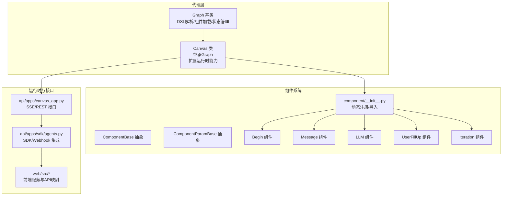
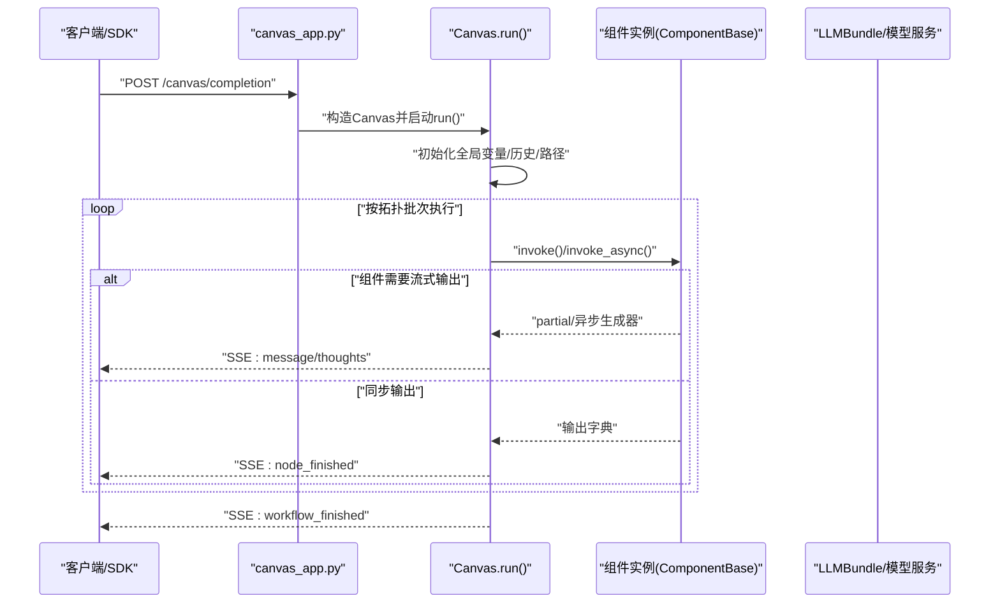
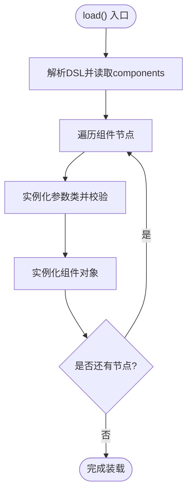
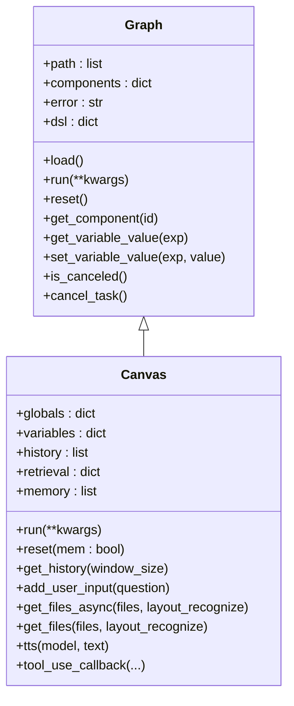
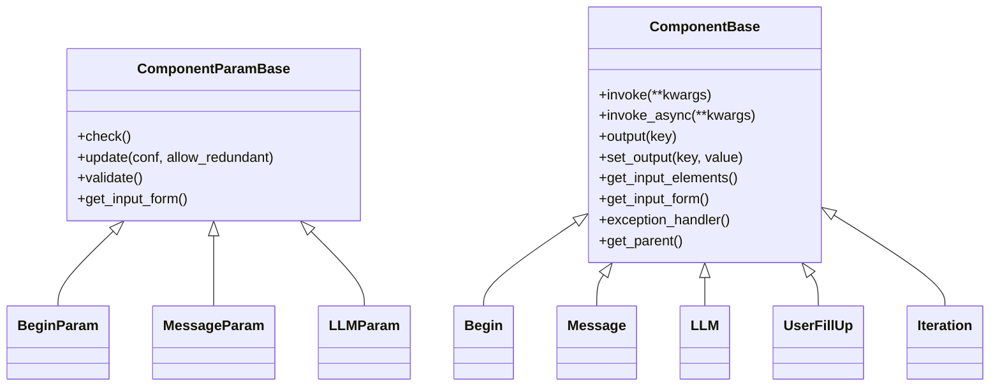
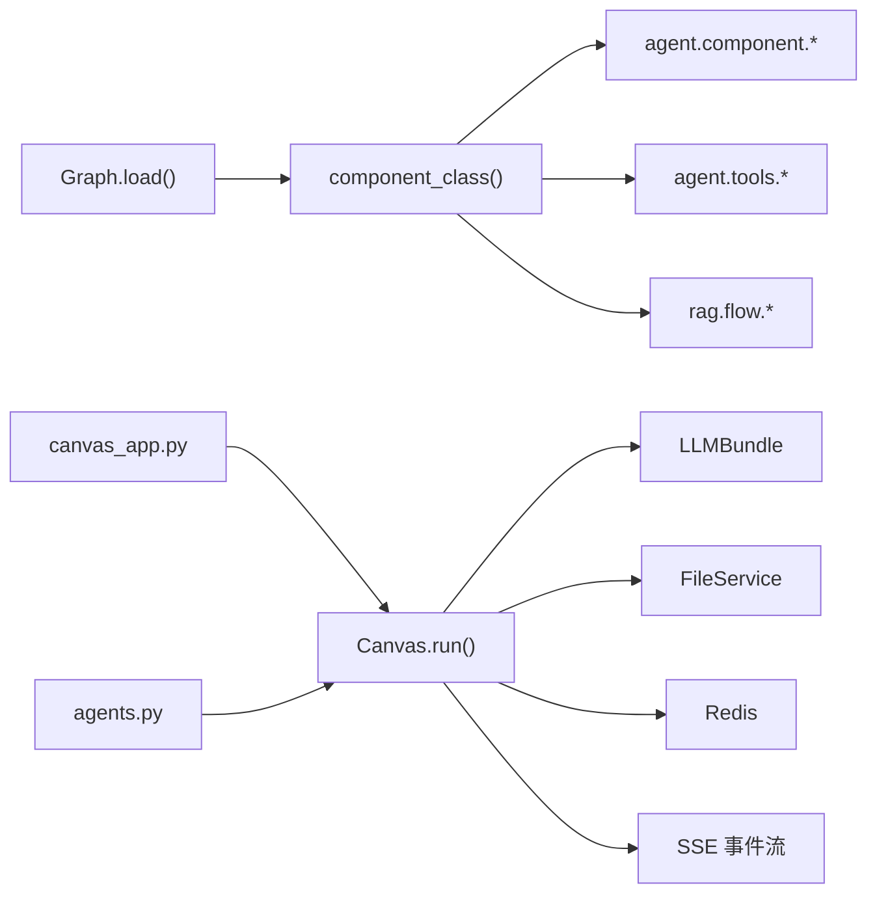

# Canvas架构设计

<cite>
**本文引用的文件**
- [agent/canvas.py](file://agent/canvas.py)
- [agent/component/base.py](file://agent/component/base.py)
- [agent/component/__init__.py](file://agent/component/__init__.py)
- [agent/component/begin.py](file://agent/component/begin.py)
- [agent/component/message.py](file://agent/component/message.py)
- [agent/component/llm.py](file://agent/component/llm.py)
- [agent/component/fillup.py](file://agent/component/fillup.py)
- [agent/component/iteration.py](file://agent/component/iteration.py)
- [agent/test/dsl_examples/retrieval_and_generate.json](file://agent/test/dsl_examples/retrieval_and_generate.json)
- [agent/test/client.py](file://agent/test/client.py)
- [api/apps/canvas_app.py](file://api/apps/canvas_app.py)
- [api/apps/sdk/agents.py](file://api/apps/sdk/agents.py)
- [web/src/services/agent-service.ts](file://web/src/services/agent-service.ts)
- [web/src/utils/api.ts](file://web/src/utils/api.ts)
</cite>

## 目录
1. [引言](#引言)
2. [项目结构](#项目结构)
3. [核心组件](#核心组件)
4. [架构总览](#架构总览)
5. [详细组件分析](#详细组件分析)
6. [依赖分析](#依赖分析)
7. [性能考量](#性能考量)
8. [故障排查指南](#故障排查指南)
9. [结论](#结论)
10. [附录：Canvas API 参考](#附录canvas-api-参考)

## 引言
本文件面向希望深入理解代理工作流底层架构与Canvas设计的开发者，系统化阐述以下主题：
- Graph基类的DSL解析、组件加载与执行状态管理
- Canvas类的继承关系、扩展能力与运行时特性（全局变量、历史记录、检索结果缓存）
- 组件系统的设计（注册机制、参数校验、生命周期）
- Canvas类的完整API参考与使用范式
- 架构图与流程图，帮助快速定位扩展点与集成方式

## 项目结构
Canvas架构位于Python后端的agent子模块中，围绕Graph与Canvas两大抽象展开，配合组件系统（component）与工具系统（tools）实现可组合的代理工作流。

**图表来源**
- [agent/canvas.py:42-281](file://agent/canvas.py#L42-L281)
- [agent/component/base.py:365-585](file://agent/component/base.py#L365-L585)
- [agent/component/__init__.py:51-59](file://agent/component/__init__.py#L51-L59)
- [api/apps/canvas_app.py:217-235](file://api/apps/canvas_app.py#L217-L235)
- [api/apps/sdk/agents.py:710-732](file://api/apps/sdk/agents.py#L710-L732)
- [web/src/services/agent-service.ts:36-133](file://web/src/services/agent-service.ts#L36-L133)

**章节来源**
- [agent/canvas.py:42-281](file://agent/canvas.py#L42-L281)
- [agent/component/base.py:365-585](file://agent/component/base.py#L365-L585)
- [agent/component/__init__.py:51-59](file://agent/component/__init__.py#L51-L59)
- [api/apps/canvas_app.py:217-235](file://api/apps/canvas_app.py#L217-L235)
- [api/apps/sdk/agents.py:710-732](file://api/apps/sdk/agents.py#L710-L732)
- [web/src/services/agent-service.ts:36-133](file://web/src/services/agent-service.ts#L36-L133)

## 核心组件
- Graph基类：负责从DSL字符串解析组件图，完成组件参数校验与实例化，维护执行路径、错误状态与变量解析。
- Canvas类：在Graph基础上扩展全局变量、历史记录、检索缓存、文件处理、TTS输出等运行时能力，并提供异步流式执行与事件回调。
- 组件系统：通过component/__init__.py动态扫描并注册组件类；每个组件由ComponentBase与ComponentParamBase构成，统一参数校验、输入输出管理与生命周期。

**章节来源**
- [agent/canvas.py:42-281](file://agent/canvas.py#L42-L281)
- [agent/component/base.py:40-585](file://agent/component/base.py#L40-L585)
- [agent/component/__init__.py:51-59](file://agent/component/__init__.py#L51-L59)

## 架构总览
Canvas工作流以“DSL驱动的有向无环图”为核心，组件按拓扑顺序执行，支持条件分支、循环、用户交互与异常处理。Canvas在运行时维护全局变量表、对话历史、检索结果缓存，并通过SSE向客户端推送事件。

**图表来源**
- [api/apps/canvas_app.py:231-235](file://api/apps/canvas_app.py#L231-L235)
- [agent/canvas.py:375-668](file://agent/canvas.py#L375-L668)
- [agent/component/base.py:407-447](file://agent/component/base.py#L407-L447)
- [agent/component/llm.py:367-446](file://agent/component/llm.py#L367-L446)

**章节来源**
- [agent/canvas.py:375-668](file://agent/canvas.py#L375-L668)
- [agent/component/base.py:407-447](file://agent/component/base.py#L407-L447)
- [agent/component/llm.py:367-446](file://agent/component/llm.py#L367-L446)
- [api/apps/canvas_app.py:231-235](file://api/apps/canvas_app.py#L231-L235)

## 详细组件分析

### Graph基类：DSL解析、组件加载与状态管理
- DSL解析与装载
  - 从JSON DSL读取components、path、history、retrieval、globals等字段，构建组件字典与执行路径。
  - 使用component_class动态导入组件类与参数类，实例化参数对象并执行check()进行参数校验。
- 执行状态管理
  - 维护path列表表示当前执行位置，支持分支与循环的路径推进。
  - 提供get_component、get_component_obj、get_component_type等查询方法。
  - 支持取消任务（Redis标记）、重置（清空输出、日志、取消标记）。
- 变量系统
  - 支持sys.*、env.*、组件输出变量的引用与赋值，提供get_variable_value、set_variable_value与路径访问。
  - 字符串内变量占位符解析，支持partial/异步生成器的延迟求值。

**图表来源**
- [agent/canvas.py:94-110](file://agent/canvas.py#L94-L110)
- [agent/component/__init__.py:51-59](file://agent/component/__init__.py#L51-L59)

**章节来源**
- [agent/canvas.py:94-110](file://agent/canvas.py#L94-L110)
- [agent/canvas.py:166-270](file://agent/canvas.py#L166-L270)
- [agent/component/__init__.py:51-59](file://agent/component/__init__.py#L51-L59)

### Canvas类：继承关系与扩展功能
- 继承关系
  - Canvas(Graph)：在Graph基础上扩展运行时能力。
- 全局变量管理
  - globals包含sys.query、sys.user_id、sys.conversation_turns、sys.files、sys.history、sys.date等键。
  - 支持env.*环境变量回填与类型化重置。
- 历史记录与检索缓存
  - history记录对话轮次；retrieval/doc_aggs用于缓存检索片段与聚合信息。
- 文件与多媒体
  - get_files_async/get_files支持图片转base64与非图片文件解析；TTS音频合成与事件推送。
- 运行时事件流
  - 通过SSE事件：workflow_started、node_started、message、message_end、node_finished、workflow_finished等。
- Webhook与外部集成
  - 支持webhook_payload注入初始输入；SDK中通过background_run持久化DSL与追踪。

**图表来源**
- [agent/canvas.py:42-281](file://agent/canvas.py#L42-L281)
- [agent/canvas.py:283-800](file://agent/canvas.py#L283-L800)

**章节来源**
- [agent/canvas.py:283-800](file://agent/canvas.py#L283-L800)

### 组件系统：注册机制、参数校验与生命周期
- 注册机制
  - component/__init__.py扫描agent.component目录下所有组件模块，动态导入并注册到全局命名空间，提供component_class统一查找入口。
- 参数校验
  - ComponentParamBase提供check()抽象方法，具体组件实现各自check()逻辑；内置多种check_*辅助方法（字符串、正数、布尔、范围等）。
  - 支持参数深度更新（settings.PARAM_MAXDEPTH限制嵌套深度），并保留“用户喂入参数”与“废弃参数”的元信息。
- 生命周期
  - ComponentBase封装invoke/invoke_async，统一计时、错误记录、调试输入与输出管理。
  - 支持异常处理策略（exception_method/comment/goto/default_value）与父组件/上下游查询。

**图表来源**
- [agent/component/base.py:40-585](file://agent/component/base.py#L40-L585)
- [agent/component/begin.py:20-64](file://agent/component/begin.py#L20-L64)
- [agent/component/message.py:41-210](file://agent/component/message.py#L41-L210)
- [agent/component/llm.py:34-110](file://agent/component/llm.py#L34-L110)
- [agent/component/fillup.py:24-83](file://agent/component/fillup.py#L24-L83)
- [agent/component/iteration.py:27-72](file://agent/component/iteration.py#L27-L72)

**章节来源**
- [agent/component/base.py:40-585](file://agent/component/base.py#L40-L585)
- [agent/component/__init__.py:51-59](file://agent/component/__init__.py#L51-L59)
- [agent/component/begin.py:20-64](file://agent/component/begin.py#L20-L64)
- [agent/component/message.py:41-210](file://agent/component/message.py#L41-L210)
- [agent/component/llm.py:34-110](file://agent/component/llm.py#L34-L110)
- [agent/component/fillup.py:24-83](file://agent/component/fillup.py#L24-L83)
- [agent/component/iteration.py:27-72](file://agent/component/iteration.py#L27-L72)

### 关键组件用法示例与扩展点
- Begin组件：作为工作流入口，支持“会话/任务/Webhook”三种模式，解析输入元素并注入到下游组件。
- Message组件：支持模板渲染（Jinja2沙箱）、流式输出（partial/异步生成器）、内容格式转换（Markdown/HTML/PDF/DOCX/XLSX）与记忆存储。
- LLM组件：统一系统提示与消息构建，支持结构化输出（JSON Schema）、流式增量输出、图像多模态输入、引用标注与工具调用摘要。
- UserFillUp组件：在需要用户补充输入时触发，收集用户输入并通过SSE返回“user_inputs”事件。
- Iteration组件：作为迭代容器，根据上游数组变量批量派生子项（IterationItem）。

**章节来源**
- [agent/component/begin.py:20-64](file://agent/component/begin.py#L20-L64)
- [agent/component/message.py:66-210](file://agent/component/message.py#L66-L210)
- [agent/component/llm.py:83-455](file://agent/component/llm.py#L83-L455)
- [agent/component/fillup.py:36-83](file://agent/component/fillup.py#L36-L83)
- [agent/component/iteration.py:49-72](file://agent/component/iteration.py#L49-L72)

## 依赖分析
- 组件导入链
  - Graph.load()依赖component_class，后者在agent.component、agent.tools、rag.flow三个包中查找组件类。
- 运行时依赖
  - Canvas依赖LLMBundle、FileService、Redis、Tenant默认模型配置等服务。
- 接口依赖
  - canvas_app.py通过SSE推送事件；SDK与Webhook通过agents.py后台运行并持久化DSL。

**图表来源**
- [agent/canvas.py:94-110](file://agent/canvas.py#L94-L110)
- [agent/component/__init__.py:51-59](file://agent/component/__init__.py#L51-L59)
- [api/apps/canvas_app.py:231-235](file://api/apps/canvas_app.py#L231-L235)
- [api/apps/sdk/agents.py:710-732](file://api/apps/sdk/agents.py#L710-L732)

**章节来源**
- [agent/canvas.py:94-110](file://agent/canvas.py#L94-L110)
- [agent/component/__init__.py:51-59](file://agent/component/__init__.py#L51-L59)
- [api/apps/canvas_app.py:231-235](file://api/apps/canvas_app.py#L231-L235)
- [api/apps/sdk/agents.py:710-732](file://api/apps/sdk/agents.py#L710-L732)

## 性能考量
- 并发与限流
  - 组件并发通过线程池（ThreadPoolExecutor）与异步信号量控制；组件内部可通过环境变量设置最大并发。
- 超时与取消
  - 组件执行与LLM调用均设置超时装饰器；Canvas提供is_canceled/cancel_task，确保长耗时操作可被及时中断。
- 流式输出
  - Message与LLM支持partial/异步生成器，避免一次性缓冲大文本，降低内存峰值。
- 缓存与复用
  - retrieval/doc_aggs与history在Canvas中复用，减少重复计算与网络请求。

**章节来源**
- [agent/component/base.py:365-447](file://agent/component/base.py#L365-L447)
- [agent/canvas.py:435-482](file://agent/canvas.py#L435-L482)
- [agent/component/llm.py:367-446](file://agent/component/llm.py#L367-L446)
- [agent/component/message.py:111-174](file://agent/component/message.py#L111-L174)

## 故障排查指南
- 常见问题
  - 参数校验失败：检查ComponentParamBase.check()实现与DSL中的参数类型/取值范围。
  - 变量引用错误：确认变量名格式（sys.*、env.*、组件@输出键）与作用域。
  - 组件未找到：确认component_class导入路径与组件类名一致。
  - 任务被取消：检查Redis中的取消标记或has_canceled返回值。
- 日志与追踪
  - Canvas.tool_use_callback将工具调用轨迹写入Redis；SSE事件包含节点开始/结束、消息、错误等信息。
- 单元测试与示例
  - 使用agent/test/client.py提供的命令行示例，结合agent/test/dsl_examples中的DSL样例快速验证。

**章节来源**
- [agent/canvas.py:271-281](file://agent/canvas.py#L271-L281)
- [agent/canvas.py:785-800](file://agent/canvas.py#L785-L800)
- [agent/test/client.py:16-47](file://agent/test/client.py#L16-L47)
- [agent/test/dsl_examples/retrieval_and_generate.json:1-61](file://agent/test/dsl_examples/retrieval_and_generate.json#L1-L61)

## 结论
Canvas架构以Graph为骨架，以Canvas为运行时载体，通过组件系统实现高度可组合的代理工作流。其核心优势在于：
- DSL驱动的声明式编排
- 完整的变量系统与事件流
- 统一的组件生命周期与参数校验
- 易于扩展的注册机制与丰富的内置组件

开发者可基于此框架快速扩展新组件、接入第三方工具，并通过SSE/SDK/Webhook实现多端集成。

## 附录：Canvas API 参考

### 初始化参数
- dsl: string
  - 工作流DSL字符串，包含components、path、history、retrieval、globals等字段。
- tenant_id: string
  - 租户标识，用于模型与资源选择。
- task_id: string
  - 任务唯一ID，用于追踪与取消。
- canvas_id: string
  - Canvas实例ID，用于记忆与追踪。
- custom_header: dict
  - 自定义HTTP头，传递给组件与工具。

**章节来源**
- [agent/canvas.py:285-296](file://agent/canvas.py#L285-L296)

### 核心方法
- run(**kwargs)
  - 异步执行工作流，返回SSE事件流。支持query、user_id、files、inputs、webhook_payload等参数。
- reset(mem: bool=False)
  - 重置运行时状态。mem=False时同时清空history/retrieval/memory。
- get_history(window_size: int)
  - 获取最近N轮对话历史。
- add_user_input(question: str)
  - 追加用户输入到历史。
- get_files_async(files: list, layout_recognize: str=None)
  - 异步解析文件，支持图片转base64与非图片文件解析。
- get_files(files: list, layout_recognize: str=None)
  - 同步包装器，兼容同步组件调用路径。
- tts(model, text: str)
  - 文本转语音，返回十六进制编码的音频二进制。
- tool_use_callback(agent_id: str, func_name: str, params: dict, result: Any, elapsed_time: float=None)
  - 记录工具调用轨迹至Redis。

**章节来源**
- [agent/canvas.py:375-668](file://agent/canvas.py#L375-L668)
- [agent/canvas.py:757-784](file://agent/canvas.py#L757-L784)
- [agent/canvas.py:785-800](file://agent/canvas.py#L785-L800)

### 状态属性
- globals: dict
  - 全局变量表，包含sys.*与env.*键。
- variables: dict
  - Canvas变量定义与默认值。
- history: list
  - 对话历史，每轮为(role, content)元组。
- retrieval: dict
  - 检索结果缓存，包含chunks与doc_aggs。
- memory: list
  - 记忆片段列表。

**章节来源**
- [agent/canvas.py:286-323](file://agent/canvas.py#L286-L323)

### DSL 示例与运行方式
- 示例DSL
  - retrieval_and_generate.json展示了Begin→Retrieval→LLM→Message的典型链路。
- 运行方式
  - 命令行：python agent/test/client.py -s <dsl.json> -t <tenant_id>
  - 接口：/canvas/completion（SSE），/canvas/input_form（获取输入表单）

**章节来源**
- [agent/test/dsl_examples/retrieval_and_generate.json:1-61](file://agent/test/dsl_examples/retrieval_and_generate.json#L1-L61)
- [agent/test/client.py:16-47](file://agent/test/client.py#L16-L47)
- [api/apps/canvas_app.py:217-235](file://api/apps/canvas_app.py#L217-L235)
- [web/src/utils/api.ts:183-249](file://web/src/utils/api.ts#L183-L249)
- [web/src/services/agent-service.ts:36-133](file://web/src/services/agent-service.ts#L36-L133)

### 扩展Canvas与组件的实践建议
- 扩展Canvas
  - 在Canvas中新增全局变量键、历史记录字段或缓存策略，注意与SSE事件保持一致。
  - 通过tool_use_callback扩展工具调用追踪维度。
- 实现自定义组件
  - 新建agent/component/<your_comp>.py，定义YourCompParam与YourComp，实现check()与_invoke/_invoke_async。
  - 在component/__init__.py中确保自动注册生效。
- 集成第三方工具
  - 在LLM/Message等组件中调用外部API，注意超时与流式输出的兼容性。
  - 使用SSE事件向前端推送进度与中间结果。

**章节来源**
- [agent/component/base.py:40-585](file://agent/component/base.py#L40-L585)
- [agent/component/__init__.py:51-59](file://agent/component/__init__.py#L51-L59)
- [agent/component/llm.py:367-446](file://agent/component/llm.py#L367-L446)
- [agent/component/message.py:181-210](file://agent/component/message.py#L181-L210)