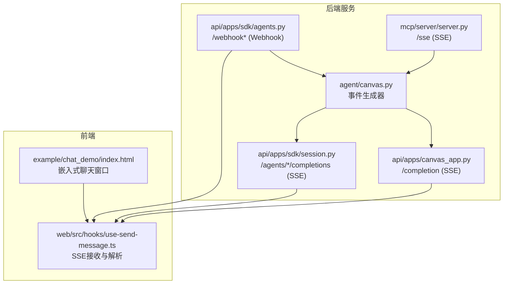
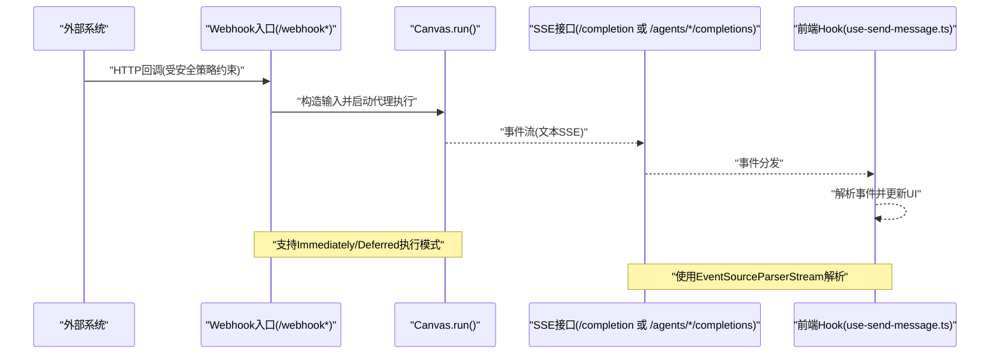
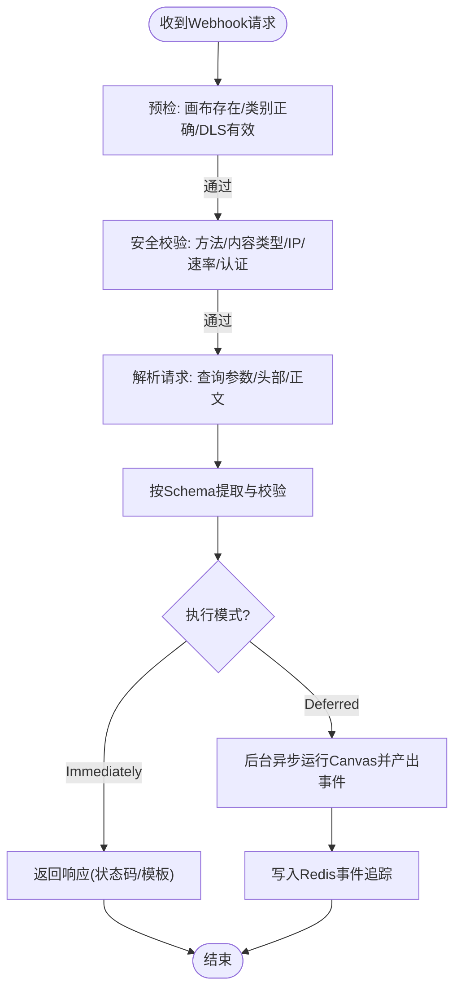
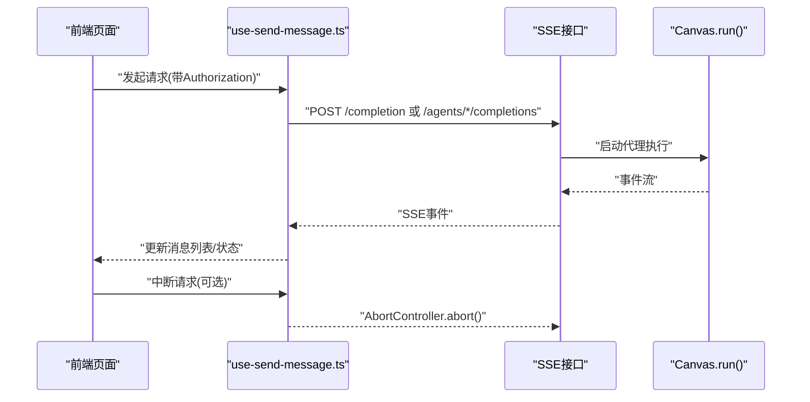
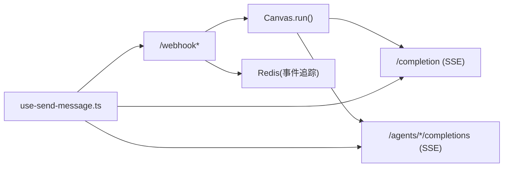

# WebSocket接口

<cite>
**本文引用的文件**
- [agent/canvas.py](file://agent/canvas.py)
- [api/apps/canvas_app.py](file://api/apps/canvas_app.py)
- [api/apps/sdk/agents.py](file://api/apps/sdk/agents.py)
- [api/apps/sdk/session.py](file://api/apps/sdk/session.py)
- [web/src/hooks/use-send-message.ts](file://web/src/hooks/use-send-message.ts)
- [mcp/server/server.py](file://mcp/server/server.py)
- [example/chat_demo/index.html](file://example/chat_demo/index.html)
- [test/testcases/test_web_api/test_agent_app/test_agents_webhook_unit.py](file://test/testcases/test_web_api/test_agent_app/test_agents_webhook_unit.py)
</cite>

## 目录
1. [简介](#简介)
2. [项目结构](#项目结构)
3. [核心组件](#核心组件)
4. [架构总览](#架构总览)
5. [详细组件分析](#详细组件分析)
6. [依赖分析](#依赖分析)
7. [性能考虑](#性能考虑)
8. [故障排查指南](#故障排查指南)
9. [结论](#结论)
10. [附录](#附录)

## 简介
本技术文档聚焦于代理工作流的实时通信机制与事件推送系统，涵盖以下主题：
- 事件流定义与格式：workflow_started、node_started、node_finished、message、message_end、workflow_finished、user_inputs、node_logs 等事件类型及其字段语义。
- WebSocket/SSE 连接建立与管理：连接参数、认证机制、断线重连策略（基于现有 SSE 实现的实践建议）。
- 实时数据传输：消息格式、编码方式、流式传输细节。
- Webhook 集成：外部系统回调请求处理、数据同步、状态通知与测试用例。
- 客户端集成示例：前端如何接收与处理事件、构建实时反馈与交互式界面。

## 项目结构
围绕 WebSocket/SSE 的相关模块主要分布在后端服务层与前端 Hook 层：
- 后端服务层
  - 代理画布运行与事件生成：agent/canvas.py
  - 画布完成接口（SSE）：api/apps/canvas_app.py
  - SDK 会话与代理完成接口（SSE）：api/apps/sdk/session.py
  - Webhook 触发与事件追踪：api/apps/sdk/agents.py
  - MCP SSE 传输（可选）：mcp/server/server.py
- 前端 Hook 层
  - SSE 接收与解析：web/src/hooks/use-send-message.ts
- 示例与测试
  - Webhook 测试用例：test/testcases/test_web_api/test_agent_app/test_agents_webhook_unit.py
  - 聊天示例页面：example/chat_demo/index.html

图表来源
- [agent/canvas.py:375-668](file://agent/canvas.py#L375-L668)
- [api/apps/canvas_app.py:231-264](file://api/apps/canvas_app.py#L231-L264)
- [api/apps/sdk/session.py:549-592](file://api/apps/sdk/session.py#L549-L592)
- [api/apps/sdk/agents.py:156-832](file://api/apps/sdk/agents.py#L156-L832)
- [mcp/server/server.py:592-604](file://mcp/server/server.py#L592-L604)
- [web/src/hooks/use-send-message.ts:89-194](file://web/src/hooks/use-send-message.ts#L89-L194)
- [example/chat_demo/index.html:1-19](file://example/chat_demo/index.html#L1-L19)

章节来源
- [agent/canvas.py:375-668](file://agent/canvas.py#L375-L668)
- [api/apps/canvas_app.py:231-264](file://api/apps/canvas_app.py#L231-L264)
- [api/apps/sdk/session.py:549-592](file://api/apps/sdk/session.py#L549-L592)
- [api/apps/sdk/agents.py:156-832](file://api/apps/sdk/agents.py#L156-L832)
- [mcp/server/server.py:592-604](file://mcp/server/server.py#L592-L604)
- [web/src/hooks/use-send-message.ts:89-194](file://web/src/hooks/use-send-message.ts#L89-L194)
- [example/chat_demo/index.html:1-19](file://example/chat_demo/index.html#L1-L19)

## 核心组件
- 事件生成器（Canvas）
  - 在代理工作流执行期间，通过装饰器函数统一产出标准化事件对象，包含 event、message_id、task_id、created_at、data 等字段。
  - 支持工作流生命周期事件（workflow_started、node_started、node_finished、workflow_finished）、消息事件（message、message_end）、用户输入提示（user_inputs）以及节点日志（node_logs）等。
- SSE 接口
  - 画布完成接口与 SDK 代理完成接口均以 text/event-stream 形式返回事件流，并设置必要的响应头以禁用缓冲与保持长连接。
- Webhook 接口
  - 提供外部系统触发代理的能力，支持方法白名单、内容类型校验、最大体限制、IP 白名单、速率限制、Token/Bearer/JWT 认证等安全策略；支持 Immediately 与 Deferred 两种执行模式。
- 前端 SSE Hook
  - 使用 fetch + ReadableStream + EventSourceParserStream 解析服务端事件，按事件类型更新 UI，支持中断与错误处理。

章节来源
- [agent/canvas.py:412-421](file://agent/canvas.py#L412-L421)
- [agent/canvas.py:432-668](file://agent/canvas.py#L432-L668)
- [api/apps/canvas_app.py:231-264](file://api/apps/canvas_app.py#L231-L264)
- [api/apps/sdk/session.py:549-592](file://api/apps/sdk/session.py#L549-L592)
- [api/apps/sdk/agents.py:156-832](file://api/apps/sdk/agents.py#L156-L832)
- [web/src/hooks/use-send-message.ts:89-194](file://web/src/hooks/use-send-message.ts#L89-L194)

## 架构总览
下图展示了从外部系统到后端代理执行再到前端事件消费的完整链路，包括 Webhook、SSE 以及 MCP SSE 传输路径。

图表来源
- [api/apps/sdk/agents.py:156-832](file://api/apps/sdk/agents.py#L156-L832)
- [agent/canvas.py:375-668](file://agent/canvas.py#L375-L668)
- [api/apps/canvas_app.py:231-264](file://api/apps/canvas_app.py#L231-L264)
- [api/apps/sdk/session.py:549-592](file://api/apps/sdk/session.py#L549-L592)
- [web/src/hooks/use-send-message.ts:89-194](file://web/src/hooks/use-send-message.ts#L89-L194)

## 详细组件分析

### 事件流定义与格式
- 通用事件结构
  - 字段：event（事件类型）、message_id（消息标识）、task_id（任务标识）、created_at（事件时间戳）、data（事件载荷）。
- 生命周期事件
  - workflow_started：data 包含 inputs。
  - node_started：data 包含组件信息（inputs、created_at、component_id、component_name、component_type、thoughts）。
  - node_finished：data 包含组件输入输出、组件元信息、错误、耗时、创建时间等。
  - workflow_finished：data 包含输入输出、耗时、创建时间等。
  - user_inputs：data 包含需要用户补充的 inputs 与提示 tips。
  - node_logs：data 包含组件日志与工具调用轨迹（用于调试与审计）。
- 消息事件
  - message：data 包含 content、audio_binary（可选）、start_to_think/end_to_think 标记（用于思维片段）。
  - message_end：data 可能包含 reference（引用信息）等。

章节来源
- [agent/canvas.py:412-421](file://agent/canvas.py#L412-L421)
- [agent/canvas.py:432-668](file://agent/canvas.py#L432-L668)
- [web/src/hooks/use-send-message.ts:10-84](file://web/src/hooks/use-send-message.ts#L10-L84)

### SSE 接口与连接管理
- 连接建立
  - 画布完成接口与 SDK 代理完成接口均以 GET/POST 方式触发，返回 text/event-stream。
  - 设置响应头：Cache-control=no-cache、Connection=keep-alive、X-Accel-Buffering=no、Content-Type=text/event-stream; charset=utf-8。
- 断线重连策略（建议）
  - 基于浏览器 EventSource 的自动重连机制；若需自定义，可在前端监听 close/error 并按指数退避重试。
  - 前端 Hook 已内置 AbortController，支持主动中断请求。
- 认证机制
  - 画布完成接口通过 Authorization 头传递 API Key；SDK 接口通过令牌校验。
  - Webhook 支持多种认证：Basic、Token、JWT；并支持 IP 白名单与速率限制。

章节来源
- [api/apps/canvas_app.py:231-264](file://api/apps/canvas_app.py#L231-L264)
- [api/apps/sdk/session.py:549-592](file://api/apps/sdk/session.py#L549-L592)
- [web/src/hooks/use-send-message.ts:117-125](file://web/src/hooks/use-send-message.ts#L117-L125)

### 实时数据传输与编码
- 编码方式
  - 事件体采用 JSON 序列化，每条事件以 data: 开头，双换行分隔。
  - 前端使用 TextDecoderStream + EventSourceParserStream 解析事件流。
- 流式传输
  - Canvas.run() 以异步生成器逐条产出事件，SSE 接口直接透传至客户端。
  - 对于语音合成场景，message 中可携带音频二进制的十六进制字符串，前端可据此播放。

章节来源
- [agent/canvas.py:375-668](file://agent/canvas.py#L375-L668)
- [web/src/hooks/use-send-message.ts:129-132](file://web/src/hooks/use-send-message.ts#L129-L132)

### Webhook 集成方案
- 触发与安全
  - 支持多方法白名单、内容类型校验、最大体限制、IP 白名单、速率限制、Token/Bearer/JWT 认证。
  - Deferred 模式下，Webhook 返回即时响应，后台异步执行并通过 SSE 输出事件；Immediately 模式下，根据模板配置返回响应。
- 数据同步与状态通知
  - Webhook 执行过程中将事件写入 Redis，提供 /webhook_trace 接口按 since_ts 拉取增量事件，便于外部系统进行状态查询与回放。
- 测试用例
  - 单测覆盖了 Webhook 预检、方法限制、内容类型不匹配、速率限制、认证失败等异常路径。

图表来源
- [api/apps/sdk/agents.py:156-832](file://api/apps/sdk/agents.py#L156-L832)
- [test/testcases/test_web_api/test_agent_app/test_agents_webhook_unit.py:461-487](file://test/testcases/test_web_api/test_agent_app/test_agents_webhook_unit.py#L461-L487)

章节来源
- [api/apps/sdk/agents.py:156-832](file://api/apps/sdk/agents.py#L156-L832)
- [test/testcases/test_web_api/test_agent_app/test_agents_webhook_unit.py:461-487](file://test/testcases/test_web_api/test_agent_app/test_agents_webhook_unit.py#L461-L487)

### 客户端集成示例
- 前端 Hook
  - use-send-message.ts 封装了 SSE 请求、事件解析、错误处理与中断控制；支持按事件类型更新 UI。
  - 事件类型枚举包含 workflow_started、node_started、node_finished、message、message_end、workflow_finished、user_inputs、node_logs。
- 示例页面
  - example/chat_demo/index.html 展示了如何在页面中嵌入聊天窗口并与后端 SSE 交互。

图表来源
- [web/src/hooks/use-send-message.ts:89-194](file://web/src/hooks/use-send-message.ts#L89-L194)
- [api/apps/canvas_app.py:231-264](file://api/apps/canvas_app.py#L231-L264)
- [api/apps/sdk/session.py:549-592](file://api/apps/sdk/session.py#L549-L592)
- [example/chat_demo/index.html:1-19](file://example/chat_demo/index.html#L1-L19)

章节来源
- [web/src/hooks/use-send-message.ts:89-194](file://web/src/hooks/use-send-message.ts#L89-L194)
- [example/chat_demo/index.html:1-19](file://example/chat_demo/index.html#L1-L19)

## 依赖分析
- 组件耦合
  - Canvas.run() 是事件流的核心生产者，被画布完成接口与 SDK 代理完成接口复用。
  - Webhook 入口在前置校验通过后同样委托 Canvas.run() 执行，并将事件写入 Redis 以便后续查询。
- 外部依赖
  - 前端使用标准 EventSourceParserStream 解析事件流。
  - Webhook 安全策略依赖 Redis（速率限制）与 JWT 库。

图表来源
- [agent/canvas.py:375-668](file://agent/canvas.py#L375-L668)
- [api/apps/canvas_app.py:231-264](file://api/apps/canvas_app.py#L231-L264)
- [api/apps/sdk/session.py:549-592](file://api/apps/sdk/session.py#L549-L592)
- [api/apps/sdk/agents.py:662-678](file://api/apps/sdk/agents.py#L662-L678)
- [web/src/hooks/use-send-message.ts:89-194](file://web/src/hooks/use-send-message.ts#L89-L194)

章节来源
- [agent/canvas.py:375-668](file://agent/canvas.py#L375-L668)
- [api/apps/canvas_app.py:231-264](file://api/apps/canvas_app.py#L231-L264)
- [api/apps/sdk/session.py:549-592](file://api/apps/sdk/session.py#L549-L592)
- [api/apps/sdk/agents.py:662-678](file://api/apps/sdk/agents.py#L662-L678)
- [web/src/hooks/use-send-message.ts:89-194](file://web/src/hooks/use-send-message.ts#L89-L194)

## 性能考虑
- SSE 响应头
  - 设置 X-Accel-Buffering=no 与 keep-alive，避免代理层缓冲导致延迟。
- 事件粒度
  - Canvas.run() 以细粒度事件输出，前端可渐进渲染，提升感知速度。
- 并发与资源
  - 画布执行内部使用线程池与信号量控制并发，避免阻塞事件流输出。
- 前端解析
  - 使用流式解析器减少内存占用，及时中断无效请求。

## 故障排查指南
- 常见问题
  - 认证失败：检查 Authorization 头或令牌是否正确。
  - 速率限制：确认 Redis 可用与限流配置；必要时调整 per/limit。
  - 内容类型不匹配：确保 Content-Type 与 Webhook 配置一致。
  - 方法不受允许：核对 methods 白名单。
- 调试手段
  - 使用 /webhook_trace 接口按 since_ts 拉取事件，定位异常点。
  - 前端 Hook 提供错误提示与中断能力，便于快速定位问题。

章节来源
- [api/apps/sdk/agents.py:196-400](file://api/apps/sdk/agents.py#L196-L400)
- [api/apps/sdk/agents.py:835-898](file://api/apps/sdk/agents.py#L835-L898)
- [web/src/hooks/use-send-message.ts:147-177](file://web/src/hooks/use-send-message.ts#L147-L177)

## 结论
该系统通过 Canvas.run() 生成标准化事件流，结合 SSE 接口与 Webhook 能力，实现了代理工作流的实时通信与事件推送。前端 Hook 提供了完善的事件解析与交互能力，配合安全策略与追踪接口，能够满足生产环境对可靠性与可观测性的要求。开发者可基于此能力快速构建响应式用户界面与外部系统集成方案。

## 附录
- 事件类型速查
  - workflow_started、node_started、node_finished、message、message_end、workflow_finished、user_inputs、node_logs
- 关键接口
  - 画布完成（SSE）：/completion
  - 代理完成（SSE）：/agents/*/completions
  - Webhook：/webhook/* 与 /webhook_test/*
  - Webhook 事件追踪：/webhook_trace/*