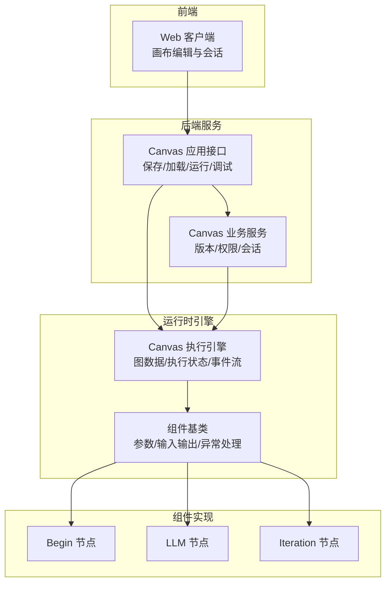
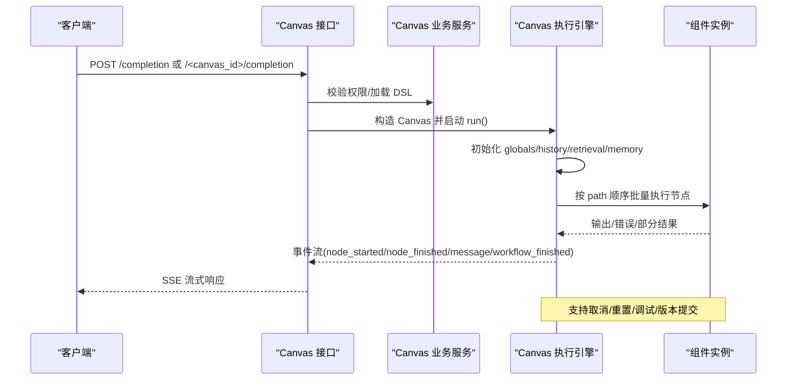
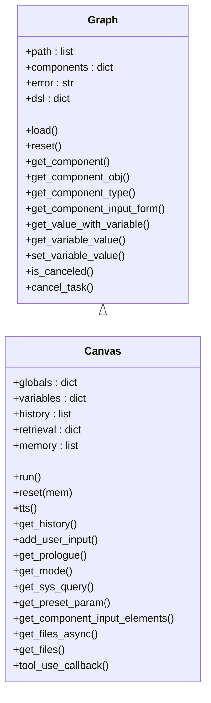
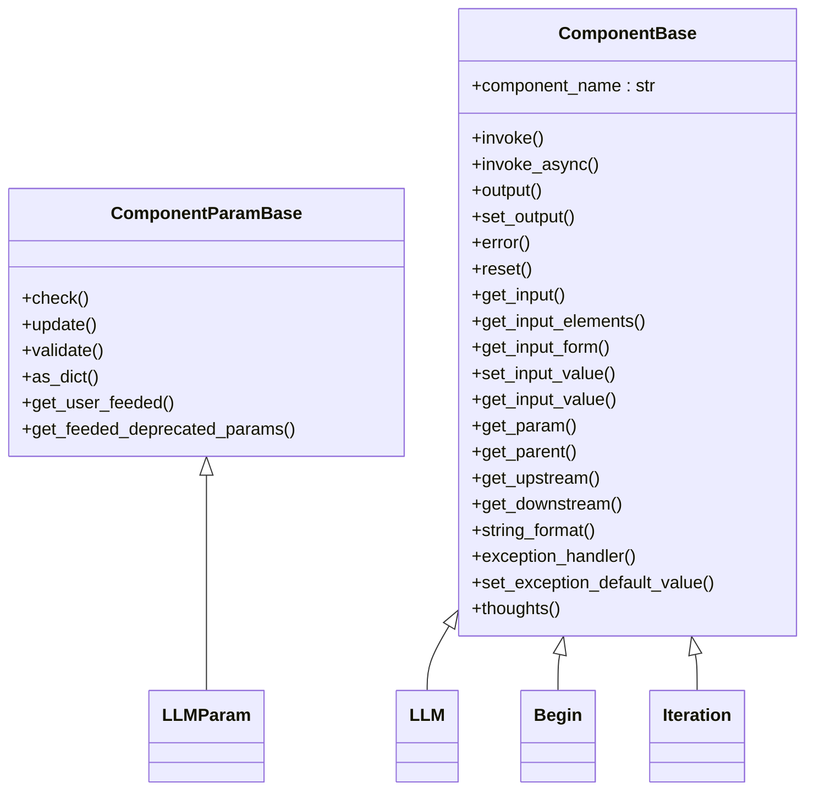
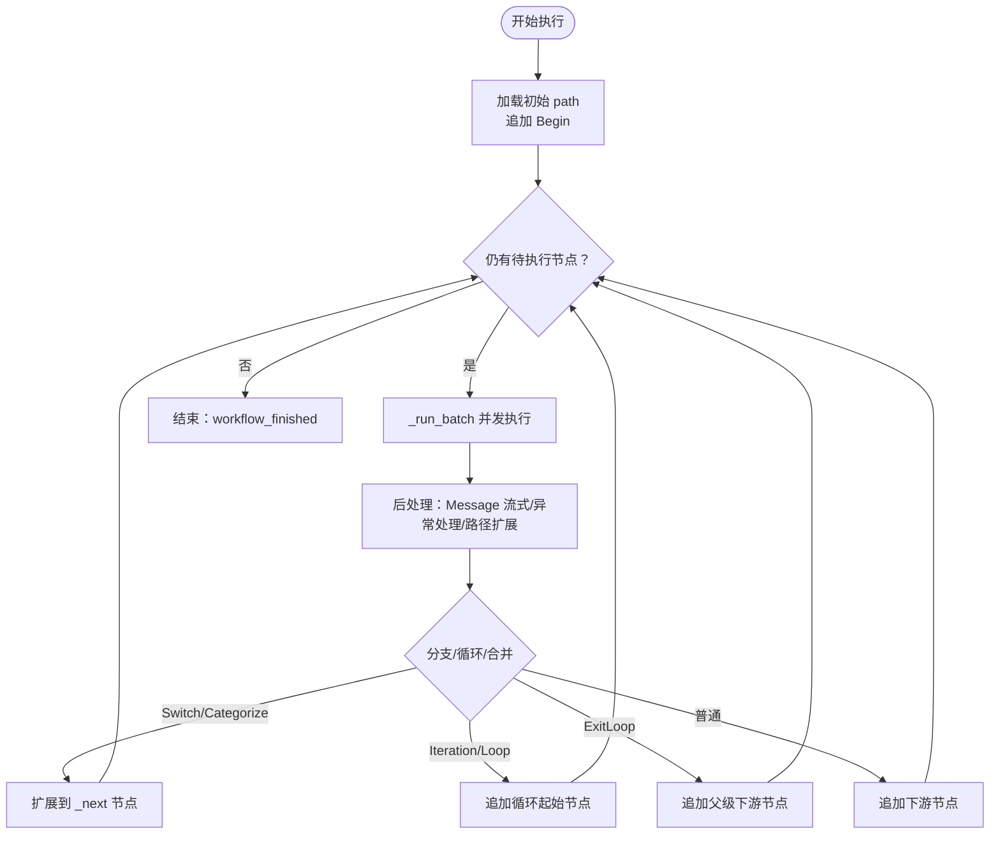
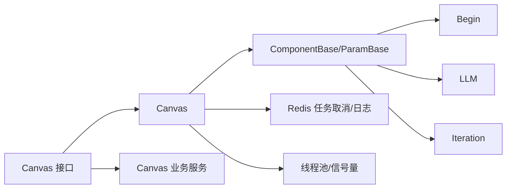

# 代理工作流设计

<cite>
**本文引用的文件**
- [agent/canvas.py](file://agent/canvas.py)
- [agent/component/base.py](file://agent/component/base.py)
- [agent/component/begin.py](file://agent/component/begin.py)
- [agent/component/llm.py](file://agent/component/llm.py)
- [agent/component/iteration.py](file://agent/component/iteration.py)
- [api/apps/canvas_app.py](file://api/apps/canvas_app.py)
- [api/db/services/canvas_service.py](file://api/db/services/canvas_service.py)
- [agent/settings.py](file://agent/settings.py)
</cite>

## 目录
1. [引言](#引言)
2. [项目结构](#项目结构)
3. [核心组件](#核心组件)
4. [架构总览](#架构总览)
5. [详细组件分析](#详细组件分析)
6. [依赖分析](#依赖分析)
7. [性能考虑](#性能考虑)
8. [故障排查指南](#故障排查指南)
9. [结论](#结论)
10. [附录：示例与最佳实践](#附录示例与最佳实践)

## 引言
本技术文档围绕“代理工作流设计”主题，系统性阐述基于图形化编排的智能代理执行引擎。文档聚焦以下目标：
- 解释图形化代理编排的核心理念与实现机制
- 深入解析图形化编辑器的交互设计（节点拖拽、连线绘制、布局算法、缩放平移）与工作流图构建原理（节点定义、边连接关系、执行顺序控制、循环处理）
- 全面剖析 Canvas 类的设计架构（图数据结构、节点管理、边管理、执行状态跟踪）
- 提供可操作的示例路径与最佳实践，帮助开发者快速上手并构建智能化自动化工作流程

说明：当前仓库未包含前端可视化编辑器源码，因此本节不直接分析具体前端实现细节；但通过后端 DSL 结构与运行时行为，可以完整还原“所见即所得”的编排语义与执行流程。

## 项目结构
本项目采用分层架构：
- 后端服务层：提供 Canvas 的保存、加载、运行、调试、版本管理等能力
- 运行时引擎层：以 Canvas 为核心，承载图数据与执行状态，调度各组件按拓扑顺序执行
- 组件层：抽象出通用组件基类与具体组件（如 Begin、LLM、Iteration 等），统一参数校验、输入输出与异常处理
- 前端层：通过 API 与后端交互，完成画布的增删改查、版本回溯、会话管理与事件流展示

图表来源
- [api/apps/canvas_app.py:187-264](file://api/apps/canvas_app.py#L187-L264)
- [api/db/services/canvas_service.py:230-283](file://api/db/services/canvas_service.py#L230-L283)
- [agent/canvas.py:283-756](file://agent/canvas.py#L283-L756)
- [agent/component/base.py:365-585](file://agent/component/base.py#L365-L585)
- [agent/component/begin.py:37-64](file://agent/component/begin.py#L37-L64)
- [agent/component/llm.py:83-455](file://agent/component/llm.py#L83-L455)
- [agent/component/iteration.py:49-72](file://agent/component/iteration.py#L49-L72)

章节来源
- [api/apps/canvas_app.py:187-264](file://api/apps/canvas_app.py#L187-L264)
- [api/db/services/canvas_service.py:230-283](file://api/db/services/canvas_service.py#L230-L283)
- [agent/canvas.py:283-756](file://agent/canvas.py#L283-L756)
- [agent/component/base.py:365-585](file://agent/component/base.py#L365-L585)

## 核心组件
- Graph/Canvas：承载图数据结构（components、path、history、retrieval、memory、globals）、变量解析与替换、并发执行与事件流、取消与重置、TTS 输出等
- ComponentBase/ComponentParamBase：组件抽象基类，统一参数校验、输入输出、异常处理、超时控制、父子关系与上下游查询
- 典型组件：
  - Begin：初始化输入、文件解析、模式切换（会话/任务/Webhook）
  - LLM：多模态提示词构造、流式输出、结构化输出、引用标注、工具调用记忆
  - Iteration：迭代容器，驱动 IterationItem 子节点逐项执行

章节来源
- [agent/canvas.py:42-165](file://agent/canvas.py#L42-L165)
- [agent/canvas.py:283-756](file://agent/canvas.py#L283-L756)
- [agent/component/base.py:40-200](file://agent/component/base.py#L40-L200)
- [agent/component/base.py:365-585](file://agent/component/base.py#L365-L585)
- [agent/component/begin.py:20-64](file://agent/component/begin.py#L20-L64)
- [agent/component/llm.py:34-128](file://agent/component/llm.py#L34-L128)
- [agent/component/iteration.py:27-72](file://agent/component/iteration.py#L27-L72)

## 架构总览
从请求到执行的端到端流程如下：

图表来源
- [api/apps/canvas_app.py:187-264](file://api/apps/canvas_app.py#L187-L264)
- [api/db/services/canvas_service.py:230-283](file://api/db/services/canvas_service.py#L230-L283)
- [agent/canvas.py:375-668](file://agent/canvas.py#L375-L668)
- [agent/component/base.py:407-447](file://agent/component/base.py#L407-L447)

## 详细组件分析

### Canvas 类设计与执行模型
- 图数据结构
  - components：节点集合，含 obj（组件实例）、upstream/downstream（拓扑关系）、parent_id（父子关系）
  - path：当前执行路径（按拓扑顺序推进）
  - history/retrieval/memory/globals：运行期状态与全局变量
- 变量系统
  - 表达式解析：支持 sys.env.envVar、cpnId@output.field 等引用
  - get_value_with_variable/get_variable_value/set_variable_value：变量读取/写入与路径解析
- 并发与批处理
  - _run_batch：基于线程池与信号量限制并发，动态调度下游可执行节点
  - 支持同步/异步组件混合执行
- 事件流与消息
  - 事件类型：workflow_started、node_started、node_finished、message、message_end、workflow_finished
  - TTS：对流式文本进行分片合成音频
- 取消与重置
  - 通过 Redis 标记任务取消
  - reset 支持保留或清空历史/检索/内存

图表来源
- [agent/canvas.py:42-165](file://agent/canvas.py#L42-L165)
- [agent/canvas.py:283-800](file://agent/canvas.py#L283-L800)

章节来源
- [agent/canvas.py:83-165](file://agent/canvas.py#L83-L165)
- [agent/canvas.py:298-374](file://agent/canvas.py#L298-L374)
- [agent/canvas.py:375-668](file://agent/canvas.py#L375-L668)
- [agent/canvas.py:669-756](file://agent/canvas.py#L669-L756)

### 组件基类与参数系统
- ComponentParamBase：参数对象基类，支持嵌套更新、内置类型校验、JSON 验证规则、弃用参数兼容
- ComponentBase：组件实例基类，统一 invoke/invoke_async、输入解析、输出管理、异常处理、父子/上下游查询、超时控制
- 变量引用：在输入文本中自动识别表达式并解析为实际值

图表来源
- [agent/component/base.py:40-200](file://agent/component/base.py#L40-L200)
- [agent/component/base.py:365-585](file://agent/component/base.py#L365-L585)
- [agent/component/llm.py:34-128](file://agent/component/llm.py#L34-L128)
- [agent/component/begin.py:20-38](file://agent/component/begin.py#L20-L38)
- [agent/component/iteration.py:27-50](file://agent/component/iteration.py#L27-L50)

章节来源
- [agent/component/base.py:40-200](file://agent/component/base.py#L40-L200)
- [agent/component/base.py:365-585](file://agent/component/base.py#L365-L585)

### Begin 组件
- 功能：根据模式（会话/任务/Webhook）初始化输入，解析文件为文本或图片数据，注入到输出
- 输入表单：来源于参数 inputs，支持文件/文本等字段
- 思路：为空实现占位，便于后续扩展

章节来源
- [agent/component/begin.py:20-64](file://agent/component/begin.py#L20-L64)

### LLM 组件
- 功能：构造系统提示词与用户消息，支持多模态（图片）、流式输出、结构化输出、引用标注、工具调用记忆
- 参数：温度、TopP、最大 token、是否引用等
- 异常处理：支持默认值/跳转分支
- 思路：根据下游是否存在 Message 决定是否返回 partial 流式输出

章节来源
- [agent/component/llm.py:34-128](file://agent/component/llm.py#L34-L128)
- [agent/component/llm.py:227-455](file://agent/component/llm.py#L227-L455)

### Iteration 组件
- 功能：作为迭代容器，持有 items_ref（数组变量），驱动子节点 IterationItem 逐项执行
- 起始点：通过 get_start 查找首个子节点

章节来源
- [agent/component/iteration.py:27-72](file://agent/component/iteration.py#L27-L72)

### 执行顺序与循环处理
- 执行顺序：Canvas.run 按 path 顺序推进，_run_batch 并发执行可执行节点，遇到 partial 输出则延迟完成事件
- 分支与合并：根据节点类型（Switch/Categorize/Loop/ExitLoop/IterationItem）决定下一条执行路径
- 循环处理：Iteration/Loop 控制重复执行；ExitLoop 在循环内触发时跳过到循环下游

图表来源
- [agent/canvas.py:435-668](file://agent/canvas.py#L435-L668)

章节来源
- [agent/canvas.py:435-668](file://agent/canvas.py#L435-L668)

## 依赖分析
- Canvas 依赖组件基类与具体组件实现，组件间通过上游/下游关系耦合
- 运行时依赖线程池与信号量控制并发，Redis 用于任务取消与日志追踪
- 服务层负责权限校验、DSL 规范化、版本管理与会话持久化

图表来源
- [agent/canvas.py:91-92](file://agent/canvas.py#L91-L92)
- [agent/component/base.py:365-447](file://agent/component/base.py#L365-L447)
- [api/apps/canvas_app.py:187-264](file://api/apps/canvas_app.py#L187-L264)
- [api/db/services/canvas_service.py:230-283](file://api/db/services/canvas_service.py#L230-L283)

章节来源
- [agent/canvas.py:91-92](file://agent/canvas.py#L91-L92)
- [agent/component/base.py:365-447](file://agent/component/base.py#L365-L447)
- [api/apps/canvas_app.py:187-264](file://api/apps/canvas_app.py#L187-L264)
- [api/db/services/canvas_service.py:230-283](file://api/db/services/canvas_service.py#L230-L283)

## 性能考虑
- 并发控制
  - 使用线程池与信号量限制同时执行的节点数量，避免资源争用
  - 对于长耗时组件建议开启异步执行路径
- I/O 优化
  - 文件解析与图片编码在独立线程执行，避免阻塞事件循环
- 内存与状态
  - history/retrieval/memory/globals 在每次 run/reset 中被合理清理或复位
- 超时与取消
  - 组件执行带超时保护，Canvas.run 支持中途取消并抛出异常

章节来源
- [agent/canvas.py:435-482](file://agent/canvas.py#L435-L482)
- [agent/component/base.py:449-451](file://agent/component/base.py#L449-L451)
- [agent/component/base.py:393-405](file://agent/component/base.py#L393-L405)

## 故障排查指南
- 任务取消
  - 通过 /cancel 接口设置取消标记，Canvas.run 将抛出取消异常并终止后续执行
- 变量引用错误
  - is_reff 用于检测表达式是否有效；get_variable_value 会解析 sys/env/其他节点输出
- 组件异常
  - invoke/invoke_async 捕获异常并写入 _ERROR；可通过 exception_handler 返回默认值或跳转分支
- 调试
  - /debug 接口可对指定组件传入参数并立即执行，查看输出；支持 LLM 的调试输入覆盖

章节来源
- [api/apps/canvas_app.py:339-346](file://api/apps/canvas_app.py#L339-L346)
- [agent/canvas.py:669-678](file://agent/canvas.py#L669-L678)
- [agent/canvas.py:193-279](file://agent/canvas.py#L193-L279)
- [agent/component/base.py:407-447](file://agent/component/base.py#L407-L447)
- [api/apps/canvas_app.py:410-444](file://api/apps/canvas_app.py#L410-L444)

## 结论
本设计以 Graph/Canvas 为核心，结合组件基类与具体组件实现，提供了高扩展、强一致、可观测的代理工作流执行框架。通过变量系统、事件流、并发控制与取消机制，能够稳定支撑复杂的分支、循环与多模态场景。尽管当前仓库未包含前端可视化编辑器源码，但从后端 DSL 与运行时行为可完整推导出“所见即所得”的编排体验。

## 附录：示例与最佳实践

### 如何创建一个基础工作流
- 编排步骤
  - 在前端画布中添加 Begin 节点与若干下游节点（如 LLM、Iteration 等）
  - 设置 Begin 的 mode（会话/任务/Webhook）与 prologue
  - 为 LLM 配置系统提示词、温度、最大 token、是否引用等参数
  - 为 Iteration 指定 items_ref（数组变量），确保其子节点为 IterationItem
- 保存与运行
  - 通过 /set 保存 DSL，随后调用 /completion 或 /<canvas_id>/completion 触发执行
  - 使用 SSE 接收事件流，实时渲染消息与中间结果

章节来源
- [agent/component/begin.py:20-38](file://agent/component/begin.py#L20-L38)
- [agent/component/llm.py:34-81](file://agent/component/llm.py#L34-L81)
- [agent/component/iteration.py:27-50](file://agent/component/iteration.py#L27-L50)
- [api/apps/canvas_app.py:74-116](file://api/apps/canvas_app.py#L74-L116)
- [api/apps/canvas_app.py:187-264](file://api/apps/canvas_app.py#L187-L264)

### 如何配置节点属性与变量
- 参数校验
  - 使用 ComponentParamBase.update 递归更新参数，支持内置类型校验与 JSON 验证规则
- 变量引用
  - 在输入文本中使用 {sys.xxx}、{env.var}、{cpnId@output.field} 等表达式
  - Canvas 提供 get_value_with_variable 与 get_variable_value 实现解析
- 输出与异常
  - 通过 set_output 写入输出；异常通过 _ERROR 字段记录，或走 exception_handler 的默认值/跳转

章节来源
- [agent/component/base.py:127-187](file://agent/component/base.py#L127-L187)
- [agent/canvas.py:166-279](file://agent/canvas.py#L166-L279)

### 处理分支合并与条件判断
- Switch/Categorize：在节点完成后根据 _next 输出选择下一条路径
- ExitLoop：在循环内触发时跳过到循环下游，实现提前退出
- IterationItem：在迭代结束后回到父级 Iteration 的下游节点

章节来源
- [agent/canvas.py:618-627](file://agent/canvas.py#L618-L627)
- [agent/component/iteration.py:52-58](file://agent/component/iteration.py#L52-L58)

### 条件判断与循环处理
- 条件分支：在节点参数中配置 exception_method/goto/default_value，实现异常分支或默认值
- 循环：Iteration/Loop 驱动子节点重复执行；ExitLoop 跳出循环

章节来源
- [agent/component/base.py:567-582](file://agent/component/base.py#L567-L582)
- [agent/canvas.py:618-627](file://agent/canvas.py#L618-L627)

### 调试工具与事件流
- /debug：对单个组件进行调试，支持覆盖输入参数并查看输出
- /trace：获取工具调用轨迹（由组件回调写入 Redis）
- 事件流：workflow_started/node_started/node_finished/message/message_end/workflow_finished

章节来源
- [api/apps/canvas_app.py:410-444](file://api/apps/canvas_app.py#L410-L444)
- [api/apps/canvas_app.py:629-641](file://api/apps/canvas_app.py#L629-L641)
- [agent/canvas.py:423-668](file://agent/canvas.py#L423-L668)

### 性能优化技巧
- 合理设置线程池大小与并发上限，避免过度并发导致资源争用
- 对长耗时组件优先使用异步执行路径
- 尽量减少不必要的文件解析与图片编码，必要时缓存中间结果
- 使用取消接口及时中断无效任务，释放资源

章节来源
- [agent/canvas.py:435-482](file://agent/canvas.py#L435-L482)
- [agent/component/base.py:449-451](file://agent/component/base.py#L449-L451)

### 最佳实践
- 明确变量命名规范：sys.envVar、env.varName、cpnId@output.field
- 为关键节点配置异常处理策略：默认值/跳转分支
- 使用会话窗口参数控制上下文长度，避免超出模型上下文
- 对多模态输入（图片）进行去重与清洗，提升 LLM 处理效率

章节来源
- [agent/canvas.py:166-279](file://agent/canvas.py#L166-L279)
- [agent/component/llm.py:227-279](file://agent/component/llm.py#L227-L279)
- [agent/settings.py:17-19](file://agent/settings.py#L17-L19)