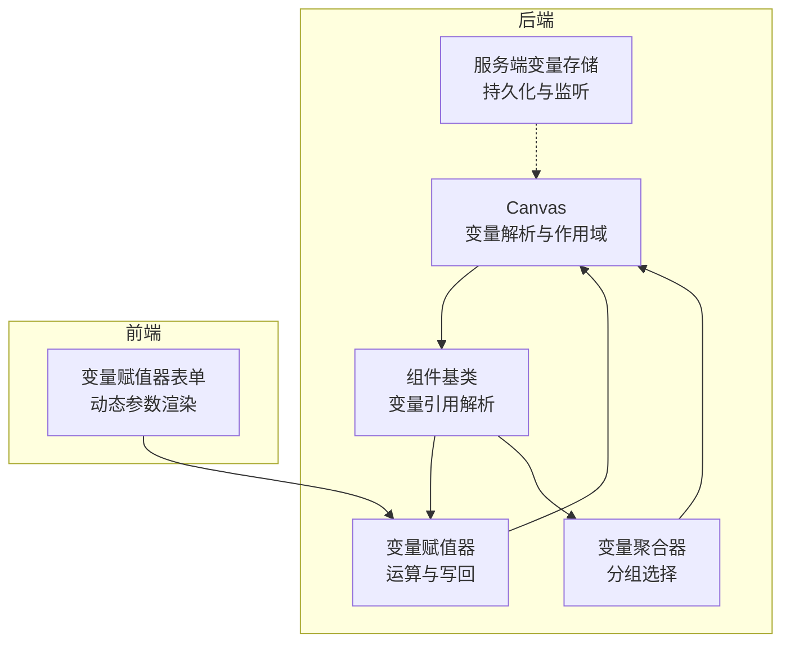
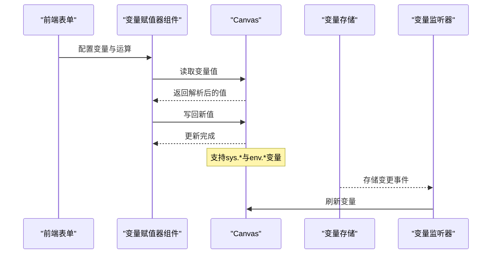
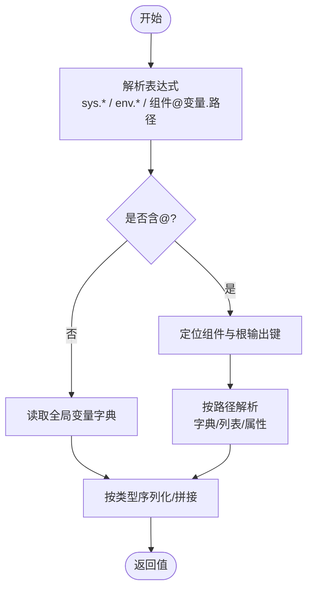
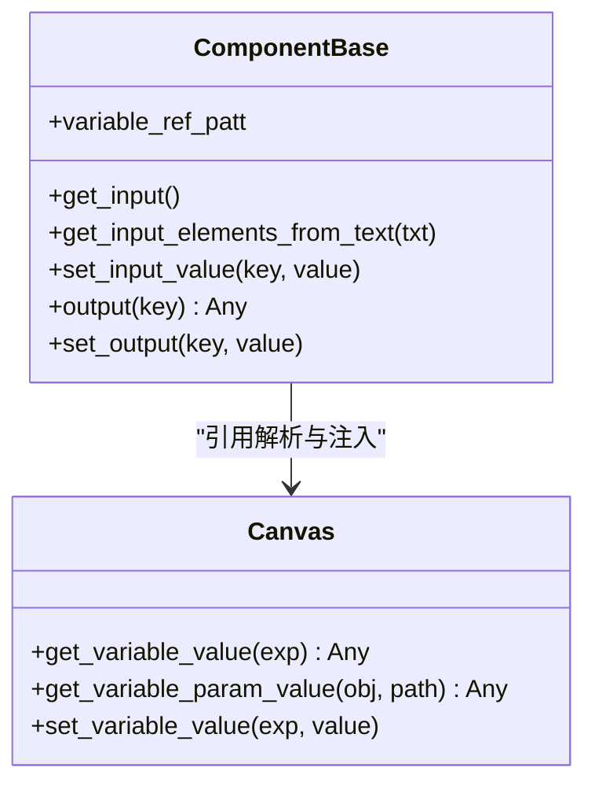
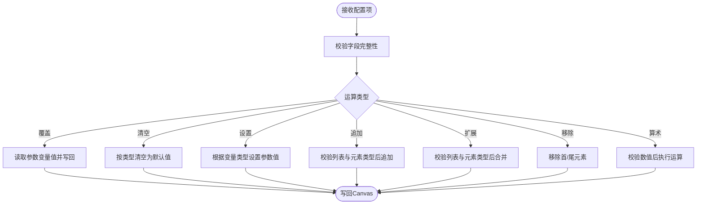
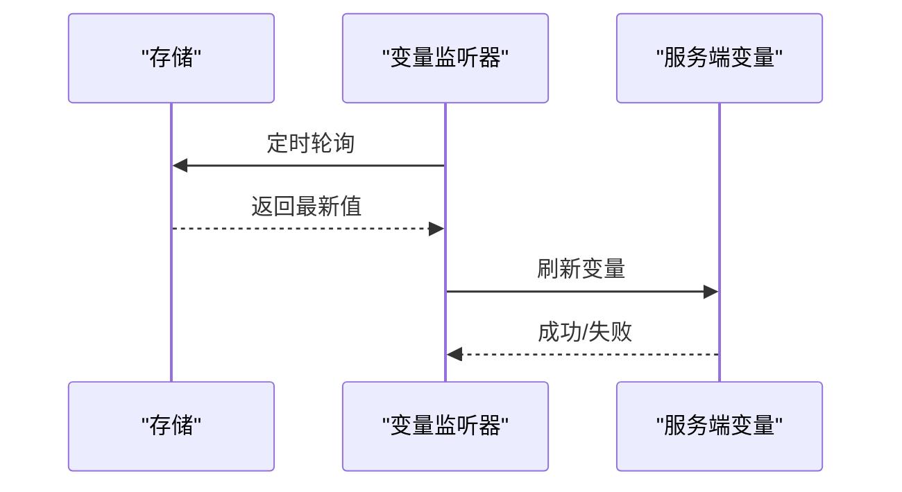
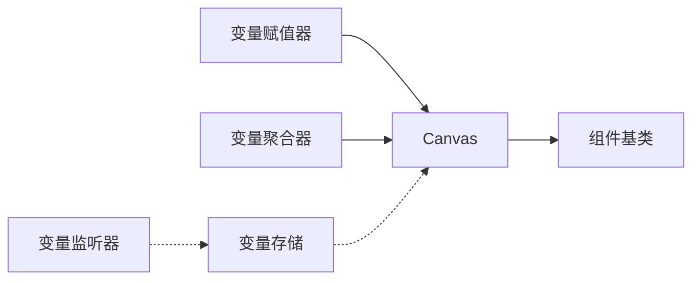

# 变量系统

<cite>
**本文档引用的文件**
- [internal/server/variable.go](file://internal/server/variable.go)
- [agent/canvas.py](file://agent/canvas.py)
- [agent/component/base.py](file://agent/component/base.py)
- [agent/component/variable_assigner.py](file://agent/component/variable_assigner.py)
- [agent/component/varaiable_aggregator.py](file://agent/component/varaiable_aggregator.py)
- [web/src/pages/agent/form/variable-assigner-form/index.tsx](file://web/src/pages/agent/form/variable-assigner-form/index.tsx)
- [web/src/pages/agent/form/variable-assigner-form/dynamic-variables.tsx](file://web/src/pages/agent/form/variable-assigner-form/dynamic-variables.tsx)
- [internal/admin/handler.go](file://internal/admin/handler.go)
</cite>

## 目录
1. [简介](#简介)
2. [项目结构](#项目结构)
3. [核心组件](#核心组件)
4. [架构总览](#架构总览)
5. [详细组件分析](#详细组件分析)
6. [依赖分析](#依赖分析)
7. [性能考虑](#性能考虑)
8. [故障排查指南](#故障排查指南)
9. [结论](#结论)
10. [附录：变量系统API与使用示例](#附录变量系统api与使用示例)

## 简介
本文件面向代理工作流中的变量系统，系统性阐述变量的定义、作用域、表达式解析、组件间传递与持久化机制，并提供完整的API说明与使用示例，帮助开发者在不同组件中灵活使用变量，实现动态配置与复杂数据结构处理。

## 项目结构
变量系统贯穿后端运行时（Canvas/组件）、前端表单（变量赋值器UI）、以及服务端变量存储与监听模块。核心涉及以下模块：
- Canvas：工作流图的执行引擎，维护全局变量字典与变量表达式解析。
- 组件基类：统一的变量引用解析与输入绑定能力。
- 变量赋值器与聚合器：对变量进行运算、分组与输出。
- 服务端变量存储与监听：支持运行时变量持久化与跨实例刷新。
- 管理端API：提供变量查询与设置接口。

图表来源
- [agent/canvas.py:166-269](file://agent/canvas.py#L166-L269)
- [agent/component/base.py:365-511](file://agent/component/base.py#L365-L511)
- [agent/component/variable_assigner.py:41-192](file://agent/component/variable_assigner.py#L41-L192)
- [agent/component/varaiable_aggregator.py:58-85](file://agent/component/varaiable_aggregator.py#L58-L85)
- [internal/server/variable.go:31-260](file://internal/server/variable.go#L31-L260)
- [web/src/pages/agent/form/variable-assigner-form/index.tsx:1-47](file://web/src/pages/agent/form/variable-assigner-form/index.tsx#L1-L47)
- [web/src/pages/agent/form/variable-assigner-form/dynamic-variables.tsx:80-271](file://web/src/pages/agent/form/variable-assigner-form/dynamic-variables.tsx#L80-L271)

章节来源
- [agent/canvas.py:166-269](file://agent/canvas.py#L166-L269)
- [agent/component/base.py:365-511](file://agent/component/base.py#L365-L511)
- [internal/server/variable.go:31-260](file://internal/server/variable.go#L31-L260)

## 核心组件
- Canvas：维护全局变量字典与系统内置变量，负责变量表达式解析、路径访问与写回。
- 组件基类：提供变量引用模式匹配、从Canvas解析变量值、将变量注入组件输入。
- 变量赋值器：对指定变量执行多种运算（覆盖、清空、追加、扩展、增减乘除等），并将结果写回。
- 变量聚合器：按组选择首个可用变量，用于条件分支或默认值策略。
- 服务端变量存储与监听：支持运行时变量持久化、刷新与跨实例监听。

章节来源
- [agent/canvas.py:283-320](file://agent/canvas.py#L283-L320)
- [agent/component/base.py:365-511](file://agent/component/base.py#L365-L511)
- [agent/component/variable_assigner.py:41-192](file://agent/component/variable_assigner.py#L41-L192)
- [agent/component/varaiable_aggregator.py:58-85](file://agent/component/varaiable_aggregator.py#L58-L85)
- [internal/server/variable.go:31-260](file://internal/server/variable.go#L31-L260)

## 架构总览
变量系统在代理工作流中的交互流程如下：

图表来源
- [agent/component/variable_assigner.py:45-57](file://agent/component/variable_assigner.py#L45-L57)
- [agent/canvas.py:166-269](file://agent/canvas.py#L166-L269)
- [internal/server/variable.go:161-187](file://internal/server/variable.go#L161-L187)
- [internal/server/variable.go:205-232](file://internal/server/variable.go#L205-L232)

## 详细组件分析

### Canvas：变量解析与作用域
- 全局变量字典：包含系统内置变量（sys.*）与环境变量（env.*）两类键空间。
- 表达式解析：支持形如“组件@变量.路径”“sys.键”“env.键”的引用；路径可为字典键、数组索引或对象属性。
- 值写回：支持对全局变量与组件输出的深层路径写入。
- 重置逻辑：根据变量类型模板重置env.*变量，确保会话一致性。

图表来源
- [agent/canvas.py:166-269](file://agent/canvas.py#L166-L269)

章节来源
- [agent/canvas.py:283-320](file://agent/canvas.py#L283-L320)
- [agent/canvas.py:330-374](file://agent/canvas.py#L330-L374)

### 组件基类：变量引用与输入绑定
- 变量引用模式：统一的正则匹配，支持sys.*、env.*与“组件@变量.路径”三类表达式。
- 输入绑定：当组件参数为变量引用时，自动从Canvas解析并注入到组件输入。
- 文本内变量提取：支持从任意文本中提取变量引用，便于提示词与动态内容生成。

图表来源
- [agent/component/base.py:365-511](file://agent/component/base.py#L365-L511)
- [agent/canvas.py:166-269](file://agent/canvas.py#L166-L269)

章节来源
- [agent/component/base.py:365-511](file://agent/component/base.py#L365-L511)

### 变量赋值器：运算与写回
- 运算类型：覆盖、清空、设置、追加、扩展、移除首/尾、加减乘除等。
- 类型安全：对列表元素类型、数值运算进行校验，返回明确错误信息。
- 动态参数：支持通过表单动态选择变量、运算符与参数，参数类型随变量类型变化。

图表来源
- [agent/component/variable_assigner.py:45-192](file://agent/component/variable_assigner.py#L45-L192)

章节来源
- [agent/component/variable_assigner.py:41-192](file://agent/component/variable_assigner.py#L41-L192)
- [web/src/pages/agent/form/variable-assigner-form/index.tsx:13-23](file://web/src/pages/agent/form/variable-assigner-form/index.tsx#L13-L23)
- [web/src/pages/agent/form/variable-assigner-form/dynamic-variables.tsx:80-271](file://web/src/pages/agent/form/variable-assigner-form/dynamic-variables.tsx#L80-L271)

### 变量聚合器：分组选择
- 分组策略：对每组变量列表按顺序查找第一个非空值，作为该组输出。
- 输出命名：以组名为键输出对应值，便于下游组件按组消费。

章节来源
- [agent/component/varaiable_aggregator.py:58-85](file://agent/component/varaiable_aggregator.py#L58-L85)

### 服务端变量存储与监听
- 持久化：支持将运行时变量保存至存储（如Redis），并提供原子创建与刷新。
- 监听：定时轮询刷新变量，检测其他实例的变更，保证多实例一致性。

图表来源
- [internal/server/variable.go:161-187](file://internal/server/variable.go#L161-L187)
- [internal/server/variable.go:205-232](file://internal/server/variable.go#L205-L232)
- [internal/server/variable.go:234-254](file://internal/server/variable.go#L234-L254)

章节来源
- [internal/server/variable.go:31-260](file://internal/server/variable.go#L31-L260)

## 依赖分析
- Canvas依赖组件基类提供的变量引用解析能力，向组件注入解析后的值。
- 变量赋值器与聚合器依赖Canvas的读写接口，形成闭环。
- 服务端变量模块独立于业务组件，通过监听器与Canvas解耦。

图表来源
- [agent/canvas.py:166-269](file://agent/canvas.py#L166-L269)
- [agent/component/base.py:365-511](file://agent/component/base.py#L365-L511)
- [agent/component/variable_assigner.py:45-57](file://agent/component/variable_assigner.py#L45-L57)
- [agent/component/varaiable_aggregator.py:62-73](file://agent/component/varaiable_aggregator.py#L62-L73)
- [internal/server/variable.go:205-232](file://internal/server/variable.go#L205-L232)

章节来源
- [agent/canvas.py:166-269](file://agent/canvas.py#L166-L269)
- [agent/component/base.py:365-511](file://agent/component/base.py#L365-L511)
- [agent/component/variable_assigner.py:45-57](file://agent/component/variable_assigner.py#L45-L57)
- [agent/component/varaiable_aggregator.py:62-73](file://agent/component/varaiable_aggregator.py#L62-L73)
- [internal/server/variable.go:205-232](file://internal/server/variable.go#L205-L232)

## 性能考虑
- 变量解析：Canvas的表达式解析采用正则扫描与路径遍历，建议避免在热路径中频繁进行深层路径解析。
- 组件输入绑定：组件基类在每次获取输入时进行变量解析，应尽量减少参数中变量引用的数量。
- 赋值器运算：列表与数值运算具备类型检查，异常路径会返回错误字符串，建议在调用前进行类型预判。
- 监听刷新：变量监听器使用定时器轮询，建议合理设置刷新间隔，避免频繁IO。

## 故障排查指南
- 变量引用无效：确认表达式格式正确（sys.键、env.键或组件@变量.路径），并在Canvas中验证键存在。
- 路径访问失败：检查路径是否指向字典、列表或对象属性，注意数组索引与键名大小写。
- 赋值器报错：根据错误信息检查运算类型与参数类型是否匹配（如列表元素类型、除零等）。
- 多实例变量不一致：确认变量存储可用且监听器已启动，必要时手动触发刷新。

章节来源
- [agent/canvas.py:166-269](file://agent/canvas.py#L166-L269)
- [agent/component/variable_assigner.py:118-189](file://agent/component/variable_assigner.py#L118-L189)
- [internal/server/variable.go:161-187](file://internal/server/variable.go#L161-L187)

## 结论
变量系统通过Canvas统一解析与写回、组件基类的引用注入、赋值器与聚合器的运算与分组策略，以及服务端变量存储与监听，形成了完整的代理工作流变量生态。开发者可据此实现动态配置、组件间变量传递与跨实例一致性保障。

## 附录：变量系统API与使用示例

### 变量表达式语法
- 全局变量：sys.键（系统内置）、env.键（环境变量）
- 组件变量：组件ID@输出键.路径
- 路径支持：字典键、数组索引、对象属性，支持嵌套

章节来源
- [agent/canvas.py:166-269](file://agent/canvas.py#L166-L269)
- [agent/component/base.py:365-511](file://agent/component/base.py#L365-L511)

### 作用域与优先级
- 作用域：sys.*与env.*为全局作用域；组件@变量.路径为组件作用域。
- 优先级：组件作用域覆盖同名全局变量；env.*由Canvas根据变量定义模板初始化与重置。

章节来源
- [agent/canvas.py:283-320](file://agent/canvas.py#L283-L320)
- [agent/canvas.py:330-374](file://agent/canvas.py#L330-L374)

### 变量读取与写回（Canvas）
- 读取：get_variable_value(exp)、get_variable_param_value(obj, path)
- 写回：set_variable_value(exp, value)、set_variable_param_value(obj, path, value)

章节来源
- [agent/canvas.py:193-269](file://agent/canvas.py#L193-L269)

### 组件输入中的变量引用
- 组件参数若为变量引用，将在获取输入时自动解析并注入。
- 文本中变量引用可通过get_input_elements_from_text提取。

章节来源
- [agent/component/base.py:478-511](file://agent/component/base.py#L478-L511)

### 变量赋值器运算
- 运算类型：覆盖、清空、设置、追加、扩展、移除首/尾、加减乘除
- 参数类型随变量类型变化，支持布尔、数字、字符串、对象、数组

章节来源
- [agent/component/variable_assigner.py:45-192](file://agent/component/variable_assigner.py#L45-L192)
- [web/src/pages/agent/form/variable-assigner-form/dynamic-variables.tsx:80-271](file://web/src/pages/agent/form/variable-assigner-form/dynamic-variables.tsx#L80-L271)

### 变量聚合器分组
- 每组按序查找首个非空值作为输出，输出键为组名。

章节来源
- [agent/component/varaiable_aggregator.py:62-73](file://agent/component/varaiable_aggregator.py#L62-L73)

### 服务端变量持久化与监听
- 初始化：InitVariables(store)、GetOrCreateKey(store, key, value)
- 刷新：RefreshVariables(store)
- 监听：NewVariableWatcher(store).Start(interval)
- 保存：SaveToStorage(store)

章节来源
- [internal/server/variable.go:59-159](file://internal/server/variable.go#L59-L159)
- [internal/server/variable.go:161-232](file://internal/server/variable.go#L161-L232)
- [internal/server/variable.go:234-254](file://internal/server/variable.go#L234-L254)

### 管理端变量API
- 获取变量列表：GET /admin/variables
- 获取单个变量：POST /admin/variables
- 设置变量：PUT /admin/variables

章节来源
- [internal/admin/handler.go:796-843](file://internal/admin/handler.go#L796-L843)

### 使用示例（步骤化）
- 在变量赋值器中配置“覆盖”某变量为另一个变量的值。
- 在提示词或组件参数中使用“组件@输出.字段”引用上游组件输出。
- 在env.*中定义环境变量模板，Canvas重置时按类型初始化。
- 通过管理端API列出或设置运行时变量，结合监听器实现跨实例同步。

章节来源
- [agent/component/variable_assigner.py:45-57](file://agent/component/variable_assigner.py#L45-L57)
- [agent/canvas.py:166-269](file://agent/canvas.py#L166-L269)
- [agent/canvas.py:330-374](file://agent/canvas.py#L330-L374)
- [internal/admin/handler.go:796-843](file://internal/admin/handler.go#L796-L843)