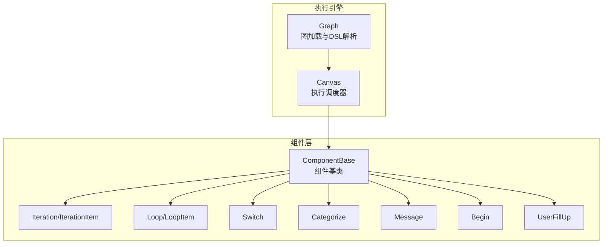
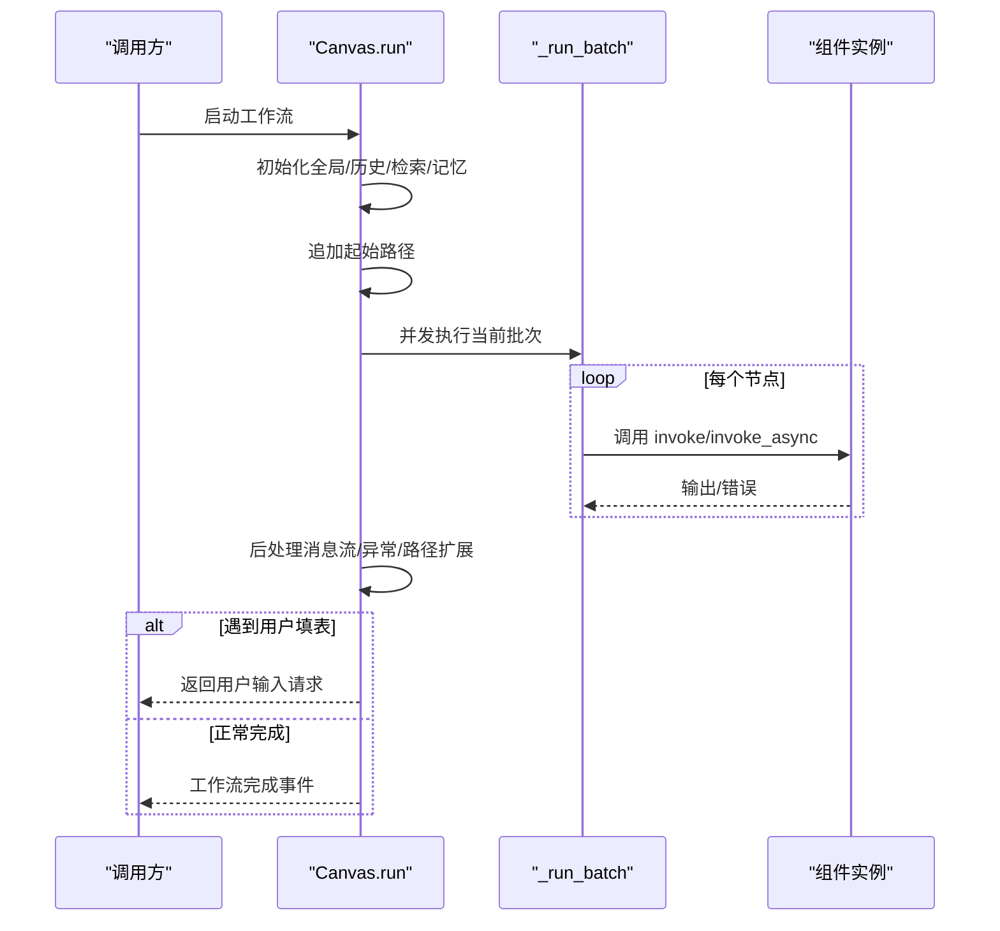
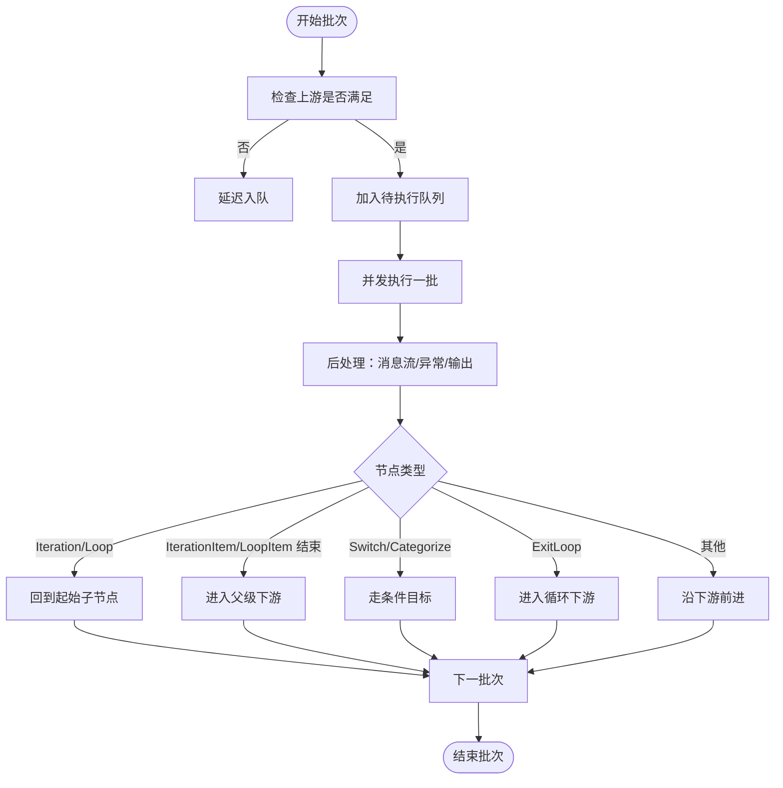
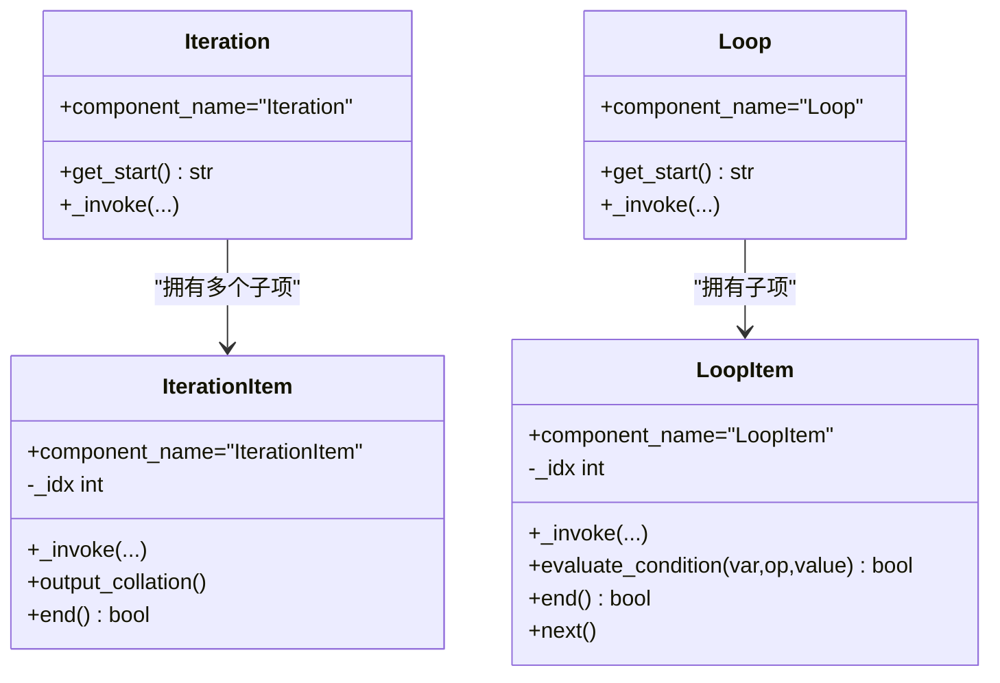
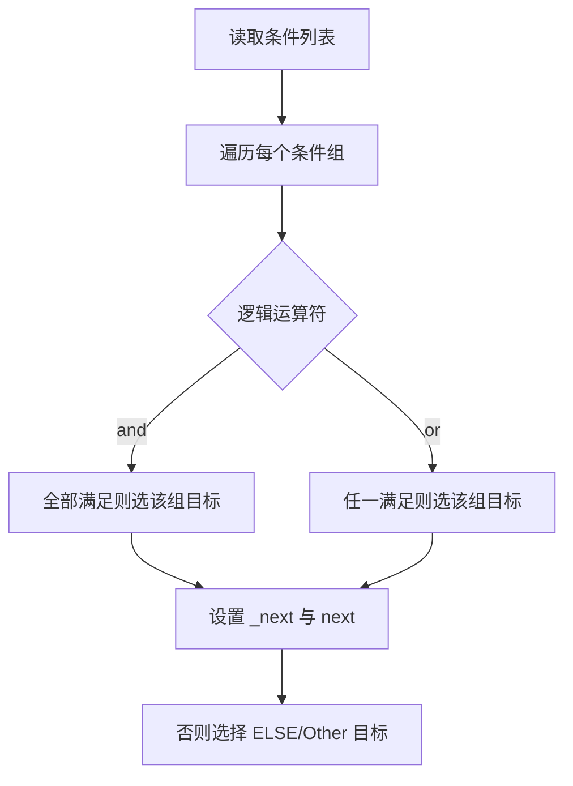
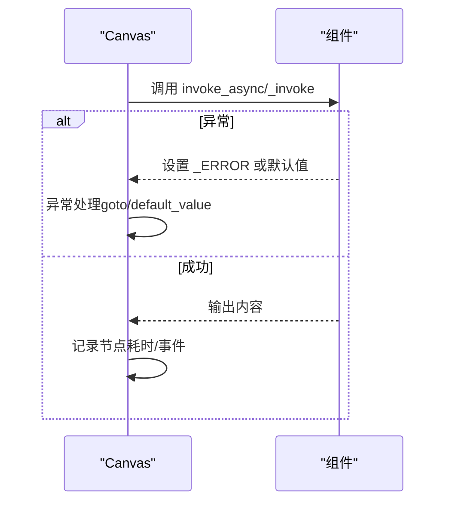
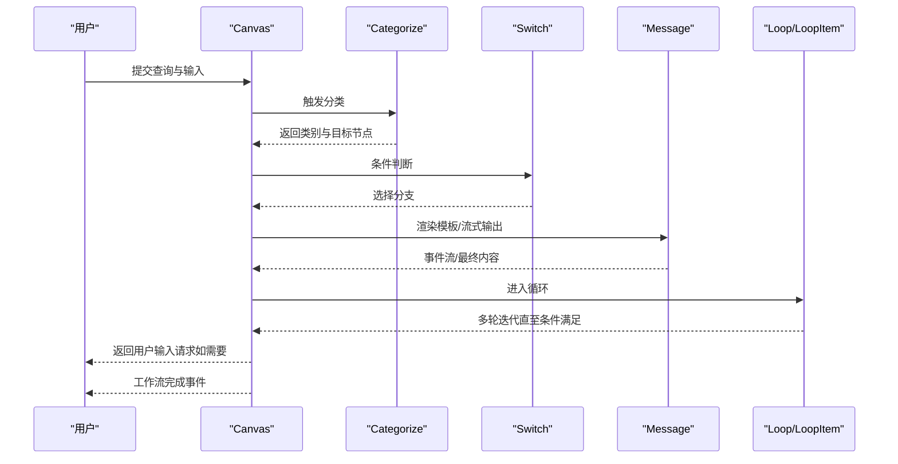
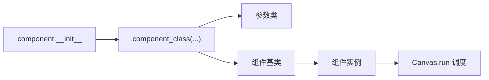

# 执行控制

<cite>
**本文引用的文件**
- [agent/canvas.py](file://agent/canvas.py)
- [agent/component/base.py](file://agent/component/base.py)
- [agent/component/iteration.py](file://agent/component/iteration.py)
- [agent/component/iterationitem.py](file://agent/component/iterationitem.py)
- [agent/component/loop.py](file://agent/component/loop.py)
- [agent/component/loopitem.py](file://agent/component/loopitem.py)
- [agent/component/switch.py](file://agent/component/switch.py)
- [agent/component/categorize.py](file://agent/component/categorize.py)
- [agent/component/message.py](file://agent/component/message.py)
- [agent/component/begin.py](file://agent/component/begin.py)
- [agent/component/fillup.py](file://agent/component/fillup.py)
- [agent/component/__init__.py](file://agent/component/__init__.py)
</cite>

## 目录
1. [简介](#简介)
2. [项目结构](#项目结构)
3. [核心组件](#核心组件)
4. [架构总览](#架构总览)
5. [详细组件分析](#详细组件分析)
6. [依赖分析](#依赖分析)
7. [性能考虑](#性能考虑)
8. [故障排查指南](#故障排查指南)
9. [结论](#结论)
10. [附录](#附录)

## 简介
本文件面向执行控制系统，系统性阐述代理工作流的执行流程控制与调度机制，覆盖以下主题：
- 执行路径确定：拓扑排序思想、依赖关系解析、并发执行策略
- 循环控制：Iteration/Loop 组件的实现原理、迭代条件判断、退出机制
- 分支控制：Switch/Categorize 组件的条件判断、路径选择、异常处理
- 执行状态监控与管理：节点状态跟踪、错误传播、超时控制
- 性能优化：并发限制、资源管理、内存控制
- 完整执行示例：复杂工作流的执行过程、调试方法、故障排除

## 项目结构
执行控制的核心由“画布（Canvas）”驱动，它承载工作流图谱（Graph）、变量与全局状态，并在运行时按路径顺序调度组件执行。组件通过统一基类提供输入输出、异常处理、超时控制等能力。

图表来源
- [agent/canvas.py:283-800](file://agent/canvas.py#L283-L800)
- [agent/component/base.py:365-585](file://agent/component/base.py#L365-L585)
- [agent/component/iteration.py:49-72](file://agent/component/iteration.py#L49-L72)
- [agent/component/iterationitem.py:28-92](file://agent/component/iterationitem.py#L28-L92)
- [agent/component/loop.py:43-80](file://agent/component/loop.py#L43-L80)
- [agent/component/loopitem.py:27-167](file://agent/component/loopitem.py#L27-L167)
- [agent/component/switch.py:61-141](file://agent/component/switch.py#L61-L141)
- [agent/component/categorize.py:98-166](file://agent/component/categorize.py#L98-L166)
- [agent/component/message.py:63-450](file://agent/component/message.py#L63-L450)
- [agent/component/begin.py:37-64](file://agent/component/begin.py#L37-L64)
- [agent/component/fillup.py:36-83](file://agent/component/fillup.py#L36-L83)

章节来源
- [agent/canvas.py:83-150](file://agent/canvas.py#L83-L150)
- [agent/component/__init__.py:51-59](file://agent/component/__init__.py#L51-L59)

## 核心组件
- Graph/Canvas：负责加载 DSL、维护执行路径、调度组件调用、事件流输出、取消与日志清理。
- ComponentBase：定义组件统一接口（输入/输出、异常处理、超时装饰器、异步/同步调用封装）。
- Iteration/IterationItem：对列表数据进行逐项迭代，支持输出聚合。
- Loop/LoopItem：基于终止条件与最大次数的循环，支持逻辑运算符组合。
- Switch/Categorize：条件分支与分类决策，分别支持自定义条件与大模型分类。
- Message/Begin/UserFillUp：消息输出、开始节点与用户填表节点。

章节来源
- [agent/canvas.py:283-800](file://agent/canvas.py#L283-L800)
- [agent/component/base.py:365-585](file://agent/component/base.py#L365-L585)
- [agent/component/iteration.py:49-72](file://agent/component/iteration.py#L49-L72)
- [agent/component/iterationitem.py:28-92](file://agent/component/iterationitem.py#L28-L92)
- [agent/component/loop.py:43-80](file://agent/component/loop.py#L43-L80)
- [agent/component/loopitem.py:27-167](file://agent/component/loopitem.py#L27-L167)
- [agent/component/switch.py:61-141](file://agent/component/switch.py#L61-L141)
- [agent/component/categorize.py:98-166](file://agent/component/categorize.py#L98-L166)
- [agent/component/message.py:63-450](file://agent/component/message.py#L63-L450)
- [agent/component/begin.py:37-64](file://agent/component/begin.py#L37-L64)
- [agent/component/fillup.py:36-83](file://agent/component/fillup.py#L36-L83)

## 架构总览
Canvas 的 run 流程以“事件驱动”的方式推进：先按路径顺序触发节点启动事件，再并发批量执行可并行节点，随后进行后处理（消息流、异常处理、路径扩展），直到遇到用户填表或结束。

图表来源
- [agent/canvas.py:375-668](file://agent/canvas.py#L375-L668)
- [agent/component/base.py:407-447](file://agent/component/base.py#L407-L447)

## 详细组件分析

### 执行路径确定与调度
- 路径来源：DSL 中的初始 path 与动态追加（如 Begin）构成执行起点。
- 依赖解析：组件输入元素中若引用上游未到达的节点，则延迟该节点入队；仅当所有上游节点已执行，才允许入队。
- 并发策略：使用线程池与信号量限制并发度，按批次并发执行；消息类组件支持流式输出，逐步产出事件。
- 路径扩展：根据节点类型决定下一步路径：
  - Iteration/Loop：回到起始子节点
  - IterationItem/LoopItem 结束：进入父级下游
  - Switch/Categorize：走条件匹配的目标
  - ExitLoop：跳过循环体，直接进入循环下游
  - 其他：沿下游前进

图表来源
- [agent/canvas.py:435-632](file://agent/canvas.py#L435-L632)
- [agent/canvas.py:577-627](file://agent/canvas.py#L577-L627)

章节来源
- [agent/canvas.py:435-632](file://agent/canvas.py#L435-L632)
- [agent/canvas.py:577-627](file://agent/canvas.py#L577-L627)

### 循环控制：Iteration 与 Loop
- Iteration/IterationItem
  - 输入：items_ref 指向数组变量
  - 行为：逐项输出 item/index；多轮迭代时对非迭代子节点进行输出聚合
  - 结束：索引越界自动结束
- Loop/LoopItem
  - 输入：loop_variables 初始化变量；maximum_loop_count 限制最大轮数；logical_operator 与 loop_termination_condition 组合判断退出
  - 行为：每轮递增计数，满足任一/全部条件则结束
  - 退出：计数达到上限或条件满足

图表来源
- [agent/component/iteration.py:49-72](file://agent/component/iteration.py#L49-L72)
- [agent/component/iterationitem.py:28-92](file://agent/component/iterationitem.py#L28-L92)
- [agent/component/loop.py:43-80](file://agent/component/loop.py#L43-L80)
- [agent/component/loopitem.py:27-167](file://agent/component/loopitem.py#L27-L167)

章节来源
- [agent/component/iteration.py:49-72](file://agent/component/iteration.py#L49-L72)
- [agent/component/iterationitem.py:28-92](file://agent/component/iterationitem.py#L28-L92)
- [agent/component/loop.py:43-80](file://agent/component/loop.py#L43-L80)
- [agent/component/loopitem.py:123-155](file://agent/component/loopitem.py#L123-L155)

### 分支控制：Switch 与 Categorize
- Switch
  - 条件：支持字符串/数值/布尔/集合等多种比较操作，支持 and/or 逻辑组合
  - 路径：命中即设置 _next 与 next 输出，否则走 ELSE/Other 目标
  - 超时：组件级超时装饰器保护
- Categorize
  - 条件：基于历史对话窗口与类别描述，调用聊天模型进行分类
  - 路径：返回出现频率最高的类别对应的目标节点集合

图表来源
- [agent/component/switch.py:64-98](file://agent/component/switch.py#L64-L98)
- [agent/component/categorize.py:108-159](file://agent/component/categorize.py#L108-L159)

章节来源
- [agent/component/switch.py:61-141](file://agent/component/switch.py#L61-L141)
- [agent/component/categorize.py:98-166](file://agent/component/categorize.py#L98-L166)

### 执行状态监控与管理
- 事件流：节点启动/完成、消息流、用户输入请求、工作流开始/结束
- 错误传播：组件异常被捕获并写入输出；支持异常 goto 与默认值回退
- 取消与超时：Canvas 层检测任务取消；组件层统一超时装饰器；消息流支持异步生成
- 历史与记忆：维护 sys.history 与 retrieval/memory，便于上下文与结果持久化

图表来源
- [agent/canvas.py:577-627](file://agent/canvas.py#L577-L627)
- [agent/component/base.py:407-447](file://agent/component/base.py#L407-L447)

章节来源
- [agent/canvas.py:375-668](file://agent/canvas.py#L375-L668)
- [agent/component/base.py:567-582](file://agent/component/base.py#L567-L582)

### 执行性能优化
- 并发限制：线程池与信号量共同限制并发度，避免资源争用
- 资源管理：组件参数支持重试、延迟、超时配置；消息流采用分块输出，降低一次性内存峰值
- 内存控制：Message 组件在转换格式时按需生成临时文件与二进制缓冲，及时释放
- 取消早停：统一取消标志位，快速中断后续执行

章节来源
- [agent/canvas.py:443-482](file://agent/canvas.py#L443-L482)
- [agent/component/message.py:431-450](file://agent/component/message.py#L431-L450)
- [agent/component/base.py:367](file://agent/component/base.py#L367)

### 完整执行流程示例
以下示例展示一个“分类-分支-消息-循环”的典型工作流执行过程，涵盖：
- 开始节点初始化输入与历史
- Categorize 基于历史与类别描述进行分类
- Switch 根据条件选择不同路径
- Message 输出内容并可流式传输
- Loop/LoopItem 多轮迭代并满足条件退出
- 用户填表节点触发交互式输入

图表来源
- [agent/canvas.py:375-668](file://agent/canvas.py#L375-L668)
- [agent/component/categorize.py:108-159](file://agent/component/categorize.py#L108-L159)
- [agent/component/switch.py:64-98](file://agent/component/switch.py#L64-L98)
- [agent/component/message.py:182-207](file://agent/component/message.py#L182-L207)
- [agent/component/loopitem.py:123-155](file://agent/component/loopitem.py#L123-L155)

章节来源
- [agent/canvas.py:375-668](file://agent/canvas.py#L375-L668)
- [agent/component/categorize.py:98-166](file://agent/component/categorize.py#L98-L166)
- [agent/component/switch.py:61-141](file://agent/component/switch.py#L61-L141)
- [agent/component/message.py:63-450](file://agent/component/message.py#L63-L450)
- [agent/component/loopitem.py:27-167](file://agent/component/loopitem.py#L27-L167)

## 依赖分析
- 组件注册：通过包扫描与动态导入，统一暴露组件类名供 Canvas 使用。
- Canvas 对组件的依赖：通过组件名映射到具体类，再实例化参数对象并校验。
- 组件间耦合：通过上游/下游边与变量引用解耦；异常 goto 与默认值提供弱耦合的错误恢复路径。

图表来源
- [agent/component/__init__.py:51-59](file://agent/component/__init__.py#L51-L59)
- [agent/canvas.py:99-108](file://agent/canvas.py#L99-L108)

章节来源
- [agent/component/__init__.py:25-48](file://agent/component/__init__.py#L25-L48)
- [agent/canvas.py:94-108](file://agent/canvas.py#L94-L108)

## 性能考虑
- 并发度：通过线程池与信号量限制组件并发，避免 CPU/IO 抢占；可根据环境变量调整。
- 超时控制：组件级超时装饰器防止阻塞；消息流异步生成减少主线程等待。
- 内存与存储：Message 组件在转换格式时使用临时文件与二进制缓冲，及时释放；建议在高并发场景下合理设置最大并发与超时阈值。
- 取消早停：统一取消标志位，确保长时间运行组件能快速响应取消。

章节来源
- [agent/canvas.py:443-482](file://agent/canvas.py#L443-L482)
- [agent/component/base.py:449](file://agent/component/base.py#L449)
- [agent/component/message.py:431-450](file://agent/component/message.py#L431-L450)

## 故障排查指南
- 任务取消：Canvas 在批次执行前与运行中检查取消状态，抛出取消异常并提前结束。
- 异常处理：组件异常被捕获并写入输出；可通过异常 goto 将执行切换到指定路径，或设置默认值回退。
- 超时问题：检查组件超时配置与网络/模型服务可用性；必要时提高超时阈值或优化下游服务。
- 变量引用：确认变量表达式格式正确（如 sys.env. 前缀），以及上游节点已完成输出。
- 用户填表：遇到 UserFillUp 时，Canvas 会暂停并返回用户输入请求，完成后继续执行。

章节来源
- [agent/canvas.py:427-431](file://agent/canvas.py#L427-L431)
- [agent/canvas.py:577-587](file://agent/canvas.py#L577-L587)
- [agent/component/base.py:567-582](file://agent/component/base.py#L567-L582)
- [agent/component/begin.py:40-61](file://agent/component/begin.py#L40-L61)
- [agent/component/fillup.py:39-80](file://agent/component/fillup.py#L39-L80)

## 结论
本执行控制系统以 Canvas 为核心，结合统一的组件基类与丰富的控制组件（Iteration/Loop/Switch/Categorize），实现了灵活而强大的工作流执行控制。通过事件驱动的调度、并发限制与超时控制、完善的异常与取消机制，开发者可以构建高效稳定的自动化工作流。建议在生产环境中合理配置并发与超时参数，充分利用异常 goto 与默认值策略提升鲁棒性，并通过用户填表节点实现人机协同。

## 附录
- 关键实现位置参考
  - Canvas 执行主循环与事件流：[agent/canvas.py:375-668](file://agent/canvas.py#L375-L668)
  - 组件基类与异常/超时：[agent/component/base.py:365-585](file://agent/component/base.py#L365-L585)
  - Iteration/Loop 与 Item：[agent/component/iteration.py:49-72](file://agent/component/iteration.py#L49-L72), [agent/component/iterationitem.py:28-92](file://agent/component/iterationitem.py#L28-L92), [agent/component/loop.py:43-80](file://agent/component/loop.py#L43-L80), [agent/component/loopitem.py:27-167](file://agent/component/loopitem.py#L27-L167)
  - Switch/Categorize：[agent/component/switch.py:61-141](file://agent/component/switch.py#L61-L141), [agent/component/categorize.py:98-166](file://agent/component/categorize.py#L98-L166)
  - Message/Begin/UserFillUp：[agent/component/message.py:63-450](file://agent/component/message.py#L63-L450), [agent/component/begin.py:37-64](file://agent/component/begin.py#L37-L64), [agent/component/fillup.py:36-83](file://agent/component/fillup.py#L36-L83)