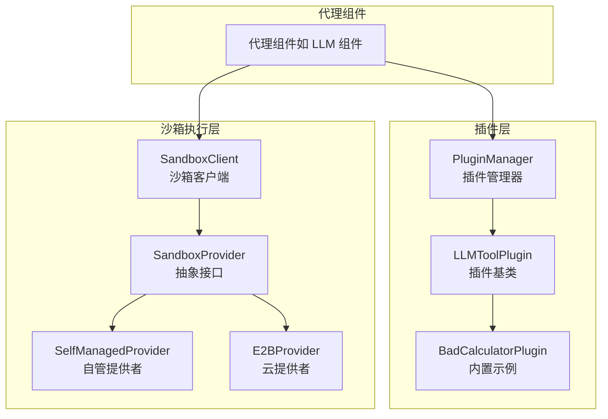
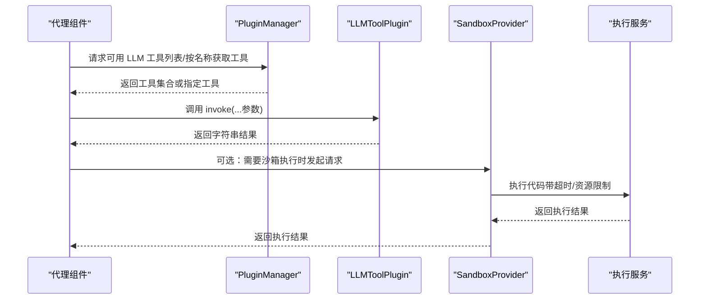
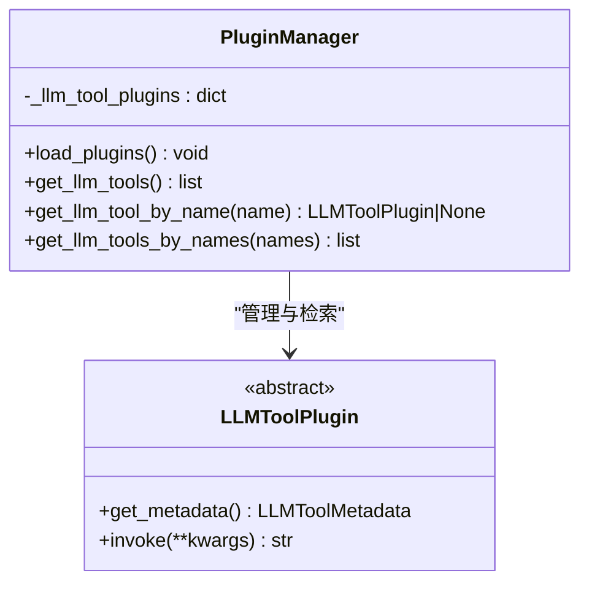
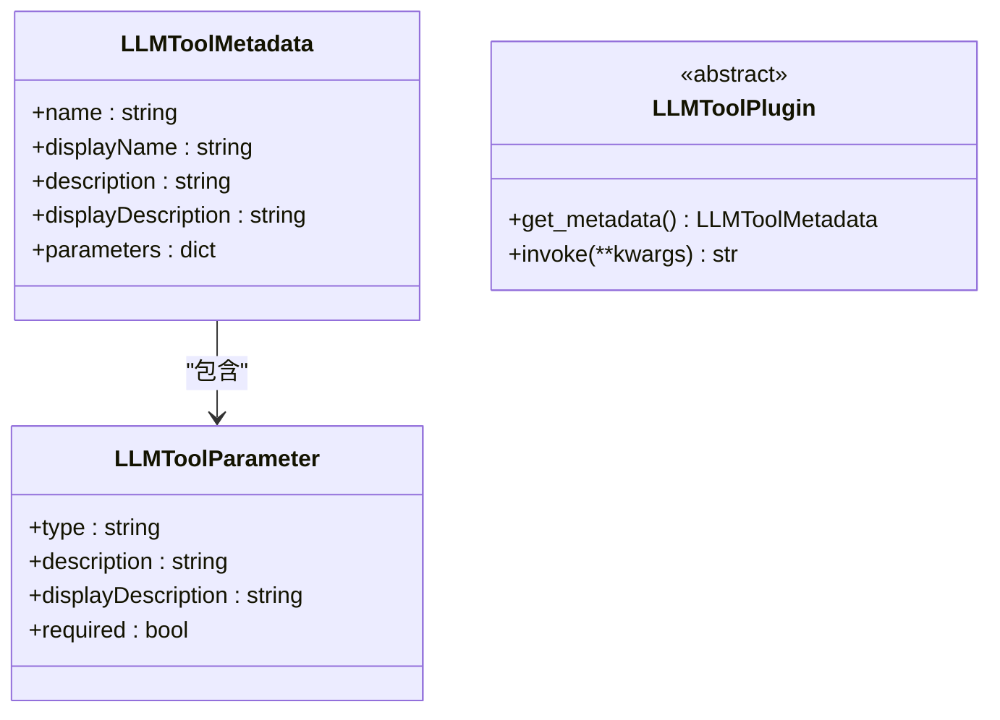
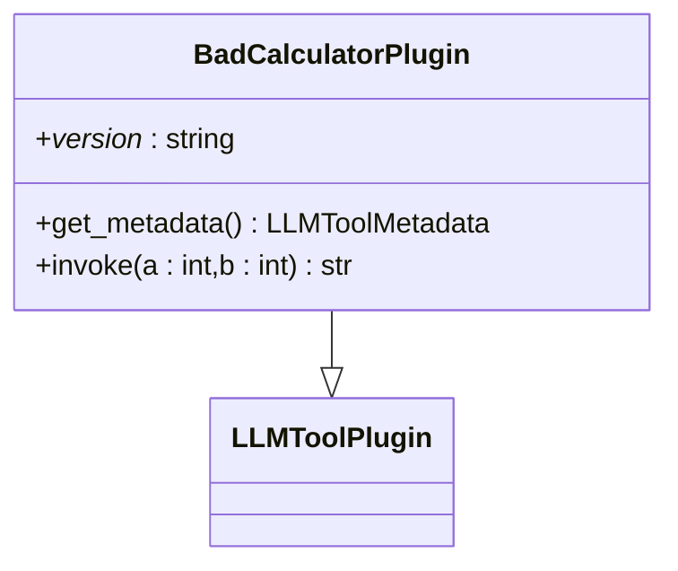
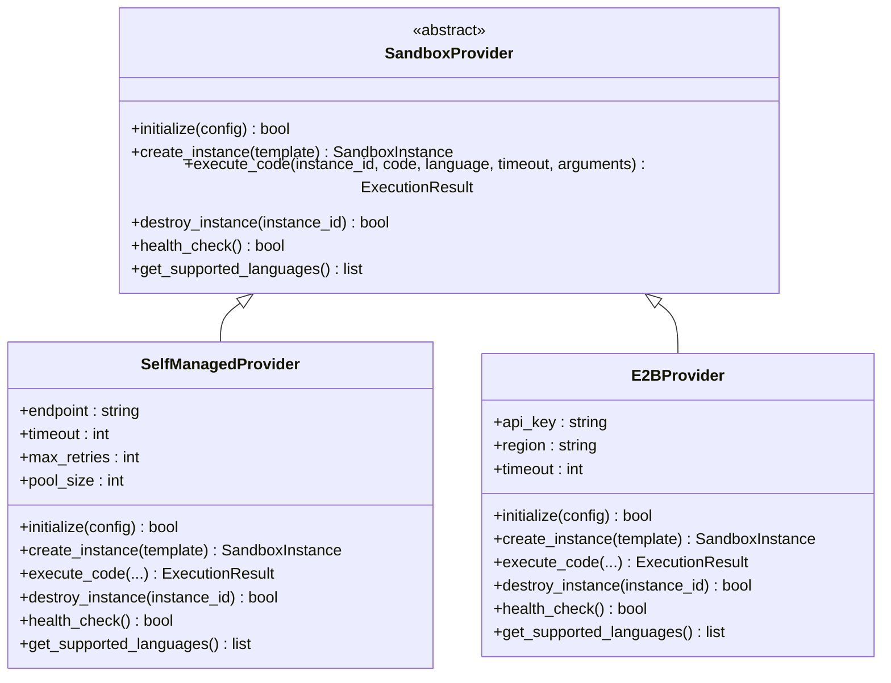
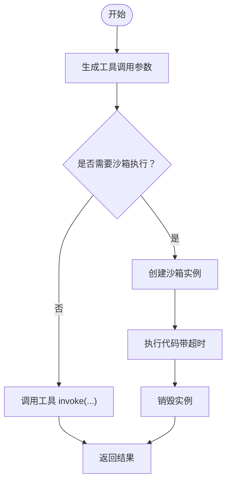
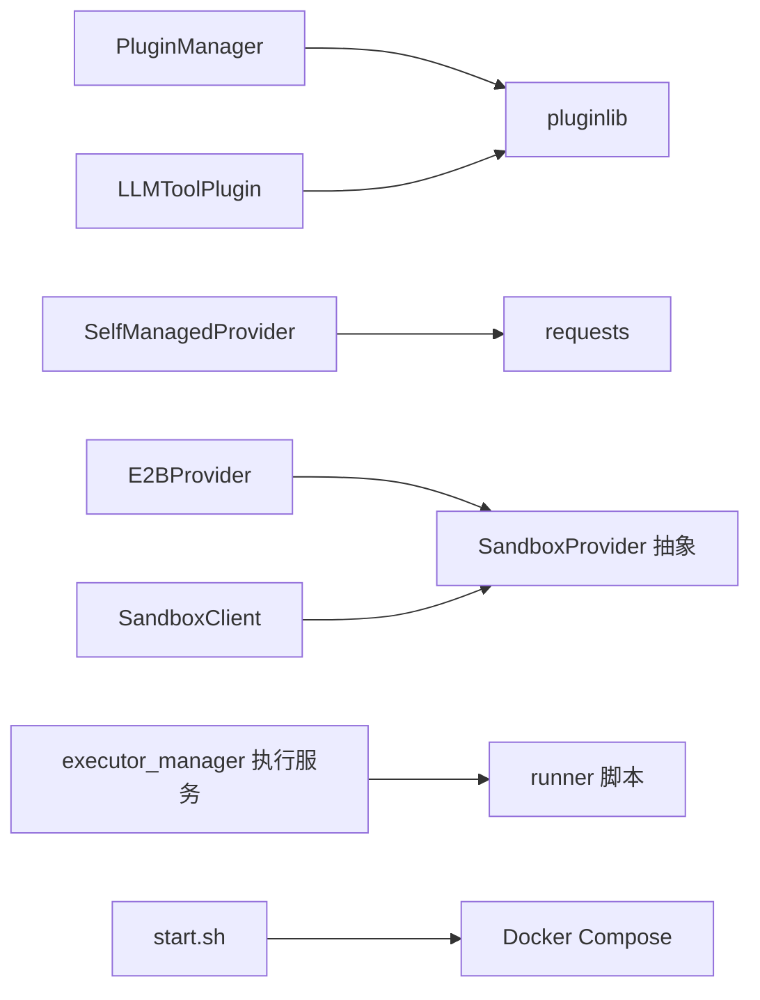

# 代理插件系统

<cite>
**本文引用的文件**
- [agent/plugin/__init__.py](file://agent/plugin/__init__.py)
- [agent/plugin/plugin_manager.py](file://agent/plugin/plugin_manager.py)
- [agent/plugin/common.py](file://agent/plugin/common.py)
- [agent/plugin/llm_tool_plugin.py](file://agent/plugin/llm_tool_plugin.py)
- [agent/plugin/embedded_plugins/llm_tools/bad_calculator.py](file://agent/plugin/embedded_plugins/llm_tools/bad_calculator.py)
- [agent/plugin/README.md](file://agent/plugin/README.md)
- [agent/sandbox/providers/base.py](file://agent/sandbox/providers/base.py)
- [agent/sandbox/providers/self_managed.py](file://agent/sandbox/providers/self_managed.py)
- [agent/sandbox/providers/e2b.py](file://agent/sandbox/providers/e2b.py)
- [agent/sandbox/client.py](file://agent/sandbox/client.py)
- [agent/sandbox/README.md](file://agent/sandbox/README.md)
- [agent/sandbox/executor_manager/services/execution.py](file://agent/sandbox/executor_manager/services/execution.py)
- [agent/sandbox/scripts/start.sh](file://agent/sandbox/scripts/start.sh)
- [admin/server/services.py](file://admin/server/services.py)
</cite>

## 目录
1. [简介](#简介)
2. [项目结构](#项目结构)
3. [核心组件](#核心组件)
4. [架构总览](#架构总览)
5. [详细组件分析](#详细组件分析)
6. [依赖分析](#依赖分析)
7. [性能考虑](#性能考虑)
8. [故障排查指南](#故障排查指南)
9. [结论](#结论)
10. [附录](#附录)

## 简介
本技术文档面向代理插件系统，聚焦于“插件化的代理组件扩展机制与实现原理”。文档围绕以下主题展开：
- 插件管理器（PluginManager）：插件发现、加载、生命周期与依赖解析
- 插件接口规范：插件基类、方法约定、参数与返回值格式
- 内置插件示例：LLM 工具插件、嵌入式插件、第三方集成插件
- 插件开发指南：如何创建自定义插件、对接外部工具
- 安全机制：沙箱执行、权限控制、资源限制、错误隔离
- 配置管理：参数设置、环境变量、配置文件、动态更新
- 与代理系统的集成：在代理组件中调用插件工具

## 项目结构
本仓库中与插件系统直接相关的核心目录与文件如下：
- 插件框架与管理器：agent/plugin
- 沙箱执行与安全：agent/sandbox
- 插件示例：agent/plugin/embedded_plugins/llm_tools/bad_calculator.py
- 插件开发说明：agent/plugin/README.md

图表来源
- [agent/plugin/plugin_manager.py:11-46](file://agent/plugin/plugin_manager.py#L11-L46)
- [agent/plugin/llm_tool_plugin.py:22-31](file://agent/plugin/llm_tool_plugin.py#L22-L31)
- [agent/plugin/embedded_plugins/llm_tools/bad_calculator.py:5-37](file://agent/plugin/embedded_plugins/llm_tools/bad_calculator.py#L5-L37)
- [agent/sandbox/client.py:158-211](file://agent/sandbox/client.py#L158-L211)
- [agent/sandbox/providers/base.py:56-156](file://agent/sandbox/providers/base.py#L56-L156)
- [agent/sandbox/providers/self_managed.py:34-361](file://agent/sandbox/providers/self_managed.py#L34-L361)
- [agent/sandbox/providers/e2b.py:30-234](file://agent/sandbox/providers/e2b.py#L30-L234)

章节来源
- [agent/plugin/__init__.py:1-4](file://agent/plugin/__init__.py#L1-L4)
- [agent/plugin/plugin_manager.py:1-46](file://agent/plugin/plugin_manager.py#L1-L46)
- [agent/plugin/llm_tool_plugin.py:1-52](file://agent/plugin/llm_tool_plugin.py#L1-L52)
- [agent/plugin/embedded_plugins/llm_tools/bad_calculator.py:1-38](file://agent/plugin/embedded_plugins/llm_tools/bad_calculator.py#L1-L38)
- [agent/plugin/README.md:1-98](file://agent/plugin/README.md#L1-L98)
- [agent/sandbox/providers/base.py:56-156](file://agent/sandbox/providers/base.py#L56-L156)
- [agent/sandbox/providers/self_managed.py:34-361](file://agent/sandbox/providers/self_managed.py#L34-L361)
- [agent/sandbox/providers/e2b.py:30-234](file://agent/sandbox/providers/e2b.py#L30-L234)
- [agent/sandbox/client.py:158-211](file://agent/sandbox/client.py#L158-L211)
- [agent/sandbox/README.md:1-354](file://agent/sandbox/README.md#L1-L354)

## 核心组件
- 插件管理器（PluginManager）
  - 负责扫描并加载嵌入式插件目录中的插件
  - 当前支持类型：llm_tools
  - 提供按名称检索工具的能力
- LLM 工具插件基类（LLMToolPlugin）
  - 规定元数据接口与调用接口
  - 元数据用于向 LLM 和前端展示工具能力
  - 调用接口返回字符串结果
- 内置示例：BadCalculatorPlugin
  - 展示如何声明版本、元数据与调用逻辑
- 沙箱执行与安全
  - 抽象接口 SandboxProvider 定义初始化、实例化、执行、销毁、健康检查、语言支持等
  - 自管提供者 SelfManagedProvider 通过 HTTP 接口与容器池交互
  - E2BProvider 为云沙箱提供者（当前未完全实现）
  - 沙箱客户端封装调用流程，确保实例清理

章节来源
- [agent/plugin/plugin_manager.py:11-46](file://agent/plugin/plugin_manager.py#L11-L46)
- [agent/plugin/common.py:1-1](file://agent/plugin/common.py#L1-L1)
- [agent/plugin/llm_tool_plugin.py:22-52](file://agent/plugin/llm_tool_plugin.py#L22-L52)
- [agent/plugin/embedded_plugins/llm_tools/bad_calculator.py:5-37](file://agent/plugin/embedded_plugins/llm_tools/bad_calculator.py#L5-L37)
- [agent/sandbox/providers/base.py:56-156](file://agent/sandbox/providers/base.py#L56-L156)
- [agent/sandbox/providers/self_managed.py:34-361](file://agent/sandbox/providers/self_managed.py#L34-L361)
- [agent/sandbox/providers/e2b.py:30-234](file://agent/sandbox/providers/e2b.py#L30-L234)
- [agent/sandbox/client.py:158-211](file://agent/sandbox/client.py#L158-L211)

## 架构总览
下图展示了插件系统与代理组件、沙箱执行层之间的交互关系。

图表来源
- [agent/plugin/plugin_manager.py:30-45](file://agent/plugin/plugin_manager.py#L30-L45)
- [agent/plugin/llm_tool_plugin.py:29-31](file://agent/plugin/llm_tool_plugin.py#L29-L31)
- [agent/sandbox/client.py:158-211](file://agent/sandbox/client.py#L158-L211)
- [agent/sandbox/providers/base.py:77-120](file://agent/sandbox/providers/base.py#L77-L120)

## 详细组件分析

### 插件管理器（PluginManager）
- 插件发现与加载
  - 使用插件库对嵌入式插件目录进行递归扫描
  - 仅处理类型为 llm_tools 的插件
  - 将插件元数据中的 name 作为键存入字典，便于后续按名检索
- 查询接口
  - 获取全部工具列表
  - 按名称获取单个工具
  - 按名称列表批量获取工具
- 生命周期
  - 初始化时清空工具缓存
  - 加载阶段完成注册；运行期通过查询接口使用

图表来源
- [agent/plugin/plugin_manager.py:11-46](file://agent/plugin/plugin_manager.py#L11-L46)
- [agent/plugin/llm_tool_plugin.py:22-31](file://agent/plugin/llm_tool_plugin.py#L22-L31)

章节来源
- [agent/plugin/plugin_manager.py:11-46](file://agent/plugin/plugin_manager.py#L11-L46)
- [agent/plugin/common.py:1-1](file://agent/plugin/common.py#L1-L1)

### LLM 工具插件接口规范
- 基类与抽象方法
  - LLMToolPlugin 为所有 LLM 工具插件的基类
  - 必须实现 get_metadata 类方法，返回工具元数据
  - 可覆盖 invoke 方法，接收 LLM 生成的参数并返回字符串结果
- 元数据结构
  - 包含 name、displayName、description、displayDescription、parameters
  - parameters 中每项包含 type、description、displayDescription、required
- OpenAI 工具格式转换
  - 提供工具元数据到 OpenAI function 工具格式的转换函数，便于与 LLM 对话系统对接

图表来源
- [agent/plugin/llm_tool_plugin.py:7-52](file://agent/plugin/llm_tool_plugin.py#L7-L52)

章节来源
- [agent/plugin/llm_tool_plugin.py:1-52](file://agent/plugin/llm_tool_plugin.py#L1-L52)

### 内置插件示例：BadCalculatorPlugin
- 版本声明：插件需声明版本号
- 元数据：提供工具名称、显示名称、描述、参数（两个必填数字）
- 调用：接收两个整数，返回字符串形式的计算结果（演示用途，结果有偏差）

图表来源
- [agent/plugin/embedded_plugins/llm_tools/bad_calculator.py:5-37](file://agent/plugin/embedded_plugins/llm_tools/bad_calculator.py#L5-L37)
- [agent/plugin/llm_tool_plugin.py:22-31](file://agent/plugin/llm_tool_plugin.py#L22-L31)

章节来源
- [agent/plugin/embedded_plugins/llm_tools/bad_calculator.py:1-38](file://agent/plugin/embedded_plugins/llm_tools/bad_calculator.py#L1-L38)
- [agent/plugin/README.md:32-98](file://agent/plugin/README.md#L32-L98)

### 沙箱执行与安全机制
- 抽象接口 SandboxProvider
  - initialize：提供者初始化
  - create_instance：创建沙箱实例
  - execute_code：执行代码（带超时、参数传递）
  - destroy_instance：销毁实例
  - health_check：健康检查
  - get_supported_languages：支持的语言列表
- 自管提供者 SelfManagedProvider
  - 通过 HTTP 接口与 executor_manager 通信
  - 支持 Python、Node.js、JavaScript
  - 提供配置模式校验与端点回退逻辑
- E2BProvider
  - 云沙箱提供者（当前未完全实现）
- 沙箱客户端
  - 统一封装创建实例、执行代码、销毁实例的流程
  - 在 finally 中确保实例清理，避免资源泄漏

图表来源
- [agent/sandbox/providers/base.py:56-156](file://agent/sandbox/providers/base.py#L56-L156)
- [agent/sandbox/providers/self_managed.py:34-361](file://agent/sandbox/providers/self_managed.py#L34-L361)
- [agent/sandbox/providers/e2b.py:30-234](file://agent/sandbox/providers/e2b.py#L30-L234)

章节来源
- [agent/sandbox/providers/base.py:56-156](file://agent/sandbox/providers/base.py#L56-L156)
- [agent/sandbox/providers/self_managed.py:34-361](file://agent/sandbox/providers/self_managed.py#L34-L361)
- [agent/sandbox/providers/e2b.py:30-234](file://agent/sandbox/providers/e2b.py#L30-L234)
- [agent/sandbox/client.py:158-211](file://agent/sandbox/client.py#L158-L211)

### 执行流程与安全策略
- 代码执行路径
  - 代理组件根据工具元数据生成调用参数
  - 若工具需要沙箱执行，则通过沙箱客户端调用对应提供者
  - 提供者将代码写入工作目录并调用 runner 执行
- 安全策略
  - gVisor 用户态内核隔离
  - 可选 seccomp 策略限制系统调用
  - Python 代码 AST 静态检查（拒绝潜在危险操作）
- 资源与超时
  - 执行超时由提供者统一控制
  - 容器池大小可配置，提升并发能力

图表来源
- [agent/sandbox/client.py:158-211](file://agent/sandbox/client.py#L158-L211)
- [agent/sandbox/executor_manager/services/execution.py:68-102](file://agent/sandbox/executor_manager/services/execution.py#L68-L102)
- [agent/sandbox/README.md:139-179](file://agent/sandbox/README.md#L139-L179)

章节来源
- [agent/sandbox/README.md:139-179](file://agent/sandbox/README.md#L139-L179)
- [agent/sandbox/executor_manager/services/execution.py:68-102](file://agent/sandbox/executor_manager/services/execution.py#L68-L102)

## 依赖分析
- 插件层依赖
  - 插件管理器依赖插件库进行插件发现与加载
  - LLM 工具插件依赖插件库的父类注解与抽象方法
- 沙箱层依赖
  - 提供者实现依赖 HTTP 客户端与容器运行时
  - 执行服务依赖工作目录与 runner 脚本
- 运行脚本
  - 启动脚本负责构建基础镜像、启动服务、健康检查与安全测试

图表来源
- [agent/plugin/plugin_manager.py:4-8](file://agent/plugin/plugin_manager.py#L4-L8)
- [agent/sandbox/providers/self_managed.py:29-31](file://agent/sandbox/providers/self_managed.py#L29-L31)
- [agent/sandbox/client.py:158-211](file://agent/sandbox/client.py#L158-L211)
- [agent/sandbox/executor_manager/services/execution.py:68-102](file://agent/sandbox/executor_manager/services/execution.py#L68-L102)
- [agent/sandbox/scripts/start.sh:37-72](file://agent/sandbox/scripts/start.sh#L37-L72)

章节来源
- [agent/plugin/plugin_manager.py:1-46](file://agent/plugin/plugin_manager.py#L1-L46)
- [agent/sandbox/providers/self_managed.py:29-31](file://agent/sandbox/providers/self_managed.py#L29-L31)
- [agent/sandbox/client.py:158-211](file://agent/sandbox/client.py#L158-L211)
- [agent/sandbox/executor_manager/services/execution.py:68-102](file://agent/sandbox/executor_manager/services/execution.py#L68-L102)
- [agent/sandbox/scripts/start.sh:37-72](file://agent/sandbox/scripts/start.sh#L37-L72)

## 性能考虑
- 插件加载
  - 采用一次性加载策略，运行期通过内存字典快速检索
  - 建议控制插件数量与元数据复杂度，减少初始化开销
- 沙箱执行
  - 通过容器池复用实例，降低冷启动成本
  - 合理设置超时与重试次数，避免阻塞代理线程
  - 语言与依赖预热至基础镜像，减少首次执行延迟
- 资源限制
  - 利用沙箱的 seccomp 与 gVisor 限制系统调用，降低资源争用风险
  - 通过配置池大小与超时阈值平衡吞吐与稳定性

## 故障排查指南
- 插件未加载
  - 确认插件文件位于嵌入式插件目录且符合类型约束
  - 查看日志中插件加载信息，确认版本与元数据正确
- 沙箱不可用
  - 检查健康检查接口返回状态
  - 确认端点可达、主机映射正确、基础镜像已拉取
  - 若使用自管提供者，检查回退逻辑与环境变量
- 执行失败
  - 关注超时与异常信息，必要时增加超时或优化代码
  - 检查 runner 脚本与工作目录权限
- 安全测试
  - 运行安全测试套件，验证隔离与限制策略生效

章节来源
- [agent/plugin/README.md:23-31](file://agent/plugin/README.md#L23-L31)
- [agent/sandbox/README.md:262-345](file://agent/sandbox/README.md#L262-L345)
- [agent/sandbox/scripts/start.sh:63-72](file://agent/sandbox/scripts/start.sh#L63-L72)
- [admin/server/services.py:626-668](file://admin/server/services.py#L626-L668)

## 结论
本插件系统通过清晰的接口规范与可扩展的插件管理器，实现了 LLM 工具的即插即用；结合沙箱执行层的安全隔离与资源控制，保障了代理系统在调用外部能力时的稳定性与安全性。建议在生产环境中：
- 严格遵循插件接口规范，完善元数据与错误处理
- 合理配置沙箱参数，启用必要的安全策略
- 建立插件与沙箱的监控与告警体系，持续优化性能与可靠性

## 附录

### 插件开发指南
- 创建步骤
  - 在嵌入式插件目录下新建插件文件
  - 定义类继承 LLMToolPlugin，并实现 get_metadata 与 invoke
  - 在类中声明版本号
- 元数据与调用
  - 元数据用于 LLM 与前端展示
  - 调用返回字符串结果，便于代理组件统一处理
- 示例参考
  - 参考内置示例 BadCalculatorPlugin 的实现方式

章节来源
- [agent/plugin/README.md:13-98](file://agent/plugin/README.md#L13-L98)
- [agent/plugin/embedded_plugins/llm_tools/bad_calculator.py:5-37](file://agent/plugin/embedded_plugins/llm_tools/bad_calculator.py#L5-L37)

### 配置管理
- 插件配置
  - 通过嵌入式插件目录组织插件
  - 日志输出包含插件版本信息，便于运维观测
- 沙箱配置
  - 自管提供者支持端点、超时、重试次数、池大小等参数
  - 云提供者支持 API Key、区域、超时等参数
- 动态更新
  - 插件加载为启动期行为；若需更新，重启服务后重新加载

章节来源
- [agent/plugin/plugin_manager.py:17-28](file://agent/plugin/plugin_manager.py#L17-L28)
- [agent/sandbox/providers/self_managed.py:257-300](file://agent/sandbox/providers/self_managed.py#L257-L300)
- [agent/sandbox/providers/e2b.py:179-212](file://agent/sandbox/providers/e2b.py#L179-L212)