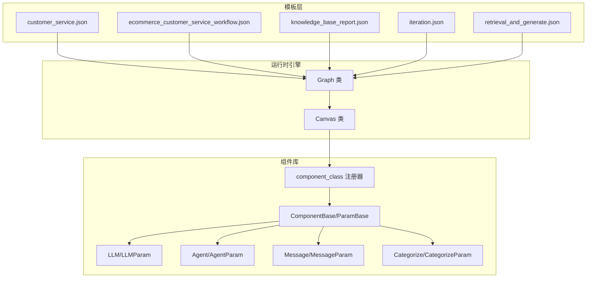
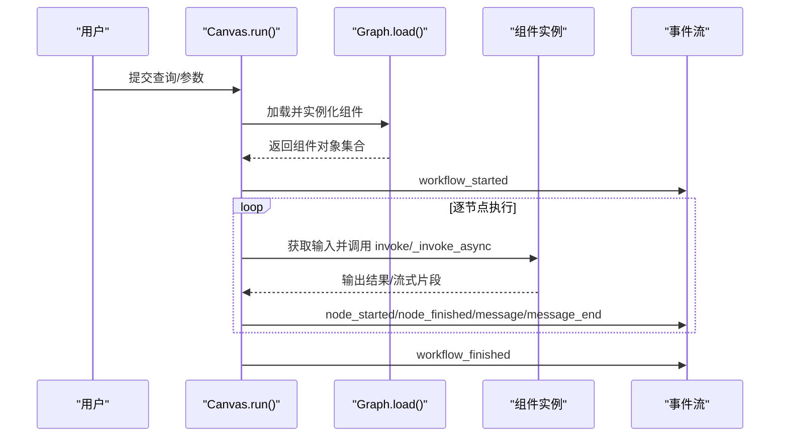
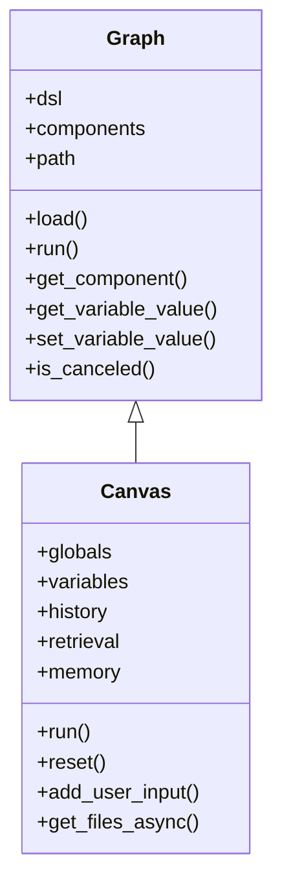
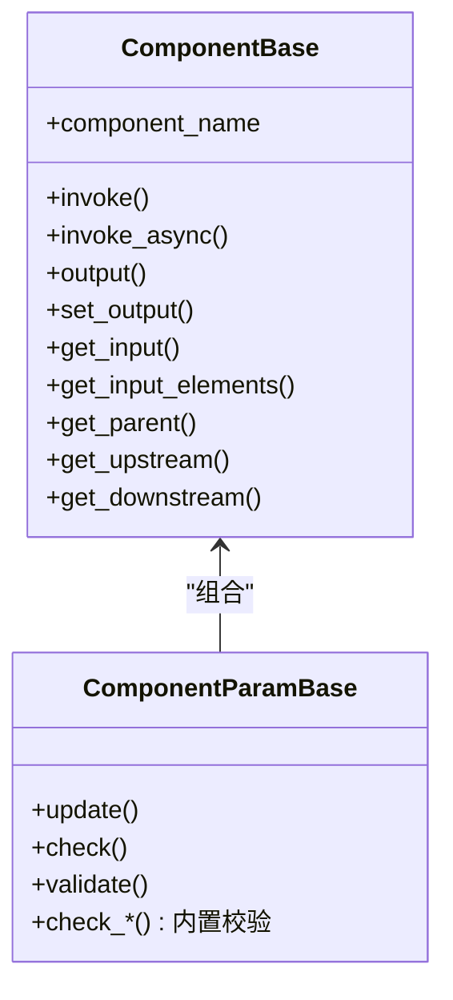
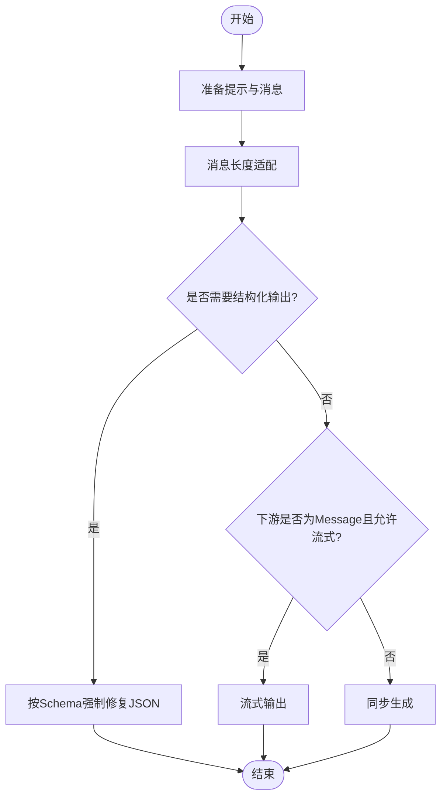
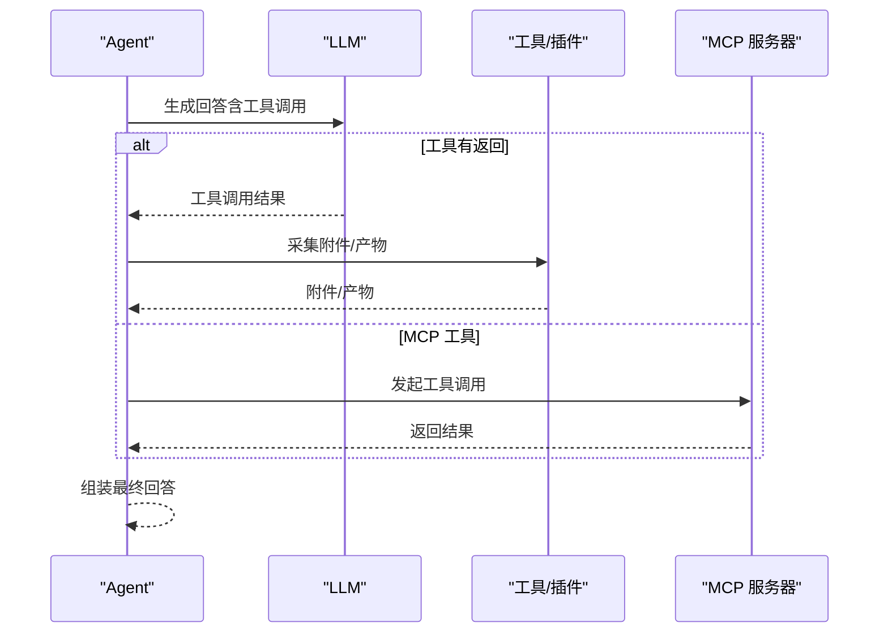
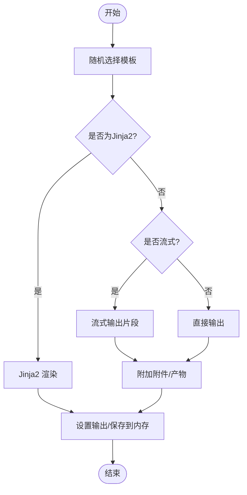
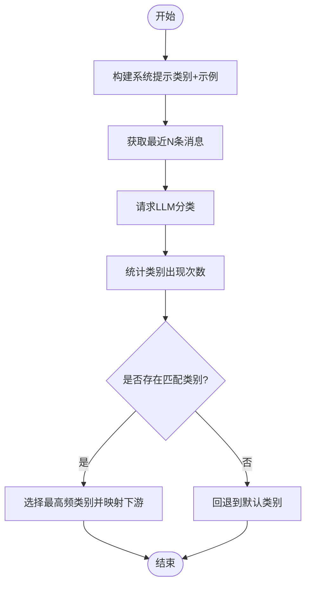
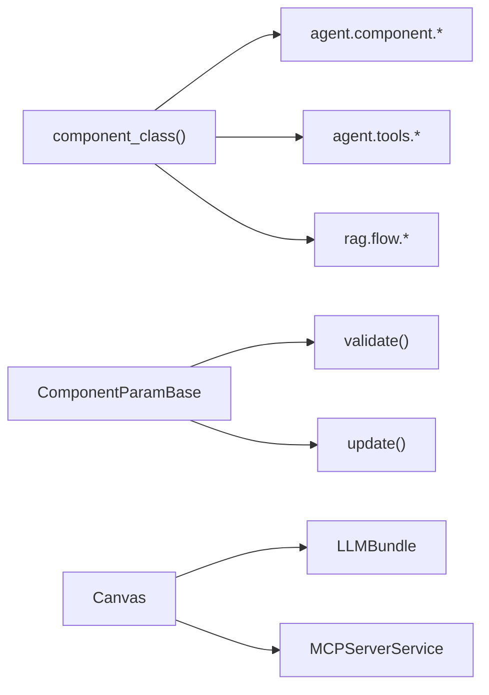

# 代理模板系统

<cite>
**本文引用的文件**
- [agent/canvas.py](file://agent/canvas.py)
- [agent/component/base.py](file://agent/component/base.py)
- [agent/component/__init__.py](file://agent/component/__init__.py)
- [agent/component/agent_with_tools.py](file://agent/component/agent_with_tools.py)
- [agent/component/llm.py](file://agent/component/llm.py)
- [agent/component/message.py](file://agent/component/message.py)
- [agent/component/categorize.py](file://agent/component/categorize.py)
- [agent/settings.py](file://agent/settings.py)
- [agent/templates/customer_service.json](file://agent/templates/customer_service.json)
- [agent/templates/ecommerce_customer_service_workflow.json](file://agent/templates/ecommerce_customer_service_workflow.json)
- [agent/templates/knowledge_base_report.json](file://agent/templates/knowledge_base_report.json)
- [agent/test/dsl_examples/iteration.json](file://agent/test/dsl_examples/iteration.json)
- [agent/test/dsl_examples/retrieval_and_generate.json](file://agent/test/dsl_examples/retrieval_and_generate.json)
</cite>

## 目录
1. [简介](#简介)
2. [项目结构](#项目结构)
3. [核心组件](#核心组件)
4. [架构总览](#架构总览)
5. [详细组件分析](#详细组件分析)
6. [依赖分析](#依赖分析)
7. [性能考量](#性能考量)
8. [故障排查指南](#故障排查指南)
9. [结论](#结论)
10. [附录](#附录)

## 简介
本技术文档面向“代理模板系统”，系统化阐述模板的结构、运行机制与管理方式，覆盖以下主题：
- 预定义模板的使用与应用场景（电商客服、知识问答、数据分析、内容生成等）
- 自定义模板的开发流程（DSL 语法、节点组合、参数设计、错误处理）
- 模板管理机制（导入导出、分享发布、版本控制、批量操作）
- 模板系统的架构设计（模板存储、版本管理、继承机制、复用策略）
- 执行逻辑与数据流（变量解析、上下游连接、异步流式输出）
- 性能优化与最佳实践

## 项目结构
代理模板系统由“模板 DSL 文件 + 运行时引擎 + 组件库”三部分构成：
- 模板 DSL：以 JSON 形式描述节点、连接、全局变量与图布局
- 运行时引擎：Canvas/Graph 负责加载 DSL、实例化组件、调度执行、变量解析与事件流
- 组件库：内置多种组件（Agent、LLM、Message、Categorize 等），支持工具调用与 MCP 扩展

图表来源
- [agent/canvas.py:42-165](file://agent/canvas.py#L42-L165)
- [agent/component/base.py:365-585](file://agent/component/base.py#L365-L585)
- [agent/component/__init__.py:51-59](file://agent/component/__init__.py#L51-L59)
- [agent/templates/customer_service.json:1-120](file://agent/templates/customer_service.json#L1-L120)
- [agent/test/dsl_examples/iteration.json:1-92](file://agent/test/dsl_examples/iteration.json#L1-L92)

章节来源
- [agent/canvas.py:42-165](file://agent/canvas.py#L42-L165)
- [agent/component/base.py:365-585](file://agent/component/base.py#L365-L585)
- [agent/component/__init__.py:51-59](file://agent/component/__init__.py#L51-L59)

## 核心组件
- Graph/Canvas：负责加载 DSL、实例化组件、维护执行路径、变量解析、事件流与取消控制
- ComponentBase/ParamBase：组件基类与参数基类，统一输入/输出、异常处理、超时控制、并发限制
- LLM/LLMParam：通用大模型组件，支持结构化输出、流式输出、引用标注、图片输入适配
- Agent/AgentParam：在 LLM 基础上扩展工具调用与 MCP 工具元数据绑定
- Message/MessageParam：消息输出组件，支持模板渲染、流式输出、格式转换（Markdown/HTML/PDF/DOCX/XLSX）、内存持久化
- Categorize/CategorizeParam：意图分类组件，根据类别描述与示例进行分类并决定下游分支

章节来源
- [agent/canvas.py:283-800](file://agent/canvas.py#L283-L800)
- [agent/component/base.py:40-585](file://agent/component/base.py#L40-L585)
- [agent/component/llm.py:34-455](file://agent/component/llm.py#L34-L455)
- [agent/component/agent_with_tools.py:39-379](file://agent/component/agent_with_tools.py#L39-L379)
- [agent/component/message.py:41-450](file://agent/component/message.py#L41-L450)
- [agent/component/categorize.py:30-166](file://agent/component/categorize.py#L30-L166)

## 架构总览
模板系统采用“声明式 DSL + 运行时引擎”的分层架构：
- 模板层：JSON DSL 描述节点、连接、全局变量与图布局
- 引擎层：Graph/Canvas 解析 DSL，动态实例化组件，按拓扑顺序调度执行
- 组件层：组件统一接口，支持参数校验、异常处理、并发与超时控制
- 工具层：Agent 支持内置工具与 MCP 工具调用，Message 支持附件与格式转换

图表来源
- [agent/canvas.py:375-668](file://agent/canvas.py#L375-L668)

## 详细组件分析

### Graph/Canvas 类族
- 职责：加载 DSL、实例化组件、维护执行路径、变量解析、事件流、取消控制
- 关键点：
  - 变量解析：支持 sys.env. 变量与组件输出引用（如 Agent:Name@content）
  - 并发：线程池与信号量控制并发，支持异步/同步调用
  - 事件：标准化事件（workflow_started/node_started/node_finished/message/message_end/workflow_finished）
  - 取消：基于 Redis 标记的任务取消

图表来源
- [agent/canvas.py:42-165](file://agent/canvas.py#L42-L165)
- [agent/canvas.py:283-800](file://agent/canvas.py#L283-L800)

章节来源
- [agent/canvas.py:42-165](file://agent/canvas.py#L42-L165)
- [agent/canvas.py:283-800](file://agent/canvas.py#L283-L800)

### 组件基类与参数基类
- ComponentBase：统一输入/输出、异常处理、超时、并发、父子关系、上游/下游、参数校验
- ComponentParamBase：参数更新、深度校验、冗余参数检测、内置校验器（数值范围、布尔、字符串等）

图表来源
- [agent/component/base.py:40-585](file://agent/component/base.py#L40-L585)

章节来源
- [agent/component/base.py:40-585](file://agent/component/base.py#L40-L585)

### LLM 组件
- 功能：系统提示拼接、消息历史截断、结构化输出、流式输出、引用标注、图片输入适配
- 特性：支持输出结构化 JSON Schema 的强制修复；流式输出中“思考”标记过滤；工具调用摘要写入记忆

图表来源
- [agent/component/llm.py:272-446](file://agent/component/llm.py#L272-L446)

章节来源
- [agent/component/llm.py:34-455](file://agent/component/llm.py#L34-L455)

### Agent 组件（工具与 MCP）
- 在 LLM 基础上扩展工具调用与 MCP 工具元数据绑定，支持结构化输出、流式输出、引用标注、工具产物 Markdown 附件
- 回调：记录工具调用轨迹，便于可观测性与审计

图表来源
- [agent/component/agent_with_tools.py:188-320](file://agent/component/agent_with_tools.py#L188-L320)

章节来源
- [agent/component/agent_with_tools.py:39-379](file://agent/component/agent_with_tools.py#L39-L379)

### Message 组件
- 功能：随机选择模板内容、Jinja2 渲染、流式输出、格式转换（Markdown/HTML/PDF/DOCX/XLSX）、内存持久化
- 特性：Markdown 表格解析与 Excel 多表导出；异步生成与上传

图表来源
- [agent/component/message.py:182-450](file://agent/component/message.py#L182-L450)

章节来源
- [agent/component/message.py:41-450](file://agent/component/message.py#L41-L450)

### Categorize 组件
- 功能：根据类别描述与示例进行意图分类，输出类别名与下游分支列表
- 特性：动态生成系统提示，统计类别出现次数，选择最高频类别作为决策依据

图表来源
- [agent/component/categorize.py:108-166](file://agent/component/categorize.py#L108-L166)

章节来源
- [agent/component/categorize.py:30-166](file://agent/component/categorize.py#L30-L166)

## 依赖分析
- 组件注册：通过 component_class 动态导入模块并注册组件类，支持 agent.component、agent.tools、rag.flow
- 参数校验：ComponentParamBase 支持最大嵌套深度与冗余参数检测，避免配置错误
- 运行时依赖：Canvas 依赖 LLMBundle、TenantLLMService、MCPServerService 等服务

图表来源
- [agent/component/__init__.py:51-59](file://agent/component/__init__.py#L51-L59)
- [agent/component/base.py:127-187](file://agent/component/base.py#L127-L187)
- [agent/canvas.py:83-92](file://agent/canvas.py#L83-L92)

章节来源
- [agent/component/__init__.py:51-59](file://agent/component/__init__.py#L51-L59)
- [agent/component/base.py:127-187](file://agent/component/base.py#L127-L187)
- [agent/canvas.py:83-92](file://agent/canvas.py#L83-L92)

## 性能考量
- 并发控制：组件级并发信号量与线程池，避免资源争用
- 流式输出：Message/LLM 支持增量输出，降低首屏延迟
- 消息长度适配：message_fit_in 截断过长上下文，保证 Token 上限
- 图片输入：自动识别 data:image/ 数据，按需切换图像模型
- 取消与超时：统一的取消检查与超时装饰器，防止长时间阻塞

章节来源
- [agent/component/base.py:365-585](file://agent/component/base.py#L365-L585)
- [agent/component/llm.py:272-366](file://agent/component/llm.py#L272-L366)
- [agent/component/message.py:111-174](file://agent/component/message.py#L111-L174)
- [agent/canvas.py:435-483](file://agent/canvas.py#L435-L483)

## 故障排查指南
- 任务取消：Canvas 通过 Redis 标记检测取消状态，抛出 TaskCanceledException
- 异常处理：组件异常可配置 goto/default_value/comment 策略，避免中断整个流程
- 参数校验：参数越界或类型不匹配会触发 ValueError，建议检查 DSL 中的数值范围与必填项
- 工具调用：Agent 工具调用失败时，回调记录工具名称、参数与结果，便于定位问题

章节来源
- [agent/canvas.py:271-281](file://agent/canvas.py#L271-L281)
- [agent/component/base.py:567-582](file://agent/component/base.py#L567-L582)
- [agent/component/agent_with_tools.py:208-260](file://agent/component/agent_with_tools.py#L208-L260)

## 结论
代理模板系统通过“声明式 DSL + 运行时引擎 + 组件库”的架构，提供了高可复用、强扩展性的代理编排能力。借助统一的变量解析、事件流与工具集成，开发者可以快速构建从电商客服到知识问答、数据分析与内容生成的复杂工作流。

## 附录

### 模板使用与场景
- 电商客服：意图分类 + 知识检索 + 多 Agent 协作（安装预约、产品对比、使用指导）
- 知识问答：检索增强 + 结构化输出 + 引用标注
- 数据分析：迭代式检索 + 报告生成
- 内容生成：Message 组件支持多种格式导出，适合报告与表格输出

章节来源
- [agent/templates/customer_service.json:1-333](file://agent/templates/customer_service.json#L1-L333)
- [agent/templates/ecommerce_customer_service_workflow.json:1-1056](file://agent/templates/ecommerce_customer_service_workflow.json#L1-L1056)
- [agent/templates/knowledge_base_report.json:1-333](file://agent/templates/knowledge_base_report.json#L1-L333)

### DSL 语法与节点组合
- 节点定义：components 下每个键为组件 ID，包含 obj（component_name/params）、upstream/downstream
- 全局变量：globals 中 sys.* 与 env.* 变量参与渲染
- 图布局：graph.edges/graph.nodes 定义可视化布局与连接关系
- 变量引用：支持 sys.env. 与 组件@字段 的表达式解析

章节来源
- [agent/test/dsl_examples/iteration.json:1-92](file://agent/test/dsl_examples/iteration.json#L1-L92)
- [agent/test/dsl_examples/retrieval_and_generate.json:1-61](file://agent/test/dsl_examples/retrieval_and_generate.json#L1-L61)
- [agent/canvas.py:166-270](file://agent/canvas.py#L166-L270)

### 模板管理功能建议
- 导入导出：将 Canvas.__str__ 序列化的 DSL 作为模板存档；支持从 JSON 恢复
- 分享发布：通过版本号与标题描述管理模板；建议在 templates 目录下按业务域分组
- 版本控制：为模板增加 id/version 字段；变更时生成新版本并保留历史
- 批量操作：通过脚本遍历 templates 目录，批量校验 DSL 语法与参数有效性

章节来源
- [agent/canvas.py:111-131](file://agent/canvas.py#L111-L131)
- [agent/settings.py:17-19](file://agent/settings.py#L17-L19)

### 开发指南与最佳实践
- DSL 设计：先画出拓扑图，再填充 components 与 graph；确保上游先于下游
- 参数设计：优先使用结构化输出（structured）约束 Agent 输出；合理设置 max_tokens/temperature
- 错误处理：为关键节点配置 exception_goto/default_value/comment
- 性能优化：启用流式输出；对长上下文使用 message_fit_in；必要时拆分迭代循环
- 可观测性：利用工具回调与事件流记录关键步骤；为复杂流程添加日志与追踪

章节来源
- [agent/component/agent_with_tools.py:208-320](file://agent/component/agent_with_tools.py#L208-L320)
- [agent/component/llm.py:367-446](file://agent/component/llm.py#L367-L446)
- [agent/canvas.py:484-668](file://agent/canvas.py#L484-L668)