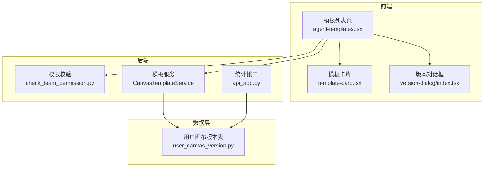
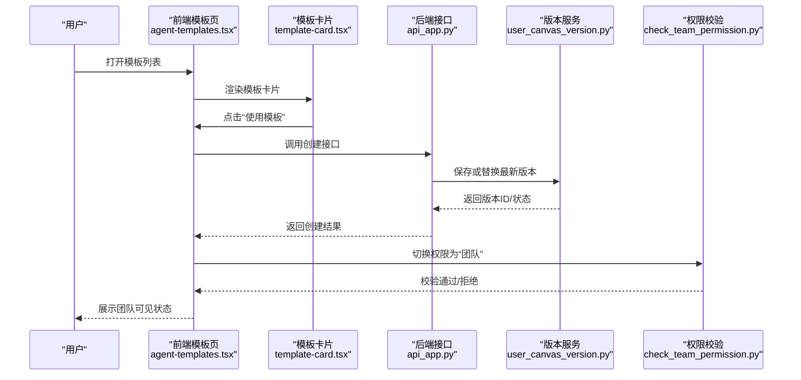
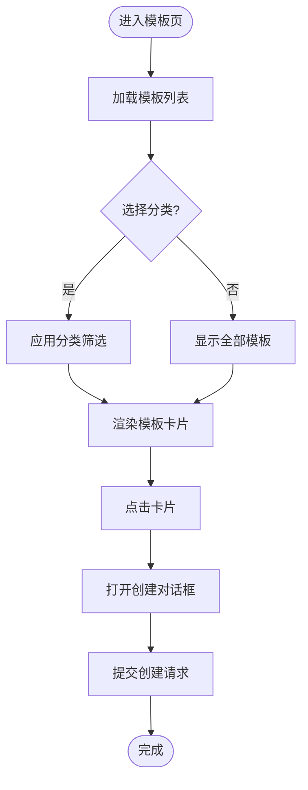
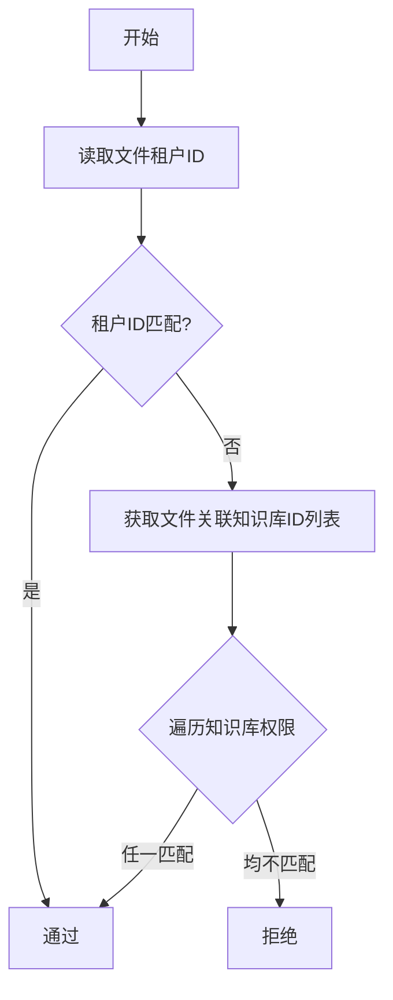
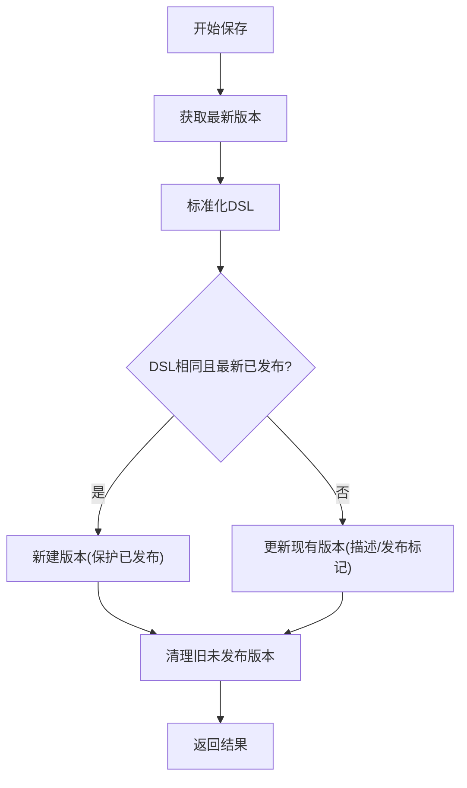
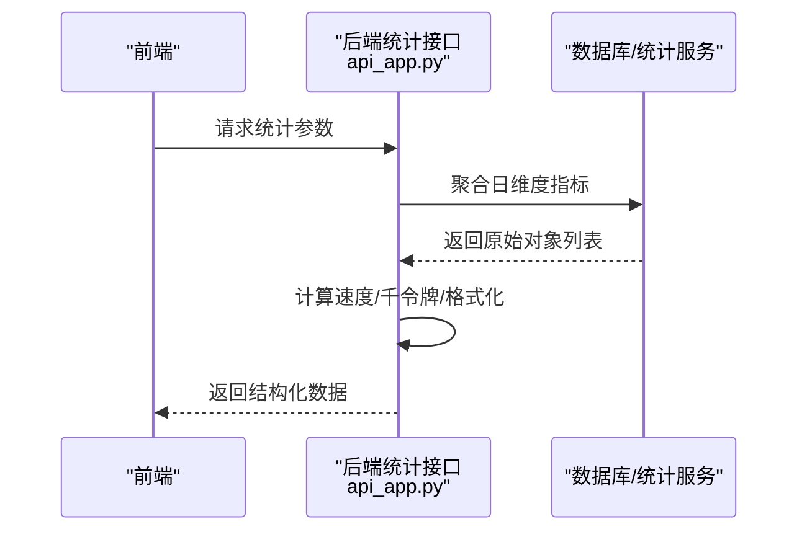
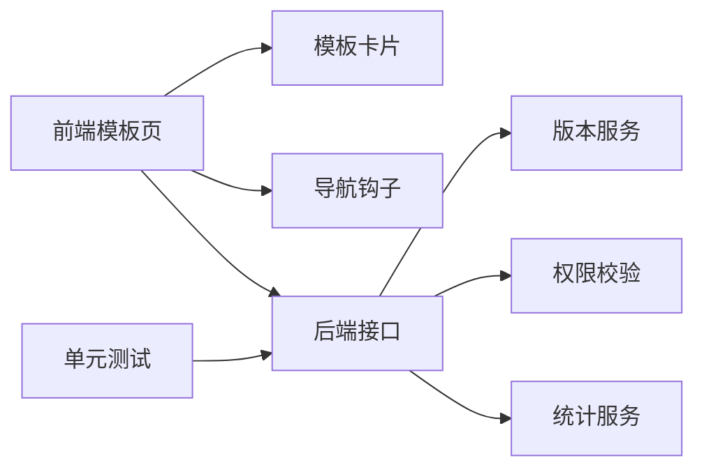

# 模板分享

<cite>
**本文引用的文件**
- [agent-templates.tsx](file://web/src/pages/agents/agent-templates.tsx)
- [template-card.tsx](file://web/src/pages/agents/template-card.tsx)
- [check_team_permission.py](file://api/common/check_team_permission.py)
- [permission.ts](file://web/src/constants/permission.ts)
- [share_agents.md](file://docs/guides/team/share_agents.md)
- [user_canvas_version.py](file://api/db/services/user_canvas_version.py)
- [version-dialog/index.tsx](file://web/src/pages/agent/version-dialog/index.tsx)
- [advanced_ingestion_pipeline.json](file://agent/templates/advanced_ingestion_pipeline.json)
- [knowledge_base_report.json](file://agent/templates/knowledge_base_report.json)
- [ecommerce_customer_service_workflow.json](file://agent/templates/ecommerce_customer_service_workflow.json)
- [customer_review_analysis.json](file://agent/templates/customer_review_analysis.json)
- [api_app.py](file://api/apps/api_app.py)
- [test_api_tokens_unit.py](file://test/testcases/test_web_api/test_api_app/test_api_tokens_unit.py)
- [contributing.md](file://docs/develop/contributing.md)
</cite>

## 目录
1. [简介](#简介)
2. [项目结构](#项目结构)
3. [核心组件](#核心组件)
4. [架构总览](#架构总览)
5. [详细组件分析](#详细组件分析)
6. [依赖关系分析](#依赖关系分析)
7. [性能考量](#性能考量)
8. [故障排查指南](#故障排查指南)
9. [结论](#结论)
10. [附录](#附录)

## 简介
本技术文档围绕“模板分享”主题，系统梳理代理模板的共享机制、权限控制、协作功能与社区生态。内容涵盖模板分享流程（分享设置、权限配置、访问控制、使用统计）、模板版本管理（版本发布、更新通知、兼容性检查、回滚机制）、模板协作（团队共享、权限分级、使用记录、贡献统计）、模板审核与治理（质量评估、安全检查、合规验证），以及模板发布指南（模板规范、文档要求、示例提供、评价标准）。同时给出模板发现与搜索功能的实现思路，并总结如何构建健康可持续的模板共享生态系统。

## 项目结构
模板分享涉及前端页面、后端接口与数据库服务三部分协同：
- 前端：模板列表页、模板卡片、版本对话框等组件负责用户交互与数据展示。
- 后端：权限校验、模板查询、版本持久化、统计数据聚合等服务支撑模板分享与协作。
- 数据层：用户画布版本表用于保存模板历史版本，便于版本发布与回滚。

图表来源
- [agent-templates.tsx:13-120](file://web/src/pages/agents/agent-templates.tsx#L13-L120)
- [template-card.tsx:15-60](file://web/src/pages/agents/template-card.tsx#L15-L60)
- [version-dialog/index.tsx:29-64](file://web/src/pages/agent/version-dialog/index.tsx#L29-L64)
- [check_team_permission.py:40-59](file://api/common/check_team_permission.py#L40-L59)
- [api_app.py:104-117](file://api/apps/api_app.py#L104-L117)
- [user_canvas_version.py:74-184](file://api/db/services/user_canvas_version.py#L74-L184)

章节来源
- [agent-templates.tsx:13-120](file://web/src/pages/agents/agent-templates.tsx#L13-L120)
- [template-card.tsx:15-60](file://web/src/pages/agents/template-card.tsx#L15-L60)
- [check_team_permission.py:40-59](file://api/common/check_team_permission.py#L40-L59)
- [api_app.py:104-117](file://api/apps/api_app.py#L104-L117)
- [user_canvas_version.py:74-184](file://api/db/services/user_canvas_version.py#L74-L184)

## 核心组件
- 模板列表与筛选：前端模板列表页负责加载模板、侧边栏分类筛选与创建对话框触发。
- 模板卡片：展示模板标题、描述与头像，提供“使用模板”入口。
- 权限常量：前端定义“仅自己/团队”两种可见范围枚举。
- 团队权限校验：后端根据文件所属租户与知识库权限判断是否可共享。
- 版本服务：后端服务负责模板版本的保存、去重、清理与最新版本查询。
- 统计接口：后端聚合访问量、独立访客、时长、轮次、点赞等指标。

章节来源
- [agent-templates.tsx:13-120](file://web/src/pages/agents/agent-templates.tsx#L13-L120)
- [template-card.tsx:15-60](file://web/src/pages/agents/template-card.tsx#L15-L60)
- [permission.ts:1-4](file://web/src/constants/permission.ts#L1-L4)
- [check_team_permission.py:40-59](file://api/common/check_team_permission.py#L40-L59)
- [user_canvas_version.py:74-184](file://api/db/services/user_canvas_version.py#L74-L184)
- [api_app.py:104-117](file://api/apps/api_app.py#L104-L117)

## 架构总览
模板分享的端到端流程如下：
- 用户在模板列表页浏览模板，点击卡片进入创建对话框。
- 创建时后端保存模板DSL到用户画布版本表，按需发布版本。
- 权限设置为“团队”后，团队成员可见；后端通过租户与知识库权限进行校验。
- 使用统计由后端聚合并返回前端展示。

图表来源
- [agent-templates.tsx:43-72](file://web/src/pages/agents/agent-templates.tsx#L43-L72)
- [template-card.tsx:18-20](file://web/src/pages/agents/template-card.tsx#L18-L20)
- [api_app.py:104-117](file://api/apps/api_app.py#L104-L117)
- [user_canvas_version.py:125-181](file://api/db/services/user_canvas_version.py#L125-L181)
- [check_team_permission.py:40-59](file://api/common/check_team_permission.py#L40-L59)

## 详细组件分析

### 模板列表与卡片组件
- 模板列表页负责拉取模板列表、侧边栏筛选、弹窗创建与跳转编辑页。
- 模板卡片展示多语言标题与描述、头像，悬停显示“使用模板”按钮。

图表来源
- [agent-templates.tsx:73-86](file://web/src/pages/agents/agent-templates.tsx#L73-L86)
- [template-card.tsx:18-20](file://web/src/pages/agents/template-card.tsx#L18-L20)

章节来源
- [agent-templates.tsx:13-120](file://web/src/pages/agents/agent-templates.tsx#L13-L120)
- [template-card.tsx:15-60](file://web/src/pages/agents/template-card.tsx#L15-L60)

### 权限控制与团队共享
- 前端权限枚举包含“仅自己/团队”，用于切换可见范围。
- 团队权限校验逻辑：若文件所属租户匹配目标租户，直接通过；否则遍历文件关联的知识库，逐个校验知识库权限，任一匹配即通过。

图表来源
- [check_team_permission.py:40-59](file://api/common/check_team_permission.py#L40-L59)
- [permission.ts:1-4](file://web/src/constants/permission.ts#L1-L4)

章节来源
- [check_team_permission.py:40-59](file://api/common/check_team_permission.py#L40-L59)
- [permission.ts:1-4](file://web/src/constants/permission.ts#L1-L4)
- [share_agents.md:8-21](file://docs/guides/team/share_agents.md#L8-L21)

### 模板版本管理
- 保存策略：若最新版本DSL与当前一致，则更新现有版本；若最新版本已发布且当前未发布，则新建版本以保护已发布版本。
- 清理策略：保留最近若干未发布版本，超出上限则删除旧版本。
- 查询策略：支持查询最新已发布版本与最新版本标题。

图表来源
- [user_canvas_version.py:125-181](file://api/db/services/user_canvas_version.py#L125-L181)
- [version-dialog/index.tsx:29-64](file://web/src/pages/agent/version-dialog/index.tsx#L29-L64)

章节来源
- [user_canvas_version.py:74-184](file://api/db/services/user_canvas_version.py#L74-L184)
- [version-dialog/index.tsx:29-64](file://web/src/pages/agent/version-dialog/index.tsx#L29-L64)

### 使用统计与指标聚合
- 后端对日维度的访问量、独立访客、轮次、点赞等进行聚合，并计算速度与千令牌消耗。
- 单元测试覆盖了聚合异常路径与边界条件。

图表来源
- [api_app.py:104-117](file://api/apps/api_app.py#L104-L117)
- [test_api_tokens_unit.py:206-247](file://test/testcases/test_web_api/test_api_app/test_api_tokens_unit.py#L206-L247)

章节来源
- [api_app.py:104-117](file://api/apps/api_app.py#L104-L117)
- [test_api_tokens_unit.py:206-247](file://test/testcases/test_web_api/test_api_app/test_api_tokens_unit.py#L206-L247)

### 模板示例与规范
- 示例模板：包含复杂数据处理流水线、知识库检索智能体、电商客服工作流、客户评论分析等，体现不同场景下的组件组合与提示词设计。
- 发布指南：建议遵循“模板规范、文档要求、示例提供、评价标准”，并参考贡献指南进行PR流程与评审。

章节来源
- [advanced_ingestion_pipeline.json:1-728](file://agent/templates/advanced_ingestion_pipeline.json#L1-L728)
- [knowledge_base_report.json:1-333](file://agent/templates/knowledge_base_report.json#L1-L333)
- [ecommerce_customer_service_workflow.json:1-28](file://agent/templates/ecommerce_customer_service_workflow.json#L1-L28)
- [customer_review_analysis.json:400-448](file://agent/templates/customer_review_analysis.json#L400-L448)
- [contributing.md:30-59](file://docs/develop/contributing.md#L30-L59)

## 依赖关系分析
- 前端模板页依赖模板卡片组件与导航钩子；创建对话框触发后端创建与跳转。
- 权限校验依赖文件与知识库服务；团队共享文档指导用户操作。
- 版本服务依赖数据库连接上下文与DSL标准化；统计接口依赖会话服务与聚合逻辑。
- 测试用例覆盖统计聚合与错误路径，保障稳定性。

图表来源
- [agent-templates.tsx:43-72](file://web/src/pages/agents/agent-templates.tsx#L43-L72)
- [template-card.tsx:18-20](file://web/src/pages/agents/template-card.tsx#L18-L20)
- [check_team_permission.py:40-59](file://api/common/check_team_permission.py#L40-L59)
- [api_app.py:104-117](file://api/apps/api_app.py#L104-L117)
- [user_canvas_version.py:74-184](file://api/db/services/user_canvas_version.py#L74-L184)
- [test_api_tokens_unit.py:206-247](file://test/testcases/test_web_api/test_api_app/test_api_tokens_unit.py#L206-L247)

章节来源
- [agent-templates.tsx:13-120](file://web/src/pages/agents/agent-templates.tsx#L13-L120)
- [template-card.tsx:15-60](file://web/src/pages/agents/template-card.tsx#L15-L60)
- [check_team_permission.py:40-59](file://api/common/check_team_permission.py#L40-L59)
- [api_app.py:104-117](file://api/apps/api_app.py#L104-L117)
- [user_canvas_version.py:74-184](file://api/db/services/user_canvas_version.py#L74-L184)
- [test_api_tokens_unit.py:206-247](file://test/testcases/test_web_api/test_api_app/test_api_tokens_unit.py#L206-L247)

## 性能考量
- 版本清理：限制未发布版本数量，避免历史版本无限增长导致存储与查询压力。
- 统计聚合：按日维度聚合，减少高频查询的计算开销；对除零与单位转换进行边界处理。
- 前端渲染：模板卡片懒加载与分页，降低首屏渲染压力。

## 故障排查指南
- 权限问题：确认文件租户ID与目标租户一致，或检查知识库权限是否允许团队访问。
- 版本异常：若最新版本未更新或重复创建，请检查DSL标准化与发布标记逻辑。
- 统计异常：当统计接口报错时，检查会话服务异常与输入参数合法性。

章节来源
- [check_team_permission.py:40-59](file://api/common/check_team_permission.py#L40-L59)
- [user_canvas_version.py:125-181](file://api/db/services/user_canvas_version.py#L125-L181)
- [test_api_tokens_unit.py:206-247](file://test/testcases/test_web_api/test_api_app/test_api_tokens_unit.py#L206-L247)

## 结论
模板分享体系通过“前端模板页/卡片 + 后端权限校验 + 版本服务 + 统计接口”的协同，实现了从模板发现、使用、权限控制到协作与生态治理的闭环。版本管理确保模板演进的可追溯与可回滚，使用统计为优化与运营提供依据。建议在社区层面完善模板审核与治理机制，持续提升模板质量与安全性，推动模板资源的广泛传播与高效复用。

## 附录
- 模板发布指南要点
  - 规范：统一模板结构、命名与提示词风格。
  - 文档：提供使用说明、最佳实践与注意事项。
  - 示例：提供可运行的DSL示例与截图。
  - 评价：基于可用性、性能与可维护性的评分标准。
- 参考贡献流程：遵循PR提交、评审与CI合并流程，确保变更可追踪与可回归。

章节来源
- [contributing.md:30-59](file://docs/develop/contributing.md#L30-L59)