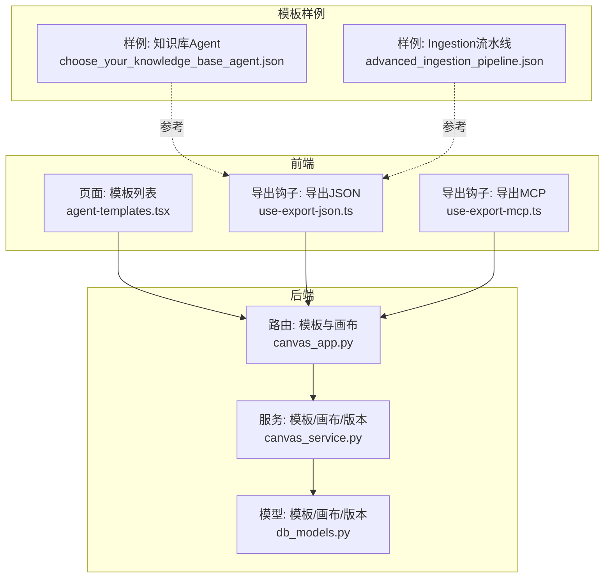
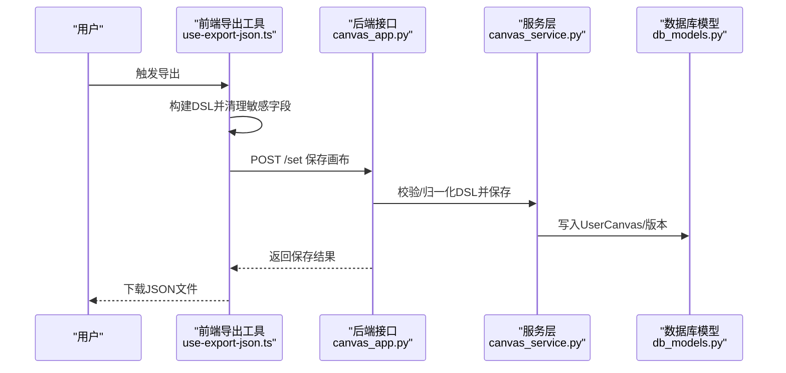
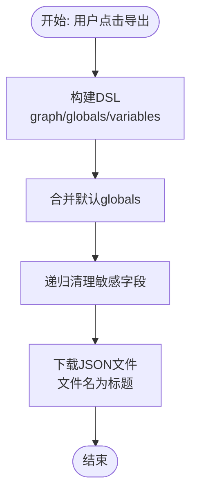
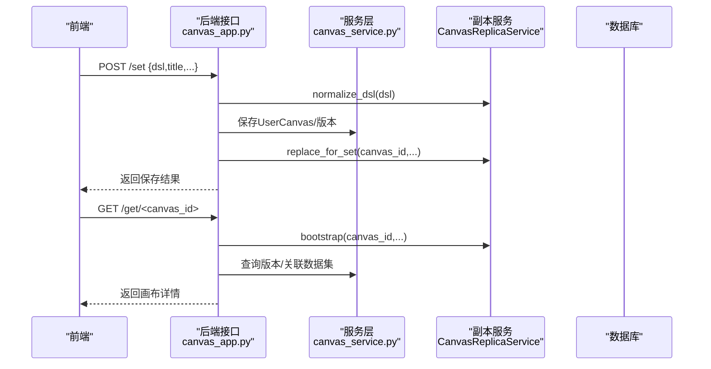
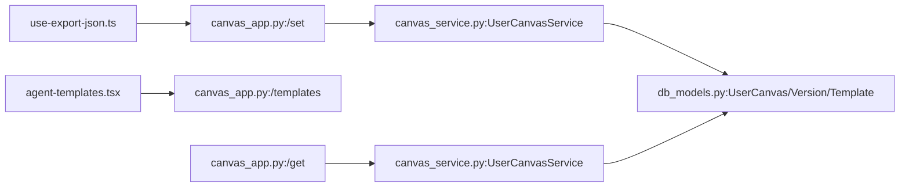

# 模板导入导出

<cite>
**本文引用的文件**
- [canvas_app.py](file://api/apps/canvas_app.py)
- [canvas_service.py](file://api/db/services/canvas_service.py)
- [db_models.py](file://api/db/db_models.py)
- [agent-templates.tsx](file://web/src/pages/agents/agent-templates.tsx)
- [use-export-json.ts](file://web/src/pages/agent/hooks/use-export-json.ts)
- [use-export-mcp.ts](file://web/src/pages/user-setting/mcp/use-export-mcp.ts)
- [advanced_ingestion_pipeline.json](file://agent/templates/advanced_ingestion_pipeline.json)
- [choose_your_knowledge_base_agent.json](file://agent/templates/choose_your_knowledge_base_agent.json)
</cite>

## 目录
1. [简介](#简介)
2. [项目结构](#项目结构)
3. [核心组件](#核心组件)
4. [架构总览](#架构总览)
5. [详细组件分析](#详细组件分析)
6. [依赖关系分析](#依赖关系分析)
7. [性能考量](#性能考量)
8. [故障排查指南](#故障排查指南)
9. [结论](#结论)
10. [附录](#附录)

## 简介
本文件面向“代理模板”的导入、导出、分享与管理机制，系统化梳理模板的 JSON 结构、导入校验、导出流程、版本与权限控制、以及前端导出工具链。通过后端接口与前端工具的协同，实现模板的标准化导出（含敏感信息清理）、版本化保存、团队共享与复用。

## 项目结构
围绕模板导入导出的关键模块与文件如下：
- 后端接口层：负责模板列表、保存、获取、导出下载等能力
- 数据服务层：负责模板与画布的持久化、版本与权限控制
- 前端导出工具：负责构建 DSL、清理敏感字段、生成并下载 JSON 文件
- 模板样例：提供标准 JSON 结构参考

图表来源
- [canvas_app.py](file://api/apps/canvas_app.py)
- [canvas_service.py](file://api/db/services/canvas_service.py)
- [db_models.py](file://api/db/db_models.py)
- [agent-templates.tsx](file://web/src/pages/agents/agent-templates.tsx)
- [use-export-json.ts](file://web/src/pages/agent/hooks/use-export-json.ts)
- [use-export-mcp.ts](file://web/src/pages/user-setting/mcp/use-export-mcp.ts)
- [choose_your_knowledge_base_agent.json](file://agent/templates/choose_your_knowledge_base_agent.json)
- [advanced_ingestion_pipeline.json](file://agent/templates/advanced_ingestion_pipeline.json)

章节来源
- [canvas_app.py](file://api/apps/canvas_app.py)
- [canvas_service.py](file://api/db/services/canvas_service.py)
- [db_models.py](file://api/db/db_models.py)
- [agent-templates.tsx](file://web/src/pages/agents/agent-templates.tsx)
- [use-export-json.ts](file://web/src/pages/agent/hooks/use-export-json.ts)
- [use-export-mcp.ts](file://web/src/pages/user-setting/mcp/use-export-mcp.ts)
- [advanced_ingestion_pipeline.json](file://agent/templates/advanced_ingestion_pipeline.json)
- [choose_your_knowledge_base_agent.json](file://agent/templates/choose_your_knowledge_base_agent.json)

## 核心组件
- 模板与画布模型
  - CanvasTemplate：模板表，包含 id、avatar、title、description、canvas_type、canvas_category、dsl 等字段
  - UserCanvas：用户画布表，包含权限、发布状态、类型、分类、DSL 等
  - UserCanvasVersion：版本表，记录每次保存的 DSL 快照与发布时间
- 服务层
  - CanvasTemplateService：模板 CRUD 与列表
  - UserCanvasService：画布的增删改查、权限校验、版本检索
  - UserCanvasVersionService：版本保存、最新版本标题、已发布版本检索
- 接口层
  - /templates：列出模板
  - /set：保存画布（含 normalize、版本保存、副本同步）
  - /get/<canvas_id>：获取画布并注入运行态副本
  - /download：按 id 下载二进制文件（用于通用文件下载）
- 前端导出
  - 构建 DSL 的 graph/globals/variables，并清理敏感字段（如某些工具的 api_key）
  - 下载为 JSON 文件，文件名采用画布标题

章节来源
- [db_models.py](file://api/db/db_models.py)
- [canvas_service.py](file://api/db/services/canvas_service.py)
- [canvas_app.py](file://api/apps/canvas_app.py)
- [use-export-json.ts](file://web/src/pages/agent/hooks/use-export-json.ts)

## 架构总览
模板导入导出涉及前后端协作：前端负责 DSL 构建与敏感信息清理；后端负责模板与画布的持久化、版本化与权限控制；模板样例作为结构参考。

图表来源
- [use-export-json.ts](file://web/src/pages/agent/hooks/use-export-json.ts)
- [canvas_app.py](file://api/apps/canvas_app.py)
- [canvas_service.py](file://api/db/services/canvas_service.py)
- [db_models.py](file://api/db/db_models.py)

## 详细组件分析

### 模板导出（前端）
- 功能要点
  - 从当前编辑器构建 DSL（graph/globals/variables），并合并默认 globals
  - 递归清理敏感字段（如 Tavily/Google 等工具的 api_key）
  - 调用下载工具生成 JSON 并以画布标题命名
- 关键路径
  - DSL 构建与清洗：[use-export-json.ts](file://web/src/pages/agent/hooks/use-export-json.ts)
  - 页面集成：[agent-templates.tsx](file://web/src/pages/agents/agent-templates.tsx)

图表来源
- [use-export-json.ts](file://web/src/pages/agent/hooks/use-export-json.ts)
- [agent-templates.tsx](file://web/src/pages/agents/agent-templates.tsx)

章节来源
- [use-export-json.ts](file://web/src/pages/agent/hooks/use-export-json.ts)
- [agent-templates.tsx](file://web/src/pages/agents/agent-templates.tsx)

### 模板导入（后端）
- 入口与流程
  - 前端调用 /set 保存画布，后端进行 DSL 归一化、权限校验、版本保存与副本同步
  - 获取画布 /get/<canvas_id> 会注入运行态副本并返回最新发布时间等信息
- 关键点
  - DSL 归一化：CanvasReplicaService.normalize_dsl
  - 版本保存：UserCanvasVersionService.save_or_replace_latest
  - 权限校验：UserCanvasService.accessible
  - 运行态副本：CanvasReplicaService.bootstrap/load_for_run/commit_after_run

图表来源
- [canvas_app.py](file://api/apps/canvas_app.py)
- [canvas_service.py](file://api/db/services/canvas_service.py)

章节来源
- [canvas_app.py](file://api/apps/canvas_app.py)
- [canvas_service.py](file://api/db/services/canvas_service.py)

### 模板分享与权限
- 权限模型
  - 画布权限字段 permission 支持 “me|team”，用于区分仅本人或团队可见
  - 列表查询会聚合团队成员可访问的画布
- 分享流程
  - 将权限从“仅我”改为“团队”，保存后即对团队成员可见
  - 团队成员可在模板列表中看到并克隆使用

章节来源
- [db_models.py](file://api/db/db_models.py)
- [canvas_service.py](file://api/db/services/canvas_service.py)

### 模板版本管理
- 版本记录
  - 每次保存都会写入一条版本记录，包含 DSL 快照与发布时间
  - 支持检索最新版本标题与已发布版本
- 发布与回滚
  - 已发布版本可用于稳定运行态
  - 历史版本可通过 /getlistversion/<canvas_id> 与 /getversion/<version_id> 查看

章节来源
- [db_models.py](file://api/db/db_models.py)
- [canvas_service.py](file://api/db/services/canvas_service.py)
- [canvas_app.py](file://api/apps/canvas_app.py)

### 模板格式规范与样例
- 字段说明（摘自模板样例）
  - id：模板唯一标识
  - title/description：多语言标题与描述
  - canvas_type：画布类型（如 Agent/Dataflow）
  - canvas_category：画布分类（agent_canvas/dataflow_canvas）
  - dsl：画布执行图与全局变量
  - avatar：头像（可选）
- 样例参考
  - 知识库 Agent 模板：[choose_your_knowledge_base_agent.json](file://agent/templates/choose_your_knowledge_base_agent.json)
  - Ingestion 流水线模板：[advanced_ingestion_pipeline.json](file://agent/templates/advanced_ingestion_pipeline.json)

章节来源
- [choose_your_knowledge_base_agent.json](file://agent/templates/choose_your_knowledge_base_agent.json)
- [advanced_ingestion_pipeline.json](file://agent/templates/advanced_ingestion_pipeline.json)

### 导入流程（文件验证、格式检查、兼容性、冲突处理）
- 文件验证
  - 前端导出时已对 DSL 进行清洗与结构化
  - 后端 /set 对 DSL 进行归一化与校验
- 格式检查
  - 模板 JSON 需包含 id/title/canvas_type/canvas_category/dsl 等关键字段
  - dsl 应符合画布执行图结构
- 兼容性确认
  - 通过 CanvasReplicaService.normalize_dsl 统一 DSL 结构
- 冲突解决
  - 若同名画布存在，后端返回错误提示
  - 建议在导入前重命名或选择覆盖策略

章节来源
- [canvas_app.py](file://api/apps/canvas_app.py)
- [canvas_service.py](file://api/db/services/canvas_service.py)

### 分享机制（发布、版本、权限、下载统计）
- 发布
  - 通过版本发布标记 release，供运行态选择“已发布模式”
- 权限
  - permission 字段控制“仅我/团队”可见
- 下载
  - 通用文件下载接口 /download 支持按 id 下载
- 统计
  - 未发现内置下载计数字段；如需统计可扩展后端埋点

章节来源
- [db_models.py](file://api/db/db_models.py)
- [canvas_app.py](file://api/apps/canvas_app.py)

### 最佳实践
- 文件命名
  - 导出文件名建议使用“画布标题.json”
- 存储位置
  - 导出文件保存于本地，便于团队共享与版本管理
- 备份策略
  - 定期导出重要画布 DSL 至版本控制系统
- 迁移步骤
  - 在新环境重新导入 JSON，确保 DSL 兼容性与依赖可用
- 高级功能
  - 批量导出：前端支持多模板导出
  - 自动化脚本：结合后端 /set 接口与模板 JSON，实现自动化导入

章节来源
- [use-export-json.ts](file://web/src/pages/agent/hooks/use-export-json.ts)
- [canvas_app.py](file://api/apps/canvas_app.py)

## 依赖关系分析
- 前端导出依赖后端接口与模板样例结构
- 后端接口依赖服务层与数据库模型
- 服务层依赖 ORM 模型与副本服务

图表来源
- [use-export-json.ts](file://web/src/pages/agent/hooks/use-export-json.ts)
- [agent-templates.tsx](file://web/src/pages/agents/agent-templates.tsx)
- [canvas_app.py](file://api/apps/canvas_app.py)
- [canvas_service.py](file://api/db/services/canvas_service.py)
- [db_models.py](file://api/db/db_models.py)

章节来源
- [canvas_app.py](file://api/apps/canvas_app.py)
- [canvas_service.py](file://api/db/services/canvas_service.py)
- [db_models.py](file://api/db/db_models.py)
- [use-export-json.ts](file://web/src/pages/agent/hooks/use-export-json.ts)
- [agent-templates.tsx](file://web/src/pages/agents/agent-templates.tsx)

## 性能考量
- 导出阶段
  - 清理敏感字段为轻量内存操作，对性能影响可忽略
- 保存阶段
  - 版本保存与副本同步可能带来数据库写入与序列化开销，建议在批量导入时合并请求
- 查询阶段
  - 模板与画布列表查询支持分页与关键字过滤，注意索引字段（如 canvas_category、permission）

## 故障排查指南
- 导出失败
  - 检查 DSL 是否完整（graph/globals/variables）
  - 确认未遗漏敏感字段清理步骤
- 保存失败
  - 确认权限校验通过（仅画布所有者可保存）
  - 检查 DSL 归一化是否报错
- 获取失败
  - 确认画布 ID 正确且对当前用户可见
  - 检查副本注入是否成功
- 下载失败
  - 确认文件 id 有效且归属当前用户

章节来源
- [canvas_app.py](file://api/apps/canvas_app.py)
- [canvas_service.py](file://api/db/services/canvas_service.py)

## 结论
模板导入导出体系以“前端 DSL 构建与清洗 + 后端模板/画布持久化与版本化”为核心，配合权限与发布机制，形成完整的模板生命周期管理。通过样例模板与导出工具，用户可以高效地创建、导出、导入、分享与复用代理模板资源。

## 附录
- 模板样例参考
  - 知识库 Agent：[choose_your_knowledge_base_agent.json](file://agent/templates/choose_your_knowledge_base_agent.json)
  - Ingestion 流水线：[advanced_ingestion_pipeline.json](file://agent/templates/advanced_ingestion_pipeline.json)
- 前端导出工具
  - 导出 JSON：[use-export-json.ts](file://web/src/pages/agent/hooks/use-export-json.ts)
  - 导出 MCP：[use-export-mcp.ts](file://web/src/pages/user-setting/mcp/use-export-mcp.ts)
- 后端接口
  - 模板与画布：[canvas_app.py](file://api/apps/canvas_app.py)
  - 服务与模型：[canvas_service.py](file://api/db/services/canvas_service.py)、[db_models.py](file://api/db/db_models.py)