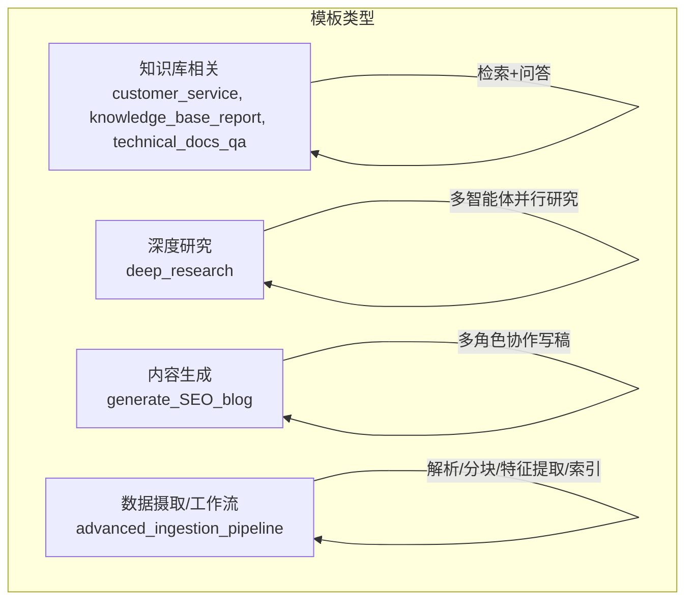
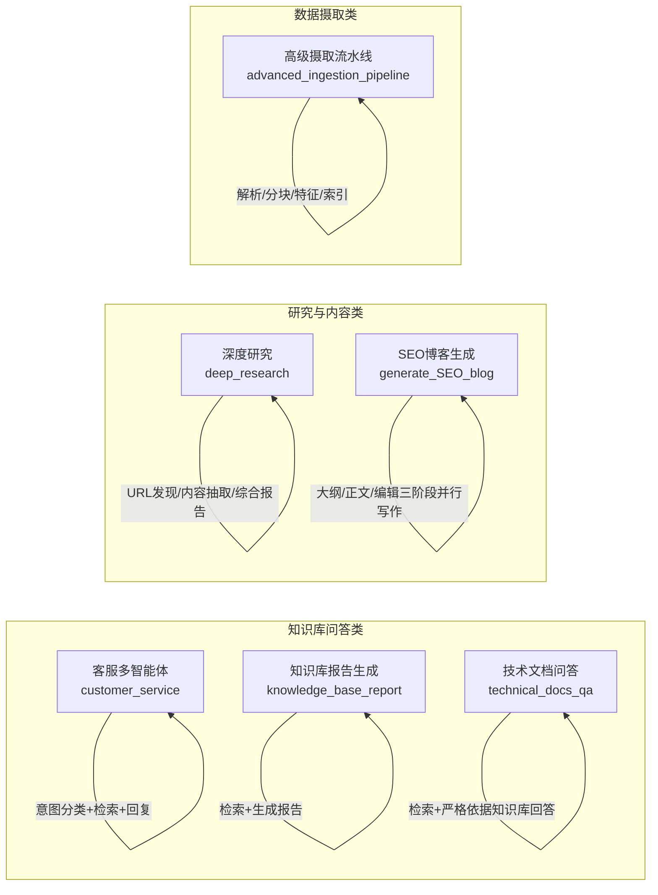
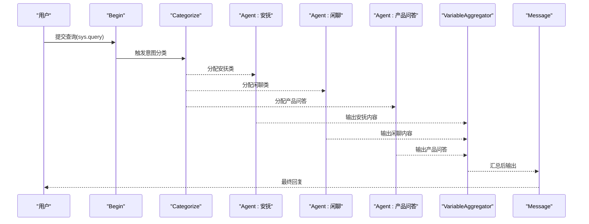
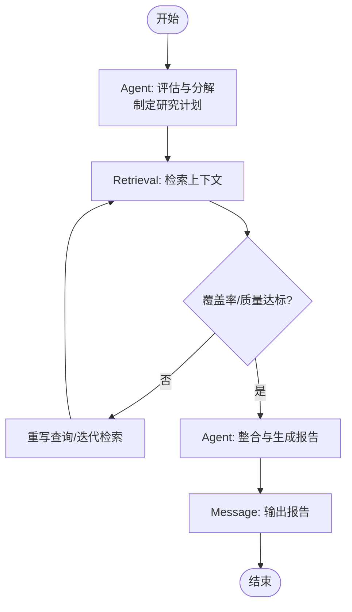
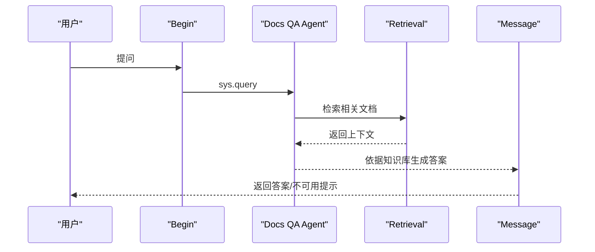
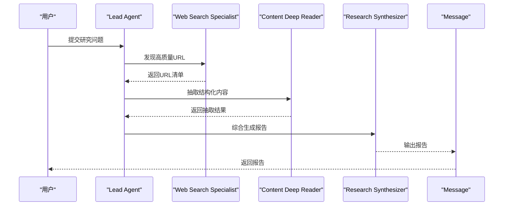
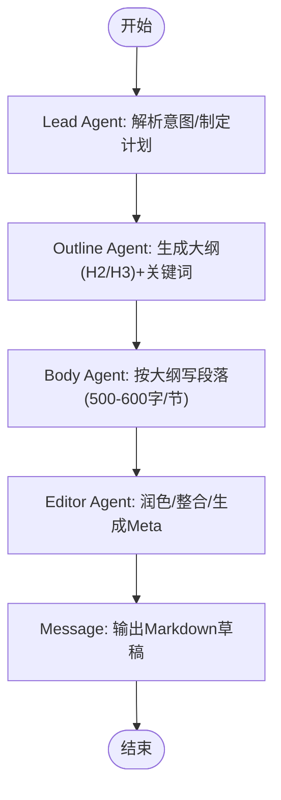
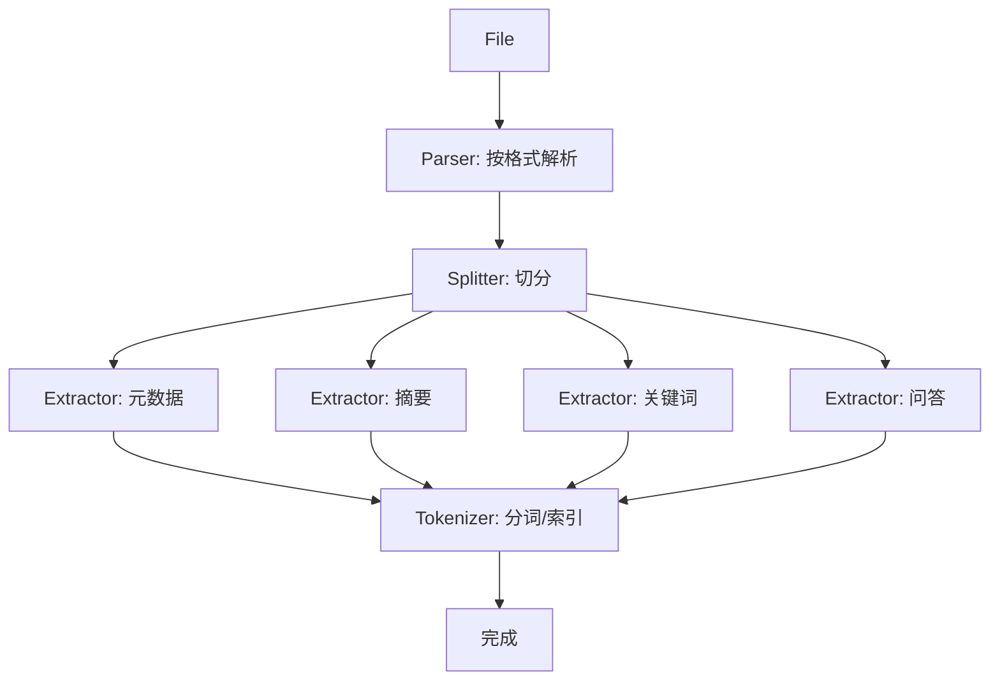
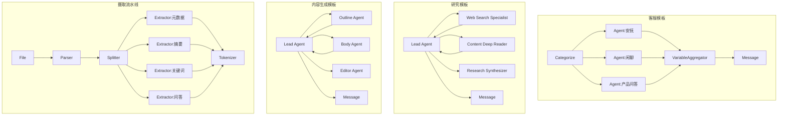

# 预定义模板

<cite>
**本文档引用的文件**
- [customer_service.json](file://agent/templates/customer_service.json)
- [knowledge_base_report.json](file://agent/templates/knowledge_base_report.json)
- [deep_research.json](file://agent/templates/deep_research.json)
- [advanced_ingestion_pipeline.json](file://agent/templates/advanced_ingestion_pipeline.json)
- [generate_SEO_blog.json](file://agent/templates/generate_SEO_blog.json)
- [technical_docs_qa.json](file://agent/templates/technical_docs_qa.json)
</cite>

## 目录
1. [简介](#简介)
2. [项目结构](#项目结构)
3. [核心组件](#核心组件)
4. [架构总览](#架构总览)
5. [详细组件分析](#详细组件分析)
6. [依赖关系分析](#依赖关系分析)
7. [性能考量](#性能考量)
8. [故障排查指南](#故障排查指南)
9. [结论](#结论)
10. [附录](#附录)

## 简介
本参考文档面向RAGFlow内置的预定义模板，系统性梳理其功能特性、适用场景、核心组件与执行逻辑，并提供可操作的使用示例、定制建议与性能优化要点。读者可据此快速选择并落地合适的模板，覆盖知识库问答、深度研究、内容生成、数据摄取与工作流编排等典型业务场景。

## 项目结构
RAGFlow的预定义模板集中于 agent/templates 目录，每个模板以JSON DSL形式描述节点、连接、参数与全局变量，形成可直接运行的“画布”流程。模板按用途分为：
- 知识库相关：customer_service、knowledge_base_report、technical_docs_qa
- 深度研究：deep_research
- 内容生成：generate_SEO_blog
- 数据摄取与工作流：advanced_ingestion_pipeline

章节来源
- [customer_service.json:1-962](file://agent/templates/customer_service.json#L1-L962)
- [knowledge_base_report.json:1-333](file://agent/templates/knowledge_base_report.json#L1-L333)
- [deep_research.json:1-854](file://agent/templates/deep_research.json#L1-L854)
- [advanced_ingestion_pipeline.json:1-728](file://agent/templates/advanced_ingestion_pipeline.json#L1-L728)
- [generate_SEO_blog.json:1-908](file://agent/templates/generate_SEO_blog.json#L1-L908)
- [technical_docs_qa.json:1-336](file://agent/templates/technical_docs_qa.json#L1-L336)

## 核心组件
模板由以下核心组件构成：
- 节点（Components）
  - Agent：执行推理、对话、工具调用与结果聚合
  - Retrieval：从知识库检索上下文
  - Message：输出最终消息
  - Begin：流程入口
  - Parser/Splitter/Extractor/Tokenizer：数据摄取流水线中的处理单元
- 连接（Edges）：定义上游/下游节点关系
- 全局变量（Globals）：sys.query、sys.user_id等上下文键
- 工具（Tools）：如TavilySearch、TavilyExtract等外部搜索/抽取工具

章节来源
- [customer_service.json:13-451](file://agent/templates/customer_service.json#L13-L451)
- [knowledge_base_report.json:12-164](file://agent/templates/knowledge_base_report.json#L12-L164)
- [deep_research.json:12-164](file://agent/templates/deep_research.json#L12-L164)
- [advanced_ingestion_pipeline.json:15-298](file://agent/templates/advanced_ingestion_pipeline.json#L15-L298)
- [generate_SEO_blog.json:12-367](file://agent/templates/generate_SEO_blog.json#L12-L367)
- [technical_docs_qa.json:13-148](file://agent/templates/technical_docs_qa.json#L13-L148)

## 架构总览
下图展示各模板的典型执行路径与关键节点交互。

图表来源
- [customer_service.json:13-451](file://agent/templates/customer_service.json#L13-L451)
- [knowledge_base_report.json:12-164](file://agent/templates/knowledge_base_report.json#L12-L164)
- [technical_docs_qa.json:13-148](file://agent/templates/technical_docs_qa.json#L13-L148)
- [deep_research.json:12-164](file://agent/templates/deep_research.json#L12-L164)
- [generate_SEO_blog.json:12-367](file://agent/templates/generate_SEO_blog.json#L12-L367)
- [advanced_ingestion_pipeline.json:15-298](file://agent/templates/advanced_ingestion_pipeline.json#L15-L298)

## 详细组件分析

### 客服多智能体模板（customer_service）
- 功能概述
  - 基于用户意图分类，将任务委派给不同角色的子智能体（安抚型、闲聊型、产品问答），最后汇聚输出。
- 关键节点
  - Categorize：意图分类器，将查询映射到不同分支
  - Agent:*：多个专用Agent（如安抚、闲聊、产品信息）
  - VariableAggregator：聚合各Agent输出
  - Message：最终回复
- 执行逻辑
  - 输入sys.query → 分类 → 并行路由至对应Agent → 聚合 → 输出
- 参数要点
  - llm_id、temperature、max_rounds、tools（可选）、检索参数（top_k、top_n、相似度阈值）
- 使用建议
  - 为不同意图配置明确的提示词与温度；对产品问答Agent启用Retrieval并设置合理阈值
- 示例场景
  - 客户投诉、产品咨询、日常闲聊等多场景分流

图表来源
- [customer_service.json:13-326](file://agent/templates/customer_service.json#L13-L326)

章节来源
- [customer_service.json:13-451](file://agent/templates/customer_service.json#L13-L451)

### 知识库报告生成模板（knowledge_base_report）
- 功能概述
  - 以知识库为唯一事实来源，生成结构化、可验证的研究报告，强调“严格依据知识库”的原则。
- 关键节点
  - Agent：负责分解问题、制定计划、检索、整合与生成
  - Retrieval：从知识库检索上下文
  - Message：输出最终报告
- 执行逻辑
  - 输入查询 → Agent规划与执行 → 检索 → 生成报告 → 输出
- 参数要点
  - llm_id、max_tokens、temperature、Retrieval.top_k/top_n/similarity_threshold
- 使用建议
  - 为Agent配置严格的“仅依据知识库”提示词；对Retrieval设置合理的覆盖率与质量门禁

图表来源
- [knowledge_base_report.json:12-164](file://agent/templates/knowledge_base_report.json#L12-L164)

章节来源
- [knowledge_base_report.json:12-164](file://agent/templates/knowledge_base_report.json#L12-L164)

### 技术文档问答模板（technical_docs_qa）
- 功能概述
  - 严格基于知识库回答，不生成未在文档中出现的内容，强调透明性与准确性。
- 关键节点
  - Agent：问答Agent，始终通过Retrieval获取证据
  - Retrieval：知识库检索
  - Message：输出答案与来源说明
- 执行逻辑
  - 输入查询 → Retrieval → Agent判断可用性 → 输出答案/不可用提示
- 参数要点
  - Retrieval.similarity_threshold、top_n、empty_response策略
- 使用建议
  - 对不可用场景准备统一提示语；确保知识库覆盖目标领域

图表来源
- [technical_docs_qa.json:13-148](file://agent/templates/technical_docs_qa.json#L13-L148)

章节来源
- [technical_docs_qa.json:13-148](file://agent/templates/technical_docs_qa.json#L13-L148)

### 深度研究模板（deep_research）
- 功能概述
  - 多智能体并行研究：URL发现、内容抽取、综合报告生成，适合复杂商业/政策/咨询类问题。
- 关键节点
  - Lead Agent：协调与指令下发
  - 子Agent：Web Search Specialist（URL发现）、Content Deep Reader（内容抽取）、Research Synthesizer（综合报告）
  - Message：输出报告
- 执行逻辑
  - Lead Agent制定框架 → 并行子Agent执行 → 合成报告
- 参数要点
  - 各Agent的llm_id、max_rounds、tools（TavilySearch/TavilyExtract）
- 使用建议
  - 明确“分析类型/受众/业务焦点”，在ANALYSIS_INSTRUCTIONS中细化；控制并行Agent数量避免资源瓶颈

图表来源
- [deep_research.json:12-164](file://agent/templates/deep_research.json#L12-L164)

章节来源
- [deep_research.json:12-164](file://agent/templates/deep_research.json#L12-L164)

### SEO博客生成模板（generate_SEO_blog）
- 功能概述
  - 多智能体协作：大纲Agent、正文Agent、编辑Agent，模拟真实编辑团队，生成SEO友好的长文。
- 关键节点
  - Lead Agent：解析意图、制定写作计划并委派任务
  - Outline Agent：生成结构化大纲（含关键词）
  - Body Agent：按大纲撰写段落
  - Editor Agent：润色、整合、生成Meta标题/描述
  - Message：输出Markdown草稿
- 执行逻辑
  - Lead Agent → Outline Agent（结构）→ Body Agent（内容）→ Editor Agent（润色）→ 输出
- 参数要点
  - 各Agent的llm_id、temperature、max_rounds；Outline Agent可使用TavilySearch辅助结构
- 使用建议
  - 明确目标受众与博客类型；为每个Section分配1-2个长尾关键词；Editor阶段重点检查关键词密度与结构

图表来源
- [generate_SEO_blog.json:12-367](file://agent/templates/generate_SEO_blog.json#L12-L367)

章节来源
- [generate_SEO_blog.json:12-367](file://agent/templates/generate_SEO_blog.json#L12-L367)

### 高级摄取流水线模板（advanced_ingestion_pipeline）
- 功能概述
  - 将原始文件解析为文本/结构化内容，再分块、抽取摘要/关键词/问答/元数据，并进行分词与索引，支撑多样化检索需求。
- 关键节点
  - File：输入文件
  - Parser：按格式解析（PDF/表格/图像/邮件/文本/Word/幻灯片）
  - Splitter：按分隔符与token大小切分
  - Extractor：摘要、关键词、问答、元数据抽取
  - Tokenizer：分词与索引
- 执行逻辑
  - 文件 → 解析 → 分块 → 特征抽取 → 索引
- 参数要点
  - Parser.setups（输出格式/解析方法）、Splitter.chunk_token_size/overlapped_percent、Extractor.field_name、Tokenizer.search_method
- 使用建议
  - 针对不同文件类型配置最优解析方法；合理设置overlap提升召回；为索引开启embedding/full_text组合检索

图表来源
- [advanced_ingestion_pipeline.json:15-298](file://agent/templates/advanced_ingestion_pipeline.json#L15-L298)

章节来源
- [advanced_ingestion_pipeline.json:15-298](file://agent/templates/advanced_ingestion_pipeline.json#L15-L298)

## 依赖关系分析
- 节点间耦合
  - 客服模板：Categorize与多个Agent强耦合，最终经VariableAggregator汇聚
  - 研究模板：Lead Agent与三个子Agent弱耦合，通过指令与中间产物衔接
  - 内容生成模板：三阶段Agent串行，依赖上一阶段输出
  - 摄取流水线：端到端链路，下游节点依赖上游输出
- 工具依赖
  - 搜索/抽取工具（如TavilySearch/TavilyExtract）在研究与内容生成模板中广泛使用
- 知识库依赖
  - 报告生成与技术问答模板均依赖Retrieval组件

图表来源
- [customer_service.json:13-326](file://agent/templates/customer_service.json#L13-L326)
- [deep_research.json:12-164](file://agent/templates/deep_research.json#L12-L164)
- [generate_SEO_blog.json:12-367](file://agent/templates/generate_SEO_blog.json#L12-L367)
- [advanced_ingestion_pipeline.json:15-298](file://agent/templates/advanced_ingestion_pipeline.json#L15-L298)

## 性能考量
- 模板选择
  - 简单问答优先使用technical_docs_qa，减少Agent开销
  - 复杂跨源研究使用deep_research，注意控制并行Agent数量
  - 多轮客服场景使用customer_service，降低重复计算
- 摄取性能
  - Parser根据文件类型选择合适方法（OCR/DeepDOC），避免全量解析
  - Splitter合理设置chunk_token_size与overlapped_percent，平衡召回与吞吐
  - Extractor串联时尽量复用已解析文本，减少重复计算
- 检索质量
  - 设置合理的similarity_threshold与top_n，避免噪声召回
  - 对高并发场景启用缓存与限流策略
- 温度与回合数
  - 严格问答类模板降低temperature与max_rounds，提高稳定性
  - 内容生成类模板适度提高temperature以增强创造性

## 故障排查指南
- 常见问题
  - 检索为空/质量差：检查Retrieval参数（top_k/top_n/similarity_threshold），必要时增加迭代重试
  - 多智能体卡顿：调整max_rounds与max_retries，限制并行Agent数量
  - 摄取失败：确认Parser.setups与文件后缀匹配，OCR/DeepDOC切换
  - 输出格式异常：核对Agent.sys_prompt与Message输出占位符
- 排查步骤
  - 逐节点验证输入/输出（sys.query、chunks、formalized_content等）
  - 查看工具调用日志（TavilySearch/TavilyExtract）
  - 回归最小样例，定位问题节点

章节来源
- [technical_docs_qa.json:13-148](file://agent/templates/technical_docs_qa.json#L13-L148)
- [deep_research.json:12-164](file://agent/templates/deep_research.json#L12-L164)
- [advanced_ingestion_pipeline.json:15-298](file://agent/templates/advanced_ingestion_pipeline.json#L15-L298)

## 结论
RAGFlow的预定义模板覆盖了从知识库问答、深度研究、内容生成到数据摄取的完整链路。通过理解各模板的节点职责、参数配置与执行逻辑，用户可以快速选择并定制适合自身场景的模板，实现稳定高效的自动化工作流。

## 附录
- 快速选择建议
  - 客户服务分流：customer_service
  - 知识库报告/论文问答：knowledge_base_report
  - 技术文档问答：technical_docs_qa
  - 复杂研究/咨询报告：deep_research
  - SEO博客生成：generate_SEO_blog
  - 多格式文件入库与特征抽取：advanced_ingestion_pipeline
- 最佳实践
  - 明确提示词与质量门禁（如“仅依据知识库”）
  - 控制并行度与超时时间，保障稳定性
  - 结合业务场景调参（temperature、max_rounds、top_n、similarity_threshold）
  - 对关键模板建立监控与回放机制，持续优化