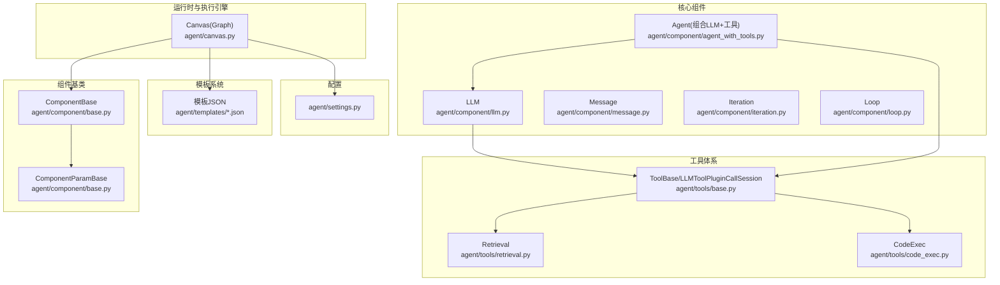
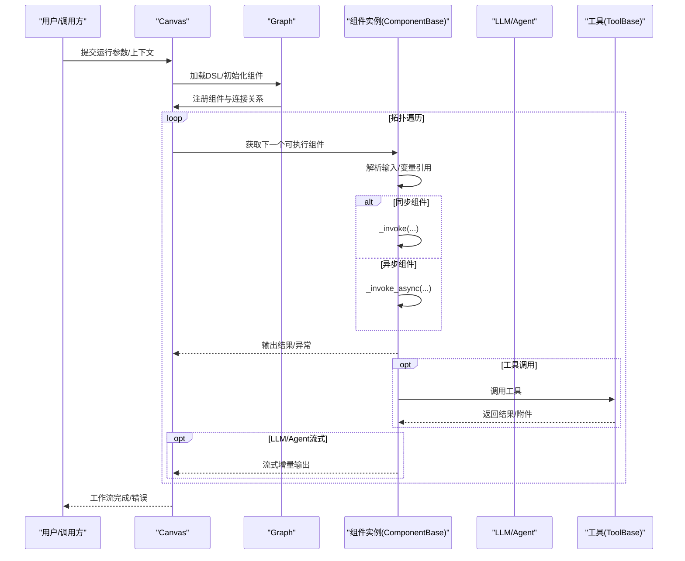
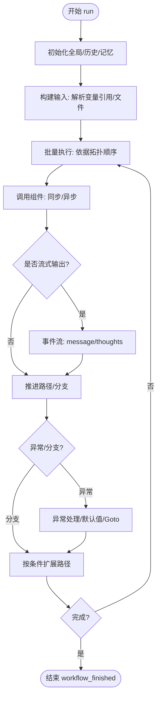
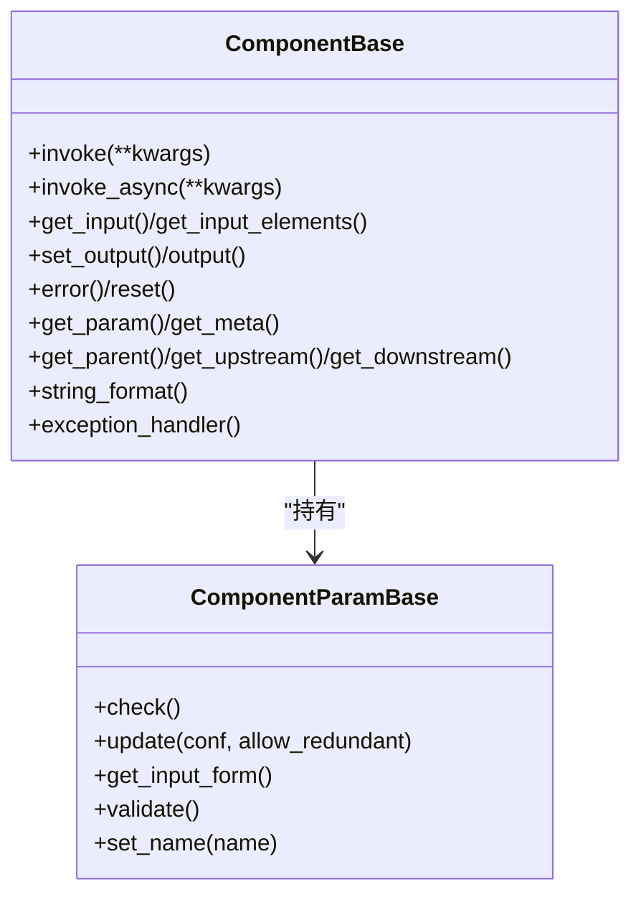
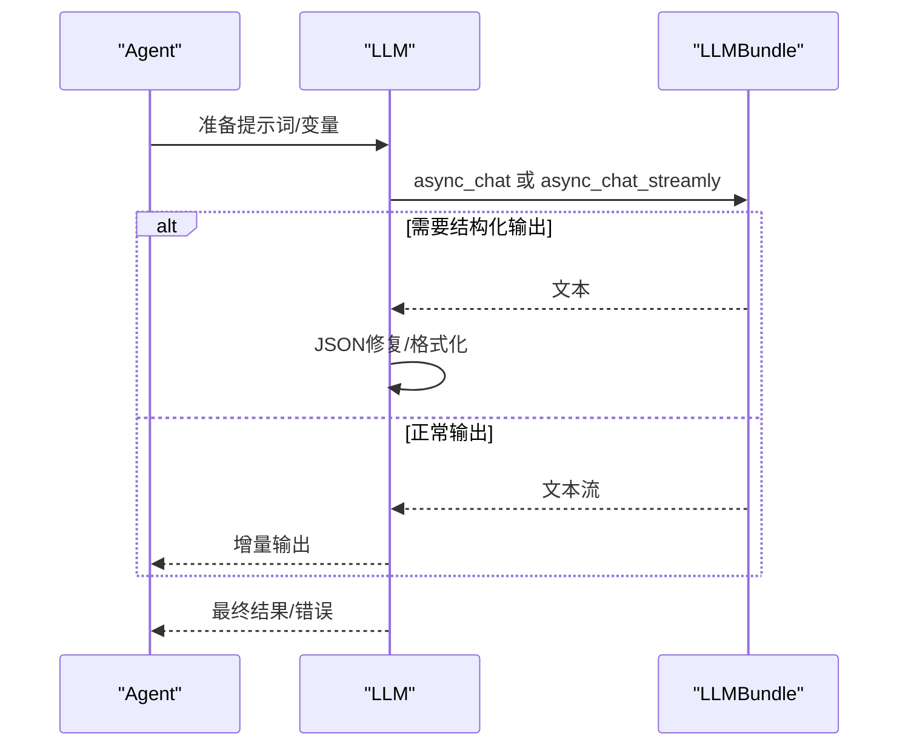
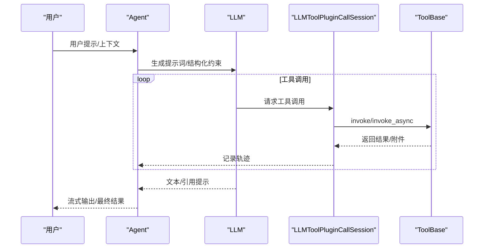
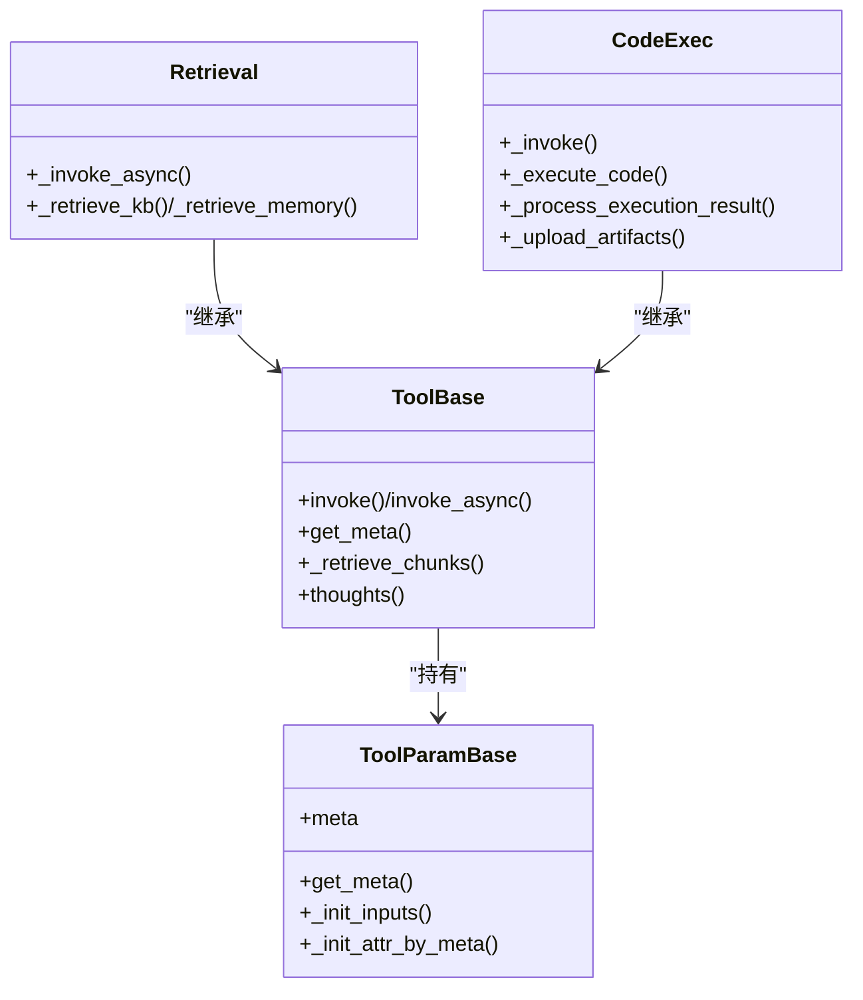
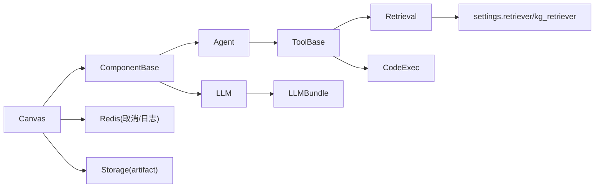

# 代理系统

<cite>
**本文引用的文件**
- [agent/canvas.py](file://agent/canvas.py)
- [agent/component/base.py](file://agent/component/base.py)
- [agent/component/llm.py](file://agent/component/llm.py)
- [agent/component/agent_with_tools.py](file://agent/component/agent_with_tools.py)
- [agent/component/message.py](file://agent/component/message.py)
- [agent/component/iteration.py](file://agent/component/iteration.py)
- [agent/component/loop.py](file://agent/component/loop.py)
- [agent/tools/base.py](file://agent/tools/base.py)
- [agent/tools/code_exec.py](file://agent/tools/code_exec.py)
- [agent/tools/retrieval.py](file://agent/tools/retrieval.py)
- [agent/templates/choose_your_knowledge_base_workflow.json](file://agent/templates/choose_your_knowledge_base_workflow.json)
- [agent/settings.py](file://agent/settings.py)
</cite>

## 目录
1. [简介](#简介)
2. [项目结构](#项目结构)
3. [核心组件](#核心组件)
4. [架构总览](#架构总览)
5. [详细组件分析](#详细组件分析)
6. [依赖分析](#依赖分析)
7. [性能考虑](#性能考虑)
8. [故障排查指南](#故障排查指南)
9. [结论](#结论)
10. [附录](#附录)

## 简介
本技术文档面向“代理系统”，系统性阐述其可视化工作流编排的设计理念与实现机制，覆盖以下主题：
- 图形化编辑器的交互设计与变量引用语法
- 组件系统架构与执行引擎
- 代理组件系统（含19个核心组件）的功能特性、工具调用机制与错误处理策略
- 代理模板系统（预定义模板、自定义模板开发与管理）
- 调试工具使用、性能优化与最佳实践

目标是帮助开发者快速掌握代理系统的强大能力，构建智能化的自动化工作流程。

## 项目结构
代理系统位于仓库的 agent 子目录中，主要由以下模块构成：
- 运行时与执行引擎：canvas.py
- 组件基类与通用参数：component/base.py
- 核心组件：llm.py、agent_with_tools.py、message.py、iteration.py、loop.py 等
- 工具体系：tools/base.py、tools/retrieval.py、tools/code_exec.py 等
- 模板系统：agent/templates/*.json
- 配置常量：agent/settings.py

图表来源
- [agent/canvas.py:283-800](file://agent/canvas.py#L283-L800)
- [agent/component/base.py:40-585](file://agent/component/base.py#L40-L585)
- [agent/component/llm.py:83-455](file://agent/component/llm.py#L83-L455)
- [agent/component/agent_with_tools.py:73-379](file://agent/component/agent_with_tools.py#L73-L379)
- [agent/component/message.py:63-450](file://agent/component/message.py#L63-L450)
- [agent/component/iteration.py:49-72](file://agent/component/iteration.py#L49-L72)
- [agent/component/loop.py:43-80](file://agent/component/loop.py#L43-L80)
- [agent/tools/base.py:50-213](file://agent/tools/base.py#L50-L213)
- [agent/tools/retrieval.py:85-325](file://agent/tools/retrieval.py#L85-L325)
- [agent/tools/code_exec.py:150-567](file://agent/tools/code_exec.py#L150-L567)
- [agent/templates/choose_your_knowledge_base_workflow.json:1-440](file://agent/templates/choose_your_knowledge_base_workflow.json#L1-L440)
- [agent/settings.py:17-19](file://agent/settings.py#L17-L19)

章节来源
- [agent/canvas.py:1-853](file://agent/canvas.py#L1-L853)
- [agent/component/base.py:1-585](file://agent/component/base.py#L1-L585)
- [agent/component/llm.py:1-455](file://agent/component/llm.py#L1-L455)
- [agent/component/agent_with_tools.py:1-379](file://agent/component/agent_with_tools.py#L1-L379)
- [agent/component/message.py:1-450](file://agent/component/message.py#L1-L450)
- [agent/component/iteration.py:1-72](file://agent/component/iteration.py#L1-L72)
- [agent/component/loop.py:1-80](file://agent/component/loop.py#L1-L80)
- [agent/tools/base.py:1-213](file://agent/tools/base.py#L1-L213)
- [agent/tools/retrieval.py:1-325](file://agent/tools/retrieval.py#L1-L325)
- [agent/tools/code_exec.py:1-567](file://agent/tools/code_exec.py#L1-L567)
- [agent/templates/choose_your_knowledge_base_workflow.json:1-440](file://agent/templates/choose_your_knowledge_base_workflow.json#L1-L440)
- [agent/settings.py:1-19](file://agent/settings.py#L1-L19)

## 核心组件
本节概述代理系统中的核心组件及其职责与交互方式。组件通过统一的基类与参数模型实现一致的生命周期与接口，支持同步/异步执行、输入输出管理、异常处理与调试。

- 组件基类与参数
  - ComponentBase：封装组件生命周期、输入输出、超时控制、取消检测、异常处理与调试接口
  - ComponentParamBase：参数校验、嵌套参数更新、用户输入表单生成、参数验证规则
- 执行引擎
  - Canvas(Graph)：加载DSL、解析组件、维护全局变量与历史、调度执行、事件流式输出、取消与日志追踪
- 核心组件
  - LLM：大模型调用、提示词拼装、流式输出、结构化输出、引用与引用提示注入
  - Agent：组合LLM与工具，支持工具调用会话、流式输出、引用提示、结构化输出
  - Message：消息渲染、流式输出、内容格式转换（Markdown/HTML/Excel/PDF等）、内存持久化
  - Iteration/Loop：迭代与循环控制，驱动下游子项组件执行
- 工具体系
  - ToolBase/LLMToolPluginCallSession：工具元数据、调用会话、回调记录、检索工具实现
  - Retrieval：知识库检索、跨语言增强、元数据过滤、重排、知识图谱增强
  - CodeExec：沙箱执行代码（Python/Node.js），收集产物并转为附件与文本

章节来源
- [agent/component/base.py:365-585](file://agent/component/base.py#L365-L585)
- [agent/canvas.py:42-165](file://agent/canvas.py#L42-L165)
- [agent/component/llm.py:83-455](file://agent/component/llm.py#L83-L455)
- [agent/component/agent_with_tools.py:73-379](file://agent/component/agent_with_tools.py#L73-L379)
- [agent/component/message.py:63-450](file://agent/component/message.py#L63-L450)
- [agent/component/iteration.py:49-72](file://agent/component/iteration.py#L49-L72)
- [agent/component/loop.py:43-80](file://agent/component/loop.py#L43-L80)
- [agent/tools/base.py:50-213](file://agent/tools/base.py#L50-L213)
- [agent/tools/retrieval.py:85-325](file://agent/tools/retrieval.py#L85-L325)
- [agent/tools/code_exec.py:150-567](file://agent/tools/code_exec.py#L150-L567)

## 架构总览
代理系统的执行路径从 Canvas 开始，按拓扑顺序调度各组件，支持：
- 变量引用与求值（组件输出、全局变量、环境变量）
- 异步/并发执行与限流
- 流式事件输出（节点开始/结束、消息、工作流开始/结束）
- 错误处理与异常分支跳转
- 工具调用与引用注入

图表来源
- [agent/canvas.py:375-668](file://agent/canvas.py#L375-L668)
- [agent/component/base.py:407-447](file://agent/component/base.py#L407-L447)
- [agent/component/agent_with_tools.py:187-320](file://agent/component/agent_with_tools.py#L187-L320)
- [agent/tools/base.py:50-77](file://agent/tools/base.py#L50-L77)

## 详细组件分析

### 执行引擎：Canvas(Graph)
- DSL加载与组件实例化：解析 components、path、globals、history、retrieval、memory 等字段，构造组件对象树
- 变量系统：支持 sys.*、env.*、组件输出引用（如 {Retrieval@formalized_content}），提供 get/set 变量与路径访问
- 并发与限流：线程池与信号量控制并发，批量执行下游组件
- 事件流：节点开始/结束、消息、工作流开始/结束事件，便于前端实时渲染
- 取消与日志：基于Redis键标记任务取消；工具调用轨迹记录到Redis
- 文件处理：图片转base64、文件解析，支持异步/同步两种入口

图表来源
- [agent/canvas.py:375-668](file://agent/canvas.py#L375-L668)
- [agent/canvas.py:166-273](file://agent/canvas.py#L166-L273)

章节来源
- [agent/canvas.py:83-165](file://agent/canvas.py#L83-L165)
- [agent/canvas.py:166-273](file://agent/canvas.py#L166-L273)
- [agent/canvas.py:274-374](file://agent/canvas.py#L274-L374)
- [agent/canvas.py:375-668](file://agent/canvas.py#L375-L668)
- [agent/canvas.py:670-800](file://agent/canvas.py#L670-L800)

### 组件基类：ComponentBase 与 ComponentParamBase
- 生命周期与接口
  - invoke/invoke_async：统一封装执行、计时、异常记录、调试输入清理
  - 输入/输出管理：get_input/get_input_elements/set_output/error/reset
  - 变量引用解析：支持 sys/env/组件输出路径访问
  - 取消检测：check_if_canceled 抛出任务取消异常
- 参数系统
  - 嵌套参数更新与类型检查，冗余参数校验
  - 参数验证规则（范围、枚举、必填等）
  - 输入表单生成（用于可视化配置）

图表来源
- [agent/component/base.py:40-200](file://agent/component/base.py#L40-L200)
- [agent/component/base.py:365-585](file://agent/component/base.py#L365-L585)

章节来源
- [agent/component/base.py:40-200](file://agent/component/base.py#L40-L200)
- [agent/component/base.py:200-364](file://agent/component/base.py#L200-L364)
- [agent/component/base.py:365-585](file://agent/component/base.py#L365-L585)

### 大模型组件：LLM
- 功能特性
  - 提示词拼装：系统提示、消息历史、用户提示、引用注入
  - 结构化输出：基于JSON Schema的强制格式化
  - 流式输出：支持增量输出与<think>标记
  - 图像输入：自动识别data:image/并切换图像模型
- 执行策略
  - 同步/异步调用，超时控制
  - 异常处理：默认值、跳转分支、错误记录
- 思想输出：thoughts 提供简短的推理摘要

图表来源
- [agent/component/llm.py:272-446](file://agent/component/llm.py#L272-L446)
- [agent/component/llm.py:447-455](file://agent/component/llm.py#L447-L455)

章节来源
- [agent/component/llm.py:34-128](file://agent/component/llm.py#L34-L128)
- [agent/component/llm.py:129-270](file://agent/component/llm.py#L129-L270)
- [agent/component/llm.py:272-446](file://agent/component/llm.py#L272-L446)
- [agent/component/llm.py:447-455](file://agent/component/llm.py#L447-L455)

### 代理组件：Agent（LLM + 工具）
- 功能特性
  - 组合工具：本地组件工具与MCP工具，动态绑定函数元数据
  - 流式输出：结合工具调用与引用提示，支持增量输出
  - 引用提示：在合适时机注入引用提示，提升引用质量
  - 结构化输出：支持JSON Schema约束
- 工具调用机制
  - LLMToolPluginCallSession：统一工具调用入口，支持协程/线程池执行
  - 回调记录：记录工具名、参数、结果与耗时，写入Redis
- 执行策略
  - 先尝试流式输出，再回退到一次性输出
  - 异常处理：默认值、跳转分支

图表来源
- [agent/component/agent_with_tools.py:187-320](file://agent/component/agent_with_tools.py#L187-L320)
- [agent/tools/base.py:50-77](file://agent/tools/base.py#L50-L77)

章节来源
- [agent/component/agent_with_tools.py:39-111](file://agent/component/agent_with_tools.py#L39-L111)
- [agent/component/agent_with_tools.py:187-320](file://agent/component/agent_with_tools.py#L187-L320)
- [agent/tools/base.py:50-121](file://agent/tools/base.py#L50-L121)

### 消息组件：Message
- 功能特性
  - 内容渲染：随机选择模板，支持变量替换与Jinja2模板
  - 流式输出：逐片段输出，支持<think>标记
  - 内容转换：Markdown/HTML/Excel/PDF/DOCX等格式转换
  - 内存持久化：将消息保存至内存服务队列
- 执行策略
  - 若存在异步生成器，采用partial延迟消费
  - 支持分隔符合并列表变量

章节来源
- [agent/component/message.py:63-210](file://agent/component/message.py#L63-L210)
- [agent/component/message.py:211-450](file://agent/component/message.py#L211-L450)

### 迭代与循环：Iteration/Loop
- Iteration：从变量引用数组中逐项处理，驱动下游 IterationItem
- Loop：初始化循环变量，支持最大次数与终止条件，驱动下游 LoopItem

章节来源
- [agent/component/iteration.py:49-72](file://agent/component/iteration.py#L49-L72)
- [agent/component/loop.py:43-80](file://agent/component/loop.py#L43-L80)

### 工具基类与工具：ToolBase、Retrieval、CodeExec
- ToolBase
  - 元数据：ToolMeta/ToolParamBase，生成OpenAI风格函数元数据
  - 调用会话：LLMToolPluginCallSession，统一工具调用与回调
  - 检索辅助：_retrieve_chunks 将检索结果标准化并写入引用
- Retrieval
  - 知识库检索：多KB聚合、嵌入模型、重排模型、跨语言增强、TOC增强、知识图谱增强
  - 元数据过滤：支持自动/半自动/手动三种模式
  - 输出：formalized_content 与 JSON
- CodeExec
  - 沙箱执行：优先使用Provider系统，失败回退HTTP请求
  - 产物收集：自动上传artifact并生成附件文本
  - 类型推断与输出填充：按输出Schema进行类型收敛

图表来源
- [agent/tools/base.py:79-121](file://agent/tools/base.py#L79-L121)
- [agent/tools/base.py:123-213](file://agent/tools/base.py#L123-L213)
- [agent/tools/retrieval.py:37-84](file://agent/tools/retrieval.py#L37-L84)
- [agent/tools/retrieval.py:85-325](file://agent/tools/retrieval.py#L85-L325)
- [agent/tools/code_exec.py:66-148](file://agent/tools/code_exec.py#L66-L148)
- [agent/tools/code_exec.py:150-567](file://agent/tools/code_exec.py#L150-L567)

章节来源
- [agent/tools/base.py:79-121](file://agent/tools/base.py#L79-L121)
- [agent/tools/base.py:123-213](file://agent/tools/base.py#L123-L213)
- [agent/tools/retrieval.py:85-325](file://agent/tools/retrieval.py#L85-L325)
- [agent/tools/code_exec.py:150-567](file://agent/tools/code_exec.py#L150-L567)

## 依赖分析
- 组件耦合
  - Agent 依赖 LLM 与 ToolBase；LLM 可直接调用工具或通过 Agent 统一调度
  - Message 依赖 Canvas 的变量系统与存储实现
  - Canvas 依赖 Redis 实现取消与日志追踪
- 外部依赖
  - LLMBundle：模型调用封装
  - 知识库/嵌入/重排/知识图谱检索：通过 settings.retriever/settings.kg_retriever
  - 沙箱：Provider系统或HTTP接口

图表来源
- [agent/canvas.py:375-668](file://agent/canvas.py#L375-L668)
- [agent/component/agent_with_tools.py:73-111](file://agent/component/agent_with_tools.py#L73-L111)
- [agent/tools/retrieval.py:183-258](file://agent/tools/retrieval.py#L183-L258)
- [agent/tools/code_exec.py:179-240](file://agent/tools/code_exec.py#L179-L240)

章节来源
- [agent/canvas.py:375-668](file://agent/canvas.py#L375-L668)
- [agent/component/agent_with_tools.py:73-111](file://agent/component/agent_with_tools.py#L73-L111)
- [agent/tools/retrieval.py:183-258](file://agent/tools/retrieval.py#L183-L258)
- [agent/tools/code_exec.py:179-240](file://agent/tools/code_exec.py#L179-L240)

## 性能考虑
- 并发与限流
  - Canvas 使用线程池与信号量限制并发，避免阻塞
  - 组件内部通过线程池执行阻塞操作，避免阻塞事件循环
- 超时控制
  - 组件执行超时通过装饰器统一设置，防止长时间阻塞
- I/O 优化
  - 文件解析与图片转码在独立线程池执行
  - 沙箱产物上传采用桶生命周期策略，降低长期存储成本
- 检索优化
  - 多KB聚合、嵌入/重排模型复用、跨语言与TOC增强按需开启
- 输出优化
  - 流式输出减少等待时间，提升用户体验

章节来源
- [agent/canvas.py:435-483](file://agent/canvas.py#L435-L483)
- [agent/component/base.py:449-452](file://agent/component/base.py#L449-L452)
- [agent/tools/code_exec.py:276-303](file://agent/tools/code_exec.py#L276-L303)

## 故障排查指南
- 任务取消
  - Canvas 在启动前与执行期间检查取消标志，抛出异常并停止后续执行
  - 工具调用会话记录工具轨迹，便于定位问题
- 异常处理
  - 组件在异常时记录错误或设置默认值，并支持跳转分支
  - LLM/Agent 对结构化输出失败进行JSON修复与回退
- 日志与追踪
  - Redis键用于取消标记与工具调用轨迹
  - Canvas在运行时输出节点开始/结束、消息、工作流状态事件
- 常见问题
  - 变量引用不存在：检查引用格式与作用域
  - 工具未注册：确认工具映射与元数据
  - 沙箱执行失败：检查Provider系统或HTTP端点可用性

章节来源
- [agent/canvas.py:271-281](file://agent/canvas.py#L271-L281)
- [agent/component/base.py:407-447](file://agent/component/base.py#L407-L447)
- [agent/component/agent_with_tools.py:55-74](file://agent/component/agent_with_tools.py#L55-L74)
- [agent/tools/base.py:50-77](file://agent/tools/base.py#L50-L77)

## 结论
代理系统以 Canvas 为核心执行引擎，通过统一的组件基类与参数系统，实现了高度可扩展的工作流编排。LLM/Agent 提供强大的认知与工具调用能力，Message 负责消息渲染与持久化，Iteration/Loop 支持复杂控制流。工具体系覆盖检索与代码执行两大场景，并通过沙箱与回调机制保障安全与可观测性。模板系统为快速落地提供了即开即用的参考范式。

## 附录

### 代理模板系统
- 预定义模板
  - 位于 agent/templates/ 下的JSON文件，包含组件定义、连接关系、全局变量与图信息
  - 示例：知识库问答工作流模板，演示 Begin → Retrieval → Agent → Message 的完整链路
- 自定义模板开发
  - 基于现有模板复制与修改，调整组件参数、连接关系与全局变量
  - 使用变量引用串联组件输出，确保数据流畅通
- 模板管理
  - 通过系统导入/导出模板，支持多语言描述与头像资源

章节来源
- [agent/templates/choose_your_knowledge_base_workflow.json:1-440](file://agent/templates/choose_your_knowledge_base_workflow.json#L1-L440)

### 变量引用与表单生成
- 变量语法
  - sys.*：系统全局变量
  - env.*：环境变量
  - {组件ID@输出键.路径}：组件输出的路径访问
- 表单生成
  - 组件参数与输入元素决定可视化配置面板
  - 工具参数通过 ToolParamBase.meta 自动生成函数元数据

章节来源
- [agent/canvas.py:166-273](file://agent/canvas.py#L166-L273)
- [agent/component/base.py:513-518](file://agent/component/base.py#L513-L518)
- [agent/tools/base.py:96-121](file://agent/tools/base.py#L96-L121)

### 代码示例（路径指引）
- 创建一个基础工作流（Begin → Agent → Message）
  - 参考模板：[agent/templates/choose_your_knowledge_base_workflow.json:12-134](file://agent/templates/choose_your_knowledge_base_workflow.json#L12-L134)
  - 运行入口：[agent/canvas.py:375-668](file://agent/canvas.py#L375-L668)
- 编排复杂业务逻辑（迭代/循环）
  - 参考：[agent/component/iteration.py:49-72](file://agent/component/iteration.py#L49-L72)、[agent/component/loop.py:43-80](file://agent/component/loop.py#L43-L80)
- 使用工具（检索/代码执行）
  - 参考：[agent/tools/retrieval.py:85-325](file://agent/tools/retrieval.py#L85-L325)、[agent/tools/code_exec.py:150-567](file://agent/tools/code_exec.py#L150-L567)
- 调试与监控
  - 参考：事件流输出、工具调用回调、取消标记与日志键