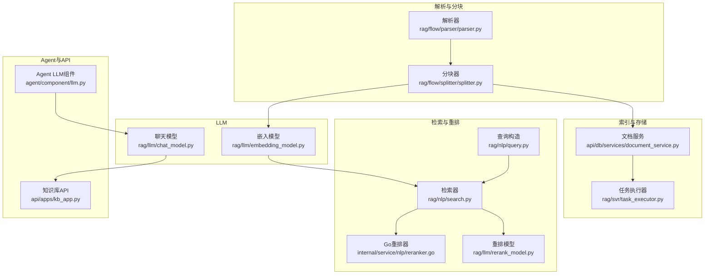
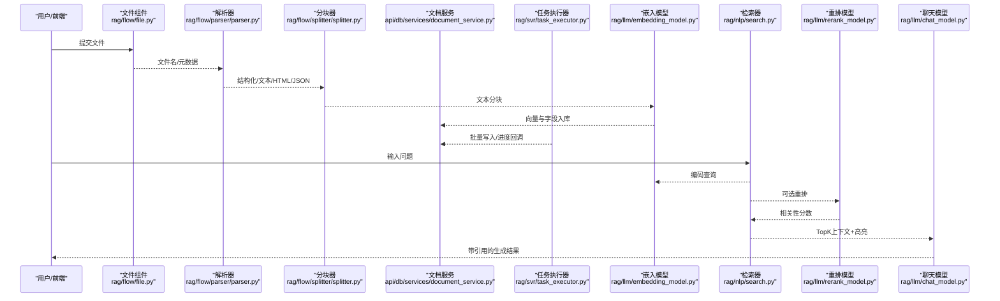
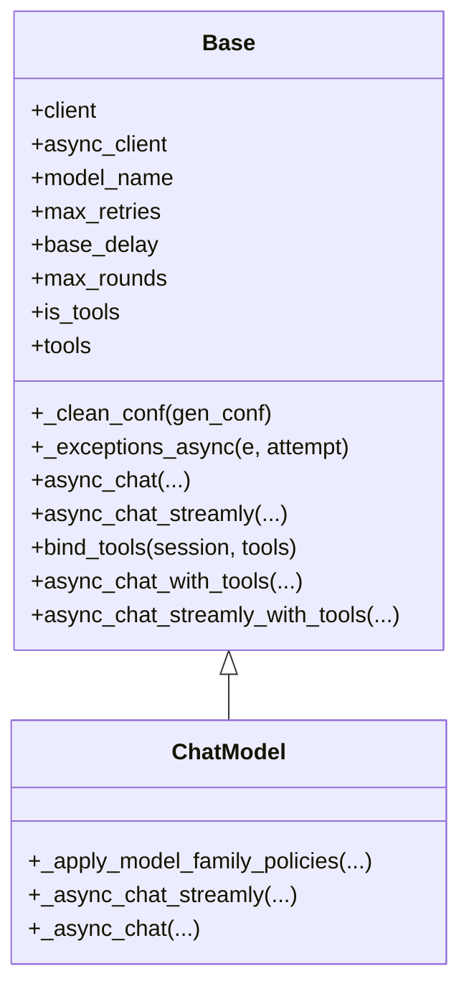
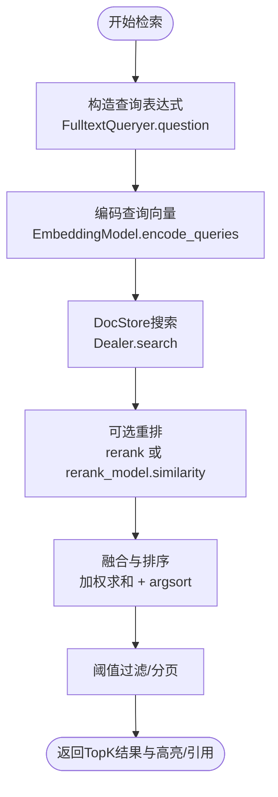
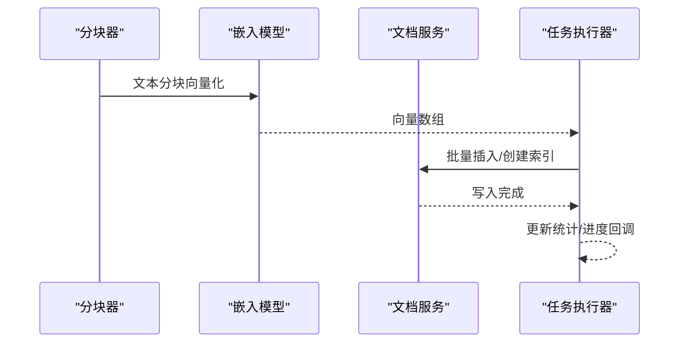
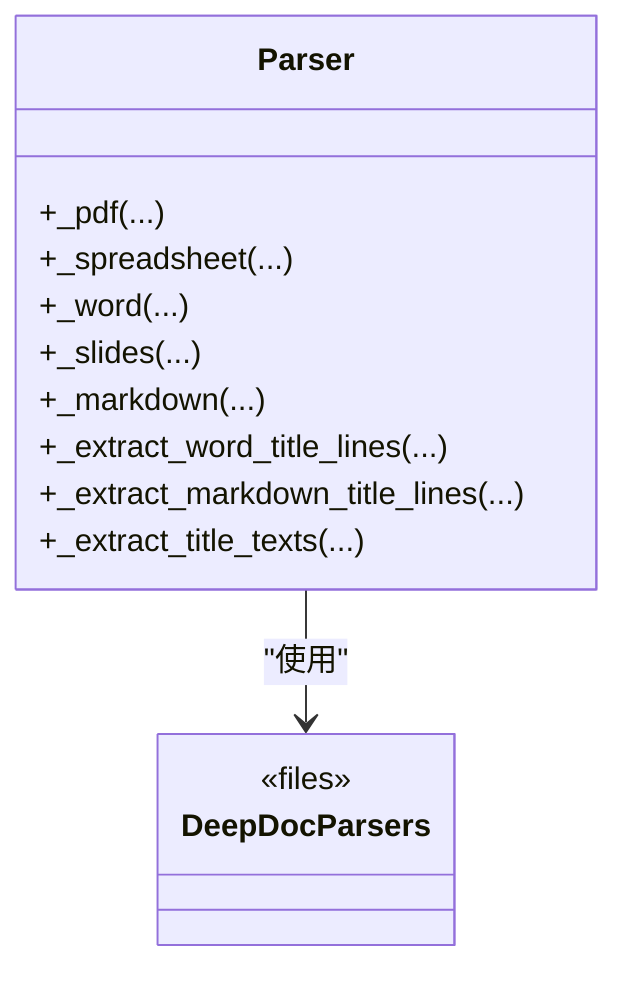
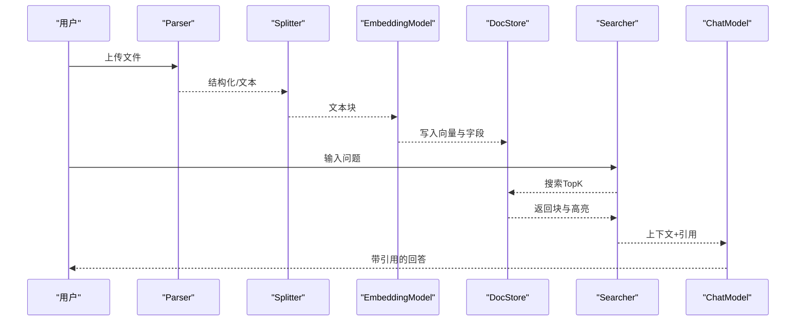
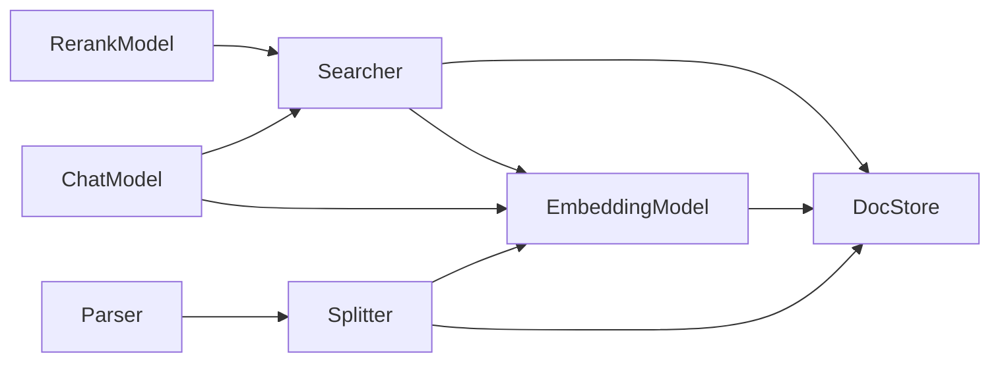

# 大语言模型与检索组件

<cite>
**本文档引用的文件**
- [rag/llm/chat_model.py](file://rag/llm/chat_model.py)
- [rag/llm/embedding_model.py](file://rag/llm/embedding_model.py)
- [rag/llm/rerank_model.py](file://rag/llm/rerank_model.py)
- [rag/nlp/search.py](file://rag/nlp/search.py)
- [rag/nlp/query.py](file://rag/nlp/query.py)
- [rag/nlp/reranker.go](file://internal/service/nlp/reranker.go)
- [rag/flow/parser/parser.py](file://rag/flow/parser/parser.py)
- [deepdoc/parser/__init__.py](file://deepdoc/parser/__init__.py)
- [rag/flow/splitter/splitter.py](file://rag/flow/splitter/splitter.py)
- [rag/flow/pipeline.py](file://rag/flow/pipeline.py)
- [rag/flow/base.py](file://rag/flow/base.py)
- [rag/flow/file.py](file://rag/flow/file.py)
- [agent/component/llm.py](file://agent/component/llm.py)
- [api/apps/kb_app.py](file://api/apps/kb_app.py)
- [api/db/services/document_service.py](file://api/db/services/document_service.py)
- [rag/svr/task_executor.py](file://rag/svr/task_executor.py)
- [test/testcases/test_web_api/test_kb_app/test_kb_routes_unit.py](file://test/testcases/test_web_api/test_kb_app/test_kb_routes_unit.py)
- [web/src/pages/agent/canvas/node/parser-node.tsx](file://web/src/pages/agent/canvas/node/parser-node.tsx)
- [web/src/pages/agent/form/parser-form/index.tsx](file://web/src/pages/agent/form/parser-form/index.tsx)
- [docs/guides/agent/agent_component_reference/parser.md](file://docs/guides/agent/agent_component_reference/parser.md)
- [agent/templates/chunk_summary.json](file://agent/templates/chunk_summary.json)
- [agent/templates/title_chunker.json](file://agent/templates/title_chunker.json)
- [test/testcases/test_http_api/test_dataset_management/test_create_dataset.py](file://test/testcases/test_http_api/test_dataset_management/test_create_dataset.py)
</cite>

## 目录
1. [简介](#简介)
2. [项目结构](#项目结构)
3. [核心组件](#核心组件)
4. [架构总览](#架构总览)
5. [详细组件分析](#详细组件分析)
6. [依赖关系分析](#依赖关系分析)
7. [性能考虑](#性能考虑)
8. [故障排查指南](#故障排查指南)
9. [结论](#结论)
10. [附录](#附录)

## 简介
本技术文档聚焦于代理系统中的大语言模型（LLM）与信息检索组件，系统性阐述以下内容：
- LLM 组件：模型调用、参数配置、上下文管理、响应处理、错误重试与工具调用。
- 检索组件：向量相似度计算、融合重排、结果排序与阈值过滤、高亮与引用标注。
- 索引管理：文档分块、向量化、存储优化与增量更新。
- 解析组件：多格式解析、结构化输出、格式转换、数据提取与验证规则。
- 完整 RAG 工作流：从文件到解析、分块、索引、检索、重排、生成的端到端流程。
- 性能优化、内存管理与调试方法。

## 项目结构
围绕 LLM 与检索的关键模块分布如下：
- LLM 调用与工具：rag/llm/chat_model.py
- 向量编码：rag/llm/embedding_model.py
- 重排模型：rag/llm/rerank_model.py
- 检索与重排：rag/nlp/search.py、internal/service/nlp/reranker.go
- 查询与相似度：rag/nlp/query.py
- 解析管线：rag/flow/parser/parser.py、deepdoc/parser、rag/flow/splitter/splitter.py
- 管线执行：rag/flow/pipeline.py、rag/flow/base.py、rag/flow/file.py
- 索引与增量：api/db/services/document_service.py、rag/svr/task_executor.py
- Agent 集成：agent/component/llm.py
- API 示例：api/apps/kb_app.py
- 测试与模板：test/testcases、agent/templates、web 前端节点与表单

**图表来源**
- [rag/flow/parser/parser.py:1-1100](file://rag/flow/parser/parser.py#L1-L1100)
- [rag/flow/splitter/splitter.py:1-174](file://rag/flow/splitter/splitter.py#L1-L174)
- [api/db/services/document_service.py:1131-1145](file://api/db/services/document_service.py#L1131-L1145)
- [rag/svr/task_executor.py:846-1191](file://rag/svr/task_executor.py#L846-L1191)
- [rag/nlp/query.py:1-238](file://rag/nlp/query.py#L1-L238)
- [rag/nlp/search.py:1-716](file://rag/nlp/search.py#L1-L716)
- [internal/service/nlp/reranker.go:129-175](file://internal/service/nlp/reranker.go#L129-L175)
- [rag/llm/rerank_model.py:1-552](file://rag/llm/rerank_model.py#L1-L552)
- [rag/llm/embedding_model.py:1-1174](file://rag/llm/embedding_model.py#L1-L1174)
- [rag/llm/chat_model.py:1-800](file://rag/llm/chat_model.py#L1-L800)
- [agent/component/llm.py:70-92](file://agent/component/llm.py#L70-L92)
- [api/apps/kb_app.py:971-998](file://api/apps/kb_app.py#L971-L998)

**章节来源**
- [rag/flow/parser/parser.py:1-1100](file://rag/flow/parser/parser.py#L1-L1100)
- [rag/flow/splitter/splitter.py:1-174](file://rag/flow/splitter/splitter.py#L1-L174)
- [api/db/services/document_service.py:1131-1145](file://api/db/services/document_service.py#L1131-L1145)
- [rag/svr/task_executor.py:846-1191](file://rag/svr/task_executor.py#L846-L1191)
- [rag/nlp/query.py:1-238](file://rag/nlp/query.py#L1-L238)
- [rag/nlp/search.py:1-716](file://rag/nlp/search.py#L1-L716)
- [internal/service/nlp/reranker.go:129-175](file://internal/service/nlp/reranker.go#L129-L175)
- [rag/llm/rerank_model.py:1-552](file://rag/llm/rerank_model.py#L1-L552)
- [rag/llm/embedding_model.py:1-1174](file://rag/llm/embedding_model.py#L1-L1174)
- [rag/llm/chat_model.py:1-800](file://rag/llm/chat_model.py#L1-L800)
- [agent/component/llm.py:70-92](file://agent/component/llm.py#L70-L92)
- [api/apps/kb_app.py:971-998](file://api/apps/kb_app.py#L971-L998)

## 核心组件
- LLM 聊天与工具调用：支持参数清洗、流式/非流式、最大轮次、错误分类与指数退避重试、思维链与推理模式、工具调用历史拼接。
- 向量编码：统一抽象 Base，内置 OpenAI、Azure、Qwen、Zhipu、Ollama、Gemini、Bedrock、NVIDIA、TogetherAI 等多家供应商适配。
- 重排模型：提供 Jina、Xinference、LocalAI、NVIDIA、CoHere、SiliconFlow、BaiduYiyan、Voyage、QWen、HuggingFace、GPUStack、RAGcon 等。
- 检索与重排：Term + 向量融合检索、阈值过滤、TopK 与分页、可选 rerank 模型、高亮与引用标注、TOC/父子块增强。
- 解析与分块：多格式解析（PDF/Excel/Word/PPT/HTML/JSON/Markdown/Text/图像/音频/视频/EPUB），结构化输出，自定义分隔符与重叠，媒体上下文合并。
- 索引与增量：批量插入、向量维度一致性校验、索引创建与写入、进度回调与取消检测、TOC/子块后处理。

**章节来源**
- [rag/llm/chat_model.py:115-595](file://rag/llm/chat_model.py#L115-L595)
- [rag/llm/embedding_model.py:36-800](file://rag/llm/embedding_model.py#L36-L800)
- [rag/llm/rerank_model.py:28-552](file://rag/llm/rerank_model.py#L28-L552)
- [rag/nlp/search.py:364-520](file://rag/nlp/search.py#L364-L520)
- [rag/nlp/query.py:27-238](file://rag/nlp/query.py#L27-L238)
- [rag/flow/parser/parser.py:240-800](file://rag/flow/parser/parser.py#L240-L800)
- [rag/flow/splitter/splitter.py:52-174](file://rag/flow/splitter/splitter.py#L52-L174)
- [api/db/services/document_service.py:1131-1145](file://api/db/services/document_service.py#L1131-L1145)
- [rag/svr/task_executor.py:846-1191](file://rag/svr/task_executor.py#L846-L1191)

## 架构总览
下图展示了从“文件输入”到“检索增强生成”的完整链路，涵盖解析、分块、索引、检索、重排与生成等阶段。

**图表来源**
- [rag/flow/file.py:31-51](file://rag/flow/file.py#L31-L51)
- [rag/flow/parser/parser.py:240-800](file://rag/flow/parser/parser.py#L240-L800)
- [rag/flow/splitter/splitter.py:52-174](file://rag/flow/splitter/splitter.py#L52-L174)
- [api/db/services/document_service.py:1131-1145](file://api/db/services/document_service.py#L1131-L1145)
- [rag/svr/task_executor.py:846-1191](file://rag/svr/task_executor.py#L846-L1191)
- [rag/llm/embedding_model.py:90-122](file://rag/llm/embedding_model.py#L90-L122)
- [rag/nlp/search.py:364-520](file://rag/nlp/search.py#L364-L520)
- [rag/llm/rerank_model.py:56-75](file://rag/llm/rerank_model.py#L56-L75)
- [rag/llm/chat_model.py:582-595](file://rag/llm/chat_model.py#L582-L595)

## 详细组件分析

### LLM 组件（聊天与工具）
- 参数配置与清洗：按模型族策略清理不兼容参数，限定允许键集合，避免超长 max_tokens。
- 上下文管理：自动注入 system 角色，支持思维链与推理模式，长度截断提示。
- 错误分类与重试：基于关键字映射错误类型（配额、限流、鉴权、无效请求、服务器、连接、内容过滤、模型不存在、超时等），对可重试错误进行指数退避延迟重试。
- 工具调用：支持函数调用与流式工具调用，批量历史拼接，异常捕获与结果回传。
- 会话绑定：支持工具会话与线程池异步执行。

**图表来源**
- [rag/llm/chat_model.py:115-595](file://rag/llm/chat_model.py#L115-L595)

**章节来源**
- [rag/llm/chat_model.py:115-595](file://rag/llm/chat_model.py#L115-L595)
- [agent/component/llm.py:70-92](file://agent/component/llm.py#L70-L92)

### 检索组件（向量与融合检索）
- 查询构造：英文分词、同义词扩展、细粒度中文分词、短语匹配、权重归并。
- 向量检索：根据查询维度动态选择向量列名，MatchDenseExpr 构造，融合表达式加权求和。
- 重排策略：Term 相似度与向量余弦相似度加权融合；可选 rerank 模型；Go 侧标准重排逻辑。
- 结果排序与阈值：按综合得分降序，阈值过滤；分页切片；聚合统计。
- 引用标注：答案片段与块向量相似度匹配，插入引用 ID；高亮字段可选。

**图表来源**
- [rag/nlp/query.py:41-172](file://rag/nlp/query.py#L41-L172)
- [rag/nlp/search.py:74-171](file://rag/nlp/search.py#L74-L171)
- [rag/nlp/search.py:296-356](file://rag/nlp/search.py#L296-L356)
- [internal/service/nlp/reranker.go:154-175](file://internal/service/nlp/reranker.go#L154-L175)
- [rag/nlp/search.py:364-520](file://rag/nlp/search.py#L364-L520)

**章节来源**
- [rag/nlp/query.py:27-238](file://rag/nlp/query.py#L27-L238)
- [rag/nlp/search.py:74-171](file://rag/nlp/search.py#L74-L171)
- [rag/nlp/search.py:296-356](file://rag/nlp/search.py#L296-L356)
- [internal/service/nlp/reranker.go:129-175](file://internal/service/nlp/reranker.go#L129-L175)
- [api/apps/kb_app.py:971-998](file://api/apps/kb_app.py#L971-L998)

### 索引管理（分块、向量化、存储与增量）
- 分块策略：自定义分隔符、重叠百分比、表格/图片上下文合并、位置信息保留。
- 向量化：按批次调用 EmbeddingModel.encode，批量写入 DocStore，自动创建索引与字段映射。
- 增量更新：任务执行器遍历文档块，跳过缺失向量字段的块，插入新块并更新统计。
- 进度与取消：Redis 日志记录、进度回调、任务取消检测。

**图表来源**
- [rag/flow/splitter/splitter.py:52-174](file://rag/flow/splitter/splitter.py#L52-L174)
- [rag/llm/embedding_model.py:90-122](file://rag/llm/embedding_model.py#L90-L122)
- [api/db/services/document_service.py:1131-1145](file://api/db/services/document_service.py#L1131-L1145)
- [rag/svr/task_executor.py:846-1191](file://rag/svr/task_executor.py#L846-L1191)

**章节来源**
- [rag/flow/splitter/splitter.py:52-174](file://rag/flow/splitter/splitter.py#L52-L174)
- [rag/llm/embedding_model.py:36-800](file://rag/llm/embedding_model.py#L36-L800)
- [api/db/services/document_service.py:1131-1145](file://api/db/services/document_service.py#L1131-L1145)
- [rag/svr/task_executor.py:846-1191](file://rag/svr/task_executor.py#L846-L1191)

### 解析组件（多格式解析与结构化输出）
- 支持格式：PDF（DeepDOC/Plain/MinerU/Docling/TCADP/PaddleOCR/VLM）、Excel（DeepDOC/TCADP）、Word、PowerPoint、HTML、JSON、Markdown、Text、Image（OCR/VLM）、Audio（ASR）、Video（VLM）、EPUB。
- 输出格式：text/markdown/html/json，结构化保留标题、段落、表格、图片、位置信息。
- 验证规则：参数校验、输出格式合法性检查、必要模型配置检查（如 ASR/VLM）。
- 前端集成：Parser 节点与表单配置，支持多 Parser 组合与去重。

**图表来源**
- [rag/flow/parser/parser.py:240-800](file://rag/flow/parser/parser.py#L240-L800)
- [deepdoc/parser/__init__.py:17-41](file://deepdoc/parser/__init__.py#L17-L41)

**章节来源**
- [rag/flow/parser/parser.py:49-238](file://rag/flow/parser/parser.py#L49-L238)
- [rag/flow/parser/parser.py:240-800](file://rag/flow/parser/parser.py#L240-L800)
- [deepdoc/parser/__init__.py:17-41](file://deepdoc/parser/__init__.py#L17-L41)
- [web/src/pages/agent/canvas/node/parser-node.tsx:14-57](file://web/src/pages/agent/canvas/node/parser-node.tsx#L14-L57)
- [web/src/pages/agent/form/parser-form/index.tsx:133-178](file://web/src/pages/agent/form/parser-form/index.tsx#L133-L178)
- [docs/guides/agent/agent_component_reference/parser.md:98-124](file://docs/guides/agent/agent_component_reference/parser.md#L98-L124)

### 组合使用示例（RAG 工作流）
- 解析与分块：根据文件类型选择解析器，输出结构化 JSON/HTML/Markdown，再按分隔符与重叠策略切分为文本块。
- 索引与检索：对每个块生成向量，写入 DocStore 并建立索引；查询时先 Term 搜索，再向量检索，必要时使用 rerank 模型。
- 生成与引用：将 TopK 块与高亮字段送入 LLM，生成带引用 ID 的回答。

**图表来源**
- [rag/flow/parser/parser.py:240-800](file://rag/flow/parser/parser.py#L240-L800)
- [rag/flow/splitter/splitter.py:52-174](file://rag/flow/splitter/splitter.py#L52-L174)
- [rag/llm/embedding_model.py:90-122](file://rag/llm/embedding_model.py#L90-L122)
- [rag/nlp/search.py:364-520](file://rag/nlp/search.py#L364-L520)
- [rag/llm/chat_model.py:582-595](file://rag/llm/chat_model.py#L582-L595)

**章节来源**
- [agent/templates/chunk_summary.json:28-61](file://agent/templates/chunk_summary.json#L28-L61)
- [agent/templates/title_chunker.json:28-61](file://agent/templates/title_chunker.json#L28-L61)

## 依赖关系分析
- 组件内聚与耦合：LLM 与检索解耦，通过 EmbeddingModel 与 DocStore 抽象连接；解析与分块独立于检索，便于替换与扩展。
- 外部依赖：OpenAI/Azure/Qwen/Zhipu/Ollama/Gemini/Bedrock/NVIDIA 等多家供应商适配；DocStore 支持 ES/Infinity 等引擎。
- 循环依赖：未见循环导入；检索器与重排器通过接口与工厂模式解耦。

**图表来源**
- [rag/llm/embedding_model.py:36-800](file://rag/llm/embedding_model.py#L36-L800)
- [rag/nlp/search.py:74-171](file://rag/nlp/search.py#L74-L171)
- [rag/llm/rerank_model.py:28-552](file://rag/llm/rerank_model.py#L28-L552)
- [rag/llm/chat_model.py:115-595](file://rag/llm/chat_model.py#L115-L595)
- [rag/flow/parser/parser.py:240-800](file://rag/flow/parser/parser.py#L240-L800)
- [rag/flow/splitter/splitter.py:52-174](file://rag/flow/splitter/splitter.py#L52-L174)

**章节来源**
- [rag/llm/embedding_model.py:36-800](file://rag/llm/embedding_model.py#L36-L800)
- [rag/nlp/search.py:74-171](file://rag/nlp/search.py#L74-L171)
- [rag/llm/rerank_model.py:28-552](file://rag/llm/rerank_model.py#L28-L552)
- [rag/llm/chat_model.py:115-595](file://rag/llm/chat_model.py#L115-L595)
- [rag/flow/parser/parser.py:240-800](file://rag/flow/parser/parser.py#L240-L800)
- [rag/flow/splitter/splitter.py:52-174](file://rag/flow/splitter/splitter.py#L52-L174)

## 性能考虑
- 向量编码批处理：EmbeddingModel 对文本进行分批编码，减少 API 调用次数与网络开销。
- 检索分页与 TopK：RERANK_LIMIT 与分页确保大规模召回的可控性；向量相似度权重与阈值平衡精度与性能。
- 重排模型：在 ES/Infinity 下采用不同归一化策略；可选本地 rerank 模型以降低外部依赖。
- 索引写入：批量写入与索引预创建，避免重复建表；向量维度一致性校验防止写入失败。
- 工具调用与流式：工具调用采用并发 gather，流式输出减少等待时间。
- 内存与并发：线程池与异步协程结合，合理设置超时与最大轮次，避免资源耗尽。

[本节为通用指导，无需特定文件引用]

## 故障排查指南
- LLM 错误分类：根据关键字映射错误类型，优先处理限流与服务器错误，其他错误按最大重试次数退出。
- 向量维度不一致：索引写入前校验维度，不一致时抛出异常并提示修复。
- 任务取消：任务执行器与管道回调均支持取消检测，及时中断并上报状态。
- 解析失败：检查解析器配置与输出格式，确认必要模型已配置（如 ASR/VLM）。
- API 嵌入失败：kb_app 中对单块嵌入失败进行容错返回，便于定位问题块。

**章节来源**
- [rag/llm/chat_model.py:132-298](file://rag/llm/chat_model.py#L132-L298)
- [api/db/services/document_service.py:1131-1145](file://api/db/services/document_service.py#L1131-L1145)
- [rag/svr/task_executor.py:846-1191](file://rag/svr/task_executor.py#L846-L1191)
- [test/testcases/test_web_api/test_kb_app/test_kb_routes_unit.py:849-896](file://test/testcases/test_web_api/test_kb_app/test_kb_routes_unit.py#L849-L896)
- [api/apps/kb_app.py:971-998](file://api/apps/kb_app.py#L971-L998)

## 结论
该系统通过清晰的模块划分与抽象设计，实现了从多格式解析、结构化分块、向量化索引到检索重排与生成的完整 RAG 能力。LLM 组件提供稳健的参数控制与工具调用能力；检索组件支持灵活的融合策略与阈值过滤；索引与解析模块具备良好的扩展性与性能表现。配合完善的测试与前端配置，开发者可快速搭建高效稳定的检索增强生成系统。

[本节为总结，无需特定文件引用]

## 附录
- 前端 Parser 节点与表单：用于可视化配置解析器参数与输出格式。
- Agent 模板：提供典型解析与分块模板，便于快速落地。
- 数据集配置测试：覆盖解析器配置的多种场景，保障配置正确性。

**章节来源**
- [web/src/pages/agent/canvas/node/parser-node.tsx:14-57](file://web/src/pages/agent/canvas/node/parser-node.tsx#L14-L57)
- [web/src/pages/agent/form/parser-form/index.tsx:133-178](file://web/src/pages/agent/form/parser-form/index.tsx#L133-L178)
- [docs/guides/agent/agent_component_reference/parser.md:98-124](file://docs/guides/agent/agent_component_reference/parser.md#L98-L124)
- [agent/templates/chunk_summary.json:28-61](file://agent/templates/chunk_summary.json#L28-L61)
- [agent/templates/title_chunker.json:28-61](file://agent/templates/title_chunker.json#L28-L61)
- [test/testcases/test_http_api/test_dataset_management/test_create_dataset.py:471-513](file://test/testcases/test_http_api/test_dataset_management/test_create_dataset.py#L471-L513)