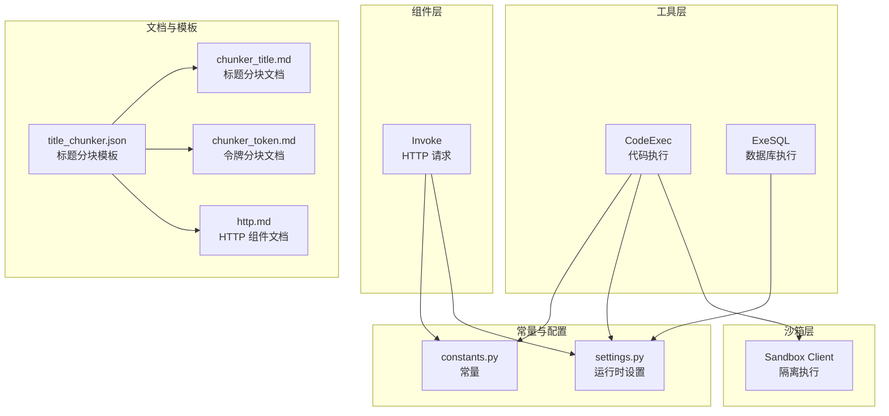
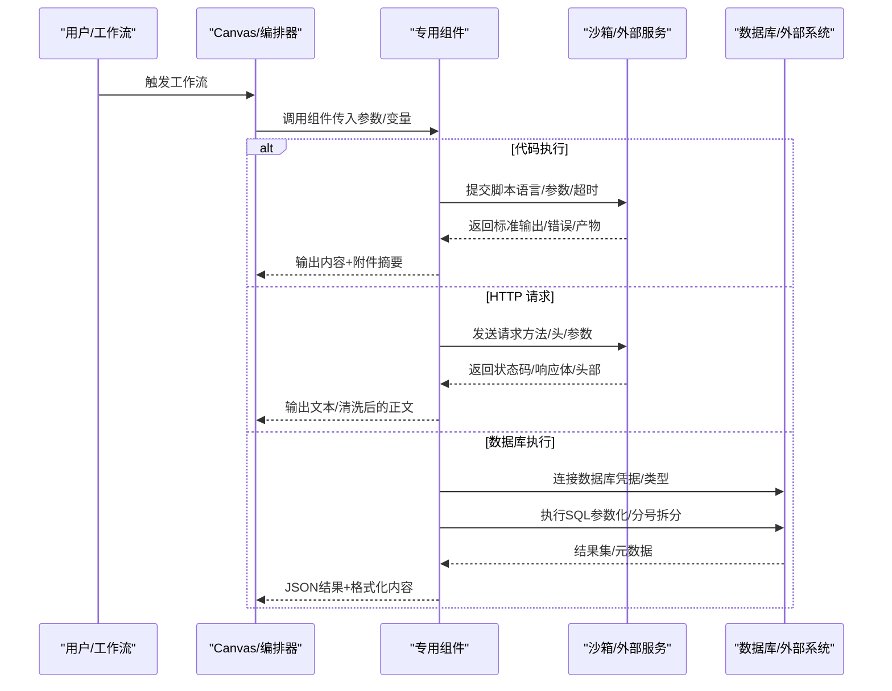
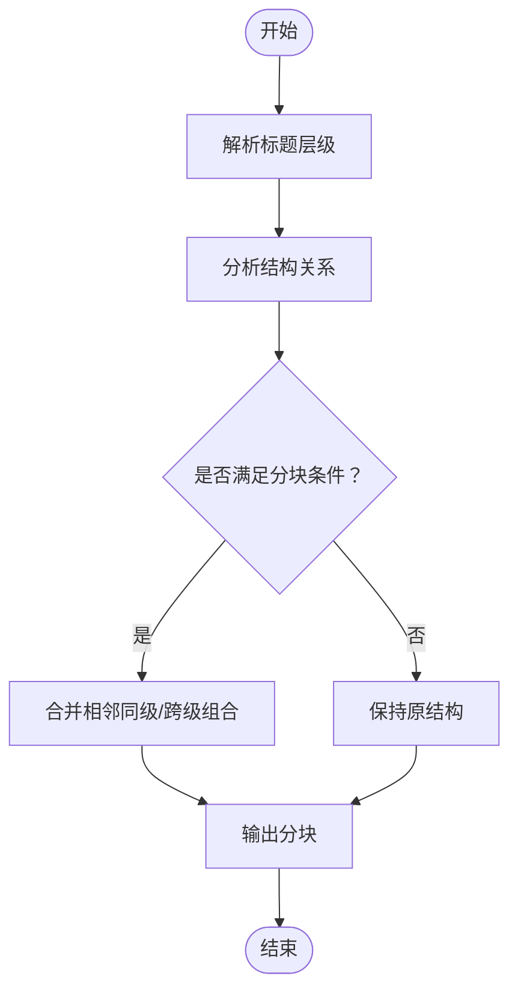
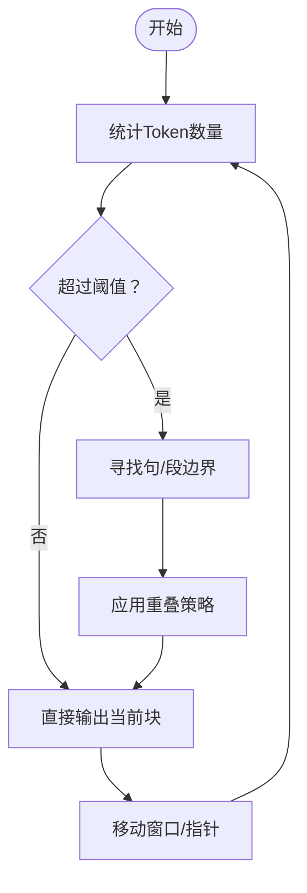
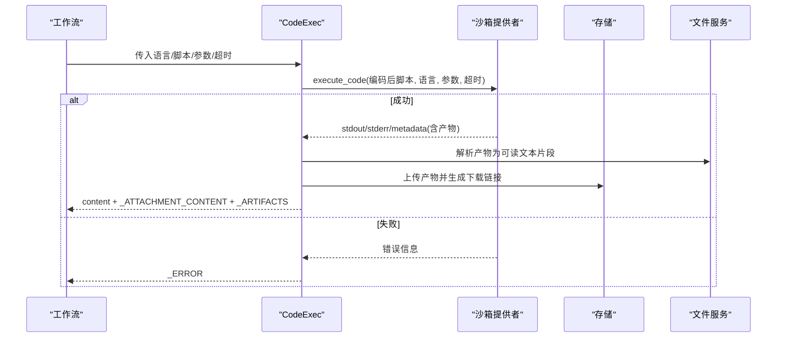
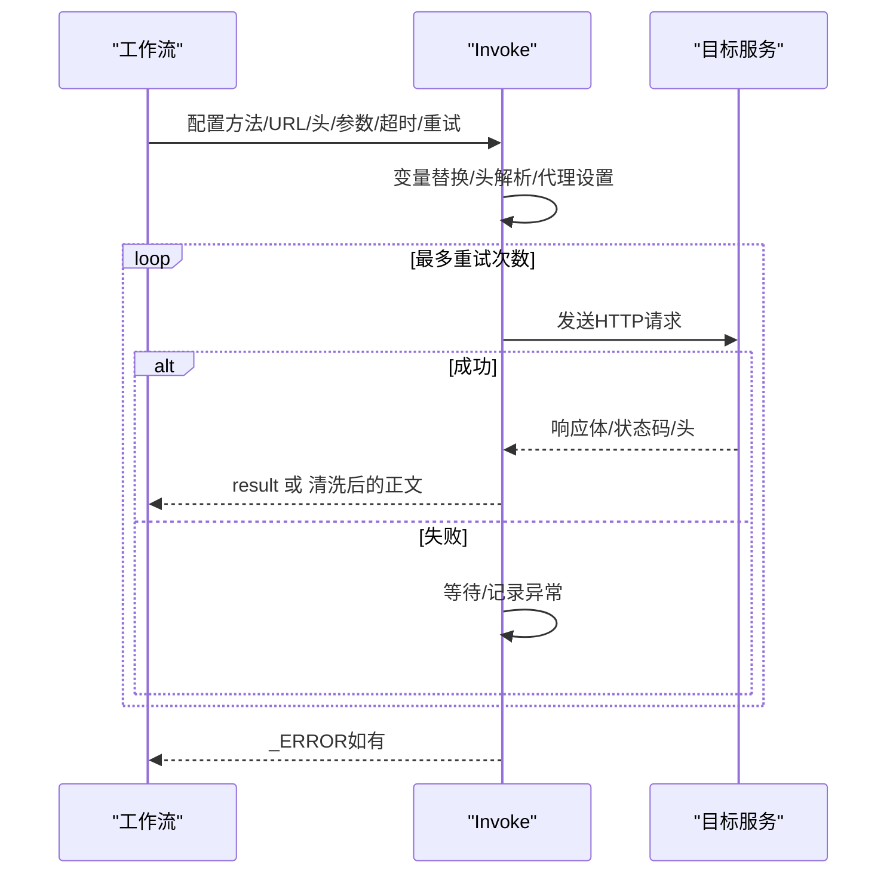
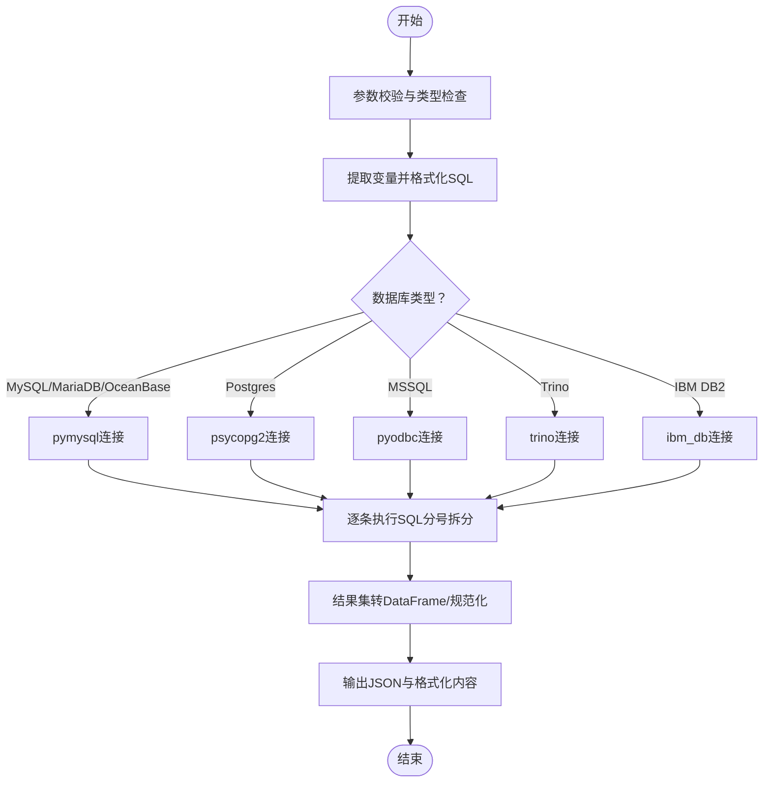
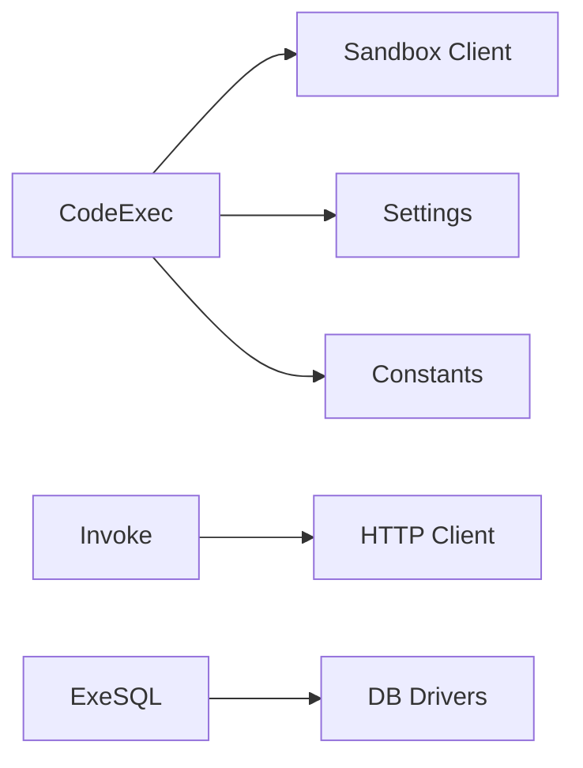

# 专用组件

<cite>
**本文引用的文件**
- [agent/tools/code_exec.py](file://agent/tools/code_exec.py)
- [agent/tools/exesql.py](file://agent/tools/exesql.py)
- [agent/component/invoke.py](file://agent/component/invoke.py)
- [agent/sandbox/client.py](file://agent/sandbox/client.py)
- [common/constants.py](file://common/constants.py)
- [common/settings.py](file://common/settings.py)
- [internal/cli/http_client.go](file://internal/cli/http_client.go)
- [common/http_client.py](file://common/http_client.py)
- [agent/templates/title_chunker.json](file://agent/templates/title_chunker.json)
- [docs/guides/agent/agent_component_reference/chunker_title.md](file://docs/guides/agent/agent_component_reference/chunker_title.md)
- [docs/guides/agent/agent_component_reference/chunker_token.md](file://docs/guides/agent/agent_component_reference/chunker_token.md)
- [docs/guides/agent/agent_component_reference/http.md](file://docs/guides/agent/agent_component_reference/http.md)
- [test/testcases/test_web_api/test_canvas_app/test_invoke_component_unit.py](file://test/testcases/test_web_api/test_canvas_app/test_invoke_component_unit.py)
- [test/testcases/test_web_api/test_canvas_app/test_canvas_routes_unit.py](file://test/testcases/test_web_api/test_canvas_app/test_canvas_routes_unit.py)
- [agent/test/dsl_examples/exesql.json](file://agent/test/dsl_examples/exesql.json)
</cite>

## 目录
1. [简介](#简介)
2. [项目结构](#项目结构)
3. [核心组件](#核心组件)
4. [架构总览](#架构总览)
5. [详细组件分析](#详细组件分析)
6. [依赖关系分析](#依赖关系分析)
7. [性能考量](#性能考量)
8. [故障排查指南](#故障排查指南)
9. [结论](#结论)
10. [附录](#附录)

## 简介
本文件聚焦代理系统中的“专用组件”，系统性阐述以下组件的实现机制与使用方法：
- 标题分块（Title Chunker）：层级识别、标题结构分析、分块策略选择
- 令牌分块（Token Chunker）：长度计算、语义保持、边界处理、重叠策略
- 代码执行（CodeExec）：沙箱隔离、安全限制、输出捕获、错误处理
- 网络请求（HTTP/Invoke）：请求构造、响应解析、认证处理、重试机制
- 数据库执行（ExeSQL）：SQL 验证、参数绑定、结果处理、事务管理

同时提供使用示例、最佳实践、安全考虑、性能优化与调试技巧，帮助开发者充分挖掘代理系统的专用能力。

## 项目结构
围绕专用组件的相关代码主要分布在如下模块：
- 工具层（agent/tools）：代码执行、SQL 执行等专用工具
- 组件层（agent/component）：通用组件如 HTTP 请求调用
- 沙箱层（agent/sandbox）：代码执行的隔离执行环境
- 常量与配置（common/constants.py、common/settings.py）
- 文档与模板（docs、agent/templates）
- 测试与示例（test、agent/test/dsl_examples）

图表来源
- [agent/tools/code_exec.py](file://agent/tools/code_exec.py)
- [agent/tools/exesql.py](file://agent/tools/exesql.py)
- [agent/component/invoke.py](file://agent/component/invoke.py)
- [agent/sandbox/client.py](file://agent/sandbox/client.py)
- [common/constants.py](file://common/constants.py)
- [common/settings.py](file://common/settings.py)
- [agent/templates/title_chunker.json](file://agent/templates/title_chunker.json)
- [docs/guides/agent/agent_component_reference/chunker_title.md](file://docs/guides/agent/agent_component_reference/chunker_title.md)
- [docs/guides/agent/agent_component_reference/chunker_token.md](file://docs/guides/agent/agent_component_reference/chunker_token.md)
- [docs/guides/agent/agent_component_reference/http.md](file://docs/guides/agent/agent_component_reference/http.md)

章节来源
- [agent/tools/code_exec.py](file://agent/tools/code_exec.py)
- [agent/tools/exesql.py](file://agent/tools/exesql.py)
- [agent/component/invoke.py](file://agent/component/invoke.py)
- [agent/sandbox/client.py](file://agent/sandbox/client.py)
- [common/constants.py](file://common/constants.py)
- [common/settings.py](file://common/settings.py)
- [agent/templates/title_chunker.json](file://agent/templates/title_chunker.json)
- [docs/guides/agent/agent_component_reference/chunker_title.md](file://docs/guides/agent/agent_component_reference/chunker_title.md)
- [docs/guides/agent/agent_component_reference/chunker_token.md](file://docs/guides/agent/agent_component_reference/chunker_token.md)
- [docs/guides/agent/agent_component_reference/http.md](file://docs/guides/agent/agent_component_reference/http.md)

## 核心组件
本节概述四大专用组件的功能定位与职责边界：
- 标题分块（Title Chunker）：对文档标题层级进行识别与结构化，按层级生成分块策略，便于后续处理与检索
- 令牌分块（Token Chunker）：基于 Token 计数进行切分，兼顾语义完整性与边界稳定性，并支持重叠以提升召回
- 代码执行（CodeExec）：通过沙箱或 HTTP 接口执行用户脚本，自动收集产物并统一输出
- HTTP 请求（Invoke）：封装 HTTP 客户端，支持多种数据格式、HTML 清洗、重试与延迟
- 数据库执行（ExeSQL）：多数据库驱动支持，参数化 SQL 执行，结果规范化与最大记录限制

章节来源
- [docs/guides/agent/agent_component_reference/chunker_title.md](file://docs/guides/agent/agent_component_reference/chunker_title.md)
- [docs/guides/agent/agent_component_reference/chunker_token.md](file://docs/guides/agent/agent_component_reference/chunker_token.md)
- [docs/guides/agent/agent_component_reference/http.md](file://docs/guides/agent/agent_component_reference/http.md)

## 架构总览
专用组件在代理系统中的交互关系如下：

图表来源
- [agent/tools/code_exec.py](file://agent/tools/code_exec.py)
- [agent/component/invoke.py](file://agent/component/invoke.py)
- [agent/tools/exesql.py](file://agent/tools/exesql.py)

## 详细组件分析

### 标题分块（Title Chunker）
- 层级识别：通过解析文档标题层级，建立层级树，识别主次标题关系
- 标题结构分析：根据层级深度与标题文本特征，判断段落归属与上下文边界
- 分块策略选择：依据层级阈值与段落长度，决定是否合并相邻同级标题或跨级组合

图表来源
- [agent/templates/title_chunker.json](file://agent/templates/title_chunker.json)
- [docs/guides/agent/agent_component_reference/chunker_title.md](file://docs/guides/agent/agent_component_reference/chunker_title.md)

章节来源
- [agent/templates/title_chunker.json](file://agent/templates/title_chunker.json)
- [docs/guides/agent/agent_component_reference/chunker_title.md](file://docs/guides/agent/agent_component_reference/chunker_title.md)

### 令牌分块（Token Chunker）
- 长度计算：基于 Token 计数而非字符数，确保模型输入边界可控
- 语义保持：优先在句子/段落边界切割，避免截断关键语义
- 边界处理：遇到不可分割单元时，允许回退到字符级切分
- 重叠策略：相邻块之间设置固定比例的重叠，提升检索召回

图表来源
- [docs/guides/agent/agent_component_reference/chunker_token.md](file://docs/guides/agent/agent_component_reference/chunker_token.md)

章节来源
- [docs/guides/agent/agent_component_reference/chunker_token.md](file://docs/guides/agent/agent_component_reference/chunker_token.md)

### 代码执行（CodeExec）
- 沙箱隔离：优先通过沙箱客户端执行，保障资源与权限限制
- 安全限制：仅允许白名单依赖包；产物上传至对象存储并设置生命周期
- 输出捕获：解析标准输出为结构化 JSON/字典，自动提取键值映射到输出变量
- 错误处理：区分致命错误与非致命警告；异常时设置错误输出并返回稳定结构

图表来源
- [agent/tools/code_exec.py](file://agent/tools/code_exec.py)
- [agent/sandbox/client.py](file://agent/sandbox/client.py)
- [common/constants.py](file://common/constants.py)
- [common/settings.py](file://common/settings.py)

章节来源
- [agent/tools/code_exec.py](file://agent/tools/code_exec.py)
- [agent/sandbox/client.py](file://agent/sandbox/client.py)
- [common/constants.py](file://common/constants.py)
- [common/settings.py](file://common/settings.py)

### 网络请求（HTTP/Invoke）
- 请求构造：支持 GET/POST/PUT；JSON/Formdata；动态变量替换；代理配置
- 响应解析：默认输出文本；可选 HTML 清洗为纯文本段落
- 认证处理：支持在头中注入认证信息；日志记录请求与耗时
- 重试机制：指数退避或固定延迟，失败时写入错误输出

图表来源
- [agent/component/invoke.py](file://agent/component/invoke.py)
- [internal/cli/http_client.go](file://internal/cli/http_client.go)
- [common/http_client.py](file://common/http_client.py)

章节来源
- [agent/component/invoke.py](file://agent/component/invoke.py)
- [internal/cli/http_client.go](file://internal/cli/http_client.go)
- [common/http_client.py](file://common/http_client.py)
- [docs/guides/agent/agent_component_reference/http.md](file://docs/guides/agent/agent_component_reference/http.md)

### 数据库执行（ExeSQL）
- SQL 验证：参数校验、数据库类型支持列表、敏感库名限制
- 参数绑定：从文本中提取变量并格式化 SQL，避免注入风险
- 结果处理：多数据库驱动适配；结果集转 DataFrame 并规范化；最大记录限制
- 事务管理：按数据库驱动行为执行；连接/游标/会话生命周期管理

图表来源
- [agent/tools/exesql.py](file://agent/tools/exesql.py)

章节来源
- [agent/tools/exesql.py](file://agent/tools/exesql.py)
- [test/testcases/test_web_api/test_canvas_app/test_canvas_routes_unit.py](file://test/testcases/test_web_api/test_canvas_app/test_canvas_routes_unit.py)
- [agent/test/dsl_examples/exesql.json](file://agent/test/dsl_examples/exesql.json)

## 依赖关系分析
- CodeExec 依赖沙箱客户端与存储实现，受运行时配置与常量控制
- Invoke 依赖通用 HTTP 客户端与 HTML 解析器，支持代理与重试
- ExeSQL 依赖多数据库驱动，遵循参数校验与最大记录限制

图表来源
- [agent/tools/code_exec.py](file://agent/tools/code_exec.py)
- [agent/component/invoke.py](file://agent/component/invoke.py)
- [agent/tools/exesql.py](file://agent/tools/exesql.py)
- [common/settings.py](file://common/settings.py)
- [common/constants.py](file://common/constants.py)

章节来源
- [agent/tools/code_exec.py](file://agent/tools/code_exec.py)
- [agent/component/invoke.py](file://agent/component/invoke.py)
- [agent/tools/exesql.py](file://agent/tools/exesql.py)
- [common/settings.py](file://common/settings.py)
- [common/constants.py](file://common/constants.py)

## 性能考量
- 超时与并发：组件均内置超时控制，避免长时间阻塞；建议结合队列与限流
- 输出最小化：仅在必要时输出大文本；优先使用结构化字段与附件链接
- 缓存与复用：对重复请求与查询结果进行缓存；合理设置 TTL
- 存储生命周期：产物桶设置过期策略，降低长期占用成本
- 网络与数据库：合理设置重试间隔与超时；批量查询时使用分页/上限

## 故障排查指南
- CodeExec
  - 现象：无响应或错误输出
  - 排查：确认沙箱可用性、超时设置、编码合法性、产物上传权限
  - 参考测试：[test_invoke_component_unit.py](file://test/testcases/test_web_api/test_canvas_app/test_invoke_component_unit.py)
- Invoke
  - 现象：请求失败或返回非预期内容
  - 排查：检查 URL/头/代理/变量替换；启用 HTML 清洗；查看错误输出
  - 参考文档：[http.md](file://docs/guides/agent/agent_component_reference/http.md)
- ExeSQL
  - 现象：连接失败或结果为空
  - 排查：核对数据库类型、凭据、最大记录限制；检查 SQL 格式与变量绑定
  - 参考测试：[test_canvas_routes_unit.py](file://test/testcases/test_web_api/test_canvas_app/test_canvas_routes_unit.py)
  - 示例 DSL：[exesql.json](file://agent/test/dsl_examples/exesql.json)

章节来源
- [test/testcases/test_web_api/test_canvas_app/test_invoke_component_unit.py](file://test/testcases/test_web_api/test_canvas_app/test_invoke_component_unit.py)
- [docs/guides/agent/agent_component_reference/http.md](file://docs/guides/agent/agent_component_reference/http.md)
- [test/testcases/test_web_api/test_canvas_app/test_canvas_routes_unit.py](file://test/testcases/test_web_api/test_canvas_app/test_canvas_routes_unit.py)
- [agent/test/dsl_examples/exesql.json](file://agent/test/dsl_examples/exesql.json)

## 结论
专用组件通过明确的职责划分与稳健的实现机制，为代理系统提供了强大的扩展能力。标题分块与令牌分块保证了知识入库的质量与效率；代码执行与 HTTP 请求提供了灵活的外部集成；数据库执行则实现了安全可控的数据访问。建议在生产环境中结合超时、重试、缓存与存储生命周期策略，持续优化性能与安全性。

## 附录
- 使用示例与最佳实践
  - 标题分块：参考模板与文档，按层级阈值与段落长度设定策略
  - 令牌分块：根据模型上下文长度设置阈值与重叠比例
  - 代码执行：使用沙箱提供者优先；规范 main 函数与输出结构；合理设置超时
  - HTTP 请求：统一头与认证；启用 HTML 清洗；配置重试与延迟
  - 数据库执行：参数化 SQL；限制最大记录；按需格式化输出
- 安全考虑
  - 严格校验输入参数与 SQL；禁止访问敏感库名
  - 沙箱内限制依赖与权限；产物上传前进行类型与大小校验
  - HTTP 请求避免泄露敏感头；启用 TLS 与最小权限代理
- 调试技巧
  - 开启组件日志；记录请求耗时与状态码
  - 对比清洗前后正文；检查变量替换与头解析
  - 使用测试用例覆盖多数据库与异常路径