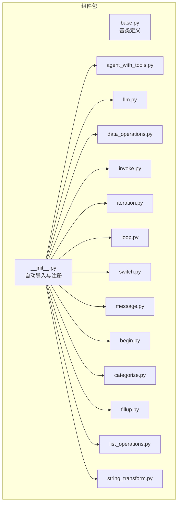
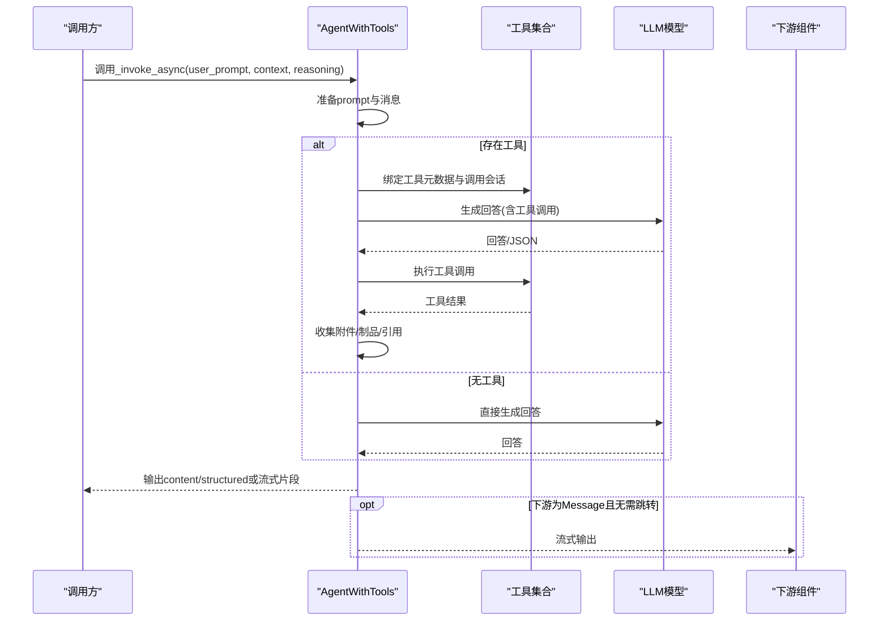
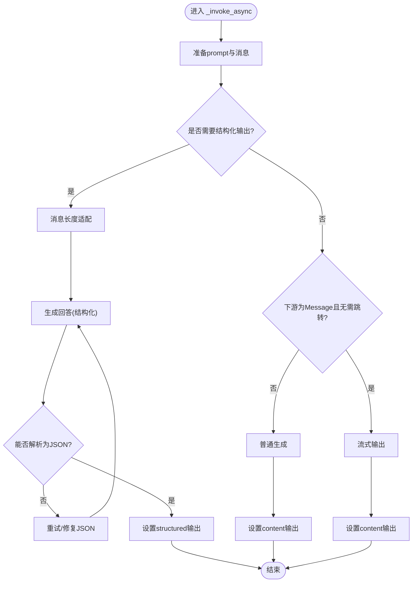
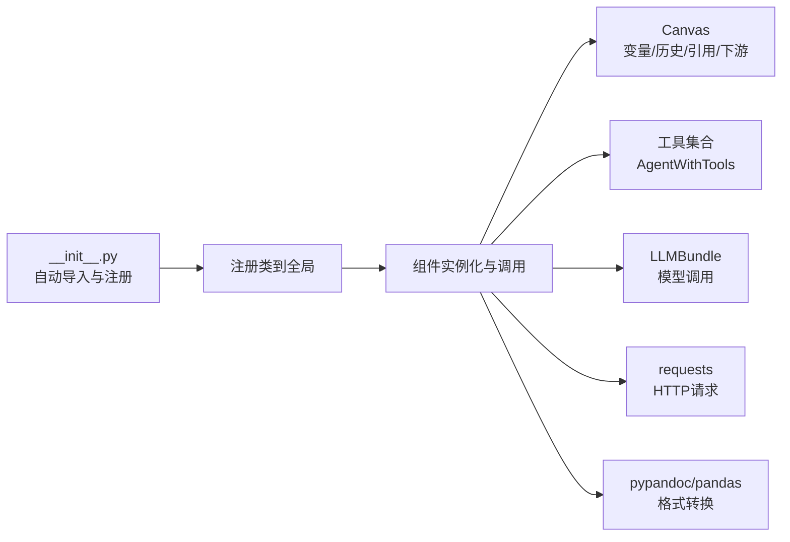

# 代理组件系统

<cite>
**本文引用的文件**
- [agent/component/base.py](file://agent/component/base.py)
- [agent/component/__init__.py](file://agent/component/__init__.py)
- [agent/component/agent_with_tools.py](file://agent/component/agent_with_tools.py)
- [agent/component/llm.py](file://agent/component/llm.py)
- [agent/component/data_operations.py](file://agent/component/data_operations.py)
- [agent/component/invoke.py](file://agent/component/invoke.py)
- [agent/component/iteration.py](file://agent/component/iteration.py)
- [agent/component/loop.py](file://agent/component/loop.py)
- [agent/component/switch.py](file://agent/component/switch.py)
- [agent/component/message.py](file://agent/component/message.py)
- [agent/component/begin.py](file://agent/component/begin.py)
- [agent/component/categorize.py](file://agent/component/categorize.py)
- [agent/component/fillup.py](file://agent/component/fillup.py)
- [agent/component/list_operations.py](file://agent/component/list_operations.py)
- [agent/component/string_transform.py](file://agent/component/string_transform.py)
</cite>

## 目录
1. [简介](#简介)
2. [项目结构](#项目结构)
3. [核心组件](#核心组件)
4. [架构总览](#架构总览)
5. [详细组件分析](#详细组件分析)
6. [依赖分析](#依赖分析)
7. [性能考量](#性能考量)
8. [故障排查指南](#故障排查指南)
9. [结论](#结论)
10. [附录：组件开发与测试指南](#附录组件开发与测试指南)

## 简介
本技术文档面向代理组件系统，系统性梳理并解释19个核心代理组件的功能特性、实现原理与使用方法，重点阐述基类ComponentBase与ComponentParamBase的设计架构（参数校验、输入输出管理、异常处理机制），并深入解析AgentWithTools工具调用、LLM大语言模型、数据操作、HTTP请求、循环迭代、条件判断等关键组件。文档同时给出组件间协作机制（数据传递、状态共享、错误传播、性能优化）、组件开发指南（如何创建自定义组件、扩展功能、集成第三方工具）、测试方法与调试技巧，帮助开发者快速理解并高效扩展代理组件系统。

## 项目结构
代理组件位于agent/component目录下，采用“按功能分文件”的组织方式，每个组件一个独立模块，统一继承基类体系，并通过包级自动发现机制集中注册与导出。

图表来源
- [agent/component/__init__.py:25-48](file://agent/component/__init__.py#L25-L48)
- [agent/component/base.py:365-585](file://agent/component/base.py#L365-L585)

章节来源
- [agent/component/__init__.py:16-59](file://agent/component/__init__.py#L16-L59)

## 核心组件
以下为19个核心代理组件的分类与职责概览（按功能域划分）：
- 启动与输入采集
  - Begin：启动节点，支持会话模式与任务模式，采集用户输入与文件解析
  - UserFillUp：通用表单/提示收集组件
- 流程控制与路由
  - Switch：多条件分支选择，支持多种比较运算符
  - Loop/Iteration：循环变量初始化与批量迭代
  - Categorize：意图/问题分类，返回目标下游节点
- 大模型与工具
  - LLM：通用大模型调用，支持结构化输出、流式输出、引用标注
  - AgentWithTools：绑定工具与MCP的智能体，支持工具调用、流式输出、引用生成
- 数据与文本处理
  - DataOperations：对象数组的键选择、合并、过滤、更新、重命名等
  - ListOperations：列表的TopN、头尾、过滤、排序、去重等
  - StringTransform：字符串拆分/合并（Jinja2模板）
- 输出与消息
  - Message：内容渲染、流式输出、格式转换（Markdown/HTML/PDF/DOCX/XLSX）、记忆存储

章节来源
- [agent/component/begin.py:37-64](file://agent/component/begin.py#L37-L64)
- [agent/component/fillup.py:36-83](file://agent/component/fillup.py#L36-L83)
- [agent/component/switch.py:61-141](file://agent/component/switch.py#L61-L141)
- [agent/component/loop.py:43-80](file://agent/component/loop.py#L43-L80)
- [agent/component/iteration.py:49-72](file://agent/component/iteration.py#L49-L72)
- [agent/component/categorize.py:98-166](file://agent/component/categorize.py#L98-L166)
- [agent/component/llm.py:83-455](file://agent/component/llm.py#L83-L455)
- [agent/component/agent_with_tools.py:73-379](file://agent/component/agent_with_tools.py#L73-L379)
- [agent/component/data_operations.py:47-219](file://agent/component/data_operations.py#L47-L219)
- [agent/component/list_operations.py:43-169](file://agent/component/list_operations.py#L43-L169)
- [agent/component/string_transform.py:47-118](file://agent/component/string_transform.py#L47-L118)
- [agent/component/message.py:63-450](file://agent/component/message.py#L63-L450)

## 架构总览
组件系统以ComponentBase/ComponentParamBase为核心，所有具体组件均继承该体系；组件通过Canvas上下文访问全局变量、历史消息、引用信息、下游组件等；异步执行与超时控制贯穿各组件；异常处理支持默认值回退与跳转。

```mermaid
classDiagram
class ComponentParamBase {
+set_name(name)
+check()
+update(conf, allow_redundant)
+validate()
+get_user_feeded()
+get_feeded_deprecated_params()
+as_dict()
}
class ComponentBase {
+invoke(**kwargs) dict
+invoke_async(**kwargs) dict
+output(var_nm) Any|dict
+set_output(key, value)
+error() Any
+reset(only_output)
+get_input(key) Any|dict
+get_input_values() dict
+get_input_elements() dict
+get_input_elements_from_text(txt) dict
+set_input_value(key, value)
+get_input_value(key) Any
+get_component_name(cpn_id) str
+get_param(name) Any
+debug(**kwargs)
+get_parent() object
+get_upstream() str[]
+get_downstream() str[]
+string_format(content, kv) str
+exception_handler() dict
+get_exception_default_value() Any
+set_exception_default_value()
+thoughts() str
}
class LLMParam
class LLM
class AgentParam
class Agent
class DataOperationsParam
class DataOperations
class ListOperationsParam
class ListOperations
class StringTransformParam
class StringTransform
class MessageParam
class Message
class InvokeParam
class Invoke
class SwitchParam
class Switch
class LoopParam
class Loop
class IterationParam
class Iteration
class CategorizeParam
class Categorize
class UserFillUpParam
class UserFillUp
class BeginParam
class Begin
ComponentBase <|-- LLM
ComponentBase <|-- Agent
ComponentBase <|-- DataOperations
ComponentBase <|-- ListOperations
ComponentBase <|-- StringTransform
ComponentBase <|-- Message
ComponentBase <|-- Invoke
ComponentBase <|-- Switch
ComponentBase <|-- Loop
ComponentBase <|-- Iteration
ComponentBase <|-- Categorize
ComponentBase <|-- UserFillUp
ComponentBase <|-- Begin
ComponentParamBase <|-- LLMParam
ComponentParamBase <|-- AgentParam
ComponentParamBase <|-- DataOperationsParam
ComponentParamBase <|-- ListOperationsParam
ComponentParamBase <|-- StringTransformParam
ComponentParamBase <|-- MessageParam
ComponentParamBase <|-- InvokeParam
ComponentParamBase <|-- SwitchParam
ComponentParamBase <|-- LoopParam
ComponentParamBase <|-- IterationParam
ComponentParamBase <|-- CategorizeParam
ComponentParamBase <|-- UserFillUpParam
ComponentParamBase <|-- BeginParam
```

图表来源
- [agent/component/base.py:40-585](file://agent/component/base.py#L40-L585)
- [agent/component/llm.py:34-455](file://agent/component/llm.py#L34-L455)
- [agent/component/agent_with_tools.py:39-379](file://agent/component/agent_with_tools.py#L39-L379)
- [agent/component/data_operations.py:22-219](file://agent/component/data_operations.py#L22-L219)
- [agent/component/list_operations.py:6-169](file://agent/component/list_operations.py#L6-L169)
- [agent/component/string_transform.py:29-118](file://agent/component/string_transform.py#L29-L118)
- [agent/component/message.py:41-450](file://agent/component/message.py#L41-L450)
- [agent/component/invoke.py:30-187](file://agent/component/invoke.py#L30-L187)
- [agent/component/switch.py:25-141](file://agent/component/switch.py#L25-L141)
- [agent/component/loop.py:20-80](file://agent/component/loop.py#L20-L80)
- [agent/component/iteration.py:27-72](file://agent/component/iteration.py#L27-L72)
- [agent/component/categorize.py:30-166](file://agent/component/categorize.py#L30-L166)
- [agent/component/fillup.py:24-83](file://agent/component/fillup.py#L24-L83)
- [agent/component/begin.py:20-64](file://agent/component/begin.py#L20-L64)

## 详细组件分析

### 基类设计：ComponentBase 与 ComponentParamBase
- 参数校验与配置
  - ComponentParamBase提供参数更新(update)、递归校验(validate)、内置校验器(check_*系列)、废弃参数追踪与告警等能力，确保运行期配置合法。
  - 支持从原始配置加载、深度限制、冗余参数检测、用户喂入参数集合记录等。
- 输入输出管理
  - 统一的inputs/outputs字典结构，支持类型标注与值设置；提供get_input/get_input_values/get_input_elements等便捷接口。
  - 支持变量引用解析（正则匹配{cpn@var}、sys.var、env.var），并在渲染时注入Canvas变量。
- 异常处理与取消
  - 组件在invoke/_invoke_async中捕获异常，优先使用异常默认值策略，否则写入_ERROR；支持任务取消检查与日志记录。
  - 提供exception_handler/get_exception_default_value/set_exception_default_value用于统一异常策略。
- 超时与并发
  - 组件方法普遍带超时装饰器；部分组件使用线程池执行阻塞逻辑；全局线程信号量限制并发聊天数。
- 思路输出
  - 每个组件可提供thoughts()用于可视化“思考”提示。

章节来源
- [agent/component/base.py:40-585](file://agent/component/base.py#L40-L585)

### AgentWithTools：工具调用智能体
- 功能要点
  - 绑定本地组件工具与MCP工具，动态生成工具元数据，支持结构化输出与流式输出。
  - 集成引用生成与附件/制品收集，支持引用标注与知识库检索增强。
  - 支持最大轮次、重试间隔、异常默认值与跳转。
- 关键流程
  - 初始化阶段：加载工具对象、构建工具元数据、绑定工具调用会话。
  - 执行阶段：准备prompt与消息、适配输出结构、流式或非流式生成、收集工具产物与引用。
- 错误与回退
  - JSON修复与结构化重试；异常默认值回退；错误写入_ERROR。

图表来源
- [agent/component/agent_with_tools.py:187-320](file://agent/component/agent_with_tools.py#L187-L320)
- [agent/component/llm.py:366-445](file://agent/component/llm.py#L366-L445)

章节来源
- [agent/component/agent_with_tools.py:73-379](file://agent/component/agent_with_tools.py#L73-L379)

### LLM：通用大语言模型组件
- 功能要点
  - 支持系统提示与多条消息拼装，自动提取与清洗图片数据（data:image/...）。
  - 结构化输出（JSON Schema）与流式输出，支持引用提示与引用生成。
  - 图像/图文模型切换、参数配置生成（温度、采样等）。
- 关键流程
  - prepare_prompt_variables：变量注入、图片提取、引用提示拼接。
  - _generate_async/_generate_streamly：异步调用与增量输出。
  - 结构化输出重试与修复。

图表来源
- [agent/component/llm.py:366-445](file://agent/component/llm.py#L366-L445)

章节来源
- [agent/component/llm.py:83-455](file://agent/component/llm.py#L83-L455)

### DataOperations：对象数组数据操作
- 支持操作
  - select_keys、literal_eval、combine、filter_values、append_or_update、remove_keys、rename_keys。
- 关键点
  - 自动从Canvas解析输入对象（支持dict与list），对字符串进行安全的ast.literal_eval。
  - 过滤规则支持多种比较运算符，键重命名与删除保证幂等。

章节来源
- [agent/component/data_operations.py:47-219](file://agent/component/data_operations.py#L47-L219)

### ListOperations：列表数据操作
- 支持操作
  - topN、head、tail、filter、sort、drop_duplicates。
- 关键点
  - 类型安全与可哈希化处理，支持字典/列表/集合的稳定排序与去重。

章节来源
- [agent/component/list_operations.py:43-169](file://agent/component/list_operations.py#L43-L169)

### StringTransform：字符串拆分/合并
- 方法
  - split：按多个分隔符拆分字符串，保留分隔符位置信息。
  - merge：基于Jinja2模板与变量替换进行字符串合并。
- 关键点
  - 与Message共用输入元素解析与变量注入机制。

章节来源
- [agent/component/string_transform.py:47-118](file://agent/component/string_transform.py#L47-L118)

### Message：消息输出与格式转换
- 功能要点
  - 随机选择内容模板，支持Jinja2沙箱渲染与变量替换。
  - 流式输出（partial包装异步生成器），逐段产出并缓存。
  - 内容格式转换：Markdown/HTML/PDF/DOCX/XLSX；XLSX解析Markdown表格并写入多表。
  - 记忆存储：将用户输入与响应入队到记忆服务。
- 关键点
  - 对异步生成器的消费与缓存，避免重复计算；对None值与非字符串进行安全转换。

章节来源
- [agent/component/message.py:63-450](file://agent/component/message.py#L63-L450)

### Invoke：HTTP请求组件
- 功能要点
  - GET/POST/PUT请求，支持JSON/Form Data两种数据提交方式。
  - 变量替换、代理、超时、重试、HTML清理（可选）。
- 关键点
  - 请求参数从变量列表与直接传参合并；headers与URL中的变量进行二次替换。

章节来源
- [agent/component/invoke.py:54-187](file://agent/component/invoke.py#L54-L187)

### Switch：条件分支组件
- 功能要点
  - 支持多条件组合（AND/OR），多种比较运算符（包含/不包含/前缀/后缀/空/非空/数值比较）。
  - 为每个条件计算布尔结果，满足即输出对应下游组件名与ID。
- 关键点
  - 对数字类型进行浮点转换；支持短路逻辑。

章节来源
- [agent/component/switch.py:61-141](file://agent/component/switch.py#L61-L141)

### Loop/Iteration：循环控制
- Loop
  - 初始化循环变量（常量/变量/类型默认值），支持最大循环次数。
- Iteration
  - 从Canvas读取数组，作为批量迭代输入；需配合IterationItem子组件。

章节来源
- [agent/component/loop.py:43-80](file://agent/component/loop.py#L43-L80)
- [agent/component/iteration.py:49-72](file://agent/component/iteration.py#L49-L72)

### Categorize：意图/问题分类
- 功能要点
  - 基于示例与类别描述进行分类，返回命中最多的类别及对应下游。
- 关键点
  - 动态更新系统提示，结合历史消息窗口构造真实数据提示。

章节来源
- [agent/component/categorize.py:98-166](file://agent/component/categorize.py#L98-L166)

### Begin/UserFillUp：输入采集
- Begin
  - 会话/任务/Webhook三种模式；支持文件解析与布局识别。
- UserFillUp
  - 通用表单提示与输入收集；支持文件上传与布局识别。

章节来源
- [agent/component/begin.py:37-64](file://agent/component/begin.py#L37-L64)
- [agent/component/fillup.py:36-83](file://agent/component/fillup.py#L36-L83)

## 依赖分析
- 组件注册与发现
  - 包级自动导入agent/component下的所有组件模块，提取公开类并注册到全局命名空间，便于统一调度。
- 组件间耦合
  - 组件通过Canvas访问全局变量、历史消息、引用、下游组件；耦合主要体现在变量引用与下游路由。
  - 工具调用通过AgentWithTools统一编排，减少对具体工具实现的直接依赖。
- 外部依赖
  - LLM调用依赖LLMBundle与模型配置；HTTP请求依赖requests；消息格式转换依赖pypandoc与pandas；异步流式依赖asyncio与异步生成器。

图表来源
- [agent/component/__init__.py:25-59](file://agent/component/__init__.py#L25-L59)
- [agent/component/agent_with_tools.py:93-110](file://agent/component/agent_with_tools.py#L93-L110)
- [agent/component/llm.py:86-92](file://agent/component/llm.py#L86-L92)
- [agent/component/invoke.py:134-181](file://agent/component/invoke.py#L134-L181)
- [agent/component/message.py:260-430](file://agent/component/message.py#L260-L430)

章节来源
- [agent/component/__init__.py:16-59](file://agent/component/__init__.py#L16-L59)

## 性能考量
- 并发与限流
  - 全局聊天并发信号量限制；组件内部线程池执行阻塞逻辑。
- 超时控制
  - 组件方法普遍带超时装饰器，避免长时间阻塞。
- 消息长度与结构化输出
  - 使用message_fit_in进行消息长度适配；结构化输出失败时进行重试与修复。
- 流式输出
  - LLM与Message支持流式增量输出，降低首屏延迟与内存占用。
- 图片与多媒体
  - 自动提取data:image/...并去重，必要时切换图像模型，避免重复传输。

## 故障排查指南
- 常见错误定位
  - 查看_ERROR输出与日志；确认参数校验是否通过；检查变量引用是否正确解析。
- 异常默认值与跳转
  - 若配置了异常默认值，组件会回填默认值而非抛错；异常跳转由exception_handler决定。
- 工具调用失败
  - 检查工具元数据与绑定；确认MCP服务器可用；查看工具输出是否被正确收集。
- HTTP请求失败
  - 校验URL、Headers、代理与超时；确认变量替换是否成功；查看重试与错误信息。
- 结构化输出解析失败
  - 检查Schema与模型输出；启用重试与JSON修复；确认消息长度适配。

章节来源
- [agent/component/base.py:407-447](file://agent/component/base.py#L407-L447)
- [agent/component/agent_with_tools.py:236-250](file://agent/component/agent_with_tools.py#L236-L250)
- [agent/component/llm.py:386-410](file://agent/component/llm.py#L386-L410)
- [agent/component/invoke.py:134-181](file://agent/component/invoke.py#L134-L181)

## 结论
代理组件系统以清晰的基类体系与Canvas上下文为核心，提供了从输入采集、流程控制、大模型对话、工具调用、数据处理到消息输出的完整能力谱系。通过统一的参数校验、输入输出管理、异常处理与超时控制，系统在复杂工作流中实现了高可靠性与可观测性。开发者可基于现有组件快速搭建与扩展代理应用，并通过统一的注册机制与工具编排实现跨域集成。

## 附录：组件开发与测试指南

### 如何创建自定义组件
- 继承基类
  - 新建Param类继承ComponentParamBase，实现check()与必要的默认字段。
  - 新建Component类继承ComponentBase，实现_get_invoke/_invoke_async与get_input_form/thoughts。
- 参数校验
  - 在check()中使用内置校验器（如check_valid_value/check_positive_number等）。
- 输入输出
  - 在get_input_form中声明输入项；在invoke中通过get_input/get_input_values获取变量；通过set_output写入结果。
- 异步与超时
  - 优先实现_async版本；必要时使用线程池执行阻塞逻辑；为方法添加超时装饰器。
- 注册与发现
  - 将组件文件放入agent/component目录，保持类名与文件名一致；包级自动导入会自动注册。

章节来源
- [agent/component/base.py:40-585](file://agent/component/base.py#L40-L585)
- [agent/component/__init__.py:25-59](file://agent/component/__init__.py#L25-L59)

### 扩展与集成第三方工具
- 工具集成
  - 在AgentWithTools中注册工具对象或MCP工具元数据；确保工具元数据符合OpenAI风格。
- 工具调用会话
  - 使用LLMToolPluginCallSession封装工具调用；在回调中记录工具使用情况。
- 引用与制品
  - 工具输出可通过_param.outputs收集附件与制品，Message组件自动识别并附加到输出。

章节来源
- [agent/component/agent_with_tools.py:93-110](file://agent/component/agent_with_tools.py#L93-L110)
- [agent/component/message.py:328-362](file://agent/component/message.py#L328-L362)

### 组件测试方法与调试技巧
- 单元测试
  - 通过Canvas模拟变量与下游组件；构造最小化参数配置；断言输出与异常行为。
- 调试技巧
  - 使用ComponentBase的debug方法与get_input_elements_from_text解析变量引用。
  - 在LLM/Agent中开启流式输出，观察增量输出与引用生成过程。
  - 利用异常默认值与跳转策略验证错误路径。
- 性能优化
  - 合理设置超时与重试；使用流式输出与消息长度适配；避免不必要的图片传输与重复计算。

章节来源
- [agent/component/base.py:407-447](file://agent/component/base.py#L407-L447)
- [agent/component/llm.py:366-445](file://agent/component/llm.py#L366-L445)
- [agent/component/message.py:181-207](file://agent/component/message.py#L181-L207)