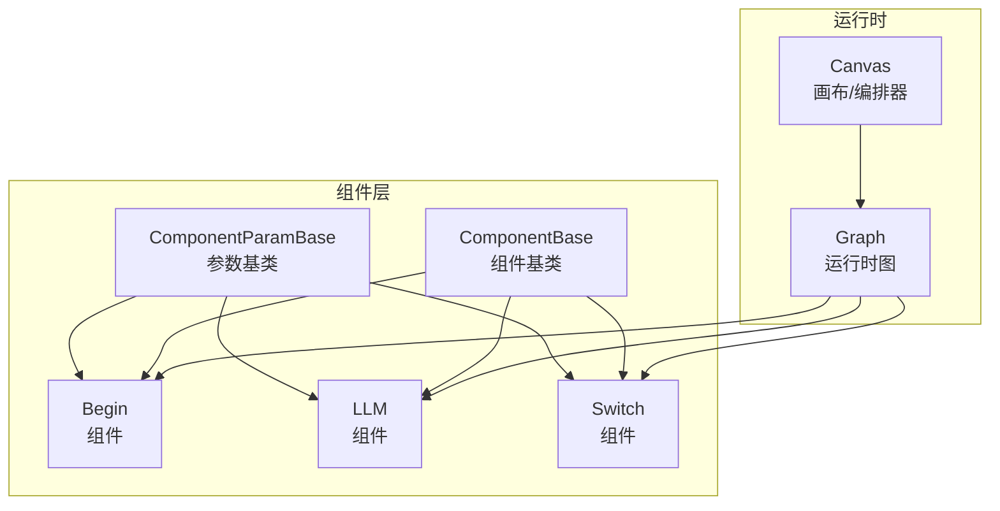
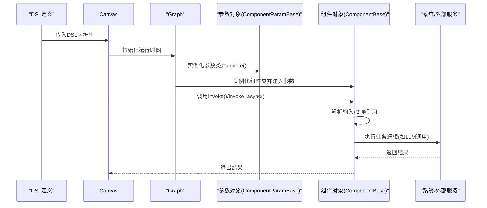
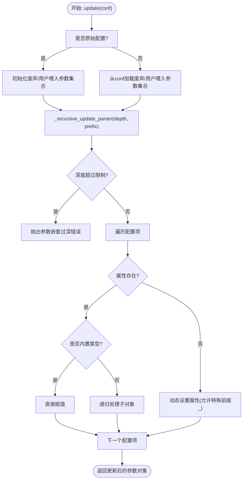
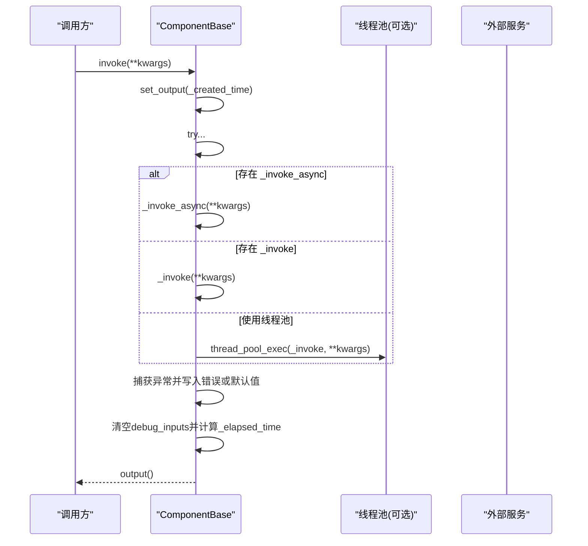
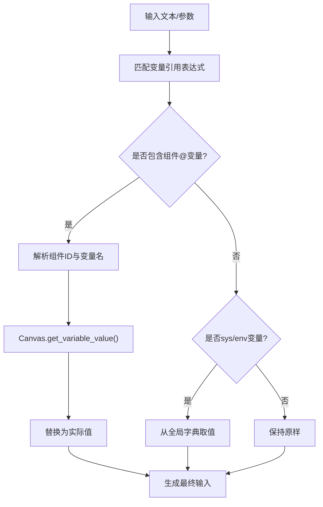
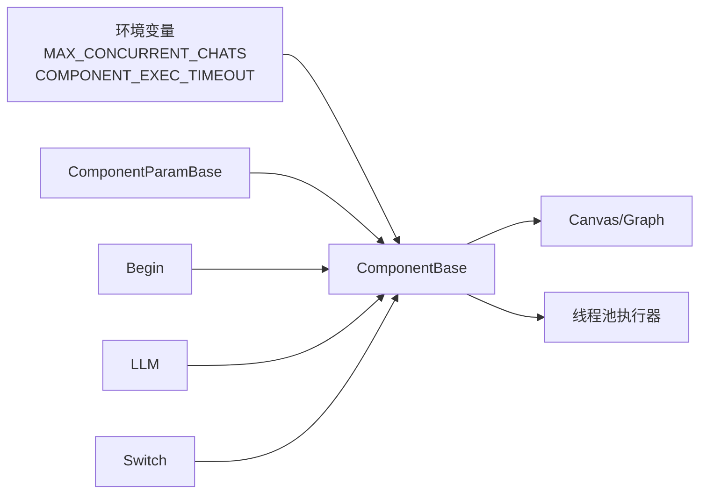

# 组件基类架构

<cite>
**本文档引用的文件**
- [agent/component/base.py](file://agent/component/base.py)
- [agent/canvas.py](file://agent/canvas.py)
- [agent/component/begin.py](file://agent/component/begin.py)
- [agent/component/llm.py](file://agent/component/llm.py)
- [agent/component/switch.py](file://agent/component/switch.py)
- [agent/component/__init__.py](file://agent/component/__init__.py)
- [agent/settings.py](file://agent/settings.py)
</cite>

## 目录
1. [引言](#引言)
2. [项目结构](#项目结构)
3. [核心组件](#核心组件)
4. [架构总览](#架构总览)
5. [详细组件分析](#详细组件分析)
6. [依赖分析](#依赖分析)
7. [性能考虑](#性能考虑)
8. [故障排查指南](#故障排查指南)
9. [结论](#结论)
10. [附录](#附录)

## 引言
本文件面向代理组件系统的开发者与架构师，系统化阐述组件基类架构中的两大核心：ComponentParamBase（参数基类）与ComponentBase（组件基类）。文档将深入解释参数管理、生命周期、输入输出、异常与并发控制、变量引用与上下游关系、以及扩展与最佳实践，并辅以图示帮助读者快速建立对代理组件系统整体设计的理解。

## 项目结构
代理组件位于 Python 包 agent/component 下，采用“参数类 + 组件类”的双层抽象：参数类负责配置、校验与调试输入；组件类负责执行、输出、错误处理与并发控制。Canvas 负责编排与变量解析，Graph 提供运行时上下文与取消机制。

图表来源
- [agent/component/base.py:39-585](file://agent/component/base.py#L39-L585)
- [agent/canvas.py:42-400](file://agent/canvas.py#L42-L400)

章节来源
- [agent/component/base.py:39-585](file://agent/component/base.py#L39-L585)
- [agent/canvas.py:42-400](file://agent/canvas.py#L42-L400)

## 核心组件
本节聚焦于 ComponentParamBase 与 ComponentBase 的职责边界、关键属性与方法。

- ComponentParamBase（参数基类）
  - 职责：封装组件参数对象，提供参数更新、递归校验、内置类型检查、废弃参数兼容、调试输入等能力。
  - 关键点：支持嵌套参数的递归更新与校验；通过 JSON 配置进行约束校验；维护用户喂入参数集合与废弃参数集合；提供字符串、数值、布尔等常用校验方法。
- ComponentBase（组件基类）
  - 职责：封装组件生命周期、输入解析、输出管理、异常处理、并发控制与超时控制；提供上游/下游查询、父节点访问、变量引用解析等运行时能力。
  - 关键点：统一的 invoke/invoke_async 入口；基于环境变量的并发限制；基于装饰器的超时控制；输出/输入的统一存取接口；取消任务的统一检测。

章节来源
- [agent/component/base.py:39-585](file://agent/component/base.py#L39-L585)
- [agent/settings.py:17-19](file://agent/settings.py#L17-L19)

## 架构总览
下图展示了组件基类在代理系统中的位置与交互关系：Canvas/Graph 负责加载 DSL、实例化组件并维护全局变量；组件通过参数基类完成配置与校验；组件基类提供统一的执行入口与运行时能力。

图表来源
- [agent/canvas.py:94-108](file://agent/canvas.py#L94-L108)
- [agent/component/base.py:384-451](file://agent/component/base.py#L384-L451)

章节来源
- [agent/canvas.py:94-108](file://agent/canvas.py#L94-L108)
- [agent/component/base.py:384-451](file://agent/component/base.py#L384-L451)

## 详细组件分析

### 参数基类 ComponentParamBase
- 参数更新与递归
  - 支持从原始配置更新参数树，自动识别用户喂入参数与废弃参数集合，避免冗余字段引发的异常。
  - 通过深度限制防止过深嵌套导致的解析风险。
- 参数校验
  - 内置多种类型与范围校验方法（字符串、正整数、非负数、区间、枚举等）。
  - 支持通过 JSON 配置进行二次约束校验，若未找到对应校验文件则跳过。
- 废弃参数兼容
  - 维护废弃参数集合与用户喂入参数集合，提供警告与过渡提示，保证向后兼容。
- 调试输入
  - 记录调试阶段的输入映射，便于可视化与问题定位。

图表来源
- [agent/component/base.py:127-187](file://agent/component/base.py#L127-L187)

章节来源
- [agent/component/base.py:39-387](file://agent/component/base.py#L39-L387)
- [agent/settings.py:17-19](file://agent/settings.py#L17-L19)

### 组件基类 ComponentBase
- 生命周期与执行入口
  - 同步/异步统一入口：invoke/invoke_async，分别记录耗时并处理异常。
  - 基于装饰器的超时控制，确保长时间阻塞不会影响系统稳定性。
- 输入输出管理
  - 输入：从参数元素中提取变量引用，解析 sys/env 变量与上游组件输出；支持调试输入覆盖。
  - 输出：统一存取接口，记录输出类型与值；支持错误输出与默认值回退。
- 并发与取消
  - 基于信号量限制并发；基于 Canvas 的取消标记进行任务级中断。
- 上游/下游与父子关系
  - 提供查询上游/下游组件名称列表；支持获取父节点对象；用于流程控制与路由决策。
- 异常处理与默认值
  - 支持异常方法策略（如注释/跳转/默认值），在异常时写入默认值或错误输出。

图表来源
- [agent/component/base.py:407-447](file://agent/component/base.py#L407-L447)

章节来源
- [agent/component/base.py:365-585](file://agent/component/base.py#L365-L585)

### 变量引用与上游/下游关系
- 变量引用解析
  - 支持表达式格式：组件@变量 或 sys.变量 或 env.变量；Canvas 提供统一解析与路径访问。
  - 在组件输入解析阶段，将引用替换为真实值，支持嵌套结构与数组索引。
- 上下游关系
  - 组件可通过 Canvas 查询上游/下游组件 ID 列表，用于条件分支、路由与流控。
- 数据传递模式
  - 组件间通过输出键到下游输入键的映射进行数据传递；支持结构化输出与流式输出。

图表来源
- [agent/component/base.py:500-511](file://agent/component/base.py#L500-L511)
- [agent/canvas.py:193-237](file://agent/canvas.py#L193-L237)

章节来源
- [agent/component/base.py:500-511](file://agent/component/base.py#L500-L511)
- [agent/canvas.py:193-237](file://agent/canvas.py#L193-L237)

### 具体组件示例与扩展指南

#### Begin 组件
- 参数类：BeginParam 继承自用户填充参数类，定义模式与开场语等。
- 组件类：Begin 重写 _invoke，处理文件上传与输出映射。
- 扩展要点：在 check 中加入参数合法性校验；在 get_input_form 中声明输入表单；在 _invoke 中实现业务逻辑并正确 set_output。

章节来源
- [agent/component/begin.py:20-64](file://agent/component/begin.py#L20-L64)

#### LLM 组件
- 参数类：LLMParam 定义模型ID、提示词、采样参数等，并进行类型与范围校验。
- 组件类：LLM 重写 _invoke/_invoke_async，准备消息与图片数据，调用模型并处理流式输出。
- 扩展要点：利用 get_input_elements_from_text 自动发现变量引用；在异常时根据策略设置默认值或错误输出；注意超时与取消。

章节来源
- [agent/component/llm.py:34-455](file://agent/component/llm.py#L34-L455)

#### Switch 组件
- 参数类：SwitchParam 定义条件、逻辑运算符与目标组件。
- 组件类：Switch 重写 _invoke，按条件判断选择下游组件。
- 扩展要点：在 process_operator 中扩展更多比较运算；在 check 中校验条件完整性。

章节来源
- [agent/component/switch.py:25-141](file://agent/component/switch.py#L25-L141)

### 组件注册与查找
- 通过包扫描自动注册所有组件类，提供 component_class(class_name) 查找器，支持在 Graph.load 阶段动态实例化。

章节来源
- [agent/component/__init__.py:22-59](file://agent/component/__init__.py#L22-L59)
- [agent/canvas.py:94-108](file://agent/canvas.py#L94-L108)

## 依赖分析
- 组件基类依赖
  - Canvas/Graph：提供运行时上下文、变量解析、取消标记与组件图信息。
  - 环境变量：并发限制与组件执行超时时间。
  - 工具模块：线程池执行器用于同步方法的异步包装。
- 组件间耦合
  - 组件通过变量引用解耦，仅依赖约定的输出键；上游/下游关系由 DSL 描述，运行时由 Graph 维护。

图表来源
- [agent/component/base.py:367-368](file://agent/component/base.py#L367-L368)
- [agent/canvas.py:283-400](file://agent/canvas.py#L283-L400)

章节来源
- [agent/component/base.py:365-368](file://agent/component/base.py#L365-L368)
- [agent/canvas.py:283-400](file://agent/canvas.py#L283-L400)

## 性能考虑
- 并发控制
  - 使用信号量限制同时执行的组件数量，默认值来自环境变量；避免资源争用与过载。
- 超时控制
  - 对组件执行函数应用超时装饰器，防止阻塞；建议为长耗时组件设置合理的超时阈值。
- 线程池
  - 当组件未实现协程版本时，自动降级到线程池执行，平衡吞吐与响应性。
- 输出与调试
  - 统一输出接口减少重复序列化；调试输入仅在必要时启用，避免额外开销。

章节来源
- [agent/component/base.py:421-447](file://agent/component/base.py#L421-L447)
- [agent/component/base.py:449-451](file://agent/component/base.py#L449-L451)

## 故障排查指南
- 参数校验失败
  - 检查参数 JSON 校验文件是否存在；确认参数类型与范围是否满足内置校验要求。
- 取消任务
  - 若组件在执行中被取消，会记录日志并输出错误；检查 Canvas 的取消标记与任务ID。
- 变量引用解析失败
  - 确认表达式格式正确；检查上游组件是否已产生对应输出键；核对 sys/env 变量是否存在于全局字典。
- 异常默认值策略
  - 若配置了异常默认值策略，组件会在异常时写入默认值而非错误；根据需求调整策略或关闭默认值。

章节来源
- [agent/component/base.py:393-405](file://agent/component/base.py#L393-L405)
- [agent/canvas.py:271-280](file://agent/canvas.py#L271-L280)
- [agent/canvas.py:193-237](file://agent/canvas.py#L193-L237)

## 结论
ComponentParamBase 与 ComponentBase 构成了代理组件系统的核心抽象：前者负责参数的健壮性与可维护性，后者负责执行的可靠性与可观测性。通过变量引用、上游/下游关系与统一的生命周期管理，系统实现了高内聚、低耦合的组件化编排。遵循本文档的扩展指南与最佳实践，可在保证性能与稳定性的前提下快速迭代新的组件能力。

## 附录
- 关键术语
  - 参数对象：由 ComponentParamBase 派生的参数类，承载组件配置与校验。
  - 组件对象：由 ComponentBase 派生的组件类，承载执行逻辑与运行时行为。
  - 变量引用：形如 “c@key”、“sys.key”、“env.key”的表达式，指向上游输出或全局变量。
  - 上游/下游：由 DSL 定义的组件连接关系，运行时由 Graph 维护。
- 扩展清单
  - 新建参数类：继承 ComponentParamBase，实现 check 与 get_input_form。
  - 新建组件类：继承 ComponentBase，实现 _invoke 或 _invoke_async。
  - 注册组件：确保文件名与类名符合包扫描规则，或在 component_class 查找范围内。
  - 参数校验：在 check 中使用内置校验方法；必要时提供 JSON 校验文件。
  - 变量引用：在提示词或参数中使用表达式，组件在输入解析阶段自动替换。
  - 异常策略：配置异常方法、默认值与跳转目标，提升容错能力。