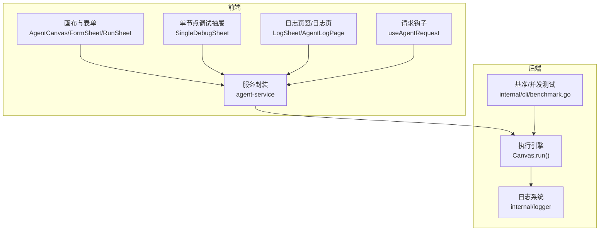
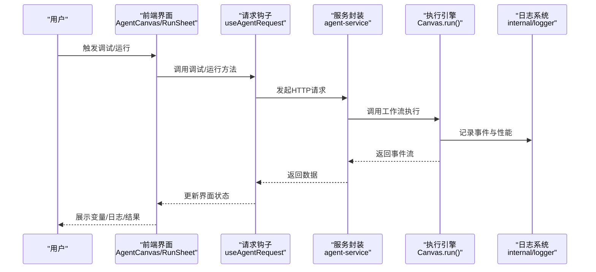
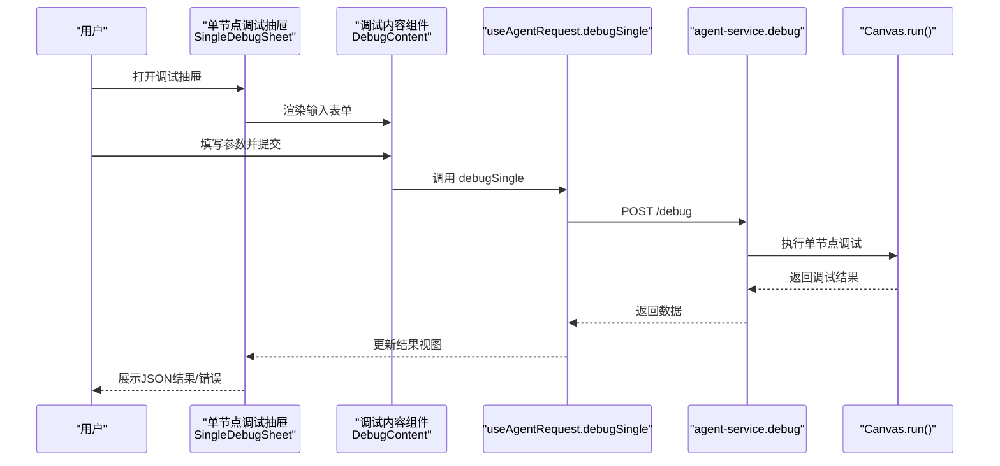
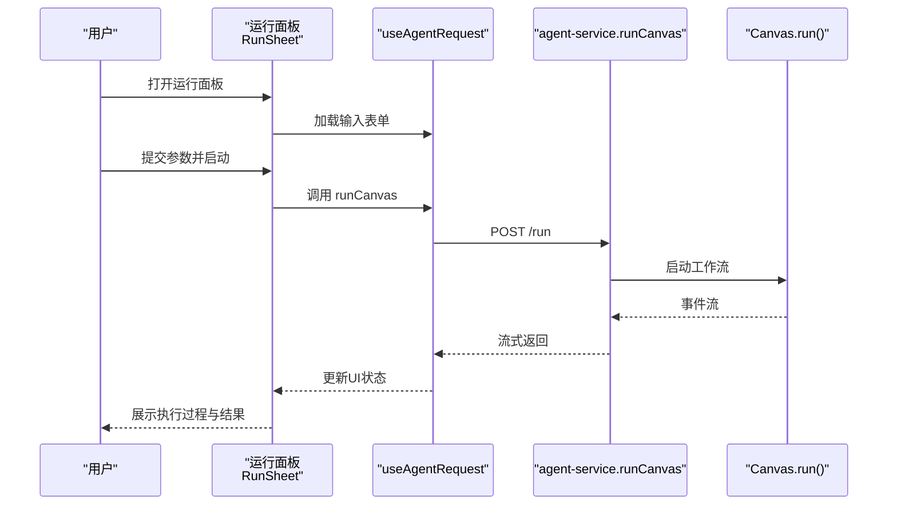
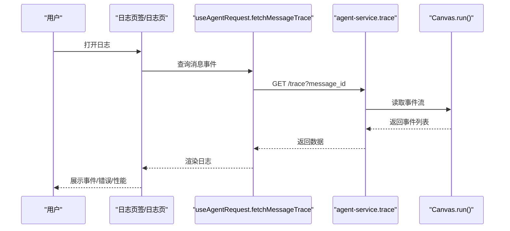
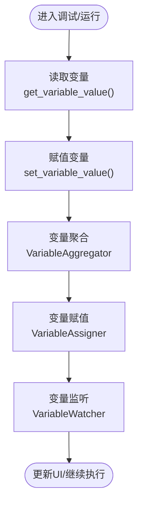
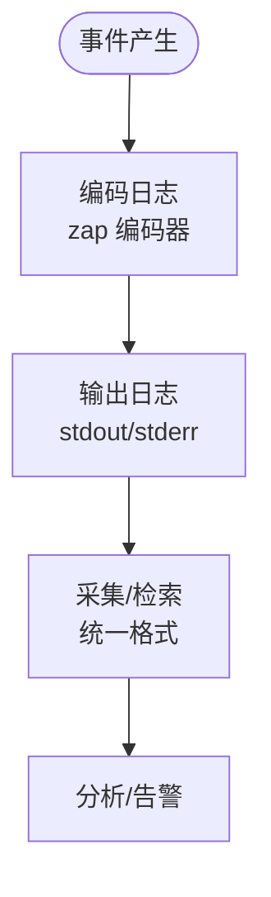
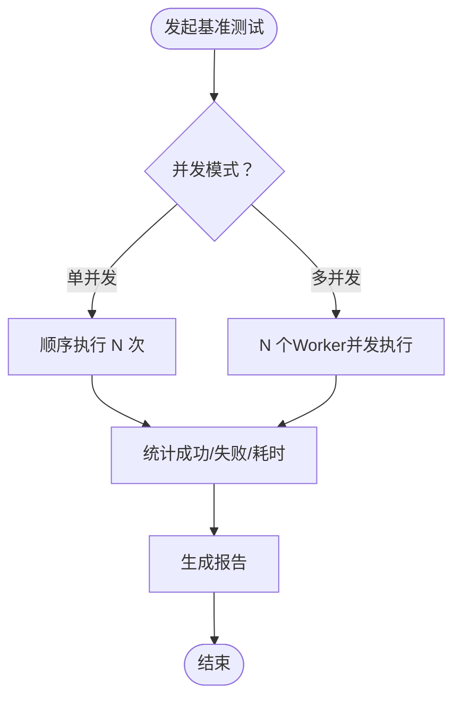
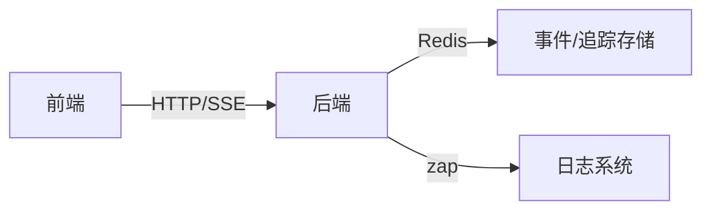

# 代理调试工具

<cite>
**本文引用的文件**
- [web/src/pages/agent/canvas/index.tsx](file://web/src/pages/agent/canvas/index.tsx)
- [web/src/pages/agent/run-sheet/index.tsx](file://web/src/pages/agent/run-sheet/index.tsx)
- [web/src/pages/agent/form-sheet/single-debug-sheet/index.tsx](file://web/src/pages/agent/form-sheet/single-debug-sheet/index.tsx)
- [web/src/pages/agent/debug-content/index.tsx](file://web/src/pages/agent/debug-content/index.tsx)
- [web/src/hooks/use-agent-request.ts](file://web/src/hooks/use-agent-request.ts)
- [web/src/services/agent-service.ts](file://web/src/services/agent-service.ts)
- [web/src/interfaces/request/agent.ts](file://web/src/interfaces/request/agent.ts)
- [web/src/pages/agent/log-page.tsx](file://web/src/pages/agent/log-page.tsx)
- [web/src/pages/agent/agent-log-page.tsx](file://web/src/pages/agent/agent-log-page.tsx)
- [internal/logger/logger.go](file://internal/logger/logger.go)
- [internal/cli/benchmark.go](file://internal/cli/benchmark.go)
- [agent/canvas.py](file://agent/canvas.py)
- [agent/component/varaiable_aggregator.py](file://agent/component/varaiable_aggregator.py)
- [agent/component/variable_assigner.py](file://agent/component/variable_assigner.py)
- [internal/server/variable.go](file://internal/server/variable.go)
- [common/signal_utils.py](file://common/signal_utils.py)
</cite>

## 目录
1. [简介](#简介)
2. [项目结构](#项目结构)
3. [核心组件](#核心组件)
4. [架构总览](#架构总览)
5. [详细组件分析](#详细组件分析)
6. [依赖分析](#依赖分析)
7. [性能考量](#性能考量)
8. [故障排查指南](#故障排查指南)
9. [结论](#结论)
10. [附录](#附录)

## 简介
本文件面向“代理调试工具”的技术文档，聚焦于代理工作流的调试、监控与问题排查能力。内容覆盖调试界面设计（变量查看、执行状态监控、日志输出、性能分析）、运行面板使用（手动执行、参数调试、结果预览、错误定位）、日志系统实现（执行日志、错误日志、性能日志、调试信息收集与展示）、问题排查技巧（常见错误类型、错误信息解读、性能瓶颈分析、资源使用监控）、调试最佳实践（断点设置、变量跟踪、执行路径分析、结果验证），以及高级功能（批量测试、性能基准、并发测试）。目标是帮助开发者高效地调试与优化代理工作流。

## 项目结构
代理调试工具由前端界面与后端执行引擎协同构成：
- 前端：基于 React 的可视化画布、调试抽屉、运行面板、日志页签与日志表格，通过 React Query 管理请求与缓存。
- 后端：Python 执行引擎负责代理工作流的调度、组件调用、事件流式输出、变量管理与日志持久化；Go 日志框架提供统一日志格式；CLI 提供基准测试与并发测试能力。

图示来源
- [web/src/pages/agent/canvas/index.tsx:260-428](file://web/src/pages/agent/canvas/index.tsx#L260-L428)
- [web/src/pages/agent/run-sheet/index.tsx:46-71](file://web/src/pages/agent/run-sheet/index.tsx#L46-L71)
- [web/src/pages/agent/form-sheet/single-debug-sheet/index.tsx:1-90](file://web/src/pages/agent/form-sheet/single-debug-sheet/index.tsx#L1-L90)
- [web/src/pages/agent/agent-log-page.tsx:228-368](file://web/src/pages/agent/agent-log-page.tsx#L228-L368)
- [web/src/services/agent-service.ts:36-135](file://web/src/services/agent-service.ts#L36-L135)
- [agent/canvas.py:375-668](file://agent/canvas.py#L375-L668)
- [internal/logger/logger.go:50-138](file://internal/logger/logger.go#L50-L138)
- [internal/cli/benchmark.go:53-226](file://internal/cli/benchmark.go#L53-L226)

章节来源
- [web/src/pages/agent/canvas/index.tsx:119-428](file://web/src/pages/agent/canvas/index.tsx#L119-L428)
- [web/src/pages/agent/run-sheet/index.tsx:46-71](file://web/src/pages/agent/run-sheet/index.tsx#L46-L71)
- [web/src/pages/agent/form-sheet/single-debug-sheet/index.tsx:1-90](file://web/src/pages/agent/form-sheet/single-debug-sheet/index.tsx#L1-L90)
- [web/src/pages/agent/agent-log-page.tsx:228-368](file://web/src/pages/agent/agent-log-page.tsx#L228-L368)
- [web/src/services/agent-service.ts:36-135](file://web/src/services/agent-service.ts#L36-L135)
- [agent/canvas.py:375-668](file://agent/canvas.py#L375-L668)
- [internal/logger/logger.go:50-138](file://internal/logger/logger.go#L50-L138)
- [internal/cli/benchmark.go:53-226](file://internal/cli/benchmark.go#L53-L226)

## 核心组件
- 调试界面与交互
  - 单节点调试抽屉：支持输入表单渲染、参数校验、单节点调试触发与结果展示。
  - 运行面板：支持完整工作流的手动执行、参数传入、实时事件流与结果预览。
  - 日志页签/日志页：按会话/消息聚合展示事件流、错误信息、参考信息与性能指标。
- 请求与状态管理
  - useAgentRequest 钩子：封装调试、输入表单获取、日志查询、追踪等 API。
  - agent-service：统一注册后端接口，便于前端调用。
- 执行引擎与日志
  - Canvas.run：事件驱动的工作流执行器，产出 node_started/node_finished/workflow_finished 等事件，并记录耗时与错误。
  - internal/logger：统一日志编码与输出，便于采集与检索。
- 变量与状态
  - 变量读写与监听：支持全局变量与组件输出变量的读取、赋值与变更监听。
  - 变量聚合与赋值组件：用于从画布中聚合变量并进行运算赋值。

章节来源
- [web/src/pages/agent/form-sheet/single-debug-sheet/index.tsx:1-90](file://web/src/pages/agent/form-sheet/single-debug-sheet/index.tsx#L1-L90)
- [web/src/pages/agent/run-sheet/index.tsx:46-71](file://web/src/pages/agent/run-sheet/index.tsx#L46-L71)
- [web/src/pages/agent/debug-content/index.tsx:1-280](file://web/src/pages/agent/debug-content/index.tsx#L1-L280)
- [web/src/hooks/use-agent-request.ts:486-504](file://web/src/hooks/use-agent-request.ts#L486-L504)
- [web/src/services/agent-service.ts:36-135](file://web/src/services/agent-service.ts#L36-L135)
- [agent/canvas.py:375-668](file://agent/canvas.py#L375-L668)
- [internal/logger/logger.go:50-138](file://internal/logger/logger.go#L50-L138)
- [agent/component/varaiable_aggregator.py:67-84](file://agent/component/varaiable_aggregator.py#L67-L84)
- [agent/component/variable_assigner.py:41-57](file://agent/component/variable_assigner.py#L41-L57)
- [internal/server/variable.go:190-245](file://internal/server/variable.go#L190-L245)

## 架构总览
代理调试工具采用“前端可视化+后端事件流”的架构模式：
- 前端负责用户交互与可视化呈现（画布、表单、日志、追踪）。
- 后端以事件流形式输出执行过程（节点开始/结束、消息、工作流完成/取消），前端订阅并渲染。
- 日志系统统一编码输出，便于检索与分析。

图示来源
- [web/src/pages/agent/canvas/index.tsx:260-428](file://web/src/pages/agent/canvas/index.tsx#L260-L428)
- [web/src/pages/agent/run-sheet/index.tsx:46-71](file://web/src/pages/agent/run-sheet/index.tsx#L46-L71)
- [web/src/hooks/use-agent-request.ts:486-504](file://web/src/hooks/use-agent-request.ts#L486-L504)
- [web/src/services/agent-service.ts:36-135](file://web/src/services/agent-service.ts#L36-L135)
- [agent/canvas.py:375-668](file://agent/canvas.py#L375-L668)
- [internal/logger/logger.go:50-138](file://internal/logger/logger.go#L50-L138)

## 详细组件分析

### 组件A：单节点调试（SingleDebugSheet）
- 功能要点
  - 获取组件输入表单定义，构建调试表单。
  - 触发单节点调试，返回调试结果并以 JSON 形式展示。
  - 支持复制结果、错误态高亮。
- 关键流程
  - 表单渲染：根据 BeginQuery 类型映射到不同输入控件。
  - 参数提交：将数组形式的参数转换为对象，调用 debugSingle 接口。
  - 结果展示：使用 JSON 视图展示返回数据，错误字段高亮。

图示来源
- [web/src/pages/agent/form-sheet/single-debug-sheet/index.tsx:1-90](file://web/src/pages/agent/form-sheet/single-debug-sheet/index.tsx#L1-L90)
- [web/src/pages/agent/debug-content/index.tsx:1-280](file://web/src/pages/agent/debug-content/index.tsx#L1-L280)
- [web/src/hooks/use-agent-request.ts:486-504](file://web/src/hooks/use-agent-request.ts#L486-L504)
- [web/src/services/agent-service.ts:85-88](file://web/src/services/agent-service.ts#L85-L88)
- [agent/canvas.py:375-668](file://agent/canvas.py#L375-L668)

章节来源
- [web/src/pages/agent/form-sheet/single-debug-sheet/index.tsx:1-90](file://web/src/pages/agent/form-sheet/single-debug-sheet/index.tsx#L1-L90)
- [web/src/pages/agent/debug-content/index.tsx:1-280](file://web/src/pages/agent/debug-content/index.tsx#L1-L280)
- [web/src/hooks/use-agent-request.ts:486-504](file://web/src/hooks/use-agent-request.ts#L486-L504)
- [web/src/services/agent-service.ts:85-88](file://web/src/services/agent-service.ts#L85-L88)
- [agent/canvas.py:375-668](file://agent/canvas.py#L375-L668)

### 组件B：运行面板（RunSheet）
- 功能要点
  - 加载画布输入表单，允许用户填写参数并启动完整工作流。
  - 实时接收事件流，展示节点执行状态、消息与最终结果。
  - 支持取消任务。
- 关键流程
  - 表单加载：根据画布 DSL 生成输入项。
  - 启动执行：调用 runCanvas 接口，后端返回事件流。
  - 事件渲染：将事件流映射为 UI 状态，支持消息流式渲染。

图示来源
- [web/src/pages/agent/run-sheet/index.tsx:46-71](file://web/src/pages/agent/run-sheet/index.tsx#L46-L71)
- [web/src/hooks/use-agent-request.ts:796-800](file://web/src/hooks/use-agent-request.ts#L796-L800)
- [web/src/services/agent-service.ts:69-72](file://web/src/services/agent-service.ts#L69-L72)
- [agent/canvas.py:375-668](file://agent/canvas.py#L375-L668)

章节来源
- [web/src/pages/agent/run-sheet/index.tsx:46-71](file://web/src/pages/agent/run-sheet/index.tsx#L46-L71)
- [web/src/hooks/use-agent-request.ts:796-800](file://web/src/hooks/use-agent-request.ts#L796-L800)
- [web/src/services/agent-service.ts:69-72](file://web/src/services/agent-service.ts#L69-L72)
- [agent/canvas.py:375-668](file://agent/canvas.py#L375-L668)

### 组件C：日志系统与展示（LogSheet/AgentLogPage）
- 功能要点
  - 按会话/消息聚合展示事件流：节点开始/结束、消息、工作流完成/取消。
  - 错误定位：展示错误信息与异常堆栈片段。
  - 性能分析：展示节点耗时、工作流耗时。
  - 参考信息：展示检索引用、附件等上下文。
- 关键流程
  - 事件流订阅：通过 SSE 或轮询获取事件。
  - 数据聚合：按 message_id 聚合事件，计算耗时。
  - 渲染展示：表格/卡片形式展示日志条目，支持展开详情。

图示来源
- [web/src/pages/agent/agent-log-page.tsx:228-368](file://web/src/pages/agent/agent-log-page.tsx#L228-L368)
- [web/src/hooks/use-agent-request.ts:426-463](file://web/src/hooks/use-agent-request.ts#L426-L463)
- [web/src/services/agent-service.ts:137-139](file://web/src/services/agent-service.ts#L137-L139)
- [agent/canvas.py:412-433](file://agent/canvas.py#L412-L433)

章节来源
- [web/src/pages/agent/agent-log-page.tsx:228-368](file://web/src/pages/agent/agent-log-page.tsx#L228-L368)
- [web/src/hooks/use-agent-request.ts:426-463](file://web/src/hooks/use-agent-request.ts#L426-L463)
- [web/src/services/agent-service.ts:137-139](file://web/src/services/agent-service.ts#L137-L139)
- [agent/canvas.py:412-433](file://agent/canvas.py#L412-L433)

### 组件D：变量查看与状态监控
- 变量读取与赋值
  - 全局变量与组件输出变量的读取与赋值，支持嵌套路径访问。
  - 变量聚合与赋值组件：从画布聚合变量并进行运算赋值。
- 变量监听
  - 后端提供变量监听器，定时刷新变量存储，便于跨实例检测变量变化。

图示来源
- [agent/canvas.py:193-270](file://agent/canvas.py#L193-L270)
- [agent/component/varaiable_aggregator.py:67-84](file://agent/component/varaiable_aggregator.py#L67-L84)
- [agent/component/variable_assigner.py:41-57](file://agent/component/variable_assigner.py#L41-L57)
- [internal/server/variable.go:190-245](file://internal/server/variable.go#L190-L245)

章节来源
- [agent/canvas.py:193-270](file://agent/canvas.py#L193-L270)
- [agent/component/varaiable_aggregator.py:67-84](file://agent/component/varaiable_aggregator.py#L67-L84)
- [agent/component/variable_assigner.py:41-57](file://agent/component/variable_assigner.py#L41-L57)
- [internal/server/variable.go:190-245](file://internal/server/variable.go#L190-L245)

### 组件E：日志系统实现
- 日志编码与输出
  - 使用 zap 进行结构化日志编码，统一时间、级别、消息与堆栈。
- 事件流中的日志
  - Canvas 在执行过程中产生节点事件与工作流事件，携带耗时、错误等信息，便于前端展示与分析。

图示来源
- [internal/logger/logger.go:50-138](file://internal/logger/logger.go#L50-L138)
- [agent/canvas.py:412-433](file://agent/canvas.py#L412-L433)

章节来源
- [internal/logger/logger.go:50-138](file://internal/logger/logger.go#L50-L138)
- [agent/canvas.py:412-433](file://agent/canvas.py#L412-L433)

### 组件F：高级功能（批量测试、性能基准、并发测试）
- 基准测试
  - 支持单并发与多并发两种模式，统计成功/失败次数与总耗时。
- 并发测试
  - 多个并发 Worker 同时执行命令，汇总响应与耗时，评估系统吞吐与稳定性。

图示来源
- [internal/cli/benchmark.go:53-226](file://internal/cli/benchmark.go#L53-L226)

章节来源
- [internal/cli/benchmark.go:53-226](file://internal/cli/benchmark.go#L53-L226)

## 依赖分析
- 前端依赖
  - React Query：统一管理请求、缓存与状态。
  - 自定义服务封装：对后端接口进行统一注册与调用。
- 后端依赖
  - Python 执行引擎：事件驱动的工作流执行器。
  - Go 日志框架：结构化日志输出。
  - Redis：事件流与追踪数据的临时存储。

图示来源
- [web/src/services/agent-service.ts:36-135](file://web/src/services/agent-service.ts#L36-L135)
- [agent/canvas.py:785-808](file://agent/canvas.py#L785-L808)
- [internal/logger/logger.go:50-138](file://internal/logger/logger.go#L50-L138)

章节来源
- [web/src/services/agent-service.ts:36-135](file://web/src/services/agent-service.ts#L36-L135)
- [agent/canvas.py:785-808](file://agent/canvas.py#L785-L808)
- [internal/logger/logger.go:50-138](file://internal/logger/logger.go#L50-L138)

## 性能考量
- 事件流与并发
  - Canvas.run 使用异步并发执行多个节点，最大并发度受线程池大小限制，避免阻塞。
  - 事件流以增量方式推送，前端可逐步渲染，降低首屏压力。
- 资源与内存
  - 通过信号处理与 tracemalloc 快照，辅助定位内存泄漏与峰值。
- 日志与可观测性
  - 统一日志编码，便于集中采集与检索；事件中包含耗时与错误，便于性能分析与问题定位。

章节来源
- [agent/canvas.py:435-482](file://agent/canvas.py#L435-L482)
- [common/signal_utils.py:36-55](file://common/signal_utils.py#L36-L55)
- [internal/logger/logger.go:50-138](file://internal/logger/logger.go#L50-L138)

## 故障排查指南
- 常见错误类型
  - 参数校验失败：前端表单校验未通过或后端参数检查抛错。
  - 组件异常：节点执行抛出异常，事件流中包含错误信息与默认值策略。
  - 取消任务：任务被取消时，事件流中包含取消提示。
- 错误信息解读
  - 事件流中的 error 字段与异常处理器的 goto/default_value 决定分支与兜底。
- 性能瓶颈分析
  - 查看节点 elapsed_time 与工作流 elapsed_time，定位耗时节点。
  - 结合日志系统的时间戳与耗时字段，进行端到端分析。
- 资源使用监控
  - 利用 tracemalloc 快照与进程内存指标，定位内存占用与泄漏风险。

章节来源
- [agent/canvas.py:484-597](file://agent/canvas.py#L484-L597)
- [web/src/pages/agent/agent-log-page.tsx:228-368](file://web/src/pages/agent/agent-log-page.tsx#L228-L368)
- [common/signal_utils.py:36-55](file://common/signal_utils.py#L36-L55)

## 结论
代理调试工具通过“前端可视化+后端事件流”的设计，实现了从变量查看、执行状态监控、日志输出到性能分析的全链路调试能力。配合统一的日志系统与变量管理机制，开发者可以快速定位问题、优化路径并提升整体效率。高级功能（基准/并发测试）进一步增强了系统在真实负载下的稳定性与性能评估能力。

## 附录
- 调试最佳实践
  - 断点设置：利用用户输入节点（userfillup）暂停工作流，逐节点验证。
  - 变量跟踪：通过变量聚合与赋值组件，串联关键变量，观察其变化。
  - 执行路径分析：结合事件流与日志，绘制节点执行路径，识别异常分支。
  - 结果验证：使用单节点调试与运行面板对比预期输出，确保一致性。
- 高级功能建议
  - 批量测试：针对高频操作进行迭代次数测试，评估稳定性。
  - 并发测试：模拟多用户并发场景，评估系统吞吐与资源占用。
  - 基准测试：固定输入与环境，对比不同配置下的性能差异。