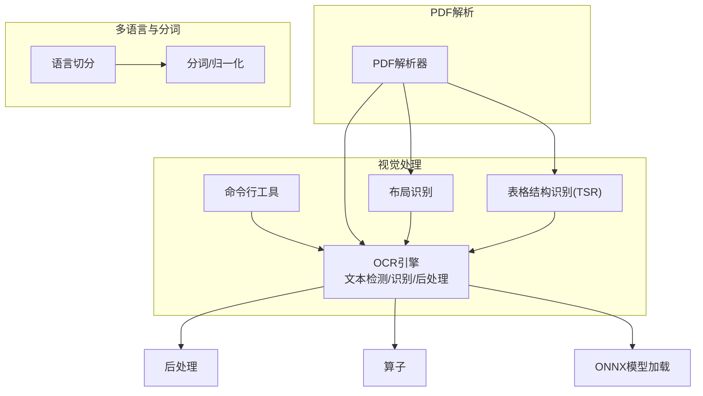
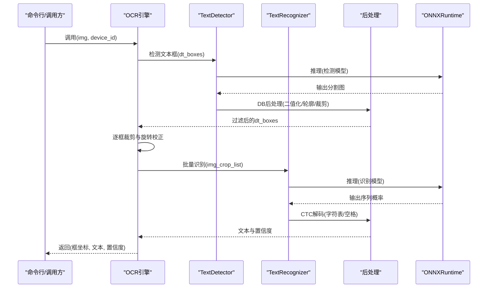
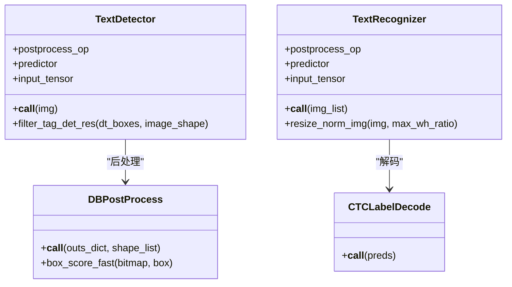
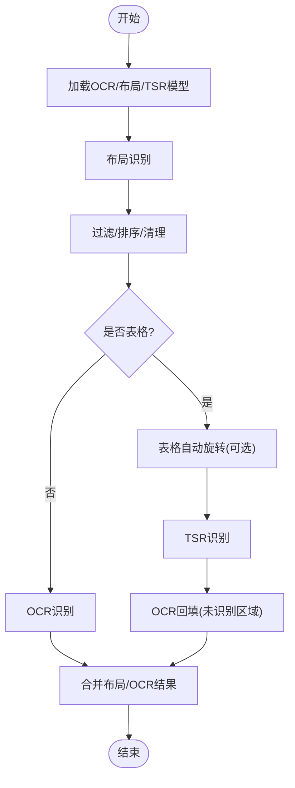
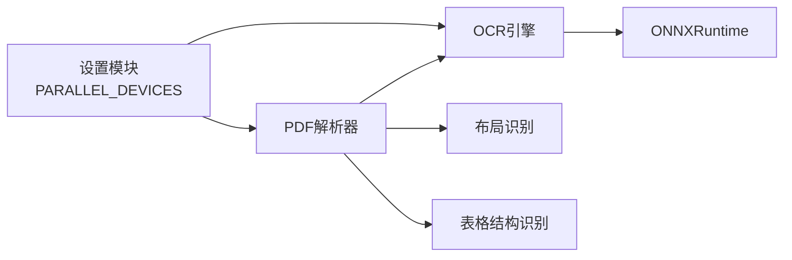

# OCR识别系统

<cite>
**本文引用的文件**
- [deepdoc/vision/ocr.py](file://deepdoc/vision/ocr.py)
- [deepdoc/vision/postprocess.py](file://deepdoc/vision/postprocess.py)
- [deepdoc/vision/operators.py](file://deepdoc/vision/operators.py)
- [deepdoc/vision/t_ocr.py](file://deepdoc/vision/t_ocr.py)
- [deepdoc/vision/t_recognizer.py](file://deepdoc/vision/t_recognizer.py)
- [deepdoc/parser/pdf_parser.py](file://deepdoc/parser/pdf_parser.py)
- [deepdoc/parser/paddleocr_parser.py](file://deepdoc/parser/paddleocr_parser.py)
- [common/settings.py](file://common/settings.py)
- [internal/cpp/rag_analyzer.cpp](file://internal/cpp/rag_analyzer.cpp)
- [deepdoc/README_zh.md](file://deepdoc/README_zh.md)
- [deepdoc/README.md](file://deepdoc/README.md)
</cite>

## 目录
1. [简介](#简介)
2. [项目结构](#项目结构)
3. [核心组件](#核心组件)
4. [架构总览](#架构总览)
5. [详细组件分析](#详细组件分析)
6. [依赖关系分析](#依赖关系分析)
7. [性能考虑](#性能考虑)
8. [故障排除指南](#故障排除指南)
9. [结论](#结论)
10. [附录](#附录)

## 简介
本技术文档面向RAGFlow的OCR识别系统，系统性阐述其光学字符识别能力与架构设计，覆盖文本检测、文字识别、后处理、多语言支持、精度优化、性能调优、配置参数、使用示例、错误处理与质量评估等内容。目标是帮助开发者充分理解并高效利用OCR能力，提升文档理解的准确性与鲁棒性。

## 项目结构
RAGFlow的OCR能力主要集中在deepdoc子模块中，围绕“视觉处理”展开，包括：
- OCR引擎：文本检测与识别、后处理、算子与模型加载
- 布局与表格：布局识别、表格结构识别（TSR）、表格自动旋转
- PDF解析：融合OCR与布局识别，实现高质量文本抽取
- 工具脚本：命令行工具，支持批量OCR与可视化输出
- 多语言与分词：语言切分与分词逻辑，支撑多语言场景

图表来源
- [deepdoc/vision/ocr.py:542-758](file://deepdoc/vision/ocr.py#L542-L758)
- [deepdoc/vision/t_recognizer.py:36-186](file://deepdoc/vision/t_recognizer.py#L36-L186)
- [deepdoc/parser/pdf_parser.py:56-110](file://deepdoc/parser/pdf_parser.py#L56-L110)
- [deepdoc/vision/postprocess.py:25-39](file://deepdoc/vision/postprocess.py#L25-L39)
- [deepdoc/vision/operators.py:28-737](file://deepdoc/vision/operators.py#L28-L737)
- [internal/cpp/rag_analyzer.cpp:1398-1433](file://internal/cpp/rag_analyzer.cpp#L1398-L1433)

章节来源
- [deepdoc/README_zh.md:48-128](file://deepdoc/README_zh.md#L48-L128)
- [deepdoc/README.md:46-130](file://deepdoc/README.md#L46-L130)

## 核心组件
- OCR引擎：包含文本检测器、文字识别器、后处理解码器、算子流水线与ONNX模型加载器
- 布局识别：基于ONNX或Ascend推理的布局检测，支持过滤与NMS
- 表格结构识别：TSR识别表格骨架，结合OCR重建表格内容
- PDF解析：融合布局、TSR、OCR，支持表格自动旋转与重排
- 工具脚本：命令行批量OCR与可视化输出
- 多语言与分词：按语言切分与分词，支撑中英混排与多语种场景

章节来源
- [deepdoc/vision/ocr.py:139-758](file://deepdoc/vision/ocr.py#L139-L758)
- [deepdoc/vision/postprocess.py:25-371](file://deepdoc/vision/postprocess.py#L25-L371)
- [deepdoc/vision/operators.py:28-737](file://deepdoc/vision/operators.py#L28-L737)
- [deepdoc/parser/pdf_parser.py:56-110](file://deepdoc/parser/pdf_parser.py#L56-L110)
- [deepdoc/vision/t_ocr.py:43-106](file://deepdoc/vision/t_ocr.py#L43-L106)
- [deepdoc/vision/t_recognizer.py:36-186](file://deepdoc/vision/t_recognizer.py#L36-L186)

## 架构总览
OCR系统采用“检测-裁剪-识别-后处理”的流水线，配合布局与表格识别，形成端到端的文档理解链路。ONNXRuntime提供推理后端，支持CPU/GPU双路径，并通过环境变量与设置模块控制线程与显存策略。

图表来源
- [deepdoc/vision/ocr.py:542-758](file://deepdoc/vision/ocr.py#L542-L758)
- [deepdoc/vision/postprocess.py:232-259](file://deepdoc/vision/postprocess.py#L232-L259)
- [deepdoc/vision/operators.py:305-433](file://deepdoc/vision/operators.py#L305-L433)

## 详细组件分析

### OCR引擎：文本检测与识别
- 文本检测器
  - 支持动态输入尺寸适配与预处理链路（归一化、CHW转换、键保留）
  - 后处理采用DBPostProcess，支持阈值、NMS、多边形/四边形框生成
  - 过滤无效框（过小、越界），返回规范化后的文本框
- 文字识别器
  - 统一图像归一化与padding策略，按宽高比排序批处理，提升吞吐
  - CTCLabelDecode解码，支持字符表与空格处理
  - 支持多模型变体（SVTR、ABINET、CAN等）的归一化差异
- ONNX模型加载
  - 自动缓存已加载模型，避免重复初始化
  - GPU路径：CUDAExecutionProvider，支持显存上限与Arena收缩
  - CPU路径：CPUExecutionProvider，开启Arena收缩释放内存
  - 线程控制：intra/inter线程数由环境变量控制，避免CPU过度占用

图表来源
- [deepdoc/vision/ocr.py:420-540](file://deepdoc/vision/ocr.py#L420-L540)
- [deepdoc/vision/ocr.py:139-418](file://deepdoc/vision/ocr.py#L139-L418)
- [deepdoc/vision/postprocess.py:41-260](file://deepdoc/vision/postprocess.py#L41-L260)
- [deepdoc/vision/postprocess.py:347-371](file://deepdoc/vision/postprocess.py#L347-L371)

章节来源
- [deepdoc/vision/ocr.py:71-136](file://deepdoc/vision/ocr.py#L71-L136)
- [deepdoc/vision/ocr.py:420-540](file://deepdoc/vision/ocr.py#L420-L540)
- [deepdoc/vision/ocr.py:139-418](file://deepdoc/vision/ocr.py#L139-L418)
- [deepdoc/vision/postprocess.py:25-371](file://deepdoc/vision/postprocess.py#L25-L371)

### 后处理与算子
- 后处理
  - DBPostProcess：二值化、轮廓提取、unclip膨胀、最小外接矩、快速/慢速框分值
  - CTCLabelDecode：CTC解码、特殊字符处理、空格支持、阿拉伯语逆序
- 算子
  - 图像解码、归一化、CHW转换、尺寸调整、PadStride、NMS等
  - DetResizeForTest：按限制类型（min/max/resize_long）与32倍数对齐
  - 多类Resize/Normalize变体适配不同识别模型

章节来源
- [deepdoc/vision/postprocess.py:25-371](file://deepdoc/vision/postprocess.py#L25-L371)
- [deepdoc/vision/operators.py:28-737](file://deepdoc/vision/operators.py#L28-L737)

### 多语言支持与分词
- 语言切分：按UTF-8字符判断中/英，将连续片段按语言类型拆分
- 分词/归一化：英文做大小写归一、词形还原与词干提取，中文按需保留原形
- 字符集：CTCLabelDecode从字符表加载，支持空格；阿拉伯语逆序处理

章节来源
- [internal/cpp/rag_analyzer.cpp:1398-1433](file://internal/cpp/rag_analyzer.cpp#L1398-L1433)
- [deepdoc/vision/postprocess.py:262-371](file://deepdoc/vision/postprocess.py#L262-L371)

### PDF解析中的OCR与布局
- 初始化阶段
  - 加载OCR、布局识别器、表格结构识别器、上下文分类模型
  - 并发限制：根据GPU数量设置信号量，避免设备争用
- 流程
  - 布局识别：过滤垃圾布局、按Y优先排序、清理冗余框
  - 表格结构识别：TSR识别行列骨架，必要时进行表格自动旋转
  - OCR回填：对未识别区域进行OCR识别，再与布局/TSR结果匹配
  - 结果重组：按页面与布局类型组织输出，支持表格HTML导出

图表来源
- [deepdoc/parser/pdf_parser.py:56-110](file://deepdoc/parser/pdf_parser.py#L56-L110)
- [deepdoc/parser/pdf_parser.py:413-520](file://deepdoc/parser/pdf_parser.py#L413-L520)
- [deepdoc/parser/pdf_parser.py:766-796](file://deepdoc/parser/pdf_parser.py#L766-L796)

章节来源
- [deepdoc/parser/pdf_parser.py:56-110](file://deepdoc/parser/pdf_parser.py#L56-L110)
- [deepdoc/parser/pdf_parser.py:413-520](file://deepdoc/parser/pdf_parser.py#L413-L520)
- [deepdoc/parser/pdf_parser.py:766-796](file://deepdoc/parser/pdf_parser.py#L766-L796)

### 命令行工具与批量处理
- t_ocr.py：支持多GPU并发，按设备轮询分配任务，异步收集结果
- t_recognizer.py：支持layout/TSR模式，输出可视化图像与HTML表格

章节来源
- [deepdoc/vision/t_ocr.py:43-106](file://deepdoc/vision/t_ocr.py#L43-L106)
- [deepdoc/vision/t_recognizer.py:36-186](file://deepdoc/vision/t_recognizer.py#L36-L186)

## 依赖关系分析
- OCR引擎依赖ONNXRuntime进行推理，支持CPU/GPU执行提供者
- 布局识别与TSR依赖OCR结果进行内容重建
- PDF解析器聚合OCR、布局、TSR，形成端到端流程
- 设置模块提供GPU数量检测与并发设备数配置

图表来源
- [common/settings.py:127-379](file://common/settings.py#L127-L379)
- [deepdoc/parser/pdf_parser.py:70-90](file://deepdoc/parser/pdf_parser.py#L70-L90)
- [deepdoc/vision/ocr.py:71-136](file://deepdoc/vision/ocr.py#L71-L136)

章节来源
- [common/settings.py:127-379](file://common/settings.py#L127-L379)
- [deepdoc/parser/pdf_parser.py:70-90](file://deepdoc/parser/pdf_parser.py#L70-L90)

## 性能考虑
- GPU加速与显存管理
  - GPU路径：CUDAExecutionProvider，支持显存上限与Arena收缩
  - 显存收缩：运行选项可启用GPU Arena收缩，释放VRAM
  - 设备选择：按PARALLEL_DEVICES自动分配多GPU
- 线程控制
  - intra/inter线程数由环境变量控制，避免CPU过度占用
- 批处理与排序
  - 识别前按宽高比排序，减少padding差异，提升批处理效率
- 并发与限流
  - PDF解析器与t_ocr.py使用信号量限制并发，避免GPU争用
- 模型缓存
  - ONNX模型按设备ID缓存，避免重复加载

章节来源
- [deepdoc/vision/ocr.py:71-136](file://deepdoc/vision/ocr.py#L71-L136)
- [deepdoc/vision/ocr.py:369-418](file://deepdoc/vision/ocr.py#L369-L418)
- [deepdoc/vision/t_ocr.py:47-92](file://deepdoc/vision/t_ocr.py#L47-L92)
- [common/settings.py:370-379](file://common/settings.py#L370-L379)

## 故障排除指南
- 模型下载与路径
  - 若无法找到模型文件，检查模型路径与HuggingFace镜像配置
- GPU不可用
  - 确认torch.cuda可用与设备数量；否则回退至CPU
- 推理异常
  - ONNXRuntime重试机制：最多3次重试，间隔5秒
- 并发问题
  - 多GPU场景下使用信号量限制并发；确保CUDA_VISIBLE_DEVICES正确
- 表格旋转
  - 默认启用表格自动旋转；可通过环境变量或API参数关闭
- 字符集与空格
  - CTCLabelDecode支持空格字符；阿拉伯语逆序处理需注意字符表顺序

章节来源
- [deepdoc/vision/ocr.py:81-84](file://deepdoc/vision/ocr.py#L81-L84)
- [deepdoc/vision/ocr.py:401-409](file://deepdoc/vision/ocr.py#L401-L409)
- [deepdoc/parser/pdf_parser.py:413-438](file://deepdoc/parser/pdf_parser.py#L413-L438)
- [deepdoc/README_zh.md:106-128](file://deepdoc/README_zh.md#L106-L128)
- [deepdoc/README.md:107-130](file://deepdoc/README.md#L107-L130)

## 结论
RAGFlow的OCR系统以ONNXRuntime为核心，构建了从文本检测、识别到后处理的完整链路，并与布局识别、表格结构识别深度融合，形成端到端的文档理解能力。通过多语言切分与分词、GPU加速与并发控制、显存收缩与线程优化，系统在精度与性能之间取得良好平衡。建议在生产环境中结合实际硬件与文档质量，合理配置并发与线程参数，并根据业务需求启用/禁用表格自动旋转等功能。

## 附录

### 配置参数与使用示例
- 环境变量
  - OCR_INTRA_OP_NUM_THREADS/OCR_INTER_OP_NUM_THREADS：控制推理线程数
  - OCR_GPU_MEM_LIMIT_MB：GPU显存上限（MB）
  - OCR_ARENA_EXTEND_STRATEGY：GPU Arena扩展策略
  - OCR_GPUMEM_ARENA_SHRINKAGE：启用GPU Arena收缩
  - CUDA_VISIBLE_DEVICES：指定GPU设备
  - TABLE_AUTO_ROTATE：表格自动旋转开关
- 设置模块
  - PARALLEL_DEVICES：自动检测GPU数量并配置并发
- 使用示例
  - 命令行批量OCR：参考t_ocr.py与t_recognizer.py
  - PDF解析：参考pdf_parser.py中的初始化与流程

章节来源
- [deepdoc/vision/ocr.py:96-133](file://deepdoc/vision/ocr.py#L96-L133)
- [common/settings.py:127-379](file://common/settings.py#L127-L379)
- [deepdoc/vision/t_ocr.py:97-106](file://deepdoc/vision/t_ocr.py#L97-L106)
- [deepdoc/vision/t_recognizer.py:172-186](file://deepdoc/vision/t_recognizer.py#L172-L186)
- [deepdoc/parser/pdf_parser.py:56-110](file://deepdoc/parser/pdf_parser.py#L56-L110)