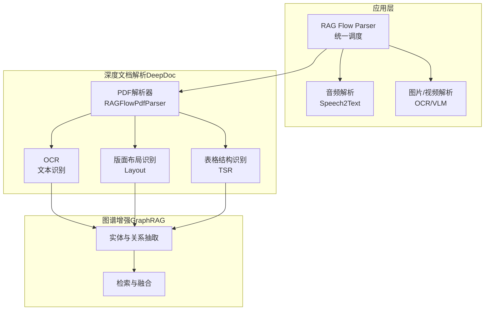
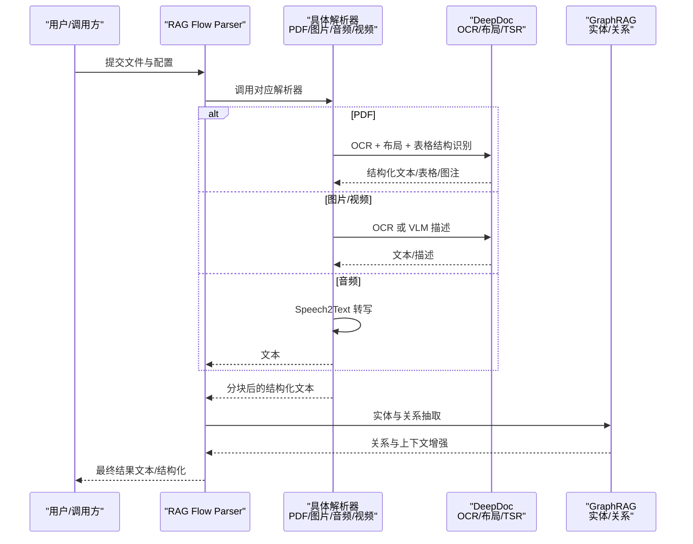
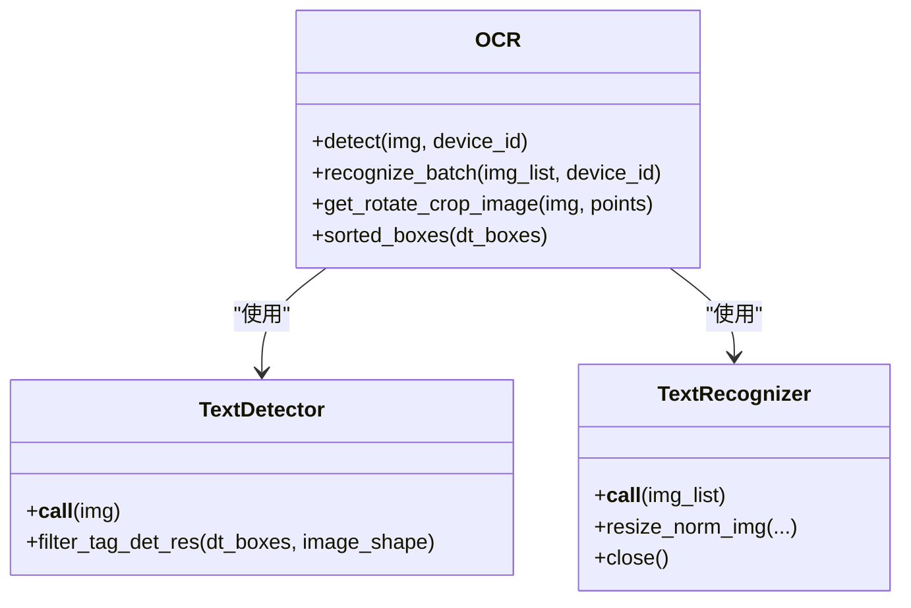
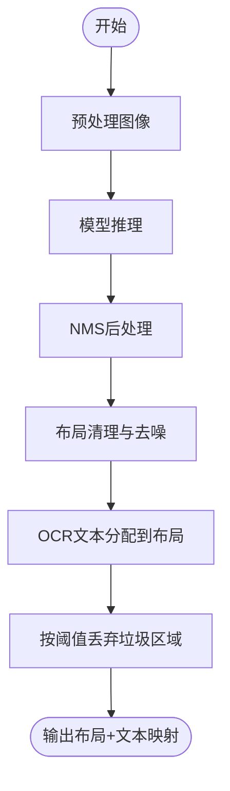
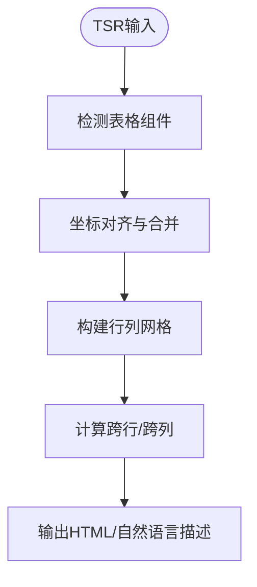
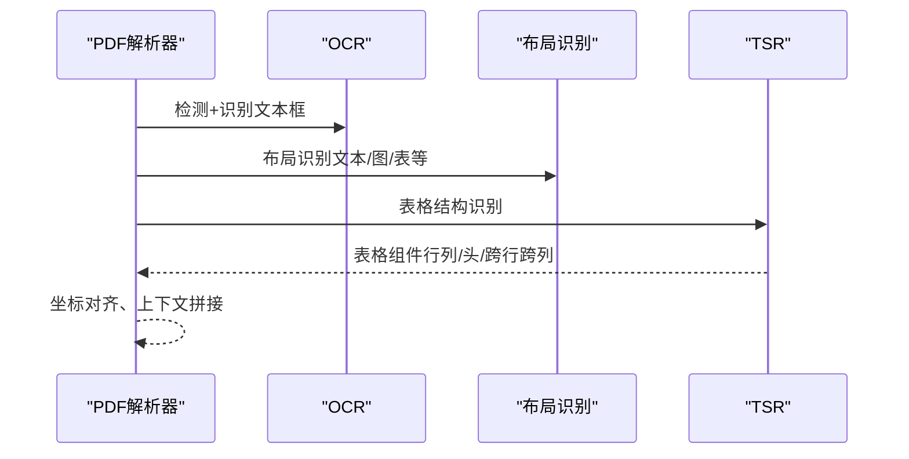
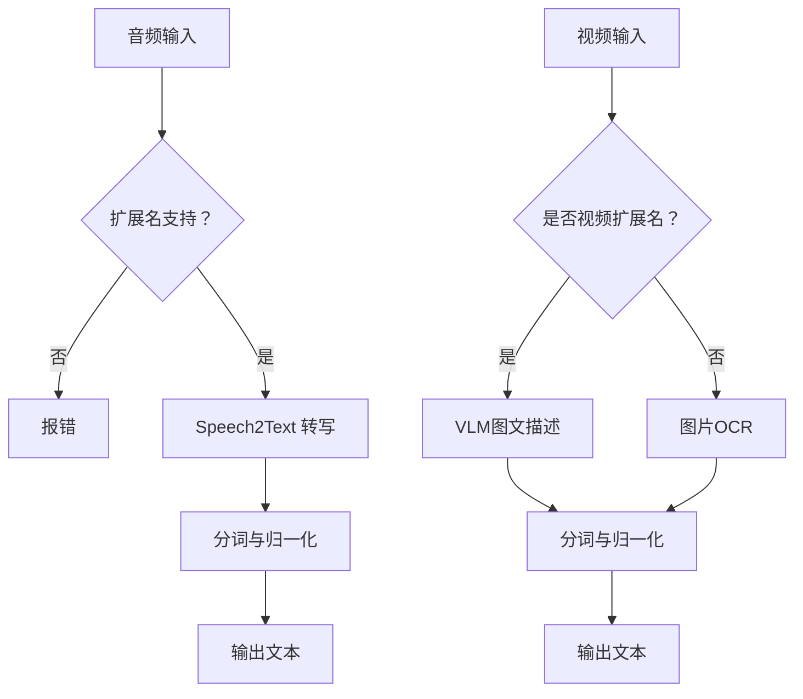
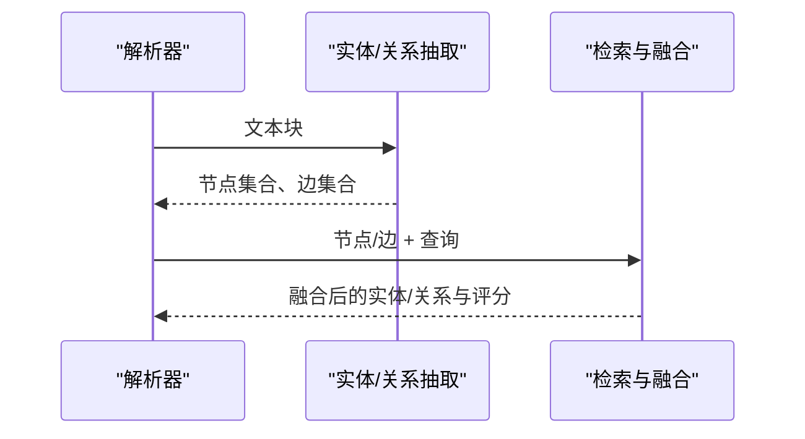
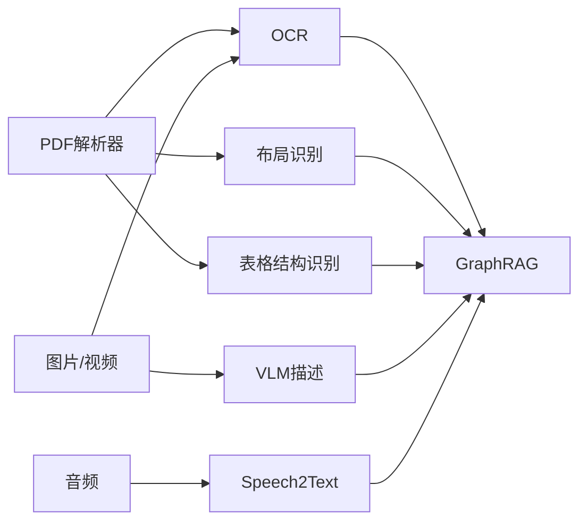

# 多模态文档处理

<cite>
**本文引用的文件**
- [deepdoc/README.md](file://deepdoc/README.md)
- [deepdoc/README_zh.md](file://deepdoc/README_zh.md)
- [deepdoc/vision/__init__.py](file://deepdoc/vision/__init__.py)
- [deepdoc/parser/__init__.py](file://deepdoc/parser/__init__.py)
- [deepdoc/parser/pdf_parser.py](file://deepdoc/parser/pdf_parser.py)
- [deepdoc/vision/ocr.py](file://deepdoc/vision/ocr.py)
- [deepdoc/vision/layout_recognizer.py](file://deepdoc/vision/layout_recognizer.py)
- [deepdoc/vision/table_structure_recognizer.py](file://deepdoc/vision/table_structure_recognizer.py)
- [rag/app/audio.py](file://rag/app/audio.py)
- [rag/app/picture.py](file://rag/app/picture.py)
- [rag/flow/parser/parser.py](file://rag/flow/parser/parser.py)
- [rag/graphrag/general/extractor.py](file://rag/graphrag/general/extractor.py)
- [rag/graphrag/search.py](file://rag/graphrag/search.py)
- [rag/graphrag/utils.py](file://rag/graphrag/utils.py)
</cite>

## 目录
1. [引言](#引言)
2. [项目结构](#项目结构)
3. [核心组件](#核心组件)
4. [架构总览](#架构总览)
5. [详细组件分析](#详细组件分析)
6. [依赖分析](#依赖分析)
7. [性能考虑](#性能考虑)
8. [故障排查指南](#故障排查指南)
9. [结论](#结论)
10. [附录](#附录)

## 引言
本技术文档面向多模态文档处理系统，聚焦RAGFlow在文本、图像、表格、音视频内容理解上的能力与实现细节。文档覆盖：
- 支持的文档格式与解析链路
- OCR识别系统（多语言、精度优化、性能调优）
- 深度理解能力（结构化信息抽取、关系识别、上下文保持）
- 使用示例与配置参数
- 性能优化建议、错误处理策略与质量评估方法

## 项目结构
RAGFlow的多模态处理能力由“深度文档解析（DeepDoc）+ 应用层解析器（RAG Flow Parser）+ 图谱增强（GraphRAG）”三层组成：
- DeepDoc：负责视觉理解（OCR、版面布局、表格结构识别）与PDF解析
- RAG Flow Parser：统一调度各类解析器（PDF、Word、Excel、PPT、Markdown、HTML、JSON、EPUB、图片、音视频等）
- GraphRAG：在解析后的文本上进行实体与关系抽取、检索与融合

**图示来源**
- [rag/flow/parser/parser.py:1045-1070](file://rag/flow/parser/parser.py#L1045-L1070)
- [deepdoc/parser/pdf_parser.py:56-110](file://deepdoc/parser/pdf_parser.py#L56-L110)
- [deepdoc/vision/ocr.py:542-758](file://deepdoc/vision/ocr.py#L542-L758)
- [deepdoc/vision/layout_recognizer.py:33-157](file://deepdoc/vision/layout_recognizer.py#L33-L157)
- [deepdoc/vision/table_structure_recognizer.py:30-111](file://deepdoc/vision/table_structure_recognizer.py#L30-L111)
- [rag/graphrag/general/extractor.py:184-204](file://rag/graphrag/general/extractor.py#L184-L204)
- [rag/graphrag/search.py:169-265](file://rag/graphrag/search.py#L169-L265)

**章节来源**
- [deepdoc/README.md:1-147](file://deepdoc/README.md#L1-L147)
- [deepdoc/README_zh.md:1-141](file://deepdoc/README_zh.md#L1-L141)
- [deepdoc/parser/__init__.py:17-41](file://deepdoc/parser/__init__.py#L17-L41)
- [deepdoc/vision/__init__.py:20-89](file://deepdoc/vision/__init__.py#L20-L89)

## 核心组件
- OCR识别系统：支持多语言文本识别，具备置信度过滤、批量推理、旋转校正等能力
- 版面布局识别：将页面划分为文本、标题、图、图注、表格、表格注释、页眉页脚、参考文献、公式等区域
- 表格结构识别（TSR）：识别行列、表头、跨列/跨行、投影行头等，重建为HTML或自然语言描述
- PDF解析器：结合OCR、布局与TSR，输出带位置信息的文本块、表格与图注
- 音视频解析：音频转写（Speech2Text）、视频图文描述（VLM）
- 图谱增强：基于抽取的实体与关系进行检索与融合，提升上下文一致性

**章节来源**
- [deepdoc/vision/ocr.py:542-758](file://deepdoc/vision/ocr.py#L542-L758)
- [deepdoc/vision/layout_recognizer.py:33-157](file://deepdoc/vision/layout_recognizer.py#L33-L157)
- [deepdoc/vision/table_structure_recognizer.py:30-111](file://deepdoc/vision/table_structure_recognizer.py#L30-L111)
- [deepdoc/parser/pdf_parser.py:56-110](file://deepdoc/parser/pdf_parser.py#L56-L110)
- [rag/app/audio.py:27-66](file://rag/app/audio.py#L27-L66)
- [rag/app/picture.py:37-96](file://rag/app/picture.py#L37-L96)
- [rag/graphrag/general/extractor.py:184-204](file://rag/graphrag/general/extractor.py#L184-L204)

## 架构总览
下图展示从文件输入到多模态理解输出的关键流程：

**图示来源**
- [rag/flow/parser/parser.py:1045-1070](file://rag/flow/parser/parser.py#L1045-L1070)
- [deepdoc/parser/pdf_parser.py:798-800](file://deepdoc/parser/pdf_parser.py#L798-L800)
- [deepdoc/vision/ocr.py:702-758](file://deepdoc/vision/ocr.py#L702-L758)
- [deepdoc/vision/layout_recognizer.py:63-157](file://deepdoc/vision/layout_recognizer.py#L63-L157)
- [deepdoc/vision/table_structure_recognizer.py:54-111](file://deepdoc/vision/table_structure_recognizer.py#L54-L111)
- [rag/app/picture.py:47-96](file://rag/app/picture.py#L47-L96)
- [rag/app/audio.py:27-66](file://rag/app/audio.py#L27-L66)
- [rag/graphrag/general/extractor.py:184-204](file://rag/graphrag/general/extractor.py#L184-L204)

## 详细组件分析

### OCR识别系统
- 多模型加载与缓存：按设备ID缓存ONNX会话，避免重复初始化
- 推理管线：预处理 → 探测（检测框）→ 识别（文本）→ 后处理（CTC解码、NMS等）
- 批量推理与排序：按宽高比排序，提高批内吞吐
- 置信度过滤与旋转校正：对低置信度文本丢弃；对检测框做旋转裁剪，提升识别稳定性
- 多设备并行：支持PARALLEL_DEVICES并行加载检测/识别器

**图示来源**
- [deepdoc/vision/ocr.py:420-540](file://deepdoc/vision/ocr.py#L420-L540)
- [deepdoc/vision/ocr.py:139-418](file://deepdoc/vision/ocr.py#L139-L418)
- [deepdoc/vision/ocr.py:542-758](file://deepdoc/vision/ocr.py#L542-L758)

**章节来源**
- [deepdoc/vision/ocr.py:71-136](file://deepdoc/vision/ocr.py#L71-L136)
- [deepdoc/vision/ocr.py:369-414](file://deepdoc/vision/ocr.py#L369-L414)
- [deepdoc/vision/ocr.py:669-758](file://deepdoc/vision/ocr.py#L669-L758)

### 版面布局识别（Layout Recognition）
- 标签体系：背景、文本、标题、图、图注、表格、表格注释、页眉、页脚、参考文献、公式
- 预处理与后处理：YOLOv10风格预处理与NMS后处理，支持Ascend/ONNX两种执行路径
- 布局清理与文本匹配：将OCR文本分配到对应布局类型，过滤垃圾区域（页眉页脚等）

**图示来源**
- [deepdoc/vision/layout_recognizer.py:159-161](file://deepdoc/vision/layout_recognizer.py#L159-L161)
- [deepdoc/vision/layout_recognizer.py:211-237](file://deepdoc/vision/layout_recognizer.py#L211-L237)
- [deepdoc/vision/layout_recognizer.py:338-456](file://deepdoc/vision/layout_recognizer.py#L338-L456)

**章节来源**
- [deepdoc/vision/layout_recognizer.py:33-157](file://deepdoc/vision/layout_recognizer.py#L33-L157)

### 表格结构识别（TSR）
- 标签体系：表格、列、行、列头、投影行头、跨列/跨行
- 坐标对齐与合并：对齐左右边界（行/头），对齐上下边界（列）
- 表格重建：生成HTML或自然语言描述，并标注跨行/跨列
- Ascend/ONNX双实现：可按环境变量切换

**图示来源**
- [deepdoc/vision/table_structure_recognizer.py:54-111](file://deepdoc/vision/table_structure_recognizer.py#L54-L111)
- [deepdoc/vision/table_structure_recognizer.py:151-350](file://deepdoc/vision/table_structure_recognizer.py#L151-L350)
- [deepdoc/vision/table_structure_recognizer.py:496-575](file://deepdoc/vision/table_structure_recognizer.py#L496-L575)

**章节来源**
- [deepdoc/vision/table_structure_recognizer.py:30-111](file://deepdoc/vision/table_structure_recognizer.py#L30-L111)

### PDF解析器（RAGFlowPdfParser）
- 统一入口：根据环境变量选择布局识别器（ONNX/Ascend）
- 流程：OCR检测 → OCR识别 → 布局识别 → 表格结构识别 → 上下文拼接与去噪
- 表格自动旋转：对旋转表格先评估最佳角度，再进行TSR与OCR，显著提升准确性

**图示来源**
- [deepdoc/parser/pdf_parser.py:56-110](file://deepdoc/parser/pdf_parser.py#L56-L110)
- [deepdoc/parser/pdf_parser.py:413-560](file://deepdoc/parser/pdf_parser.py#L413-L560)
- [deepdoc/parser/pdf_parser.py:560-706](file://deepdoc/parser/pdf_parser.py#L560-L706)

**章节来源**
- [deepdoc/parser/pdf_parser.py:322-411](file://deepdoc/parser/pdf_parser.py#L322-L411)
- [deepdoc/parser/pdf_parser.py:413-560](file://deepdoc/parser/pdf_parser.py#L413-L560)

### 音视频解析
- 音频：通过Speech2Text模型进行转写，支持多种扩展名
- 视频：优先使用VLM进行图文描述；若为视频则直接走VLM流程

**图示来源**
- [rag/app/audio.py:27-66](file://rag/app/audio.py#L27-L66)
- [rag/app/picture.py:37-96](file://rag/app/picture.py#L37-L96)

**章节来源**
- [rag/app/audio.py:27-66](file://rag/app/audio.py#L27-L66)
- [rag/app/picture.py:37-96](file://rag/app/picture.py#L37-L96)

### 图谱增强（GraphRAG）
- 实体与关系抽取：从解析文本中抽取节点与边，聚合与去重
- 检索与融合：基于关键词、类型、语义相似度与PageRank权重融合

**图示来源**
- [rag/graphrag/general/extractor.py:184-204](file://rag/graphrag/general/extractor.py#L184-L204)
- [rag/graphrag/search.py:169-265](file://rag/graphrag/search.py#L169-L265)
- [rag/graphrag/utils.py:231-262](file://rag/graphrag/utils.py#L231-L262)

**章节来源**
- [rag/graphrag/general/extractor.py:184-204](file://rag/graphrag/general/extractor.py#L184-L204)
- [rag/graphrag/search.py:169-265](file://rag/graphrag/search.py#L169-L265)
- [rag/graphrag/utils.py:231-262](file://rag/graphrag/utils.py#L231-L262)

## 依赖分析
- 组件耦合
  - PDF解析器强依赖OCR、布局识别与TSR
  - 图片/视频解析依赖OCR或VLM
  - 音频解析依赖Speech2Text
  - 图谱增强依赖抽取结果
- 外部依赖
  - ONNXRuntime、Ascend推理、HuggingFace模型仓库
  - XGBoost用于上下文拼接特征学习

**图示来源**
- [deepdoc/parser/pdf_parser.py:56-110](file://deepdoc/parser/pdf_parser.py#L56-L110)
- [deepdoc/vision/ocr.py:542-758](file://deepdoc/vision/ocr.py#L542-L758)
- [deepdoc/vision/layout_recognizer.py:33-157](file://deepdoc/vision/layout_recognizer.py#L33-L157)
- [deepdoc/vision/table_structure_recognizer.py:30-111](file://deepdoc/vision/table_structure_recognizer.py#L30-L111)
- [rag/app/picture.py:37-96](file://rag/app/picture.py#L37-L96)
- [rag/app/audio.py:27-66](file://rag/app/audio.py#L27-L66)

**章节来源**
- [deepdoc/parser/pdf_parser.py:56-110](file://deepdoc/parser/pdf_parser.py#L56-L110)
- [deepdoc/vision/__init__.py:20-89](file://deepdoc/vision/__init__.py#L20-L89)

## 性能考虑
- 并行与缓存
  - OCR模型按设备ID缓存，避免重复加载
  - 多设备并行（PARALLEL_DEVICES）可提升吞吐
- 批量推理
  - OCR识别按宽高比排序，减少padding，提升批内效率
- 设备选择
  - 优先使用GPU（CUDAExecutionProvider），可设置GPU内存上限与Arena收缩策略
- 表格自动旋转
  - 对旋转表格先评估最佳角度，再TSR与OCR，显著提升准确率与速度
- 模型路径
  - 支持Ascend与ONNX两种执行路径，按环境变量切换

**章节来源**
- [deepdoc/vision/ocr.py:71-136](file://deepdoc/vision/ocr.py#L71-L136)
- [deepdoc/vision/ocr.py:100-133](file://deepdoc/vision/ocr.py#L100-L133)
- [deepdoc/parser/pdf_parser.py:322-411](file://deepdoc/parser/pdf_parser.py#L322-L411)

## 故障排查指南
- HuggingFace模型下载失败
  - 设置镜像端点环境变量以加速下载
- OCR识别异常
  - 检查OCR_INTRA_OP_NUM_THREADS/INTER_OP_NUM_THREADS线程数
  - 检查GPU内存限制与Arena收缩策略
- 布局/TSR识别异常
  - 切换布局识别器类型（ONNX/Ascend）
  - 调整阈值与NMS参数
- 表格旋转导致识别不准
  - 确认TABLE_AUTO_ROTATE开关状态
  - 若禁用，手动预处理旋转
- 音频转写失败
  - 检查扩展名是否受支持
  - 确认Speech2Text模型可用性
- 图片/视频描述失败
  - 检查VLM模型可用性与输入尺寸限制

**章节来源**
- [deepdoc/README.md:40-44](file://deepdoc/README.md#L40-L44)
- [deepdoc/README_zh.md:43-45](file://deepdoc/README_zh.md#L43-L45)
- [deepdoc/vision/ocr.py:100-133](file://deepdoc/vision/ocr.py#L100-L133)
- [deepdoc/parser/pdf_parser.py:322-411](file://deepdoc/parser/pdf_parser.py#L322-L411)
- [rag/app/audio.py:38-41](file://rag/app/audio.py#L38-L41)
- [rag/app/picture.py:47-96](file://rag/app/picture.py#L47-L96)

## 结论
RAGFlow通过DeepDoc的OCR、布局与TSR能力，结合RAG Flow Parser的统一调度与GraphRAG的实体关系增强，实现了对多模态文档的高质量理解。系统支持多语言、多设备部署与灵活的执行路径选择，适用于复杂文档场景下的结构化信息抽取与上下文保持。

## 附录

### 支持的文档格式与解析器
- PDF：OCR + 布局 + 表格结构识别
- Word/Excel/PPT：专用解析器
- Markdown/HTML/JSON/EPUB：专用解析器
- 图片/视频：OCR或VLM描述
- 音频：Speech2Text转写

**章节来源**
- [deepdoc/parser/__init__.py:17-41](file://deepdoc/parser/__init__.py#L17-L41)
- [rag/flow/parser/parser.py:1045-1070](file://rag/flow/parser/parser.py#L1045-L1070)

### 使用示例与配置要点
- PDF解析
  - 选择布局识别器类型（ONNX/Ascend）
  - 控制表格自动旋转（TABLE_AUTO_ROTATE）
- OCR
  - 设置线程数与GPU内存限制
  - 过滤低置信度文本
- 图片/视频
  - 选择VLM模型与提示词
  - 控制上下文长度
- 音频
  - 选择Speech2Text模型
  - 指定扩展名白名单

**章节来源**
- [deepdoc/parser/pdf_parser.py:75-110](file://deepdoc/parser/pdf_parser.py#L75-L110)
- [deepdoc/vision/ocr.py:100-133](file://deepdoc/vision/ocr.py#L100-L133)
- [rag/app/picture.py:44-96](file://rag/app/picture.py#L44-L96)
- [rag/app/audio.py:38-51](file://rag/app/audio.py#L38-L51)