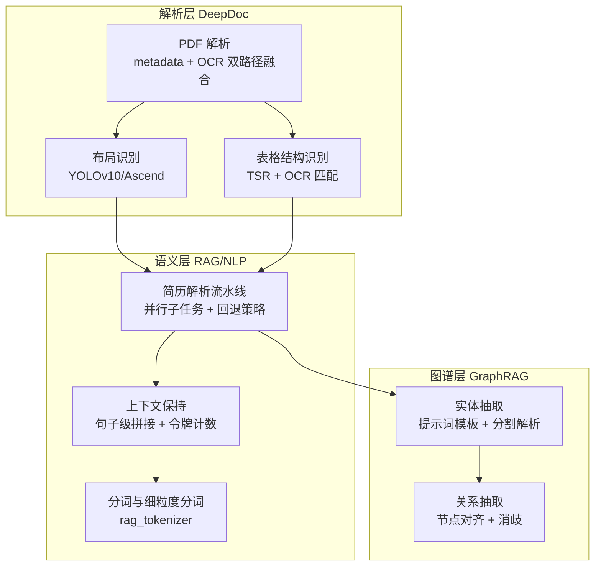
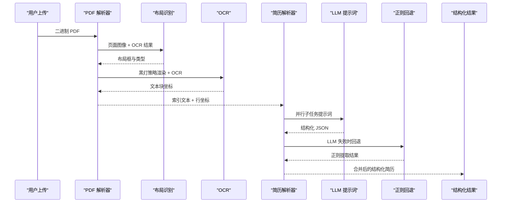
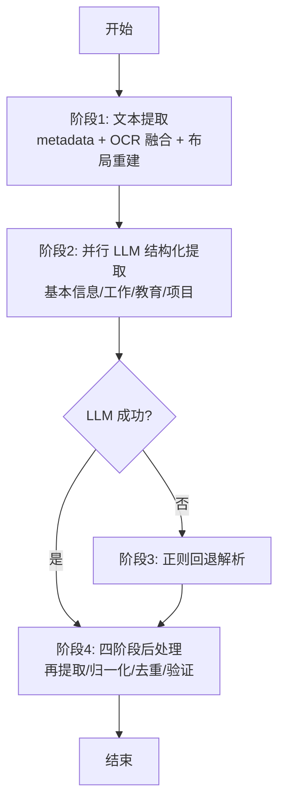
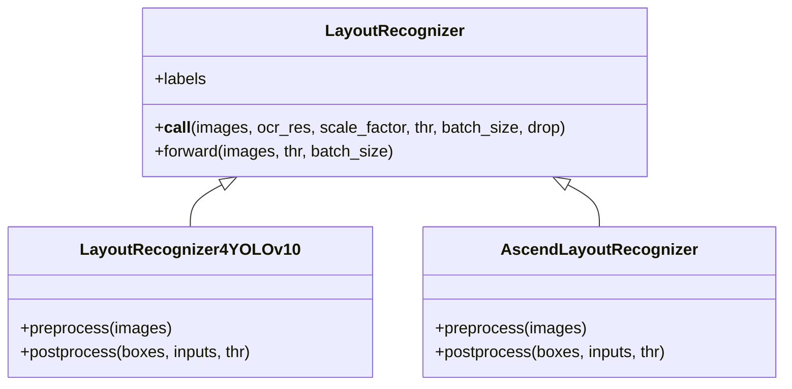
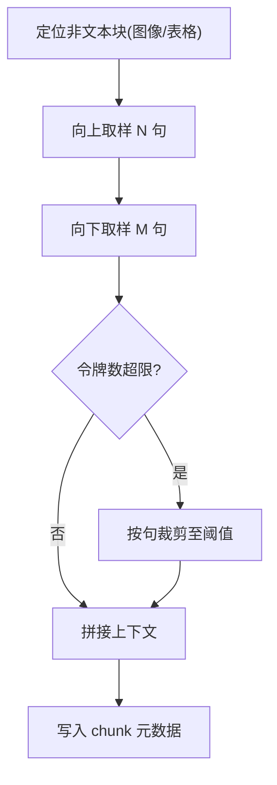
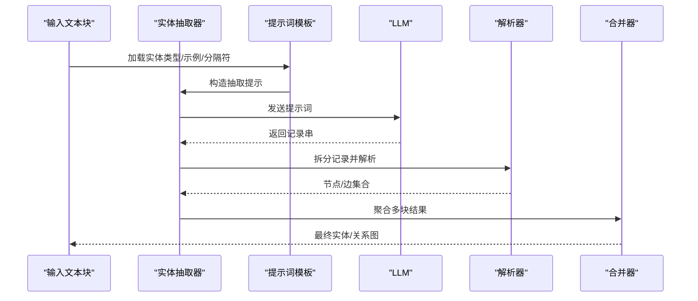
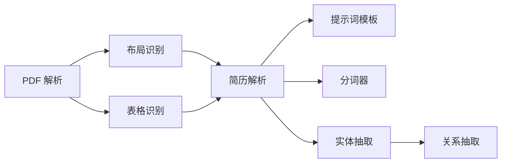

# 多模态理解能力

<cite>
**本文引用的文件**
- [rag/app/resume.py](file://rag/app/resume.py)
- [deepdoc/parser/resume/step_one.py](file://deepdoc/parser/resume/step_one.py)
- [deepdoc/parser/resume/step_two.py](file://deepdoc/parser/resume/step_two.py)
- [deepdoc/vision/layout_recognizer.py](file://deepdoc/vision/layout_recognizer.py)
- [deepdoc/parser/pdf_parser.py](file://deepdoc/parser/pdf_parser.py)
- [deepdoc/vision/t_recognizer.py](file://deepdoc/vision/t_recognizer.py)
- [rag/nlp/__init__.py](file://rag/nlp/__init__.py)
- [rag/graphrag/light/graph_extractor.py](file://rag/graphrag/light/graph_extractor.py)
- [rag/graphrag/entity_resolution.py](file://rag/graphrag/entity_resolution.py)
- [rag/prompts/resume_basic_info.md](file://rag/prompts/resume_basic_info.md)
- [rag/prompts/resume_work_exp.md](file://rag/prompts/resume_work_exp.md)
- [rag/prompts/resume_education.md](file://rag/prompts/resume_education.md)
- [api/db/services/evaluation_service.py](file://api/db/services/evaluation_service.py)
</cite>

## 目录
1. [简介](#简介)
2. [项目结构](#项目结构)
3. [核心组件](#核心组件)
4. [架构总览](#架构总览)
5. [详细组件分析](#详细组件分析)
6. [依赖分析](#依赖分析)
7. [性能考虑](#性能考虑)
8. [故障排查指南](#故障排查指南)
9. [结论](#结论)
10. [附录](#附录)

## 简介
本技术文档聚焦 RAGFlow 的多模态理解能力，覆盖文本、图像、表格等多模态内容的综合理解与结构化抽取。重点包括：
- 简历解析系统：个人信息提取、教育背景识别、工作经验分析、技能标签生成等端到端流程。
- 结构化信息抽取：实体识别、关系抽取、属性提取等核心算法与提示词模板。
- 上下文保持机制：跨模态信息融合、语义一致性保证、上下文连贯性维护。
- 自定义实体识别：行业术语、公司名称、地理位置等专业词汇的识别能力。
- 使用示例与配置参数：如何处理复杂多模态文档。
- 性能优化建议、准确率评估方法与扩展开发指南。

## 项目结构
RAGFlow 的多模态理解由“解析层（DeepDoc）+ 语义层（RAG/NLP）+ 图谱层（GraphRAG）”三层协同实现：
- 解析层：PDF 文本融合、布局识别、OCR、表格结构识别与 HTML 导出。
- 语义层：简历解析流水线、字段映射、正则回退策略、上下文拼接。
- 图谱层：实体与关系抽取、实体消歧与合并。

**图表来源**
- [deepdoc/parser/pdf_parser.py:413-438](file://deepdoc/parser/pdf_parser.py#L413-L438)
- [deepdoc/vision/layout_recognizer.py:63-96](file://deepdoc/vision/layout_recognizer.py#L63-L96)
- [deepdoc/vision/t_recognizer.py:36-58](file://deepdoc/vision/t_recognizer.py#L36-L58)
- [rag/app/resume.py:2056-2095](file://rag/app/resume.py#L2056-L2095)
- [rag/nlp/__init__.py:1362-1398](file://rag/nlp/__init__.py#L1362-L1398)
- [rag/graphrag/light/graph_extractor.py:49-73](file://rag/graphrag/light/graph_extractor.py#L49-L73)

**章节来源**
- [rag/app/resume.py:17-30](file://rag/app/resume.py#L17-L30)
- [deepdoc/parser/pdf_parser.py:413-438](file://deepdoc/parser/pdf_parser.py#L413-L438)
- [deepdoc/vision/layout_recognizer.py:33-96](file://deepdoc/vision/layout_recognizer.py#L33-L96)
- [deepdoc/vision/t_recognizer.py:36-58](file://deepdoc/vision/t_recognizer.py#L36-L58)
- [rag/nlp/__init__.py:1362-1398](file://rag/nlp/__init__.py#L1362-L1398)
- [rag/graphrag/light/graph_extractor.py:49-73](file://rag/graphrag/light/graph_extractor.py#L49-L73)

## 核心组件
- 简历解析流水线：基于索引行号的并行 LLM 提取、正则回退、四阶段后处理。
- 多模态文本融合：metadata + OCR 双路径提取与去重，布局感知重建。
- 表格结构识别：自动旋转校正 + OCR 匹配 + HTML 输出。
- 上下文保持：按句切分、上下文拼接、令牌计数控制。
- 结构化抽取：提示词模板驱动的实体/关系抽取与实体消歧。

**章节来源**
- [rag/app/resume.py:1268-1473](file://rag/app/resume.py#L1268-L1473)
- [rag/app/resume.py:2056-2095](file://rag/app/resume.py#L2056-L2095)
- [deepdoc/parser/pdf_parser.py:413-438](file://deepdoc/parser/pdf_parser.py#L413-L438)
- [deepdoc/vision/layout_recognizer.py:63-96](file://deepdoc/vision/layout_recognizer.py#L63-L96)
- [rag/nlp/__init__.py:1362-1398](file://rag/nlp/__init__.py#L1362-L1398)
- [rag/graphrag/light/graph_extractor.py:49-73](file://rag/graphrag/light/graph_extractor.py#L49-L73)

## 架构总览
RAGFlow 的多模态理解以“解析 → 结构化 → 图谱”为主线，结合提示词模板与并行子任务，确保高鲁棒性与高召回。

**图表来源**
- [rag/app/resume.py:2056-2095](file://rag/app/resume.py#L2056-L2095)
- [deepdoc/parser/pdf_parser.py:511-574](file://deepdoc/parser/pdf_parser.py#L511-L574)
- [deepdoc/vision/layout_recognizer.py:63-96](file://deepdoc/vision/layout_recognizer.py#L63-L96)
- [rag/prompts/resume_basic_info.md:1-39](file://rag/prompts/resume_basic_info.md#L1-L39)
- [rag/prompts/resume_work_exp.md:1-39](file://rag/prompts/resume_work_exp.md#L1-L39)
- [rag/prompts/resume_education.md:1-31](file://rag/prompts/resume_education.md#L1-L31)

## 详细组件分析

### 组件一：简历解析流水线（并行子任务 + 正则回退）
- 流程阶段：
  1) 文本提取：metadata + OCR 双路径融合，布局感知重建，行号索引。
  2) 并行 LLM 结构化提取：基本信息、工作经验、教育背景、项目经验。
  3) 正则回退：当 LLM 失败时，基于规则提取关键字段。
  4) 四阶段后处理：源文本再提取、领域归一化、上下文去重、源文本验证。
- 关键设计：
  - 索引指针机制：LLM 返回行号范围而非全文，降低幻觉。
  - 并行执行：四个子任务并发，提升吞吐。
  - 字段映射：中英双语字段映射，兼容不同语言。
  - 回退策略：JSON 修复、长随机字符串过滤、空白清洗。

**图表来源**
- [rag/app/resume.py:2056-2095](file://rag/app/resume.py#L2056-L2095)
- [rag/app/resume.py:1268-1473](file://rag/app/resume.py#L1268-L1473)

**章节来源**
- [rag/app/resume.py:1268-1473](file://rag/app/resume.py#L1268-L1473)
- [rag/app/resume.py:2056-2095](file://rag/app/resume.py#L2056-L2095)
- [rag/app/resume.py:1662-1697](file://rag/app/resume.py#L1662-L1697)

### 组件二：多模态文本融合与布局重建
- PDF 文本融合：
  - metadata 提取：白名单策略过滤装饰噪声字符，提取单词级文本块并聚合为行。
  - OCR 提取：采用“黑灯策略”，先渲染页面图像，再对已提取区域进行遮罩，仅识别缺失内容，避免重复。
  - 融合策略：直接合并有效 metadata 与 OCR 文本块，无需 IoU 去重。
- 布局识别：
  - YOLOv10/Ascend 布局检测，输出布局类型与边界框，再与 OCR 文本匹配标注。
  - 布局清理：去除页眉、页脚、参考文献等垃圾布局，保留正文与表格、图片等关键区域。
- 表格结构识别：
  - 自动旋转校正：评估最佳角度，旋转后进行 TSR，再重新 OCR，最后将 OCR 结果与单元格坐标匹配。
  - HTML 输出：生成表格 HTML，便于后续结构化处理。

**图表来源**
- [deepdoc/vision/layout_recognizer.py:33-96](file://deepdoc/vision/layout_recognizer.py#L33-L96)
- [deepdoc/vision/layout_recognizer.py:163-238](file://deepdoc/vision/layout_recognizer.py#L163-L238)
- [deepdoc/vision/layout_recognizer.py:240-337](file://deepdoc/vision/layout_recognizer.py#L240-L337)

**章节来源**
- [deepdoc/parser/pdf_parser.py:413-438](file://deepdoc/parser/pdf_parser.py#L413-L438)
- [deepdoc/vision/layout_recognizer.py:63-96](file://deepdoc/vision/layout_recognizer.py#L63-L96)
- [deepdoc/vision/t_recognizer.py:36-58](file://deepdoc/vision/t_recognizer.py#L36-L58)

### 组件三：上下文保持与语义一致性
- 上下文拼接：
  - 对图像/表格等非文本块，按句切分其前后文本上下文，限制令牌数量，保证检索一致性。
  - 使用标点与换行分割句子，避免截断关键信息。
- 语义一致性：
  - 通过 rag_tokenizer 进行分词与细粒度分词，统一字段表示，减少歧义。
  - 在简历解析中，冗余写入关键身份字段（姓名、电话、邮箱、性别、最高学历、工作年限），便于检索后快速识别候选人身份。

**图表来源**
- [rag/nlp/__init__.py:1362-1398](file://rag/nlp/__init__.py#L1362-L1398)
- [rag/app/resume.py:2098-2148](file://rag/app/resume.py#L2098-L2148)

**章节来源**
- [rag/nlp/__init__.py:1362-1398](file://rag/nlp/__init__.py#L1362-L1398)
- [rag/app/resume.py:2098-2148](file://rag/app/resume.py#L2098-L2148)

### 组件四：结构化信息抽取（实体/关系/属性）
- 实体抽取：
  - 使用提示词模板定义实体类型、分隔符、示例与语言，动态构造抽取提示。
  - 将 LLM 输出按记录分隔符拆分，解析为节点集合。
- 关系抽取：
  - 从记录中提取三元组（源实体、目标实体、关系描述），形成边集合。
  - 支持回调进度反馈与取消处理。
- 实体消歧：
  - 针对候选实体对构造判断问题，结合领域知识进行二分类，消除同名异义。

**图表来源**
- [rag/graphrag/light/graph_extractor.py:49-73](file://rag/graphrag/light/graph_extractor.py#L49-L73)
- [rag/graphrag/light/graph_extractor.py:138-152](file://rag/graphrag/light/graph_extractor.py#L138-L152)
- [rag/graphrag/entity_resolution.py:197-212](file://rag/graphrag/entity_resolution.py#L197-L212)

**章节来源**
- [rag/graphrag/light/graph_extractor.py:49-73](file://rag/graphrag/light/graph_extractor.py#L49-L73)
- [rag/graphrag/light/graph_extractor.py:138-152](file://rag/graphrag/light/graph_extractor.py#L138-L152)
- [rag/graphrag/entity_resolution.py:197-212](file://rag/graphrag/entity_resolution.py#L197-L212)

### 组件五：自定义实体识别与领域增强
- 领域词典与归一化：
  - 学校、学位、公司等实体库用于教育背景与工作经历的标准化与标签生成。
  - 公司名称归一化与标签（如“好公司/曾”）增强，便于后续检索与筛选。
- 字段映射与关键词抽取：
  - 基于 rag_tokenizer 的分词与细粒度分词，生成关键词与短序列向量，提高检索精度。
  - 中英双语字段映射，适配国际化场景。

**章节来源**
- [deepdoc/parser/resume/step_two.py:100-225](file://deepdoc/parser/resume/step_two.py#L100-L225)
- [deepdoc/parser/resume/step_two.py:354-374](file://deepdoc/parser/resume/step_two.py#L354-L374)
- [deepdoc/parser/resume/step_one.py:18-18](file://deepdoc/parser/resume/step_one.py#L18-L18)
- [rag/app/resume.py:95-176](file://rag/app/resume.py#L95-L176)

## 依赖分析
- 组件耦合：
  - 解析层与语义层解耦：解析层仅负责结构化文本与布局信息，语义层负责结构化抽取与上下文保持。
  - 图谱层与语义层弱耦合：通过统一的节点/边接口对接，支持多种提示词模板。
- 外部依赖：
  - 布局识别模型（YOLOv10/Ascend）、OCR 引擎、LLM 接口、提示词模板资源。
- 潜在环依赖：
  - 当前模块间为单向数据流，未见循环依赖风险。

**图表来源**
- [deepdoc/parser/pdf_parser.py:511-574](file://deepdoc/parser/pdf_parser.py#L511-L574)
- [deepdoc/vision/layout_recognizer.py:63-96](file://deepdoc/vision/layout_recognizer.py#L63-L96)
- [deepdoc/vision/t_recognizer.py:36-58](file://deepdoc/vision/t_recognizer.py#L36-L58)
- [rag/app/resume.py:2056-2095](file://rag/app/resume.py#L2056-L2095)
- [rag/graphrag/light/graph_extractor.py:49-73](file://rag/graphrag/light/graph_extractor.py#L49-L73)

**章节来源**
- [rag/app/resume.py:17-30](file://rag/app/resume.py#L17-L30)
- [deepdoc/parser/pdf_parser.py:413-438](file://deepdoc/parser/pdf_parser.py#L413-L438)
- [deepdoc/vision/layout_recognizer.py:33-96](file://deepdoc/vision/layout_recognizer.py#L33-L96)
- [rag/graphrag/light/graph_extractor.py:49-73](file://rag/graphrag/light/graph_extractor.py#L49-L73)

## 性能考虑
- 并行化与缓存：
  - 简历解析的四个子任务并发执行，显著缩短端到端时延。
  - 布局识别与 OCR 可按批处理，合理设置 batch_size 与阈值，平衡吞吐与延迟。
- 上下文控制：
  - 通过令牌计数限制上下文长度，避免超出 LLM 上下文窗口。
  - 句子级拼接减少无关噪声，提升检索质量。
- 模型选择与部署：
  - 布局识别可选用 TensorRT DLA 或 Ascend 加速推理，降低时延。
  - 表格识别的自动旋转与 OCR 匹配需权衡精度与速度，必要时关闭自动旋转以提速。

[本节为通用指导，无需具体文件分析]

## 故障排查指南
- LLM 结构化失败：
  - 触发正则回退策略，检查正则规则与字段映射是否覆盖常见格式。
  - 若仍失败，检查提示词模板与语言参数是否正确。
- 布局识别异常：
  - 确认模型加载成功与阈值设置合理；必要时切换 Ascend 或 TensorRT 后端。
  - 检查页眉/页脚/参考文献是否被错误识别为正文。
- 表格识别不准确：
  - 检查自动旋转逻辑与 OCR 匹配阈值；尝试手动指定旋转角度。
  - 确保遮罩策略正确，避免重复识别。
- 评估指标：
  - 使用评测服务计算精确率、召回率、F1、命中率与 MRR，汇总平均指标辅助调优。

**章节来源**
- [rag/app/resume.py:2086-2091](file://rag/app/resume.py#L2086-L2091)
- [api/db/services/evaluation_service.py:525-569](file://api/db/services/evaluation_service.py#L525-L569)

## 结论
RAGFlow 的多模态理解以“解析层 + 语义层 + 图谱层”的分层架构实现高鲁棒性与高召回。通过并行子任务、布局感知重建、表格结构识别与上下文保持机制，系统能够稳定处理复杂简历与多模态文档。结合提示词模板与实体消歧，进一步提升结构化抽取的准确性与可解释性。建议在生产环境中结合硬件加速与合理的批处理策略，持续优化端到端性能。

[本节为总结，无需具体文件分析]

## 附录

### 使用示例与配置参数
- 简历解析入口：
  - 输入：文件名、二进制内容、租户 ID、语言（中文/英文）。
  - 输出：结构化简历字典、原始行列表、行坐标列表。
- 配置要点：
  - 语言参数：决定提示词模板与字段映射版本。
  - 上下文大小：控制图像/表格上下文拼接的句子数量。
  - 提示词模板：根据业务需求调整实体类型、分隔符与示例。

**章节来源**
- [rag/app/resume.py:2056-2095](file://rag/app/resume.py#L2056-L2095)
- [rag/prompts/resume_basic_info.md:1-39](file://rag/prompts/resume_basic_info.md#L1-L39)
- [rag/prompts/resume_work_exp.md:1-39](file://rag/prompts/resume_work_exp.md#L1-L39)
- [rag/prompts/resume_education.md:1-31](file://rag/prompts/resume_education.md#L1-L31)