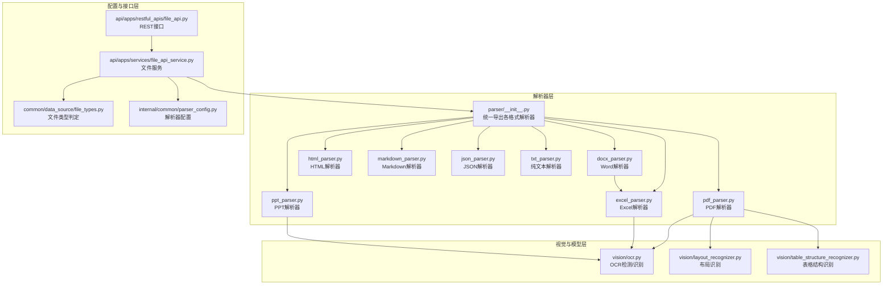
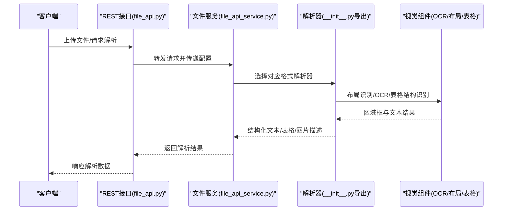
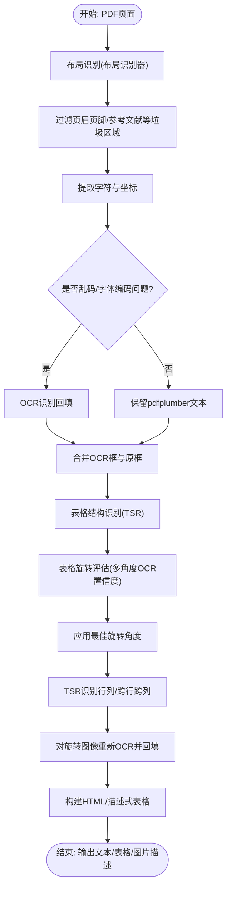
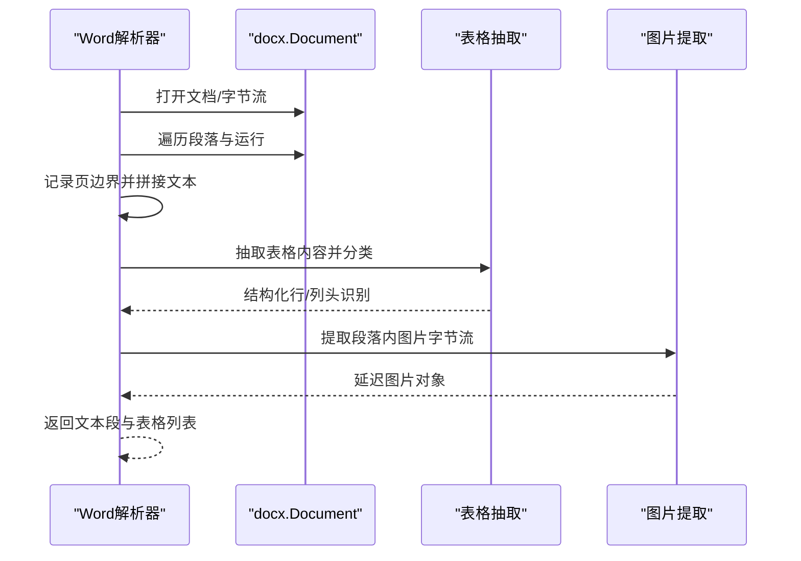
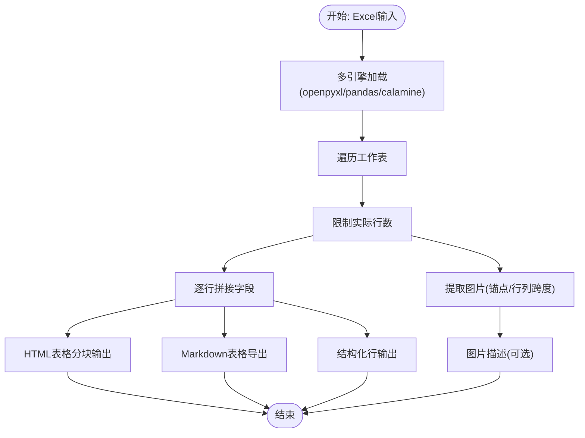
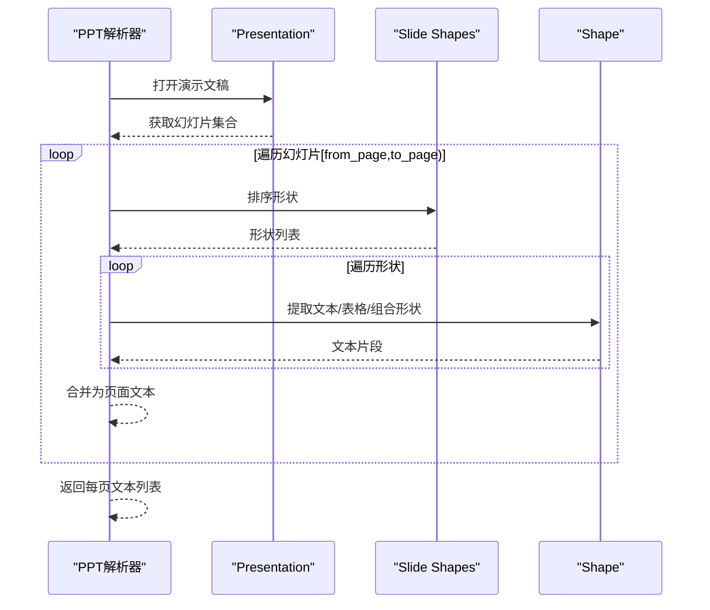
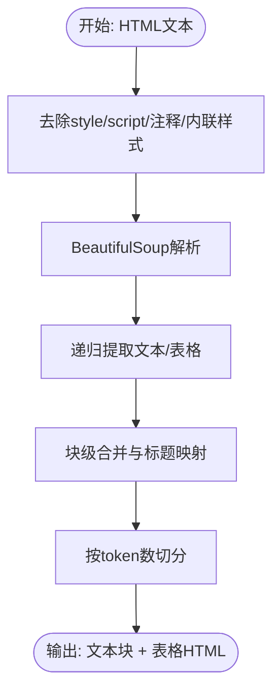
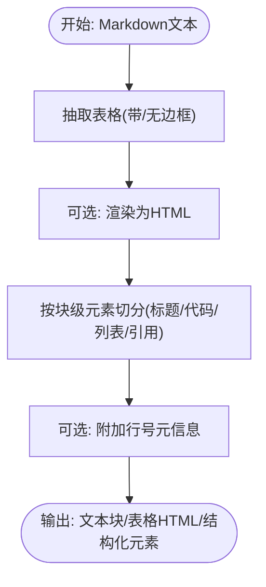
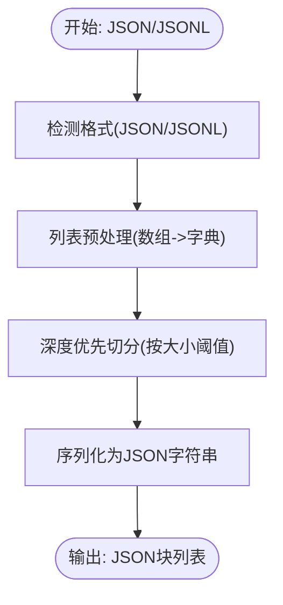
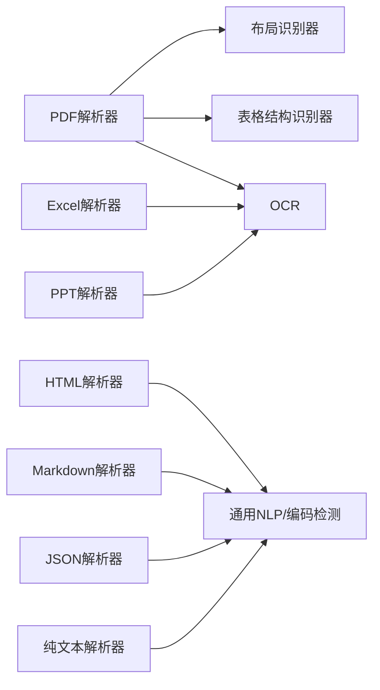

# 文档格式支持

<cite>
**本文引用的文件**
- [deepdoc/parser/__init__.py](file://deepdoc/parser/__init__.py)
- [deepdoc/parser/pdf_parser.py](file://deepdoc/parser/pdf_parser.py)
- [deepdoc/parser/docx_parser.py](file://deepdoc/parser/docx_parser.py)
- [deepdoc/parser/excel_parser.py](file://deepdoc/parser/excel_parser.py)
- [deepdoc/parser/ppt_parser.py](file://deepdoc/parser/ppt_parser.py)
- [deepdoc/parser/html_parser.py](file://deepdoc/parser/html_parser.py)
- [deepdoc/parser/markdown_parser.py](file://deepdoc/parser/markdown_parser.py)
- [deepdoc/parser/json_parser.py](file://deepdoc/parser/json_parser.py)
- [deepdoc/parser/txt_parser.py](file://deepdoc/parser/txt_parser.py)
- [deepdoc/vision/layout_recognizer.py](file://deepdoc/vision/layout_recognizer.py)
- [deepdoc/vision/table_structure_recognizer.py](file://deepdoc/vision/table_structure_recognizer.py)
- [deepdoc/vision/ocr.py](file://deepdoc/vision/ocr.py)
- [common/data_source/file_types.py](file://common/data_source/file_types.py)
- [common/parser_config.py](file://internal/common/parser_config.py)
- [api/apps/services/file_api_service.py](file://api/apps/services/file_api_service.py)
- [api/apps/restful_apis/file_api.py](file://api/apps/restful_apis/file_api.py)
</cite>

## 目录
1. [简介](#简介)
2. [项目结构](#项目结构)
3. [核心组件](#核心组件)
4. [架构总览](#架构总览)
5. [详细组件分析](#详细组件分析)
6. [依赖关系分析](#依赖关系分析)
7. [性能考量](#性能考量)
8. [故障排查指南](#故障排查指南)
9. [结论](#结论)
10. [附录](#附录)

## 简介
本技术文档面向RAGFlow的文档格式支持体系，系统性阐述其对多种文档格式的解析与处理能力，覆盖PDF、Word、Excel、PowerPoint、HTML、Markdown、JSON、纯文本等。文档重点解析以下核心技术：
- PDF：文本提取、图像识别、表格结构识别、布局分析、旋转校正与OCR回填
- Word：样式保留、图片提取、表格内容抽取与分类
- Excel：多工作表支持、CSV自动识别、图片提取、HTML/Markdown导出
- PowerPoint：幻灯片内容提取、列表与表格处理
- 结构化文档：HTML/Markdown/JSON的块级元素与表格切分、JSON行/列切分
- 视觉与模型：ONNX/Ascend推理、布局识别、表格结构识别、OCR流水线

## 项目结构
RAGFlow的文档解析能力主要集中在deepdoc/parser与deepdoc/vision两个子模块，并通过API层与服务层对外提供能力。

图示来源
- [deepdoc/parser/__init__.py:17-41](file://deepdoc/parser/__init__.py#L17-L41)
- [deepdoc/parser/pdf_parser.py:56-110](file://deepdoc/parser/pdf_parser.py#L56-L110)
- [deepdoc/parser/docx_parser.py:31-184](file://deepdoc/parser/docx_parser.py#L31-L184)
- [deepdoc/parser/excel_parser.py:29-317](file://deepdoc/parser/excel_parser.py#L29-L317)
- [deepdoc/parser/ppt_parser.py:22-105](file://deepdoc/parser/ppt_parser.py#L22-L105)
- [deepdoc/parser/html_parser.py:39-213](file://deepdoc/parser/html_parser.py#L39-L213)
- [deepdoc/parser/markdown_parser.py:23-321](file://deepdoc/parser/markdown_parser.py#L23-L321)
- [deepdoc/parser/json_parser.py:27-179](file://deepdoc/parser/json_parser.py#L27-L179)
- [deepdoc/parser/txt_parser.py:23-67](file://deepdoc/parser/txt_parser.py#L23-L67)
- [deepdoc/vision/ocr.py:542-757](file://deepdoc/vision/ocr.py#L542-L757)
- [deepdoc/vision/layout_recognizer.py:33-157](file://deepdoc/vision/layout_recognizer.py#L33-L157)
- [deepdoc/vision/table_structure_recognizer.py:30-111](file://deepdoc/vision/table_structure_recognizer.py#L30-L111)
- [common/data_source/file_types.py](file://common/data_source/file_types.py)
- [internal/common/parser_config.py](file://internal/common/parser_config.py)
- [api/apps/services/file_api_service.py](file://api/apps/services/file_api_service.py)
- [api/apps/restful_apis/file_api.py](file://api/apps/restful_apis/file_api.py)

章节来源
- [deepdoc/parser/__init__.py:17-41](file://deepdoc/parser/__init__.py#L17-L41)

## 核心组件
- 统一入口：解析器在初始化中集中导出各类格式解析器，便于上层按需调用。
- 视觉识别：OCR负责文字检测与识别；布局识别负责页面区域分类；表格结构识别负责表格单元与行列关系重建。
- 文件类型判定：依据扩展名与魔数进行格式分流，确保正确解析器被选择。
- 解析器配置：支持并发设备数、模型加载路径、阈值等参数，影响性能与精度。

章节来源
- [deepdoc/parser/__init__.py:17-41](file://deepdoc/parser/__init__.py#L17-L41)
- [deepdoc/vision/ocr.py:542-757](file://deepdoc/vision/ocr.py#L542-L757)
- [deepdoc/vision/layout_recognizer.py:33-157](file://deepdoc/vision/layout_recognizer.py#L33-L157)
- [deepdoc/vision/table_structure_recognizer.py:30-111](file://deepdoc/vision/table_structure_recognizer.py#L30-L111)
- [common/data_source/file_types.py](file://common/data_source/file_types.py)
- [internal/common/parser_config.py](file://internal/common/parser_config.py)

## 架构总览
下图展示从API到解析器与视觉模型的整体调用链路，以及PDF解析中的布局识别、表格识别与OCR回填流程。

图示来源
- [api/apps/restful_apis/file_api.py](file://api/apps/restful_apis/file_api.py)
- [api/apps/services/file_api_service.py](file://api/apps/services/file_api_service.py)
- [deepdoc/parser/__init__.py:17-41](file://deepdoc/parser/__init__.py#L17-L41)
- [deepdoc/vision/ocr.py:542-757](file://deepdoc/vision/ocr.py#L542-L757)
- [deepdoc/vision/layout_recognizer.py:63-157](file://deepdoc/vision/layout_recognizer.py#L63-L157)
- [deepdoc/vision/table_structure_recognizer.py:54-111](file://deepdoc/vision/table_structure_recognizer.py#L54-L111)

## 详细组件分析

### PDF文档解析
PDF解析器具备以下能力：
- 文本提取：结合pdfplumber与pypdf读取字符与坐标，过滤不可映射字符与字体编码问题导致的乱码。
- 图像识别：对表格区域进行旋转评估，选择最佳角度以提升OCR识别准确率。
- 表格结构识别：使用表格结构识别器提取行列与跨行跨列信息，重建HTML或描述式表格。
- 布局分析：通过布局识别器对页面进行标题、正文、图表、表格等区域分类，剔除页眉页脚等垃圾区域。
- 旋转校正与OCR回填：对旋转后的表格图像重新OCR，并将结果映射回原始坐标空间。

图示来源
- [deepdoc/parser/pdf_parser.py:56-110](file://deepdoc/parser/pdf_parser.py#L56-L110)
- [deepdoc/parser/pdf_parser.py:322-411](file://deepdoc/parser/pdf_parser.py#L322-L411)
- [deepdoc/parser/pdf_parser.py:413-560](file://deepdoc/parser/pdf_parser.py#L413-L560)
- [deepdoc/parser/pdf_parser.py:561-706](file://deepdoc/parser/pdf_parser.py#L561-L706)
- [deepdoc/vision/layout_recognizer.py:63-157](file://deepdoc/vision/layout_recognizer.py#L63-L157)
- [deepdoc/vision/table_structure_recognizer.py:54-111](file://deepdoc/vision/table_structure_recognizer.py#L54-L111)
- [deepdoc/vision/ocr.py:542-757](file://deepdoc/vision/ocr.py#L542-L757)

章节来源
- [deepdoc/parser/pdf_parser.py:56-110](file://deepdoc/parser/pdf_parser.py#L56-L110)
- [deepdoc/parser/pdf_parser.py:322-411](file://deepdoc/parser/pdf_parser.py#L322-L411)
- [deepdoc/parser/pdf_parser.py:413-560](file://deepdoc/parser/pdf_parser.py#L413-L560)
- [deepdoc/parser/pdf_parser.py:561-706](file://deepdoc/parser/pdf_parser.py#L561-L706)
- [deepdoc/vision/layout_recognizer.py:33-157](file://deepdoc/vision/layout_recognizer.py#L33-L157)
- [deepdoc/vision/table_structure_recognizer.py:30-111](file://deepdoc/vision/table_structure_recognizer.py#L30-L111)
- [deepdoc/vision/ocr.py:542-757](file://deepdoc/vision/ocr.py#L542-L757)

使用示例与配置要点
- 配置项
  - 并行设备数：PARALLEL_DEVICES，用于多GPU/多实例并行推理
  - 布局识别器类型：LAYOUT_RECOGNIZER_TYPE（onnx/ascend）
  - 表格结构识别器类型：TABLE_STRUCTURE_RECOGNIZER_TYPE（onnx/ascend）
  - OCR线程与显存：OCR_INTRA_OP_NUM_THREADS、OCR_INTER_OP_NUM_THREADS、OCR_GPU_MEM_LIMIT_MB、OCR_ARENA_EXTEND_STRATEGY、OCR_GPUMEM_ARENA_SHRINKAGE
- 使用示例
  - 通过API上传PDF，后端自动选择PDF解析器，返回文本、表格与图片描述

章节来源
- [internal/common/parser_config.py](file://internal/common/parser_config.py)
- [api/apps/services/file_api_service.py](file://api/apps/services/file_api_service.py)
- [api/apps/restful_apis/file_api.py](file://api/apps/restful_apis/file_api.py)

### Word文档处理
Word解析器支持：
- 段落与运行（runs）解析，按页边界拼接文本，保留段落样式名称
- 表格内容抽取：基于openpyxl读取表格，进行类型判断与头部识别，输出结构化行
- 图片提取：从docx内部关系中提取图片字节流，封装为延迟加载对象，避免内存峰值

图示来源
- [deepdoc/parser/docx_parser.py:31-184](file://deepdoc/parser/docx_parser.py#L31-L184)

章节来源
- [deepdoc/parser/docx_parser.py:31-184](file://deepdoc/parser/docx_parser.py#L31-L184)

使用示例与配置要点
- 配置项：from_page/to_page控制解析范围
- 使用示例：传入本地路径或字节流，返回段落文本与表格行列表

### Excel表格处理
Excel解析器支持：
- 多引擎容错：优先openpyxl，失败时尝试pandas默认引擎与calamine，最后回退CSV转Excel
- 多工作表：遍历所有工作表，限制实际行数以避免超大数据集
- 图片提取：从工作表锚点提取图片，标注行列跨度与位置
- 导出能力：HTML表格分块输出、Markdown表格导出、行级字段拼接

图示来源
- [deepdoc/parser/excel_parser.py:29-317](file://deepdoc/parser/excel_parser.py#L29-L317)

章节来源
- [deepdoc/parser/excel_parser.py:29-317](file://deepdoc/parser/excel_parser.py#L29-L317)

使用示例与配置要点
- 配置项：chunk_rows（HTML分块大小）、编码检测（自动）
- 使用示例：传入Excel/CSV/TXT，返回HTML分块、Markdown或结构化行

### PowerPoint演示文稿处理
PPT解析器支持：
- 幻灯片排序：按top/left排序形状，保证阅读顺序
- 文本提取：处理带项目符号的段落，递归处理组合形状
- 表格处理：将表格转换为行级字符串，便于后续检索

图示来源
- [deepdoc/parser/ppt_parser.py:22-105](file://deepdoc/parser/ppt_parser.py#L22-L105)

章节来源
- [deepdoc/parser/ppt_parser.py:22-105](file://deepdoc/parser/ppt_parser.py#L22-L105)

使用示例与配置要点
- 配置项：from_page/to_page控制解析范围
- 使用示例：传入本地路径或字节流，返回每页文本数组

### HTML文档解析
HTML解析器支持：
- 编码检测与解码，剥离style/script与注释
- 块级元素合并与标题层级映射，按token数切分
- 表格切分：按token数拆分大表格，保持语义完整性

图示来源
- [deepdoc/parser/html_parser.py:39-213](file://deepdoc/parser/html_parser.py#L39-L213)

章节来源
- [deepdoc/parser/html_parser.py:39-213](file://deepdoc/parser/html_parser.py#L39-L213)

使用示例与配置要点
- 配置项：chunk_token_num（切分token数）
- 使用示例：传入文件路径或二进制，返回文本块列表

### Markdown文档解析
Markdown解析器支持：
- 表格抽取：支持带边框与无边框表格，可选择渲染为HTML或分离
- 元素提取：按标题、代码块、列表、引用等块级元素切分，支持带行号元信息

图示来源
- [deepdoc/parser/markdown_parser.py:23-321](file://deepdoc/parser/markdown_parser.py#L23-L321)

章节来源
- [deepdoc/parser/markdown_parser.py:23-321](file://deepdoc/parser/markdown_parser.py#L23-L321)

使用示例与配置要点
- 配置项：chunk_token_num（Markdown切分token数）
- 使用示例：传入Markdown文本，返回文本块与表格HTML

### JSON文档解析
JSON解析器支持：
- 自动识别JSON与JSONL格式
- 列表预处理：将数组转换为字典形式，便于结构化切分
- 分块策略：按最大块大小与最小块大小切分，保证单个块不超过阈值

图示来源
- [deepdoc/parser/json_parser.py:27-179](file://deepdoc/parser/json_parser.py#L27-L179)

章节来源
- [deepdoc/parser/json_parser.py:27-179](file://deepdoc/parser/json_parser.py#L27-L179)

使用示例与配置要点
- 配置项：max_chunk_size/min_chunk_size（块大小）
- 使用示例：传入JSON/JSONL二进制，返回JSON字符串块

### 纯文本解析
纯文本解析器支持：
- 按自定义分隔符切分，结合token计数控制块大小
- 支持转义字符与多分隔符

章节来源
- [deepdoc/parser/txt_parser.py:23-67](file://deepdoc/parser/txt_parser.py#L23-L67)

## 依赖关系分析
- 组件耦合
  - PDF解析器强依赖布局识别器与表格结构识别器，弱依赖OCR
  - Excel解析器依赖openpyxl/pandas与图片提取工具
  - PPT解析器依赖pptx库与形状排序
  - HTML/Markdown/JSON/纯文本解析器相对独立，仅依赖通用NLP与编码检测
- 外部依赖
  - ONNXRuntime/CUDA执行提供OCR与布局/表格模型推理
  - HuggingFace快照下载模型资源
  - OpenCV/Numpy进行图像预处理与后处理

图示来源
- [deepdoc/parser/pdf_parser.py:56-110](file://deepdoc/parser/pdf_parser.py#L56-L110)
- [deepdoc/parser/excel_parser.py:29-317](file://deepdoc/parser/excel_parser.py#L29-L317)
- [deepdoc/parser/ppt_parser.py:22-105](file://deepdoc/parser/ppt_parser.py#L22-L105)
- [deepdoc/parser/html_parser.py:39-213](file://deepdoc/parser/html_parser.py#L39-L213)
- [deepdoc/parser/markdown_parser.py:23-321](file://deepdoc/parser/markdown_parser.py#L23-L321)
- [deepdoc/parser/json_parser.py:27-179](file://deepdoc/parser/json_parser.py#L27-L179)
- [deepdoc/parser/txt_parser.py:23-67](file://deepdoc/parser/txt_parser.py#L23-L67)
- [deepdoc/vision/ocr.py:542-757](file://deepdoc/vision/ocr.py#L542-L757)
- [deepdoc/vision/layout_recognizer.py:33-157](file://deepdoc/vision/layout_recognizer.py#L33-L157)
- [deepdoc/vision/table_structure_recognizer.py:30-111](file://deepdoc/vision/table_structure_recognizer.py#L30-L111)

## 性能考量
- 并行与设备
  - PARALLEL_DEVICES：启用多GPU/多实例推理，提升吞吐
  - OCR线程与显存：通过OCR_INTRA_OP_NUM_THREADS、OCR_INTER_OP_NUM_THREADS、OCR_GPU_MEM_LIMIT_MB、OCR_ARENA_EXTEND_STRATEGY、OCR_GPUMEM_ARENA_SHRINKAGE精细控制资源占用
- 模型加载与缓存
  - OCR模型按设备ID缓存，避免重复加载
  - 布局/表格/OCR模型通过HuggingFace快照下载，首次启动可能较慢
- 数据规模
  - Excel：限制实际行数，避免全表扫描
  - HTML/Markdown：按token数切分，防止超长块
  - PDF：布局识别与TSR均支持批处理，降低开销

章节来源
- [deepdoc/vision/ocr.py:71-136](file://deepdoc/vision/ocr.py#L71-L136)
- [deepdoc/parser/excel_parser.py:155-195](file://deepdoc/parser/excel_parser.py#L155-L195)
- [deepdoc/parser/html_parser.py:179-212](file://deepdoc/parser/html_parser.py#L179-L212)
- [deepdoc/parser/markdown_parser.py:23-321](file://deepdoc/parser/markdown_parser.py#L23-L321)

## 故障排查指南
- 字体编码与乱码
  - 现象：文本出现CID占位符或ASCII符号
  - 处理：解析器内置乱码检测与字体编码检测，自动触发OCR回填
- 布局识别误判
  - 现象：页眉/页脚被误判为正文
  - 处理：布局识别器会过滤垃圾布局类型，必要时调整阈值
- 表格旋转与识别
  - 现象：表格倾斜导致识别不准
  - 处理：表格旋转评估选择最佳角度，再进行TSR与OCR回填
- Excel加载失败
  - 现象：openpyxl/pandas/calamine均失败
  - 处理：解析器自动降级为CSV转Excel，若仍失败则抛出异常
- PPT形状异常
  - 现象：某些形状无法识别
  - 处理：解析器捕获异常并跳过，不影响其他形状

章节来源
- [deepdoc/parser/pdf_parser.py:204-320](file://deepdoc/parser/pdf_parser.py#L204-L320)
- [deepdoc/parser/pdf_parser.py:322-411](file://deepdoc/parser/pdf_parser.py#L322-L411)
- [deepdoc/parser/pdf_parser.py:413-560](file://deepdoc/parser/pdf_parser.py#L413-L560)
- [deepdoc/parser/excel_parser.py:31-66](file://deepdoc/parser/excel_parser.py#L31-L66)
- [deepdoc/parser/ppt_parser.py:83-85](file://deepdoc/parser/ppt_parser.py#L83-L85)

## 结论
RAGFlow的文档格式支持体系以模块化设计为核心，结合OCR、布局识别与表格结构识别三大视觉能力，实现了对PDF、Word、Excel、PPT、HTML、Markdown、JSON与纯文本的高保真解析。通过多引擎容错、旋转校正与OCR回填、分块切分与图片延迟加载等策略，系统在准确性与性能之间取得良好平衡。建议在生产环境中合理配置并行设备与OCR资源参数，以获得更优的吞吐与稳定性。

## 附录
- 文件类型判定：依据扩展名与魔数进行格式分流，确保解析器选择正确
- API集成：REST接口与文件服务层负责接收请求、选择解析器并返回结果
- 配置参数：解析器配置与环境变量共同决定模型加载、阈值与并发行为

章节来源
- [common/data_source/file_types.py](file://common/data_source/file_types.py)
- [api/apps/services/file_api_service.py](file://api/apps/services/file_api_service.py)
- [api/apps/restful_apis/file_api.py](file://api/apps/restful_apis/file_api.py)
- [internal/common/parser_config.py](file://internal/common/parser_config.py)