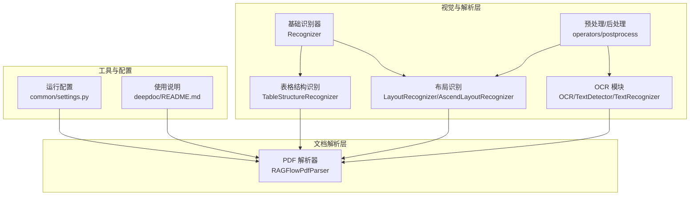
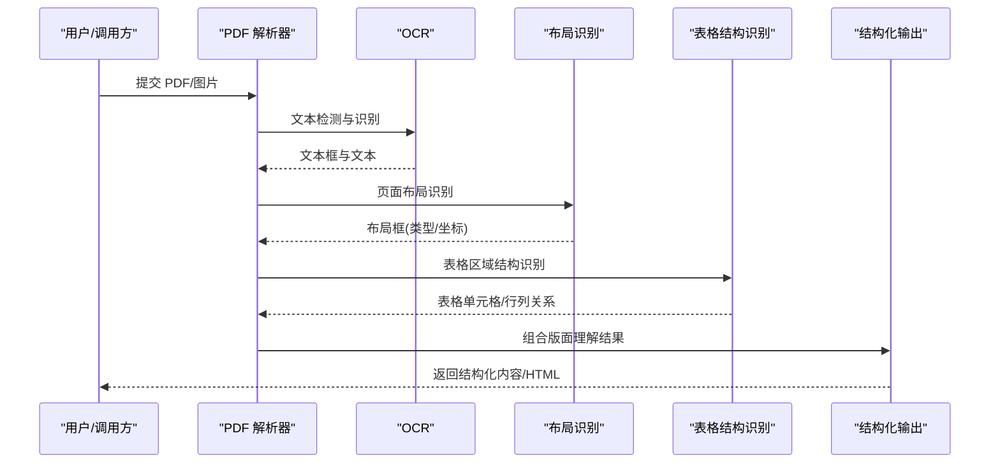
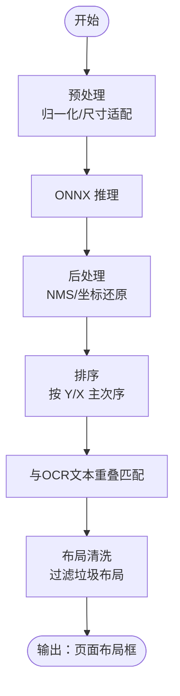
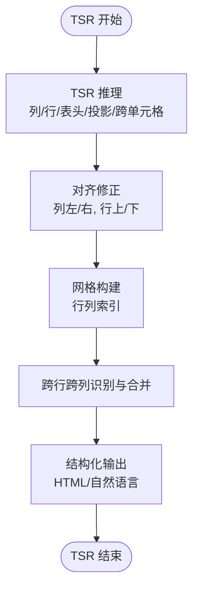
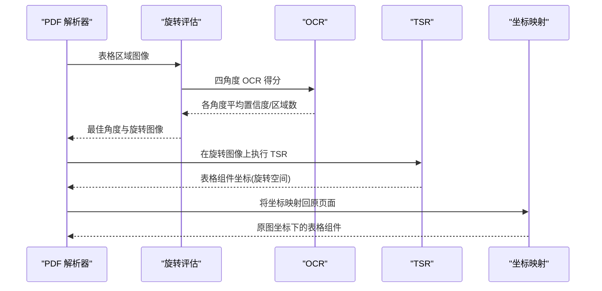
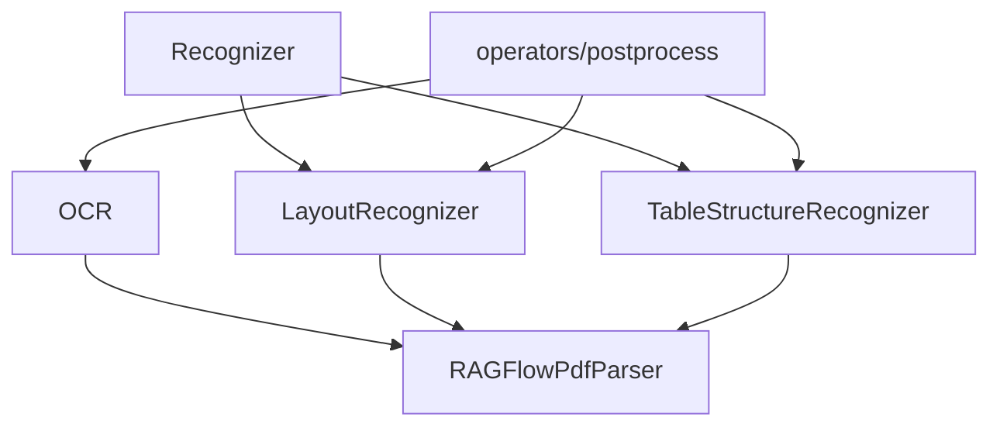

# 版面结构识别

<cite>
**本文引用的文件**
- [deepdoc/vision/layout_recognizer.py](file://deepdoc/vision/layout_recognizer.py)
- [deepdoc/vision/table_structure_recognizer.py](file://deepdoc/vision/table_structure_recognizer.py)
- [deepdoc/vision/recognizer.py](file://deepdoc/vision/recognizer.py)
- [deepdoc/vision/ocr.py](file://deepdoc/vision/ocr.py)
- [deepdoc/vision/operators.py](file://deepdoc/vision/operators.py)
- [deepdoc/vision/postprocess.py](file://deepdoc/vision/postprocess.py)
- [deepdoc/vision/t_recognizer.py](file://deepdoc/vision/t_recognizer.py)
- [deepdoc/parser/pdf_parser.py](file://deepdoc/parser/pdf_parser.py)
- [deepdoc/README.md](file://deepdoc/README.md)
- [common/settings.py](file://common/settings.py)
</cite>

## 目录
1. [简介](#简介)
2. [项目结构](#项目结构)
3. [核心组件](#核心组件)
4. [架构总览](#架构总览)
5. [详细组件分析](#详细组件分析)
6. [依赖关系分析](#依赖关系分析)
7. [性能考虑](#性能考虑)
8. [故障排查指南](#故障排查指南)
9. [结论](#结论)
10. [附录](#附录)

## 简介
本技术文档围绕 RAGFlow 的版面结构识别系统，系统性阐述其页面布局分析与结构识别能力。重点覆盖：
- 布局识别算法：文本区域检测、图像区域定位、表格区域划分等
- 表格结构识别：表格边框检测、单元格分割、行列关系分析、跨行跨列合并单元格处理
- 复杂页面元素处理：图表识别、公式提取、装饰元素过滤
- 版面理解算法：页面分区、元素层次分析、空间关系建模
- 配置参数与使用示例：如何针对不同文档类型进行参数调优与流程编排
- 性能优化与准确率评估：多模型并行、GPU 内存管理、阈值策略与评估指标
- 常见问题与解决方案：OCR 字体编码异常、表格旋转矫正、坐标映射与匹配

## 项目结构
RAGFlow 的视觉与解析模块主要位于 deepdoc 子目录，围绕 OCR、布局识别、表格结构识别三大能力展开，并通过 PDF 解析器串联到端到端的文档处理流程。

**图表来源**
- [deepdoc/vision/ocr.py:542-758](file://deepdoc/vision/ocr.py#L542-L758)
- [deepdoc/vision/layout_recognizer.py:33-157](file://deepdoc/vision/layout_recognizer.py#L33-L157)
- [deepdoc/vision/table_structure_recognizer.py:30-111](file://deepdoc/vision/table_structure_recognizer.py#L30-L111)
- [deepdoc/vision/recognizer.py:31-443](file://deepdoc/vision/recognizer.py#L31-L443)
- [deepdoc/parser/pdf_parser.py:56-110](file://deepdoc/parser/pdf_parser.py#L56-L110)
- [common/settings.py:127-136](file://common/settings.py#L127-L136)
- [deepdoc/README.md:46-130](file://deepdoc/README.md#L46-L130)

**章节来源**
- [deepdoc/README.md:46-130](file://deepdoc/README.md#L46-L130)

## 核心组件
- 基础识别器 Recognizer：统一的 ONNX 推理入口，封装预处理、推理与后处理流程，提供排序、重叠计算、NMS 等通用工具函数。
- OCR 模块：包含文本检测与识别子模块，支持多 GPU 并行推理，提供旋转裁剪、置信度过滤等能力。
- 布局识别 LayoutRecognizer：面向版面分区的检测器，输出页面级布局框及其类型（文本、标题、图、图注、表格、表格注释、页眉、页脚、参考文献、公式）。
- 表格结构识别 TableStructureRecognizer：对表格区域内的列、行、表头、投影行头、跨单元格等进行细粒度结构化识别，并可生成 HTML 或自然语言描述。
- PDF 解析器 RAGFlowPdfParser：整合 OCR、布局识别、表格结构识别与版面理解，实现从 PDF 到结构化内容的完整链路，含表格自动旋转矫正与坐标映射。

**章节来源**
- [deepdoc/vision/recognizer.py:31-443](file://deepdoc/vision/recognizer.py#L31-L443)
- [deepdoc/vision/ocr.py:542-758](file://deepdoc/vision/ocr.py#L542-L758)
- [deepdoc/vision/layout_recognizer.py:33-157](file://deepdoc/vision/layout_recognizer.py#L33-L157)
- [deepdoc/vision/table_structure_recognizer.py:30-111](file://deepdoc/vision/table_structure_recognizer.py#L30-L111)
- [deepdoc/parser/pdf_parser.py:56-110](file://deepdoc/parser/pdf_parser.py#L56-L110)

## 架构总览
下图展示从输入图像/PDF 到最终结构化输出的关键步骤与组件交互。

**图表来源**
- [deepdoc/parser/pdf_parser.py:56-110](file://deepdoc/parser/pdf_parser.py#L56-L110)
- [deepdoc/vision/ocr.py:542-758](file://deepdoc/vision/ocr.py#L542-L758)
- [deepdoc/vision/layout_recognizer.py:63-157](file://deepdoc/vision/layout_recognizer.py#L63-L157)
- [deepdoc/vision/table_structure_recognizer.py:54-111](file://deepdoc/vision/table_structure_recognizer.py#L54-L111)

## 详细组件分析

### 布局识别算法
- 输入：图像列表
- 输出：每页布局框列表，包含类型、置信度、坐标与所属页码
- 关键流程：
  - 使用 ONNX 推理引擎执行布局检测
  - 对检测框按 Y 轴主序、X 轴次序排序
  - 与 OCR 文本框进行重叠匹配，标注布局类型
  - 清洗垃圾布局（页眉、页脚、参考文献）并过滤低质量文本
  - 支持 Ascend 设备直连推理（可选）

**图表来源**
- [deepdoc/vision/layout_recognizer.py:63-157](file://deepdoc/vision/layout_recognizer.py#L63-L157)
- [deepdoc/vision/recognizer.py:283-407](file://deepdoc/vision/recognizer.py#L283-L407)

**章节来源**
- [deepdoc/vision/layout_recognizer.py:33-157](file://deepdoc/vision/layout_recognizer.py#L33-L157)
- [deepdoc/vision/recognizer.py:31-443](file://deepdoc/vision/recognizer.py#L31-L443)

### 表格结构识别（TSR）
- 输入：表格区域图像
- 输出：表格单元格、行列关系、跨行跨列合并信息，支持 HTML 与自然语言描述
- 关键流程：
  - 使用 ONNX 或 Ascend 执行 TSR 推理，得到列、行、表头、投影行头、跨单元格等组件
  - 计算列/行对齐边界，修正组件边界
  - 基于重叠与邻接关系构建行列网格
  - 识别跨行跨列单元格并合并
  - 生成 HTML 或自然语言描述

**图表来源**
- [deepdoc/vision/table_structure_recognizer.py:54-111](file://deepdoc/vision/table_structure_recognizer.py#L54-L111)
- [deepdoc/vision/table_structure_recognizer.py:151-350](file://deepdoc/vision/table_structure_recognizer.py#L151-L350)

**章节来源**
- [deepdoc/vision/table_structure_recognizer.py:30-111](file://deepdoc/vision/table_structure_recognizer.py#L30-L111)
- [deepdoc/vision/table_structure_recognizer.py:151-350](file://deepdoc/vision/table_structure_recognizer.py#L151-L350)

### 复杂页面元素处理
- 图表识别：通过布局识别将“图/图注”类布局框与对应文本关联，结合 OCR 文本进行语义增强
- 公式提取：将公式区域识别为“公式”类型，并在版面理解阶段将其作为独立元素处理
- 装饰元素过滤：通过布局清洗与垃圾布局过滤策略，剔除页眉、页脚、参考文献等非正文元素

**章节来源**
- [deepdoc/vision/layout_recognizer.py:63-157](file://deepdoc/vision/layout_recognizer.py#L63-L157)

### 版面理解算法
- 页面分区：基于布局识别结果，将页面划分为若干逻辑区块
- 元素层次分析：通过布局类型与重叠关系，确定文本、标题、图、表等元素的层级
- 空间关系建模：利用坐标与距离度量，建立元素间的前后、上下、左右关系，辅助段落与表格的重建

**章节来源**
- [deepdoc/vision/layout_recognizer.py:63-157](file://deepdoc/vision/layout_recognizer.py#L63-L157)
- [deepdoc/vision/recognizer.py:113-176](file://deepdoc/vision/recognizer.py#L113-L176)

### 表格自动旋转与坐标映射
- 自动旋转：对表格区域分别尝试 0°、90°、180°、270° 四种角度，基于 OCR 置信度与区域数量综合评分，选择最佳角度
- 坐标映射：在旋转后的图像上进行 TSR 推理，再将坐标变换回原页面坐标系，确保与原始 OCR 文本对齐

**图表来源**
- [deepdoc/parser/pdf_parser.py:322-411](file://deepdoc/parser/pdf_parser.py#L322-L411)
- [deepdoc/parser/pdf_parser.py:413-520](file://deepdoc/parser/pdf_parser.py#L413-L520)

**章节来源**
- [deepdoc/parser/pdf_parser.py:322-411](file://deepdoc/parser/pdf_parser.py#L322-L411)
- [deepdoc/parser/pdf_parser.py:413-520](file://deepdoc/parser/pdf_parser.py#L413-L520)

## 依赖关系分析
- Recognizer 为所有视觉识别器的基类，提供统一的预处理、推理与后处理接口
- OCR 模块依赖 operators 进行图像预处理，依赖 postprocess 进行后处理
- LayoutRecognizer 与 TableStructureRecognizer 基于 Recognizer 实现具体任务
- PDF 解析器聚合 OCR、布局识别与表格结构识别，形成完整的文档结构理解链路

**图表来源**
- [deepdoc/vision/recognizer.py:31-443](file://deepdoc/vision/recognizer.py#L31-L443)
- [deepdoc/vision/ocr.py:542-758](file://deepdoc/vision/ocr.py#L542-L758)
- [deepdoc/vision/layout_recognizer.py:33-157](file://deepdoc/vision/layout_recognizer.py#L33-L157)
- [deepdoc/vision/table_structure_recognizer.py:30-111](file://deepdoc/vision/table_structure_recognizer.py#L30-L111)
- [deepdoc/parser/pdf_parser.py:56-110](file://deepdoc/parser/pdf_parser.py#L56-L110)

**章节来源**
- [deepdoc/vision/recognizer.py:31-443](file://deepdoc/vision/recognizer.py#L31-L443)
- [deepdoc/vision/ocr.py:542-758](file://deepdoc/vision/ocr.py#L542-L758)
- [deepdoc/vision/layout_recognizer.py:33-157](file://deepdoc/vision/layout_recognizer.py#L33-L157)
- [deepdoc/vision/table_structure_recognizer.py:30-111](file://deepdoc/vision/table_structure_recognizer.py#L30-L111)
- [deepdoc/parser/pdf_parser.py:56-110](file://deepdoc/parser/pdf_parser.py#L56-L110)

## 性能考虑
- 多设备并行：通过环境变量设置并行设备数量，实现多 GPU 并行推理，提升吞吐
- 线程与内存：ONNX Runtime 线程数可通过环境变量配置，GPU 内存上限与分配策略可调
- 模型加载缓存：OCR 模型加载具备缓存机制，避免重复初始化
- 批处理与批大小：识别器支持批处理推理，合理设置批大小可平衡延迟与吞吐
- 布局清洗与阈值：通过布局清洗与置信度阈值过滤，减少无效输出，提高整体效率

**章节来源**
- [common/settings.py:127-136](file://common/settings.py#L127-L136)
- [deepdoc/vision/ocr.py:71-136](file://deepdoc/vision/ocr.py#L71-L136)
- [deepdoc/vision/recognizer.py:415-437](file://deepdoc/vision/recognizer.py#L415-L437)

## 故障排查指南
- OCR 字体编码异常：检测并过滤由字体子集嵌入导致的乱码字符，避免误判为有效文本
- 表格旋转矫正失败：若某角度 OCR 失败，记录警告并回退至 0°；也可通过阈值规则避免错误旋转
- 布局类型误判：调整布局识别阈值与排序策略，结合 OCR 文本重叠匹配提升准确性
- 坐标不一致：确认旋转矫正与坐标映射流程，确保 TSR 坐标正确映射回原图坐标系

**章节来源**
- [deepdoc/parser/pdf_parser.py:200-321](file://deepdoc/parser/pdf_parser.py#L200-L321)
- [deepdoc/parser/pdf_parser.py:322-411](file://deepdoc/parser/pdf_parser.py#L322-L411)
- [deepdoc/parser/pdf_parser.py:413-520](file://deepdoc/parser/pdf_parser.py#L413-L520)
- [deepdoc/vision/layout_recognizer.py:63-157](file://deepdoc/vision/layout_recognizer.py#L63-L157)

## 结论
RAGFlow 的版面结构识别系统通过 OCR、布局识别与表格结构识别的协同，实现了对复杂文档页面的高精度结构化理解。系统支持多种模型与设备后端，具备良好的扩展性与性能表现。通过合理的参数配置与流程编排，可在不同领域与格式的文档中取得稳定且高质量的结果。

## 附录

### 使用示例与配置参数
- 命令行示例（布局识别/表格结构识别）
  - 布局识别：指定输入路径、阈值与输出目录
  - 表格结构识别：在布局识别基础上，生成 HTML 表格
- 环境变量
  - OCR 线程与 GPU 内存：控制 ONNX Runtime 线程数与 GPU 内存上限
  - 布局/表格识别器类型：切换 ONNX 或 Ascend 后端
  - 表格自动旋转开关：控制是否启用表格自动旋转矫正
- API 示例（Python）
  - 初始化 OCR、布局识别器与表格结构识别器
  - 对 PDF 进行解析，返回结构化结果

**章节来源**
- [deepdoc/README.md:46-130](file://deepdoc/README.md#L46-L130)
- [deepdoc/vision/t_recognizer.py:36-105](file://deepdoc/vision/t_recognizer.py#L36-L105)
- [deepdoc/vision/t_recognizer.py:172-186](file://deepdoc/vision/t_recognizer.py#L172-L186)
- [common/settings.py:127-136](file://common/settings.py#L127-L136)
- [deepdoc/parser/pdf_parser.py:56-110](file://deepdoc/parser/pdf_parser.py#L56-L110)