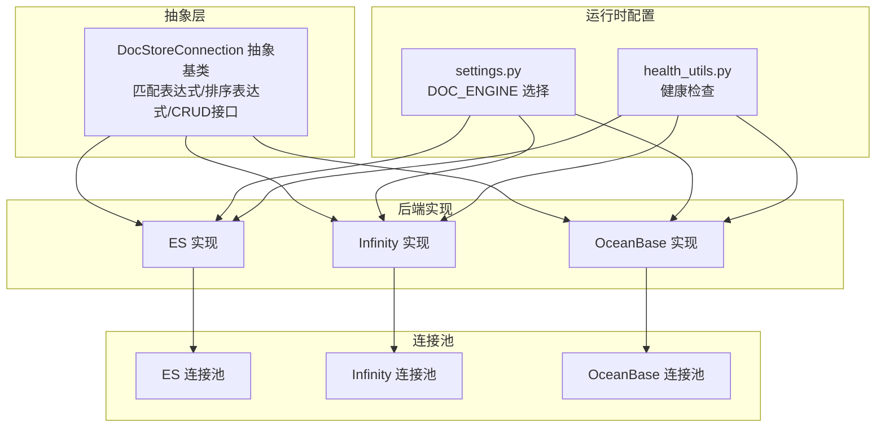
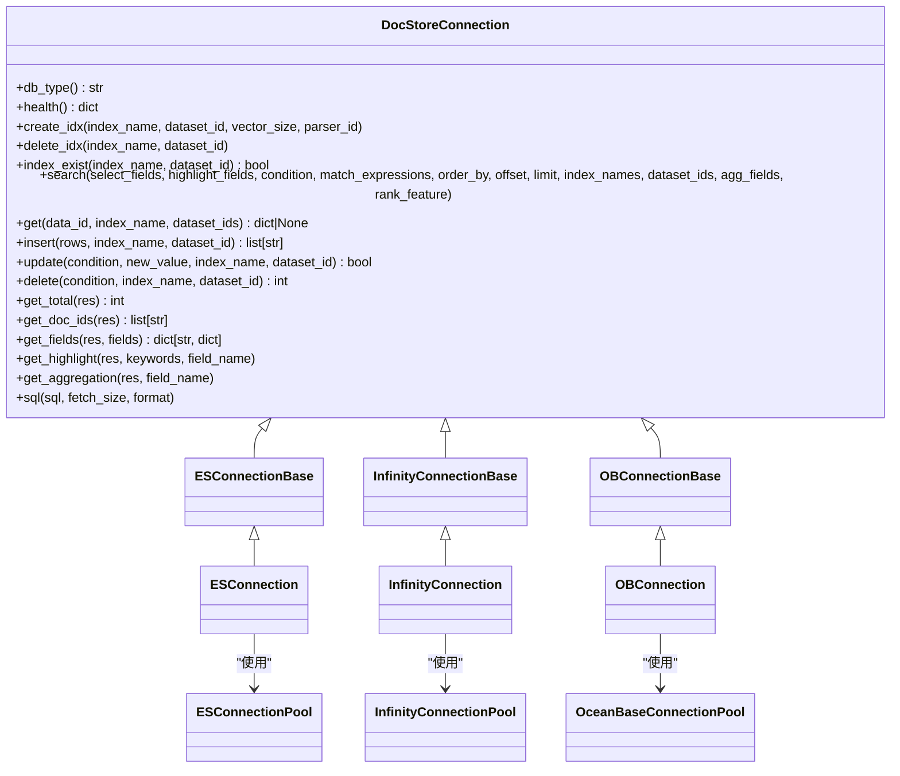
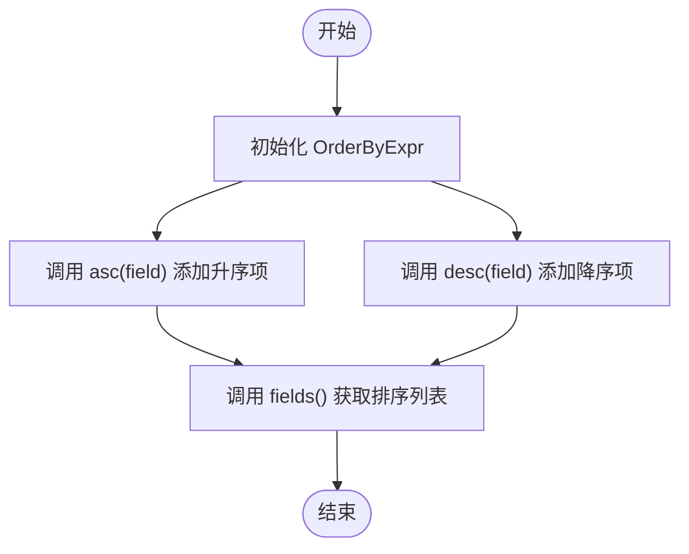
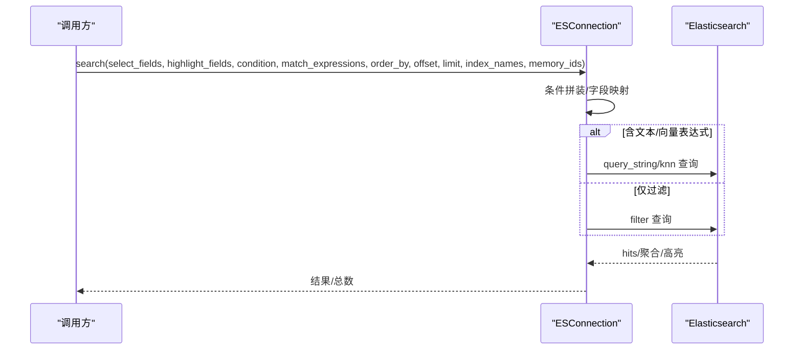
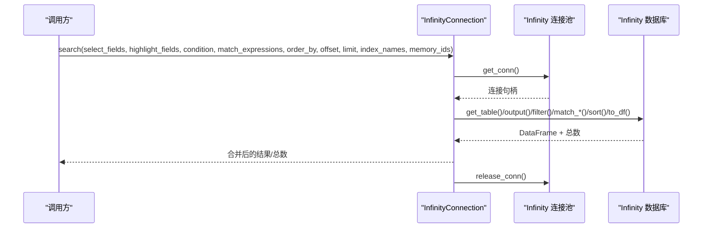
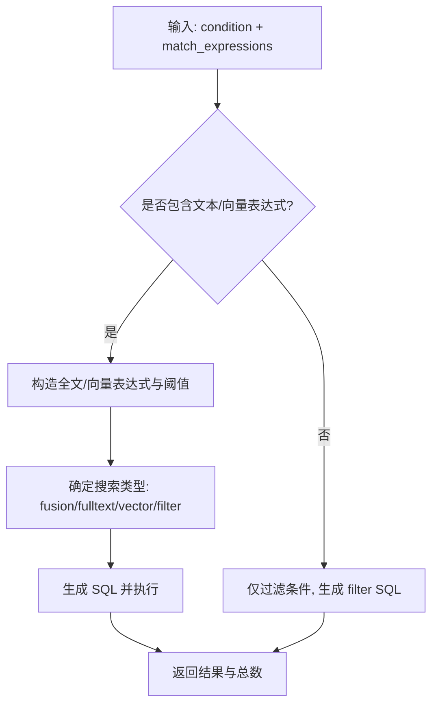
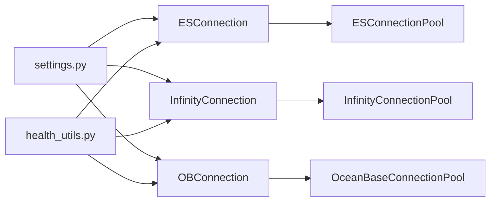

# 存储抽象层

<cite>
**本文引用的文件**
- [common/doc_store/doc_store_base.py](file://common/doc_store/doc_store_base.py)
- [common/doc_store/es_conn_base.py](file://common/doc_store/es_conn_base.py)
- [common/doc_store/infinity_conn_base.py](file://common/doc_store/infinity_conn_base.py)
- [common/doc_store/ob_conn_base.py](file://common/doc_store/ob_conn_base.py)
- [common/doc_store/es_conn_pool.py](file://common/doc_store/es_conn_pool.py)
- [common/doc_store/infinity_conn_pool.py](file://common/doc_store/infinity_conn_pool.py)
- [common/doc_store/ob_conn_pool.py](file://common/doc_store/ob_conn_pool.py)
- [memory/utils/es_conn.py](file://memory/utils/es_conn.py)
- [memory/utils/infinity_conn.py](file://memory/utils/infinity_conn.py)
- [memory/utils/ob_conn.py](file://memory/utils/ob_conn.py)
- [common/settings.py](file://common/settings.py)
- [api/utils/health_utils.py](file://api/utils/health_utils.py)
- [internal/server/config.go](file://internal/server/config.go)
- [admin/server/config.py](file://admin/server/config.py)
</cite>

## 目录
1. [引言](#引言)
2. [项目结构](#项目结构)
3. [核心组件](#核心组件)
4. [架构总览](#架构总览)
5. [详细组件分析](#详细组件分析)
6. [依赖分析](#依赖分析)
7. [性能考虑](#性能考虑)
8. [故障排查指南](#故障排查指南)
9. [结论](#结论)
10. [附录](#附录)

## 引言
本技术文档聚焦于 RAGFlow 存储抽象层，系统性阐述 DocStoreConnection 抽象基类的设计理念与实现机制，详解匹配表达式体系（文本、稠密向量、稀疏向量、张量、融合）与排序表达式（OrderByExpr）的建模与应用，并给出自定义存储后端的实现路径、连接池与健康检查机制、错误处理策略以及性能优化建议。文档面向不同技术背景的读者，既提供高层概览，也包含代码级图示与来源标注。

## 项目结构
存储抽象层由“抽象基类 + 多后端实现 + 连接池 + 健康检查”构成，核心抽象位于 Python 的 common/doc_store 模块；具体实现分别针对 Elasticsearch、Infinity、OceanBase 提供独立适配器；连接池封装在各自模块中；运行时通过 settings 动态选择文档引擎；健康检查通过 API 层暴露。



图表来源
- [common/doc_store/doc_store_base.py:143-271](file://common/doc_store/doc_store_base.py#L143-L271)
- [common/doc_store/es_conn_base.py:37-333](file://common/doc_store/es_conn_base.py#L37-L333)
- [common/doc_store/infinity_conn_base.py:35-763](file://common/doc_store/infinity_conn_base.py#L35-L763)
- [common/doc_store/ob_conn_base.py:97-746](file://common/doc_store/ob_conn_base.py#L97-L746)
- [common/doc_store/es_conn_pool.py:26-85](file://common/doc_store/es_conn_pool.py#L26-L85)
- [common/doc_store/infinity_conn_pool.py:27-103](file://common/doc_store/infinity_conn_pool.py#L27-L103)
- [common/doc_store/ob_conn_pool.py:34-192](file://common/doc_store/ob_conn_pool.py#L34-L192)
- [common/settings.py:260-312](file://common/settings.py#L260-L312)
- [api/utils/health_utils.py:88-175](file://api/utils/health_utils.py#L88-L175)

章节来源
- [common/doc_store/doc_store_base.py:143-271](file://common/doc_store/doc_store_base.py#L143-L271)
- [common/settings.py:260-312](file://common/settings.py#L260-L312)

## 核心组件
- 抽象基类 DocStoreConnection：统一数据库类型、健康检查、索引管理、CRUD、结果辅助方法与 SQL 执行接口。
- 匹配表达式体系：MatchTextExpr、MatchDenseExpr、MatchSparseExpr、MatchTensorExpr、FusionExpr，用于描述检索查询的多模态组合。
- 排序表达式 OrderByExpr：统一字段排序方向（升/降），支持链式构建。
- 后端实现：ESConnection、InfinityConnection、OBConnection，均继承对应 Base 并实现抽象方法。
- 连接池：ES、Infinity、OceanBase 各自提供连接池封装，含健康检查与自动刷新。
- 运行时选择：通过环境变量 DOC_ENGINE 在 settings 中绑定具体实现。

章节来源
- [common/doc_store/doc_store_base.py:56-141](file://common/doc_store/doc_store_base.py#L56-L141)
- [common/doc_store/es_conn_base.py:37-333](file://common/doc_store/es_conn_base.py#L37-L333)
- [common/doc_store/infinity_conn_base.py:35-763](file://common/doc_store/infinity_conn_base.py#L35-L763)
- [common/doc_store/ob_conn_base.py:97-746](file://common/doc_store/ob_conn_base.py#L97-L746)

## 架构总览
下图展示了 DocStore 抽象层与各后端实现、连接池及运行时配置的关系。



图表来源
- [common/doc_store/doc_store_base.py:143-271](file://common/doc_store/doc_store_base.py#L143-L271)
- [common/doc_store/es_conn_base.py:37-333](file://common/doc_store/es_conn_base.py#L37-L333)
- [common/doc_store/infinity_conn_base.py:35-763](file://common/doc_store/infinity_conn_base.py#L35-L763)
- [common/doc_store/ob_conn_base.py:97-746](file://common/doc_store/ob_conn_base.py#L97-L746)
- [memory/utils/es_conn.py:35-566](file://memory/utils/es_conn.py#L35-L566)
- [memory/utils/infinity_conn.py:30-510](file://memory/utils/infinity_conn.py#L30-L510)
- [memory/utils/ob_conn.py:75-626](file://memory/utils/ob_conn.py#L75-L626)
- [common/doc_store/es_conn_pool.py:26-85](file://common/doc_store/es_conn_pool.py#L26-L85)
- [common/doc_store/infinity_conn_pool.py:27-103](file://common/doc_store/infinity_conn_pool.py#L27-L103)
- [common/doc_store/ob_conn_pool.py:34-192](file://common/doc_store/ob_conn_pool.py#L34-L192)

## 详细组件分析

### DocStoreConnection 抽象基类设计
- 设计原则
  - 统一接口：对不同存储后端暴露一致的 CRUD、索引管理、结果辅助与 SQL 能力。
  - 可扩展性：通过抽象方法允许后端按需实现，如 ES 支持 SQL 查询，Infinity 支持 psql 命令执行。
  - 结果解耦：get_total/get_doc_ids/get_fields/get_highlight/get_aggregation 将结果解析与后端解耦。
- 关键接口
  - 数据库类型与健康：db_type()/health()
  - 索引管理：create_idx()/delete_idx()/index_exist()
  - 检索与写入：search()/get()/insert()/update()/delete()
  - 结果工具：get_total()/get_doc_ids()/get_fields()/get_highlight()/get_aggregation()
  - 文本到 SQL：sql()

章节来源
- [common/doc_store/doc_store_base.py:143-271](file://common/doc_store/doc_store_base.py#L143-L271)

### 匹配表达式系统
- 表达式类型
  - 文本匹配：MatchTextExpr（字段列表、查询文本、topn、额外选项）
  - 稠密向量匹配：MatchDenseExpr（向量列名、嵌入数据、数据类型、距离类型、topn、额外选项）
  - 稀疏向量匹配：MatchSparseExpr（向量列名、稀疏数据、距离类型、topn、可选参数）
  - 张量匹配：MatchTensorExpr（列名、查询数据、数据类型、topn、额外选项）
  - 融合匹配：FusionExpr（方法、topn、融合参数）
- 使用场景
  - 文本检索：全文检索、权重融合、最小匹配百分比等
  - 向量检索：余弦/点积等距离度量、阈值过滤、候选集扩大
  - 多模态融合：文本与向量的加权融合，normalize/atn 等归一化策略
- 实现要点
  - 后端在 search 中根据表达式类型生成对应查询或算子
  - 对 extra_options 进行类型转换与兼容处理（如 similarity->threshold）

```mermaid
classDiagram
class MatchTextExpr {
+fields : list[str]
+matching_text : str
+topn : int
+extra_options : dict|None
}
class MatchDenseExpr {
+vector_column_name : str
+embedding_data : VEC
+embedding_data_type : str
+distance_type : str
+topn : int
+extra_options : dict|None
}
class MatchSparseExpr {
+vector_column_name : str
+sparse_data : SparseVector|dict
+distance_type : str
+topn : int
+opt_params : dict|None
}
class MatchTensorExpr {
+column_name : str
+query_data : VEC
+query_data_type : str
+topn : int
+extra_option : dict|None
}
class FusionExpr {
+method : str
+topn : int
+fusion_params : dict|None
}
class OrderByExpr {
+asc(field) OrderByExpr
+desc(field) OrderByExpr
+fields() list
}
MatchExpr = MatchTextExpr | MatchDenseExpr | MatchSparseExpr | MatchTensorExpr | FusionExpr
```

图表来源
- [common/doc_store/doc_store_base.py:56-127](file://common/doc_store/doc_store_base.py#L56-L127)

章节来源
- [common/doc_store/doc_store_base.py:56-127](file://common/doc_store/doc_store_base.py#L56-L127)

### 排序表达式 OrderByExpr
- 设计目标：以链式 API 统一字段排序方向，输出为字段与方向元组列表
- 典型用法：先按字段升序，再按字段降序，最终按方向列表排序



图表来源
- [common/doc_store/doc_store_base.py:130-141](file://common/doc_store/doc_store_base.py#L130-L141)

章节来源
- [common/doc_store/doc_store_base.py:130-141](file://common/doc_store/doc_store_base.py#L130-L141)

### Elasticsearch 实现（ESConnection）
- 继承层次：ESConnectionBase -> ESConnection
- 关键能力
  - 字段映射与消息转换：convert_field_name/map_message_to_es_fields/get_message_from_es_doc
  - 搜索流程：条件拼装、文本/向量混合检索、高亮、聚合、排序
  - 写入与更新：bulk 插入、脚本更新、删除
  - 健康检查：集群健康状态、统计信息
- 匹配表达式处理
  - 文本：query_string best_fields，支持 minimum_should_match 百分比
  - 向量：knn 查询，支持 similarity 阈值
  - 融合：权重调整，向量相似度权重动态计算



图表来源
- [memory/utils/es_conn.py:113-249](file://memory/utils/es_conn.py#L113-L249)
- [common/doc_store/es_conn_base.py:210-236](file://common/doc_store/es_conn_base.py#L210-L236)

章节来源
- [memory/utils/es_conn.py:35-566](file://memory/utils/es_conn.py#L35-L566)
- [common/doc_store/es_conn_base.py:37-333](file://common/doc_store/es_conn_base.py#L37-L333)

### Infinity 实现（InfinityConnection）
- 继承层次：InfinityConnectionBase -> InfinityConnection
- 关键能力
  - 表/列映射：convert_message_field_to_infinity/convert_infinity_field_to_message
  - 全文/向量/融合检索：match_text/match_dense/fusion
  - 排序与高亮：基于列名转换与正则高亮
  - SQL：通过 psql 命令执行文本到 SQL 的转换
- 匹配表达式处理
  - 文本：filter_fulltext + minimum_should_match 百分比
  - 向量：similarity->threshold 兼容
  - 融合：normalize=atan 默认策略



图表来源
- [memory/utils/infinity_conn.py:103-278](file://memory/utils/infinity_conn.py#L103-L278)
- [common/doc_store/infinity_conn_base.py:432-447](file://common/doc_store/infinity_conn_base.py#L432-L447)

章节来源
- [memory/utils/infinity_conn.py:30-510](file://memory/utils/infinity_conn.py#L30-L510)
- [common/doc_store/infinity_conn_base.py:35-763](file://common/doc_store/infinity_conn_base.py#L35-L763)

### OceanBase 实现（OBConnection）
- 继承层次：OBConnectionBase -> OBConnection
- 关键能力
  - 列定义与索引：消息表列、全文索引、向量列与索引
  - 检索策略：全文/向量/融合/过滤四种模式，支持 SQL 构造与执行
  - 高亮与聚合：基于关键词高亮与标签聚合
- 匹配表达式处理
  - 文本：IK 分词全文检索表达式与权重归一化
  - 向量：余弦距离阈值过滤
  - 融合：加权融合，向量相似度权重提取



图表来源
- [memory/utils/ob_conn.py:194-406](file://memory/utils/ob_conn.py#L194-L406)
- [common/doc_store/ob_conn_base.py:499-640](file://common/doc_store/ob_conn_base.py#L499-L640)

章节来源
- [memory/utils/ob_conn.py:75-626](file://memory/utils/ob_conn.py#L75-L626)
- [common/doc_store/ob_conn_base.py:97-746](file://common/doc_store/ob_conn_base.py#L97-L746)

### 连接池管理
- Elasticsearch
  - 初始化尝试连接，版本校验，失败重试与健康检查
  - 提供 refresh_conn 自动恢复
- Infinity
  - 连接池最大并发，节点健康检查，异常时销毁重建
  - 提供 refresh_conn_pool 自动修复
- OceanBase
  - 基于 ObVecClient 的连接池配置（大小、溢出、超时）
  - 版本检查、查询超时设置、HybridSearch 可选启用

章节来源
- [common/doc_store/es_conn_pool.py:26-85](file://common/doc_store/es_conn_pool.py#L26-L85)
- [common/doc_store/infinity_conn_pool.py:27-103](file://common/doc_store/infinity_conn_pool.py#L27-L103)
- [common/doc_store/ob_conn_pool.py:34-192](file://common/doc_store/ob_conn_pool.py#L34-L192)

### 健康检查机制
- 运行时选择：通过环境变量 DOC_ENGINE 在 settings 中绑定具体实现
- API 层健康检查：分别提供 Infinity 与 OceanBase 的健康状态与性能指标
- 健康状态字段：状态码、消息体、错误详情

章节来源
- [common/settings.py:260-312](file://common/settings.py#L260-L312)
- [api/utils/health_utils.py:88-175](file://api/utils/health_utils.py#L88-L175)
- [internal/server/config.go:269-314](file://internal/server/config.go#L269-L314)
- [admin/server/config.py:255-284](file://admin/server/config.py#L255-L284)

## 依赖分析
- 抽象层与实现层：DocStoreConnection 作为契约，各后端实现遵循统一接口
- 连接池与实现层：后端通过连接池获取/释放连接，避免重复初始化
- 运行时配置：settings 根据 DOC_ENGINE 注入不同实现实例
- 健康检查：API 层直接调用后端 health() 返回状态



图表来源
- [common/settings.py:260-312](file://common/settings.py#L260-L312)
- [api/utils/health_utils.py:88-175](file://api/utils/health_utils.py#L88-L175)
- [common/doc_store/es_conn_pool.py:26-85](file://common/doc_store/es_conn_pool.py#L26-L85)
- [common/doc_store/infinity_conn_pool.py:27-103](file://common/doc_store/infinity_conn_pool.py#L27-L103)
- [common/doc_store/ob_conn_pool.py:34-192](file://common/doc_store/ob_conn_pool.py#L34-L192)

章节来源
- [common/settings.py:260-312](file://common/settings.py#L260-L312)
- [api/utils/health_utils.py:88-175](file://api/utils/health_utils.py#L88-L175)

## 性能考虑
- 连接池参数
  - ES：hosts、认证、超时、版本校验
  - Infinity：连接池大小、节点健康、URI/PG 端口/数据库名
  - OB：连接池大小、溢出、超时、查询超时变量设置
- 检索策略
  - 文本检索：合理设置 minimum_should_match，避免过度召回
  - 向量检索：topn 扩大与阈值过滤结合，减少二次筛选成本
  - 融合检索：向量权重与 normalize 策略影响最终排序稳定性
- 索引与列
  - 全文索引、二级索引、向量索引按需创建，避免冗余索引
  - 列命名与字段映射减少后端转换开销

[本节为通用指导，不直接分析具体文件]

## 故障排查指南
- 连接失败
  - 检查连接池初始化日志与健康检查输出
  - ES：确认 hosts、认证、版本
  - Infinity：确认连接池 URI、节点状态
  - OB：确认连接池配置、版本、查询超时
- 检索异常
  - 查看 match_expressions 参数类型转换与 extra_options 规范
  - ES：检查 query_string 语法与 minimum_should_match
  - Infinity：确认 filter_fulltext 与 similarity->threshold 转换
  - OB：核对全文/向量表达式与阈值
- 健康检查
  - 通过 API 层 health_utils 获取状态与性能指标
  - OceanBase：关注连接状态、延迟、吞吐、慢查询与连接池统计

章节来源
- [common/doc_store/es_conn_pool.py:26-85](file://common/doc_store/es_conn_pool.py#L26-L85)
- [common/doc_store/infinity_conn_pool.py:27-103](file://common/doc_store/infinity_conn_pool.py#L27-L103)
- [common/doc_store/ob_conn_pool.py:34-192](file://common/doc_store/ob_conn_pool.py#L34-L192)
- [api/utils/health_utils.py:88-175](file://api/utils/health_utils.py#L88-L175)

## 结论
RAGFlow 存储抽象层通过 DocStoreConnection 统一接口，结合匹配表达式与排序表达式，实现了跨后端的一致检索体验。ES、Infinity、OceanBase 各自实现满足不同场景需求，配合连接池与健康检查机制，保障了生产可用性。通过本文档的实现指引与最佳实践，用户可以快速扩展新的存储后端并进行性能优化。

[本节为总结性内容，不直接分析具体文件]

## 附录

### 自定义存储后端实现清单
- 必备步骤
  - 新建类继承 DocStoreConnection（或对应 Base 类）
  - 实现数据库类型、健康检查、索引管理、CRUD、结果辅助与 SQL 接口
  - 完成匹配表达式与排序表达式的适配逻辑
  - 提供连接池封装与健康检查
  - 在 settings 中注册新后端并配置默认参数
- 接口实现要点
  - search：条件拼装、表达式分支、排序与高亮
  - insert/update/delete：幂等与一致性保证
  - get_total/get_doc_ids/get_fields/get_highlight/get_aggregation：结果解析解耦
- 配置参数
  - ES：hosts、认证、超时、映射文件
  - Infinity：uri、pg_port、db_name、连接池大小
  - OB：host/port、用户名/密码、db_name、连接池大小、溢出、超时
- 性能优化建议
  - 合理设置索引与列类型
  - 控制 topn 与阈值，避免过度召回
  - 使用连接池与健康检查，避免频繁重建连接
  - 在 API 层定期采集健康与性能指标

章节来源
- [common/doc_store/doc_store_base.py:143-271](file://common/doc_store/doc_store_base.py#L143-L271)
- [common/settings.py:260-312](file://common/settings.py#L260-L312)
- [common/doc_store/es_conn_pool.py:26-85](file://common/doc_store/es_conn_pool.py#L26-L85)
- [common/doc_store/infinity_conn_pool.py:27-103](file://common/doc_store/infinity_conn_pool.py#L27-L103)
- [common/doc_store/ob_conn_pool.py:34-192](file://common/doc_store/ob_conn_pool.py#L34-L192)