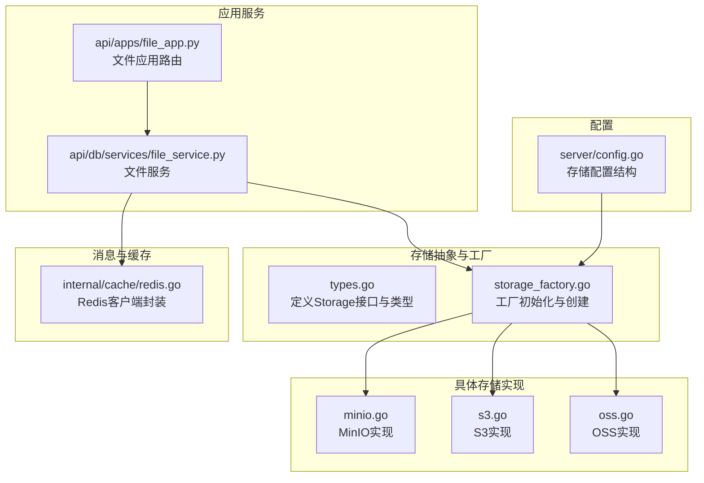
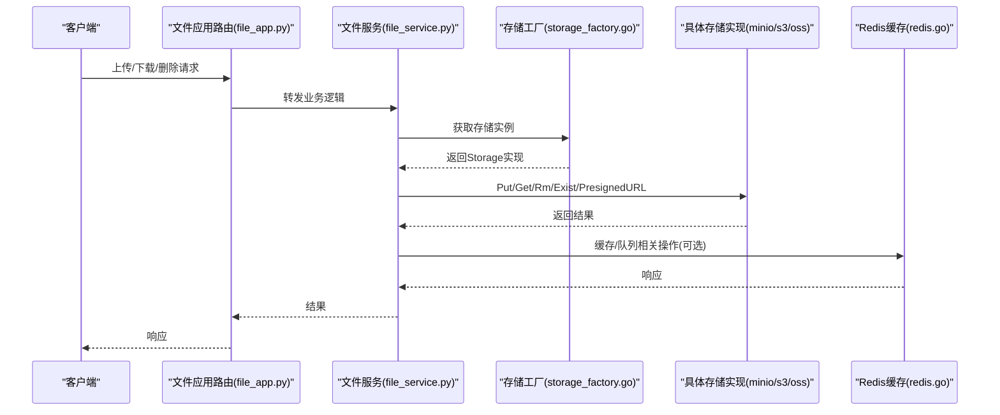
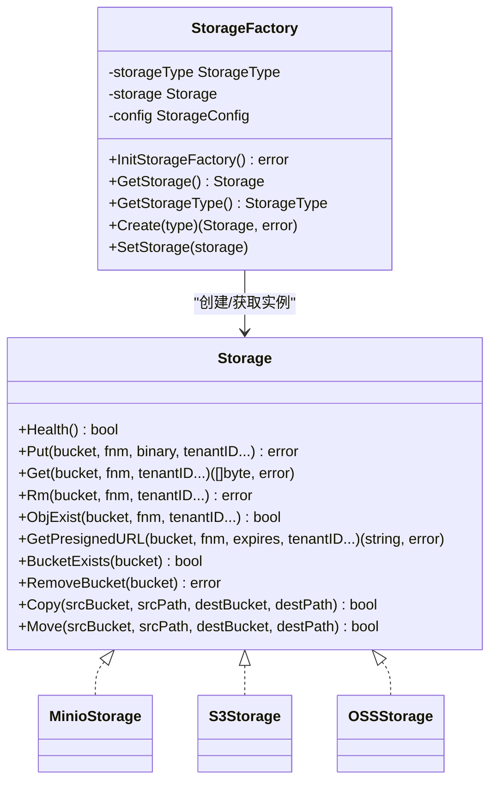
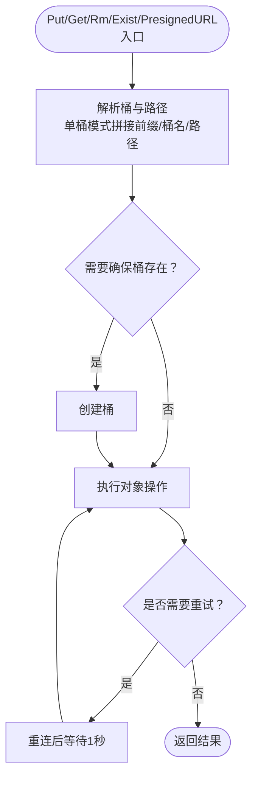
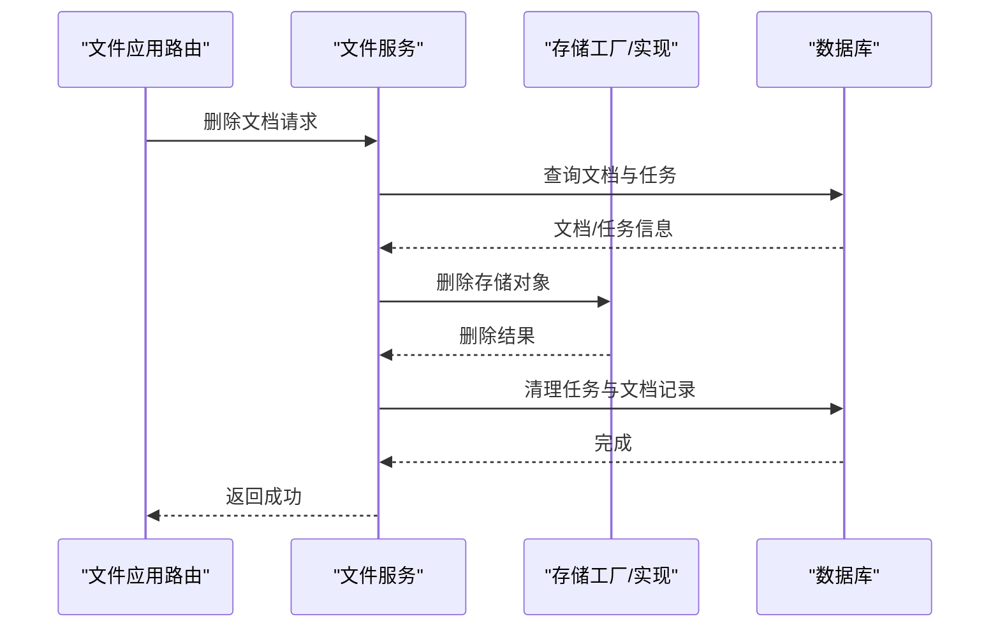
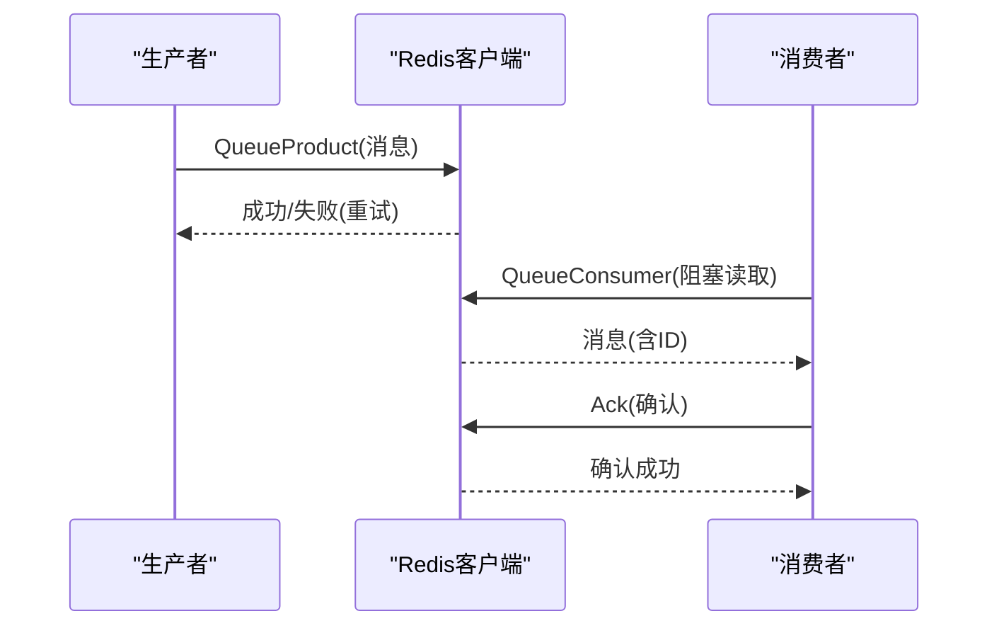
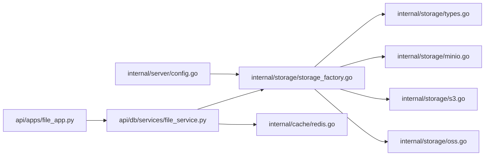

# 存储系统

<cite>
**本文引用的文件**
- [internal/storage/types.go](file://internal/storage/types.go)
- [internal/storage/storage_factory.go](file://internal/storage/storage_factory.go)
- [internal/storage/minio.go](file://internal/storage/minio.go)
- [internal/storage/s3.go](file://internal/storage/s3.go)
- [internal/storage/oss.go](file://internal/storage/oss.go)
- [internal/server/config.go](file://internal/server/config.go)
- [internal/cache/redis.go](file://internal/cache/redis.go)
- [api/db/services/file_service.py](file://api/db/services/file_service.py)
- [api/apps/file_app.py](file://api/apps/file_app.py)
- [docs/administrator/backup_and_migration.md](file://docs/administrator/backup_and_migration.md)
- [docs/administrator/configurations.md](file://docs/administrator/configurations.md)
</cite>

## 目录
1. [简介](#简介)
2. [项目结构](#项目结构)
3. [核心组件](#核心组件)
4. [架构总览](#架构总览)
5. [详细组件分析](#详细组件分析)
6. [依赖分析](#依赖分析)
7. [性能考虑](#性能考虑)
8. [故障排除指南](#故障排除指南)
9. [结论](#结论)
10. [附录](#附录)

## 简介
本文件面向RAGFlow的存储系统，系统性阐述其存储抽象层、多存储后端支持（MinIO、AWS S3、阿里云OSS）、对象存储集成方式、文档存储管理机制（生命周期、版本控制、迁移策略）、消息存储系统（Redis缓存与流队列）以及配置与部署实践。文档以代码为依据，结合架构图与流程图，帮助读者快速理解并正确使用与维护存储子系统。

## 项目结构
RAGFlow的存储系统主要由以下模块构成：
- 存储抽象层：定义统一的Storage接口与类型枚举，屏蔽底层差异。
- 存储工厂：根据配置动态创建具体存储实例（MinIO/S3/OSS）。
- 具体存储实现：MinioStorage、S3Storage、OSSStorage分别封装MinIO、AWS S3与阿里云OSS的客户端调用。
- 配置系统：集中管理存储引擎类型与各后端参数。
- 消息与缓存：Redis客户端封装，提供键值、集合、有序集、流队列等能力。
- 文档与文件服务：文件上传、下载、删除、元数据更新等通过统一的存储接口完成。

**图表来源**
- [internal/storage/types.go:65-102](file://internal/storage/types.go#L65-L102)
- [internal/storage/storage_factory.go:47-121](file://internal/storage/storage_factory.go#L47-L121)
- [internal/storage/minio.go:33-106](file://internal/storage/minio.go#L33-L106)
- [internal/storage/s3.go:35-112](file://internal/storage/s3.go#L35-L112)
- [internal/storage/oss.go:35-104](file://internal/storage/oss.go#L35-L104)
- [internal/server/config.go:145-194](file://internal/server/config.go#L145-L194)
- [internal/cache/redis.go:42-150](file://internal/cache/redis.go#L42-L150)
- [api/db/services/file_service.py:572-581](file://api/db/services/file_service.py#L572-L581)
- [api/apps/file_app.py:338-369](file://api/apps/file_app.py#L338-L369)

**章节来源**
- [internal/storage/types.go:31-102](file://internal/storage/types.go#L31-L102)
- [internal/storage/storage_factory.go:31-121](file://internal/storage/storage_factory.go#L31-L121)
- [internal/server/config.go:143-194](file://internal/server/config.go#L143-L194)

## 核心组件
- 存储接口与类型
  - Storage接口定义了健康检查、对象读写、存在性判断、预签名URL生成、桶级操作、复制与移动等能力，确保上层业务与具体后端解耦。
  - StorageType枚举标识当前使用的后端类型（MinIO、AWS S3、阿里云OSS等），便于工厂选择与日志输出。
- 存储工厂
  - 根据全局配置选择后端类型，创建对应的具体存储实例；支持运行时获取与切换。
- 具体存储实现
  - MinIO：支持单桶/多桶模式、路径前缀、HTTPS与证书校验、重连与重试、桶清理与复制移动。
  - S3：兼容AWS S3 API，支持自定义Endpoint、Region、凭据注入与健康检查。
  - OSS：基于S3兼容API，适配阿里云OSS Endpoint与Region。
- 配置系统
  - 统一的StorageConfig与各后端配置结构，支持从配置文件与环境变量加载。
- Redis缓存与消息
  - 提供连接健康检查、信息查询、键值/集合/有序集操作、分布式锁与原子事务、自动递增ID生成、流队列生产/消费/Ack/重入等能力。

**章节来源**
- [internal/storage/types.go:65-102](file://internal/storage/types.go#L65-L102)
- [internal/storage/storage_factory.go:47-121](file://internal/storage/storage_factory.go#L47-L121)
- [internal/storage/minio.go:56-106](file://internal/storage/minio.go#L56-L106)
- [internal/storage/s3.go:56-112](file://internal/storage/s3.go#L56-L112)
- [internal/storage/oss.go:59-104](file://internal/storage/oss.go#L59-L104)
- [internal/server/config.go:145-194](file://internal/server/config.go#L145-L194)
- [internal/cache/redis.go:107-186](file://internal/cache/redis.go#L107-L186)

## 架构总览
下图展示了RAGFlow存储系统的整体交互：应用层通过文件服务调用统一的存储接口，工厂根据配置创建具体后端实例；Redis用于缓存与消息队列；配置系统贯穿于启动与运行期。

**图表来源**
- [api/apps/file_app.py:338-369](file://api/apps/file_app.py#L338-L369)
- [api/db/services/file_service.py:572-581](file://api/db/services/file_service.py#L572-L581)
- [internal/storage/storage_factory.go:123-128](file://internal/storage/storage_factory.go#L123-L128)
- [internal/storage/minio.go:129-168](file://internal/storage/minio.go#L129-L168)
- [internal/storage/s3.go:156-194](file://internal/storage/s3.go#L156-L194)
- [internal/storage/oss.go:148-186](file://internal/storage/oss.go#L148-L186)
- [internal/cache/redis.go:630-726](file://internal/cache/redis.go#L630-L726)

## 详细组件分析

### 存储抽象层与工厂
- 接口设计
  - 健康检查：用于探测后端可用性。
  - 对象操作：Put/Get/Rm/ObjExist，支持租户隔离参数。
  - 预签名URL：GetPresignedURL，支持过期时间。
  - 桶级操作：BucketExists/RemoveBucket/Copy/Move。
- 工厂初始化
  - 从全局配置中读取存储类型与后端配置，按类型创建实例并缓存。
  - 支持运行时获取当前存储类型与实例，便于监控与切换。

**图表来源**
- [internal/storage/types.go:65-102](file://internal/storage/types.go#L65-L102)
- [internal/storage/storage_factory.go:31-121](file://internal/storage/storage_factory.go#L31-L121)
- [internal/storage/minio.go:33-53](file://internal/storage/minio.go#L33-L53)
- [internal/storage/s3.go:35-41](file://internal/storage/s3.go#L35-L41)
- [internal/storage/oss.go:35-42](file://internal/storage/oss.go#L35-L42)

**章节来源**
- [internal/storage/types.go:65-102](file://internal/storage/types.go#L65-L102)
- [internal/storage/storage_factory.go:47-121](file://internal/storage/storage_factory.go#L47-L121)

### MinIO集成
- 连接与重连
  - 支持HTTPS与证书校验；失败时自动重连并记录日志。
- 单桶/多桶与路径前缀
  - 可配置默认桶与路径前缀；在单桶模式下，所有对象按“前缀/桶名/路径”组织。
- 健康检查与桶管理
  - 健康检查：存在默认桶则检查桶是否存在，否则尝试列出桶。
  - 桶清理：支持按前缀批量删除对象并可选择删除桶本身。
- 复制与移动
  - Copy/Move在目标桶不存在时自动创建桶。

**图表来源**
- [internal/storage/minio.go:88-106](file://internal/storage/minio.go#L88-L106)
- [internal/storage/minio.go:129-168](file://internal/storage/minio.go#L129-L168)
- [internal/storage/minio.go:277-327](file://internal/storage/minio.go#L277-L327)

**章节来源**
- [internal/storage/minio.go:56-106](file://internal/storage/minio.go#L56-L106)
- [internal/storage/minio.go:129-168](file://internal/storage/minio.go#L129-L168)
- [internal/storage/minio.go:277-327](file://internal/storage/minio.go#L277-L327)

### AWS S3适配
- 凭据与区域
  - 支持静态凭据注入与Region配置；可自定义Endpoint以适配兼容S3的网关。
- 健康检查
  - 自动创建测试桶与对象进行连通性验证。
- 桶管理
  - 列举对象并逐个删除，最后删除桶本身。

**章节来源**
- [internal/storage/s3.go:56-92](file://internal/storage/s3.go#L56-L92)
- [internal/storage/s3.go:114-154](file://internal/storage/s3.go#L114-L154)
- [internal/storage/s3.go:313-365](file://internal/storage/s3.go#L313-L365)

### 阿里云OSS集成
- 兼容S3 API
  - 使用S3客户端，通过Endpoint与Region适配OSS。
- 健康检查与桶管理
  - 与S3一致的实现方式。

**章节来源**
- [internal/storage/oss.go:59-84](file://internal/storage/oss.go#L59-L84)
- [internal/storage/oss.go:106-146](file://internal/storage/oss.go#L106-L146)
- [internal/storage/oss.go:305-357](file://internal/storage/oss.go#L305-L357)

### 文档存储管理机制
- 生命周期管理
  - 文件服务负责文件夹遍历、文件ID收集、知识库关联查询与任务清理；删除文档时同步清理任务与存储对象。
- 版本控制机制
  - 用户画布版本历史通过服务层持久化，支持保护已发布版本不被覆盖，并提供最新版本标题查询。
- 数据迁移策略
  - 支持多桶到单桶模式迁移，提供IAM策略示例与迁移脚本参考；切换模式后需迁移现有数据。

**图表来源**
- [api/apps/file_app.py:338-369](file://api/apps/file_app.py#L338-L369)
- [api/db/services/file_service.py:582-603](file://api/db/services/file_service.py#L582-L603)

**章节来源**
- [api/db/services/file_service.py:572-581](file://api/db/services/file_service.py#L572-L581)
- [api/db/services/file_service.py:582-603](file://api/db/services/file_service.py#L582-L603)
- [api/apps/file_app.py:338-369](file://api/apps/file_app.py#L338-L369)
- [docs/administrator/backup_and_migration.md:150-286](file://docs/administrator/backup_and_migration.md#L150-L286)

### 消息存储系统（Redis）
- 连接与健康检查
  - 初始化时Ping检测，健康检查写入临时键并读取验证。
- 键值与集合/有序集
  - 提供Set/Get/SetNX、SAdd/SRem/SMembers/SIsMember、ZAdd/ZPopMin/ZRangeByScore/ZRemRangeByScore等常用操作。
- 分布式锁与事务
  - 原子获取或创建密钥（GetOrCreateKey），管道事务（Transaction）保证幂等。
- 流队列
  - 生产：QueueProduct，支持JSON序列化与重试。
  - 消费：QueueConsumer，自动创建消费者组，阻塞读取，支持Ack与Pending消息查询。
  - 重入：RequeueMsg将消息重新加入队列并确认旧消息。

**图表来源**
- [internal/cache/redis.go:630-655](file://internal/cache/redis.go#L630-L655)
- [internal/cache/redis.go:657-726](file://internal/cache/redis.go#L657-L726)
- [internal/cache/redis.go:728-750](file://internal/cache/redis.go#L728-L750)
- [internal/cache/redis.go:752-772](file://internal/cache/redis.go#L752-L772)
- [internal/cache/redis.go:774-799](file://internal/cache/redis.go#L774-L799)

**章节来源**
- [internal/cache/redis.go:107-186](file://internal/cache/redis.go#L107-L186)
- [internal/cache/redis.go:630-726](file://internal/cache/redis.go#L630-L726)

## 依赖分析
- 组件耦合
  - 应用层仅依赖文件服务，文件服务依赖存储工厂；存储工厂依赖配置系统；Redis作为可选依赖贯穿缓存与消息。
- 外部依赖
  - MinIO：minio-go/v7
  - AWS S3：aws-sdk-go-v2
  - Redis：redis/go-redis/v9
- 循环依赖
  - 未发现直接循环依赖；工厂与实现通过接口解耦。

**图表来源**
- [api/apps/file_app.py:338-369](file://api/apps/file_app.py#L338-L369)
- [api/db/services/file_service.py:572-581](file://api/db/services/file_service.py#L572-L581)
- [internal/storage/storage_factory.go:47-121](file://internal/storage/storage_factory.go#L47-L121)
- [internal/storage/types.go:65-102](file://internal/storage/types.go#L65-L102)
- [internal/storage/minio.go:33-53](file://internal/storage/minio.go#L33-L53)
- [internal/storage/s3.go:35-41](file://internal/storage/s3.go#L35-L41)
- [internal/storage/oss.go:35-42](file://internal/storage/oss.go#L35-L42)
- [internal/server/config.go:145-194](file://internal/server/config.go#L145-L194)
- [internal/cache/redis.go:42-150](file://internal/cache/redis.go#L42-L150)

**章节来源**
- [internal/storage/storage_factory.go:47-121](file://internal/storage/storage_factory.go#L47-L121)
- [internal/server/config.go:145-194](file://internal/server/config.go#L145-L194)

## 性能考虑
- 单桶 vs 多桶
  - 单桶模式在桶列表操作上可能更优，且便于IAM策略简化；多桶模式隔离性更好，适合大规模部署。
- 重试与超时
  - 各后端实现内置有限重试与重连逻辑，建议结合网络状况调整客户端超时与并发。
- Redis性能
  - 合理设置DB索引、开启持久化与内存上限；对高吞吐场景使用管道与批处理。

[本节为通用指导，无需特定文件引用]

## 故障排除指南
- MinIO连接失败（HTTPS）
  - 确保配置中启用secure并正确设置verify；端口443通常自动启用HTTPS。
- 访问被拒绝
  - 检查IAM策略是否允许对指定桶的完整S3权限。
- 切换模式后找不到文件
  - 路径结构发生变化，需手动迁移数据或在新配置下重建目录结构。
- Redis不可用
  - 使用Health检查与Info接口定位问题；确认主机、端口、密码与DB索引配置正确。

**章节来源**
- [docs/administrator/backup_and_migration.md:287-314](file://docs/administrator/backup_and_migration.md#L287-L314)
- [internal/cache/redis.go:165-186](file://internal/cache/redis.go#L165-L186)
- [docs/administrator/configurations.md:163-174](file://docs/administrator/configurations.md#L163-L174)

## 结论
RAGFlow的存储系统通过统一的抽象接口与工厂模式，实现了对MinIO、AWS S3与阿里云OSS的无缝支持；配合Redis提供的缓存与消息能力，满足文档管理、版本控制与数据迁移等关键需求。通过合理的配置与运维实践，可在不同环境中稳定运行并获得良好性能。

[本节为总结，无需特定文件引用]

## 附录

### 配置示例与使用指南
- MinIO（单桶模式）
  - 在配置文件或环境变量中设置host、user、password、bucket、prefix_path与secure/verify。
- S3（兼容S3网关）
  - 设置access_key、secret_key、region、endpoint_url等；如需自定义Endpoint请明确。
- Redis
  - 设置host、port、db与password；用于缓存与消息队列。

**章节来源**
- [docs/administrator/configurations.md:163-174](file://docs/administrator/configurations.md#L163-L174)
- [internal/server/config.go:172-194](file://internal/server/config.go#L172-L194)