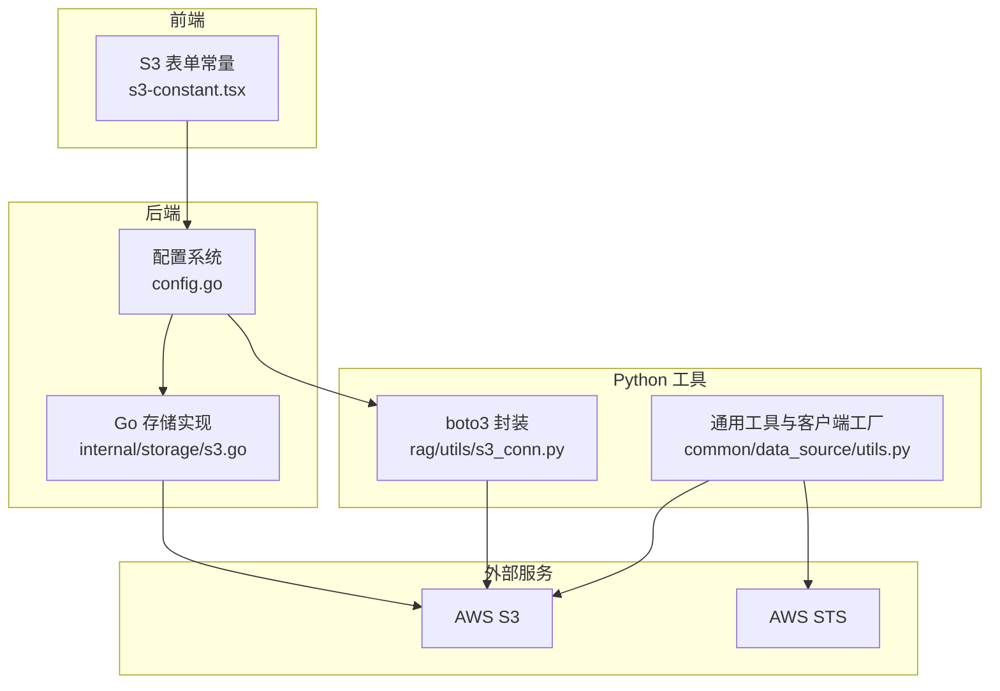
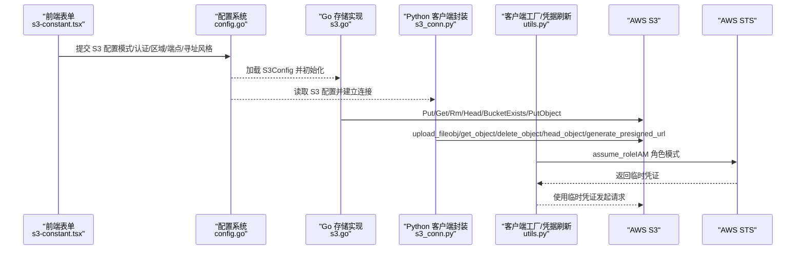
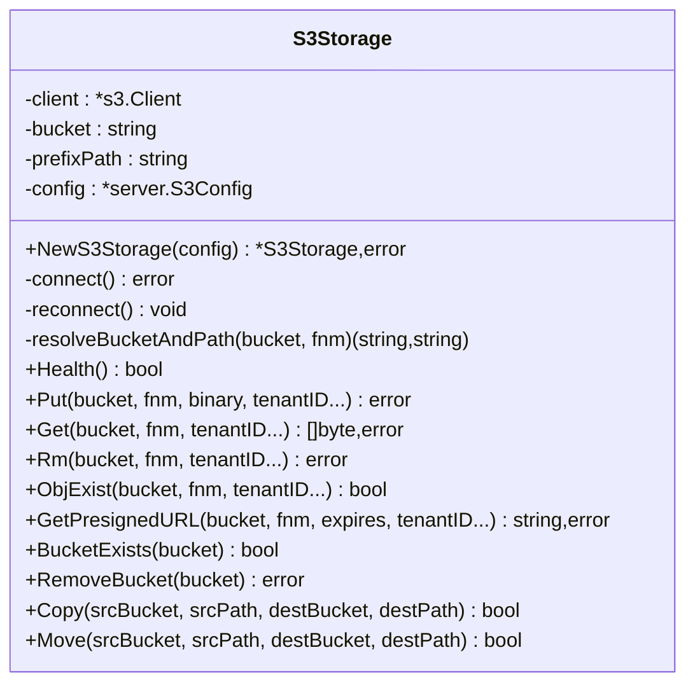
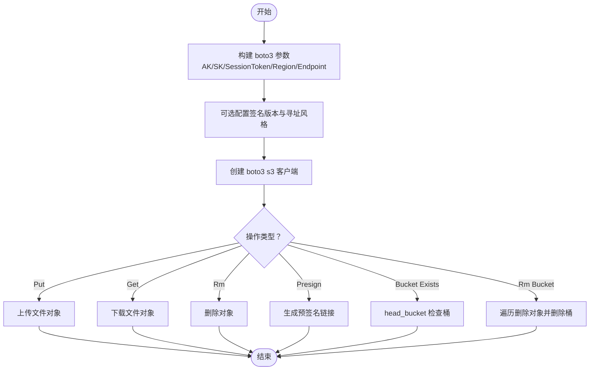
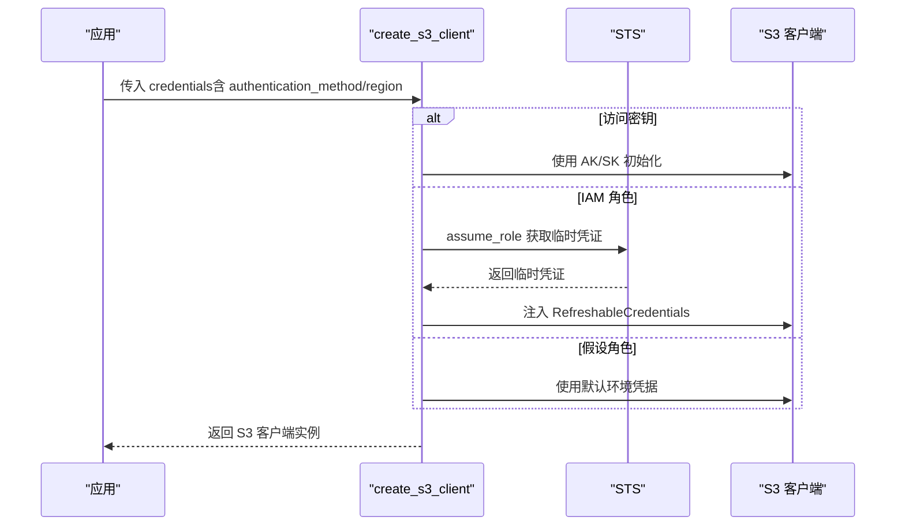
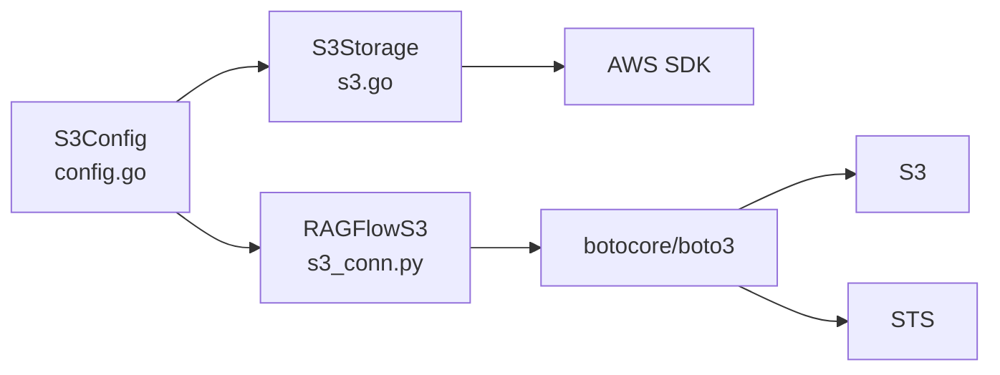

# AWS S3适配

<cite>
**本文档引用的文件**
- [s3.go](file://internal/storage/s3.go)
- [s3_conn.py](file://rag/utils/s3_conn.py)
- [utils.py](file://common/data_source/utils.py)
- [s3-constant.tsx](file://web/src/pages/user-setting/data-source/constant/s3-constant.tsx)
- [config.go](file://internal/server/config.go)
- [service_conf.yaml](file://conf/service_conf.yaml)
- [retry_wrapper.py](file://common/data_source/cross_connector_utils/retry_wrapper.py)
</cite>

## 目录
1. [引言](#引言)
2. [项目结构](#项目结构)
3. [核心组件](#核心组件)
4. [架构总览](#架构总览)
5. [详细组件分析](#详细组件分析)
6. [依赖关系分析](#依赖关系分析)
7. [性能考虑](#性能考虑)
8. [故障排除指南](#故障排除指南)
9. [结论](#结论)
10. [附录](#附录)

## 引言
本文件面向在本项目中集成与适配 AWS S3 的工程实践，系统性阐述从 SDK 集成、认证配置、区域与端点设置，到存储桶与对象操作、预签名链接生成、错误处理与重试策略、以及成本优化与 IAM 权限设计等关键主题。文档同时给出可直接落地的配置示例与性能调优建议，帮助读者快速、安全地完成 S3 适配。

## 项目结构
围绕 S3 适配的关键代码分布在以下模块：
- Go 后端存储层：提供基于 AWS SDK 的 S3 客户端封装与基础对象存储能力
- Python 工具层：提供 boto3 客户端封装与连接参数配置
- 前端表单常量：定义 S3 连接配置项与校验规则
- 配置系统：统一加载服务配置与环境变量映射
- 通用重试工具：提供通用的指数退避与抖动重试机制

**图表来源**
- [s3-constant.tsx:1-178](file://web/src/pages/user-setting/data-source/constant/s3-constant.tsx#L1-L178)
- [config.go:183-194](file://internal/server/config.go#L183-L194)
- [s3.go:35-92](file://internal/storage/s3.go#L35-L92)
- [s3_conn.py:27-42](file://rag/utils/s3_conn.py#L27-L42)
- [utils.py:239-329](file://common/data_source/utils.py#L239-L329)

**章节来源**
- [s3-constant.tsx:1-178](file://web/src/pages/user-setting/data-source/constant/s3-constant.tsx#L1-L178)
- [config.go:183-194](file://internal/server/config.go#L183-L194)
- [s3.go:35-92](file://internal/storage/s3.go#L35-L92)
- [s3_conn.py:27-42](file://rag/utils/s3_conn.py#L27-L42)
- [utils.py:239-329](file://common/data_source/utils.py#L239-L329)

## 核心组件
- S3 配置模型（Go）
  - 字段覆盖：访问密钥、会话令牌、区域、自定义端点、签名版本、寻址风格、默认桶、路径前缀
  - 作用：作为后端服务加载与初始化 AWS SDK 的依据
- S3 存储实现（Go）
  - 能力：健康检查、桶存在性检测、对象上传/下载/删除、预签名链接生成、桶级复制/移动辅助
  - 特性：内置重连与有限重试、路径前缀解析、默认桶覆盖
- boto3 S3 客户端封装（Python）
  - 能力：连接建立、桶存在性检测、对象上传/下载/删除、预签名链接生成、桶清理
  - 特性：支持签名版本与寻址风格配置、默认桶与路径前缀处理
- 客户端工厂与凭据刷新（Python）
  - 支持三种认证模式：访问密钥、IAM 角色临时凭证、假设角色（Assume Role）
  - 自动刷新 IAM 角色临时凭证，确保长期运行稳定性
- 前端 S3 表单常量
  - 定义“S3/S3 兼容”模式、“认证方式”、“区域”、“寻址风格”、“端点 URL”等配置项
  - 提供字段级校验与渲染条件，保证配置正确性

**章节来源**
- [config.go:183-194](file://internal/server/config.go#L183-L194)
- [s3.go:35-92](file://internal/storage/s3.go#L35-L92)
- [s3_conn.py:27-42](file://rag/utils/s3_conn.py#L27-L42)
- [utils.py:239-329](file://common/data_source/utils.py#L239-L329)
- [s3-constant.tsx:1-178](file://web/src/pages/user-setting/data-source/constant/s3-constant.tsx#L1-L178)

## 架构总览
下图展示从配置到 SDK 调用的完整链路，以及认证与凭据刷新的关键节点。

**图表来源**
- [s3-constant.tsx:1-178](file://web/src/pages/user-setting/data-source/constant/s3-constant.tsx#L1-L178)
- [config.go:632-643](file://internal/server/config.go#L632-L643)
- [s3.go:56-92](file://internal/storage/s3.go#L56-L92)
- [s3_conn.py:64-98](file://rag/utils/s3_conn.py#L64-L98)
- [utils.py:267-298](file://common/data_source/utils.py#L267-L298)

## 详细组件分析

### Go S3 存储实现（internal/storage/s3.go）
- 连接与重连
  - 通过 AWS SDK 默认配置加载器按需注入区域与静态凭据
  - 支持自定义端点（BaseEndpoint），用于兼容 S3 兼容服务
  - 失败时触发重连，提升网络波动下的可用性
- 对象操作
  - Put/Get/Rm：带有限次重试与自动重连
  - ObjExist：基于 HeadObject 判断对象是否存在
  - GetPresignedURL：使用 PresignClient 生成带过期时间的预签名链接
- 桶级操作
  - BucketExists：HeadBucket 检测桶是否存在
  - RemoveBucket：列出并删除所有对象后再删除桶
  - Copy/Move：基于 CopyObject 与 DeleteObject 组合实现
- 错误处理
  - isS3NotFound：识别 NotFound/404/NoSuchKey 等错误码
  - 日志记录与错误返回，便于上层捕获与降级

**图表来源**
- [s3.go:35-412](file://internal/storage/s3.go#L35-L412)

**章节来源**
- [s3.go:56-92](file://internal/storage/s3.go#L56-L92)
- [s3.go:156-194](file://internal/storage/s3.go#L156-L194)
- [s3.go:196-227](file://internal/storage/s3.go#L196-L227)
- [s3.go:229-245](file://internal/storage/s3.go#L229-L245)
- [s3.go:247-265](file://internal/storage/s3.go#L247-L265)
- [s3.go:267-291](file://internal/storage/s3.go#L267-L291)
- [s3.go:293-311](file://internal/storage/s3.go#L293-L311)
- [s3.go:313-365](file://internal/storage/s3.go#L313-L365)
- [s3.go:367-399](file://internal/storage/s3.go#L367-L399)
- [s3.go:401-411](file://internal/storage/s3.go#L401-L411)

### Python boto3 S3 客户端封装（rag/utils/s3_conn.py）
- 连接建立
  - 支持访问密钥/会话令牌/区域/端点 URL
  - 可选签名版本与寻址风格（addressing_style）
  - 单例模式避免重复连接
- 对象操作
  - put/get/rm：封装上传、下载、删除
  - obj_exist：基于 head_object 判断
  - get_presigned_url：生成预签名链接（最多重试）
- 桶级操作
  - bucket_exists：head_bucket
  - rm_bucket：递归删除对象并删除桶

**图表来源**
- [s3_conn.py:64-98](file://rag/utils/s3_conn.py#L64-L98)
- [s3_conn.py:132-198](file://rag/utils/s3_conn.py#L132-L198)

**章节来源**
- [s3_conn.py:64-98](file://rag/utils/s3_conn.py#L64-L98)
- [s3_conn.py:132-198](file://rag/utils/s3_conn.py#L132-L198)

### 客户端工厂与凭据刷新（common/data_source/utils.py）
- 认证模式
  - 访问密钥：直接使用 AK/SK 初始化会话
  - IAM 角色：通过 STS assume_role 获取临时凭证，并以 RefreshableCredentials 注入
  - 假设角色：直接使用默认环境凭据（如 EC2 角色）
- 区域与端点
  - 支持指定 region_name 或 auto（如 GCS/OCI 场景）
  - S3 兼容模式支持自定义 endpoint_url 与 addressing_style
- 客户端工厂
  - create_s3_client：根据 BlobType 与 credentials 动态创建 S3 客户端

**图表来源**
- [utils.py:239-329](file://common/data_source/utils.py#L239-L329)
- [utils.py:267-298](file://common/data_source/utils.py#L267-L298)

**章节来源**
- [utils.py:239-329](file://common/data_source/utils.py#L239-L329)
- [utils.py:267-298](file://common/data_source/utils.py#L267-L298)

### 前端 S3 配置表单（web/src/pages/user-setting/data-source/constant/s3-constant.tsx）
- 关键配置项
  - 模式：S3 / S3 兼容
  - 认证方式：Access Key / IAM Role / Assume Role
  - 区域：必填于特定模式/场景
  - 寻址风格：虚拟主机/路径风格（仅 S3 兼容）
  - 端点 URL：S3 兼容模式专用
  - 前缀：用于路径前缀组织
- 校验逻辑
  - 当使用访问密钥或 S3 兼容模式时，要求提供 AK/SK
  - 当使用 IAM 角色时，要求提供 Role ARN
  - 区域在特定条件下必填

**章节来源**
- [s3-constant.tsx:1-178](file://web/src/pages/user-setting/data-source/constant/s3-constant.tsx#L1-L178)

### 配置系统与服务配置（internal/server/config.go, conf/service_conf.yaml）
- 配置模型
  - S3Config：集中承载 S3 相关配置字段
  - StorageConfig：统一管理存储类型与各存储配置
- 配置加载
  - 优先读取配置文件（service_conf.yaml），其次读取环境变量
  - 支持 STORAGE_IMPL 控制存储实现类型（s3/minio/oss）
- 服务配置模板
  - service_conf.yaml 中包含 S3 配置注释模板，便于快速启用

**章节来源**
- [config.go:183-194](file://internal/server/config.go#L183-L194)
- [config.go:632-643](file://internal/server/config.go#L632-L643)
- [service_conf.yaml:64-88](file://conf/service_conf.yaml#L64-L88)

## 依赖关系分析
- 组件耦合
  - Go 层 S3Storage 依赖 AWS SDK；通过 S3Config 注入区域、凭据与端点
  - Python 层 S3Conn 依赖 boto3；通过 settings.S3 注入参数
  - 客户端工厂依赖 STS 实现 IAM 角色临时凭证刷新
- 外部依赖
  - AWS SDK（Go）、boto3（Python）、STS
- 潜在风险
  - 凭据泄露：应优先采用 IAM 角色或 Assume Role
  - 网络抖动：通过重试与重连缓解
  - 区域不匹配：需确保客户端与桶所在区域一致

**图表来源**
- [config.go:183-194](file://internal/server/config.go#L183-L194)
- [s3.go:56-92](file://internal/storage/s3.go#L56-L92)
- [s3_conn.py:64-98](file://rag/utils/s3_conn.py#L64-L98)
- [utils.py:267-298](file://common/data_source/utils.py#L267-L298)

**章节来源**
- [config.go:183-194](file://internal/server/config.go#L183-L194)
- [s3.go:56-92](file://internal/storage/s3.go#L56-L92)
- [s3_conn.py:64-98](file://rag/utils/s3_conn.py#L64-L98)
- [utils.py:267-298](file://common/data_source/utils.py#L267-L298)

## 性能考虑
- 分片上传与断点续传
  - 当前实现未见分片上传与断点续传逻辑，建议在大文件场景引入 multipart 上传与断点续传机制，以提升吞吐与可靠性
- 预签名链接
  - 使用 PresignClient 生成短时预签名链接，降低直传压力
- 重试与退避
  - Go 层对 Put/Get/Presign 等操作进行有限次重试与重连
  - Python 层提供通用重试装饰器，可用于对外部接口的调用
- 寻址风格与签名版本
  - 在 S3 兼容环境中，合理设置 addressing_style 与 signature_version，有助于减少兼容性问题与签名失败

**章节来源**
- [s3.go:156-194](file://internal/storage/s3.go#L156-L194)
- [s3.go:267-291](file://internal/storage/s3.go#L267-L291)
- [s3_conn.py:183-198](file://rag/utils/s3_conn.py#L183-L198)
- [retry_wrapper.py:16-43](file://common/data_source/cross_connector_utils/retry_wrapper.py#L16-L43)

## 故障排除指南
- 常见错误与定位
  - 404/NotFound/NoSuchKey：通过 isS3NotFound 判断，确认对象是否存在
  - 凭据相关错误：检查 AK/SK、Role ARN、Assume Role 权限策略
  - 区域不匹配：确保客户端 region 与桶所在区域一致
- 重试与退避
  - Go 层对 Put/Get/Presign 等操作进行有限次重试与重连
  - Python 层提供通用重试装饰器，适用于对外部接口的调用
- 健康检查
  - Go 层提供 Health 接口，自动创建测试桶与对象进行连通性验证

**章节来源**
- [s3.go:401-411](file://internal/storage/s3.go#L401-L411)
- [s3.go:114-154](file://internal/storage/s3.go#L114-L154)
- [retry_wrapper.py:16-43](file://common/data_source/cross_connector_utils/retry_wrapper.py#L16-L43)

## 结论
本项目提供了完善的 AWS S3 适配能力：从前端配置到后端 SDK 封装，再到认证与凭据刷新、错误处理与重试策略均有覆盖。对于需要进一步优化的场景（如分片上传、断点续传、成本优化与 IAM 最小权限策略），可在现有框架基础上扩展实现，以满足更高性能与更严格的安全合规要求。

## 附录

### AWS S3 适配配置清单
- Go 侧配置字段（S3Config）
  - access_key、secret_key、session_token、region_name、endpoint_url、signature_version、addressing_style、bucket、prefix_path
- Python 侧配置字段（settings.S3）
  - access_key、secret_key、session_token、region_name、endpoint_url、signature_version、addressing_style、bucket、prefix_path
- 前端配置项
  - bucket_type（S3/S3 兼容）、authentication_method（Access Key/IAM Role/Assume Role）、region、prefix、addressing_style、endpoint_url

**章节来源**
- [config.go:183-194](file://internal/server/config.go#L183-L194)
- [s3_conn.py:27-42](file://rag/utils/s3_conn.py#L27-L42)
- [s3-constant.tsx:1-178](file://web/src/pages/user-setting/data-source/constant/s3-constant.tsx#L1-L178)

### IAM 权限策略（最小权限示例）
- 读取权限
  - s3:GetObject、s3:GetBucketLocation
- 写入权限
  - s3:PutObject、s3:DeleteObject、s3:ListBucket
- 预签名链接
  - s3:GetObject（用于生成预签名链接）
- 桶级管理（如需）
  - s3:CreateBucket、s3:DeleteBucket、s3:ListBucket、s3:ListBucketVersions
- 最佳实践
  - 限制桶范围与路径前缀
  - 限制 IP/来源
  - 定期轮换密钥与审计访问日志

[本节为概念性指导，无需代码来源]