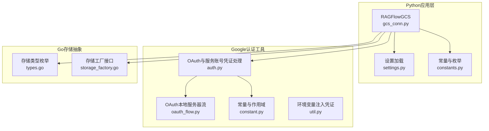
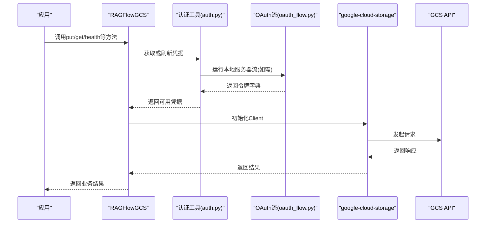
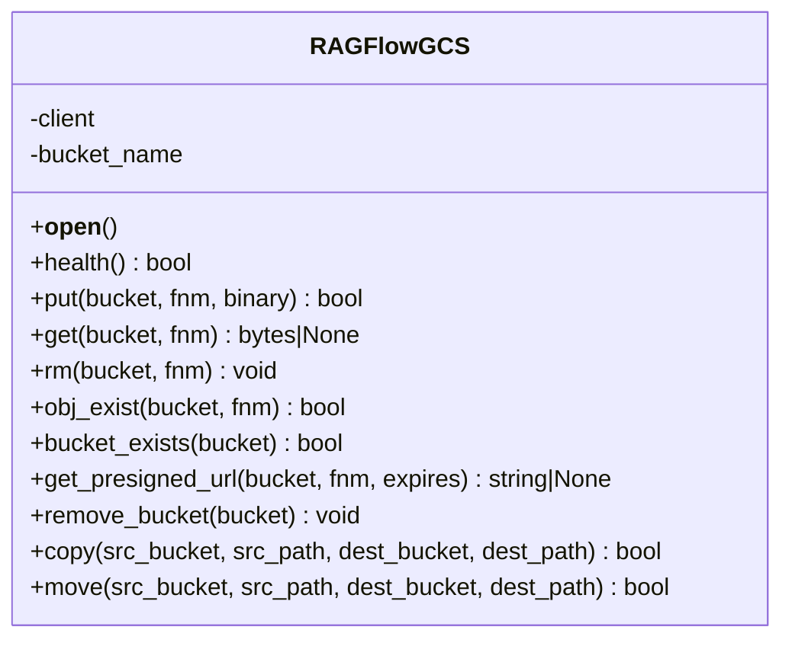
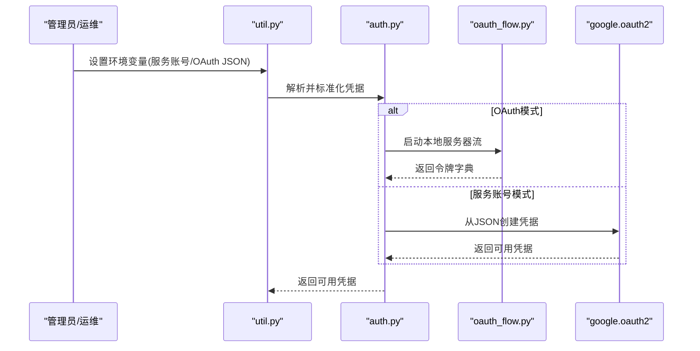
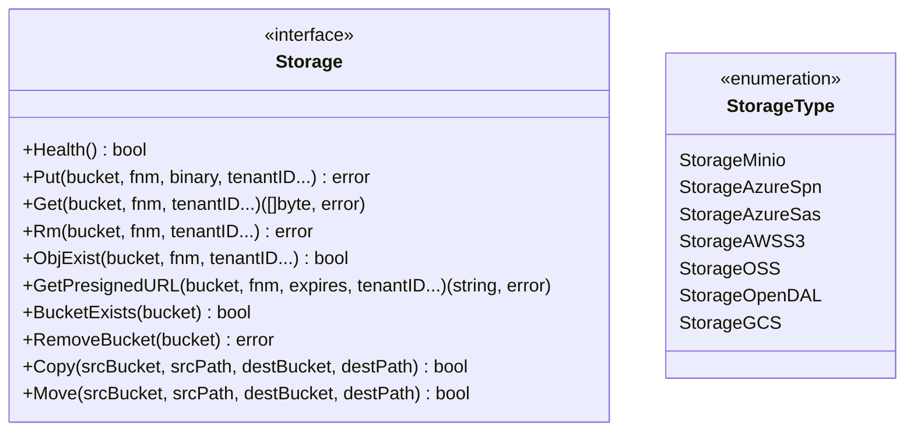
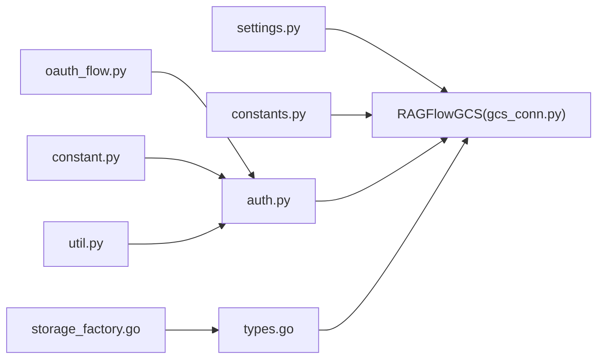

# Google Cloud Storage集成

<cite>
**本文引用的文件**
- [gcs_conn.py](file://rag/utils/gcs_conn.py)
- [settings.py](file://common/settings.py)
- [constants.py](file://common/constants.py)
- [config.py](file://common/data_source/config.py)
- [auth.py](file://common/data_source/google_util/auth.py)
- [oauth_flow.py](file://common/data_source/google_util/oauth_flow.py)
- [constant.py](file://common/data_source/google_util/constant.py)
- [util.py](file://common/data_source/google_util/util.py)
- [types.go](file://internal/storage/types.go)
- [storage_factory.go](file://internal/storage/storage_factory.go)
</cite>

## 目录
1. [简介](#简介)
2. [项目结构](#项目结构)
3. [核心组件](#核心组件)
4. [架构总览](#架构总览)
5. [详细组件分析](#详细组件分析)
6. [依赖分析](#依赖分析)
7. [性能考虑](#性能考虑)
8. [故障排除指南](#故障排除指南)
9. [结论](#结论)
10. [附录](#附录)

## 简介
本技术文档面向在系统中集成Google Cloud Storage（GCS）的工程团队，围绕以下目标展开：统一的GCS SDK集成方案、服务账号与OAuth 2.0认证流程、存储桶与对象操作、预签名URL生成、以及与系统现有存储抽象层的对接方式。文档同时提供配置要点、权限设计建议、性能优化与成本管理策略，并给出可操作的排障步骤。

## 项目结构
本仓库采用多语言混合架构，GCS能力主要由Python侧的RAGFlowGCS封装器提供，配合通用设置与常量定义；Go侧提供存储类型枚举与工厂接口，用于统一抽象不同后端存储。关键位置如下：
- Python侧GCS封装器：[gcs_conn.py](file://rag/utils/gcs_conn.py)
- 设置与存储类型映射：[settings.py](file://common/settings.py)、[constants.py](file://common/constants.py)
- Google OAuth与服务账号工具：[auth.py](file://common/data_source/google_util/auth.py)、[oauth_flow.py](file://common/data_source/google_util/oauth_flow.py)、[constant.py](file://common/data_source/google_util/constant.py)、[util.py](file://common/data_source/google_util/util.py)
- Go侧存储抽象与类型：[types.go](file://internal/storage/types.go)、[storage_factory.go](file://internal/storage/storage_factory.go)

**图表来源**
- [gcs_conn.py:26-208](file://rag/utils/gcs_conn.py#L26-L208)
- [settings.py:300-336](file://common/settings.py#L300-L336)
- [constants.py:167-174](file://common/constants.py#L167-L174)
- [auth.py:37-127](file://common/data_source/google_util/auth.py#L37-L127)
- [oauth_flow.py:52-122](file://common/data_source/google_util/oauth_flow.py#L52-L122)
- [constant.py:8-20](file://common/data_source/google_util/constant.py#L8-L20)
- [util.py:160-192](file://common/data_source/google_util/util.py#L160-L192)
- [types.go:31-42](file://internal/storage/types.go#L31-L42)
- [storage_factory.go:31-75](file://internal/storage/storage_factory.go#L31-L75)

**章节来源**
- [gcs_conn.py:26-208](file://rag/utils/gcs_conn.py#L26-L208)
- [settings.py:300-336](file://common/settings.py#L300-L336)
- [constants.py:167-174](file://common/constants.py#L167-L174)

## 核心组件
- RAGFlowGCS：基于google-cloud-storage SDK的单例封装，提供健康检查、对象上传/下载/删除、存在性检查、预签名URL生成、虚拟桶（前缀）清理、复制与移动等操作。
- 认证工具链：支持OAuth 2.0（本地服务器流/控制台回退）、服务账号凭据刷新与校验、令牌字典标准化与持久化。
- 存储抽象：Go侧定义Storage接口与StorageType枚举，便于在多后端场景下统一调用。

**章节来源**
- [gcs_conn.py:26-208](file://rag/utils/gcs_conn.py#L26-L208)
- [auth.py:37-127](file://common/data_source/google_util/auth.py#L37-L127)
- [oauth_flow.py:52-122](file://common/data_source/google_util/oauth_flow.py#L52-L122)
- [types.go:65-102](file://internal/storage/types.go#L65-L102)

## 架构总览
下图展示从应用到GCS SDK与认证工具的整体交互路径，以及与Go侧存储抽象的关系。

**图表来源**
- [gcs_conn.py:33-45](file://rag/utils/gcs_conn.py#L33-L45)
- [auth.py:37-127](file://common/data_source/google_util/auth.py#L37-L127)
- [oauth_flow.py:52-122](file://common/data_source/google_util/oauth_flow.py#L52-L122)

## 详细组件分析

### RAGFlowGCS组件分析
RAGFlowGCS通过单例模式持有storage.Client实例，集中管理GCS连接与操作。其核心方法包括：
- 健康检查：在主桶内写入一个临时对象进行连通性验证。
- 对象操作：put（上传）、get（下载）、rm（删除）、obj_exist（存在性检查）。
- 预签名URL：generate_signed_url生成带过期时间的URL，支持GET方法。
- 虚拟桶清理：按前缀列出并批量删除对象，模拟“删除桶”行为。
- 复制与移动：copy与move组合实现对象级迁移。

**图表来源**
- [gcs_conn.py:26-208](file://rag/utils/gcs_conn.py#L26-L208)

**章节来源**
- [gcs_conn.py:26-208](file://rag/utils/gcs_conn.py#L26-L208)

### 认证与授权流程
系统同时支持两种认证方式：
- OAuth 2.0（用户授权）：通过InstalledAppFlow运行本地服务器流，支持超时控制与控制台回退；可覆盖作用域。
- 服务账号（Service Account）：从JSON密钥加载凭据，自动刷新并校验有效性。

**图表来源**
- [util.py:160-192](file://common/data_source/google_util/util.py#L160-L192)
- [auth.py:37-127](file://common/data_source/google_util/auth.py#L37-L127)
- [oauth_flow.py:52-122](file://common/data_source/google_util/oauth_flow.py#L52-L122)

**章节来源**
- [util.py:160-192](file://common/data_source/google_util/util.py#L160-L192)
- [auth.py:37-127](file://common/data_source/google_util/auth.py#L37-L127)
- [oauth_flow.py:52-122](file://common/data_source/google_util/oauth_flow.py#L52-L122)
- [constant.py:8-20](file://common/data_source/google_util/constant.py#L8-L20)

### 存储抽象与类型映射
Go侧定义了统一的Storage接口与StorageType枚举，其中包含StorageGCS类型。该抽象允许在不修改上层逻辑的情况下切换后端实现。

**图表来源**
- [types.go:65-102](file://internal/storage/types.go#L65-L102)
- [types.go:31-42](file://internal/storage/types.go#L31-L42)

**章节来源**
- [types.go:31-102](file://internal/storage/types.go#L31-L102)
- [storage_factory.go:31-75](file://internal/storage/storage_factory.go#L31-L75)

## 依赖分析
- Python侧对google-cloud-storage的直接依赖体现在RAGFlowGCS初始化与对象操作中。
- 认证模块依赖google-auth系列库（oauth2.credentials、oauth2.service_account），并通过环境变量与令牌字典驱动。
- 设置模块根据环境变量选择GCS实现并注入配置。
- Go侧存储抽象与工厂用于统一多后端接口，便于扩展其他存储后端。

**图表来源**
- [settings.py:300-336](file://common/settings.py#L300-L336)
- [gcs_conn.py:26-45](file://rag/utils/gcs_conn.py#L26-L45)
- [auth.py:37-127](file://common/data_source/google_util/auth.py#L37-L127)
- [oauth_flow.py:52-122](file://common/data_source/google_util/oauth_flow.py#L52-L122)
- [constant.py:8-20](file://common/data_source/google_util/constant.py#L8-L20)
- [util.py:160-192](file://common/data_source/google_util/util.py#L160-L192)
- [types.go:31-42](file://internal/storage/types.go#L31-L42)
- [storage_factory.go:31-75](file://internal/storage/storage_factory.go#L31-L75)

**章节来源**
- [settings.py:300-336](file://common/settings.py#L300-L336)
- [gcs_conn.py:26-45](file://rag/utils/gcs_conn.py#L26-L45)
- [auth.py:37-127](file://common/data_source/google_util/auth.py#L37-L127)

## 性能考虑
- 连接复用：RAGFlowGCS采用单例持有storage.Client，避免重复初始化带来的开销。
- 重试与降级：对象操作内部包含异常捕获与重连逻辑，必要时重建客户端连接。
- 预签名URL：通过generate_signed_url生成短时有效的直链，减少服务端代理转发的CPU与内存消耗。
- 批量清理：remove_bucket按前缀列出并批量删除，降低多次RPC次数。
- 传输优化：上传使用二进制流，下载返回字节串，适合大文件分块策略（结合上层调用方的分片机制）。

**章节来源**
- [gcs_conn.py:68-85](file://rag/utils/gcs_conn.py#L68-L85)
- [gcs_conn.py:136-158](file://rag/utils/gcs_conn.py#L136-L158)
- [gcs_conn.py:160-172](file://rag/utils/gcs_conn.py#L160-L172)

## 故障排除指南
- 连接失败
  - 现象：健康检查或对象操作抛出异常。
  - 排查：确认GCS凭据有效、网络可达、主桶名称正确。
  - 参考：[gcs_conn.py:42-44](file://rag/utils/gcs_conn.py#L42-L44)
- 主桶不存在
  - 现象：健康检查提示主桶不存在。
  - 排查：检查settings中的bucket配置是否与实际一致。
  - 参考：[gcs_conn.py:56-58](file://rag/utils/gcs_conn.py#L56-L58)
- OAuth超时
  - 现象：本地服务器流超时或浏览器未弹出。
  - 排查：调整超时时间、允许控制台回退、检查端口占用。
  - 参考：[oauth_flow.py:20-26](file://common/data_source/google_util/oauth_flow.py#L20-L26)
- 作用域变更
  - 现象：OAuth提示作用域变更或被拒绝。
  - 排查：在Google Cloud Console更新OAuth同意屏幕或使用覆盖参数。
  - 参考：[oauth_flow.py:87-94](file://common/data_source/google_util/oauth_flow.py#L87-L94)
- 凭据缺失
  - 现象：OAuth凭据缺少令牌或客户端配置。
  - 排查：重新执行OAuth流程或检查环境变量JSON格式。
  - 参考：[auth.py:109-121](file://common/data_source/google_util/auth.py#L109-L121)
- 预签名URL为空
  - 现象：生成URL失败返回None。
  - 排查：检查对象是否存在、过期时间单位、网络连通性。
  - 参考：[gcs_conn.py:136-158](file://rag/utils/gcs_conn.py#L136-L158)

**章节来源**
- [gcs_conn.py:42-44](file://rag/utils/gcs_conn.py#L42-L44)
- [gcs_conn.py:56-58](file://rag/utils/gcs_conn.py#L56-L58)
- [oauth_flow.py:20-26](file://common/data_source/google_util/oauth_flow.py#L20-L26)
- [oauth_flow.py:87-94](file://common/data_source/google_util/oauth_flow.py#L87-L94)
- [auth.py:109-121](file://common/data_source/google_util/auth.py#L109-L121)
- [gcs_conn.py:136-158](file://rag/utils/gcs_conn.py#L136-L158)

## 结论
本项目通过RAGFlowGCS实现了对GCS的统一封装，结合OAuth与服务账号两种认证路径，满足不同部署场景下的安全与可用性需求。配合Go侧存储抽象，系统具备良好的可扩展性。建议在生产环境中优先采用服务账号并启用最小权限原则，合理设置预签名URL有效期与缓存策略，以平衡安全性与性能。

## 附录

### GCS SDK集成方案与最佳实践
- 服务账号配置
  - 使用专用服务账号，绑定最小权限角色（如Storage Object Viewer/Creator/Deleter）。
  - 将JSON密钥保存在受控环境变量中，避免硬编码。
  - 参考：[util.py:160-192](file://common/data_source/google_util/util.py#L160-L192)、[auth.py:110-121](file://common/data_source/google_util/auth.py#L110-L121)
- OAuth 2.0认证流程
  - 本地服务器流支持超时与控制台回退，适合首次配置与运维场景。
  - 可通过覆盖参数限制作用域，避免因权限不足导致的授权失败。
  - 参考：[oauth_flow.py:52-122](file://common/data_source/google_util/oauth_flow.py#L52-L122)、[constant.py:8-20](file://common/data_source/google_util/constant.py#L8-L20)
- 存储桶与对象操作
  - 建议将租户/会话隔离在“虚拟桶”（前缀）中，使用remove_bucket按前缀清理。
  - 对大文件采用分片上传策略（结合上层调用方），并利用预签名URL直传。
  - 参考：[gcs_conn.py:160-172](file://rag/utils/gcs_conn.py#L160-L172)、[gcs_conn.py:136-158](file://rag/utils/gcs_conn.py#L136-L158)
- 预签名URL与直链
  - 生成短期有效URL，减少服务端代理压力；注意URL泄露风险，及时轮换。
  - 参考：[gcs_conn.py:136-158](file://rag/utils/gcs_conn.py#L136-L158)
- 权限与合规
  - 遵循最小权限原则，定期审计服务账号与OAuth令牌范围。
  - 参考：[constant.py:8-20](file://common/data_source/google_util/constant.py#L8-L20)
- 成本与性能
  - 选择合适存储类别与区域，结合生命周期规则与冷数据归档策略。
  - 利用预签名URL与CDN缓存，降低服务端带宽与计算成本。
  - 参考：[gcs_conn.py:136-158](file://rag/utils/gcs_conn.py#L136-L158)