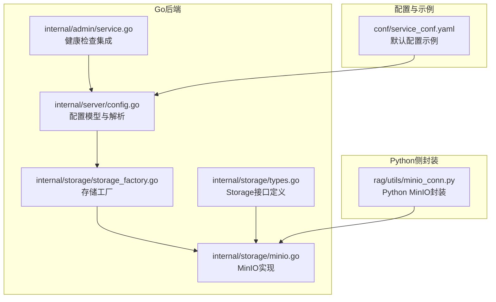
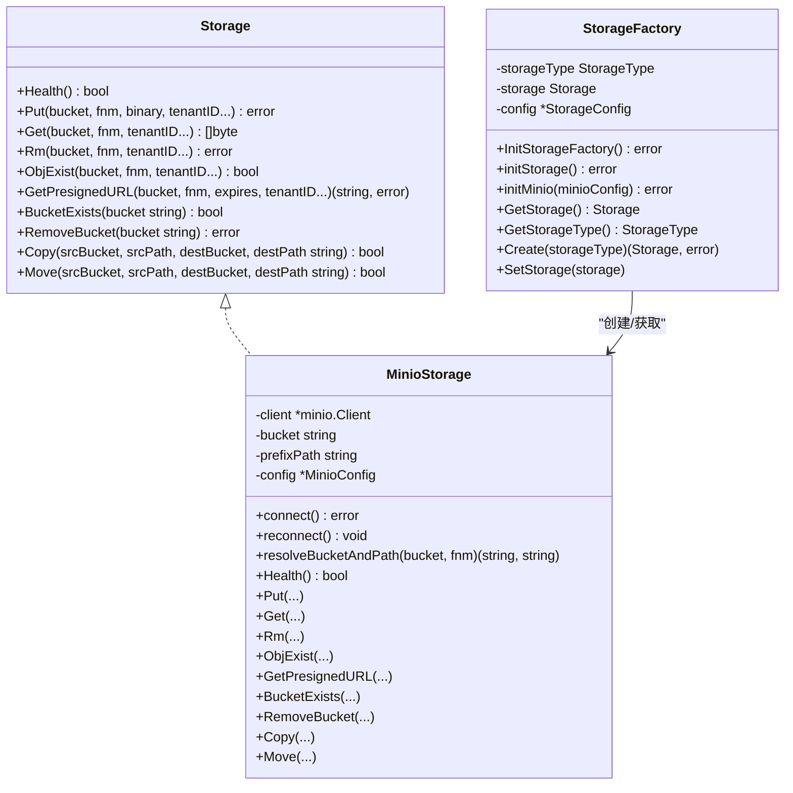
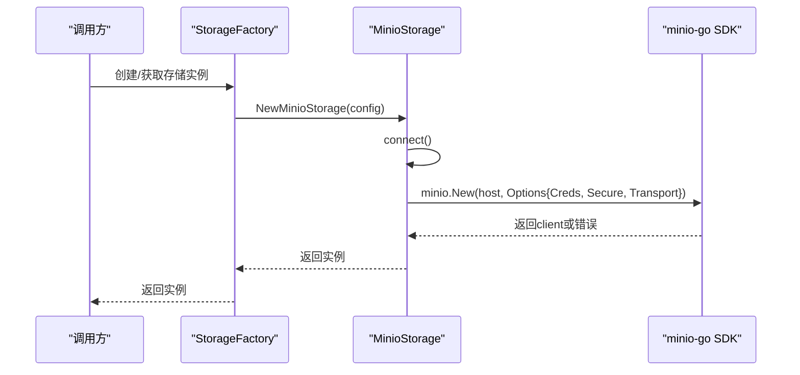
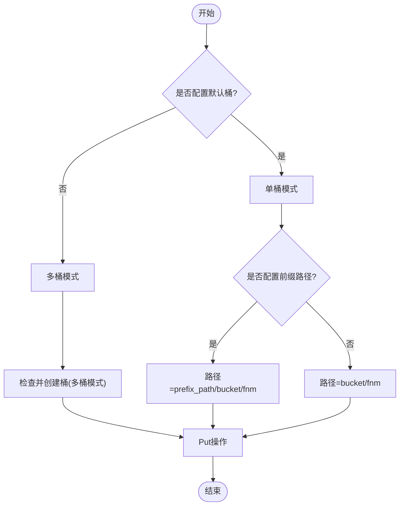
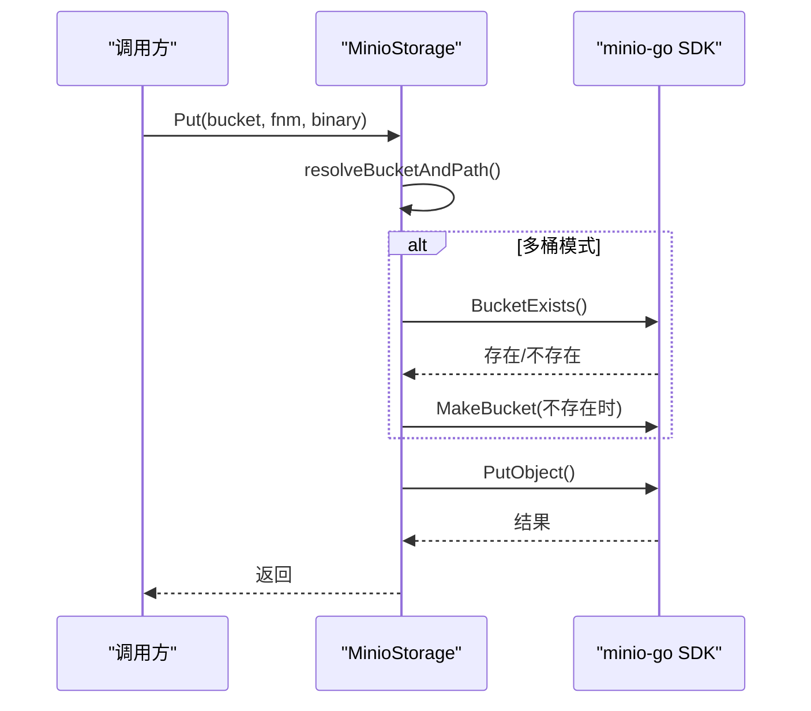
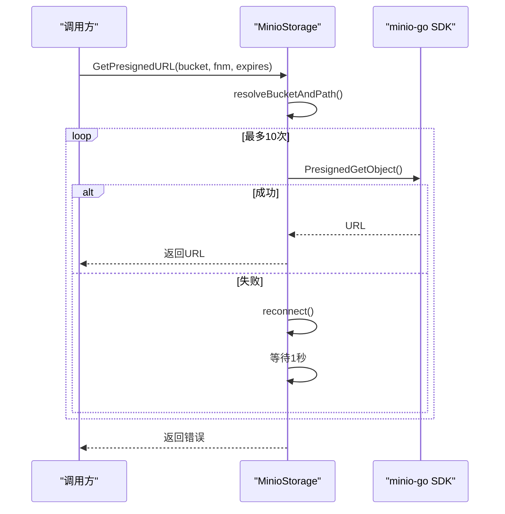
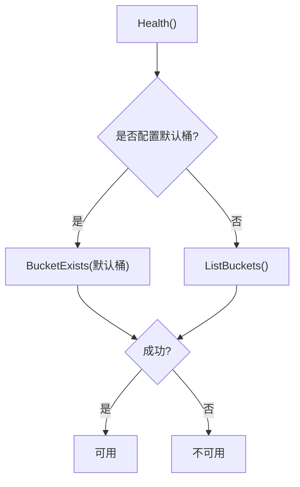
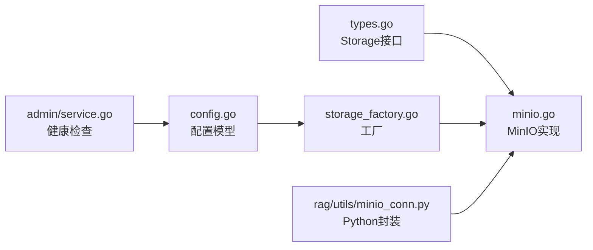

# MinIO存储服务

<cite>
**本文引用的文件列表**
- [internal/storage/minio.go](file://internal/storage/minio.go)
- [internal/storage/types.go](file://internal/storage/types.go)
- [internal/storage/storage_factory.go](file://internal/storage/storage_factory.go)
- [internal/server/config.go](file://internal/server/config.go)
- [internal/admin/service.go](file://internal/admin/service.go)
- [conf/service_conf.yaml](file://conf/service_conf.yaml)
- [rag/utils/minio_conn.py](file://rag/utils/minio_conn.py)
</cite>

## 目录
1. [简介](#简介)
2. [项目结构](#项目结构)
3. [核心组件](#核心组件)
4. [架构总览](#架构总览)
5. [详细组件分析](#详细组件分析)
6. [依赖关系分析](#依赖关系分析)
7. [性能考量](#性能考量)
8. [故障排查指南](#故障排查指南)
9. [结论](#结论)
10. [附录](#附录)

## 简介
本文件面向MinIO存储服务的技术文档，聚焦于客户端初始化流程、连接参数与认证配置、桶管理与对象操作、预签名URL生成、健康检查、单桶与多桶模式差异以及前缀路径配置的作用。同时提供配置示例、错误处理策略、重试机制与性能优化建议，帮助开发者在生产环境中稳定、高效地使用MinIO。

## 项目结构
MinIO相关实现主要位于Go后端的internal/storage目录中，并通过工厂模式统一对外暴露接口；Python侧也提供了兼容的封装以适配不同运行环境。

图表来源
- [internal/server/config.go:172-181](file://internal/server/config.go#L172-L181)
- [internal/storage/types.go:65-102](file://internal/storage/types.go#L65-L102)
- [internal/storage/minio.go:33-38](file://internal/storage/minio.go#L33-L38)
- [internal/storage/storage_factory.go:64-90](file://internal/storage/storage_factory.go#L64-L90)
- [internal/admin/service.go:1226-1282](file://internal/admin/service.go#L1226-L1282)
- [conf/service_conf.yaml:16-21](file://conf/service_conf.yaml#L16-L21)
- [rag/utils/minio_conn.py:64-90](file://rag/utils/minio_conn.py#L64-L90)

章节来源
- [internal/server/config.go:172-181](file://internal/server/config.go#L172-L181)
- [internal/storage/types.go:65-102](file://internal/storage/types.go#L65-L102)
- [internal/storage/minio.go:33-38](file://internal/storage/minio.go#L33-L38)
- [internal/storage/storage_factory.go:64-90](file://internal/storage/storage_factory.go#L64-L90)
- [internal/admin/service.go:1226-1282](file://internal/admin/service.go#L1226-L1282)
- [conf/service_conf.yaml:16-21](file://conf/service_conf.yaml#L16-L21)
- [rag/utils/minio_conn.py:64-90](file://rag/utils/minio_conn.py#L64-L90)

## 核心组件
- 存储接口：定义了统一的存储能力集合，包括Put、Get、Rm、ObjExist、GetPresignedURL、BucketExists、RemoveBucket、Copy、Move、Health等方法。
- MinIO实现：基于minio-go SDK实现具体逻辑，支持连接参数配置、认证凭据、单桶/多桶模式、前缀路径、健康检查、对象操作与预签名URL生成。
- 存储工厂：根据配置选择MinIO、S3或OSS实现，提供统一的创建与获取接口。
- 配置模型：集中定义MinIO配置字段，支持从YAML与环境变量加载。
- 健康检查：在管理服务中对MinIO进行连通性检测，结合配置解析与scheme推断。
- Python封装：提供装饰器与路径解析逻辑，兼容单桶/多桶与前缀路径场景。

章节来源
- [internal/storage/types.go:65-102](file://internal/storage/types.go#L65-L102)
- [internal/storage/minio.go:129-387](file://internal/storage/minio.go#L129-L387)
- [internal/storage/storage_factory.go:64-90](file://internal/storage/storage_factory.go#L64-L90)
- [internal/server/config.go:172-181](file://internal/server/config.go#L172-L181)
- [internal/admin/service.go:1226-1282](file://internal/admin/service.go#L1226-L1282)
- [rag/utils/minio_conn.py:64-90](file://rag/utils/minio_conn.py#L64-L90)

## 架构总览
MinIO存储服务采用“接口抽象 + 具体实现 + 工厂模式”的分层设计：
- 接口层：统一的Storage接口，屏蔽底层差异。
- 实现层：MinIO实现负责连接、桶管理、对象操作、预签名URL与健康检查。
- 工厂层：依据配置动态创建MinIO实例，便于切换其他后端。
- 配置层：集中解析YAML与环境变量，生成运行时配置。
- 管理层：在后台服务中执行健康检查，确保MinIO可用。

图表来源
- [internal/storage/types.go:65-102](file://internal/storage/types.go#L65-L102)
- [internal/storage/minio.go:33-38](file://internal/storage/minio.go#L33-L38)
- [internal/storage/storage_factory.go:31-90](file://internal/storage/storage_factory.go#L31-L90)

## 详细组件分析

### 客户端初始化与连接参数配置
- 连接参数
  - 主机地址与端口：来自配置中的host字段，支持“host:port”格式或URL形式。
  - SSL/TLS：secure为true时启用HTTPS；verify控制是否校验证书有效性。
  - 认证凭据：使用静态凭证（Access Key/Secret Key）初始化客户端。
- 传输层配置：当启用安全连接时，根据verify设置TLS客户端配置。
- 初始化流程：构造minio.Client并缓存，后续复用；失败时返回错误。

图表来源
- [internal/storage/storage_factory.go:77-90](file://internal/storage/storage_factory.go#L77-L90)
- [internal/storage/minio.go:56-80](file://internal/storage/minio.go#L56-L80)

章节来源
- [internal/storage/minio.go:56-80](file://internal/storage/minio.go#L56-L80)
- [internal/server/config.go:172-181](file://internal/server/config.go#L172-L181)

### 认证凭据设置
- 凭据类型：使用静态V4凭证（Access Key/Secret Key），不使用会话令牌。
- 凭据注入：通过minio.Options.Creds传入，确保与MinIO服务端一致。
- 注意事项：在多租户或动态密钥场景下，应确保凭据更新与轮换策略。

章节来源
- [internal/storage/minio.go:69-73](file://internal/storage/minio.go#L69-L73)

### 桶管理功能
- 桶存在性检查：通过BucketExists判断目标桶是否存在。
- 自动创建桶：在多桶模式且未指定默认桶时，Put操作会先检查并创建桶。
- 删除桶及其中所有对象：RemoveBucket会按前缀列出并批量删除对象，再决定是否删除物理桶（单桶模式保留物理桶）。
- 单桶/多桶模式：
  - 多桶模式：直接使用传入的bucket名；Put时若不存在则创建。
  - 单桶模式：所有对象写入到同一物理桶，路径由前缀路径与原始桶名组合构成。
- 前缀路径作用：在单桶模式下，通过prefix_path与原始bucket组合形成“虚拟子空间”，隔离不同业务域或租户数据。

图表来源
- [internal/storage/minio.go:88-106](file://internal/storage/minio.go#L88-L106)
- [internal/storage/minio.go:135-153](file://internal/storage/minio.go#L135-L153)
- [internal/storage/minio.go:277-327](file://internal/storage/minio.go#L277-L327)

章节来源
- [internal/storage/minio.go:88-106](file://internal/storage/minio.go#L88-L106)
- [internal/storage/minio.go:135-153](file://internal/storage/minio.go#L135-L153)
- [internal/storage/minio.go:277-327](file://internal/storage/minio.go#L277-L327)

### 对象操作实现
- Put上传：解析最终桶与路径，多桶模式下确保桶存在，然后上传二进制数据。
- Get下载：解析最终桶与路径，读取对象内容并返回字节流。
- Rm删除：解析最终桶与路径，删除指定对象。
- ObjExist存在性检查：先确认桶存在，再查询对象状态，区分NoSuchKey/NoSuchBucket等错误。
- Copy复制：源与目的均需解析路径；目的桶不存在时在多桶模式下自动创建；检查源对象存在后发起复制。
- Move移动：基于Copy成功后删除源对象，失败则记录错误。

图表来源
- [internal/storage/minio.go:129-168](file://internal/storage/minio.go#L129-L168)
- [internal/storage/minio.go:170-198](file://internal/storage/minio.go#L170-L198)
- [internal/storage/minio.go:200-212](file://internal/storage/minio.go#L200-L212)
- [internal/storage/minio.go:214-236](file://internal/storage/minio.go#L214-L236)
- [internal/storage/minio.go:329-387](file://internal/storage/minio.go#L329-L387)

章节来源
- [internal/storage/minio.go:129-168](file://internal/storage/minio.go#L129-L168)
- [internal/storage/minio.go:170-198](file://internal/storage/minio.go#L170-L198)
- [internal/storage/minio.go:200-212](file://internal/storage/minio.go#L200-L212)
- [internal/storage/minio.go:214-236](file://internal/storage/minio.go#L214-L236)
- [internal/storage/minio.go:329-387](file://internal/storage/minio.go#L329-L387)

### 预签名URL生成机制
- 生成流程：解析最终桶与路径，循环尝试生成预签名URL，失败时重连并等待1秒后重试，最多10次。
- 适用场景：临时授权访问对象，避免长期暴露凭证；可设置过期时间。
- 与健康检查的关系：预签名URL生成失败通常意味着底层连接异常，触发重连与重试。

图表来源
- [internal/storage/minio.go:238-257](file://internal/storage/minio.go#L238-L257)

章节来源
- [internal/storage/minio.go:238-257](file://internal/storage/minio.go#L238-L257)

### 健康检查实现
- Go侧健康检查：若配置了默认桶，则检查该桶是否存在；否则尝试列举所有桶，任一失败即判定不可用。
- 管理服务集成：从全局配置中提取MinIO主机、端口与安全标志，推断scheme（http/https），并执行连通性检测。
- Python侧封装：提供装饰器与路径解析，支持单桶/多桶模式下的健康检查。

图表来源
- [internal/storage/minio.go:108-127](file://internal/storage/minio.go#L108-L127)
- [internal/admin/service.go:1226-1282](file://internal/admin/service.go#L1226-L1282)
- [rag/utils/minio_conn.py:132-142](file://rag/utils/minio_conn.py#L132-L142)

章节来源
- [internal/storage/minio.go:108-127](file://internal/storage/minio.go#L108-L127)
- [internal/admin/service.go:1226-1282](file://internal/admin/service.go#L1226-L1282)
- [rag/utils/minio_conn.py:132-142](file://rag/utils/minio_conn.py#L132-L142)

### 单桶模式与多桶模式的区别
- 多桶模式：每个业务域/租户使用独立桶；Put时若桶不存在则自动创建；RemoveBucket会删除物理桶。
- 单桶模式：所有业务域共享一个物理桶，通过prefix_path与原始bucket组合形成虚拟子空间；RemoveBucket仅删除该子空间内对象，不删除物理桶。

章节来源
- [internal/storage/minio.go:88-106](file://internal/storage/minio.go#L88-L106)
- [internal/storage/minio.go:277-327](file://internal/storage/minio.go#L277-L327)
- [rag/utils/minio_conn.py:227-251](file://rag/utils/minio_conn.py#L227-L251)

### 前缀路径配置的作用
- 在单桶模式下，prefix_path与原始bucket共同构成对象键的前缀，实现逻辑隔离。
- 在多桶模式下，prefix_path可选，用于进一步细分命名空间。
- Python封装中同样提供装饰器解析与路径拼接逻辑，保持一致性。

章节来源
- [internal/storage/minio.go:88-106](file://internal/storage/minio.go#L88-L106)
- [rag/utils/minio_conn.py:64-90](file://rag/utils/minio_conn.py#L64-L90)

## 依赖关系分析
- MinIO实现依赖minio-go SDK与zap日志库。
- 工厂模式解耦配置与实现，便于扩展S3/OSS等其他后端。
- 管理服务依赖全局配置解析结果，用于健康检查。

图表来源
- [internal/storage/types.go:65-102](file://internal/storage/types.go#L65-L102)
- [internal/storage/minio.go:33-38](file://internal/storage/minio.go#L33-L38)
- [internal/storage/storage_factory.go:64-90](file://internal/storage/storage_factory.go#L64-L90)
- [internal/admin/service.go:1226-1282](file://internal/admin/service.go#L1226-L1282)
- [rag/utils/minio_conn.py:64-90](file://rag/utils/minio_conn.py#L64-L90)

章节来源
- [internal/storage/types.go:65-102](file://internal/storage/types.go#L65-L102)
- [internal/storage/minio.go:33-38](file://internal/storage/minio.go#L33-L38)
- [internal/storage/storage_factory.go:64-90](file://internal/storage/storage_factory.go#L64-L90)
- [internal/admin/service.go:1226-1282](file://internal/admin/service.go#L1226-L1282)
- [rag/utils/minio_conn.py:64-90](file://rag/utils/minio_conn.py#L64-L90)

## 性能考量
- 重试策略：Put/Get/预签名URL等关键操作内置有限次数重试，失败时触发重连与短暂退避，提升稳定性。
- 批量删除：RemoveBucket使用并发通道列出与删除对象，减少多次往返开销。
- 单桶模式：通过前缀路径实现逻辑隔离，避免频繁创建/删除桶带来的元数据压力。
- 建议：在高并发场景下，合理设置重试次数与退避策略，避免雪崩效应；对大对象上传建议使用分块上传（如需要）以提升吞吐。

章节来源
- [internal/storage/minio.go:135-168](file://internal/storage/minio.go#L135-L168)
- [internal/storage/minio.go:176-198](file://internal/storage/minio.go#L176-L198)
- [internal/storage/minio.go:238-257](file://internal/storage/minio.go#L238-L257)
- [internal/storage/minio.go:298-327](file://internal/storage/minio.go#L298-L327)

## 故障排查指南
- 连接失败
  - 检查host与端口配置是否正确，确认网络可达。
  - 若启用HTTPS，verify为false可能导致证书校验失败；请根据实际环境调整。
- 权限不足
  - 确认Access Key/Secret Key具备相应权限；在单桶模式下可能需要创建桶权限。
- 桶不存在
  - 多桶模式下Put会自动创建桶；若失败，请检查桶名合法性与服务端策略。
- 对象不存在
  - 使用ObjExist进行存在性检查；注意NoSuchKey/NoSuchBucket错误码。
- 预签名URL失败
  - 观察重试日志，确认连接恢复与重试是否生效；必要时缩短过期时间。
- 健康检查失败
  - Go侧：检查默认桶是否存在或是否可列举；管理侧：确认scheme与端口推断正确。

章节来源
- [internal/storage/minio.go:56-80](file://internal/storage/minio.go#L56-L80)
- [internal/storage/minio.go:135-168](file://internal/storage/minio.go#L135-L168)
- [internal/storage/minio.go:214-236](file://internal/storage/minio.go#L214-L236)
- [internal/storage/minio.go:238-257](file://internal/storage/minio.go#L238-L257)
- [internal/admin/service.go:1226-1282](file://internal/admin/service.go#L1226-L1282)

## 结论
MinIO存储服务通过清晰的接口抽象、完善的重试与健康检查机制、灵活的单桶/多桶与前缀路径配置，实现了在复杂业务场景下的稳定与可扩展性。建议在生产环境中结合自身安全与性能需求，合理配置SSL/TLS、重试策略与桶/路径规划，并持续监控健康状态与错误日志。

## 附录

### 配置示例
- YAML配置示例（默认值）
  - 参考路径：conf/service_conf.yaml
  - 关键字段：minio.user、minio.password、minio.host、minio.bucket、minio.prefix_path
- 环境变量覆盖
  - STORAGE_IMPL=minio
  - RAGFLOW_MINIO_HOST/RAGFLOW_MINIO_USER/RAGFLOW_MINIO_PASSWORD/RAGFLOW_MINIO_SECURE/RAGFLOW_MINIO_VERIFY/RAGFLOW_MINIO_BUCKET/RAGFLOW_MINIO_PREFIX_PATH

章节来源
- [conf/service_conf.yaml:16-21](file://conf/service_conf.yaml#L16-L21)
- [internal/server/config.go:427-443](file://internal/server/config.go#L427-L443)

### 错误处理策略
- 统一日志记录：对关键操作失败进行错误日志输出，便于定位问题。
- 分类错误码：针对NoSuchKey/NoSuchBucket等常见错误进行分支处理。
- 重试与回退：在可重试场景（如网络抖动）自动重试并触发重连。

章节来源
- [internal/storage/minio.go:140-167](file://internal/storage/minio.go#L140-L167)
- [internal/storage/minio.go:178-197](file://internal/storage/minio.go#L178-L197)
- [internal/storage/minio.go:227-233](file://internal/storage/minio.go#L227-L233)

### 重试机制实现
- Put/Get/预签名URL：内置固定次数重试，失败时触发重连与短暂退避。
- RemoveBucket：通过并发通道批量删除对象，减少失败重试成本。

章节来源
- [internal/storage/minio.go:135-168](file://internal/storage/minio.go#L135-L168)
- [internal/storage/minio.go:176-198](file://internal/storage/minio.go#L176-L198)
- [internal/storage/minio.go:238-257](file://internal/storage/minio.go#L238-L257)
- [internal/storage/minio.go:298-327](file://internal/storage/minio.go#L298-L327)

### 性能优化建议
- 合理设置重试次数与退避策略，避免在瞬时故障下放大请求压力。
- 在单桶模式下利用前缀路径实现逻辑隔离，减少桶级元数据操作。
- 对大文件上传考虑分块上传与并发策略，结合服务端限制进行调优。

章节来源
- [internal/storage/minio.go:88-106](file://internal/storage/minio.go#L88-L106)
- [internal/storage/minio.go:298-327](file://internal/storage/minio.go#L298-L327)