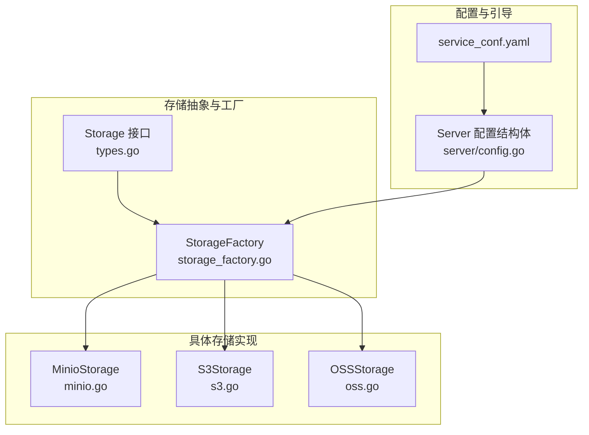
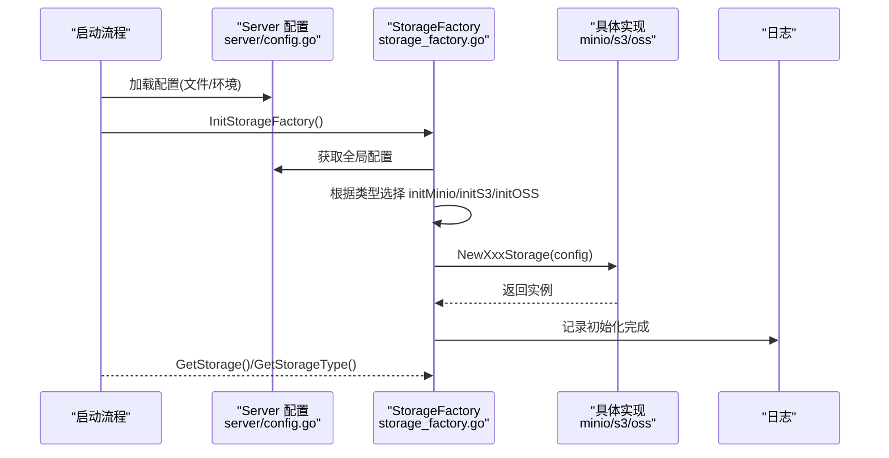
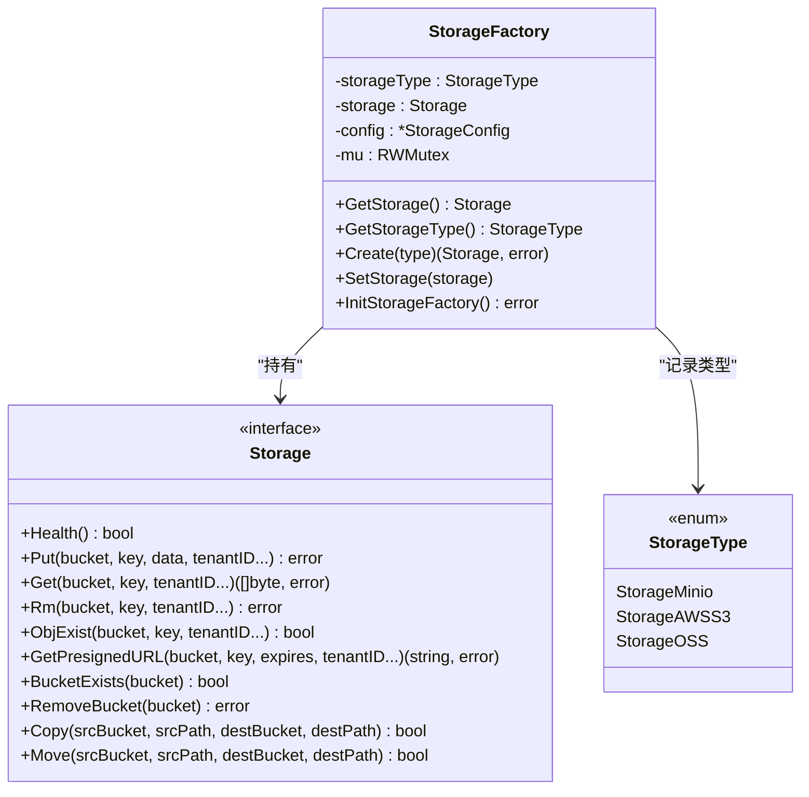
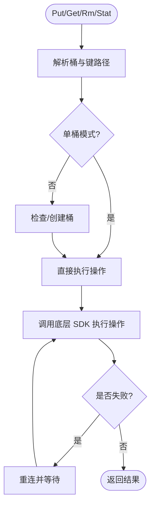
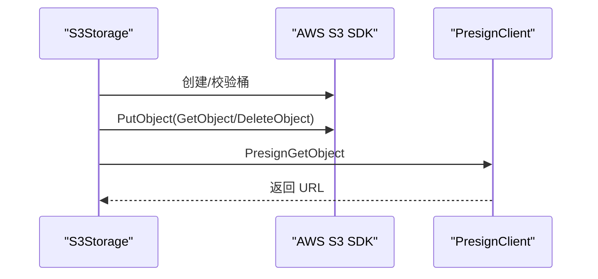
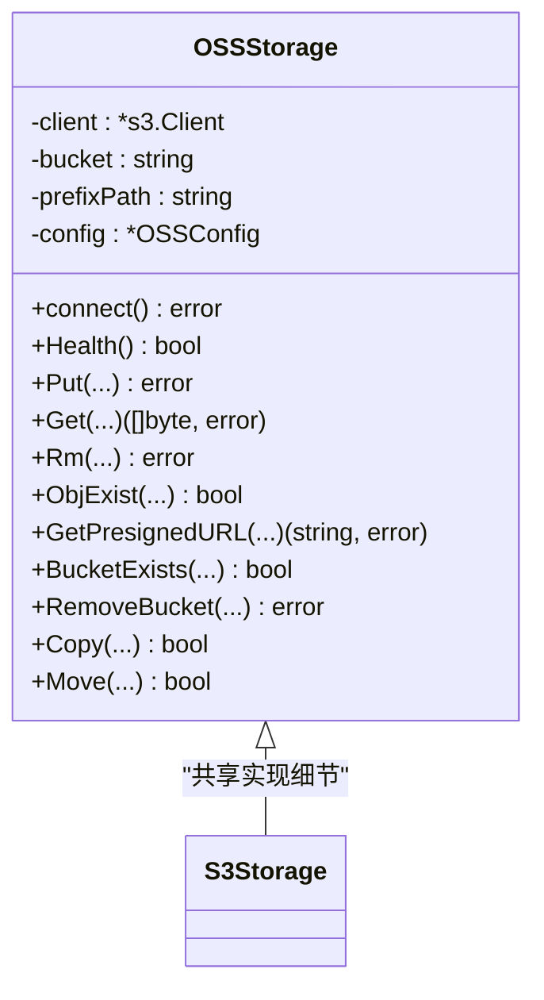
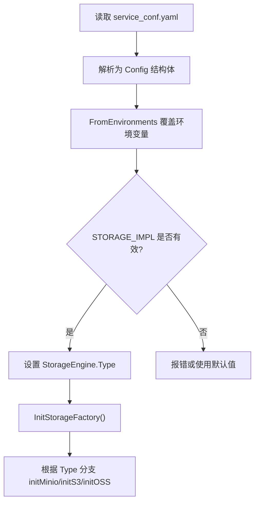
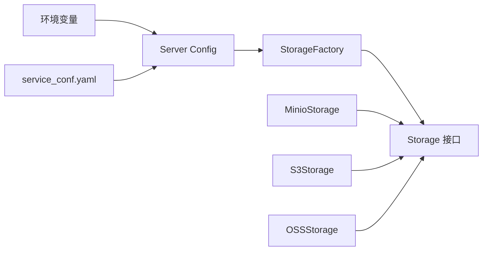

# 存储工厂模式

<cite>
**本文引用的文件**
- [internal/storage/storage_factory.go](file://internal/storage/storage_factory.go)
- [internal/storage/types.go](file://internal/storage/types.go)
- [internal/storage/minio.go](file://internal/storage/minio.go)
- [internal/storage/s3.go](file://internal/storage/s3.go)
- [internal/storage/oss.go](file://internal/storage/oss.go)
- [internal/server/config.go](file://internal/server/config.go)
- [conf/service_conf.yaml](file://conf/service_conf.yaml)
</cite>

## 目录
1. [简介](#简介)
2. [项目结构](#项目结构)
3. [核心组件](#核心组件)
4. [架构总览](#架构总览)
5. [详细组件分析](#详细组件分析)
6. [依赖分析](#依赖分析)
7. [性能考虑](#性能考虑)
8. [故障排查指南](#故障排查指南)
9. [结论](#结论)
10. [附录](#附录)

## 简介
本文件系统性阐述存储工厂模式在本项目中的实现与应用，围绕以下目标展开：
- 抽象存储接口设计与统一管理
- 存储类型的动态选择机制（配置驱动、运行时切换）
- 工厂初始化流程（配置加载、连接池管理、健康检查集成）
- 不同存储后端的特性对比（性能、功能、成本）
- 扩展新存储类型的步骤与接口要求
- 工厂配置示例、选择策略与故障转移机制
- 最佳实践与性能优化建议

## 项目结构
与存储工厂相关的关键模块位于 Go 后端的 internal/storage 与 internal/server 目录，并通过 conf/service_conf.yaml 提供默认配置。整体采用“接口 + 多实现 + 工厂”的分层设计，确保上层业务仅依赖统一接口。

图示来源
- [internal/storage/types.go:65-102](file://internal/storage/types.go#L65-L102)
- [internal/storage/storage_factory.go:31-121](file://internal/storage/storage_factory.go#L31-L121)
- [internal/storage/minio.go:33-388](file://internal/storage/minio.go#L33-L388)
- [internal/storage/s3.go:35-412](file://internal/storage/s3.go#L35-L412)
- [internal/storage/oss.go:35-404](file://internal/storage/oss.go#L35-L404)
- [internal/server/config.go:145-194](file://internal/server/config.go#L145-L194)
- [conf/service_conf.yaml:16-88](file://conf/service_conf.yaml#L16-L88)

章节来源
- [internal/storage/storage_factory.go:47-61](file://internal/storage/storage_factory.go#L47-L61)
- [internal/server/config.go:427-443](file://internal/server/config.go#L427-L443)

## 核心组件
- 统一存储接口：定义健康检查、对象存取、桶操作、复制移动等能力，屏蔽不同后端差异。
- 存储类型枚举：以整型标识不同后端，便于映射与序列化。
- 工厂类：单例持有当前配置与实例；根据配置动态创建具体实现；提供运行时创建与替换能力。
- 具体实现：MinIO、S3、OSS（兼容 S3 API）均实现统一接口，内置重试与重连逻辑。
- 配置体系：从 YAML 文件与环境变量加载，支持运行时切换存储类型。

章节来源
- [internal/storage/types.go:31-102](file://internal/storage/types.go#L31-L102)
- [internal/storage/storage_factory.go:31-121](file://internal/storage/storage_factory.go#L31-L121)
- [internal/server/config.go:145-194](file://internal/server/config.go#L145-L194)

## 架构总览
存储工厂的初始化与使用遵循“配置加载 → 工厂初始化 → 实例获取/创建 → 运行时切换”的路径。下图展示关键调用链：

图示来源
- [internal/storage/storage_factory.go:47-61](file://internal/storage/storage_factory.go#L47-L61)
- [internal/storage/storage_factory.go:64-121](file://internal/storage/storage_factory.go#L64-L121)
- [internal/server/config.go:427-443](file://internal/server/config.go#L427-L443)

## 详细组件分析

### 组件A：存储工厂与类型系统
- 单例工厂：通过延迟初始化保证线程安全；内部持有一个可读写锁，保护当前实例与类型。
- 初始化流程：读取全局配置中的存储类型与对应子配置，按类型分支创建具体实现。
- 运行时创建：Create 方法允许按指定类型创建新实例（用于多租户或动态切换）。
- 类型映射：提供函数映射表，便于按类型直接构造实例。

图示来源
- [internal/storage/storage_factory.go:31-178](file://internal/storage/storage_factory.go#L31-L178)
- [internal/storage/types.go:31-102](file://internal/storage/types.go#L31-L102)

章节来源
- [internal/storage/storage_factory.go:39-45](file://internal/storage/storage_factory.go#L39-L45)
- [internal/storage/storage_factory.go:137-171](file://internal/storage/storage_factory.go#L137-L171)
- [internal/storage/types.go:31-63](file://internal/storage/types.go#L31-L63)

### 组件B：MinIO 实现
- 连接与重连：支持 TLS/SSL 验证开关；失败时自动重连并记录错误。
- 路径解析：支持单桶模式与前缀路径组合，避免跨租户冲突。
- 健康检查：存在性校验或列举桶，快速判断可用性。
- 对象操作：带重试的 Put/Get/Rm；Stat/Exist 区分 NoSuchKey/NoSuchBucket。
- 桶管理：支持删除桶内对象与桶本身；单桶模式下不删除实际桶。
- 复制/移动：先 Copy 再 Rm，保证一致性。

图示来源
- [internal/storage/minio.go:88-106](file://internal/storage/minio.go#L88-L106)
- [internal/storage/minio.go:129-168](file://internal/storage/minio.go#L129-L168)
- [internal/storage/minio.go:170-198](file://internal/storage/minio.go#L170-L198)
- [internal/storage/minio.go:200-212](file://internal/storage/minio.go#L200-L212)
- [internal/storage/minio.go:214-236](file://internal/storage/minio.go#L214-L236)
- [internal/storage/minio.go:238-257](file://internal/storage/minio.go#L238-L257)
- [internal/storage/minio.go:259-275](file://internal/storage/minio.go#L259-L275)
- [internal/storage/minio.go:277-327](file://internal/storage/minio.go#L277-L327)
- [internal/storage/minio.go:329-387](file://internal/storage/minio.go#L329-L387)

章节来源
- [internal/storage/minio.go:56-86](file://internal/storage/minio.go#L56-L86)
- [internal/storage/minio.go:108-127](file://internal/storage/minio.go#L108-L127)

### 组件C：S3 实现
- 连接与自定义端点：支持区域、凭据、自定义 Endpoint；失败时重连。
- 健康检查：自动创建测试桶与对象，验证可用性。
- 对象操作：带重试的 Put/Get/Rm；HeadObject 判断存在性。
- 预签名 URL：使用预签名客户端生成临时访问链接。
- 桶管理：列出并逐个删除对象，再删除桶。
- 复制/移动：基于 CopyObject 与 DeleteObject。

图示来源
- [internal/storage/s3.go:56-98](file://internal/storage/s3.go#L56-L98)
- [internal/storage/s3.go:114-154](file://internal/storage/s3.go#L114-L154)
- [internal/storage/s3.go:156-194](file://internal/storage/s3.go#L156-L194)
- [internal/storage/s3.go:196-227](file://internal/storage/s3.go#L196-L227)
- [internal/storage/s3.go:229-245](file://internal/storage/s3.go#L229-L245)
- [internal/storage/s3.go:247-265](file://internal/storage/s3.go#L247-L265)
- [internal/storage/s3.go:267-291](file://internal/storage/s3.go#L267-L291)
- [internal/storage/s3.go:293-311](file://internal/storage/s3.go#L293-L311)
- [internal/storage/s3.go:313-365](file://internal/storage/s3.go#L313-L365)
- [internal/storage/s3.go:367-399](file://internal/storage/s3.go#L367-L399)

章节来源
- [internal/storage/s3.go:43-54](file://internal/storage/s3.go#L43-L54)

### 组件D：OSS 实现
- 兼容 S3 API：复用 S3 客户端，通过 Endpoint 指向阿里云 OSS。
- 连接参数：AccessKey/SecretKey/Region/Endpoint；失败时重连。
- 健康检查、对象操作、预签名 URL、桶管理与复制/移动逻辑与 S3 一致。

图示来源
- [internal/storage/oss.go:35-57](file://internal/storage/oss.go#L35-L57)
- [internal/storage/oss.go:59-84](file://internal/storage/oss.go#L59-L84)
- [internal/storage/oss.go:106-146](file://internal/storage/oss.go#L106-L146)
- [internal/storage/oss.go:148-186](file://internal/storage/oss.go#L148-L186)
- [internal/storage/oss.go:188-219](file://internal/storage/oss.go#L188-L219)
- [internal/storage/oss.go:221-237](file://internal/storage/oss.go#L221-L237)
- [internal/storage/oss.go:239-257](file://internal/storage/oss.go#L239-L257)
- [internal/storage/oss.go:259-283](file://internal/storage/oss.go#L259-L283)
- [internal/storage/oss.go:285-303](file://internal/storage/oss.go#L285-L303)
- [internal/storage/oss.go:305-357](file://internal/storage/oss.go#L305-L357)
- [internal/storage/oss.go:359-391](file://internal/storage/oss.go#L359-L391)

章节来源
- [internal/storage/oss.go:44-57](file://internal/storage/oss.go#L44-L57)

### 组件E：配置与初始化
- 配置来源：优先加载 service_conf.yaml，再叠加环境变量覆盖；支持多种服务类型映射。
- 存储配置：StorageConfig.Type 决定工厂初始化的具体实现；Minio/S3/OSS 的子配置分别注入。
- 环境变量切换：STORAGE_IMPL 控制存储类型，默认 minio。
- 初始化入口：InitStorageFactory 读取全局配置并创建实例，记录日志。

图示来源
- [internal/server/config.go:453-703](file://internal/server/config.go#L453-L703)
- [internal/server/config.go:427-443](file://internal/server/config.go#L427-L443)
- [internal/storage/storage_factory.go:47-61](file://internal/storage/storage_factory.go#L47-L61)
- [conf/service_conf.yaml:16-88](file://conf/service_conf.yaml#L16-L88)

章节来源
- [internal/server/config.go:145-194](file://internal/server/config.go#L145-L194)
- [internal/server/config.go:613-661](file://internal/server/config.go#L613-L661)

## 依赖分析
- 工厂对具体实现的依赖：通过接口隔离，工厂仅依赖 Storage 接口与类型枚举。
- 具体实现对 SDK 的依赖：MinIO 使用官方 Go SDK；S3/OSS 使用 AWS SDK（S3 兼容）。
- 配置对环境变量与文件的依赖：优先级为环境变量 > 配置文件。
- 并发安全：工厂内部使用读写锁，保证实例与类型在并发场景下的可见性与一致性。

图示来源
- [internal/storage/storage_factory.go:31-121](file://internal/storage/storage_factory.go#L31-L121)
- [internal/storage/types.go:65-102](file://internal/storage/types.go#L65-L102)
- [internal/server/config.go:427-443](file://internal/server/config.go#L427-L443)

章节来源
- [internal/storage/storage_factory.go:36-37](file://internal/storage/storage_factory.go#L36-L37)
- [internal/storage/minio.go:19-31](file://internal/storage/minio.go#L19-L31)
- [internal/storage/s3.go:27-33](file://internal/storage/s3.go#L27-L33)
- [internal/storage/oss.go:27-33](file://internal/storage/oss.go#L27-L33)

## 性能考虑
- 重试与退避：各实现对 Put/Get/PutObject 等关键操作进行有限次重试，降低瞬时网络抖动影响。
- 连接复用：SDK 客户端在实现中作为成员变量复用，减少频繁握手开销。
- 健康检查：最小代价的可用性探测，避免无效请求导致的资源浪费。
- 路径前缀：通过前缀隔离多租户数据，减少跨租户扫描与命名冲突。
- 预签名 URL：短时授权访问，避免服务端代理下载带来的额外负载。

## 故障排查指南
- 初始化失败
  - 检查 STORAGE_IMPL 是否为 minio/s3/oss 之一。
  - 确认对应子配置（Minio/S3/OSS）已正确加载。
  - 查看日志中“Storage initialized”是否输出。
- 连接异常
  - MinIO：确认 host/port/secure/verify/bucket/prefix_path。
  - S3：确认 region/endpoint/access_key/secret_key/session_token。
  - OSS：确认 region/endpoint/access_key/secret_key 与桶配置。
- 对象操作失败
  - 观察是否存在 NoSuchKey/NoSuchBucket 错误码，必要时启用健康检查与桶自动创建。
  - 检查网络连通性与 IAM 权限。
- 预签名 URL 失败
  - 确认时间同步与过期时间设置合理。
  - 检查客户端网络可达性与代理配置。

章节来源
- [internal/storage/storage_factory.go:47-61](file://internal/storage/storage_factory.go#L47-L61)
- [internal/storage/minio.go:135-167](file://internal/storage/minio.go#L135-L167)
- [internal/storage/s3.go:162-193](file://internal/storage/s3.go#L162-L193)
- [internal/storage/oss.go:154-185](file://internal/storage/oss.go#L154-L185)

## 结论
该存储工厂模式通过统一接口与工厂调度，实现了对 MinIO、S3、OSS 的一致化接入。其优势在于：
- 配置驱动的动态选择与运行时切换
- 明确的健康检查与重试机制
- 可扩展的接口设计，便于新增后端
- 与现有配置体系无缝集成

## 附录

### 存储类型与特性对比
- MinIO
  - 优点：本地部署灵活、生态成熟、社区活跃
  - 功能：桶管理、对象 CRUD、复制/移动、预签名 URL
  - 成本：自建/运维成本
- AWS S3
  - 优点：全球覆盖、高可用、丰富工具链
  - 功能：与 MinIO 基本一致
  - 成本：按用量计费
- 阿里云 OSS
  - 优点：国内访问速度快、与 S3 兼容
  - 功能：与 S3 实现一致
  - 成本：按用量计费

章节来源
- [internal/storage/minio.go:108-127](file://internal/storage/minio.go#L108-L127)
- [internal/storage/s3.go:114-154](file://internal/storage/s3.go#L114-L154)
- [internal/storage/oss.go:106-146](file://internal/storage/oss.go#L106-L146)

### 扩展新存储类型的步骤
- 定义配置结构体：在 server 配置中新增子配置字段。
- 实现 Storage 接口：新建实现文件，完成连接、健康检查、对象与桶操作。
- 注册到工厂：在工厂的 initStorage 与 Create 分支中增加类型分支。
- 集成配置加载：在配置加载逻辑中映射新类型与字段。
- 编写测试：覆盖健康检查、重试、复制/移动等关键路径。

章节来源
- [internal/server/config.go:145-194](file://internal/server/config.go#L145-L194)
- [internal/storage/storage_factory.go:64-121](file://internal/storage/storage_factory.go#L64-L121)
- [internal/storage/storage_factory.go:137-171](file://internal/storage/storage_factory.go#L137-L171)

### 工厂配置示例与选择策略
- 默认配置：service_conf.yaml 中的 minio 字段作为默认存储。
- 环境变量切换：STORAGE_IMPL=minio|s3|oss。
- 选择策略：
  - 开发/测试：MinIO，便于本地部署与调试
  - 生产/公有云：S3/OSS，结合地域与合规要求
  - 多云/混合：通过工厂运行时切换或按租户隔离

章节来源
- [conf/service_conf.yaml:16-88](file://conf/service_conf.yaml#L16-L88)
- [internal/server/config.go:427-443](file://internal/server/config.go#L427-L443)

### 故障转移机制
- 健康检查：各实现提供 Health 方法，用于快速判定可用性。
- 自动重试：对 Put/Get/PutObject 等关键操作进行有限次重试。
- 重连策略：连接失败时触发重连，降低瞬断影响。
- 建议：在上层业务中结合健康检查结果进行降级或切换。

章节来源
- [internal/storage/minio.go:108-127](file://internal/storage/minio.go#L108-L127)
- [internal/storage/s3.go:114-154](file://internal/storage/s3.go#L114-L154)
- [internal/storage/oss.go:106-146](file://internal/storage/oss.go#L106-L146)