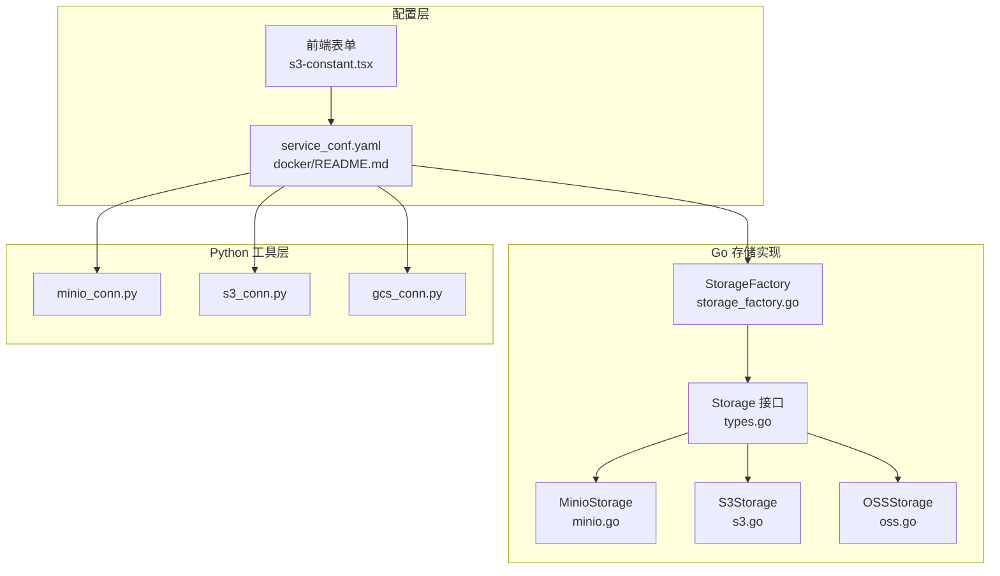
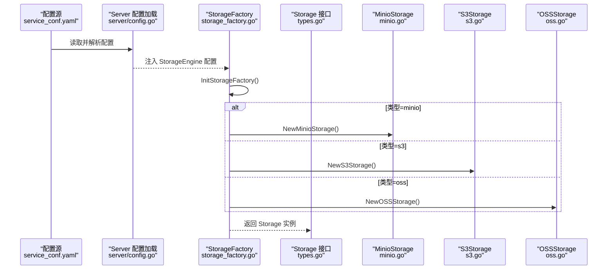
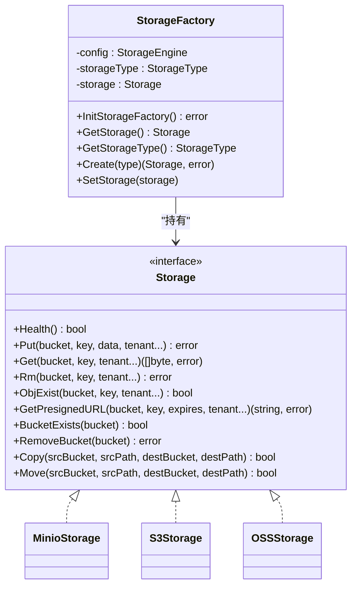
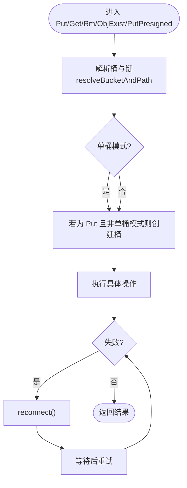
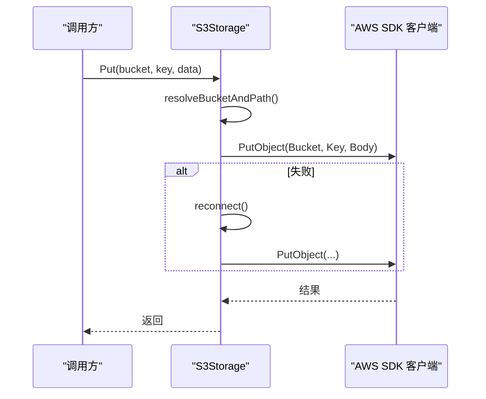
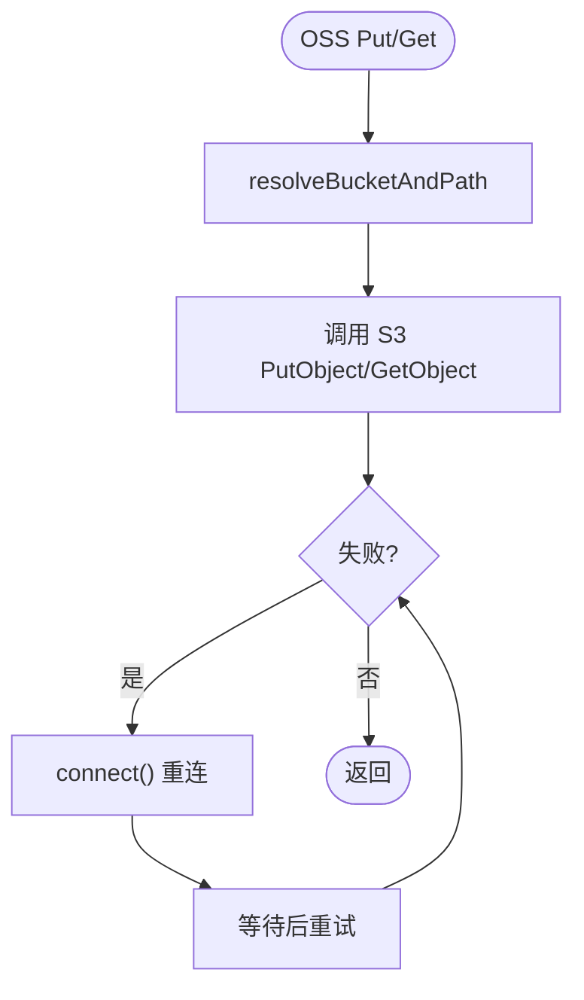
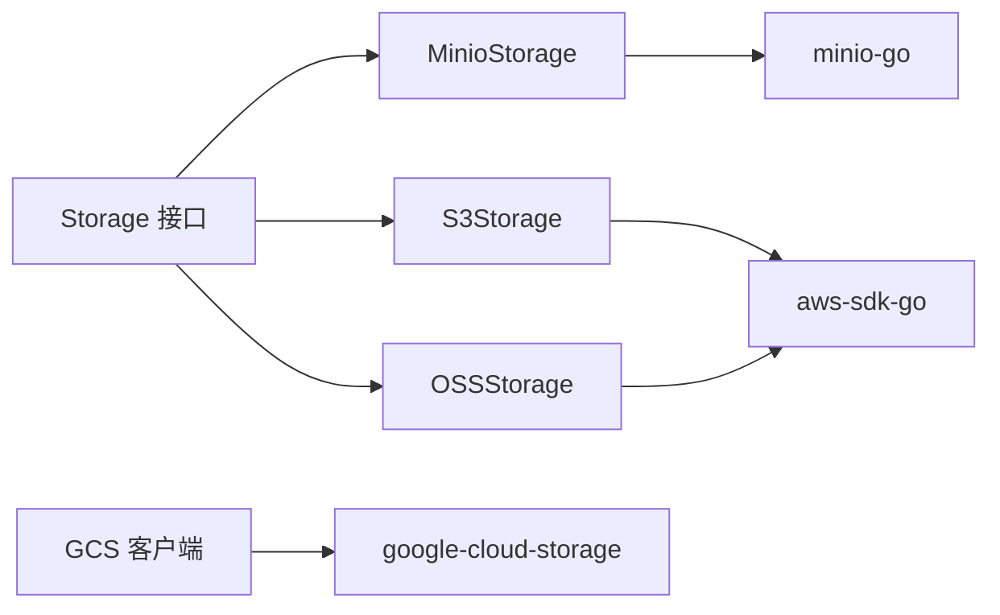

# 对象存储集成

<cite>
**本文引用的文件**
- [internal/storage/types.go](file://internal/storage/types.go)
- [internal/storage/storage_factory.go](file://internal/storage/storage_factory.go)
- [internal/storage/minio.go](file://internal/storage/minio.go)
- [internal/storage/s3.go](file://internal/storage/s3.go)
- [internal/storage/oss.go](file://internal/storage/oss.go)
- [internal/server/config.go](file://internal/server/config.go)
- [conf/service_conf.yaml](file://conf/service_conf.yaml)
- [docker/README.md](file://docker/README.md)
- [rag/utils/minio_conn.py](file://rag/utils/minio_conn.py)
- [rag/utils/s3_conn.py](file://rag/utils/s3_conn.py)
- [rag/utils/gcs_conn.py](file://rag/utils/gcs_conn.py)
- [common/data_source/utils.py](file://common/data_source/utils.py)
- [common/data_source/blob_connector.py](file://common/data_source/blob_connector.py)
- [web/src/pages/user-setting/data-source/constant/s3-constant.tsx](file://web/src/pages/user-setting/data-source/constant/s3-constant.tsx)
</cite>

## 目录
1. [简介](#简介)
2. [项目结构](#项目结构)
3. [核心组件](#核心组件)
4. [架构总览](#架构总览)
5. [详细组件分析](#详细组件分析)
6. [依赖关系分析](#依赖关系分析)
7. [性能考量](#性能考量)
8. [故障排除指南](#故障排除指南)
9. [结论](#结论)
10. [附录](#附录)

## 简介
本文件面向对象存储集成，系统性梳理 RAGFlow 支持的多种对象存储后端（MinIO、AWS S3、阿里云 OSS、Google Cloud Storage），并围绕以下目标展开：
- 深入解释各后端的配置项、连接参数、认证方式与典型用法
- 阐述工厂模式在运行时动态选择与切换存储后端的实现原理
- 提供配置示例、性能调优建议、故障排除方法与最佳实践

## 项目结构
RAGFlow 的对象存储能力由“Go 后端存储实现 + Python 工具层 + 配置与前端表单”三部分协同构成：
- Go 层：统一的存储接口与工厂，分别实现 MinIO、S3、OSS 的具体存储逻辑
- Python 层：提供 MinIO/S3/GCS 的连接封装与工具类，便于上层业务直接使用
- 配置层：通过 YAML/环境变量注入存储配置；前端表单用于可视化配置 S3 兼容参数

图表来源
- [internal/storage/types.go:65-102](file://internal/storage/types.go#L65-L102)
- [internal/storage/storage_factory.go:47-200](file://internal/storage/storage_factory.go#L47-L200)
- [internal/storage/minio.go:56-298](file://internal/storage/minio.go#L56-L298)
- [internal/storage/s3.go:215-269](file://internal/storage/s3.go#L215-L269)
- [internal/storage/oss.go:59-265](file://internal/storage/oss.go#L59-L265)
- [conf/service_conf.yaml:16-89](file://conf/service_conf.yaml#L16-L89)
- [docker/README.md:122-194](file://docker/README.md#L122-L194)
- [rag/utils/minio_conn.py:92-168](file://rag/utils/minio_conn.py#L92-L168)
- [rag/utils/s3_conn.py:64-124](file://rag/utils/s3_conn.py#L64-L124)
- [rag/utils/gcs_conn.py:26-208](file://rag/utils/gcs_conn.py#L26-L208)
- [web/src/pages/user-setting/data-source/constant/s3-constant.tsx:145-177](file://web/src/pages/user-setting/data-source/constant/s3-constant.tsx#L145-L177)

章节来源
- [internal/storage/types.go:1-103](file://internal/storage/types.go#L1-L103)
- [internal/storage/storage_factory.go:47-200](file://internal/storage/storage_factory.go#L47-L200)
- [conf/service_conf.yaml:16-89](file://conf/service_conf.yaml#L16-L89)
- [docker/README.md:122-194](file://docker/README.md#L122-L194)

## 核心组件
- 统一接口与错误语义
  - 定义了通用的存储接口，包含健康检查、上传、下载、删除、存在性判断、预签名 URL、桶存在性、桶级删除、复制与移动等能力
  - 明确了“未找到”等常见错误类型，便于上层统一处理
- 存储类型枚举与字符串化
  - 枚举了 MinIO、S3、OSS、GCS 等类型，并提供字符串化输出，便于日志与调试
- 工厂初始化与动态选择
  - 基于全局配置，按类型初始化对应存储实例；支持根据类型创建新实例或获取当前实例
  - 提供映射函数，将类型映射到构造器，便于扩展其他后端

章节来源
- [internal/storage/types.go:65-102](file://internal/storage/types.go#L65-L102)
- [internal/storage/types.go:31-63](file://internal/storage/types.go#L31-L63)
- [internal/storage/storage_factory.go:47-200](file://internal/storage/storage_factory.go#L47-L200)

## 架构总览
下图展示了从配置到运行时存储实例的装配流程，以及 Go 与 Python 两套实现的分工：

图表来源
- [internal/server/config.go:613-661](file://internal/server/config.go#L613-L661)
- [internal/storage/storage_factory.go:47-121](file://internal/storage/storage_factory.go#L47-L121)
- [internal/storage/types.go:65-102](file://internal/storage/types.go#L65-L102)

## 详细组件分析

### 工厂模式与运行时选择
- 初始化流程
  - 从全局配置中读取存储类型与对应配置段
  - 根据类型分派到具体构造函数，创建存储实例并缓存
- 动态创建
  - 支持按类型创建新的存储实例，便于在多租户或多桶场景下灵活切换
- 并发安全
  - 使用读写锁保护当前实例与类型，避免并发竞态

图表来源
- [internal/storage/storage_factory.go:47-200](file://internal/storage/storage_factory.go#L47-L200)
- [internal/storage/types.go:65-102](file://internal/storage/types.go#L65-L102)
- [internal/storage/minio.go:56-298](file://internal/storage/minio.go#L56-L298)
- [internal/storage/s3.go:215-269](file://internal/storage/s3.go#L215-L269)
- [internal/storage/oss.go:59-265](file://internal/storage/oss.go#L59-L265)

章节来源
- [internal/storage/storage_factory.go:47-200](file://internal/storage/storage_factory.go#L47-L200)
- [internal/storage/types.go:65-102](file://internal/storage/types.go#L65-L102)

### MinIO 集成
- 连接参数
  - 主机、用户、密码、是否启用 HTTPS、是否校验证书、默认桶、路径前缀
- 认证配置
  - 使用静态凭证进行签名 V4 认证
- 桶与路径解析
  - 支持“单桶模式”与“多桶模式”，自动拼接前缀路径
- 文件操作
  - Put/Get/Rm/ObjExist/PresignedURL/BucketExists/RemoveBucket/Copy/Move
  - 多次重试与自动重连机制，提升稳定性
- 健康检查
  - 单桶模式：检查桶是否存在
  - 多桶模式：尝试列出桶以探测服务可用性

图表来源
- [internal/storage/minio.go:88-106](file://internal/storage/minio.go#L88-L106)
- [internal/storage/minio.go:129-168](file://internal/storage/minio.go#L129-L168)
- [internal/storage/minio.go:170-198](file://internal/storage/minio.go#L170-L198)
- [internal/storage/minio.go:200-212](file://internal/storage/minio.go#L200-L212)
- [internal/storage/minio.go:214-236](file://internal/storage/minio.go#L214-L236)
- [internal/storage/minio.go:238-257](file://internal/storage/minio.go#L238-L257)
- [internal/storage/minio.go:259-275](file://internal/storage/minio.go#L259-L275)
- [internal/storage/minio.go:277-298](file://internal/storage/minio.go#L277-L298)

章节来源
- [internal/storage/minio.go:56-298](file://internal/storage/minio.go#L56-L298)
- [rag/utils/minio_conn.py:92-168](file://rag/utils/minio_conn.py#L92-L168)

### AWS S3 适配
- 连接参数
  - 访问密钥、秘密密钥、会话令牌、区域、自定义 Endpoint、签名版本、寻址风格、默认桶、路径前缀
- 认证与会话
  - 支持 AK/SK、临时会话令牌、自定义 Endpoint（兼容 S3 兼容服务）
- 操作能力
  - Put/Get/Rm/ObjExist/PresignedURL/BucketExists/RemoveBucket/Copy/Move
  - 健壮的重试与自动重连
- 健康检查
  - 通过 HeadObject/HeadBucket 判断对象与桶存在性

图表来源
- [internal/storage/s3.go:215-269](file://internal/storage/s3.go#L215-L269)
- [internal/storage/s3.go:229-245](file://internal/storage/s3.go#L229-L245)
- [internal/storage/s3.go:247-265](file://internal/storage/s3.go#L247-L265)
- [internal/storage/s3.go:267-269](file://internal/storage/s3.go#L267-L269)

章节来源
- [internal/storage/s3.go:215-269](file://internal/storage/s3.go#L215-L269)
- [internal/storage/s3.go:229-245](file://internal/storage/s3.go#L229-L245)
- [internal/storage/s3.go:247-265](file://internal/storage/s3.go#L247-L265)
- [internal/storage/s3.go:267-269](file://internal/storage/s3.go#L267-L269)
- [rag/utils/s3_conn.py:64-124](file://rag/utils/s3_conn.py#L64-L124)

### 阿里云 OSS 集成
- 兼容 S3 API
  - 通过 AWS SDK 创建客户端，并指定 OSS Endpoint，使其行为与 S3 一致
- 连接参数
  - 访问密钥、秘密密钥、Endpoint、区域、默认桶、路径前缀、签名版本、寻址风格
- 操作能力
  - Put/Get/Rm/ObjExist/PresignedURL/BucketExists/RemoveBucket/Copy/Move
  - 健壮的重试与自动重连
- 健康检查
  - 在默认桶或健康检查桶中上传/下载测试对象

图表来源
- [internal/storage/oss.go:59-265](file://internal/storage/oss.go#L59-L265)

章节来源
- [internal/storage/oss.go:59-265](file://internal/storage/oss.go#L59-L265)

### Google Cloud Storage 集成
- 连接与认证
  - 默认使用应用默认凭据（ADC），可直接访问 GCS
- 操作能力
  - Put/Get/Rm/ObjExist/BucketExists/PresignedURL/RemoveBucket/Copy/Move
  - 通过虚拟“主桶”组织多目录结构，路径前缀即为目录名
- 健康检查
  - 在主桶内上传/下载健康检查文件，验证可用性

章节来源
- [rag/utils/gcs_conn.py:26-208](file://rag/utils/gcs_conn.py#L26-L208)

### 配置与前端表单
- 配置文件
  - 通过 service_conf.yaml 注入 MinIO/S3/OSS/GCS 等配置
  - Docker 化部署时，模板文件会将环境变量替换为实际值
- 前端表单
  - S3 兼容服务的 Endpoint、寻址风格等参数通过前端表单配置
- 凭证与权限
  - S3 支持多种认证方式（AK/SK、IAM 角色、AssumeRole），并通过工具层进行会话刷新与构造

章节来源
- [conf/service_conf.yaml:16-89](file://conf/service_conf.yaml#L16-L89)
- [docker/README.md:122-194](file://docker/README.md#L122-L194)
- [web/src/pages/user-setting/data-source/constant/s3-constant.tsx:145-177](file://web/src/pages/user-setting/data-source/constant/s3-constant.tsx#L145-L177)
- [common/data_source/utils.py:257-317](file://common/data_source/utils.py#L257-L317)
- [common/data_source/blob_connector.py:57-89](file://common/data_source/blob_connector.py#L57-L89)

## 依赖关系分析
- 耦合与内聚
  - Storage 接口将上层调用与具体后端解耦，工厂负责装配与生命周期管理
  - MinIO/S3/OSS 的实现共享相似的重试与自动重连策略，降低重复代码
- 外部依赖
  - MinIO：minio-go
  - S3：aws-sdk-go
  - OSS：aws-sdk-go（通过自定义 Endpoint）
  - GCS：google-cloud-storage
- 可能的循环依赖
  - 当前结构清晰，接口与实现分离，未见循环依赖迹象

图表来源
- [internal/storage/types.go:65-102](file://internal/storage/types.go#L65-L102)
- [internal/storage/minio.go:56-298](file://internal/storage/minio.go#L56-L298)
- [internal/storage/s3.go:215-269](file://internal/storage/s3.go#L215-L269)
- [internal/storage/oss.go:59-265](file://internal/storage/oss.go#L59-L265)
- [rag/utils/gcs_conn.py:26-208](file://rag/utils/gcs_conn.py#L26-L208)

章节来源
- [internal/storage/types.go:65-102](file://internal/storage/types.go#L65-L102)
- [internal/storage/minio.go:56-298](file://internal/storage/minio.go#L56-L298)
- [internal/storage/s3.go:215-269](file://internal/storage/s3.go#L215-L269)
- [internal/storage/oss.go:59-265](file://internal/storage/oss.go#L59-L265)
- [rag/utils/gcs_conn.py:26-208](file://rag/utils/gcs_conn.py#L26-L208)

## 性能考量
- 重试与退避
  - 所有后端在 Put/Get/PresignedURL 等关键路径均内置重试与短暂退避，提升网络抖动下的成功率
- 自动重连
  - 连接异常时触发 reconnect，减少上层感知到的瞬断
- 寻址风格与签名版本
  - S3/OSS 支持路径式与虚拟主机式寻址风格，以及签名版本选择，可根据网络与合规要求调整
- 健康检查
  - 单桶模式仅检查桶存在性，多桶模式尝试列举桶，避免误判
- 前缀路径
  - 通过 PrefixPath 将不同租户/知识库的数据隔离在同一桶内，减少桶数量带来的管理复杂度

章节来源
- [internal/storage/minio.go:129-168](file://internal/storage/minio.go#L129-L168)
- [internal/storage/s3.go:215-269](file://internal/storage/s3.go#L215-L269)
- [internal/storage/oss.go:169-186](file://internal/storage/oss.go#L169-L186)
- [internal/storage/minio.go:108-127](file://internal/storage/minio.go#L108-L127)
- [internal/storage/oss.go:106-118](file://internal/storage/oss.go#L106-L118)

## 故障排除指南
- 连接失败
  - 检查主机、端口、协议（HTTPS/HTTP）、证书校验开关
  - 若为 S3/OSS，确认 Endpoint、签名版本、寻址风格配置正确
- 权限不足
  - MinIO：确认用户具备创建桶与写入权限
  - S3/OSS：确认 AK/SK 或角色授权范围包含所需操作
  - GCS：确认 ADC 正常且主桶存在
- 桶不存在
  - MinIO 在 Put 时可自动创建桶（非单桶模式），但需具备相应权限
  - S3/OSS/GCS：请先在控制台或 CLI 创建桶
- 预签名 URL 生成失败
  - 检查过期时间、网络连通性与重试日志
- 健康检查失败
  - 单桶模式：确认桶存在
  - 多桶模式：确认服务可用且具备列举权限

章节来源
- [internal/storage/minio.go:108-127](file://internal/storage/minio.go#L108-L127)
- [internal/storage/s3.go:267-269](file://internal/storage/s3.go#L267-L269)
- [internal/storage/oss.go:259-265](file://internal/storage/oss.go#L259-L265)
- [rag/utils/gcs_conn.py:52-66](file://rag/utils/gcs_conn.py#L52-L66)

## 结论
RAGFlow 的对象存储集成以统一接口与工厂模式为核心，实现了对 MinIO、S3、OSS、GCS 的一致抽象与灵活切换。通过完善的重试、自动重连与健康检查机制，结合可配置的寻址风格与签名版本，能够在不同云厂商与自建环境中稳定运行。配合前端表单与配置文件，用户可以快速完成各类对象存储的接入与优化。

## 附录

### 配置示例与最佳实践
- MinIO
  - 建议启用 HTTPS 与证书校验；如为单桶模式，设置默认桶与路径前缀以隔离租户
- S3
  - 区域与 Endpoint 必须匹配；优先使用虚拟主机式寻址风格以获得更好性能
  - 如使用 IAM 角色或 AssumeRole，确保会话令牌有效且具备最小权限
- OSS
  - Endpoint 与 Region 必须正确；如需兼容路径式寻址，可在前端表单中选择
- GCS
  - 使用 ADC 时确保工作负载身份已授予相应权限；主桶必须预先创建

章节来源
- [conf/service_conf.yaml:16-89](file://conf/service_conf.yaml#L16-L89)
- [docker/README.md:122-194](file://docker/README.md#L122-L194)
- [web/src/pages/user-setting/data-source/constant/s3-constant.tsx:145-177](file://web/src/pages/user-setting/data-source/constant/s3-constant.tsx#L145-L177)
- [common/data_source/utils.py:257-317](file://common/data_source/utils.py#L257-L317)