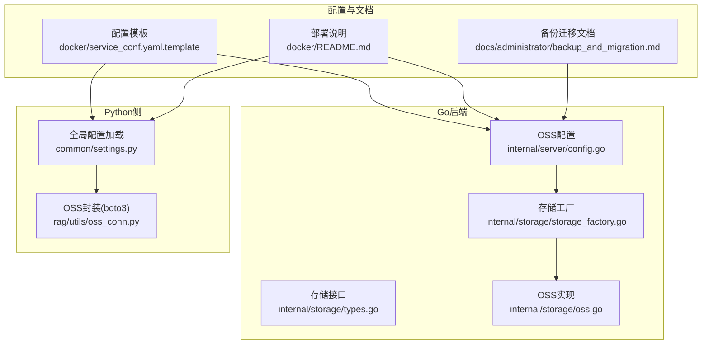
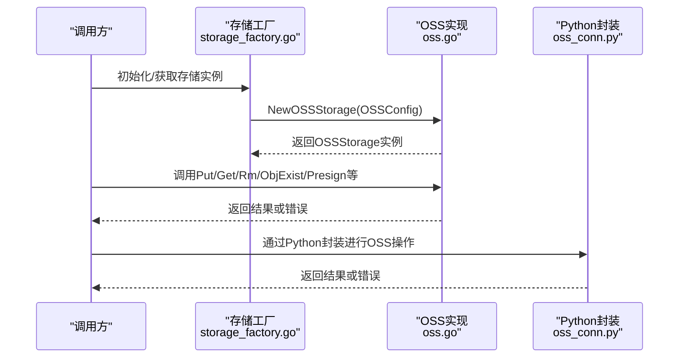
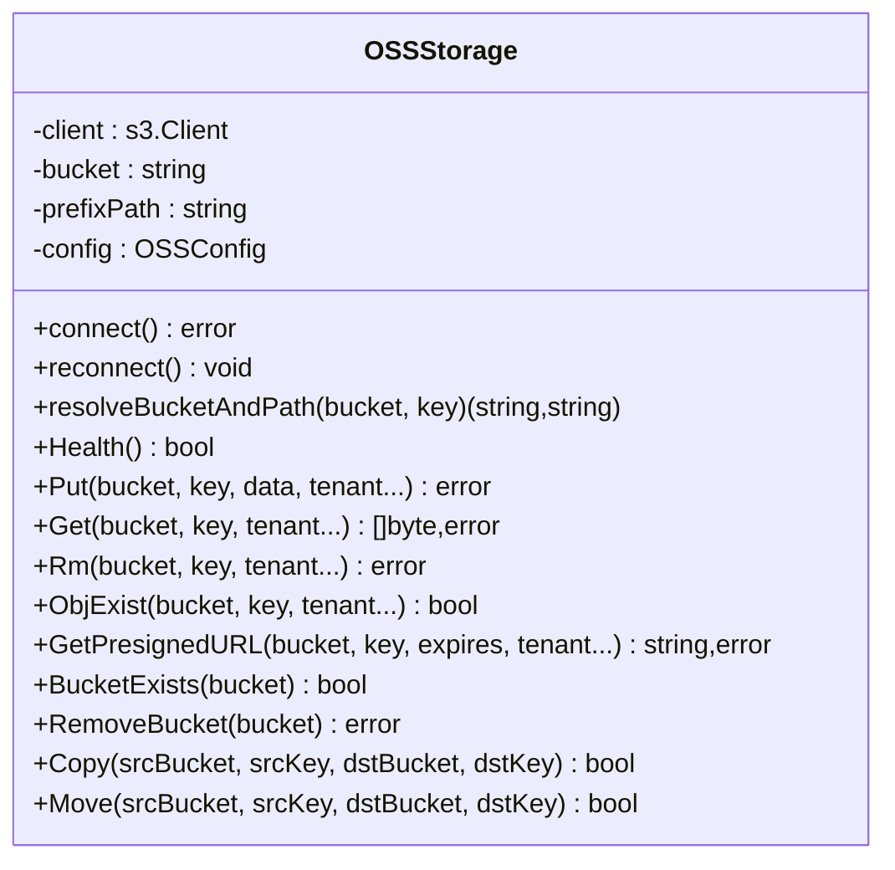
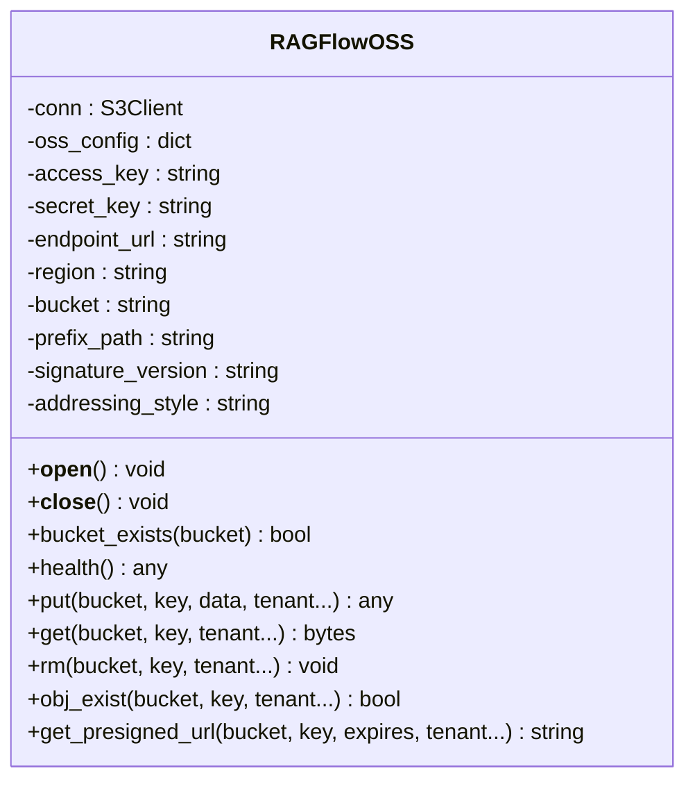
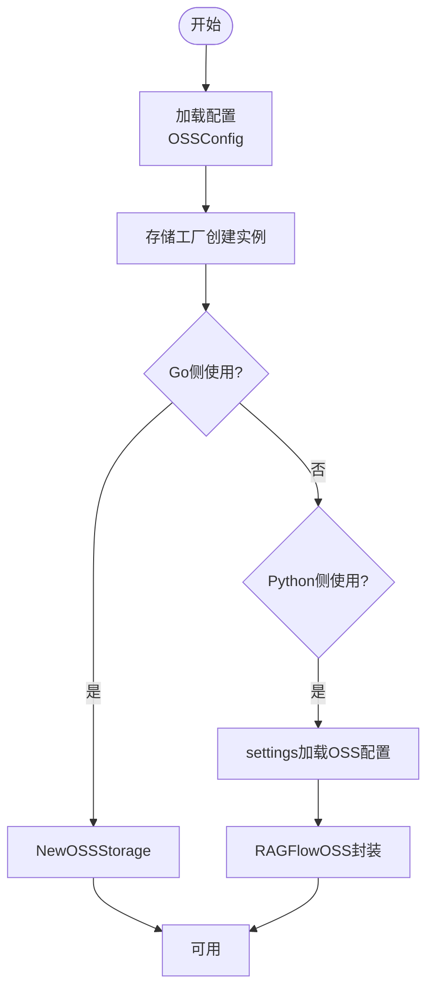
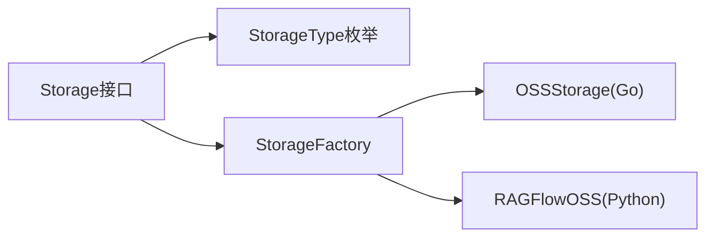

# 阿里云OSS集成

<cite>
**本文引用的文件**
- [internal/server/config.go](file://internal/server/config.go)
- [internal/storage/oss.go](file://internal/storage/oss.go)
- [internal/storage/types.go](file://internal/storage/types.go)
- [internal/storage/storage_factory.go](file://internal/storage/storage_factory.go)
- [rag/utils/oss_conn.py](file://rag/utils/oss_conn.py)
- [common/settings.py](file://common/settings.py)
- [docker/service_conf.yaml.template](file://docker/service_conf.yaml.template)
- [docker/README.md](file://docker/README.md)
- [docs/administrator/backup_and_migration.md](file://docs/administrator/backup_and_migration.md)
</cite>

## 目录
1. [简介](#简介)
2. [项目结构](#项目结构)
3. [核心组件](#核心组件)
4. [架构总览](#架构总览)
5. [详细组件分析](#详细组件分析)
6. [依赖分析](#依赖分析)
7. [性能考虑](#性能考虑)
8. [故障排查指南](#故障排查指南)
9. [结论](#结论)
10. [附录](#附录)

## 简介
本文件面向在本项目中集成阿里云OSS（对象存储服务）的开发者与运维人员，系统性说明OSS SDK集成实现、配置要点、对象操作能力、以及与项目现有存储抽象的衔接方式。文档重点覆盖以下方面：
- Endpoint配置、安全凭证管理（Access Key ID、Access Key Secret）
- 存储桶管理（存在性检查、删除桶及清空对象）
- 对象操作（上传、下载、删除、存在性检查、预签名URL生成）
- 与项目存储抽象层的对接（工厂模式、接口统一）
- 配置模板与环境变量注入
- 常见问题与排障建议

说明：当前仓库对OSS的集成采用兼容S3 API的方式，既支持Go语言的aws-sdk-v2客户端，也支持Python的boto3客户端；两者均通过统一的配置入口进行初始化。

## 项目结构
围绕OSS集成的相关模块分布于以下位置：
- Go后端存储实现与配置：internal/storage/*、internal/server/config.go
- Python侧SDK封装与配置：rag/utils/oss_conn.py、common/settings.py
- 配置模板与容器化说明：docker/service_conf.yaml.template、docker/README.md
- 文档与迁移说明：docs/administrator/backup_and_migration.md

**图表来源**
- [internal/server/config.go:153-170](file://internal/server/config.go#L153-L170)
- [internal/storage/types.go:65-102](file://internal/storage/types.go#L65-L102)
- [internal/storage/storage_factory.go:64-121](file://internal/storage/storage_factory.go#L64-L121)
- [internal/storage/oss.go:35-84](file://internal/storage/oss.go#L35-L84)
- [common/settings.py:302-312](file://common/settings.py#L302-L312)
- [rag/utils/oss_conn.py:26-39](file://rag/utils/oss_conn.py#L26-L39)
- [docker/service_conf.yaml.template:81-89](file://docker/service_conf.yaml.template#L81-L89)
- [docker/README.md:152-158](file://docker/README.md#L152-L158)

**章节来源**
- [internal/server/config.go:153-170](file://internal/server/config.go#L153-L170)
- [internal/storage/types.go:65-102](file://internal/storage/types.go#L65-L102)
- [internal/storage/storage_factory.go:64-121](file://internal/storage/storage_factory.go#L64-L121)
- [internal/storage/oss.go:35-84](file://internal/storage/oss.go#L35-L84)
- [common/settings.py:302-312](file://common/settings.py#L302-L312)
- [rag/utils/oss_conn.py:26-39](file://rag/utils/oss_conn.py#L26-L39)
- [docker/service_conf.yaml.template:81-89](file://docker/service_conf.yaml.template#L81-L89)
- [docker/README.md:152-158](file://docker/README.md#L152-L158)

## 核心组件
- OSS配置结构体：定义AccessKey、SecretKey、EndpointURL、Region、Bucket、PrefixPath、SignatureVersion、AddressingStyle等字段，用于初始化OSS客户端。
- 存储接口：统一Put、Get、Rm、ObjExist、GetPresignedURL、BucketExists、RemoveBucket、Copy、Move等方法。
- 存储工厂：根据配置类型创建具体存储实例（含OSS），并提供运行时切换能力。
- Go实现：基于aws-sdk-v2的S3客户端，通过BaseEndpoint指向OSS服务端点。
- Python封装：基于boto3的S3客户端，兼容OSS S3 API，支持签名版本与寻址风格配置。

**章节来源**
- [internal/server/config.go:159-170](file://internal/server/config.go#L159-L170)
- [internal/storage/types.go:65-102](file://internal/storage/types.go#L65-L102)
- [internal/storage/storage_factory.go:64-121](file://internal/storage/storage_factory.go#L64-L121)
- [internal/storage/oss.go:35-84](file://internal/storage/oss.go#L35-L84)
- [rag/utils/oss_conn.py:26-39](file://rag/utils/oss_conn.py#L26-L39)

## 架构总览
下图展示从配置到存储实现的整体调用链路，涵盖Go与Python两条路径：

**图表来源**
- [internal/storage/storage_factory.go:64-121](file://internal/storage/storage_factory.go#L64-L121)
- [internal/storage/oss.go:44-84](file://internal/storage/oss.go#L44-L84)
- [rag/utils/oss_conn.py:26-39](file://rag/utils/oss_conn.py#L26-L39)

## 详细组件分析

### Go侧OSS实现（aws-sdk-v2）
- 连接建立：使用静态凭证与指定Region，通过BaseEndpoint绑定OSS端点。
- 健康检查：自动创建测试桶与对象，验证连通性。
- 对象操作：支持Put、Get、Rm、ObjExist、GetPresignedURL。
- 桶管理：支持BucketExists与RemoveBucket（遍历删除所有对象后再删桶）。
- 复制移动：Copy与Move基于S3 CopyObject实现。

**图表来源**
- [internal/storage/oss.go:35-404](file://internal/storage/oss.go#L35-L404)

**章节来源**
- [internal/storage/oss.go:59-84](file://internal/storage/oss.go#L59-L84)
- [internal/storage/oss.go:106-146](file://internal/storage/oss.go#L106-L146)
- [internal/storage/oss.go:148-219](file://internal/storage/oss.go#L148-L219)
- [internal/storage/oss.go:221-237](file://internal/storage/oss.go#L221-L237)
- [internal/storage/oss.go:239-257](file://internal/storage/oss.go#L239-L257)
- [internal/storage/oss.go:259-283](file://internal/storage/oss.go#L259-L283)
- [internal/storage/oss.go:285-303](file://internal/storage/oss.go#L285-L303)
- [internal/storage/oss.go:305-357](file://internal/storage/oss.go#L305-L357)
- [internal/storage/oss.go:359-391](file://internal/storage/oss.go#L359-L391)

### Python侧OSS封装（boto3）
- 单例封装：RAGFlowOSS类负责连接生命周期管理。
- 配置项：access_key、secret_key、endpoint_url、region、bucket、prefix_path、signature_version、addressing_style。
- 方法族：bucket_exists、put、get、rm、obj_exist、get_presigned_url、health等。
- 自动建桶：health流程会自动创建默认桶并上传测试对象。

**图表来源**
- [rag/utils/oss_conn.py:26-189](file://rag/utils/oss_conn.py#L26-L189)

**章节来源**
- [rag/utils/oss_conn.py:26-39](file://rag/utils/oss_conn.py#L26-L39)
- [rag/utils/oss_conn.py:59-89](file://rag/utils/oss_conn.py#L59-L89)
- [rag/utils/oss_conn.py:94-103](file://rag/utils/oss_conn.py#L94-L103)
- [rag/utils/oss_conn.py:105-114](file://rag/utils/oss_conn.py#L105-L114)
- [rag/utils/oss_conn.py:122-138](file://rag/utils/oss_conn.py#L122-L138)
- [rag/utils/oss_conn.py:140-159](file://rag/utils/oss_conn.py#L140-L159)
- [rag/utils/oss_conn.py:161-172](file://rag/utils/oss_conn.py#L161-L172)
- [rag/utils/oss_conn.py:175-188](file://rag/utils/oss_conn.py#L175-L188)

### 配置与初始化流程
- Go侧：OSSConfig由配置加载器解析，随后由存储工厂创建OSSStorage实例。
- Python侧：settings模块按存储类型加载OSS配置，并交由RAGFlowOSS封装使用。
- 容器化：service_conf.yaml.template提供oss节的注释样例，docker/README.md给出字段说明。

**图表来源**
- [internal/server/config.go:645-660](file://internal/server/config.go#L645-L660)
- [internal/storage/storage_factory.go:64-121](file://internal/storage/storage_factory.go#L64-L121)
- [common/settings.py:302-312](file://common/settings.py#L302-L312)
- [rag/utils/oss_conn.py:26-39](file://rag/utils/oss_conn.py#L26-L39)

**章节来源**
- [internal/server/config.go:645-660](file://internal/server/config.go#L645-L660)
- [internal/storage/storage_factory.go:64-121](file://internal/storage/storage_factory.go#L64-L121)
- [common/settings.py:302-312](file://common/settings.py#L302-L312)
- [docker/service_conf.yaml.template:81-89](file://docker/service_conf.yaml.template#L81-L89)
- [docker/README.md:152-158](file://docker/README.md#L152-L158)

## 依赖分析
- 接口与实现解耦：通过统一Storage接口屏蔽不同后端差异，OSS实现遵循该接口。
- 工厂模式：集中创建与切换存储实现，便于扩展其他后端（如S3、MinIO）。
- 双栈兼容：Go与Python两端均以S3 API兼容OSS，降低适配复杂度。

**图表来源**
- [internal/storage/types.go:31-63](file://internal/storage/types.go#L31-L63)
- [internal/storage/storage_factory.go:31-75](file://internal/storage/storage_factory.go#L31-L75)
- [internal/storage/oss.go:35-42](file://internal/storage/oss.go#L35-L42)
- [rag/utils/oss_conn.py:26-27](file://rag/utils/oss_conn.py#L26-L27)

**章节来源**
- [internal/storage/types.go:31-63](file://internal/storage/types.go#L31-L63)
- [internal/storage/storage_factory.go:31-75](file://internal/storage/storage_factory.go#L31-L75)

## 性能考虑
- 连接复用：Go与Python封装均通过单例/客户端缓存减少重复握手开销。
- 重试机制：对象操作与预签名URL生成具备有限重试逻辑，提升稳定性。
- 前缀路径：通过prefix_path组织对象键，有助于后续批量清理与管理。
- 地区与Endpoint：确保Endpoint与Region匹配，避免跨区域请求带来的延迟与费用。

[本节为通用指导，不直接分析具体文件]

## 故障排查指南
- 连接失败
  - 检查AccessKey/SecretKey是否正确、过期。
  - 确认EndpointURL与Region匹配，必要时参考容器化配置说明。
  - 观察日志中的错误码，区分认证失败与网络异常。
- 对象不存在
  - 使用ObjExist/obj_exist确认键是否存在；注意大小写与前缀路径。
- 预签名URL无效
  - 核对过期时间参数与签名版本；必要时更换寻址风格。
- 桶删除失败
  - 确保桶内对象已清空；RemoveBucket会循环列出并删除所有对象后再删桶。

**章节来源**
- [internal/storage/oss.go:185-186](file://internal/storage/oss.go#L185-L186)
- [internal/storage/oss.go:218-219](file://internal/storage/oss.go#L218-L219)
- [internal/storage/oss.go:282-283](file://internal/storage/oss.go#L282-L283)
- [internal/storage/oss.go:305-357](file://internal/storage/oss.go#L305-L357)

## 结论
本项目通过统一的存储接口与工厂模式，实现了对阿里云OSS的稳定集成。Go与Python两端均采用S3兼容方案，简化了SDK适配与运维复杂度。结合配置模板与健康检查流程，可快速完成OSS接入与日常维护。

[本节为总结性内容，不直接分析具体文件]

## 附录

### 配置项说明与示例
- Go侧OSSConfig字段
  - access_key、secret_key、endpoint_url、region、bucket、prefix_path、signature_version、addressing_style
- Python侧OSS配置
  - 同上字段，由settings模块加载
- 容器化配置模板
  - oss节提供注释样例，建议按需取消注释并填入实际值

**章节来源**
- [internal/server/config.go:159-170](file://internal/server/config.go#L159-L170)
- [common/settings.py:302-312](file://common/settings.py#L302-L312)
- [docker/service_conf.yaml.template:81-89](file://docker/service_conf.yaml.template#L81-L89)
- [docker/README.md:152-158](file://docker/README.md#L152-L158)

### 与项目其他能力的关系
- 备份与迁移：文档明确标注对Alibaba OSS的完整支持，适合在单桶模式下进行数据迁移与恢复。

**章节来源**
- [docs/administrator/backup_and_migration.md:304](file://docs/administrator/backup_and_migration.md#L304)